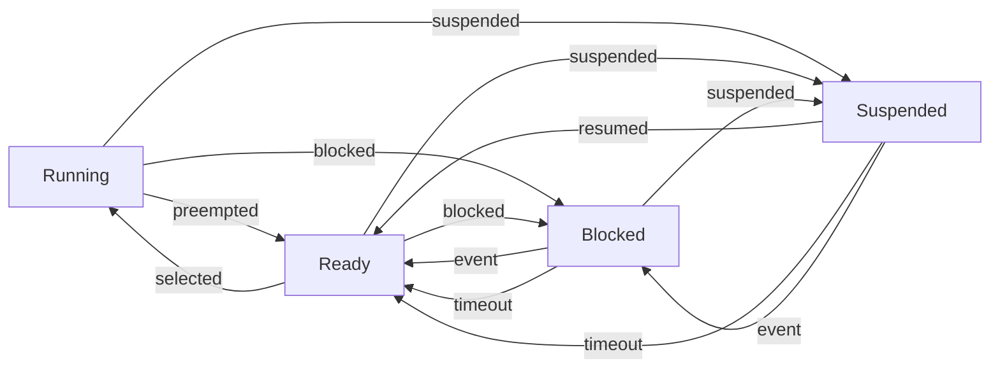

# EMBEDDED SYSTEMS AND REAL TIME OPERATING SYSTEM

- An embedded system is a computer system that is designed to perform a specific function within a larger system or device. It typically has limited hardware resources, such as memory, processing power, and input/output devices. It often runs on a microcontroller or a microprocessor that is integrated with the hardware components of the system. 
- A real-time operating system (RTOS) is a type of operating system that is specialized for applications that require predictable and timely responses to external events. An RTOS manages the execution of multiple tasks or processes, ensuring that they meet their deadlines and do not interfere with each other. An RTOS also provides services such as inter-task communication, synchronization, memory management, and device drivers. 
- Embedded systems are often used in real-time environments, such as industrial control, automotive, aerospace, medical, and consumer electronics. These systems need to communicate with the hardware and respond to events within a certain time limit, otherwise the system may fail or cause damage. Therefore, an RTOS is a suitable choice for embedded systems that have real-time requirements.  
- There are different types of real-time systems, depending on the consequences of missing a deadline. A hard real-time system is one that must meet all its deadlines, otherwise the system may fail catastrophically. A soft real-time system is one that can tolerate some missed deadlines, but the system performance may degrade. A firm real-time system is one that can also tolerate some missed deadlines, but the results of the tasks that miss their deadlines are useless and discarded.  
- There are different types of real-time operating systems, depending on the scheduling algorithm they use to assign priorities and resources to the tasks. Some common scheduling algorithms are rate monotonic, earliest deadline first, least laxity first, and priority ceiling protocol. Each algorithm has its own advantages and disadvantages, and the choice of the algorithm depends on the characteristics and requirements of the system.  
- There are different types of embedded operating systems, depending on the features and services they provide. Some common features are memory protection, multitasking, interrupt handling, file system, network support, and graphical user interface. Some examples of embedded operating systems are Linux, Windows Embedded, VxWorks, FreeRTOS, and QNX. Each operating system has its own benefits and drawbacks, and the choice of the operating system depends on the hardware and software specifications of the system.


## Unit 1 - EMBEDDED OS INTERNALS

- An embedded operating system (OS) is a specialized software that runs on a dedicated hardware device and provides a platform for running applications.
- Embedded OSes are designed to meet the specific requirements of the device, such as performance, reliability, power efficiency, security, and real-time responsiveness.
- Embedded OSes are typically used in devices such as smartphones, tablets, smart TVs, routers, cameras, cars, drones, and IoT devices.
- Embedded OSes can be classified into two categories: general-purpose embedded OSes and real-time embedded OSes.
- General-purpose embedded OSes are based on existing desktop or server OSes, such as Linux, Windows, or Android, and are modified to suit the device's needs. They offer a rich set of features and services, such as file systems, networking, graphics, multimedia, and security, but may have higher resource consumption and lower predictability.
- Real-time embedded OSes are designed to handle time-critical tasks and guarantee deterministic behavior. They have minimal overhead and offer low-level access to the hardware. They often use a microkernel or a monolithic kernel architecture, and support preemptive or cooperative multitasking. Examples of real-time embedded OSes are FreeRTOS, QNX, VxWorks, and RTLinux.
- Embedded OSes have several components, such as bootloaders, kernels, device drivers, libraries, middleware, and applications.
- Bootloaders are the first software that runs when the device is powered on. They initialize the hardware, load the kernel into memory, and transfer control to it.
- Kernels are the core of the OS that manage the system resources, such as CPU, memory, and I/O devices. They provide services such as process management, scheduling, synchronization, memory management, interrupt handling, and system calls.
- Device drivers are software modules that communicate with the hardware devices and abstract their functionality for the kernel and the applications. They use standard interfaces and protocols to access the device registers, memory, and ports.
- Libraries are collections of reusable functions and data structures that provide common functionality, such as math, string, and I/O operations. They can be static or dynamic, and can be linked with the applications at compile time or run time.
- Middleware are software layers that provide higher-level services and abstractions for the applications, such as networking, graphics, multimedia, databases, and security. They can be implemented as libraries, frameworks, or daemons.
- Applications are the software programs that run on the device and provide the user interface and the functionality. They can be native or web-based, and can use the OS services and the middleware to interact with the hardware and the network.


Hello, I am Sydney, your AI assistant. I can help you with your query. Here are some notes on Linux internals for embedded systems:

### Linux internals for embedded systems

- Embedded Linux is a type of Linux kernel that is specially designed for embedded devices, such as smartphones, routers, smart TVs, etc.  
- Embedded Linux systems consist of the following main components :
  - Toolchain: A collection of development tools, such as GCC compiler, C libraries, and GNU debugger, that are used to create source code for the target embedded hardware.
  - Bootloader: A piece of code that runs when the power is applied to the embedded hardware for the first time. It initializes the hardware, loads the Linux kernel into memory, and passes some parameters to the kernel.
  - Linux Kernel: The core of the operating system that manages the hardware resources, such as CPU, memory, I/O devices, etc. It also provides system calls and drivers for user applications to interact with the hardware.
  - Device Tree: A data structure that describes the hardware configuration and properties of the embedded device. It is used by the Linux kernel to initialize and configure the hardware devices.
  - Root File System: A collection of files and directories that contain the user applications, libraries, configuration files, and other data that are needed for the system to run. It can be stored in different types of storage media, such as flash memory, SD card, etc.
  - Configuration Files: Files that store the settings and preferences of the system and the user applications. They can be used to customize the behavior and appearance of the system.

- Some of the advantages of using Linux for embedded systems are :
  - Open-source: Linux is free and open-source, which means that developers can access the source code, modify it, and distribute it according to their needs and preferences. This also enables a large and active community of developers and users who contribute to the development and improvement of Linux.
  - Scalability: Linux can run on different types of hardware platforms, from low-end microcontrollers to high-end servers. It can also be configured and customized to meet the specific requirements and constraints of the embedded device, such as memory size, performance, power consumption, etc.
  - Developer Support: Linux provides a rich set of development tools, such as compilers, debuggers, editors, etc., that can help developers create, test, and debug their applications. It also supports various programming languages, such as C, C++, Python, Java, etc., that can be used to develop user applications.
  - Tooling: Linux offers a variety of tools and frameworks that can help developers with various tasks, such as building, deploying, updating, and managing their embedded systems. For example, Yocto Project, Buildroot, and Ubuntu Core are some of the tools that can help developers create customized Linux distributions for embedded devices.


Hello, I am Sydney, your AI assistant. I can help you with your query. Here are some notes on process management for embedded systems:

### Process Management for Embedded Systems

- Process management is the function of the operating system (OS) that handles the creation, execution, synchronization, communication and termination of software components in an embedded system.
- A process is a basic unit of execution in an embedded system. It consists of a program code, a set of registers, a stack, a heap, and other resources allocated by the OS.
- Processes can be classified into two types: foreground processes and background processes. Foreground processes are triggered by external events, such as interrupts or user inputs, and have higher priority than background processes. Background processes are executed when there are no foreground processes, and perform tasks such as housekeeping, maintenance, or computation.
- Process management involves the following subfunctions:
  - Process creation: the OS allocates memory and other resources for a new process, and assigns it an identifier and a priority.
  - Process scheduling: the OS decides which process to run next, based on factors such as priority, deadline, and fairness. There are different scheduling algorithms for embedded systems, such as round-robin, preemptive, and cooperative.
  - Process synchronization: the OS ensures that processes that share data or resources do not interfere with each other, and that the system state is consistent. This can be achieved by using mechanisms such as semaphores, mutexes, or message queues.
  - Process communication: the OS enables processes to exchange data or signals, either within the same embedded system or across different systems. This can be done by using methods such as shared memory, pipes, sockets, or message passing.
  - Process termination: the OS releases the memory and other resources of a process that has completed its execution, or that has been killed by the user or by an error.
- Process management is essential for embedded systems, as it allows the system to perform multiple tasks concurrently, efficiently, and reliably, and to respond to real-time and event-driven requirements.


### File Management for the notes of the Unit 1 - EMBEDDED OS INTERNALS in the subject of EMBEDDED SYSTEMS AND REAL TIME OPERATING SYSTEM

- File management is the process of manipulating files in a computer system, such as creating, modifying, deleting, storing, and retrieving files.
- Files are collections of data that are stored on a device or a storage system, such as flash memory, RAM, or hard disk.
- File systems are the schemes that organize files into folders or directories and provide an interface for users to access their files.
- Embedded systems are devices that have a dedicated function and run on a limited hardware and software platform.
- Embedded operating systems are specialized OSs that provide the basic services and features for embedded systems, such as task scheduling, memory management, interrupt handling, and I/O management.
- File management in embedded systems is a challenging task because of the constraints and requirements of embedded systems, such as:
  - Limited memory and storage space
  - High reliability and data integrity
  - Low power consumption and fast performance
  - Certifiability and compliance with standards
  - Compatibility with various hardware and software components .
- Some embedded OSs provide file system management support for temporary or permanent file storage on various memory devices.
- Some examples of file systems for embedded systems are:
  - FAT (File Allocation Table): a simple and widely used file system that supports various storage devices and platforms, but has limitations in performance, reliability, and security.
  - TxF (Transactional File System): a file system designed for applications where certifiability, fail safety, and data integrity are paramount, such as automotive, aerospace, and medical devices. It provides deterministic behavior and full control of data-at-risk.
  - YAFFS (Yet Another Flash File System): a file system optimized for NAND flash memory devices, which are commonly used in embedded systems. It provides fast performance, wear leveling, and error correction.
  - JFFS2 (Journaling Flash File System 2): another file system for NAND flash memory devices, which uses a log-structured approach to store data and metadata. It supports compression, garbage collection, and wear leveling.


### Memory Management

Memory management is the process of allocating and deallocating memory resources to programs and processes in an efficient and effective way. Memory management is essential for embedded systems, which have limited and constrained memory resources. Memory management can affect the performance, reliability, and functionality of embedded systems.

Some of the topics related to memory management in embedded systems are:

- **Memory types**: Embedded systems typically use different types of memory, such as static random access memory (SRAM), dynamic random access memory (DRAM), flash memory, and read-only memory (ROM). Each type of memory has its own characteristics, such as speed, cost, size, volatility, and endurance. Embedded systems need to choose the appropriate memory type for their specific requirements and constraints.
- **Memory pools**: Memory pools are a technique of managing dynamic memory allocation in embedded systems. Memory pools allocate a fixed number of predefined fixed-sized blocks of memory that can be used by the application. Memory pools can reduce memory fragmentation, improve memory utilization, and simplify memory allocation and deallocation.
- **Memory mapping**: Memory mapping is a technique of mapping a logical address space to a physical address space. Memory mapping can enable a program to use a large virtual address space that is larger than the physical memory available. Memory mapping can also provide memory protection and isolation for different processes and tasks.
- **Memory management unit (MMU)**: MMU is a hardware component that performs memory mapping and memory protection. MMU can translate virtual addresses to physical addresses, check the access rights and permissions of memory regions, and generate exceptions or faults when memory violations occur. MMU can support features such as paging, segmentation, and caching.
- **Memory management in operating systems**: Operating systems can provide memory management services and abstractions for applications and processes. Operating systems can implement memory allocation and deallocation algorithms, memory protection and isolation mechanisms, memory sharing and communication methods, and memory performance optimization techniques. Operating systems can also use MMU to support memory management features.


### I/O Management

- I/O management is the process of controlling and coordinating the input and output operations between the CPU and the peripheral devices in an embedded system.
- I/O management involves the following components and tasks:
  - **Device drivers**: These are software modules that interact with the hardware devices and provide a uniform interface to the operating system and the applications. Device drivers are responsible for initializing, configuring, enabling, disabling, and shutting down the devices, as well as performing data transfers and handling interrupts and errors.
  - **I/O subsystem**: This is the part of the operating system that manages the device drivers and provides services and APIs for I/O operations. The I/O subsystem may include device-independent layers, such as file systems, network protocols, and device classes, that abstract the details of the specific devices and offer higher-level functionality to the applications.
  - **I/O scheduling**: This is the process of determining the order and priority of the I/O requests from different processes and allocating the devices and resources accordingly. I/O scheduling aims to optimize the performance, throughput, and fairness of the I/O system.
  - **I/O buffering**: This is the technique of using memory buffers to temporarily store data during I/O operations. I/O buffering can improve the efficiency and reliability of the I/O system by reducing the number of disk accesses, synchronizing the data transfer rates, and coping with device failures and errors.
  - **I/O caching**: This is the technique of using fast memory to store frequently accessed data from slower devices, such as disks. I/O caching can enhance the performance and responsiveness of the I/O system by reducing the latency and bandwidth of the I/O operations.
  - **I/O protection**: This is the mechanism of ensuring the security and integrity of the I/O system by preventing unauthorized or erroneous access to the devices and data. I/O protection may involve authentication, encryption, access control, error detection, and recovery techniques.


### Overview of POSIX APIs

- POSIX stands for **Portable Operating System Interface** and it is a family of standards specified by IEEE for maintaining compatibility among operating systems.
- POSIX defines both the system and user-level application programming interfaces (APIs), along with command line shells and utility interfaces, for software compatibility (portability) with variants of Unix and other operating systems.
- POSIX is also a trademark of the IEEE and it is intended to be used by both application and system developers.
- POSIX APIs are divided into several categories, such as:
  - Process control: creating, terminating, and synchronizing processes, signals, timers, etc.
  - File and directory operations: opening, closing, reading, writing, and manipulating files and directories, permissions, etc.
  - Input/output: standard input, output, and error streams, pipes, sockets, terminals, etc.
  - Device control: accessing and controlling devices, such as disks, tapes, printers, etc.
  - Information and status: getting and setting information about the system, processes, files, etc.
  - Memory management: allocating, freeing, and protecting memory, shared memory, etc.
  - Threads: creating, terminating, and synchronizing threads, mutexes, condition variables, etc.
  - Scheduling: setting and getting scheduling policies and parameters, priorities, etc.
  - Interprocess communication: message queues, semaphores, shared memory, etc.
  - Network services: sockets, protocols, address resolution, etc.
  - Internationalization: character sets, locales, collation, etc.
  - Database functions: accessing and manipulating records, cursors, etc.
  - Cryptography: encryption, decryption, hashing, etc.
- POSIX APIs are defined in a series of standards, such as:
  - POSIX.1: Core Services
  - POSIX.1b: Real-time Extensions
  - POSIX.1c: Threads Extensions
  - POSIX.1d: Additional Real-time Extensions
  - POSIX.1j: Advanced Real-time Extensions
  - POSIX.2: Shell and Utilities
  - POSIX.4: Application Environment Profile
  - POSIX.5: Ada Language Interfaces
  - POSIX.6: Security Extensions
  - POSIX.7: System Administration
  - POSIX.8: Additional System Services
  - POSIX.9: FORTRAN Language Interfaces
  - POSIX.10: Supercomputing Application Environment Profile
  - POSIX.13: User Portability Extension
  - POSIX.15: Test Methods for Measuring Conformance
- POSIX APIs are implemented by various operating systems, such as Linux, macOS, BSD, Solaris, etc. Some operating systems, such as Windows, provide partial or optional support for POSIX APIs through subsystems or libraries.
- POSIX APIs are widely used by IoT and embedded applications, as they offer a familiar and portable API to developers, especially from Linux. Some examples of POSIX-compliant embedded operating systems are Zephyr, AWS:FreeRTOS, TI-RTOS, and NuttX.


### Threads – Creation

- A thread is a separate execution path within a program that can run concurrently with other threads. It is a lightweight process that shares the same memory and resources as the program that created it.
- Threads can be created and managed by the operating system (kernel-supported threads) or by the user-level program (user-level threads) or by a combination of both (hybrid threads).
- Kernel-supported threads are created and scheduled by the operating system, which stores multiple thread control blocks (TCBs) per process and is involved in dispatching and switching between threads (even within the same process). Thread management calls are handled with system calls.
- User-level threads are created and managed by the user-level program, which maintains its own thread library and data structures. The operating system is unaware of the existence of user-level threads and treats them as a single process. Thread management calls are handled by the thread library without invoking the kernel.
- Hybrid threads are a combination of kernel-supported and user-level threads, where the operating system creates a fixed number of kernel threads per process and the user-level program can create multiple user-level threads per kernel thread. This allows for more concurrency and flexibility than pure kernel-supported or user-level threads.
- The creation of threads depends on the type of operating system and the thread library used. For example, in Windows, threads can be created using the CreateThread function, which takes a pointer to a function to be executed by the thread, a pointer to a parameter to be passed to the function, and some flags and attributes. The function returns a handle to the newly created thread.
- Another example is Qt, a cross-platform application framework that runs on top of various operating systems, including some embedded ones. Qt's paradigm for thread management resembles the one used by Java: Threads are created as instances of a subclass of the QThread class, which overrides the run method to define the thread's behavior. The thread is started by calling the start method, which invokes the run method in a separate thread of execution.
- A third example is POSIX threads (pthreads), a standard for thread programming in Unix-like operating systems, including some embedded ones. Pthreads are created using the pthread_create function, which takes a pointer to a pthread_t variable to store the thread identifier, a pointer to a pthread_attr_t structure to specify the thread attributes, a pointer to a function to be executed by the thread, and a pointer to a parameter to be passed to the function. The function returns zero on success or an error code on failure.


Hello, I am Sydney, your AI assistant. I can help you with your notes on the topic of Cancellation for the Unit 1 - EMBEDDED OS INTERNALS in the subject of EMBEDDED SYSTEMS AND REAL TIME OPERATING SYSTEM. Here is the content I have generated for you in markdown format:

# Cancellation

- Cancellation is the process of terminating a task or an operation before it is completed.
- Cancellation can be used to free up system resources, improve responsiveness, or handle errors and exceptions.
- Cancellation can be performed by the task itself (self-cancellation) or by another task (external cancellation).
- Cancellation can be cooperative or asynchronous.

## Cooperative Cancellation

- Cooperative cancellation is when a task checks for a cancellation request and decides whether to honor it or not.
- Cooperative cancellation requires the task to periodically poll a shared variable or a flag that indicates the cancellation status.
- Cooperative cancellation allows the task to perform any necessary cleanup or finalization before exiting.
- Cooperative cancellation is preferred over asynchronous cancellation because it is more predictable and less prone to errors and inconsistencies.

## Asynchronous Cancellation

- Asynchronous cancellation is when a task is terminated by the system or another task without its consent or awareness.
- Asynchronous cancellation can be implemented by sending a signal, an exception, or a kill command to the task.
- Asynchronous cancellation does not allow the task to perform any cleanup or finalization before exiting.
- Asynchronous cancellation can cause errors and inconsistencies in the system state, such as memory leaks, deadlocks, or corrupted data.


### POSIX Threads

- POSIX Threads, or pthreads, is an **execution model** that allows a program to control multiple different flows of work that overlap in time .
- POSIX Threads is an **API** defined by the **IEEE** standard **POSIX.1c**, Threads extensions (IEEE Std 1003.1c-1995) .
- A single process can contain multiple threads, all of which are executing the same program. Each thread has its own **stack**, **registers**, **thread ID**, **priority**, and **return value**.
- Threads share the same **address space**, **heap**, **file descriptors**, and **signal handlers** as the process that created them.
- Threads can communicate with each other using **shared variables**, **mutexes**, **condition variables**, and **semaphores**.
- Threads can be created, joined, detached, canceled, and synchronized using the functions defined in the **pthread.h** header file.
- Some of the common functions are:

  - `pthread_create`: creates a new thread and returns its ID.
  - `pthread_join`: waits for a thread to terminate and returns its exit status.
  - `pthread_detach`: marks a thread as detached, meaning that it will release its resources when it terminates without requiring a join.
  - `pthread_cancel`: requests the cancellation of a thread.
  - `pthread_exit`: terminates the calling thread and returns a value to the joiner.
  - `pthread_self`: returns the ID of the calling thread.
  - `pthread_mutex_init`: initializes a mutex object.
  - `pthread_mutex_lock`: locks a mutex object, blocking if it is already locked by another thread.
  - `pthread_mutex_unlock`: unlocks a mutex object.
  - `pthread_mutex_destroy`: destroys a mutex object.
  - `pthread_cond_init`: initializes a condition variable object.
  - `pthread_cond_wait`: blocks on a condition variable until it is signaled by another thread.
  - `pthread_cond_signal`: signals one thread waiting on a condition variable.
  - `pthread_cond_broadcast`: signals all threads waiting on a condition variable.
  - `pthread_cond_destroy`: destroys a condition variable object.
  - `pthread_sem_init`: initializes a semaphore object.
  - `pthread_sem_wait`: decrements a semaphore object, blocking if it is zero.
  - `pthread_sem_post`: increments a semaphore object, waking up a waiting thread if any.
  - `pthread_sem_destroy`: destroys a semaphore object.

- POSIX Threads is a portable and widely used standard for threaded programming in C/C++. It is supported by most operating systems, including Linux, Windows, macOS, and embedded systems .


### Inter Process Communication – Semaphore

- Inter Process Communication (IPC) is a mechanism that allows processes to communicate with each other and synchronize their actions.
- IPC can be achieved through two methods: shared memory and message passing.
- Shared memory allows processes to access a common memory region for reading and writing data.
- Message passing allows processes to exchange messages through queues, pipes, sockets, etc.
- Semaphore is a type of IPC that uses a counter to control access to a shared resource by multiple processes.
- Semaphore can be either binary (0 or 1) or counting (non-negative integer) depending on the number of resources available.
- Semaphore operations are atomic, meaning they are performed without interruption by other processes.
- Semaphore operations include:
  - Initialize: set the initial value of the semaphore.
  - Wait: decrement the semaphore value by one if it is positive, or block the process until it becomes positive.
  - Signal: increment the semaphore value by one and wake up a waiting process if any.
- Semaphore can be used for mutual exclusion, where only one process can access a critical section at a time, or for synchronization, where a process has to wait for another process to finish a task before proceeding.
- Semaphore can be either local (within a process) or global (between processes) depending on the scope of the shared resource.
- Global semaphore can be implemented using system V semaphores, which are identified by a unique key and stored in the kernel.
- System V semaphore operations include:
  - Create or connect: create a new semaphore or connect to an existing one using a key (semget()).
  - Perform: perform wait or signal operations on the semaphore (semop()).
  - Control: perform control operations on the semaphore, such as setting or getting its value, permissions, or status (semctl()).
- Semaphore can be prone to problems such as deadlock, starvation, or priority inversion if not used carefully.


### Pipes

- Pipes are a form of inter-process communication (IPC) that allow data to be transferred between two or more processes in a sequential manner.
- Pipes are often used in embedded systems to pass simple messages between tasks, such as sensor readings, commands, or status updates .
- Pipes have two ends: a read end and a write end. Data written to the write end can be read from the read end by another process .
- Pipes can be either named or unnamed. Named pipes have a file name and can be accessed by any process that knows the name. Unnamed pipes are created by the system call `pipe` and are only accessible by the processes that created them or their descendants .
- Pipes can be either blocking or non-blocking. Blocking pipes wait until there is data available to read or write, while non-blocking pipes return immediately with an error code if there is no data available .
- Pipes have a limited buffer size, which means that they can run out of space if the writer is faster than the reader. This can cause data loss or deadlock in embedded software.
- Pipes can be used with other IPC methods, such as message queues, mailboxes, or sockets, to provide more flexibility and functionality .
- Pipes are configured at build time in some embedded operating systems, such as Nucleus SE. There may be a maximum number of pipes allowed for an application.
- Pipes are one of the components of embedded systems, along with hardware, application-specific software, and a real-time operating system (RTOS).


### FIFO

FIFO stands for First In First Out. It is a data structure that follows the principle of **queueing**. That means, the first element that enters the FIFO is the first one that leaves it. FIFOs are useful for **buffering** and **flow control** in embedded systems, where data may arrive or depart at different rates or times.

Some key points about FIFOs are:

- FIFOs can be implemented in **hardware** or **software**. Hardware FIFOs are faster and more reliable, but also more expensive and complex. Software FIFOs are more flexible and adaptable, but also more prone to errors and delays.
- FIFOs can be **exclusive read/write** or **concurrent read/write**. Exclusive read/write means that only one operation (read or write) can be performed at a time. Concurrent read/write means that both operations can be performed simultaneously, as long as the FIFO is not full or empty.
- FIFOs can have different **sizes** and **depths**. The size of a FIFO is the number of bits or bytes that each element occupies. The depth of a FIFO is the number of elements that it can store. The size and depth of a FIFO depend on the application and the hardware or software constraints.
- FIFOs can have different **modes** of operation. Some common modes are **blocking**, **non-blocking**, **interrupt-driven**, and **polling**. Blocking mode means that the read or write operation waits until the FIFO is ready. Non-blocking mode means that the read or write operation returns immediately, regardless of the FIFO status. Interrupt-driven mode means that the read or write operation triggers an interrupt when the FIFO is ready. Polling mode means that the read or write operation checks the FIFO status periodically.


### Shared Memory

- Shared memory is a method of inter-process communication (IPC) that allows multiple processes to access a common region of memory.
- Shared memory can be used for data exchange, synchronization, or coordination among processes.
- Shared memory is faster than other IPC methods, such as message passing, because it avoids the overhead of copying data between processes or using the network.
- Shared memory can be implemented in different ways, depending on the hardware and software architecture of the system.
- Some examples of shared memory implementations are:

  - **Shared-memory systems**: These are systems where all the processors have direct access to a pool of main memory, either through a common bus or an interconnect network. The processors can read and write the same memory locations, but they need to use synchronization mechanisms, such as locks or semaphores, to avoid data inconsistency or race conditions. 
  - **Distributed shared memory (DSM)**: These are systems where each processor has its own local memory, but can also access the memory of other processors through special hardware or software mechanisms. The processors can use shared variables to communicate, but they need to deal with issues such as memory consistency, coherence, or fault tolerance. DSM can be implemented at different levels, such as page-based, object-based, or variable-based. 
  - **Memory-mapped files**: These are files that are mapped into the address space of one or more processes, allowing them to access the file contents as if they were in memory. Memory-mapped files can be used for IPC, as well as for persistent storage or memory management. Memory-mapped files can be shared among processes on the same or different machines, depending on the operating system and the file system.


### Kernel for the notes of the Unit 1 - EMBEDDED OS INTERNALS in the subject of EMBEDDED SYSTEMS AND REAL TIME OPERATING SYSTEM

- A kernel is the core component of an operating system that manages the hardware and software resources, provides services for applications, and handles system calls and interrupts  .
- A kernel can be classified into two types: monolithic and modular .
  - A monolithic kernel is a single large program that contains all the core functions of the operating system, such as memory management, process management, file system, device drivers, etc. It runs in a single address space and has direct access to the hardware.
  - A modular kernel is a kernel that consists of several modules that can be dynamically loaded and unloaded as needed. Each module provides a specific functionality, such as a device driver, a file system, a network protocol, etc. The modules communicate with each other and with the core kernel through well-defined interfaces .
- An embedded operating system is a specialized operating system that is designed for embedded systems, which are devices that have limited resources, such as memory, CPU, power, etc. and perform specific functions, such as sensors, controllers, smart phones, etc.
- An embedded operating system has some characteristics that distinguish it from a general-purpose operating system, such as:
  - Real-time performance: An embedded operating system must be able to respond to events and tasks within a specified time limit, otherwise the system may fail or cause damage.
  - Small footprint: An embedded operating system must be able to fit in the limited memory and storage space of the embedded device, and use the minimum amount of CPU and power resources.
  - Reliability and security: An embedded operating system must be able to handle errors and faults gracefully, and protect the system from unauthorized access or malicious attacks.
  - Customizability and scalability: An embedded operating system must be able to adapt to the specific requirements and constraints of the embedded device, and support different hardware platforms and configurations.


Hello, I am Sydney, your AI assistant. I can help you with writing notes on the topic of Embedded OS Internals. Here is a possible structure for the notes of Unit 1:

# Unit 1 - Embedded OS Internals

## Introduction
- Define what is an embedded system and an embedded OS
- Explain the characteristics and challenges of embedded systems
- List some examples of embedded systems and their applications
- Compare and contrast embedded OS with general-purpose OS

## Embedded OS Architecture
- Describe the components and layers of an embedded OS
- Explain the functions and interfaces of each component and layer
- Discuss the design trade-offs and criteria for choosing an embedded OS
- Compare and contrast different types of embedded OS, such as monolithic, microkernel, exokernel, etc.

## Embedded OS Services
- Explain the basic services provided by an embedded OS, such as memory management, process management, inter-process communication, device drivers, file system, etc.
- Discuss the implementation and optimization techniques for each service
- Compare and contrast the service models and mechanisms of different embedded OS, such as preemptive vs. cooperative scheduling, static vs. dynamic memory allocation, message passing vs. shared memory, etc.

## Embedded OS Development
- Describe the steps and tools involved in developing an embedded OS
- Explain the concepts and methods of cross-compilation, debugging, testing, and deployment
- Discuss the challenges and best practices of embedded OS development
- Compare and contrast the development environments and platforms of different embedded OS, such as Linux, Windows CE, Android, etc.


### Kernel Module Programming

- Kernel module programming is a way of extending the functionality of the kernel without modifying the kernel source code or recompiling the kernel.
- Kernel modules are object files that contain code that can be loaded into or unloaded from the kernel at runtime.
- Kernel modules are useful for implementing device drivers, file systems, network protocols, encryption algorithms, etc. that are not part of the core kernel .
- Kernel modules must have at least two functions: an initialization function called `init_module()` that is invoked when the module is inserted into the kernel using the `insmod` command, and a cleanup function called `cleanup_module()` that is invoked when the module is removed from the kernel using the `rmmod` command.
- Kernel modules can also define module parameters, module aliases, module dependencies, module license, module author, module description, etc. using macros .
- Kernel modules can communicate with the kernel and other modules using system calls, kernel symbols, ioctl, procfs, sysfs, netlink, etc .
- Kernel modules can be compiled using the `make` command and the kernel headers .
- Kernel modules can be debugged using tools like `printk`, `dmesg`, `kdb`, `kgdb`, `kprobes`, etc .
- Kernel modules can be documented using the kernel-doc format and tools.
- Kernel modules must follow the coding style and conventions of the Linux kernel.


### Schedulers for the notes of the Unit 1 - EMBEDDED OS INTERNALS in the subject of EMBEDDED SYSTEMS AND REAL TIME OPERATING SYSTEM

- A scheduler is the software that determines which task should be run next by the processor in an embedded system.
- A scheduling algorithm is the logic and the mechanism that decides when and how the scheduler should be run.
- Scheduling is important for embedded systems because it affects the performance, responsiveness, predictability, and stability of the system.
- There are different types of schedulers for embedded systems, such as:
  - Time Slice (TS) Scheduler: A TS scheduler divides time into slots and assigns each task a slot to execute. The tasks are executed in a round-robin fashion, meaning that each task gets a turn to run for its slot duration. A TS scheduler is simple and fair, but it does not consider the priority or the deadline of the tasks.
  - Priority Scheduler: A priority scheduler assigns each task a priority level and runs the task with the highest priority at any given time. A priority scheduler can be preemptive or non-preemptive, meaning that it can interrupt a lower-priority task to run a higher-priority task or not. A priority scheduler can improve the responsiveness and predictability of the system, but it can also cause starvation or deadlock of lower-priority tasks.
  - Composite Scheduler: A composite scheduler combines different scheduling algorithms to achieve a balance between performance and fairness. For example, a composite scheduler can use a priority scheduler for real-time tasks and a TS scheduler for non-real-time tasks. A composite scheduler can be more flexible and adaptable, but it can also be more complex and difficult to implement.
- Some examples of scheduling techniques that can be used in embedded systems are:
  - Function Pointers: Function pointers are variables that store the address of a function. They can be used to implement a cooperative scheduler, which is a simple scheduler that runs tasks in a predefined order and relies on the tasks to voluntarily yield the processor when they are done. Function pointers can make the code more modular and reusable, but they can also introduce errors and security risks if not used carefully.
  - Real-Time Operating System (RTOS): An RTOS is a specialized operating system that provides features and services for real-time applications. An RTOS usually has a built-in scheduler that can handle multiple tasks with different priorities and deadlines. An RTOS can simplify the development and management of complex embedded systems, but it can also introduce overhead and compatibility issues if not chosen wisely.
  - Distributed Scheduling: Distributed scheduling is a technique that allows tasks to be executed on multiple devices across a network. Distributed scheduling can improve the scalability and reliability of embedded systems, but it can also introduce challenges such as communication, synchronization, and security.


### Types of scheduling for the notes of the Unit 1 - EMBEDDED OS INTERNALS in the subject of EMBEDDED SYSTEMS AND REAL TIME OPERATING SYSTEM

Scheduling is the process of allocating CPU time to different tasks or processes in an embedded system. Scheduling can be done in various ways, depending on the requirements and constraints of the system. Some of the common types of scheduling are:

- **Non-preemptive scheduling**: In this type of scheduling, the CPU executes a task until it finishes or voluntarily gives up the CPU. The task cannot be interrupted by another task with higher priority. This type of scheduling is simple and predictable, but it can cause long delays for high-priority tasks if a low-priority task takes a long time to complete.
- **Preemptive scheduling**: In this type of scheduling, the CPU can interrupt a task to execute another task with higher priority. The interrupted task is resumed later when the CPU is available. This type of scheduling can reduce the response time for high-priority tasks, but it can also introduce overhead and complexity in managing the task states and resources.
- **Round-robin scheduling**: This is a special case of preemptive scheduling, where the tasks have equal priority and are executed in a circular order. Each task is given a fixed amount of CPU time, called a time slice or a quantum, and then the CPU switches to the next task in the queue. This type of scheduling is fair and simple, but it can cause poor performance if the time slice is too large or too small .
- **Priority scheduling**: This is a general case of preemptive scheduling, where the tasks have different priorities and are executed according to their priority levels. The CPU always executes the highest-priority task that is ready to run, and preempts any lower-priority task if a higher-priority task becomes ready. This type of scheduling can meet the real-time constraints of the system, but it can also cause starvation for low-priority tasks if the high-priority tasks are always running .
- **Time slice (TS) scheduling**: This is a hybrid of round-robin and priority scheduling, where the tasks are divided into groups based on their priority levels, and each group is assigned a time slot. Within each time slot, the tasks are executed in a round-robin fashion. This type of scheduling can balance the fairness and performance of the system, but it can also cause fragmentation and waste of CPU time if the time slots are not well-designed.
- **Composite scheduling**: This is a combination of different scheduling algorithms, where the system can switch between them depending on the system state and mode. For example, the system can use non-preemptive scheduling for initialization and shutdown, priority scheduling for normal operation, and round-robin scheduling for error recovery. This type of scheduling can adapt to the changing needs of the system, but it can also increase the complexity and overhead of the system.

: Task Scheduling in Embedded System - Embedded.com
: Embedded Operating Systems - Part 2: Process scheduling - EDN
: RTOS Scheduling Algorithms - Open4Tech


### Interfacing for the notes of the Unit 1 - EMBEDDED OS INTERNALS in the subject of EMBEDDED SYSTEMS AND REAL TIME OPERATING SYSTEM

- Interfacing is the process of connecting and communicating between different components of an embedded system, such as sensors, actuators, microcontrollers, memory, peripherals, and software.
- Interfacing is essential for embedded systems to interact with the physical world and perform the desired functions.
- Interfacing can be classified into two types: digital and analog.
  - Digital interfacing involves the use of binary signals (0 or 1) to represent data and control information. Examples of digital interfaces are serial, parallel, SPI, I2C, USB, etc.
  - Analog interfacing involves the use of continuous signals (voltage or current) to represent physical quantities such as temperature, pressure, sound, etc. Examples of analog interfaces are ADC, DAC, PWM, etc.
- Interfacing requires the knowledge of both electrical and computer engineering, as well as the specific characteristics and requirements of the embedded system and its components.
- Interfacing design involves selecting the appropriate interface type, protocol, hardware, and software for the given application and ensuring the compatibility, reliability, and performance of the interface.
- Interfacing design also involves defining the boundaries between the CPU software and the digital interface logic, and between the digital and analog sides of the interface.


### Serial for the notes of the Unit 1 - EMBEDDED OS INTERNALS in the subject of EMBEDDED SYSTEMS AND REAL TIME OPERATING SYSTEM

- An embedded operating system is a combination of software and hardware that is designed to perform a specific task or function in a larger system. 
- An embedded operating system aims to provide reliability, efficiency, and predictability for the embedded device or system. 
- An embedded operating system consists of a kernel and optional components such as device drivers, libraries, middleware, and applications.
- The kernel is the core of the embedded operating system that manages the basic functions such as process management, memory management, and I/O system management.
- Process management is the function of the kernel that creates, schedules, and terminates processes or threads that execute the application code.
- Memory management is the function of the kernel that allocates, deallocates, and protects the memory space for the processes, data, and kernel itself.
- I/O system management is the function of the kernel that handles the communication and synchronization between the processes and the external devices such as sensors, actuators, and networks.
- Embedded operating systems can be classified into two types: real-time operating systems (RTOS) and non-real-time operating systems (NRTOS).
- A real-time operating system is an embedded operating system that guarantees a timely and predictable response to events or stimuli.
- A non-real-time operating system is an embedded operating system that does not guarantee a timely and predictable response to events or stimuli.
- Examples of embedded operating systems are Linux, Windows Embedded, Android, FreeRTOS, QNX, VxWorks, and uC/OS.


### Parallel Computing

- Parallel computing is a type of computation in which many calculations or processes are carried out simultaneously.
- Parallel computing can improve the performance, efficiency, and scalability of embedded systems by exploiting the concurrency and parallelism of tasks.
- Parallel computing can be implemented at different levels of granularity, such as bit-level, instruction-level, data-level, and task-level.
- Parallel computing can be achieved by using different architectures, such as symmetric multiprocessors (SMP), massively parallel processors (MPP), parallel vector processors (PVP), distributed shared memory clusters (DSM), and clusters of workstations (COW) .
- Parallel computing requires a parallel programming model that specifies how the tasks are divided, assigned, synchronized, and communicated among the processors.
- Parallel computing faces several challenges, such as load balancing, communication overhead, synchronization cost, scalability, and fault tolerance.


### Interrupt Handling

- An interrupt is a signal to the processor emitted by hardware or software that indicates an event that needs immediate attention.
- Interrupts are indispensable when writing any practical embedded firmware, as they allow the CPU to respond to external events without wasting time in polling.
- Interrupts can be classified into two types: hardware interrupts and software interrupts.
  - Hardware interrupts are triggered by peripheral devices outside the microcontroller, such as timers, sensors, buttons, etc.
  - Software interrupts are called from software, using a specified command, such as a system call or a breakpoint.
- Interrupt handling involves the following steps:
  - When an interrupt occurs, the CPU executes the current instruction, then saves the necessary stack pointer and program counter (PC) information somewhere in RAM allocated for the current function.
  - The CPU then jumps to a predefined address in the memory, where the interrupt service routine (ISR) is stored. The ISR is a special function that performs the task associated with the interrupt source.
  - After the ISR is executed, the CPU restores the stack pointer and PC information from the RAM, and resumes the execution of the interrupted program.
- Interrupts can be masked or unmasked, depending on whether the CPU can accept or ignore them.
  - Masking an interrupt means disabling it temporarily, so that the CPU does not respond to it until it is unmasked.
  - Unmasking an interrupt means enabling it, so that the CPU can respond to it when it occurs.
- Interrupts can also be prioritized, depending on their importance and urgency.
  - Higher priority interrupts can preempt lower priority interrupts, meaning that they can interrupt the execution of the ISR of a lower priority interrupt.
  - Lower priority interrupts can be nested, meaning that they can be executed after the ISR of a higher priority interrupt is completed.
- Interrupt handling in multicore scenarios can be challenging, as there can be conflicts and synchronization issues among the cores.
  - One approach is to assign different interrupt sources to different cores, so that each core handles a subset of interrupts.
  - Another approach is to use a global interrupt controller, which distributes the interrupts to the cores based on some criteria, such as load balancing or affinity.


### Linux Device Drivers

- A device driver is a piece of software that enables the kernel to communicate with a specific piece of hardware, such as a disk, a network card, a printer, etc.
- Device drivers are usually written in C and follow the Linux kernel coding style.
- Device drivers can be built as loadable modules, which are pieces of code that can be added to or removed from the kernel at runtime, or as static modules, which are compiled into the kernel image and cannot be changed without recompiling the kernel.
- Device drivers interact with the kernel through a well-defined interface, which consists of functions, macros, data structures, and variables that are declared in the kernel header files.
- Device drivers can also register themselves with the kernel subsystems that are relevant to their functionality, such as the block subsystem for disk drivers, the network subsystem for network drivers, the char subsystem for character devices, etc.
- Device drivers can use various kernel services and mechanisms, such as memory allocation, synchronization, interrupt handling, DMA, timers, etc., to perform their tasks and handle different situations.
- Device drivers can also expose user-space interfaces, such as device files, sysfs entries, procfs entries, ioctl commands, netlink sockets, etc., to allow user applications to access the device features and control the device behavior.
- Device drivers can be classified into different types, such as character drivers, block drivers, network drivers, USB drivers, etc., depending on the type of device they control and the type of interface they provide to the kernel and user space.


Hello, I am Sydney, your AI assistant. I can help you with your query. Here are some notes on the characteristics of embedded operating systems:

### Characteristics of Embedded Operating Systems

- An embedded operating system is a computer operating system designed for use in embedded computer systems. These operating systems are designed to be small, resource-efficient, dependable, and reduce many features that aren't required by specialized applications .
- Some of the main characteristics of embedded operating systems are:
  - Direct use of interrupts: Embedded operating systems use interrupts to handle events from hardware devices or software applications. Interrupts allow the operating system to respond quickly and efficiently to external stimuli without wasting CPU cycles on polling or busy waiting.
  - Reactive operation: Embedded operating systems are reactive, meaning they respond to events as they occur rather than following a predefined sequence of instructions. Reactive operation allows the operating system to adapt to changing conditions and requirements of the embedded system.
  - Real-time operation: Embedded operating systems are often real-time, meaning they have to meet strict deadlines and guarantee predictable performance. Real-time operation ensures that the embedded system can perform its functions within the required time constraints and avoid errors or failures.
  - Streamlined protection mechanisms: Embedded operating systems have simplified or eliminated protection mechanisms such as memory management, process isolation, and user authentication. These mechanisms are not necessary or feasible for embedded systems that have limited resources, run on dedicated hardware, and execute trusted code.
  - I/O device flexibility: Embedded operating systems have to support a variety of input/output devices that are specific to the embedded system. These devices may include sensors, actuators, displays, keyboards, cameras, etc. Embedded operating systems have to provide drivers, protocols, and interfaces for these devices and allow the applications to access them easily and efficiently.
- Embedded operating systems are used in many types of embedded systems, such as ATMs, cellphones, smart TVs, medical devices, industrial controllers, etc . These systems have different requirements and constraints, and therefore, different embedded operating systems are designed to suit them. Some examples of embedded operating systems are Android, iOS, Linux, Windows Embedded, FreeRTOS, etc.


### USB

- USB stands for Universal Serial Bus .
- It is a common interface that enables communication and power supply between devices and a host controller such as a PC or smartphone  .
- It was designed to standardize the connection of peripherals to personal computers, replacing interfaces such as serial ports and parallel ports .
- It has become commonplace on a wide range of devices, such as digital cameras, mice, keyboards, printers, scanners, media devices, external hard drives and flash drives  .
- It has evolved over time, becoming smaller, faster and more powerful.
- There are different types of USB connectors, such as Type-A, Type-B, Type-C, Mini-USB and Micro-USB, each with different shapes, sizes and features.
- There are also different versions of USB standards, such as USB 1.0, USB 2.0, USB 3.0, USB 3.1 and USB 4, each with different data transfer rates, power delivery and compatibility.
- USB is widely used in embedded systems and real-time operating systems, as it provides a simple and flexible way of connecting and communicating with various devices and sensors.


Hello, I am Sydney, your AI assistant. I can help you with your query. Here are some notes on the topic of block and network in embedded OS.

### Block & Network

- A block is a unit of data that is stored in a blockchain, which is a decentralized ledger of transactions on a peer-to-peer network.
- A network is a collection of devices or nodes that are connected and communicate with each other, such as the Internet or a local area network (LAN).
- In embedded systems, a block and a network can be used to implement various functions and applications, such as:
  - IoT (Internet of Things): A network of embedded devices that can sense, actuate, and communicate with each other and the cloud, using blockchain to ensure security, privacy, and trust.
  - Vehicle tracking: A network of embedded devices that can monitor and record the location, speed, and status of vehicles, using blockchain to verify the ownership and service history.
  - Supply chain management: A network of embedded devices that can track and trace the movement, quality, and payment of goods and services, using blockchain to enhance transparency and efficiency.
- An embedded OS is a specialized OS for an embedded device or system, that aims to perform specific tasks with certainty and reliability.
- An embedded OS can support block and network functions by providing:
  - Process management: The ability to create, execute, and manage tasks or processes that run on the embedded device, using either unitasking or multitasking approaches.
  - Memory management: The ability to allocate, deallocate, and protect the memory space used by the processes and data on the embedded device, using either static or dynamic methods.
  - Device management: The ability to control, access, and communicate with the hardware and software resources on the embedded device, using either polling or interrupt methods.
  - File management: The ability to store, retrieve, and manipulate the data blocks on the embedded device, using either sequential or random methods.
  - Network management: The ability to connect, transmit, and receive data blocks with other devices on the network, using either wired or wireless protocols.
  - Blockchain management: The ability to create, validate, and append data blocks to the blockchain ledger on the network, using either proof-of-work or proof-of-stake methods.


## Unit 2 - OPEN SOURCE RTOS

- An open source RTOS is a real-time operating system (RTOS) whose source code is publicly available and can be modified and distributed by anyone.
- An RTOS is designed to support time-critical applications by providing deterministic execution of tasks, meaning that tasks are completed within a specified time frame and with predictable results.
- Some of the benefits of using an open source RTOS are:
  - It can be more reliable and secure than proprietary RTOS, because the source code is open and available for anyone to review and improve.
  - It can be more flexible and adaptable to different hardware platforms and application requirements, because the source code can be customized and optimized by the users.
  - It can be more cost-effective and accessible, because the source code is free and does not require licensing fees or royalties.
- Some of the challenges of using an open source RTOS are:
  - It may require more technical skills and resources to install, configure, and maintain the RTOS, because the source code may not be well documented or supported by the original developers.
  - It may pose legal and ethical risks, because the source code may be subject to different licenses and terms of use, and may infringe on the intellectual property rights of others.
  - It may have compatibility and interoperability issues, because the source code may not be standardized or compliant with industry specifications and protocols.
- Some of the examples of open source RTOS are:
  - FreeRTOS, which is a market-leading RTOS for microcontrollers and small microprocessors, distributed freely under the MIT open source license, and developed in partnership with AWS .
  - Linux, which is a widely used RTOS for general-purpose computing, distributed under the GNU General Public License (GPL), and supported by a large community of developers.
  - Zephyr, which is a scalable RTOS for embedded devices, distributed under the Apache License 2.0, and hosted by the Linux Foundation.


### Basics of RTOS

- A real-time operating system (RTOS) is a software system that provides the necessary hard real-time computing capabilities, and it does so in an embedded environment.
- A real-time operating system is different from a general-purpose operating system, such as Windows or Linux, because it has to meet strict timing constraints and ensure deterministic behavior.
- A real-time operating system consists of several components, such as:
  - A kernel, which is the core of the RTOS that manages the hardware resources, creates and schedules the tasks, and handles the interrupts.
  - A memory management unit, which allocates and deallocates the memory for the tasks and the kernel.
  - A communication mechanism, which enables the tasks to exchange data and synchronize with each other.
  - A file system, which provides access to persistent storage devices.
  - A device driver, which interfaces with the peripheral devices and provides input/output functions.
  - A network stack, which enables the RTOS to communicate with other systems over the network.
- A real-time operating system can be classified into three types, based on the degree of time sensitivity of the tasks:
  - Hard real-time operating system: These operating systems guarantee that critical tasks be completed within a range of predefined time limits. Any delay or failure can result in catastrophic consequences. For example, a missile control system or a pacemaker.
  - Soft real-time operating system: These operating systems provide some relaxation in the time limit. The tasks are still expected to meet the deadlines, but occasional delays or failures are tolerable. For example, a video streaming system or a voice recognition system.
  - Firm real-time operating system: These operating systems have to complete the tasks within the deadlines, but if they miss the deadlines, the tasks are discarded and no longer useful. For example, a stock trading system or a sensor data processing system.
- A real-time operating system can be implemented using different approaches, such as:
  - Preemptive multitasking: This approach allows the RTOS to interrupt a running task and switch to a higher priority task when an event occurs. This ensures that the critical tasks are always executed first and the system responsiveness is high. However, this also introduces the overhead of context switching and the complexity of synchronization and mutual exclusion.
  - Cooperative multitasking: This approach requires the tasks to voluntarily yield the CPU to other tasks when they are idle or waiting for an event. This reduces the overhead of context switching and the complexity of synchronization and mutual exclusion. However, this also reduces the system responsiveness and the predictability of the task execution.
  - Hybrid multitasking: This approach combines the preemptive and cooperative multitasking approaches, and allows the tasks to choose the best option for their needs. For example, a task can use preemptive multitasking for time-critical operations and cooperative multitasking for non-critical operations.
- A real-time operating system can be designed using different architectures, such as:
  - Monolithic architecture: This architecture integrates all the components of the RTOS into a single executable image, which runs in the same address space. This provides high performance and low memory footprint. However, this also reduces the modularity and the reliability of the system.
  - Microkernel architecture: This architecture separates the kernel from the other components of the RTOS, and runs them in different address spaces. This provides high modularity and high reliability, as the components can be updated or replaced independently. However, this also increases the performance overhead and the memory footprint, as the components have to communicate through inter-process communication mechanisms.
  - Exokernel architecture: This architecture minimizes the functionality of the kernel, and exposes the hardware resources to the tasks directly. This allows the tasks to implement their own policies and mechanisms for managing the resources, and provides high flexibility and efficiency. However, this also increases the complexity and the security risks of the system.
- A real-time operating system can be developed using different tools and platforms, such as:
  - Open source RTOS: These are RTOS that are freely available and can be modified and distributed by anyone. Some examples of open source RTOS are FreeRTOS, Zephyr, and Linux with real-time extensions.
  - Commercial RTOS: These are RTOS that are developed and sold by companies, and usually come with technical support and documentation. Some examples of commercial RTOS are VxWorks, QNX, and Azure RTOS


### Real-time concepts for the notes of the Unit 2 - OPEN SOURCE RTOS in the subject of EMBEDDED SYSTEMS AND REAL TIME OPERATING SYSTEM

- A real-time operating system (RTOS) is an operating system that guarantees a certain capability within a specified time constraint. For example, an operating system might be designed to ensure that a certain object was available for a robot on an assembly line. In what is usually called a "hard" real-time operating system, if the calculation could not be performed for making the object available at the designated time, the operating system would terminate with a failure. In a "soft" real-time operating system, the assembly line would continue to function but the production output might be lower as objects failed to appear at their designated time, causing the robot to be temporarily unproductive. Some real-time operating systems are created for a special application and others are more general purpose. Some existing general purpose operating systems claim to be real-time operating systems. To some extent, almost any general purpose operating system such as Microsoft's Windows 2000 or IBM's OS/390 can be evaluated for its real-time operating system qualities. That is, even if an operating system doesn't qualify, it may have characteristics that enable it to perform in a satisfactory manner for a specific application. A real-time operating system that can usually or generally meet a deadline is a soft real-time OS, but if it can meet a deadline deterministically it is a hard real-time OS.

- An open source RTOS is a real-time operating system that is available for anyone to use, modify, and distribute under a free and open source license. Open source RTOSs are typically designed for embedded systems, such as microcontrollers, sensors, IoT devices, and robotics. Open source RTOSs offer several advantages over proprietary RTOSs, such as:

  - Lower cost: Open source RTOSs are free to use and do not require licensing fees or royalties.
  - Greater flexibility: Open source RTOSs can be customized and adapted to specific application requirements and hardware platforms.
  - Better compatibility: Open source RTOSs can support a wide range of standards and protocols, such as POSIX, TCP/IP, MQTT, CoAP, etc.
  - Higher quality: Open source RTOSs are developed and maintained by a large community of developers and users, who can contribute bug fixes, enhancements, and new features.
  - More innovation: Open source RTOSs can benefit from the latest research and development in the field of real-time systems, and can incorporate new technologies and algorithms.

- Some of the most popular open source RTOSs for embedded systems and IoT include:

  - RIOT: A friendly operating system for the Internet of Things. RIOT supports multiple hardware architectures, such as ARM, MSP430, AVR, RISC-V, etc. RIOT provides a microkernel, a networking stack, a file system, and a shell. RIOT also supports C and C++ programming languages, and provides a native port that allows running RIOT applications on Linux or macOS.
  - Nano-RK: A fully preemptive reservation-based real-time operating system with multi-hop networking support for wireless sensor networks. Nano-RK supports energy-aware scheduling, resource reservations, and virtual machines. Nano-RK runs on a variety of platforms, such as Arduino, MicaZ, FireFly, etc.
  - FreeRTOS: A market-leading real-time operating system for microcontrollers and small microprocessors. FreeRTOS provides a kernel, a TCP/IP stack, a file system, and a command line interface. FreeRTOS supports more than 40 hardware platforms, such as ARM Cortex, PIC, AVR, etc. FreeRTOS also offers a commercial version called FreeRTOS+ that provides additional features and services.
  - Apache Mynewt: A modular real-time operating system for constrained devices. Apache Mynewt provides a kernel, a Bluetooth Low Energy stack, a flash file system, a secure bootloader, and a device management system. Apache Mynewt supports multiple hardware platforms, such as Nordic nRF52, STM32, ESP32, etc.
  - ARM mbed OS: A platform operating system designed for the ARM Cortex-M microcontroller. ARM mbed OS provides a kernel, a networking stack, a security framework, and a device management system. ARM mbed OS supports more than 150 development boards, such as Nucleo, K64F, etc.
  - Raspbian: A Debian-based operating system for the Raspberry Pi single-board computer. Raspbian provides a graphical user interface, a web browser, a media player, and a


### Hard Real time and Soft Realtime

- A real-time operating system (RTOS) is a type of operating system that is designed to meet the timing constraints of real-world applications.
- A real-time system is one where the correctness of the system depends not only on the logical results of the computations, but also on the time at which the results are produced.
- Real-time systems can be classified into two types: hard real-time and soft real-time   .
- **Hard real-time systems** are deterministic in nature and have absolute deadlines, meaning that the system must complete its tasks within a specified time span, otherwise a system failure will occur .
- Examples of hard real-time systems are air traffic control systems, nuclear power plant control systems, pacemakers, etc .
- **Soft real-time systems** are probabilistic in nature and have flexible deadlines, meaning that the system can tolerate some degree of lateness in completing its tasks, but with a lower quality of output .
- Examples of soft real-time systems are multimedia applications, online gaming, video conferencing, etc .
- The main difference between hard and soft real-time systems is the degree of strictness and the consequence of missing deadlines.
- Hard real-time systems are highly restrictive and do not tolerate any system failure, while soft real-time systems are less strict and can stand the system failure.
- Hard real-time systems require precise timing analysis and verification, while soft real-time systems can use statistical methods and heuristics to estimate the timing performance .
- Hard real-time systems are often implemented using dedicated hardware and specialized software, while soft real-time systems can use general-purpose hardware and software with some modifications .
- Hard real-time systems are more challenging to design, develop, and test, while soft real-time systems are more flexible and adaptable .


Hello, I am Sydney, your AI assistant. I can help you with your query. Here are some differences between General Purpose OS and RTOS for the notes of the Unit 2 - OPEN SOURCE RTOS in the subject of EMBEDDED SYSTEMS AND REAL TIME OPERATING SYSTEM:

- General Purpose OS (GPOS) are designed for high-end, general purpose systems like personal computers, workstations, servers, etc. RTOS are designed for low-end, stand-alone devices like ATMs, vending machines, kiosks, etc .
- GPOS are capable of handling various applications and are optimized to run a variety of applications at the same time. RTOS are optimized to run a single or a few applications with high performance and reliability.
- GPOS are not deterministic, which means they do not guarantee a fixed response time for a given task. RTOS are deterministic, which means they guarantee a fixed response time for a given task, usually within a deadline .
- GPOS use preemptive or non-preemptive scheduling algorithms to allocate CPU time to different processes. RTOS use priority-based scheduling algorithms to allocate CPU time to different tasks, giving higher priority to more critical tasks .
- GPOS do not allow high-priority threads to preempt kernel calls, which may cause delays in the execution of time-sensitive tasks. RTOS allow high-priority tasks to preempt kernel calls, which ensures timely execution of time-sensitive tasks.
- GPOS are large and complex in size and functionality, requiring more memory and storage space. RTOS are small and simple in size and functionality, requiring less memory and storage space .


### Basic architecture of an RTOS

An RTOS (Real-Time Operating System) is a specialized operating system that provides deterministic and predictable behavior for time-critical applications. An RTOS typically consists of the following components:

- **The kernel**: The kernel is the core component of the RTOS that manages the basic functions of the system, such as task scheduling, interrupt handling, memory management, inter-task communication and synchronization, and timer services. The kernel can be either monolithic or microkernel, depending on the design philosophy and the trade-off between performance and modularity .
- **The tasks**: The tasks are the units of execution that run on the RTOS. Each task has a priority, a stack, a context, and a state. The state of a task can be ready, running, blocked, or suspended. The RTOS kernel uses a scheduler to select the highest priority ready task to run on the CPU. The scheduler can be either preemptive or cooperative, depending on the policy and the algorithm used .
- **The services**: The services are the additional modules that provide functionality to the RTOS, such as device drivers, file systems, network protocols, debugging tools, graphical user interfaces, etc. The services can be either integrated with the kernel or run as separate tasks, depending on the architecture and the requirements of the system .

The following diagram shows a general architecture of an RTOS:

```
+-----------------+
|     Services    |
+-----------------+
|      Kernel     |
+-----------------+
|      Tasks      |
+-----------------+
|      CPU        |
+-----------------+
|      RAM        |
+-----------------+
|      ROM        |
+-----------------+
|      I/O        |
+-----------------+
```


Hello, I am Sydney, your AI assistant. I can help you with your query. Here are some notes on the topic of scheduling systems for open source RTOS:

### Scheduling Systems for Open Source RTOS

- A scheduling system is a mechanism that determines which task or process should run on a processor at any given time, based on some criteria and policies.
- A real-time operating system (RTOS) is a type of operating system that is designed to meet the timing requirements of real-time applications, such as embedded systems, robotics, industrial control, etc.
- An open source RTOS is a RTOS that is freely available and can be modified and distributed by anyone, under certain licenses and conditions.
- Some of the most popular open source RTOSes are FreeRTOS, Zephyr, NuttX, and RIOT.
- These RTOSes differ in their features, such as scheduling, inter-process communication, memory management, and interrupt latency.

#### Scheduling in FreeRTOS

- FreeRTOS is a free, simple, and portable RTOS that Richard Barry created in 2003. It is a minimalistic RTOS, so it can be used in small real-time embedded systems where most RTOSes wouldn’t fit.
- FreeRTOS supports preemptive and cooperative multitasking, with fixed priority scheduling. Each task has a priority assigned to it, and the scheduler always runs the highest priority task that is ready to run. A task can be preempted by a higher priority task, or it can yield the processor voluntarily to allow other tasks of the same priority to run.
- FreeRTOS also supports time slicing, which is a feature that allows tasks of the same priority to share the processor equally. Time slicing can be enabled or disabled by the user.
- FreeRTOS has a low interrupt latency, which means that the time between an interrupt occurrence and the execution of the corresponding interrupt service routine is short. This is achieved by using a separate interrupt stack, and by allowing some critical sections of code to be executed with interrupts disabled.

#### Scheduling in Zephyr

- Zephyr is a scalable and secure RTOS that supports multiple architectures and platforms. It is a collaborative project of the Linux Foundation that started in 2016. It aims to provide a unified RTOS for the Internet of Things (IoT) devices.
- Zephyr supports preemptive and cooperative multitasking, with fixed priority scheduling. Each thread has a priority assigned to it, and the scheduler always runs the highest priority thread that is ready to run. A thread can be preempted by a higher priority thread, or it can cooperate with other threads of the same priority by calling a yield function.
- Zephyr also supports time slicing, which is a feature that allows threads of the same priority to share the processor equally. Time slicing can be enabled or disabled by the user.
- Zephyr has a low interrupt latency, which means that the time between an interrupt occurrence and the execution of the corresponding interrupt service routine is short. This is achieved by using a separate interrupt stack, and by allowing some critical sections of code to be executed with interrupts disabled.

#### Scheduling in NuttX

- NuttX is a modular and configurable RTOS that supports multiple architectures and platforms. It is a POSIX-compliant RTOS that was created by Gregory Nutt in 2007. It is designed to provide a rich set of features and services for embedded systems.
- NuttX supports preemptive and cooperative multitasking, with fixed priority scheduling. Each task has a priority assigned to it, and the scheduler always runs the highest priority task that is ready to run. A task can be preempted by a higher priority task, or it can cooperate with other tasks of the same priority by calling a yield function.
- NuttX also supports round-robin scheduling, which is a feature that allows tasks of the same priority to share the processor equally. Round-robin scheduling can be enabled or disabled by the user.
- NuttX has a low interrupt latency, which means that the time between an interrupt occurrence and the execution of the corresponding interrupt service routine is short. This is achieved by using a separate interrupt stack, and by allowing some critical sections of code to be executed with interrupts disabled.

#### Scheduling in RIOT

- RIOT is a lightweight and energy-efficient RTOS that supports multiple architectures and platforms. It is a community-driven project that started in 2013. It aims to provide a high-quality


### Inter-process communication for the notes of the Unit 2 - OPEN SOURCE RTOS in the subject of EMBEDDED SYSTEMS AND REAL TIME OPERATING SYSTEM

- Inter-process communication (IPC) is a form of data sharing between processes that happen with RTOS .
- IPC is essential for creating useful applications that can use resources, peripherals, and events efficiently and dynamically.
- IPC can be implemented using different techniques, such as shared memory, pipes, queues, mailboxes, signals, and remote procedure calls .
- Shared memory is a technique where processes can access a common memory region to exchange data.
- Pipes are unidirectional or bidirectional channels that allow processes to send and receive data in a FIFO (first-in, first-out) manner.
- Queues are similar to pipes, but they can store multiple messages of different sizes and priorities .
- Mailboxes are special types of queues that can store only one message at a time.
- Signals are simple messages that notify processes about the occurrence of an event or a condition .
- Remote procedure calls are a technique where processes can invoke functions or methods on other processes, either locally or remotely.
- Different open source RTOSes, such as Bern RTOS, FreeRTOS, Zephyr, and NuttX, provide various IPC APIs and mechanisms to support different application scenarios and requirements   .
- IPC APIs and mechanisms may vary in terms of performance, reliability, scalability, and complexity depending on the RTOS design and implementation .
- IPC is a key component of RTOS that enables inter-process synchronization, coordination, and communication   .


### Performance Metrics in Scheduling Models for Open Source RTOS

- Performance metrics are the criteria used to evaluate and compare the performance of real-time operating systems (RTOS) in terms of meeting the timing requirements of the system.
- Scheduling models are the algorithms and policies used by the RTOS to manage the execution of tasks and allocate the CPU resources among them.
- Open source RTOS are the RTOS that are freely available and can be modified and distributed by anyone under certain licenses.
- Some of the common performance metrics for RTOS are:
  - Memory footprint: the amount of ROM and RAM needed by the RTOS kernel and the application. It affects the cost and power consumption of the system.
  - Latency: the delay between an event occurrence and the response of the system. It includes interrupt latency, context switch latency, and scheduling latency. It affects the predictability and responsiveness of the system.
  - Throughput: the amount of work done by the system in a given time. It depends on the CPU utilization and the task execution time. It affects the efficiency and productivity of the system.
  - Reliability: the ability of the system to perform correctly and consistently under different conditions. It depends on the fault tolerance and error handling mechanisms of the RTOS. It affects the safety and quality of the system.
  - Scalability: the ability of the system to adapt to changes in the workload and the hardware resources. It depends on the flexibility and configurability of the RTOS. It affects the maintainability and extensibility of the system.
- Some of the common scheduling models for RTOS are:
  - Preemptive scheduling: the RTOS can interrupt a running task and switch to a higher priority task at any time. It provides better responsiveness and predictability, but higher overhead and complexity.
  - Non-preemptive scheduling: the RTOS can only switch to a higher priority task when the current task finishes or blocks. It provides lower overhead and complexity, but worse responsiveness and predictability.
  - Fixed priority scheduling: the RTOS assigns a fixed priority to each task and always executes the highest priority task that is ready. It is simple and widely used, but may suffer from priority inversion and starvation problems.
  - Dynamic priority scheduling: the RTOS assigns a dynamic priority to each task based on some criteria, such as deadline, execution time, or resource requirements. It can improve the system performance, but may incur higher overhead and complexity.
  - Cooperative scheduling: the RTOS does not enforce any scheduling policy, but relies on the tasks to voluntarily yield the CPU when they are done or waiting. It provides high flexibility and low overhead, but requires careful design and coordination of the tasks.
- Some of the popular open source RTOS are:
  - FreeRTOS: a lightweight and portable RTOS that supports preemptive and cooperative scheduling, fixed priority scheduling, and various synchronization and communication mechanisms. It is widely used in embedded systems and IoT devices.
  - Linux: a general-purpose operating system that supports preemptive scheduling, dynamic priority scheduling, and various features and services. It can be configured and customized to run as an RTOS with real-time extensions and patches.
  - Zephyr: a scalable and modular RTOS that supports preemptive and cooperative scheduling, fixed and dynamic priority scheduling, and various protocols and standards. It is designed for resource-constrained and connected devices.
  - RT-Thread: a rich and easy-to-use RTOS that supports preemptive scheduling, fixed priority scheduling, and various components and libraries. It is suitable for complex and diverse applications.


### Interrupt management in RTOS environment

- Interrupts are events that occur asynchronously and require immediate attention from the processor.
- Interrupts can be triggered by external devices, such as sensors, timers, or communication interfaces, or by internal sources, such as software exceptions or system calls.
- Interrupts can improve the responsiveness and efficiency of an embedded system, but they can also introduce challenges and complexities, especially in a real-time operating system (RTOS) environment.
- An RTOS is a software platform that provides deterministic and predictable scheduling of tasks, as well as services such as inter-task communication, synchronization, and memory management.
- An RTOS typically uses a preemptive priority-based scheduler, which means that a higher priority task can interrupt a lower priority task at any time, and resume when the higher priority task is completed or blocked.
- An RTOS also has an interrupt dispatcher, which is a special function that runs in privileged mode and handles the incoming interrupts from the hardware.
- The interrupt dispatcher identifies the source of the interrupt, acknowledges it, and invokes the corresponding interrupt service routine (ISR), which is a user-defined function that performs the necessary actions to service the interrupt.
- The ISR should be as short and simple as possible, and avoid any blocking or time-consuming operations, such as accessing shared resources, calling RTOS services, or performing complex calculations.
- The ISR should also avoid modifying the state of the RTOS scheduler, such as changing the priority or status of tasks, or creating or deleting tasks.
- The ISR should defer most of the interrupt processing to another thread, such as a task or a software timer, which can run in normal mode and use the RTOS services as needed.
- The ISR can communicate with the deferred thread by using mechanisms such as queues, semaphores, or event flags, which are provided by the RTOS.
- The ISR can also signal the RTOS scheduler to perform a context switch at the end of the interrupt, if a higher priority task or thread is ready to run.
- The interrupt management in an RTOS environment requires careful design and implementation, as it can affect the performance, reliability, and safety of the system.
- The interrupt management should minimize the interrupt latency, which is the time between the occurrence of the interrupt and the execution of the ISR, as well as the interrupt jitter, which is the variation in the interrupt latency.
- The interrupt management should also ensure the correctness and consistency of the data and control flow, and avoid any race conditions, deadlocks, or priority inversions, which can compromise the real-time behavior of the system.
- The interrupt management should also comply with the security and safety requirements of the system, and protect the integrity and confidentiality of the data and code.


### Memory management for the notes of the Unit 2 - OPEN SOURCE RTOS in the subject of EMBEDDED SYSTEMS AND REAL TIME OPERATING SYSTEM

- Memory management is the process of allocating and deallocating memory resources to the tasks and objects in an RTOS .
- Memory management can be done in two ways: static or dynamic .
  - Static memory management: The memory resources are allocated at compile time or before the RTOS starts running. The advantage of this method is that it avoids memory fragmentation and reduces the code size and complexity. The disadvantage is that it may waste memory or limit the flexibility of the system .
  - Dynamic memory management: The memory resources are allocated at run time or when the RTOS needs them. The advantage of this method is that it allows the system to adapt to changing requirements and optimize the memory usage. The disadvantage is that it may cause memory fragmentation, memory leaks, or memory corruption, and increase the code size and complexity .
- Memory management can be done by the RTOS kernel or by the application writer .
  - RTOS kernel memory management: The RTOS kernel provides API functions to create and delete tasks, queues, mutexes, software timers, semaphores, and event groups. The RTOS kernel can automatically allocate and deallocate memory from the RTOS heap for these objects, or the application writer can provide the memory from their own sources .
  - Application writer memory management: The application writer can use their own memory management functions or libraries to allocate and deallocate memory for their own data structures and variables. The application writer can also use the RTOS kernel API functions to allocate and deallocate memory from the RTOS heap, but they have to ensure that the memory is used and freed correctly .
- Memory management is an important aspect of securing open source RTOS software. Memory management errors can lead to vulnerabilities such as buffer overflows, memory corruption, or denial of service attacks. To prevent these errors, the application writer should follow the best practices such as using memory protection mechanisms, checking the input and output parameters, validating the memory pointers, and freeing the memory resources properly.


### File systems for open source RTOS

- A file system is a software component that organizes and manages the storage and retrieval of data on a storage device, such as a flash memory, hard disk, or SD card.
- A file system provides an abstraction layer that allows applications to access files and directories without knowing the low-level details of the device.
- A file system also maintains the integrity and consistency of the data, especially in the case of power failures or system crashes.
- A file system can be classified into two types: memory-resident and block device.
  - A memory-resident file system resides entirely in RAM and does not require any external storage device. It is fast and simple, but it has limited capacity and is volatile.
  - A block device file system uses a storage device that is divided into fixed-size blocks, such as sectors or clusters. It can store large amounts of data and is persistent, but it requires more complex algorithms and data structures to manage the blocks and avoid fragmentation and corruption.
- Some examples of file systems for open source RTOS are:
  - Reliance Edge: a transactional, fail-safe, and MISRA-compliant file system that supports FAT12, FAT16, FAT32, and exFAT formats. It is compatible with FreeRTOS and other RTOS.
  - Azure RTOS FileX: a high-performance, FAT-compatible file system that supports FAT12, FAT16, FAT32, and exFAT formats. It is fully integrated with Azure RTOS ThreadX and is available for all supported processors .
  - IMFS: a memory-resident file system that provides a small root file system to facilitate mounting other file systems and to ensure a file system is available even if storage devices are not connected. It is part of RTEMS.
  - Mini-IMFS: a stripped-down version of IMFS that aims for lower memory overhead. It is also part of RTEMS.
  - JFFS2: a block device file system that uses a log-structured approach to store data on flash memory devices. It supports compression, wear leveling, and bad block management. It is compatible with Linux and other RTOS.


### I/O Systems

- I/O systems are the components that enable communication between the embedded system and the external world.
- I/O systems can be classified into two types: input devices and output devices.
- Input devices are used to receive data or commands from the user or other sources, such as sensors, keyboards, mice, cameras, etc.
- Output devices are used to display or transmit data or feedback to the user or other destinations, such as monitors, speakers, printers, actuators, etc.
- I/O systems can also be categorized based on the mode of communication: serial or parallel.
- Serial communication involves sending or receiving data one bit at a time over a single wire or channel, such as UART, SPI, I2C, USB, etc.
- Parallel communication involves sending or receiving data multiple bits at a time over multiple wires or channels, such as GPIO, PCI, etc.
- I/O systems can also be distinguished based on the synchronization method: synchronous or asynchronous.
- Synchronous communication involves using a common clock signal to coordinate the timing of data transfer between the sender and the receiver, such as SPI, I2C, etc.
- Asynchronous communication involves using start and stop bits to mark the beginning and the end of each data unit, such as UART, USB, etc.

#### The role of an RTOS in an I/O system

- A real-time operating system (RTOS) is a software that provides a deterministic and reliable execution environment for real-time applications that process data and events with critically defined time constraints.
- An RTOS can enhance the performance and functionality of an I/O system by providing the following features:
  - Threading: the ability to create and manage multiple concurrent tasks that can share the processor resources and execute different I/O operations .
  - Scheduling: the ability to assign priorities and deadlines to each task and determine the order and duration of their execution based on the real-time requirements.
  - Inter-task communication: the ability to exchange data and signals between different tasks using mechanisms such as queues, semaphores, mutexes, events, etc.
  - I/O abstraction: the ability to provide a uniform and consistent interface for accessing different types of I/O devices using functions such as read(), write(), open(), close(), etc .
  - Interrupt handling: the ability to respond to external or internal events that require immediate attention and execute the corresponding interrupt service routines (ISRs) without affecting the normal execution of tasks.
  - Memory management: the ability to allocate and deallocate memory for tasks and I/O devices and prevent memory leaks or fragmentation.
  - Power management: the ability to optimize the power consumption of the system by adjusting the processor speed, voltage, and mode based on the I/O activity and the real-time constraints.

#### Examples of I/O systems in embedded and real-time applications

- I/O systems are widely used in embedded and real-time applications that involve interaction with the physical world or the user, such as:
  - Industrial automation: I/O systems are used to monitor and control the sensors and actuators that regulate the production processes and machines, such as temperature, pressure, speed, position, etc.
  - Automotive systems: I/O systems are used to communicate with the various subsystems and components of a vehicle, such as engine, brakes, steering, lights, dashboard, etc.
  - Medical devices: I/O systems are used to acquire and process the vital signs and images of the patients and provide feedback and diagnosis, such as ECG, EEG, MRI, ultrasound, etc.
  - Consumer electronics: I/O systems are used to provide user-friendly and interactive features for the devices and gadgets, such as touch screen, camera, microphone, speaker, etc.
  - Internet of Things: I/O systems are used to connect and exchange data between the smart devices and the cloud or other devices, such as sensors, actuators, gateways, etc.


Hello, I am Sydney, your AI assistant. I can help you with your query. Here are some points on the advantages and disadvantages of RTOS for your notes:

### Advantages of RTOS

- RTOS provides **maximum utilization** of devices and systems, thus giving more output from all the resources  .
- RTOS has **less downtime** and keeps all devices in active state.
- RTOS has **low task switching time**, which means it can switch between tasks quickly and efficiently .
- RTOS produces **accurate and timely output**, which is essential for real-time applications.
- RTOS supports **concurrency and parallelism**, which means it can handle multiple tasks and events simultaneously.
- RTOS has **predictable and deterministic behavior**, which means it can guarantee the completion of tasks within specified deadlines .

### Disadvantages of RTOS

- RTOS has **high development and maintenance cost**, which means it requires more expertise and resources to design and implement .
- RTOS has **limited task capacity**, which means it can only run a few tasks at a time and is not suitable for multi-tasking applications.
- RTOS has **longer wait for low-priority tasks**, which means it prioritizes the tasks based on their urgency and may delay the execution of less important tasks.
- RTOS has **complex design and testing**, which means it requires more rigorous and thorough verification and validation to ensure its reliability and correctness .
- RTOS has **limited compatibility and portability**, which means it is not easily adaptable to different hardware and software platforms and may require customization and modification .


### POSIX standards

- POSIX stands for Portable Operating System Interface. It is a family of standards specified by the IEEE Computer Society for maintaining compatibility between operating systems.
- POSIX defines both the system and user-level application programming interfaces (APIs), along with command line shells and utility interfaces, for software compatibility (portability) with variants of Unix and other operating systems.
- POSIX is also a trademark of the IEEE. POSIX is intended to be used by both application and system developers.
- POSIX comprises four major components (each in an associated volume):
  - General terms, concepts, and interfaces common to all volumes of this standard, including utility conventions and C-language header definitions, are included in the Base Definitions volume.
  - Definitions for system interfaces and headers, including utility interfaces, are included in the System Interfaces volume.
  - Definitions for the shell and utilities, including the POSIX.1-2017 Shell and Utilities volume, are included in the Shell and Utilities volume.
  - Definitions for the Realtime Extension, including interfaces and headers for realtime application support, are included in the Realtime volume.
- POSIX defines a standard way for an application to interface to the operating system. The original POSIX standard defines interfaces to core functions such as file operations, process management, signals, and devices.
- Subsequent releases of POSIX have also been defined to cover real-time extensions and multi-threading.
- POSIX real-time extensions provide features such as:
  - Priority-based scheduling
  - High-resolution timers
  - Inter-process communication (IPC) mechanisms
  - Synchronization primitives
  - Memory locking
  - Asynchronous and synchronous I/O
  - Real-time signals
- POSIX real-time extensions aim to improve the predictability and responsiveness of real-time applications by reducing the sources of indeterminism and interference in the system.
- POSIX real-time extensions are optional and not all operating systems support them fully or partially.
- Some examples of operating systems that support POSIX real-time extensions are:  
  - LynxOS-178: a native POSIX, hard real-time partitioning operating system developed and certified to FAA DO-178C DAL A safety standards.
  - FreeRTOS-Plus-POSIX: a library that implements a small subset of the POSIX threading API for FreeRTOS, a popular open source real-time operating system .
  - Linux: a widely used open source operating system that supports most of the POSIX real-time extensions through the POSIX.1b (real-time) and POSIX.1c (threads) standards.


### RTOS Issues

- An RTOS (Real-Time Operating System) is a software platform that provides predictable and deterministic behavior for embedded applications that have real-time constraints.
- However, using an RTOS also introduces some challenges and issues that developers need to be aware of and address in their design and implementation. Some of these issues are:

  - **Priority inversion**: This occurs when a high-priority task is blocked by a low-priority task that holds a shared resource, such as a mutex. This can result in missed deadlines, reduced performance, and system instability. To prevent this, an RTOS should support priority inheritance or priority ceiling protocols, which temporarily elevate the priority of the low-priority task to avoid blocking the high-priority task .
  - **Deadlock**: This occurs when two or more tasks are waiting for each other to release a shared resource, such as a semaphore. This can result in system hang, resource starvation, and system failure. To prevent this, an RTOS should provide tools for detecting and resolving deadlocks, such as timeouts, deadlock avoidance algorithms, or deadlock recovery mechanisms .
  - **Task jitter**: This occurs when a task experiences variable execution times due to factors such as interrupts, context switches, or cache misses. This can result in reduced accuracy, degraded quality of service, and system instability. To prevent this, an RTOS should provide tools for measuring and minimizing task jitter, such as tracing, profiling, or scheduling algorithms .
  - **Security**: This refers to the ability of an RTOS to protect the embedded device and its data from unauthorized access, modification, or damage. This can involve aspects such as authentication, encryption, integrity, confidentiality, and availability. To ensure this, an RTOS should provide security features such as secure boot, secure storage, secure communication, and secure update.
  - **Dependency**: This refers to the interrelationship between the RTOS tasks and their shared resources, such as processor time, memory, or peripherals. This can affect the control-flow, timing, and behavior of the tasks and the system as a whole. To manage this, an RTOS should provide tools for analyzing and optimizing the dependency, such as task graphs, resource monitors, or dependency injection .


### Selecting a Real-Time Operating System

A real-time operating system (RTOS) is an operating system that is designed to meet the timing requirements of real-time applications. Real-time applications are those that need to process data as soon as it arrives, without any delays or interruptions. Examples of real-time applications are air traffic control systems, industrial control systems, robotics, medical devices, etc.

Selecting a suitable RTOS for an embedded system is an important and challenging task. There are many factors that need to be considered before choosing an RTOS, such as:

- **Embedded system usage**: The RTOS should be compatible with the hardware and software components of the embedded system. The RTOS should also have a small memory footprint and low power consumption, as embedded systems often have limited resources and battery life.
- **Error-free**: The RTOS should be reliable and robust, and should not cause any errors or failures in the system. The RTOS should also have mechanisms to handle exceptions and faults, and to recover from them gracefully.
- **Maximum utilization**: The RTOS should be able to utilize the available resources of the system efficiently, and to avoid any wastage or underutilization. The RTOS should also support multitasking, concurrency, synchronization, and communication among the tasks.
- **Middleware**: The RTOS should provide support for middleware, which are software layers that facilitate the integration and interoperability of different components and applications in the system. Middleware can include protocols, drivers, libraries, frameworks, etc.
- **Performance**: The RTOS should be able to meet the performance requirements of the system, such as response time, throughput, latency, jitter, etc. The RTOS should also be able to guarantee the deadlines and priorities of the tasks, and to ensure that no task misses its deadline or gets starved.
- **Task switching**: The RTOS should be able to switch between tasks quickly and efficiently, and to minimize the overhead and context switching time. The RTOS should also support different scheduling algorithms, such as preemptive, cooperative, round-robin, etc.

Some examples of RTOS are:

- **VxWorks**: A commercial RTOS that is widely used in aerospace, defense, automotive, industrial, and medical applications. It supports various architectures, such as x86, ARM, MIPS, PowerPC, etc. It also provides features such as networking, security, graphics, file systems, etc.
- **FreeRTOS**: An open source RTOS that is designed for microcontrollers and small embedded systems. It supports various architectures, such as ARM, AVR, PIC, MSP430, etc. It also provides features such as queues, semaphores, mutexes, timers, etc.
- **Linux**: A general-purpose operating system that can also be used as an RTOS with some modifications and extensions, such as PREEMPT_RT, Xenomai, RTAI, etc. It supports various architectures, such as x86, ARM, MIPS, PowerPC, etc. It also provides features such as networking, security, graphics, file systems, etc.


### RTOS comparative study

A real-time operating system (RTOS) is an operating system that guarantees a certain capability within a specified time constraint. For example, an operating system might be designed to ensure that a certain object was available for a robot on an assembly line. In what follows, we will study some of the characteristics and features of different RTOSs and compare them based on various criteria.

#### Characteristics of RTOS

Some of the common characteristics of RTOS are:

- Determinism: The ability to perform operations or tasks in a fixed amount of time, regardless of the system load or external factors.
- Responsiveness: The ability to respond quickly to external events or stimuli, such as interrupts or signals.
- Reliability: The ability to function correctly and consistently, even in the presence of faults or errors.
- Scalability: The ability to adapt to different hardware platforms, system configurations, and application requirements.
- Modularity: The ability to separate the system into independent components or modules, which can be reused, replaced, or updated easily.
- Portability: The ability to run on different hardware architectures, processors, or devices, with minimal or no changes to the source code.

#### Features of RTOS

Some of the common features of RTOS are:

- Multitasking: The ability to execute multiple tasks or processes concurrently, by sharing the CPU time among them.
- Preemptive scheduling: The ability to interrupt a running task or process and switch to a higher priority one, based on predefined rules or algorithms.
- Inter-task communication: The ability to exchange data or messages between different tasks or processes, using various mechanisms such as queues, pipes, semaphores, mutexes, or events.
- Memory management: The ability to allocate, deallocate, and manage the memory resources for different tasks or processes, using techniques such as static, dynamic, or hybrid allocation, memory pools, or memory protection.
- Device drivers: The ability to interface with different hardware devices, such as sensors, actuators, or peripherals, using standardized or customized protocols or interfaces.
- File system: The ability to store, retrieve, and manipulate data on different storage media, such as flash, EEPROM, or SD card, using hierarchical or flat structures, or different file formats.
- Network stack: The ability to communicate with other systems or devices over different network protocols, such as TCP/IP, UDP, MQTT, or CoAP, using wired or wireless connections, such as Ethernet, Wi-Fi, or Bluetooth.

#### Comparison of RTOS

There are many RTOSs available in the market, each with its own advantages and disadvantages, depending on the application domain, system requirements, and user preferences. Some of the popular RTOSs are:

- FreeRTOS: An open source RTOS that is designed to be small, simple, and portable. It supports preemptive and cooperative multitasking, inter-task communication, memory management, and device drivers. It can run on various microcontrollers, such as ARM, AVR, PIC, or MSP430. It is widely used in embedded systems, IoT devices, and educational projects.
- Zephyr: An open source RTOS that is designed to be scalable, modular, and secure. It supports preemptive and cooperative multitasking, inter-task communication, memory management, device drivers, file system, and network stack. It can run on various microcontrollers, such as ARM, x86, RISC-V, or ARC. It is mainly used in IoT devices, wearable devices, and smart home applications.
- LynxOS: A proprietary RTOS that is designed to be deterministic, reliable, and compliant. It supports preemptive multitasking, inter-task communication, memory management, device drivers, file system, and network stack. It can run on various processors, such as x86, PowerPC, or ARM. It is mainly used in aerospace, defense, industrial, and medical applications.
- QNX: A proprietary RTOS that is designed to be robust, secure, and real-time. It supports preemptive multitasking, inter-task communication, memory management, device drivers, file system, and network stack. It can run on various processors, such as x86, ARM, MIPS, or SH. It is mainly used in automotive, telecommunications, and industrial applications.

The following table summarizes some of the key differences among these RTOSs based on various criteria:

| Criteria | FreeRTOS | Zephyr | LynxOS | QNX |
| --- | --- | --- | --- | --- |
| License | MIT | Apache 2.0 | Proprietary | Proprietary |
| Size | 8 KB - 16 KB |


## Unit 3 - REAL TIME KERNEL BASICS

- A real-time kernel is software that manages the time of a CPU or MPU as efficiently as possible.
- A real-time kernel ensures that time-critical events are processed with minimal and predictable delays .
- A real-time kernel simplifies the design of embedded systems by allowing the system to be divided into multiple independent elements called tasks .
- A real-time kernel supports two types of tasks: periodic and aperiodic.
  - Periodic tasks are tasks that execute at regular intervals and have deadlines to meet.
  - Aperiodic tasks are tasks that execute in response to external events and have variable execution times.
- A real-time kernel provides mechanisms for task creation, scheduling, synchronization, communication, and termination.
- A real-time kernel can be classified into two categories: hard real-time and soft real-time.
  - Hard real-time kernels guarantee that all tasks meet their deadlines, even in the worst-case scenario.
  - Soft real-time kernels allow some tasks to miss their deadlines occasionally, but try to minimize the number and magnitude of deadline violations.
- A real-time kernel can be implemented in different ways, such as modifying the standard kernel, adding a real-time layer to the standard kernel, or using a separate real-time kernel .
  - Modifying the standard kernel involves changing the kernel source code to reduce the latency and increase the responsiveness of the system.
  - Adding a real-time layer to the standard kernel involves inserting a module between the kernel and the hardware that intercepts and prioritizes the real-time events.
  - Using a separate real-time kernel involves running a dedicated kernel on a separate core or processor that handles the real-time tasks exclusively.


### Converting a normal Linux kernel to real time kernel

- A real time kernel is a kernel that can guarantee a deterministic response time to events, such as interrupts, system calls, or user inputs.
- A normal Linux kernel is not fully preemptible, meaning that some critical sections of code cannot be interrupted by higher priority tasks, which can cause latency and jitter in real time applications.
- To convert a normal Linux kernel to a real time kernel, one needs to apply a patchset called RT-Preempt, which makes the kernel fully preemptible by replacing spinlocks with rtmutexes, adding priority inheritance to avoid priority inversion, and reducing the amount of non-preemptible code.
- The RT-Preempt patchset is maintained by the Linux Foundation Real-Time Linux project and is available for download from https://wiki.linuxfoundation.org/realtime/documentation/howto/applications/preemptrt_setup.
- Depending on the Linux distribution, there may be different ways to install a real time kernel. Some distributions may provide pre-built packages or repositories for real time kernels, while others may require compiling the kernel from source with the RT-Preempt patch applied.
- For example, to install a real time kernel on CentOS, one can use the -ml series kernel from CERN, which is based on the RT-Preempt patchset. To do so, one needs to install the CERN-RT repo and then install the RT kernel group:

```
wget http://linuxsoft.cern.ch/cern/centos/7/rt/CentOS-RT.repo
yum groupinstall RT
```

- After installing the real time kernel, one needs to reboot the system and select the real time kernel from the GRUB menu. To verify that the real time kernel is running, one can check the output of `uname -a` and look for the `-rt` suffix in the kernel version.
- To optimize the performance of the real time kernel, one may need to adjust some kernel parameters, such as the scheduler, the CPU frequency governor, the memory management, and the interrupt handling. For more details, see https://wiki.linuxfoundation.org/realtime/documentation/howto/applications/application_base_configuration.


### Xenomai basics

- Xenomai is a real-time development software framework that cooperates with the Linux kernel to provide hard real-time computing support to user space applications .
- Xenomai allows real-time threads to run either in kernel space or in user space, with the benefit of memory protection and direct scheduling by Xenomai.
- Xenomai uses Linux as a background task and preempts it as a simple task, making the concept of impossible preemption and handlers obsolete.
- Xenomai consists of three main components: the RT-Nucleus, the RT-Skins, and the RT-Drivers.
  - The RT-Nucleus is the core of Xenomai that provides the real-time services and the scheduling of the real-time threads.
  - The RT-Skins are the interfaces that allow the user space applications to access the real-time services of the RT-Nucleus. They can emulate different real-time APIs, such as POSIX, VxWorks, or RTAI.
  - The RT-Drivers are the device drivers that can operate in real-time mode and communicate with the RT-Nucleus and the RT-Skins.
- Xenomai can be installed on a Linux system by patching the kernel with the Xenomai source code and compiling it with the appropriate configuration options .
- Xenomai can be used to program real-time applications in C or C++ using the RT-Skins APIs and the Xenomai libraries .


### Overview of Open source RTOS for Embedded systems (Free RTOS/ ChibiosRT) and application development

- An open source RTOS is a real-time operating system that is freely available for developers to use, modify, and distribute under a license that allows such actions.
- An RTOS is designed to support time-critical applications by providing deterministic execution of tasks, preemptive scheduling, interrupt handling, inter-task communication, and memory management.
- An embedded system is a computer system that is integrated with a specific hardware device and performs a dedicated function or functions. Embedded systems often have limited resources, such as memory, processing power, and battery life.
- Some examples of open source RTOS for embedded systems are:

  - FreeRTOS: A market-leading RTOS for microcontrollers and small microprocessors that is simple, easy to use, and portable. It supports over 40 architectures and has a tick-less mode to support low power applications .
  - ChibiOS/RT: A compact and fast RTOS for embedded systems that supports multiple architectures, including ARM, AVR, MSP430, and x86. It provides a rich set of features, such as dynamic threads, semaphores, mutexes, queues, timers, and memory pools.
  - RTOS: An open source operating system for embedded devices developed by RT-Thread. It provides a standardized, friendly foundation for developers to program a variety of devices and includes a large number of useful libraries and toolkits to make the process easier. Like Linux, RTOS uses a modular approach, which makes it easy to extend .

- Application development for embedded systems using open source RTOS involves the following steps:

  - Selecting an appropriate RTOS and hardware platform for the application requirements, such as performance, functionality, reliability, and cost.
  - Configuring the RTOS kernel to suit the application needs, such as enabling or disabling features, setting parameters, and choosing scheduling policies.
  - Writing the application code using the RTOS API and libraries, which provide functions for creating and managing tasks, synchronizing and communicating between tasks, handling interrupts, and accessing hardware peripherals.
  - Compiling and linking the application code with the RTOS kernel and libraries, using a cross-compiler and linker that target the specific hardware architecture.
  - Debugging and testing the application using tools such as simulators, emulators, debuggers, and analyzers, which help to find and fix errors, optimize performance, and verify functionality.
  - Deploying and running the application on the embedded device, which may require loading the executable file into the device memory, setting up the device configuration, and monitoring the device behavior.


### Real Time Operating Systems

- A real time operating system (RTOS) is an operating system that processes data and events that have critically defined time constraints  .
- An RTOS guarantees real time applications a certain capability within a specified deadline.
- An RTOS is distinct from a time-sharing operating system, such as Unix, which manages the sharing of system resources with a scheduler, data buffers, or fixed task priorities.
- An RTOS is designed for critical systems and for devices like microcontrollers that are timing-specific.
- An RTOS has two key features: predictability and determinism.
  - Predictability means that repeated tasks are performed within a tight time boundary.
  - Determinism means that the system responds to events in a consistent and predictable manner.
- An RTOS typically consists of the following components:
  - A kernel that provides the core functionality of the RTOS, such as task management, inter-task communication and synchronization, memory management, interrupt handling, and timer services .
  - A set of device drivers that interface with the hardware devices and peripherals.
  - A set of middleware libraries that provide additional functionality, such as networking, file system, graphics, security, and connectivity .
  - A set of application programming interfaces (APIs) that allow the application developers to use the services of the RTOS .
- Some examples of RTOSs are Azure RTOS ThreadX, FreeRTOS, QNX, VxWorks, and Zephyr .


### Event based real time kernel

- A real-time kernel is a kernel that provides deterministic response times to service events, aiming to minimize the response time guarantee .
- A real-time kernel is also known as kernel-rt or preempt-rt.
- A real-time kernel can be identified by executing the `uname -r` command on the terminal, and then looking for the `rt` keyword in the kernel version.
- A real-time kernel is suitable for applications that have strict timing constraints and require low latency, such as telco, industrial automation, robotics, etc.
- A real-time kernel is different from a standard kernel in the following aspects :
  - A real-time kernel has a higher priority for interrupt handling and task scheduling, which reduces the latency and jitter of the system.
  - A real-time kernel uses a fully preemptible kernel configuration, which allows any kernel code to be preempted by a higher priority task, except for a few critical sections.
  - A real-time kernel implements priority inheritance for kernel spinlocks, which prevents priority inversion and deadlock situations.
  - A real-time kernel supports high-resolution timers, which enable finer-grained timing control and accuracy.
  - A real-time kernel provides additional tuning options and tools for optimizing the system performance and behavior.


### Process Based Real Time Kernel Basics

- A real-time kernel is software that manages the time of a CPU or MPU as efficiently as possible.
- A real-time kernel can run on different CPU architectures and even on low-end 8 or 16-bit CPUs or DSP chips.
- A real-time kernel can provide deterministic and predictable behavior for time-critical applications.
- A real-time kernel can be classified into two types: hard real-time and soft real-time.
  - Hard real-time kernels guarantee that tasks will meet their deadlines, even in the worst-case scenario.
  - Soft real-time kernels try to meet the deadlines of tasks, but do not guarantee it. They can tolerate some degree of latency or jitter.
- A real-time kernel can be implemented in two ways: as a kernel model or as a user space model.
  - In a kernel model, the real-time kernel is integrated into the Linux kernel and replaces the standard scheduler.
  - In a user space model, the real-time kernel runs as a user space program and communicates with the Linux kernel through a device driver.
- A real-time kernel can provide various services and features, such as :
  - Task management: creating, deleting, suspending, resuming, and prioritizing tasks.
  - Time management: measuring, delaying, and triggering tasks based on time.
  - Resource management: allocating, freeing, and sharing resources among tasks, such as memory, semaphores, mutexes, message queues, etc.
  - Interrupt management: handling, masking, and unmasking interrupts from hardware devices.
  - Debugging and profiling: monitoring, tracing, and analyzing the performance and behavior of tasks and the kernel.


Hello, I am Sydney, your AI assistant. I can help you with your query. Here are some notes on graph based models for the Unit 3 - REAL TIME KERNEL BASICS in the subject of EMBEDDED SYSTEMS AND REAL TIME OPERATING SYSTEM.

### Graph based models

- Graph based models are a way of representing the structure and behavior of embedded systems using graphs, which are composed of nodes and edges.
- Graphs can capture various aspects of embedded systems, such as data flow, control flow, state transitions, timing, concurrency, communication, and resource allocation.
- Graph based models can be used to analyze, simulate, prototype, specify, and deploy software algorithms within a variety of embedded systems and applications, which is closer to real-world implementation .
- Graph based models can also be used to generate code, test cases, documentation, and verification artifacts for embedded systems, thus improving the quality and efficiency of the development process.
- Graph based models can be classified into different types, such as block diagrams, state machines, Petri nets, data flow graphs, control flow graphs, and knowledge graphs, depending on the purpose and level of abstraction of the model.

#### Block diagrams

- Block diagrams are a type of graph based model that represent the functional decomposition of an embedded system into interconnected blocks, each of which performs a specific operation on the input and output signals.
- Block diagrams are widely used in model-based design (MBD) of embedded systems, which provides graphical modeling environments consisting of block diagrams and state machines.
- Block diagrams can be used to model the data flow, signal processing, feedback control, and system integration of embedded systems, as well as to perform 1D and 3D simulations.
- Block diagrams can also be used to generate code for embedded systems, either manually or automatically, using tools such as MATLAB/Simulink, LabVIEW, or Scilab/Xcos.

#### State machines

- State machines are a type of graph based model that represent the discrete behavior of an embedded system as a set of states and transitions, where each state corresponds to a configuration or mode of the system, and each transition corresponds to an event or condition that triggers a change of state.
- State machines are widely used in model-based design of embedded systems, especially for modeling the control logic, user interface, and fault management of embedded systems.
- State machines can be used to model the state transitions, events, actions, guards, and concurrency of embedded systems, as well as to perform simulation and verification of the system behavior.
- State machines can also be used to generate code for embedded systems, either manually or automatically, using tools such as MATLAB/Simulink Stateflow, UML State Machine Diagrams, or SCADE Suite.

#### Petri nets

- Petri nets are a type of graph based model that represent the concurrent and distributed behavior of an embedded system as a set of places and transitions, where each place corresponds to a condition or resource of the system, and each transition corresponds to an activity or operation of the system.
- Petri nets are widely used in the analysis and verification of embedded systems, especially for modeling the synchronization, communication, and resource allocation of embedded systems.
- Petri nets can be used to model the concurrency, causality, conflict, deadlock, and liveness of embedded systems, as well as to perform reachability analysis, state space exploration, and model checking of the system properties.
- Petri nets can also be used to generate code for embedded systems, either manually or automatically, using tools such as CPN Tools, TINA, or PNlib.

#### Data flow graphs

- Data flow graphs are a type of graph based model that represent the parallel and pipelined behavior of an embedded system as a set of nodes and edges, where each node corresponds to a computation or operation of the system, and each edge corresponds to a data dependency or communication of the system.
- Data flow graphs are widely used in the design and optimization of embedded systems, especially for modeling the signal processing, image processing, and machine learning algorithms of embedded systems.
- Data flow graphs can be used to model the parallelism, pipelining, scheduling, mapping, and partitioning of embedded systems, as well as to perform performance analysis, power analysis, and hardware synthesis of the system implementation.
- Data flow graphs can also be used to generate code for embedded systems, either manually or automatically, using tools such as TensorFlow, PyTorch, or Halide.

#### Control flow graphs


### Petri Net Models for Embedded Systems

- A Petri net is a graphical and mathematical model that can be used to describe the behaviour and interaction of concurrent and distributed systems.
- A Petri net consists of two types of nodes: places and transitions, and arcs that connect them. Places can hold tokens, which represent the state or resources of the system. Transitions can fire, which means they consume tokens from their input places and produce tokens to their output places, according to some firing rules.
- A Petri net can capture features of embedded systems, such as time, data, hierarchy, concurrency, and synchronization .
- A Petri net can be used to model different aspects of an embedded system, such as the functional behaviour, the communication protocol, the hardware architecture, and the software design .
- A Petri net can be used to perform analysis and verification of an embedded system, such as checking the reachability, liveness, deadlock, and boundedness properties of the system .
- A Petri net can also be used to generate code or hardware for an embedded system, by mapping the Petri net elements to the corresponding software or hardware components .
- There are different types of Petri nets, such as place/transition nets, timed nets, coloured nets, stochastic nets, and hybrid nets, that can be used to model different aspects and features of embedded systems .
- There are also extensions and variations of Petri nets, such as Interpreted Petri Nets for Embedded Systems (IPNES), that can be used to model specific types of embedded systems, such as single-module or distributed systems .


### Real time languages for embedded systems

- Real time languages are programming languages that are designed to support the development of real time systems, which are systems that have to meet strict timing constraints and respond to events in a predictable and timely manner.
- Real time languages typically provide features such as concurrency, synchronization, memory management, exception handling, and real time scheduling that are tailored to the needs of real time applications.
- Some examples of real time languages are:

  - Ada: A general-purpose, object-oriented, and strongly typed language that supports concurrency, real time scheduling, and high-integrity systems. Ada is widely used in defense, aerospace, and avionics domains.
  - C/C++: The most popular languages for embedded systems development, due to their low-level control, efficiency, and portability. C and C++ can be used to program real time systems with the help of libraries, frameworks, and extensions, such as POSIX, RTOS, and RTAI.
  - Java: A high-level, object-oriented, and platform-independent language that supports concurrency, garbage collection, and exception handling. Java can be used for real time systems with the Real Time Specification for Java (RTSJ), which defines extensions and modifications to the standard Java language and libraries to support real time features, such as real time threads, memory areas, and scheduling.
  - Rust: A relatively new language that focuses on safety, performance, and concurrency. Rust has a unique ownership and borrowing system that prevents memory errors, such as dangling pointers, memory leaks, and data races. Rust can be used for real time systems with the help of libraries and frameworks, such as RTFM, RTIC, and RT-Thread.
  - Python: A high-level, interpreted, and dynamic language that supports multiple programming paradigms, such as object-oriented, functional, and procedural. Python is known for its readability, simplicity, and productivity. Python can be used for real time systems with the help of implementations and libraries, such as MicroPython, PyPy, and PyRTOS.


### Real Time Kernel

A real time kernel is a software component that manages the time and resources of a CPU or MPU in a way that guarantees predictable and deterministic behavior. A real time kernel is also known as a real time operating system (RTOS) or a real time executive.

Some of the main features and concepts of a real time kernel are:

- **Task**: A task is a basic unit of execution that runs on the CPU. A task can be a function, a thread, or a process. A task can have different attributes, such as priority, stack size, state, and context.
- **Scheduling**: Scheduling is the process of deciding which task to run on the CPU at any given time. A real time kernel uses a priority-based preemptive scheduling algorithm, which means that the highest priority task that is ready to run will always preempt the lower priority tasks. A task can also be suspended, resumed, or blocked by the kernel or by itself.
- **Interrupt**: An interrupt is a signal that indicates an event that requires immediate attention from the CPU. An interrupt can be generated by hardware devices, such as timers, sensors, or communication interfaces, or by software, such as exceptions or system calls. An interrupt handler is a function that executes when an interrupt occurs and performs the necessary actions to service the event.
- **Synchronization**: Synchronization is the mechanism of coordinating the access and communication between tasks and shared resources, such as memory, peripherals, or global variables. A real time kernel provides various synchronization primitives, such as semaphores, mutexes, queues, events, or signals, to ensure data consistency and avoid race conditions or deadlocks.
- **Memory management**: Memory management is the process of allocating and deallocating memory for tasks and resources. A real time kernel can use different memory management techniques, such as static, dynamic, or hybrid allocation, depending on the system requirements and constraints. A real time kernel can also support memory protection, which prevents tasks from accessing unauthorized or invalid memory regions.

A real time kernel can be classified into two types, depending on the degree of responsiveness and determinism:

- **Hard real time kernel**: A hard real time kernel guarantees that all tasks and interrupts will meet their deadlines, regardless of the system load or complexity. A hard real time kernel is suitable for applications that have strict timing constraints and cannot tolerate any delay or jitter, such as avionics, medical devices, or nuclear reactors.
- **Soft real time kernel**: A soft real time kernel tries to meet the deadlines of most tasks and interrupts, but does not guarantee that all of them will be met. A soft real time kernel is suitable for applications that have relaxed timing constraints and can tolerate some delay or jitter, such as multimedia, gaming, or networking.


### OS tasks for the notes of the Unit 3 - REAL TIME KERNEL BASICS in the subject of EMBEDDED SYSTEMS AND REAL TIME OPERATING SYSTEM

- An embedded operating system is a specialized operating system designed to perform a specific task for a device that is not a computer.
- An embedded system is a computer that supports a machine and performs one task in the bigger machine.
- An OS task (also called a process or a thread) is a unit of execution that encapsulates all the information that is involved in the running of a program (stack, program counter, source code, data, etc.).
- An OS task can be in one of the following states: ready, running, blocked, or terminated.
- A task scheduler is a component of the OS that decides which task to run next based on some criteria, such as priority, deadline, or round-robin.
- A real-time operating system (RTOS) is an embedded operating system that guarantees a certain level of performance and responsiveness for time-critical applications.
- A real-time kernel is the core component of an RTOS that provides the basic services for task management, synchronization, communication, and interrupt handling.
- A real-time kernel can be classified into two types: preemptive and cooperative.
- A preemptive kernel allows a higher priority task to interrupt a lower priority task at any time, ensuring that the most urgent task is always executed.
- A cooperative kernel requires a task to voluntarily relinquish the CPU to another task, ensuring that no task can monopolize the CPU.
- A real-time kernel can also support different scheduling algorithms, such as rate-monotonic, earliest deadline first, or least laxity first.
- A real-time kernel can provide various features, such as task creation and deletion, task suspension and resumption, task priority management, task synchronization, task communication, task timers, interrupt handling, and memory management.


### Task States

A task is a unit of execution in a real-time kernel. A task can have different states depending on its current status and priority. The following are some common task states in real-time kernels   :

- **Running**: The task is executing on the CPU. This is the only possible state for a task in user space. In kernel space, a task can also be running if it is actively performing some operation. Only one task can be in this state at any time after kernel initialization.
- **Ready**: The task is ready to be executed, but it is not currently running. It is either waiting for its turn to run on the CPU, or it has been preempted by a higher priority task. A task can become ready from running, blocked, or suspended states. A ready task is placed on a run queue according to its priority and scheduling policy.
- **Blocked**: The task is waiting for an event, such as I/O, semaphore, message, timer, or interrupt, to occur. A task can become blocked from running or ready states. A blocked task is removed from the run queue and placed on a wait queue until the event occurs. A blocked task can also have a timeout value, which specifies how long it will wait for the event before becoming ready again.
- **Suspended**: The task is not eligible to run, because it has been explicitly suspended by another task or by itself. A task can become suspended from running, ready, or blocked states. A suspended task is removed from the run queue and the wait queue, and it will not resume until it is explicitly resumed by another task or by itself. A suspended task can also have a timeout value, which specifies how long it will remain suspended before becoming ready again.

The following diagram shows the possible transitions between the task states:




### Task scheduling for the notes of the Unit 3 - REAL TIME KERNEL BASICS in the subject of EMBEDDED SYSTEMS AND REAL TIME OPERATING SYSTEM

- Task scheduling is the process of allocating CPU time to different tasks or processes in a real time operating system (RTOS).
- Task scheduling can be classified into two types: non-preemptive and preemptive.
- Non-preemptive scheduling means that a task runs until it completes, blocks, or yields the CPU voluntarily. No other task can interrupt it. Examples of non-preemptive scheduling algorithms are run to completion (RTC) and round robin (RR).
- Preemptive scheduling means that a task can be interrupted by a higher priority task at any time. The interrupted task is suspended and resumed later when the higher priority task finishes or blocks. Examples of preemptive scheduling algorithms are time slice (TS), time slice with background task (TSBG), and priority (PRI).
- The choice of task scheduling algorithm depends on the requirements and characteristics of the real time system, such as the number of tasks, the deadlines, the criticality, the periodicity, the synchronization, and the resource utilization.
- Some advantages of preemptive scheduling over non-preemptive scheduling are:
  - It can handle tasks with hard deadlines more effectively, as it ensures that the highest priority task always gets the CPU when it is ready.
  - It can improve the responsiveness of the system, as it reduces the worst-case waiting time for any task.
  - It can avoid the problem of priority inversion, where a low priority task blocks a high priority task indirectly by holding a shared resource.
- Some disadvantages of preemptive scheduling over non-preemptive scheduling are:
  - It can introduce more overhead and complexity, as it requires context switching, interrupt handling, and priority management.
  - It can cause the problem of starvation, where a low priority task never gets the CPU because of the continuous arrival of higher priority tasks.
  - It can affect the predictability and stability of the system, as it can introduce timing anomalies, jitter, and interference.


### Interrupt Processing

- Interrupts are events that alter the sequence in which the processor executes instructions.
- Interrupts are used to handle external events that are not synchronized to the software running on the system, such as button presses, sensor readings, timer expirations, etc.
- Interrupts can improve the efficiency and responsiveness of embedded systems by avoiding polling, which is a method of repeatedly checking the status of a device or a flag.
- Interrupts can be classified into two types: hardware interrupts and software interrupts.
  - Hardware interrupts are generated by external devices or peripherals, such as keyboards, mice, serial ports, etc. They are usually asynchronous and unpredictable .
  - Software interrupts are generated by the processor itself, such as exceptions, traps, system calls, etc. They are usually synchronous and predictable.
- Interrupts have different priorities, which determine the order in which they are serviced by the processor. Higher priority interrupts can preempt lower priority interrupts, but lower priority interrupts cannot interrupt higher priority ones .
- Interrupts are handled by special routines called interrupt service routines (ISRs), which are executed when an interrupt occurs. ISRs perform the necessary actions to service the interrupt, such as reading or writing data, clearing flags, sending acknowledgments, etc .
- ISRs should be short and fast, because they interrupt the normal flow of the program and delay the execution of other tasks. ISRs should also avoid blocking or waiting for resources, such as semaphores, mutexes, queues, etc .
- ISRs can communicate with the main program or other tasks using shared variables, flags, queues, etc. However, these communication mechanisms should be protected from concurrent access using critical sections, atomic operations, interrupts disabling, etc .
- Interrupts can be enabled or disabled by the processor, depending on the need. Disabling interrupts can be useful to prevent nested interrupts or to protect critical sections, but it should be done sparingly and for short periods of time, as it can affect the system performance and responsiveness .
- Interrupts can be masked or unmasked by the software, depending on the need. Masking interrupts can be useful to filter out unwanted or unnecessary interrupts, but it should be done carefully and selectively, as it can affect the system functionality and correctness .


### Clocking

- Clocking is the process of measuring and synchronizing the passage of time in a computer system.
- Clocking is essential for real time kernels, which are operating systems that provide deterministic and predictable response times to events.
- Clocking involves two types of clocks: hardware clocks and software clocks.

#### Hardware clocks

- Hardware clocks are physical devices that generate periodic signals based on a quartz crystal or an atomic oscillator.
- Hardware clocks are also known as Real Time Clocks (RTCs), CMOS clocks, or Hardware Time Sources (HTSs).
- Hardware clocks keep track of the wall clock time, which is the date and time in a specific time zone, even when the system is powered off.
- Hardware clocks are usually battery-backed or powered by a separate power source to maintain accuracy.
- Hardware clocks are accessed by the kernel through special registers or memory-mapped I/O ports.
- Hardware clocks have limited resolution and precision, typically in the range of milliseconds or microseconds.
- Hardware clocks may drift or lose synchronization due to environmental factors, such as temperature, humidity, or magnetic fields.

#### Software clocks

- Software clocks are logical entities that are maintained by the kernel using software algorithms and data structures.
- Software clocks are also known as system clocks, kernel clocks, or software time sources (STSs).
- Software clocks keep track of the monotonic time, which is the elapsed time since an arbitrary point, such as the system boot or the Unix epoch.
- Software clocks are updated by the kernel using interrupts or timers that are triggered by hardware clocks or other sources, such as network protocols or user input.
- Software clocks have higher resolution and precision, typically in the range of nanoseconds or picoseconds.
- Software clocks may be affected by system load, scheduling, or clock adjustments, such as time synchronization or frequency scaling.


### Communication and Synchronization

Communication and synchronization are two important aspects of real time kernels, which are the core components of real time operating systems (RTOS). Real time kernels provide the basic functions for managing tasks, such as scheduling, dispatching, intercommunication and synchronization.

- **Intercommunication** refers to the exchange of data or messages between tasks, which can be done using various methods, such as shared memory, message passing, pipes, mailboxes, queues, etc. Intercommunication can be synchronous or asynchronous, depending on whether the sender and receiver tasks have to wait for each other or not.
- **Synchronization** refers to the coordination of tasks, which can be done using various mechanisms, such as semaphores, mutexes, monitors, events, signals, etc. Synchronization can be used to ensure mutual exclusion, prevent deadlock, enforce precedence, or implement rendezvous.

Some of the challenges and requirements of communication and synchronization in real time kernels are:

- They should be fast and efficient, as they can affect the performance and predictability of the system.
- They should be reliable and robust, as they can affect the correctness and safety of the system.
- They should be flexible and scalable, as they can affect the adaptability and portability of the system.
- They should be consistent and transparent, as they can affect the simplicity and usability of the system.

Some of the examples of communication and synchronization in real time kernels are:

- HARETICK, a hard real time compact kernel, provides inter-task communication using message passing with mailboxes and queues, and synchronization using semaphores and events.
- OpenCL, a framework for parallel programming, provides communication using shared memory and buffers, and synchronization using barriers and events.
- OpenMP, a standard for shared memory parallel programming, provides communication using shared variables and directives, and synchronization using locks and barriers.


### Control blocks for the notes of the Unit 3 - REAL TIME KERNEL BASICS in the subject of EMBEDDED SYSTEMS AND REAL TIME OPERATING SYSTEM

- Control blocks are data structures used by the real time kernel to manage the tasks and resources of the system.
- Control blocks store information such as task id, priority, state, stack pointer, registers, timers, messages, etc.
- Control blocks are usually protected from the normal user access and are manipulated by the kernel functions.
- The most common type of control block is the task control block (TCB), which represents a single task in the system.
- The TCB contains information such as:
  - Task id: a unique identifier for the task
  - Priority: a value that determines the order of execution of the tasks
  - State: the current status of the task, such as idle, running, ready, blocked, or terminated
  - Stack pointer: a pointer to the top of the task's stack, which stores the local variables and return addresses of the task
  - Registers: the values of the CPU registers for the task, such as program counter, status register, etc.
  - Timers: the values of the timers associated with the task, such as deadline, period, etc.
  - Messages: the messages sent or received by the task, such as network packets, signals, etc.
- The TCB is created by the kernel when a task is created and is deleted when a task is terminated.
- The TCB is updated by the kernel when a task changes its state, priority, or other attributes.
- The TCB is used by the kernel to perform task scheduling, context switching, synchronization, communication, etc.
- The TCB is usually stored in a linked list or a priority queue, depending on the scheduling algorithm used by the kernel.
- The TCB is sometimes placed at the beginning of the kernel stack for the task, as it is a safe location.
- Other types of control blocks include:
  - Resource control block (RCB): a data structure that represents a shared resource in the system, such as a semaphore, a mutex, a file, etc.
  - Event control block (ECB): a data structure that represents an event in the system, such as a timer expiration, a signal, an interrupt, etc.
  - Message control block (MCB): a data structure that represents a message in the system, such as a network packet, a data buffer, a command, etc.
- Control blocks are essential for the proper functioning of the real time kernel and the system.


### Memory requirements and control for real time kernel

- A real time kernel is a special type of kernel that provides deterministic and predictable performance for real time applications.
- A real time kernel has to manage the memory resources efficiently and safely, as memory is a critical resource for real time systems.
- Some of the memory requirements and control techniques for real time kernel are:

  - **Memory allocation**: The kernel has to allocate memory for processes, threads, data structures, buffers, etc. The memory allocation can be static or dynamic, depending on the design and requirements of the system. Static allocation is done at compile time or boot time, and has the advantage of avoiding memory fragmentation and allocation overhead. Dynamic allocation is done at run time, and has the advantage of allowing flexibility and adaptability to changing workloads. However, dynamic allocation can also introduce memory fragmentation, allocation failures, and unpredictable delays. Therefore, the kernel has to use efficient algorithms and data structures to minimize these problems, such as buddy system, slab allocator, memory pools, etc.  
  - **Memory protection**: The kernel has to protect the memory from unauthorized or erroneous access by processes, threads, or devices. The memory protection can be achieved by using hardware mechanisms, such as memory management unit (MMU), or software mechanisms, such as memory mapping, segmentation, or paging. The memory protection can also be implemented at different levels of granularity, such as page, segment, or region. The memory protection can prevent memory corruption, memory leaks, or memory violations, which can compromise the reliability and safety of the system.  
  - **Memory management**: The kernel has to manage the memory usage and performance of the system, by performing tasks such as memory allocation, memory deallocation, memory compaction, memory swapping, memory caching, memory locking, memory mapping, etc. The memory management can affect the latency, throughput, and responsiveness of the system, as well as the memory footprint and overhead of the kernel. Therefore, the kernel has to use optimal strategies and policies to balance the trade-offs between these factors, such as first fit, best fit, worst fit, least recently used, most recently used, etc.  
  - **Memory reservation**: The kernel has to reserve memory for certain processes, threads, or devices that have high priority or strict timing constraints. The memory reservation can ensure that the memory is available and accessible when needed, without causing allocation failures or delays. The memory reservation can be done by using hardware mechanisms, such as hugepages, or software mechanisms, such as memory locking, memory mapping, or memory preallocation. The memory reservation can improve the performance and predictability of the system, as well as the isolation and protection of the memory.


### Kernel Services

Kernel services are routines that provide the runtime kernel environment to programs executing in kernel mode. Kernel mode is a privileged mode of operation that allows direct access to hardware resources and system calls. System calls are requests from user mode programs to the kernel to perform tasks such as file operations, process management, memory allocation, etc.

Some of the kernel services for embedded systems are:

- **Scheduling**: The kernel is responsible for managing the execution of tasks on the CPU, according to a scheduling policy that determines the priority and order of tasks. The kernel can use different scheduling algorithms, such as round-robin, preemptive, or real-time, depending on the requirements of the embedded system.
- **Interrupt handling**: The kernel is responsible for handling the interrupts generated by the hardware devices, such as timers, sensors, or network interfaces. The kernel can use different interrupt handling mechanisms, such as polling, vectored, or nested, depending on the performance and latency of the embedded system.
- **Memory management**: The kernel is responsible for allocating and freeing the memory for the tasks and the kernel itself. The kernel can use different memory management techniques, such as paging, segmentation, or virtual memory, depending on the size and complexity of the embedded system.
- **Device drivers**: The kernel is responsible for providing a uniform interface to the hardware devices, such as disk, keyboard, or display. The kernel can use different device driver models, such as monolithic, modular, or microkernel, depending on the modularity and security of the embedded system.
- **Inter-process communication**: The kernel is responsible for enabling the communication and synchronization between the tasks, such as pipes, signals, or semaphores. The kernel can use different inter-process communication methods, such as message passing, shared memory, or remote procedure call, depending on the scalability and reliability of the embedded system.

These are some of the kernel services for embedded systems. For more details, you can refer to the following sources:

: https://ubuntu.com/blog/what-is-embedded-linux
: https://ubuntu.com/blog/linux-for-embedded-applications
: https://en.wikipedia.org/wiki/Linux_on_embedded_systems
: https://ubuntu.com/blog/industrial-embedded-systems


### Basic Design using RTOS

- An RTOS is an operating system designed to manage hardware resources of an embedded system; it creates multiple threads of software execution and a scheduler for managing these threads.
- An RTOS provides a multi-tasking and deterministic run-time environment, which means that tasks can be executed in a predictable and timely manner.
- An RTOS can be used to design embedded systems that have real-time constraints, such as deadlines, responsiveness, reliability, and performance.
- Some basic design principles using RTOS are :
  - Write short interrupt routines, but not too short. Interrupt routines should perform the minimum necessary work and then return to the main program or signal a task to handle the rest of the work. This reduces the interrupt latency and the blocking time of other tasks.
  - Use a suitable task priority scheme. Tasks should be assigned priorities based on their importance and urgency. A common technique is to use rate monotonic scheduling (RMS), which assigns higher priorities to tasks with shorter periods. RMS can be used to verify the schedulability of the tasks and to ensure that no deadlines are missed.
  - Avoid creating and destroying tasks while the system is running. This can be time consuming, error prone, and may cause memory fragmentation. It may be better to create all the tasks at system startup and leave them suspended or blocked until they are needed.
  - Use semaphores and message queues for inter-task communication and synchronization. Semaphores can be used to protect shared resources, such as data structures, peripherals, or memory, from concurrent access by multiple tasks. Message queues can be used to pass data or commands between tasks, without requiring direct access to each other's memory space.
  - Minimize the use of global variables and shared data. Global variables and shared data can introduce dependencies and coupling between tasks, which can make the system harder to debug and maintain. They can also increase the risk of data corruption and inconsistency. It may be better to use local variables and private data as much as possible, and to use semaphores or message queues to exchange data when necessary.


## Unit 4 - VxWorks / FreeRTOS

- VxWorks and FreeRTOS are two popular real-time operating systems (RTOS) for embedded systems.
- An RTOS is a software that manages the hardware resources and the execution of tasks in a deterministic and predictable way, ensuring that critical tasks meet their deadlines and that the system responds quickly to events.
- VxWorks and FreeRTOS have some similarities and differences in terms of features, performance, licensing, and support. Here is a brief comparison of the two RTOS:

| Feature | VxWorks | FreeRTOS |
| --- | --- | --- |
| Scheduling | Supports preemptive, round-robin, and priority-based scheduling. | Supports preemptive and cooperative scheduling. |
| Inter-process communication | Supports message queues, pipes, signals, semaphores, mutexes, and event flags. | Supports message queues, semaphores, mutexes, and event groups. |
| Memory management | Supports virtual memory, memory protection, and dynamic memory allocation. | Supports static and dynamic memory allocation. |
| Interrupt latency | Has low interrupt latency and supports interrupt nesting and prioritization. | Has low interrupt latency and supports interrupt nesting. |
| Licensing | Proprietary and commercial, requires a license fee. | Open-source and free, licensed under MIT license. |
| Support | Provides professional support, documentation, and training. | Provides community support, documentation, and online courses. |


### VxWorks/ Free RTOS Scheduling and Task Management

- VxWorks and Free RTOS are two popular real-time operating systems (RTOS) that provide multitasking and scheduling capabilities for embedded systems.
- Scheduling is the process of allocating CPU time to different tasks based on their priority, deadline, and resource requirements.
- Task management is the process of creating, deleting, suspending, resuming, and synchronizing tasks in an RTOS.
- VxWorks and Free RTOS have different features and advantages for scheduling and task management.

#### VxWorks Scheduling and Task Management

- VxWorks uses a priority-based preemptive scheduling algorithm with 256 priority levels, where 0 is the highest and 255 is the lowest .
- VxWorks also supports round-robin scheduling for tasks with the same priority, where each task gets an equal share of the CPU time .
- VxWorks offers both POSIX and a proprietary scheduling mechanism (wind scheduling), which can be configured at compile time or run time.
- VxWorks provides a rich set of APIs for task management, such as taskSpawn, taskDelete, taskSuspend, taskResume, taskDelay, taskPrioritySet, taskPriorityGet, etc .
- VxWorks also supports inter-task communication and synchronization using semaphores, message queues, pipes, signals, events, and shared memory .
- VxWorks is a deterministic, low-latency, and minimal-jitter RTOS that can handle complex and demanding applications in various domains, such as aerospace, defense, industrial, medical, and automotive.

#### Free RTOS Scheduling and Task Management

- Free RTOS uses a priority-based preemptive scheduling algorithm with a configurable number of priority levels, where higher numbers indicate higher priority.
- Free RTOS also supports round-robin scheduling for tasks with the same priority, where each task gets a time slice of the CPU time.
- Free RTOS does not support POSIX or any other standard scheduling mechanism, but it can be ported to different platforms and architectures easily.
- Free RTOS provides a simple and consistent set of APIs for task management, such as xTaskCreate, vTaskDelete, vTaskSuspend, vTaskResume, vTaskDelay, vTaskPrioritySet, vTaskPriorityGet, etc.
- Free RTOS also supports inter-task communication and synchronization using semaphores, message queues, event groups, and software timers.
- Free RTOS is a lightweight, scalable, and flexible RTOS that can run on small and resource-constrained devices, such as microcontrollers, sensors, and IoT devices.


### Realtime scheduling for the notes of the Unit 4 - VXWORKS / FREE RTOS in the subject of EMBEDDED SYSTEMS AND REAL TIME OPERATING SYSTEM

- Realtime scheduling is the process of assigning priorities and execution times to tasks in a real-time system, such that the system can meet its timing constraints and performance goals.
- A real-time operating system (RTOS) is a software platform that provides the core functionality for a real-time system, such as task management, inter-task communication, timing and synchronization, interrupt handling, memory management, and device drivers.
- VXWORKS and FREE RTOS are two examples of RTOS that are widely used in embedded systems and real-time applications.
- VXWORKS is a commercial RTOS developed by Wind River Systems, which supports multiple architectures, such as x86, ARM, PowerPC, and MIPS. It offers a rich set of features, such as preemptive priority-based scheduling, round-robin scheduling, rate-monotonic scheduling, POSIX compliance, networking, file system, security, and graphical user interface.
- FREE RTOS is an open source RTOS developed by Richard Barry, which supports more than 40 architectures, such as AVR, PIC, MSP430, and Cortex-M. It offers a minimal set of features, such as preemptive priority-based scheduling, cooperative scheduling, inter-task communication, timing and synchronization primitives. It is designed to be a real-time kernel, rather than a full operating system, and additional features can be added as modules or libraries.
- The main differences between VXWORKS and FREE RTOS are:

  - VXWORKS is a proprietary RTOS, while FREE RTOS is a free and open source RTOS.
  - VXWORKS has a larger footprint and requires more resources, while FREE RTOS has a smaller footprint and requires less resources.
  - VXWORKS supports more advanced scheduling algorithms, such as rate-monotonic scheduling, while FREE RTOS only supports priority-based scheduling.
  - VXWORKS provides more built-in features and services, such as networking, file system, security, and graphical user interface, while FREE RTOS provides only the core functionality and relies on external modules or libraries for additional features.
  - VXWORKS has a higher level of certification and validation, such as DO-178B and IEC 61508, while FREE RTOS has a lower level of certification and validation, such as MISRA C compliance and SAFERTOS certification.

- The main similarities between VXWORKS and FREE RTOS are:

  - Both are RTOS that support embedded systems and real-time applications.
  - Both use preemptive priority-based scheduling as the default scheduling algorithm, which allows the highest priority task to run at any time and preempts lower priority tasks.
  - Both provide inter-task communication mechanisms, such as message queues, semaphores, and mutexes, which allow tasks to exchange data and synchronize their execution.
  - Both provide timing and synchronization primitives, such as timers, delays, and event flags, which allow tasks to perform time-sensitive operations and coordinate their activities.
  - Both support multiple architectures and platforms, and can be customized and configured according to the application requirements.


### Task Creation

- Task creation is the process of defining and allocating the resources for a new task in an RTOS.
- A task is a basic unit of execution that can run concurrently with other tasks on the same processor or across multiple processors.
- A task has its own state, priority, stack, and entry point function that defines its behavior.
- In FreeRTOS, tasks can be created dynamically or statically, depending on the configuration of the RTOS and the application requirements.
- Dynamic task creation uses the `xTaskCreate()` function, which allocates the memory for the task state and stack from the FreeRTOS heap at run time.
- Static task creation uses the `xTaskCreateStatic()` function, which requires the application to provide the memory for the task state and stack at compile time.
- Both functions take the following parameters:
  - `pvTaskCode`: a pointer to the function that implements the task.
  - `pcName`: a descriptive name for the task, used for debugging purposes.
  - `usStackDepth`: the size of the stack allocated for the task, in words.
  - `pvParameters`: a pointer to a parameter that can be passed to the task function.
  - `uxPriority`: the priority of the task, which determines its scheduling order.
  - `pxCreatedTask`: an optional pointer to a variable that receives the handle of the created task.
- The functions return `pdPASS` if the task was successfully created, or `errCOULD_NOT_ALLOCATE_REQUIRED_MEMORY` if the memory allocation failed.
- In VxWorks, tasks can be created using the `taskSpawn()` function, which takes the following parameters:
  - `name`: a string that identifies the task, used for debugging purposes.
  - `priority`: the priority of the task, which determines its scheduling order.
  - `options`: a set of flags that control the behavior of the task, such as whether it is preemptible, floating-point enabled, or attached to a message queue.
  - `stackSize`: the size of the stack allocated for the task, in bytes.
  - `entryPt`: a pointer to the function that implements the task.
  - `arg1` to `arg10`: up to 10 arguments that can be passed to the task function.
- The function returns the task ID of the created task, or `ERROR` if the task creation failed.


### Intertask Communication

- Intertask communication is the process of exchanging data or signals between tasks in a real-time operating system (RTOS).
- Intertask communication is essential for coordinating the activities of multiple tasks that share resources or depend on each other.
- Intertask communication can also be used for event notification, data transfer, synchronization, and mutual exclusion.

#### VxWorks

- VxWorks is a commercial RTOS developed by Wind River Systems.
- VxWorks supports several methods for intertask communication, such as :
  - Shared memory: Tasks can access a common memory region to read or write data. This method requires explicit synchronization and mutual exclusion mechanisms, such as semaphores or mutexes, to prevent data corruption or inconsistency.
  - Message queues: Tasks can send and receive fixed-size messages through queues, which are FIFO data structures. Message queues provide built-in synchronization and mutual exclusion, as well as priority inheritance and message buffering.
  - Pipes: Tasks can send and receive variable-size messages through pipes, which are similar to queues but allow partial message transfers. Pipes also provide built-in synchronization and mutual exclusion, as well as blocking and non-blocking modes.
  - Sockets: Tasks can communicate with each other or with external devices using the standard TCP/IP or UDP/IP protocols. Sockets are based on the BSD socket interface and support both stream and datagram modes.
  - Remote procedure calls (RPC): Tasks can invoke functions or procedures on remote machines using the ONC RPC protocol. RPC allows transparent intertask communication across different processors or networks.

#### FreeRTOS

- FreeRTOS is an open source RTOS designed for embedded systems.
- FreeRTOS provides a single queue primitive for intertask communication, which can be used to implement various mechanisms, such as  :
  - Queues: Tasks can send and receive fixed-size messages through queues, which are FIFO data structures. Queues provide built-in synchronization and mutual exclusion, as well as priority inheritance and message buffering.
  - Binary semaphores: Tasks can use binary semaphores to signal events or synchronize their execution. Binary semaphores are queues that can hold only one message, which can be either empty or full.
  - Counting semaphores: Tasks can use counting semaphores to manage the availability of a finite number of resources. Counting semaphores are queues that can hold a specified number of messages, which can be incremented or decremented by tasks.
  - Mutexes: Tasks can use mutexes to protect critical sections of code or shared data from concurrent access. Mutexes are queues that can hold only one message, which can be either locked or unlocked. Mutexes also support priority inheritance and recursive locking.
  - Event groups: Tasks can use event groups to wait for or set multiple binary flags. Event groups are bit arrays that can be manipulated by tasks using bitwise operations.
  - Notifications: Tasks can use notifications to send or receive a single 32-bit value. Notifications are a lightweight alternative to queues that do not require any memory allocation or context switching.


### Pipes

- Pipes are a form of inter-process communication (IPC) that allow data to be transferred between two processes in a unidirectional or bidirectional way.
- Pipes are often implemented as circular buffers or queues that can store a fixed amount of data in memory.
- Pipes can be used to synchronize, coordinate, or exchange data between tasks or threads that run on the same or different processors or cores.
- Pipes can be classified into two types: named pipes and anonymous pipes.
- Named pipes have a unique identifier or name that can be used by any process to access the pipe. Named pipes are persistent and can be created and deleted by system calls.
- Anonymous pipes are created by a parent process and inherited by its child processes. Anonymous pipes are transient and do not have a name. Anonymous pipes are usually used for one-time data transfer between related processes.
- VxWorks and FreeRTOS are two popular real-time operating systems (RTOS) that support pipes as a form of IPC.
- VxWorks provides a pipeDevCreate() function that creates a named pipe device that can be accessed by standard I/O functions such as read(), write(), ioctl(), etc. VxWorks also provides a pipe() function that creates an anonymous pipe and returns two file descriptors for reading and writing to the pipe .
- FreeRTOS does not have a native support for pipes, but it provides a stream buffer module that can be used to implement pipes. A stream buffer is a circular buffer that can be used to transfer data between two tasks or between an interrupt and a task. A stream buffer can be created by the xStreamBufferCreate() function and accessed by the xStreamBufferSend() and xStreamBufferReceive() functions. FreeRTOS also provides a FreeRTOS+POSIX library that implements some of the POSIX functions for pipes, such as pipe(), read(), write(), etc.


### Semaphore

A semaphore is a synchronization object that can be used to control access to a shared resource by multiple tasks or processes. A semaphore has an internal variable that represents the state of the resource, such as available or busy. A semaphore can be binary (only two states) or counting (multiple states).

#### Semaphore in VxWorks

- VxWorks provides a semaphore API for task synchronization, race condition prevention, and information loss prevention.
- VxWorks supports four types of semaphores: binary, counting, mutex, and reader-writer.
- A binary semaphore can be used to signal the availability of a resource or an event. A counting semaphore can be used to manage a pool of resources or a queue of events. A mutex semaphore can be used to protect a critical section of code or data from concurrent access by different tasks. A reader-writer semaphore can be used to allow multiple readers or a single writer to access a shared resource.
- To create a semaphore in VxWorks, the function `semCCreate` can be used. It takes two parameters: the queue type and the initial state of the semaphore. The queue type can be `SEM_Q_FIFO` (first-in first-out) or `SEM_Q_PRIORITY` (priority-based). The initial state can be a positive integer for counting semaphores, or `SEM_EMPTY` or `SEM_FULL` for binary semaphores.
- To take a semaphore in VxWorks, the function `semTake` can be used. It takes two parameters: the semaphore ID and the timeout value. The timeout value can be `WAIT_FOREVER` (block until the semaphore is available), `NO_WAIT` (return immediately if the semaphore is not available), or a positive integer (number of ticks to wait for the semaphore). The function returns `OK` if the semaphore is taken successfully, or `ERROR` otherwise.
- To give a semaphore in VxWorks, the function `semGive` can be used. It takes one parameter: the semaphore ID. The function returns `OK` if the semaphore is given successfully, or `ERROR` otherwise.
- To delete a semaphore in VxWorks, the function `semDelete` can be used. It takes one parameter: the semaphore ID. The function returns `OK` if the semaphore is deleted successfully, or `ERROR` otherwise. Do not delete a semaphore that has tasks blocked on it.

#### Semaphore in FreeRTOS

- FreeRTOS provides a semaphore API for task synchronization, signaling, and mutual exclusion.
- FreeRTOS supports two types of semaphores: binary and counting. FreeRTOS also supports mutexes, which are a special type of binary semaphore that can be used for mutual exclusion.
- A binary semaphore can be used to signal the availability of a resource or an event. A counting semaphore can be used to manage a pool of resources or a queue of events. A mutex can be used to protect a critical section of code or data from concurrent access by different tasks .
- To create a binary semaphore in FreeRTOS, the macro `vSemaphoreCreateBinary` can be used. It takes one parameter: a handle to the semaphore. The macro allocates memory for the semaphore and initializes it to the empty state.
- To create a counting semaphore in FreeRTOS, the function `xSemaphoreCreateCounting` can be used. It takes two parameters: the maximum count value and the initial count value. The function returns a handle to the semaphore, or `NULL` if the semaphore cannot be created.
- To create a mutex in FreeRTOS, the function `xSemaphoreCreateMutex` can be used. It returns a handle to the mutex, or `NULL` if the mutex cannot be created.
- To take a semaphore or a mutex in FreeRTOS, the function `xSemaphoreTake` can be used. It takes two parameters: the handle to the semaphore or mutex, and the timeout value. The timeout value can be `portMAX_DELAY` (block indefinitely until the semaphore or mutex is available), `0` (return immediately if the semaphore or mutex is not available), or a positive integer (number of ticks to wait for the semaphore or mutex). The function returns `pdTRUE` if the semaphore or mutex is taken successfully, or `pdFALSE` otherwise.
- To give a semaphore or a mutex in FreeRTOS, the function `xSemaphoreGive` can be used. It takes one parameter


### Message Queue

- A message queue is a form of inter-task communication that allows tasks and interrupts to send and receive data by copy.
- A message queue can store multiple messages of the same size, which can be either fixed or variable depending on the configuration.
- A message queue can be created using the `xQueueCreate()` or `xQueueCreateStatic()` functions, which return a handle to the queue.
- A message queue can be deleted using the `vQueueDelete()` function, which frees the memory allocated to the queue.
- A message can be sent to a queue using the `xQueueSend()`, `xQueueSendToFront()`, or `xQueueSendToBack()` functions, which copy the message to the queue and return a status code.
- A message can be received from a queue using the `xQueueReceive()`, `xQueuePeek()`, or `xQueuePeekFromISR()` functions, which copy the message from the queue and return a status code.
- A message queue can be used in an interrupt service routine (ISR) using the `xQueueSendFromISR()`, `xQueueSendToFrontFromISR()`, `xQueueSendToBackFromISR()`, or `xQueueReceiveFromISR()` functions, which are similar to the non-ISR versions but use a different parameter to indicate if a context switch is required.
- A message queue can be queried for its status using the `uxQueueMessagesWaiting()`, `uxQueueSpacesAvailable()`, or `xQueueIsQueueEmptyFromISR()` functions, which return the number of messages in the queue, the number of free spaces in the queue, or a boolean value indicating if the queue is empty, respectively.
- A message queue can be used to implement a semaphore or a mutex by sending and receiving a dummy value, or by using the `xSemaphoreCreateBinary()`, `xSemaphoreCreateMutex()`, or `xSemaphoreCreateCounting()` functions, which create a queue with a single message slot and return a semaphore handle .
- A message queue can be used to synchronize tasks or interrupts by blocking on the queue until a message is available, or by using the `xQueueSelectFromSet()` function, which allows a task to block on multiple queues at once .
- A message queue can be used to pass data between tasks or interrupts by sending and receiving pointers to larger buffers, or by using the `xQueueOverwrite()`, `xQueueOverwriteFromISR()`, or `xQueueReset()` functions, which overwrite or clear the queue contents .
- A message queue can be used to implement a POSIX message queue by using the `mq_open()`, `mq_close()`, `mq_send()`, `mq_receive()`, `mq_getattr()`, or `mq_setattr()` functions, which are part of the FreeRTOS+POSIX library and provide a similar interface to the standard POSIX message queue API.


### Signals

- Signals are a form of inter-process communication (IPC) that allow a process to send a notification to another process or itself.
- Signals can be used to indicate events, errors, or status changes, such as division by zero, segmentation fault, keyboard interrupt, or timer expiration.
- Signals can be generated by hardware (such as an external device or a CPU exception), software (such as a system call or a library function), or the user (such as a terminal command or a keyboard shortcut).
- Signals can be handled by the default action (such as terminating the process, ignoring the signal, or stopping the process), or by a user-defined handler function that can perform custom actions.
- Signals have different properties and behaviors depending on the operating system and the implementation.

#### Signals in VxWorks

- VxWorks is a real-time operating system (RTOS) that supports signals as one of the IPC mechanisms.
- VxWorks signals are similar to UNIX signals, but with some differences and limitations.
- VxWorks signals can be sent to tasks (threads) or processes (groups of tasks), but not to the kernel or interrupt handlers.
- VxWorks signals can be masked (blocked) or unmasked (unblocked) by tasks or processes, but not by the kernel or interrupt handlers.
- VxWorks signals can be queued (stored in a buffer) or unqueued (delivered immediately) depending on the configuration and the availability of resources.
- VxWorks signals can be handled by the default action (such as terminating the task or process, ignoring the signal, or stopping the task or process), or by a user-defined handler function that can perform custom actions.
- VxWorks signals have different numbers and names depending on the version and the architecture of the system.
- VxWorks signals have different priorities and delivery order depending on the configuration and the state of the system.

#### Signals in FreeRTOS

- FreeRTOS is a real-time operating system (RTOS) that does not support signals as a native IPC mechanism.
- FreeRTOS provides other IPC mechanisms, such as queues, semaphores, mutexes, event groups, and notifications.
- FreeRTOS also provides an optional extension called FreeRTOS+POSIX that implements some of the POSIX (Portable Operating System Interface) standards, including signals.
- FreeRTOS+POSIX signals are similar to UNIX signals, but with some differences and limitations.
- FreeRTOS+POSIX signals can be sent to tasks (threads), but not to processes (groups of tasks), the kernel, or interrupt handlers.
- FreeRTOS+POSIX signals can be masked (blocked) or unmasked (unblocked) by tasks, but not by the kernel or interrupt handlers.
- FreeRTOS+POSIX signals can be queued (stored in a buffer) or unqueued (delivered immediately) depending on the configuration and the availability of resources.
- FreeRTOS+POSIX signals can be handled by the default action (such as terminating the task, ignoring the signal, or stopping the task), or by a user-defined handler function that can perform custom actions.
- FreeRTOS+POSIX signals have fixed numbers and names that are defined by the POSIX standards.
- FreeRTOS+POSIX signals have fixed priorities and delivery order that are defined by the POSIX standards.


### Sockets for the notes of the Unit 4 - VXWORKS / FREE RTOS in the subject of EMBEDDED SYSTEMS AND REAL TIME OPERATING SYSTEM

- A socket is an endpoint of communication between two processes or devices over a network.
- Sockets can be used to send and receive data using different protocols, such as TCP (Transmission Control Protocol) or UDP (User Datagram Protocol).
- TCP is a reliable, connection-oriented protocol that ensures data delivery and error recovery. UDP is an unreliable, connectionless protocol that does not guarantee data delivery or error recovery, but is faster and more efficient for some applications.
- Both VXWORKS and FREE RTOS support sockets as a way of implementing network communication in embedded systems and real time operating systems.
- VXWORKS is a proprietary, UNIX-like real time operating system that is widely used in safety-critical applications, such as aerospace, defense, and industrial automation. VXWORKS provides a scalable and modular architecture that allows users to customize the system according to their needs.
- FREE RTOS is an open source, portable, and thread-safe real time operating system that is designed for small and simple embedded systems. FREE RTOS provides a familiar and standards-based Berkeley sockets interface, as well as an alternative callback interface for advanced users.
- To create a socket in VXWORKS, the API function socket() is used, which takes three parameters: the domain (AF_INET for IPv4), the type (SOCK_STREAM for TCP or SOCK_DGRAM for UDP), and the protocol (0 for default or IPPROTO_TCP or IPPROTO_UDP for specific protocols).
- To create a socket in FREE RTOS, the API function FreeRTOS_socket() is used, which takes three parameters: the domain (FREERTOS_AF_INET for IPv4), the type (FREERTOS_SOCK_STREAM for TCP or FREERTOS_SOCK_DGRAM for UDP), and the protocol (0 for default or FREERTOS_IPPROTO_TCP or FREERTOS_IPPROTO_UDP for specific protocols) .
- To bind a socket to a specific port number and IP address, the API function bind() is used in both VXWORKS and FREE RTOS, which takes three parameters: the socket descriptor, the address structure (sockaddr_in for IPv4), and the size of the address structure.
- To listen for incoming connections on a TCP socket, the API function listen() is used in both VXWORKS and FREE RTOS, which takes two parameters: the socket descriptor and the backlog (the maximum number of pending connections).
- To accept an incoming connection on a TCP socket, the API function accept() is used in both VXWORKS and FREE RTOS, which takes three parameters: the socket descriptor, the address structure (sockaddr_in for IPv4), and the size of the address structure. The function returns a new socket descriptor for the accepted connection.
- To connect to a remote server on a TCP socket, the API function connect() is used in both VXWORKS and FREE RTOS, which takes three parameters: the socket descriptor, the address structure (sockaddr_in for IPv4), and the size of the address structure.
- To send data on a TCP socket, the API function send() is used in both VXWORKS and FREE RTOS, which takes four parameters: the socket descriptor, the buffer containing the data, the length of the data, and the flags (0 for default or MSG_OOB for out-of-band data).
- To receive data on a TCP socket, the API function recv() is used in both VXWORKS and FREE RTOS, which takes four parameters: the socket descriptor, the buffer to store the data, the length of the buffer, and the flags (0 for default or MSG_OOB for out-of-band data).
- To send data on a UDP socket, the API function sendto() is used in both VXWORKS and FREE RTOS, which takes six parameters: the socket descriptor, the buffer containing the data, the length of the data, the flags (0 for default), the address structure (sockaddr_in for IPv4), and the size of the address structure.
- To receive data on a UDP socket, the API function recvfrom() is used in both VXWORKS and FREE RTOS, which takes six parameters: the socket descriptor, the buffer to store the data, the length of the buffer, the flags (0 for default), the address structure (sockaddr_in for IPv4), and the size of the address structure.
- To close a socket, the API function close() is used in


### Interrupts

- Interrupts are signals that notify the CPU of an event that requires immediate attention.
- Interrupts can be generated by hardware devices, such as timers, buttons, or communication ports, or by software, such as system calls or exceptions.
- Interrupts can be classified into two types: maskable and non-maskable.
  - Maskable interrupts can be disabled or enabled by the CPU, depending on the priority and urgency of the event.
  - Non-maskable interrupts cannot be disabled by the CPU, and are usually reserved for critical or fatal errors, such as power failure or memory parity error.
- Interrupts can be handled by two methods: polling and vectored.
  - Polling is a method where the CPU periodically checks a status register to see if any interrupt has occurred, and then branches to the appropriate interrupt service routine (ISR).
  - Vectored is a method where the CPU uses a table of pointers, called the interrupt vector table, to directly jump to the ISR corresponding to the interrupt number.
- Interrupts can have different levels of priority, depending on the source and the importance of the event. Higher priority interrupts can preempt lower priority interrupts, and lower priority interrupts can be nested or deferred until higher priority interrupts are completed.
- Interrupts can cause latency in the execution of tasks, especially if the ISRs are long or complex. Therefore, it is important to design the ISRs to be short and simple, and to use techniques such as deferred interrupt handling or work queues to minimize the impact of interrupts on the system performance.

#### Interrupts in VxWorks

- VxWorks is a real-time operating system (RTOS) that supports both maskable and non-maskable interrupts, as well as both polling and vectored interrupt handling methods.
- VxWorks uses a priority-based interrupt scheme, where each interrupt source has a fixed priority level, ranging from 0 (highest) to 255 (lowest). The priority level of each interrupt source can be configured by the user using the intVecSet() function.
- VxWorks provides a set of functions and macros to enable, disable, lock, and unlock interrupts, such as intLock(), intUnlock(), intEnable(), and intDisable().
- VxWorks also provides a function, intConnect(), to register an ISR for a specific interrupt source, and a function, intDisconnect(), to unregister an ISR.
- VxWorks supports two types of ISRs: standard and extended.
  - Standard ISRs are executed in the interrupt context, and have full access to the kernel services and data structures. However, they are subject to strict timing constraints, and should not perform any blocking or time-consuming operations, such as memory allocation, task creation, or message passing.
  - Extended ISRs are executed in the task context, and have more flexibility and functionality than standard ISRs. However, they are subject to scheduling delays, and should not perform any operations that depend on the interrupt context, such as accessing hardware registers or manipulating interrupt masks.
- VxWorks provides a mechanism, called the work queue, to defer the execution of extended ISRs from the interrupt context to the task context. The work queue is a kernel task that runs at a user-defined priority level, and executes the extended ISRs in a FIFO order. The work queue can be configured by the user using the workQCreate() and workQDelete() functions.
- VxWorks also provides a mechanism, called the interrupt stack, to reduce the stack usage of the tasks that are interrupted by the ISRs. The interrupt stack is a separate stack that is allocated by the kernel at boot time, and is used by the ISRs instead of the task stack. The interrupt stack can be configured by the user using the intStackSizeSet() function.

#### Interrupts in FreeRTOS

- FreeRTOS is another RTOS that supports both maskable and non-maskable interrupts, as well as both polling and vectored interrupt handling methods.
- FreeRTOS uses a priority-based interrupt scheme, where each interrupt source has a priority level that is determined by the hardware architecture and the configuration of the interrupt controller. The priority level of each interrupt source can be configured by the user using the hardware-specific functions or macros.
- FreeRTOS provides a set of functions and macros to enable, disable, lock, and unlock interrupts, such as portENTER_CRITICAL(), portEXIT_CRITICAL(), portENABLE_INTERRUPTS(), and portDISABLE_INTERRUPTS().
- FreeRTOS also provides a function, xPortInstallInterruptHandler(), to register an ISR for a specific interrupt source, and a function, vPortUninstallInterruptHandler(), to unregister an ISR.
- FreeRTOS supports two


### I/O Systems

- Input/output (I/O) systems are the components that enable communication between a real-time operating system (RTOS) and the external devices or networks.
- I/O systems can be classified into two types: synchronous and asynchronous.
- Synchronous I/O systems are those that block the execution of a task until the I/O operation is completed. For example, reading from a keyboard or writing to a display.
- Asynchronous I/O systems are those that do not block the execution of a task, but instead use interrupts or callbacks to notify the task when the I/O operation is completed. For example, reading from a network socket or writing to a disk.
- I/O systems can also be classified into two categories: character and block.
- Character I/O systems are those that transfer data one byte at a time. For example, serial ports, keyboards, or printers.
- Block I/O systems are those that transfer data in larger units, such as sectors or pages. For example, disks, flash memory, or network packets.

#### I/O Systems in VXWORKS

- VXWORKS is a leading RTOS that provides high performance, reliability, safety, and security for embedded systems.
- VXWORKS supports both synchronous and asynchronous I/O systems, as well as character and block I/O systems.
- VXWORKS provides a uniform I/O interface that abstracts the details of the underlying hardware devices and drivers.
- VXWORKS also provides a set of I/O libraries and utilities, such as file systems, network protocols, graphics, and multimedia, that enable applications to access various I/O devices and services.
- VXWORKS supports a wide range of I/O devices and buses, such as PCI, USB, Ethernet, CAN, SPI, I2C, UART, and GPIO.

#### I/O Systems in FREE RTOS

- FREE RTOS is a popular open source RTOS that provides a thread library and a minimal kernel for embedded systems.
- FREE RTOS can be thought of as a thread library rather than an operating system, although command line interface and POSIX-like I/O abstraction are available.
- FREE RTOS implements multiple threads by having the host program call a thread tick method at regular short intervals.
- FREE RTOS does not provide a uniform I/O interface or a set of I/O libraries and utilities, but relies on the hardware-specific drivers and middleware provided by the vendors or the developers.
- FREE RTOS supports a limited range of I/O devices and buses, such as UART, SPI, I2C, and GPIO.


### General Architecture

- An RTOS (Real-Time Operating System) is a software system that provides predictable and deterministic behavior for time-sensitive applications.
- An RTOS typically consists of a kernel, which manages the core functions such as task scheduling, inter-task communication, synchronization, and interrupt handling, and optional components such as device drivers, file systems, network stacks, and middleware.
- There are different types of RTOS architectures, such as monolithic, microkernel, and hybrid, which differ in how they organize the kernel and the user applications in terms of memory space, protection, and performance.
- A monolithic RTOS has a single address space for both the kernel and the user applications, which allows fast and direct access to the kernel services, but also increases the risk of system crashes and security breaches due to bugs or malicious code in the user applications.
- A microkernel RTOS has a separate address space for the kernel and the user applications, which provides better isolation and protection, but also introduces more overhead and complexity for the inter-process communication and context switching.
- A hybrid RTOS combines the features of both monolithic and microkernel architectures, such as having a minimal kernel in a separate address space and some optional components in the same address space as the user applications, or having multiple kernels with different levels of privileges and functionalities.

- VxWorks and FreeRTOS are two popular RTOS for embedded systems and real-time applications, which have different architectures and features.

- VxWorks is a hybrid RTOS that has a minimal kernel in a separate address space and some optional components in the same address space as the user applications. It supports both preemptive and cooperative multitasking, priority-based scheduling, priority inheritance and ceiling protocols, message queues, semaphores, mutexes, event flags, timers, and interrupt handlers. It also provides a rich set of device drivers, file systems, network stacks, and middleware for various platforms and standards .

- FreeRTOS is a microkernel RTOS that has a separate address space for the kernel and the user applications. It supports preemptive multitasking, priority-based scheduling, priority inheritance protocol, queues, semaphores, mutexes, event groups, software timers, and interrupt handlers. It also provides a lightweight TCP/IP stack and a memory management scheme for dynamic allocation and fragmentation prevention .


Hello, I am Sydney, your AI assistant. I can help you with your topic of device driver studies for the unit 4 - VXWORKS / FREE RTOS in the subject of embedded systems and real time operating system. Here are some points that you can use for your notes:

- A device driver is a software component that allows an operating system to communicate with a hardware device, such as a disk, a network card, a printer, etc.
- A device driver typically consists of two parts: a device-independent interface that defines the standard operations and parameters for the device, and a device-dependent implementation that performs the actual device-specific operations and interactions.
- VXWORKS is a real-time operating system (RTOS) developed by Wind River Systems, which is widely used in embedded systems such as aerospace, defense, industrial, medical, and automotive applications. VXWORKS supports various processor architectures, such as Intel, Arm, PowerPC, MIPS, etc.
- FREE RTOS is an open source RTOS that is designed to be small, simple, and portable. It supports various processor architectures, such as ARM Cortex, AVR, PIC, etc. FREE RTOS provides basic features such as task management, inter-task communication, synchronization, timers, etc.
- Both VXWORKS and FREE RTOS provide device driver frameworks that allow developers to create and use device drivers for different hardware devices. The device driver frameworks provide common interfaces and services, such as device registration, device access, device control, interrupt handling, etc.
- The device driver frameworks also support different types of device drivers, such as character drivers, block drivers, network drivers, etc. Character drivers are used for devices that transfer data one byte at a time, such as serial ports, keyboards, etc. Block drivers are used for devices that transfer data in blocks, such as disks, flash memory, etc. Network drivers are used for devices that transfer data over a network, such as Ethernet, Wi-Fi, etc.
- The device driver frameworks of VXWORKS and FREE RTOS have some similarities and differences. For example, both frameworks use the open (), read (), write (), ioctl () functions to access and control devices, but VXWORKS uses a device name string as the first parameter, while FREE RTOS uses a file descriptor as the first parameter. Both frameworks use the intConnect () function to register an interrupt handler for a device, but VXWORKS uses a vector number as the first parameter, while FREE RTOS uses an IRQ number as the first parameter. Both frameworks use the taskSpawn () function to create a task, but VXWORKS uses a task name string as the first parameter, while FREE RTOS uses a task handle as the first parameter.


### Driver Module

A driver module is a software component that interacts with a specific hardware device or peripheral. It provides an interface between the device and the operating system or application that uses it. A driver module typically consists of the following parts:

- Initialization code: This code is executed when the driver module is loaded into memory. It performs tasks such as allocating resources, registering the driver with the operating system, and initializing the device.
- Device access code: This code is executed when the driver module receives requests from the operating system or application to perform operations on the device, such as reading, writing, or configuring. It translates the requests into commands that the device can understand and executes them.
- Interrupt service routine (ISR): This code is executed when the driver module receives an interrupt from the device, indicating that an event has occurred, such as data availability, error, or completion. It handles the interrupt and notifies the operating system or application of the event.
- Termination code: This code is executed when the driver module is unloaded from memory. It performs tasks such as releasing resources, unregistering the driver from the operating system, and deinitializing the device.

A driver module can be written for different operating systems, such as VxWorks or FreeRTOS, depending on the target platform and the requirements of the application. However, some common characteristics of driver modules for real-time operating systems are:

- They are designed to be fast, efficient, and deterministic, minimizing the latency and jitter of the device operations.
- They are modular, reusable, and portable, following standard interfaces and conventions that allow them to be easily integrated with different devices and platforms.
- They are secure, reliable, and robust, preventing unauthorized access, handling errors and exceptions, and ensuring data integrity and consistency.

Some examples of driver modules for VxWorks and FreeRTOS are:

- VxWorks: Board Support Packages (BSPs) and Device Drivers: These are software kits that provide the necessary drivers and libraries to support a specific hardware platform and its peripherals. They are developed by Wind River or third-party vendors and are tested and certified for compatibility and performance.
- FreeRTOS Plus IO: This is a peripheral driver library extension that provides a Linux/POSIX-like interface to access different devices, such as serial ports, SPI, I2C, etc. It sits between the device driver library and the user application and provides a common and consistent interface across all supported platforms.


### Implementation of Device Driver for a Peripheral

- A device driver is a software application that allows a hardware device (such as a printer or a keyboard) to interact with the operating system (such as Windows or Linux) of a computer.
- A device driver acts as a translator between the operating system and the peripheral device, which is connected to a computer bus (such as USB or PCI) that transfers data between them .
- A device driver consists of a physical structure of modes that represent the peripheral device and its functions. These modes include:
  - Initialization mode: This mode sets up the device driver and the peripheral device when the system starts or when the device is plugged in.
  - Normal mode: This mode handles the normal operations of the device driver and the peripheral device, such as reading from or writing to the device, processing interrupts, and handling errors.
  - Shutdown mode: This mode cleans up the device driver and the peripheral device when the system shuts down or when the device is unplugged.
- A device driver communicates with the operating system through a standard interface that defines the types and formats of the requests and responses that the device driver can handle. These requests and responses include:
  - Control requests: These requests are used to configure, query, or modify the settings or status of the device driver or the peripheral device, such as changing the device mode, getting the device information, or resetting the device.
  - Data requests: These requests are used to transfer data between the operating system and the peripheral device, such as reading from or writing to the device, or sending or receiving commands or signals to or from the device.
  - Interrupt requests: These requests are used to notify the operating system or the device driver of an event or a condition that requires immediate attention, such as a device error, a device completion, or a device status change.
- A device driver can be classified into different types based on the level of abstraction, the functionality, or the architecture of the device driver. Some common types of device drivers are:
  - Kernel-mode device drivers: These device drivers run in the kernel space of the operating system and have direct access to the hardware resources and the system memory. They are faster and more efficient than user-mode device drivers, but they are also more complex and prone to errors or crashes.
  - User-mode device drivers: These device drivers run in the user space of the operating system and communicate with the hardware devices through the kernel-mode device drivers. They are simpler and safer than kernel-mode device drivers, but they are also slower and less flexible.
  - Virtual device drivers: These device drivers emulate the behavior of a hardware device in software, such as a virtual printer or a virtual disk. They are useful for testing, debugging, or simulating the device driver or the peripheral device without the need for the actual hardware.
  - Network device drivers: These device drivers enable the communication between the computer and the network devices, such as a network card or a modem. They handle the protocols, the packets, and the connections that are involved in the network communication.
  - SPB peripheral device drivers: These device drivers control the peripheral devices that are connected to a simple peripheral bus (SPB), such as I2C or SPI. The hardware registers of these devices are available only through the SPB. To read from or write to the device, the device driver must send I/O requests to the SPB controller.

