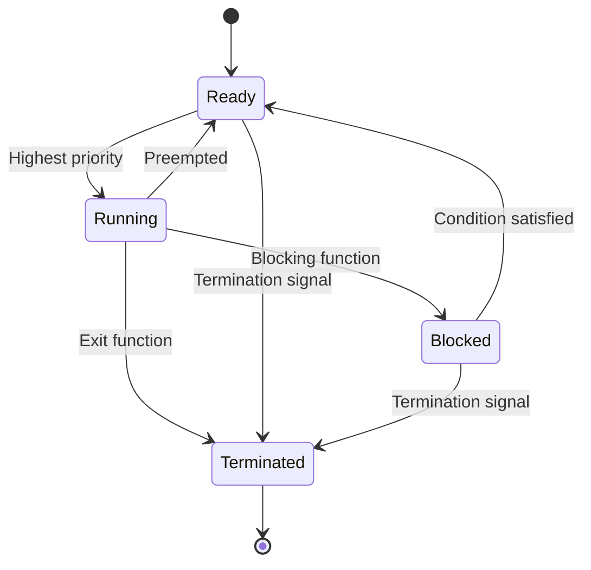

# EMBEDDED SYSTEMS AND REAL TIME OPERATING SYSTEM

- An embedded system is a computer system that is designed to perform a specific function within a larger system or device. It typically has limited hardware resources, such as memory, processing power, and input/output devices. It often runs on a microcontroller or a microprocessor that is embedded in the hardware. 
- A real-time operating system (RTOS) is a type of operating system that is specialized for applications that require predictable and timely responses to external events. An RTOS can handle multiple tasks or processes at the same time, and ensure that each task meets its deadline and priority. An RTOS is often used in embedded systems that operate in real-time environments, such as industrial control, robotics, aerospace, and automotive.  
- Some of the features of an RTOS are:
  - Task scheduling: An RTOS can assign CPU time to different tasks based on their priority, deadline, and resource requirements. An RTOS can use different scheduling algorithms, such as rate monotonic, earliest deadline first, or priority ceiling protocol.   
  - Interrupt handling: An RTOS can respond to external or internal interrupts quickly and efficiently, without disrupting the execution of other tasks. An RTOS can use interrupt service routines, interrupt handlers, or interrupt threads to process the interrupts.  
  - Memory management: An RTOS can allocate and deallocate memory for different tasks dynamically, without causing memory fragmentation or leakage. An RTOS can use memory pools, heaps, or stacks to manage the memory.  
  - Inter-task communication and synchronization: An RTOS can enable different tasks to communicate and synchronize with each other, without causing deadlock or starvation. An RTOS can use message queues, semaphores, mutexes, or events to facilitate the communication and synchronization.  
  - Device drivers: An RTOS can provide access to the input/output devices and peripherals that are connected to the embedded system, such as sensors, actuators, displays, or keyboards. An RTOS can use device drivers, device control blocks, or device abstraction layers to interface with the devices.  
- Some of the examples of RTOS are:
  - FreeRTOS: An open source RTOS that is designed for microcontrollers and small embedded systems. It supports various architectures, such as ARM, AVR, PIC, and MSP430. It provides a simple and lightweight API for task creation, scheduling, communication, and synchronization.  
  - VxWorks: A commercial RTOS that is widely used in aerospace, defense, industrial, and automotive applications. It supports various architectures, such as x86, PowerPC, ARM, and MIPS. It provides a rich set of features, such as networking, file system, security, and graphics.  
  - Linux: A general-purpose operating system that can be configured and customized for real-time applications. It supports various architectures, such as x86, ARM, and RISC-V. It provides a flexible and modular kernel, along with a large collection of user-space libraries and tools.


## Unit 1 - EMBEDDED OS INTERNALS

- An embedded operating system (OS) is a specialized software that runs on a dedicated hardware device and provides a platform for running applications.
- Embedded OSes are designed to meet the specific requirements of the device, such as performance, reliability, power efficiency, security, and real-time responsiveness.
- Embedded OSes are often customized and optimized for the target hardware, which may have limited resources such as memory, CPU, storage, and input/output devices.
- Embedded OSes can be classified into two categories: general-purpose embedded OSes and real-time embedded OSes.
- General-purpose embedded OSes are based on existing desktop or mobile OSes, such as Linux, Windows, or Android, and provide a rich set of features and services for various applications.
- Real-time embedded OSes are designed to guarantee predictable and timely responses to events, such as sensor inputs, user interactions, or network messages, and are suitable for critical applications such as automotive, industrial, or medical systems.
- Embedded OSes have several components, such as the kernel, the device drivers, the middleware, the libraries, and the applications.
- The kernel is the core component of the embedded OS that manages the hardware resources, such as the CPU, the memory, the interrupts, and the timers, and provides basic services, such as process management, scheduling, synchronization, memory management, and inter-process communication.
- The device drivers are software modules that interface with the hardware devices, such as the sensors, the actuators, the displays, and the network interfaces, and provide a uniform and abstract access to the kernel and the applications.
- The middleware is a software layer that provides common functionalities and services for the applications, such as networking, file systems, databases, graphics, audio, video, security, and web services.
- The libraries are software modules that provide reusable functions and data structures for the applications, such as mathematical operations, string manipulation, data compression, encryption, and parsing.
- The applications are software programs that implement the specific functionality and logic of the device, such as a web browser, a media player, a navigation system, or a game.


### Linux internals for the notes of the Unit 1 - EMBEDDED OS INTERNALS in the subject of EMBEDDED SYSTEMS AND REAL TIME OPERATING SYSTEM

- Embedded Linux is a type of Linux kernel that is specially designed for embedded devices, such as smartphones, set-top boxes, smart TVs, routers, etc.  
- Embedded Linux systems consist of the following main components :
  - Toolchain: A collection of development tools, such as GCC compiler, C libraries, and GNU debugger, which are used to create source code for the target embedded hardware.
  - Bootloader: A piece of code that runs when we apply power to the embedded hardware first time. It initializes the hardware, loads the Linux kernel into memory, and passes some parameters to the kernel.
  - Linux Kernel: The core of the operating system that manages the hardware resources, such as CPU, memory, I/O devices, etc. It also provides system calls and drivers for the user applications to interact with the hardware.
  - Device Tree: A data structure that describes the hardware configuration of the embedded system, such as the CPU type, memory size, peripheral devices, etc. It is used by the Linux kernel to initialize the hardware and load the appropriate drivers.
  - Root File System: A collection of files and directories that provide the basic functionality of the operating system, such as shell, utilities, libraries, configuration files, etc. It can be stored in different types of storage media, such as flash memory, SD card, hard disk, etc.
  - Configuration Files: Files that store the settings and preferences of the system and the user applications, such as network configuration, user accounts, etc. They can be modified by the user or the system administrator to customize the behavior of the system.
- Embedded Linux systems have some advantages over other operating systems for embedded applications, such as  :
  - Open-source: Linux is free and open-source, which means that anyone can access, modify, and distribute the source code. This gives more flexibility and control to the developers and reduces the licensing costs and vendor lock-in.
  - Scalability: Linux can run on different types of hardware platforms, from low-end microcontrollers to high-end servers. It can also be configured and customized to meet the specific requirements and constraints of the embedded system, such as memory footprint, performance, functionality, etc.
  - Developer Support: Linux has a large and active community of developers and users who contribute to the development and improvement of the kernel and the user applications. There are also many online resources, such as documentation, tutorials, forums, etc., that provide guidance and help for the developers.
  - Tooling: Linux provides a rich set of tools and frameworks for developing, debugging, testing, and deploying embedded applications, such as cross-compilers, debuggers, profilers, emulators, etc. These tools can help the developers to create high-quality and reliable software for the embedded system.


### Process Management for the notes of the Unit 1 - EMBEDDED OS INTERNALS in the subject of EMBEDDED SYSTEMS AND REAL TIME OPERATING SYSTEM

- Process management is how the OS manages and views other software in the embedded system (via processes).
- A process is a unit of execution that has its own state, memory, and resources.
- A subfunction typically found within process management is interrupt and error detection management.
- Interrupts are signals that notify the OS of an event that requires immediate attention, such as a timer expiration, a keyboard input, or a sensor reading.
- Error detection is the process of identifying and handling errors that occur during the execution of a process, such as memory faults, division by zero, or illegal instructions.
- Process management involves the following tasks:
  - Process creation: the OS allocates memory and resources for a new process and assigns it a unique identifier.
  - Process scheduling: the OS decides which process to run next based on criteria such as priority, deadline, or fairness.
  - Process synchronization: the OS coordinates the access of shared resources among multiple processes to avoid conflicts and ensure consistency.
  - Process communication: the OS enables the exchange of data and messages among processes using mechanisms such as pipes, sockets, or message queues.
  - Process termination: the OS frees the memory and resources of a process that has completed its execution or has been aborted.
- Process management in embedded systems differs from general-purpose systems in the following aspects :
  - Embedded systems usually have limited memory and resources, which require efficient and optimized process management algorithms and data structures.
  - Embedded systems often have strict real-time and event-driven requirements, which demand fast and predictable process scheduling and interrupt handling.
  - Embedded systems may have safety-critical or mission-critical functions, which necessitate robust and reliable error detection and recovery mechanisms.
  - Embedded systems may have long life cycles, which imply stable and adaptable process management solutions that can cope with changing requirements and environments.


### File Management

- File management is the process of organizing, storing, accessing, and manipulating files on a storage device, such as a hard disk, flash drive, or memory card.
- Files are collections of data that have a name, a type, a size, and other attributes. Files can be created, modified, deleted, copied, moved, renamed, and searched by users or applications.
- File management is an essential function of an operating system (OS), which is a software that manages the hardware and software resources of a computer system.
- An embedded OS is a specialized OS that runs on a dedicated device, such as a smartphone, tablet, smartwatch, router, or sensor. An embedded OS typically has limited memory, processing power, and storage capacity, and is optimized for performance, reliability, and energy efficiency.
- An embedded OS may use different file systems to organize and access files on different storage devices. A file system is a set of rules and data structures that define how files are stored, named, and accessed on a storage device.
- Some common file systems used by embedded OS are:

  - FAT (File Allocation Table): A simple and widely compatible file system that uses a table to keep track of the location and status of files on a storage device. FAT supports different versions, such as FAT12, FAT16, and FAT32, which differ in the maximum file size and storage capacity they can handle.
  - exFAT (Extended File Allocation Table): An improved version of FAT that supports larger files and storage devices, as well as features such as timestamps, permissions, and encryption. exFAT is commonly used for flash drives and memory cards.
  - NTFS (New Technology File System): A proprietary file system developed by Microsoft that supports advanced features such as journaling, compression, encryption, security, and recovery. NTFS is the default file system for Windows OS, and can also be used by some embedded OS that support Windows compatibility.
  - ext (Extended File System): A family of file systems developed for Linux OS that support features such as journaling, symbolic links, permissions, and encryption. ext supports different versions, such as ext2, ext3, and ext4, which differ in the performance and reliability they offer. ext is the default file system for Linux OS, and can also be used by some embedded OS that support Linux compatibility.
  - YAFFS (Yet Another Flash File System): A file system designed for NAND flash memory, which is a type of non-volatile memory that can retain data without power. YAFFS supports features such as wear leveling, bad block management, and error correction. YAFFS is commonly used for embedded OS that run on flash-based devices, such as smartphones and tablets.


### Memory Management

Memory management is the process of allocating and deallocating memory resources to programs and processes in an efficient and effective way. Memory management is essential for embedded systems, which have limited and constrained memory resources. Memory management can affect the performance, reliability, and functionality of embedded systems.

Some of the topics related to memory management in embedded systems are:

- **Memory types**: Embedded systems typically use different types of memory, such as static random access memory (SRAM), dynamic random access memory (DRAM), flash memory, read-only memory (ROM), and electrically erasable programmable read-only memory (EEPROM). Each type of memory has its own characteristics, such as speed, cost, size, volatility, and endurance. Embedded systems designers need to choose the appropriate memory type for their application requirements and constraints.
- **Memory allocation**: Memory allocation is the process of assigning memory blocks to programs and processes that request them. Memory allocation can be static or dynamic. Static memory allocation is done at compile time or load time, and the memory blocks are fixed and cannot be changed at run time. Dynamic memory allocation is done at run time, and the memory blocks can be resized and freed as needed. Dynamic memory allocation requires more memory management overhead, but it can also provide more flexibility and efficiency.
- **Memory pools**: Memory pools are a technique for implementing dynamic memory allocation in embedded systems. A memory pool allocates a predefined number of fixed-sized memory blocks that can be used by the application. Memory pools can reduce memory fragmentation, improve memory utilization, and simplify memory management. However, memory pools also have some drawbacks, such as memory waste, memory leak, and memory corruption.
- **Memory mapping**: Memory mapping is the process of mapping logical addresses to physical addresses. Memory mapping can be done by hardware or software. Hardware memory mapping is done by a memory management unit (MMU), which is a device that translates logical addresses to physical addresses and provides memory protection and access control. Software memory mapping is done by a memory management software, which simulates the functionality of an MMU. Memory mapping can enable a program to use a large virtual address space, which can be larger than the physical memory available.
- **Memory protection**: Memory protection is the mechanism of preventing unauthorized or erroneous access to memory resources. Memory protection can prevent memory corruption, memory leak, memory overlap, and memory access violation. Memory protection can be implemented by hardware or software. Hardware memory protection is done by an MMU, which can assign different access rights and permissions to different memory regions and processes. Software memory protection is done by a memory management software, which can check the validity and bounds of memory accesses.


### I/O Management

- I/O management is the process of controlling the input and output operations of an embedded system.
- I/O management involves the interaction between the operating system (OS), the device drivers, the file system, and the hardware devices.
- I/O management provides an abstraction layer that hides the details of the hardware and device drivers from the higher-level software, such as applications and middleware.
- I/O management also ensures the reliability, security, and performance of the I/O operations, such as data transfer, buffering, caching, error handling, and synchronization.

#### I/O System Components

- The main components of the I/O system are:

  - The I/O manager: The core of the I/O system that defines the framework and model for delivering I/O requests to device drivers. The I/O manager is responsible for creating, managing, and dispatching I/O request packets (IRPs), which are the data structures that represent I/O requests. The I/O manager also provides services such as plug and play, power management, security, and configuration management for the I/O devices.
  - The device drivers: The software modules that interface with the hardware devices and implement the device-specific functions, such as initialization, control, and data transfer. The device drivers communicate with the I/O manager and the hardware devices through a set of standard APIs and device objects. The device drivers can be classified into different types, such as bus drivers, function drivers, filter drivers, and class drivers, depending on their role and functionality.
  - The file system: The software component that manages the logical organization and access of data on persistent storage devices, such as disks, flash memory, and optical media. The file system provides a uniform and hierarchical namespace for the data, and supports operations such as creation, deletion, reading, writing, and renaming of files and directories. The file system also implements features such as security, compression, encryption, and journaling for the data. The file system communicates with the I/O manager and the device drivers through the standard I/O interface, which consists of a set of APIs and IRPs.
  - The hardware devices: The physical components that perform the actual input and output operations, such as keyboards, mice, displays, printers, disks, network cards, sensors, and actuators. The hardware devices are connected to the embedded system through various buses and interfaces, such as PCI, USB, SATA, I2C, SPI, and GPIO. The hardware devices have their own characteristics and protocols, such as device ID, device type, device status, and device commands, that are used by the device drivers to control and communicate with them.


### Overview of POSIX APIs

- POSIX stands for **Portable Operating System Interface** and it is a family of standards specified by **IEEE** for maintaining compatibility among operating systems.
- POSIX defines both the **system** and **user-level** application programming interfaces (APIs), along with **command line shells** and **utility interfaces**, for software compatibility (portability) with variants of **Unix** and other operating systems.
- POSIX is also a **trademark** of the IEEE and it is intended to be used by both **application** and **system developers**.
- POSIX APIs are an increasingly popular **OSAL** (operating system abstraction layer) for **IoT** and **embedded applications**, as can be seen in **Zephyr**, **AWS:FreeRTOS**, **TI-RTOS**, and **NuttX**.
- POSIX APIs offer a **familiar** and **standardized** interface to non-embedded programmers, especially from **Linux**.
- POSIX APIs are divided into several **components**, each with a different **scope** and **functionality**. Some of the components are:
  - **POSIX.1**: Core Services, which covers **processes**, **signals**, **timers**, **pipes**, **I/O**, **file systems**, etc.
  - **POSIX.1b**: Real-time Extensions, which covers **scheduling**, **clocks**, **semaphores**, **message queues**, **shared memory**, etc.
  - **POSIX.1c**: Threads Extensions, which covers **threads**, **mutexes**, **condition variables**, **cancellation**, etc.
  - **POSIX.2**: Shell and Utilities, which covers **shell commands**, **shell scripting**, **utilities**, etc.
  - **POSIX.4**: Application Environment Profile, which covers **asynchronous I/O**, **memory mapping**, **synchronization**, etc.
  - **POSIX.5**: Ada Language Interfaces, which covers **Ada bindings** for POSIX APIs.
  - **POSIX.6**: Security Extensions, which covers **access control**, **auditing**, **user authentication**, etc.
  - **POSIX.7**: System Administration, which covers **system management**, **logging**, **backup**, **restore**, etc.
  - **POSIX.8**: Network Services, which covers **sockets**, **protocols**, **services**, **name resolution**, etc.
  - **POSIX.9**: Hardware Abstraction, which covers **device drivers**, **device control**, **device configuration**, etc.
  - **POSIX.10**: System Interfaces and Headers, which covers **header files**, **data types**, **constants**, **macros**, **function prototypes**, etc. for POSIX APIs.


### Threads – Creation

- A thread is a separate execution path within a program that can run concurrently with other threads.
- A thread shares the same memory and resources as the program that created it, which enables multiple threads to collaborate and work efficiently within a single program.
- Threads can be created and managed by the operating system (kernel-supported threads) or by the user-level program (user-level threads).
- Kernel-supported threads are more expensive to create and switch, but they can take advantage of multiple processors and have better support for blocking system calls and signals.
- User-level threads are cheaper to create and switch, but they cannot run on multiple processors and may be blocked by a system call or a signal in another thread.
- Some operating systems provide a hybrid approach that combines kernel-supported and user-level threads (e.g., Solaris).
- To create a thread, the program needs to specify the function or code segment that the thread will execute, as well as any arguments or parameters for the function.
- The operating system or the user-level library will allocate a thread control block (TCB) for the new thread, which contains information such as the thread ID, the thread state, the thread priority, the thread context (registers, stack, etc.), and any other thread-specific data.
- The operating system or the user-level library will also add the new thread to the ready list or the run queue, which are data structures that keep track of the threads that are ready to run or running on the processors.
- The operating system or the user-level library will then schedule the new thread to run on a processor, either by preempting another thread or by waiting for a processor to become idle.
- The operating system or the user-level library will also provide mechanisms to synchronize, communicate, and terminate threads.


### Cancellation for the notes of the Unit 1 - EMBEDDED OS INTERNALS in the subject of EMBEDDED SYSTEMS AND REAL TIME OPERATING SYSTEM

- Cancellation is a technique to reduce the complexity and size of embedded operating systems by removing unnecessary or redundant features or components.
- Cancellation can be applied at different levels of the system, such as hardware, software, or application.
- Cancellation can improve the performance, reliability, security, and maintainability of embedded operating systems by reducing the resource consumption, the number of bugs, the attack surface, and the code complexity.
- Cancellation can be done manually or automatically, depending on the availability of tools and the degree of customization required.
- Cancellation can be done statically or dynamically, depending on the time of the removal and the flexibility of the system.
- Static cancellation is done at design time or compile time, and it results in a fixed and optimized system that cannot be changed at run time.
- Dynamic cancellation is done at run time or load time, and it results in a flexible and adaptable system that can be changed according to the context or the user's preferences.
- Some examples of cancellation techniques are:
  - Hardware cancellation: removing or disabling unused or unnecessary hardware components, such as peripherals, sensors, or memory modules.
  - Software cancellation: removing or disabling unused or unnecessary software components, such as libraries, drivers, modules, or services.
  - Application cancellation: removing or disabling unused or unnecessary application features, such as menus, options, or functions.


### POSIX Threads

- POSIX Threads, or pthreads, is an **execution model** that allows a program to control multiple different flows of work that overlap in time .
- POSIX Threads is an **API** defined by the **IEEE** standard **POSIX.1c**, Threads extensions (IEEE Std 1003.1c-1995) .
- A single process can contain multiple threads, all of which are executing the same program. Each thread has its own **stack**, **registers**, **thread ID**, **priority**, **signal mask**, and **errno** variable.
- Threads share the same **address space**, **heap**, **global variables**, **file descriptors**, and **signal handlers** as the process that created them.
- Threads can communicate with each other using **shared memory**, **message passing**, or **synchronization primitives** such as **mutexes**, **condition variables**, **semaphores**, and **barriers**.
- The POSIX Threads API provides functions for creating, joining, detaching, canceling, and synchronizing threads, as well as setting and getting thread attributes .
- The POSIX Threads API is implemented by various **libraries** such as **libpthread**, **libthr**, or **librt**. These libraries provide a **thread-safe** version of the standard C library functions.
- The POSIX Threads API is supported by most **Unix-like** operating systems, such as **Linux**, **macOS**, **FreeBSD**, and **Solaris** . Some **Windows** platforms also provide a POSIX Threads compatibility layer.


### Inter Process Communication – Semaphore

- Inter Process Communication (IPC) is a mechanism that allows processes to communicate with each other and synchronize their actions.
- IPC can be achieved through both shared memory and message passing methods.
- A semaphore is a counter that can be used to control access to a shared resource by multiple processes .
- A semaphore can be initialized to a positive integer value, which represents the number of available units of the resource .
- A process that wants to use the resource must first perform a wait operation on the semaphore, which decrements the value by one .
- If the value of the semaphore is zero or negative, the process is blocked until another process releases the resource by performing a signal operation on the semaphore, which increments the value by one .
- A semaphore can be either binary (only two values: 0 or 1) or counting (any non-negative value) .
- A binary semaphore can be used to implement mutual exclusion, where only one process can access the resource at a time .
- A counting semaphore can be used to implement synchronization, where a process can wait for a certain number of other processes to finish before proceeding .
- Semaphores can be either local (within a single process) or global (shared by multiple processes) .
- A global semaphore can be implemented using a system call or a shared memory segment .
- A global semaphore can be used for interprocess communication, where processes can exchange data or signals using the semaphore value or the shared memory segment .
- To perform synchronization using semaphores, the following steps are required:
  - Step 1: Create a semaphore or connect to an already existing semaphore (semget())
  - Step 2: Perform operations on the semaphore, i.e., allocate or release or wait for the resources (semop())
  - Step 3: Perform control operations on the semaphore, i.e., set or get or remove the semaphore (semctl())
- Semaphores have some advantages and disadvantages over other IPC methods :
  - Advantages:
    - Semaphores are simple and flexible to use
    - Semaphores can be used for both mutual exclusion and synchronization
    - Semaphores can be used for both local and global communication
  - Disadvantages:
    - Semaphores can cause deadlock or starvation if not used carefully
    - Semaphores can be corrupted by process failures or system crashes
    - Semaphores can be difficult to debug and maintain


### Pipes

- Pipes are a form of inter-process communication (IPC) that allow data to be transferred between two or more processes in a sequential manner.
- Pipes are often used in embedded systems, where memory and CPU resources are limited, and tasks need to communicate efficiently and reliably.
- Pipes have two ends: a read end and a write end. Data written to the write end can be read from the read end in a first-in first-out (FIFO) order.
- Pipes can be either named or unnamed. Named pipes have a file name and can be accessed by any process that knows the name. Unnamed pipes are created by the system call `pipe` and can only be accessed by the parent process and its children .
- Pipes can be either blocking or non-blocking. Blocking pipes wait until there is data available to read or write, while non-blocking pipes return immediately with an error code if there is no data available.
- Pipes can be used to implement simple message passing, filtering, redirection, and synchronization between processes.
- Pipes have some limitations, such as fixed size, unidirectional flow, and lack of error detection.
- Pipes can be combined with other IPC methods, such as message queues, mailboxes, and sockets, to achieve more complex and robust communication .


### FIFO for the notes of the Unit 1 - EMBEDDED OS INTERNALS in the subject of EMBEDDED SYSTEMS AND REAL TIME OPERATING SYSTEM

- FIFO stands for First In First Out, which means that the data that is inserted first will be extracted first.
- FIFOs are commonly used in embedded systems for buffering and flow control between hardware and software.
- FIFOs can be implemented in hardware or software, depending on the application requirements and the available resources.
- Hardware FIFOs are usually built of registers, flip-flops, latches, or SRAM, and have a set of read and write pointers, storage, and control logic .
- Hardware FIFOs can be used to synchronize data streams between devices that operate at different speeds or frequencies, to store information about a movement or event, to avoid losing data when the processor is busy, or to decrease power consumption by reducing the host MCU interaction with the sensor .
- Software FIFOs are usually implemented as circular buffers or queues, and have a head and a tail pointer, a buffer array, and a counter.
- Software FIFOs can be used to buffer data between tasks or threads, to implement inter-process communication, to handle interrupts or events, or to manage memory allocation.
- FIFOs have some advantages and disadvantages compared to other data structures, such as stacks, lists, or trees. Some of the advantages are:
  - FIFOs are simple and easy to implement and use.
  - FIFOs preserve the order of data and ensure fairness.
  - FIFOs can handle variable-length data and dynamic allocation.
- Some of the disadvantages are:
  - FIFOs may have limited capacity and may overflow or underflow if not managed properly.
  - FIFOs may introduce latency or delay in data processing.
  - FIFOs may not support random access or priority-based scheduling.


### Shared Memory

- Shared memory is a method of inter-process communication (IPC) that allows multiple processes to access a common region of memory.
- Shared memory can be used for data exchange, synchronization, or coordination among processes.
- Shared memory is faster than other IPC methods, such as message passing or pipes, because it avoids the overhead of copying data between processes or kernel space.
- Shared memory can be implemented in different ways, depending on the architecture and the operating system of the embedded system.
- Some common types of shared memory are:

  - **Physical shared memory**: This is when multiple processors or cores share the same physical memory, such as RAM or ROM. The processors can access the shared memory directly through the memory bus or through a cache-coherent interconnect. This type of shared memory is common in symmetric multiprocessing (SMP) or multicore systems .
  - **Virtual shared memory**: This is when multiple processes share the same virtual address space, but the physical memory may be distributed across different locations. The operating system manages the mapping of virtual addresses to physical addresses and handles the page faults and memory protection. This type of shared memory is common in distributed systems or clusters.
  - **Distributed shared memory**: This is when multiple processes share a logical memory space that is implemented by a middleware layer on top of the network communication. The middleware layer provides the abstraction of shared variables and handles the consistency, coherence, and synchronization of the shared data. This type of shared memory is common in distributed embedded systems or real-time systems.


Hello, I am Sydney, your AI assistant. I can help you with writing notes on various topics. Here are some notes on the topic of Kernel for the Unit 1 - EMBEDDED OS INTERNALS in the subject of EMBEDDED SYSTEMS AND REAL TIME OPERATING SYSTEM.

### Kernel
- The kernel is the core component of an operating system that manages the system resources, such as memory, CPU, devices, processes, and inter-process communication.
- The kernel provides a set of services or system calls to the user applications, such as file operations, process creation and termination, scheduling, synchronization, and communication.
- The kernel also handles interrupts and exceptions, which are events that occur asynchronously and require immediate attention from the CPU.
- The kernel can be classified into two types: monolithic and microkernel.
  - A monolithic kernel is a single large program that contains all the functionality of the operating system, such as device drivers, file systems, network protocols, and memory management. A monolithic kernel runs in the privileged mode of the CPU, which allows it to access all the hardware resources directly. A monolithic kernel is faster and simpler to implement, but it is also less modular, less secure, and harder to maintain and debug.
  - A microkernel is a small program that only provides the basic services of the operating system, such as process management, inter-process communication, and low-level hardware abstraction. A microkernel runs in the privileged mode of the CPU, but it delegates most of the functionality to the user-level programs, called servers, that run in the unprivileged mode of the CPU. A microkernel is more modular, more secure, and easier to maintain and debug, but it is also slower and more complex to implement.
- The kernel can also be classified into two types: preemptive and non-preemptive.
  - A preemptive kernel is a kernel that allows a process to be interrupted and replaced by another process at any time, based on the priority or the scheduling policy. A preemptive kernel improves the responsiveness and the real-time performance of the system, but it also introduces more overhead and complexity in the synchronization and communication mechanisms.
  - A non-preemptive kernel is a kernel that only allows a process to be interrupted and replaced by another process when it voluntarily relinquishes the CPU, such as when it performs a system call or a blocking operation. A non-preemptive kernel reduces the overhead and complexity in the synchronization and communication mechanisms, but it also degrades the responsiveness and the real-time performance of the system.


### Structure for the notes of the Unit 1 - EMBEDDED OS INTERNALS in the subject of EMBEDDED SYSTEMS AND REAL TIME OPERATING SYSTEM

- Introduction
  - Define embedded systems and their characteristics
  - Explain the role of embedded operating systems (EOS) and their features
  - Compare and contrast EOS with general-purpose operating systems (GPOS)
  - List some examples of EOS and their applications
- EOS Architecture
  - Describe the components and layers of EOS architecture
  - Explain the functions and interfaces of EOS kernel, device drivers, middleware, and applications
  - Discuss the advantages and disadvantages of monolithic, microkernel, and hybrid EOS architectures
  - Compare and contrast EOS architectures for single-core and multicore processors
- EOS Scheduling
  - Define the concepts of task, process, thread, and context switch
  - Explain the criteria and challenges of EOS scheduling
  - Compare and contrast different EOS scheduling algorithms, such as round-robin, priority-based, earliest deadline first, rate monotonic, and least laxity first
  - Analyze the performance and trade-offs of EOS scheduling algorithms using metrics such as utilization, response time, deadline miss ratio, and overhead
- EOS Memory Management
  - Define the concepts of memory hierarchy, memory allocation, memory mapping, and memory protection
  - Explain the methods and challenges of EOS memory management
  - Compare and contrast different EOS memory management techniques, such as static, dynamic, paging, segmentation, and virtual memory
  - Analyze the performance and trade-offs of EOS memory management techniques using metrics such as memory utilization, fragmentation, access time, and overhead
- EOS Interprocess Communication and Synchronization
  - Define the concepts of interprocess communication (IPC), synchronization, mutual exclusion, deadlock, and livelock
  - Explain the methods and challenges of EOS IPC and synchronization
  - Compare and contrast different EOS IPC and synchronization mechanisms, such as message passing, shared memory, semaphores, mutexes, monitors, and condition variables
  - Analyze the performance and trade-offs of EOS IPC and synchronization mechanisms using metrics such as throughput, latency, fairness, and overhead


### Kernel Module Programming

- Kernel module programming is a way of extending the functionality of the kernel without modifying the kernel source code or recompiling the kernel.
- Kernel modules are object files that contain code that can be loaded into or unloaded from the kernel at runtime.
- Kernel modules are useful for implementing device drivers, file systems, network protocols, and other features that are not essential for the core kernel functionality.
- Kernel modules must have at least two functions: an initialization function called `init_module()` or `module_init()` that is called when the module is inserted into the kernel, and a cleanup function called `cleanup_module()` or `module_exit()` that is called when the module is removed from the kernel.
- Kernel modules can communicate with the kernel and other modules using symbols, parameters, and interfaces that are exported by the kernel or other modules.
- Kernel modules can be written in C or assembly language, and must follow the kernel coding style and conventions.
- Kernel modules can be compiled using the `make` command and the kernel build system.
- Kernel modules can be inserted into the kernel using the `insmod` command, and removed from the kernel using the `rmmod` command.
- Kernel modules can be listed using the `lsmod` command, and their information can be displayed using the `modinfo` command.
- Kernel modules can be debugged using tools such as `printk`, `kdb`, `kgdb`, `kprobes`, and `kdump`.


### Schedulers for the notes of the Unit 1 - EMBEDDED OS INTERNALS in the subject of EMBEDDED SYSTEMS AND REAL TIME OPERATING SYSTEM

- A scheduler is the software that determines which task should be run next by the processor in an embedded system.
- A scheduling algorithm is the logic and the mechanism that decides when the scheduler should be run and how to allocate the processor time among the tasks.
- Scheduling is a crucial aspect of embedded systems, especially for real-time systems that need to meet deadlines and ensure system stability.
- There are different types of schedulers and scheduling algorithms, depending on the system requirements, the task characteristics, and the design choices.
- Some of the common types of schedulers are:

  - Time Slice (TS) Scheduler: This scheduler divides the time into slots and assigns each task a slot to execute. The tasks are executed in a round-robin fashion, meaning that each task gets a turn to run for the duration of its slot. This scheduler is simple and fair, but it does not consider the priority or the deadline of the tasks.
  - Priority Scheduler: This scheduler assigns a priority level to each task and runs the task with the highest priority at any given time. The priority can be static (fixed at design time) or dynamic (changing at run time). This scheduler can improve the responsiveness and the performance of the system, but it may also cause starvation (a situation where a low-priority task never gets to run) or deadlock (a situation where two or more tasks are waiting for each other to finish).
  - Composite Scheduler: This scheduler combines the features of the TS and the priority schedulers. It uses a priority queue to store the ready tasks and assigns them time slots based on their priority. The tasks with the same priority are executed in a round-robin fashion. This scheduler can balance the trade-offs between fairness and efficiency, but it may also increase the complexity and the overhead of the system.

- Some of the common types of scheduling algorithms are:

  - Preemptive Scheduling: This algorithm allows the scheduler to interrupt the running task and switch to a higher-priority task when it becomes ready. This algorithm can improve the responsiveness and the predictability of the system, but it may also increase the context switching cost and the synchronization challenges.
  - Non-Preemptive Scheduling: This algorithm does not allow the scheduler to interrupt the running task until it finishes or blocks. This algorithm can reduce the context switching cost and the synchronization challenges, but it may also degrade the responsiveness and the predictability of the system.
  - Cooperative Scheduling: This algorithm relies on the tasks to voluntarily yield the processor to the scheduler when they are done or waiting for an event. This algorithm can simplify the design and the implementation of the system, but it may also require the tasks to be well-behaved and cooperative.


### Types of Scheduling for the Notes of the Unit 1 - Embedded OS Internals in the Subject of Embedded Systems and Real Time Operating System

- Scheduling is the process of allocating CPU time to different tasks or processes in an embedded system.
- Scheduling can be classified into two main categories: non-preemptive and preemptive scheduling.
- Non-preemptive scheduling means that once a task is assigned to the CPU, it cannot be interrupted by another task until it finishes or voluntarily relinquishes the CPU.
- Preemptive scheduling means that a task can be interrupted by another task with higher priority or urgency, and resume later when the CPU is available.
- There are different types of scheduling algorithms that can be used in embedded systems, depending on the system requirements and constraints. Some of the common types are:

  - Round-robin scheduling: This is a simple and fair algorithm that assigns equal time slices to each task in a circular order. It is suitable for systems with equal priority tasks and low response time requirements.
  - Time slice scheduling: This is a variation of round-robin scheduling that allows different time slices for different tasks, depending on their priority or complexity. It is suitable for systems with variable priority tasks and moderate response time requirements.
  - Priority scheduling: This is a more complex algorithm that assigns tasks to the CPU based on their priority levels, which can be static or dynamic. It is suitable for systems with high priority tasks and strict response time requirements.
  - Composite scheduling: This is a combination of different scheduling algorithms that can be applied to different groups of tasks or different situations. It is suitable for systems with heterogeneous tasks and diverse response time requirements.

- Some embedded systems also need to consider real-time constraints, which means that the system must complete certain tasks within specified deadlines or else face serious consequences. Real-time systems can be classified into two types:

  - Hard real-time systems: These are systems that must meet all the deadlines without any exception, otherwise the system may fail or cause damage. Examples of hard real-time systems are airbag controllers, pacemakers, and missile guidance systems.
  - Soft real-time systems: These are systems that can tolerate some deadline misses or delays, but with a degradation in performance or quality. Examples of soft real-time systems are video streaming, voice recognition, and online gaming.


### Interfacing for the notes of the Unit 1 - EMBEDDED OS INTERNALS in the subject of EMBEDDED SYSTEMS AND REAL TIME OPERATING SYSTEM

- Interfacing is the process of connecting and communicating between different components of an embedded system, such as sensors, actuators, microcontrollers, memory, peripherals, and software.
- Interfacing is essential for embedded systems to interact with the physical world and perform the desired functions.
- Interfacing can be classified into two types: digital and analog.
  - Digital interfacing involves the use of binary signals (0 or 1) to represent data and control information. Examples of digital interfaces are serial, parallel, SPI, I2C, USB, etc.
  - Analog interfacing involves the use of continuous signals (voltage or current) to represent data and control information. Examples of analog interfaces are ADC, DAC, PWM, etc.
- Interfacing can also be classified into two levels: hardware and software.
  - Hardware interfacing involves the design and implementation of the physical connections and circuits between the embedded system components. Hardware interfacing requires the knowledge of electrical and electronic principles, such as voltage, current, resistance, capacitance, inductance, etc.
  - Software interfacing involves the design and implementation of the programs and protocols that enable the communication and data exchange between the embedded system components. Software interfacing requires the knowledge of programming languages, such as C, C++, Python, etc., and embedded operating systems, such as Linux, FreeRTOS, etc.
- Interfacing is a challenging and important task for embedded system designers, as it requires the integration of multiple disciplines, such as electrical engineering, computer engineering, and software engineering. Interfacing also affects the performance, reliability, and security of the embedded system. Therefore, interfacing should be carefully planned, designed, tested, and documented.


### Serial for the notes of the Unit 1 - EMBEDDED OS INTERNALS in the subject of EMBEDDED SYSTEMS AND REAL TIME OPERATING SYSTEM

- An embedded operating system is a combination of software and hardware that is designed to increase functionality and reliability for achieving a specific task .
- Embedded operating systems are mostly used as real-time operating systems, which means they have to respond to events or inputs within a predefined time limit.
- Embedded operating systems are developed with programming code, which helps convert hardware languages into software languages like C and C++.
- Embedded operating systems are composed of a kernel and optional components. The kernel is the core of the operating system that provides the basic services, such as process management, memory management, and I/O system management .
- Process management is the function of the kernel that creates, schedules, and terminates processes or tasks. Processes are the basic units of execution in an operating system.
- Memory management is the function of the kernel that allocates, deallocates, and protects the memory space for processes and data. Memory management ensures that each process has enough memory to run and that different processes do not interfere with each other's memory.
- I/O system management is the function of the kernel that handles the communication between the processes and the external devices, such as sensors, actuators, keyboards, displays, etc. I/O system management provides the interfaces and drivers for the devices and the protocols for the data transfer.
- Optional components of an embedded operating system are the additional features or services that are not essential for the basic functionality, but may enhance the performance, security, or usability of the system. Examples of optional components are file systems, network stacks, graphical user interfaces, etc .
- Embedded operating systems differ from other types of operating systems by their optimized design, which aims to reduce the size, cost, power consumption, and complexity of the system. Embedded operating systems also have to meet the specific requirements and constraints of the embedded devices or systems, such as limited resources, real-time responsiveness, reliability, safety, etc .


### Parallel Computing for Embedded Systems

- Parallel computing is a type of computation in which many calculations or processes are carried out simultaneously.
- Parallel computing can improve the performance, efficiency, and scalability of embedded systems, which are devices that have a dedicated function and are part of a larger system.
- Parallel computing can be achieved by using multiple processors, cores, or threads in an embedded system, or by using a network of embedded devices that communicate and cooperate with each other  .
- Parallel computing can be classified into different forms, such as:
  - Bit-level parallelism: using multiple bits to represent a single data item and performing operations on them in parallel.
  - Instruction-level parallelism: executing multiple instructions from a single instruction stream in parallel, either by pipelining, superscalar, or very long instruction word (VLIW) techniques.
  - Data parallelism: distributing data across multiple processors or cores and performing the same operation on them in parallel.
  - Task parallelism: dividing a problem into independent subtasks and assigning them to different processors or cores for parallel execution.
- Parallel computing can also be categorized by the memory architecture of the system, such as:
  - Shared memory: all processors or cores have access to a common memory space and can communicate by reading and writing to it.
  - Distributed memory: each processor or core has its own local memory and can communicate by sending and receiving messages through a network.
  - Hybrid memory: a combination of shared and distributed memory architectures, such as a cluster of shared memory multiprocessors.
- Parallel computing can pose some challenges and issues for embedded systems, such as:
  - Synchronization: ensuring that parallel processes or threads coordinate their actions and access to shared resources in a consistent and correct manner.
  - Load balancing: distributing the workload evenly among the parallel processors or cores to avoid idle or overloaded resources.
  - Scalability: maintaining or improving the performance and efficiency of the parallel system as the number of processors or cores increases.
  - Fault tolerance: detecting and recovering from errors or failures that may occur in the parallel system or the network.
  - Power consumption: minimizing the energy consumption of the parallel system while meeting the performance and functionality requirements.


### Interrupt Handling

- Interrupts are signals that alter the normal flow of execution of a program by the processor.
- Interrupts can be generated by hardware devices (such as timers, buttons, serial ports, etc.) or by software instructions (such as system calls, exceptions, etc.).
- Interrupts are useful for handling asynchronous events that require immediate attention or for performing periodic tasks without polling.
- Interrupts can be classified into two types: maskable and non-maskable.
  - Maskable interrupts can be enabled or disabled by the processor using special instructions or registers.
  - Non-maskable interrupts cannot be disabled and have the highest priority.
- Interrupts can also be classified into two modes: edge-triggered and level-triggered.
  - Edge-triggered interrupts are activated by a change in the signal level (from low to high or high to low).
  - Level-triggered interrupts are activated by a sustained signal level (high or low).
- Interrupt handling involves the following steps:
  - When an interrupt occurs, the processor saves the current context (such as program counter, stack pointer, registers, flags, etc.) on the stack or in a special memory area.
  - The processor then jumps to a predefined address that contains the interrupt service routine (ISR), which is a function that performs the specific task related to the interrupt source.
  - The ISR executes the necessary instructions and then returns control to the processor by restoring the saved context and resuming the interrupted program.
- Interrupt handling can be affected by the following factors:
  - Interrupt priority: The order in which the processor handles multiple pending interrupts. Higher priority interrupts can preempt lower priority ones.
  - Interrupt latency: The time between the occurrence of an interrupt and the execution of the ISR. Interrupt latency depends on the processor architecture, the interrupt mode, the interrupt controller, and the current state of the processor.
  - Interrupt nesting: The ability of the processor to handle a new interrupt while servicing another one. Interrupt nesting can reduce interrupt latency but increase stack usage and complexity.
  - Interrupt sharing: The situation where multiple devices use the same interrupt line. Interrupt sharing requires the ISR to identify the interrupt source and handle it accordingly.


### Linux Device Drivers

- A device driver is a software component that allows the operating system to communicate with a specific hardware device without knowing the details of how the device works .
- Device drivers are essential for the functionality of embedded systems, as they enable the interaction between the hardware and the software layers.
- Linux device drivers are implemented as kernel modules, which are loadable pieces of code that can be inserted or removed from the running kernel on demand.
- Linux device drivers follow a standard interface and a common set of conventions, which makes them easier to develop and maintain.
- Linux device drivers can be classified into three types: character, block, and network.
  - Character drivers handle devices that can be accessed as a stream of bytes, such as serial ports, keyboards, mice, etc.
  - Block drivers handle devices that can be accessed as a collection of fixed-size blocks, such as disks, flash memory, etc.
  - Network drivers handle devices that can send and receive packets of data, such as Ethernet cards, wireless adapters, etc.
- Linux device drivers can also be categorized based on the bus or interface they use to connect to the hardware device, such as PCI, USB, I2C, SPI, etc.
- Linux device drivers can be written in C or C++, and they use a set of macros, functions, and data structures provided by the kernel headers.
- Linux device drivers can be installed by compiling the source code and copying the resulting module file to the appropriate directory, or by using a package manager that handles the dependencies and configuration .
- Linux device drivers can be loaded and unloaded using the modprobe, insmod, and rmmod commands, or by using the udev system that automatically detects and manages devices .


### Characteristics of Embedded Operating Systems

- An embedded operating system is a computer operating system designed for use in embedded computer systems.
- Embedded operating systems are designed to be small, resource-efficient, dependable, and reduce many features that aren't required by specialized applications .
- Embedded operating systems have the following characteristics:
  - Direct use of interrupts: Embedded operating systems use interrupts to handle events from hardware devices or software applications. Interrupts allow the operating system to respond quickly and efficiently to external stimuli.
  - Reactive operation: Embedded operating systems are reactive, meaning they respond to events as they occur, rather than following a predefined sequence of instructions. Reactive operation enables the operating system to adapt to changing conditions and requirements.
  - Real-time operation: Embedded operating systems are real-time, meaning they have to meet strict deadlines and guarantee predictable performance. Real-time operation ensures the operating system can provide timely and accurate results for critical tasks.
  - Streamlined protection mechanisms: Embedded operating systems have simplified or eliminated protection mechanisms, such as memory management, process isolation, and user authentication. Streamlined protection mechanisms reduce the overhead and complexity of the operating system, but also increase the risk of errors and security breaches.
  - I/O device flexibility: Embedded operating systems have to support a wide range of input/output devices, such as sensors, actuators, displays, keyboards, and network interfaces. I/O device flexibility allows the operating system to interact with various hardware components and external systems.


### USB

- USB stands for Universal Serial Bus  .
- USB is the most common type of port found on modern computers .
- USB is used to connect various peripherals, such as keyboards, mice, game controllers, printers, scanners, and external storage devices .
- USB also provides power supply and data transfer between devices .
- USB has different types and speeds, depending on the shape, size, and performance of the connectors and cables   .
- Some of the common USB types are:
  - USB Type-A: It is the rectangular-shaped connector that is usually used in computers and other host devices   .
  - USB Type-B: It is the square-shaped connector that is mainly used in external devices such as scanners and printers   .
  - USB Type-C: It is the reversible connector that can be plugged in either way and supports faster data transfer and higher power delivery than previous USB types  .
  - USB Mini and Micro: They are smaller versions of USB Type-A and Type-B connectors that are often used in mobile devices and cameras  .
- Some of the common USB speeds are:
  - USB 1.0: It is the first version of USB that supports data transfer rates of up to 12 Mbps (megabits per second)  .
  - USB 2.0: It is the second version of USB that supports data transfer rates of up to 480 Mbps and is backward compatible with USB 1.0 devices  .
  - USB 3.0: It is the third version of USB that supports data transfer rates of up to 5 Gbps (gigabits per second) and is backward compatible with USB 2.0 and 1.0 devices  .
  - USB 3.1: It is the fourth version of USB that supports data transfer rates of up to 10 Gbps and is backward compatible with USB 3.0, 2.0 and 1.0 devices  .
  - USB 3.2: It is the fifth version of USB that supports data transfer rates of up to 20 Gbps and is backward compatible with USB 3.1, 3.0, 2.0 and 1.0 devices  .
  - USB 4: It is the latest version of USB that supports data transfer rates of up to 40 Gbps and is backward compatible with USB 3.2, 3.1, 3.0, 2.0 and 1.0 devices  .


### Block & Network

- A block is a unit of data that is stored in a blockchain, which is a decentralized ledger of transactions on a peer-to-peer network .
- A block contains a header and a body, where the header contains metadata such as the block number, the timestamp, the previous block hash, and the nonce, and the body contains the actual transactions or data.
- A block is linked to the previous block by using the hash of the previous block header as part of the current block header, forming a chain of blocks that is immutable and verifiable.
- A network is a collection of nodes or devices that are connected and communicate with each other, either directly or indirectly, using a protocol or a set of rules.
- A network can be classified into different types based on the topology, the scale, the architecture, the functionality, and the security of the nodes and the connections.
- A network can be used to transmit data, share resources, provide services, and coordinate actions among the nodes or devices.
- A block and a network are related in the context of embedded operating systems, which are specialized software systems that run on embedded devices or systems that have limited resources and are designed for specific purposes .
- A block and a network can enable embedded devices or systems to participate in a blockchain, which can provide benefits such as security, transparency, efficiency, and interoperability.
- A block and a network can also pose challenges for embedded devices or systems, such as scalability, performance, compatibility, and regulation.


## Unit 2 - OPEN SOURCE RTOS

- An open source RTOS is a real-time operating system (RTOS) whose source code is publicly available and can be modified and distributed by anyone.
- An RTOS is designed to support time-critical applications by providing deterministic execution of tasks, meaning that tasks are completed within a specified time frame and with predictable results.
- Some of the benefits of using an open source RTOS are:
  - It can be more reliable and secure than proprietary RTOS, because the source code is open and available for anyone to review and improve.
  - It can be more flexible and adaptable to different hardware platforms and application requirements, because the source code can be customized and optimized by the users.
  - It can be more cost-effective and accessible, because the source code is free and does not require licensing fees or royalties.
- Some of the challenges of using an open source RTOS are:
  - It can be more difficult to find and fix bugs, because the source code may not be well documented or tested by the original developers.
  - It can be more vulnerable to legal issues, because the source code may have unclear or incompatible licenses or patents.
  - It can be more dependent on the community support, because the source code may not have dedicated or professional maintenance or updates.
- Some of the examples of open source RTOS are:
  - FreeRTOS, which is a market-leading RTOS for microcontrollers and small microprocessors, distributed freely under the MIT open source license.
  - OpenRTOS, which is a commercially licensed version of FreeRTOS that includes indemnification and dedicated support.
  - Linux, which is a widely used general-purpose operating system that can also support real-time applications with certain extensions or modifications.


### Basics of RTOS

- An RTOS is an operating system designed to manage hardware resources of an embedded system.
- An RTOS creates multiple threads of software execution and a scheduler for managing these threads.
- An RTOS provides the necessary hard real-time computing capabilities, which means it processes data and events that have critically defined time constraints.
- An RTOS is used for controlling devices that require timing synchronization with their environment or with other devices.
- An RTOS is distinct from a time-sharing operating system, such as Unix, which manages the sharing of system resources with a scheduler, data buffers, or fixed task priorities.
- An RTOS is also different from a general-purpose operating system, such as Windows, which is not optimized for real-time performance and may have unpredictable delays or interruptions.
- An RTOS typically has the following components :
  - Kernel: The core of the RTOS that provides the basic services, such as task management, memory management, inter-task communication, and synchronization.
  - Device drivers: The software modules that interface with the hardware devices, such as sensors, actuators, timers, and communication ports.
  - Middleware: The software layer that provides additional functionality, such as networking, file system, graphical user interface, and security.
  - Application: The software program that implements the specific functionality of the embedded system, such as control logic, data processing, or user interaction.
- An RTOS can be classified into three types based on the degree of time constraints:
  - Hard real-time operating system: These operating systems guarantee that critical tasks be completed within a range of predefined deadlines, otherwise the system may fail or cause severe consequences.
  - Soft real-time operating system: These operating systems provide some relaxation in the time limit, meaning that missing a deadline may degrade the system performance or quality, but not cause failure or damage.
  - Firm real-time operating system: These operating systems have to meet the deadlines as much as possible, but can tolerate occasional misses without compromising the system functionality or safety.
- An RTOS can be implemented in different ways, such as using a microkernel, a monolithic kernel, or a hybrid kernel.
- An RTOS can be designed for specific platforms, such as ARM, MIPS, or x86, or for cross-platform compatibility, such as POSIX.
- An RTOS can be proprietary, such as VxWorks, QNX, or FreeRTOS, or open source, such as Linux, RTEMS, or Zephyr.
- An RTOS can be integrated with cloud services, such as Azure RTOS, which provides a set of libraries and tools for developing and deploying IoT applications on Azure.


### Real-time concepts for the notes of the Unit 2 - OPEN SOURCE RTOS in the subject of EMBEDDED SYSTEMS AND REAL TIME OPERATING SYSTEM

- A real-time system is a system that must respond to events within a specified time interval, otherwise it may fail or cause undesirable consequences. 
- A real-time operating system (RTOS) is a type of operating system that is designed to ensure timely processing of data. It is typically used in applications that require high levels of reliability and predictability, such as in embedded systems, robotics, and industrial automation.  
- An open source RTOS is a RTOS that is freely available for anyone to use, modify, and distribute. Open source RTOSes offer several advantages, such as lower cost, higher quality, greater flexibility, and wider compatibility. However, they also pose some challenges, such as security, licensing, and support. 
- Some examples of open source RTOSes are FreeRTOS, Zephyr, NuttX, and Linux.   
- Some of the key concepts and practices for real-time embedded systems are:
  - Real-time hardware architectures: The choice of hardware components and configurations can affect the performance, scalability, and reliability of real-time systems. Some of the factors to consider are processor type, memory size, cache size, bus speed, interrupt latency, and power consumption. 
  - Real-time software stacks: The software stack consists of the layers of software that run on top of the hardware, such as the RTOS, the middleware, the application, and the user interface. The software stack should be optimized for real-time requirements, such as minimizing overhead, maximizing concurrency, and ensuring determinism. 
  - Real-time scheduling algorithms: The scheduling algorithm determines how the RTOS allocates CPU time to the tasks that are ready to execute. The scheduling algorithm should ensure that all the tasks meet their deadlines, while maximizing the CPU utilization and minimizing the context switching overhead. Some of the common scheduling algorithms are rate-monotonic, earliest deadline first, and least laxity first.  
  - Real-time synchronization mechanisms: The synchronization mechanisms are used to coordinate the access to shared resources among concurrent tasks. The synchronization mechanisms should prevent data inconsistency, deadlock, and priority inversion, while minimizing the blocking time and the preemption overhead. Some of the common synchronization mechanisms are mutexes, semaphores, monitors, and message queues.  
  - Real-time fault tolerance techniques: The fault tolerance techniques are used to enhance the reliability and availability of real-time systems in the presence of faults, errors, and failures. The fault tolerance techniques should detect, isolate, and recover from faults, while minimizing the performance degradation and the data loss. Some of the common fault tolerance techniques are redundancy, checkpointing, replication, and voting.


### Hard Real Time and Soft Real Time

- A real-time operating system (RTOS) is a type of operating system that is designed to meet the timing constraints of real-time applications.
- A real-time application is one that requires a timely and predictable response from the system to external events.
- Real-time systems can be classified into two types: hard real-time and soft real-time.
- Hard real-time systems are deterministic in nature, meaning that they guarantee to complete the tasks within the specified deadlines.
- Soft real-time systems are probabilistic in nature, meaning that they may occasionally miss the deadlines with very low probability, but still provide acceptable performance.
- The difference between hard and soft real-time systems is based on the consequences of missing the deadlines.
- In hard real-time systems, missing the deadlines can cause catastrophic failure or unacceptable loss, such as in nuclear power plants, aircraft control systems, or pacemakers .
- In soft real-time systems, missing the deadlines can cause degradation of quality or service, such as in multimedia applications, online gaming, or web servers .
- Hard real-time systems require strict scheduling algorithms and hardware support to ensure the deadlines are met .
- Soft real-time systems can use more flexible scheduling algorithms and hardware support to optimize the system performance and resource utilization .
- Hard real-time systems are more restrictive and challenging to design and implement than soft real-time systems.
- Soft real-time systems are more common and widely used than hard real-time systems.


### Differences between General Purpose OS & RTOS

- General Purpose OS (GPOS) are operating systems that are designed to run a variety of applications on a single device, such as a desktop computer, laptop, smartphone, etc. They are optimized for user-friendliness, functionality, and compatibility, but not for real-time performance or reliability. Examples of GPOS are Windows, Linux, macOS, Android, iOS, etc.
- Real-Time OS (RTOS) are operating systems that are designed to run specific applications that require deterministic and timely responses to events, such as embedded systems, industrial control systems, robotics, etc. They are optimized for real-time performance, reliability, and efficiency, but not for user-friendliness, functionality, or compatibility. Examples of RTOS are FreeRTOS, VxWorks, QNX, RTLinux, etc.
- The main difference between GPOS and RTOS is in the task scheduling algorithm. GPOS use a preemptive or cooperative scheduler that switches between tasks based on their priority, resource availability, or user input. This creates an illusion of multitasking, but it does not guarantee that a task will be executed within a certain time limit. RTOS use a preemptive scheduler that switches between tasks based on their priority and deadline. This ensures that a task will be executed within a certain time limit, regardless of other tasks or events.
- Another difference between GPOS and RTOS is in the memory management. GPOS use techniques such as segmentation, paging, swapping, or virtual memory to manage the memory allocation and deallocation for different tasks and processes. This allows for more flexibility and functionality, but it also introduces overhead and latency. RTOS use techniques such as static memory allocation, memory pools, or memory protection to manage the memory allocation and deallocation for different tasks and processes. This allows for more efficiency and reliability, but it also limits the functionality and compatibility.
- A third difference between GPOS and RTOS is in the interrupt handling. GPOS use a software interrupt handler that processes the interrupts from different sources, such as hardware devices, timers, signals, etc. This allows for more functionality and compatibility, but it also introduces overhead and latency. RTOS use a hardware interrupt handler that processes the interrupts from different sources, such as hardware devices, timers, signals, etc. This allows for more efficiency and reliability, but it also limits the functionality and compatibility.


### Basic architecture of an RTOS

- An RTOS is a Real-Time Operating System that is designed to meet the timing constraints of embedded, real-time, and IoT applications   .
- An RTOS typically consists of a kernel and various modules that provide additional functionality, such as networking, debugging, device I/O, file system, etc .
- The kernel is the core component of the RTOS that manages the memory, tasks, interrupts, timers, communication, and synchronization of the system  .
- The kernel can be either monolithic or microkernel, depending on the structure and design philosophy of the RTOS.
  - A monolithic kernel runs in a single address space and includes all the services and modules of the RTOS .
  - A microkernel runs in a separate address space and only includes the essential services of the RTOS, while the other modules run as user-level processes .
- The tasks are the basic units of execution in the RTOS that perform the application logic and interact with the kernel and the modules   .
- The tasks can be either periodic or aperiodic, depending on the frequency and regularity of their execution .
  - A periodic task is executed at fixed intervals and has a known deadline and execution time .
  - An aperiodic task is executed on demand and has a variable deadline and execution time .
- The RTOS uses a scheduler to assign the CPU to the tasks based on their priority, deadline, and other criteria   .
- The RTOS provides mechanisms to allow real-time scheduling of tasks, such as preemptive, cooperative, or hybrid scheduling  .
  - Preemptive scheduling allows a higher priority task to interrupt and suspend a lower priority task that is currently running  .
  - Cooperative scheduling allows a lower priority task to voluntarily yield the CPU to a higher priority task that is ready to run  .
  - Hybrid scheduling combines both preemptive and cooperative scheduling to balance the performance and predictability of the system  .
- The RTOS also provides mechanisms to allow communication and synchronization between tasks, such as message queues, semaphores, mutexes, events, signals, etc  .
  - Message queues are data structures that store messages from one task to another in a FIFO order  .
  - Semaphores are counters that control the access to shared resources by multiple tasks  .
  - Mutexes are binary semaphores that ensure mutual exclusion between tasks that access the same critical section  .
  - Events are flags that indicate the occurrence of a condition or a change of state in the system  .
  - Signals are notifications that are sent from one task to another or from an interrupt to a task  .
- The RTOS also provides mechanisms to handle interrupts, which are external or internal events that require immediate attention from the CPU  .
  - Interrupts can be either hardware or software, depending on the source and type of the event  .
  - Hardware interrupts are generated by peripheral devices, such as timers, sensors, keyboards, etc  .
  - Software interrupts are generated by software exceptions, such as division by zero, illegal instruction, etc  .
  - Interrupts are handled by interrupt service routines (ISRs), which are special functions that execute in response to the interrupt  [^6


### Scheduling Systems for the notes of the Unit 2 - OPEN SOURCE RTOS in the subject of EMBEDDED SYSTEMS AND REAL TIME OPERATING SYSTEM

- A scheduling system is a mechanism that determines which task or process should run on a processor at a given time, based on some criteria and constraints.
- A real-time operating system (RTOS) is an operating system that guarantees a certain level of performance and responsiveness for time-critical applications.
- An open source RTOS is a RTOS that is freely available and can be modified and distributed by anyone, subject to the terms of its license.
- Some of the most popular open source RTOSes are FreeRTOS, Zephyr, RIOT, and NuttX.
- These RTOSes differ in their features, architectures, and supported platforms, but they all share some common characteristics, such as:
  - Preemptive multitasking: The ability to interrupt a running task and switch to another task with a higher priority, without losing the state of the interrupted task.
  - Interrupt handling: The ability to respond to external events, such as hardware signals or timers, and execute a specific function or task.
  - Real-time scheduling: The ability to assign priorities to tasks and ensure that they meet their deadlines or performance requirements.
  - Memory management: The ability to allocate and deallocate memory for tasks and processes, and prevent memory leaks or fragmentation.
- Some of the scheduling algorithms that are commonly used in open source RTOSes are:
  - Cooperative scheduling: A simple and low-overhead algorithm that relies on tasks voluntarily yielding the processor to other tasks when they are done or waiting for an event. This algorithm does not guarantee real-time performance, as a task can block the processor indefinitely.
  - Preemptive scheduling: A more complex and high-overhead algorithm that allows the RTOS to interrupt a running task and switch to another task with a higher priority, based on a timer or an event. This algorithm guarantees real-time performance, as a task cannot block the processor for more than a predefined time slice.
  - Rate-monotonic scheduling: A preemptive scheduling algorithm that assigns priorities to tasks based on their periods, such that the shorter the period, the higher the priority. This algorithm is optimal for periodic tasks with fixed deadlines and execution times, and can guarantee that all tasks meet their deadlines if the system is not overloaded.
  - Round-robin scheduling: A preemptive scheduling algorithm that assigns equal priorities to all tasks and switches between them in a circular order, based on a timer. This algorithm is fair and simple, but does not guarantee real-time performance, as a task can miss its deadline if it is not scheduled soon enough.
  - Fixed priority pre-emptive scheduling: A preemptive scheduling algorithm that assigns fixed priorities to tasks and switches between them based on their priorities, using a timer or an event. This algorithm is flexible and widely used, but does not guarantee real-time performance, as a task can miss its deadline if a higher priority task preempts it for too long.
  - Fixed priority scheduling with deferred preemption: A preemptive scheduling algorithm that assigns fixed priorities to tasks and switches between them based on their priorities, using a timer or an event, but defers the preemption of a task until it reaches a preemption point. A preemption point is a point in the task's code where it is safe to interrupt it, such as a system call or a synchronization operation. This algorithm reduces the overhead and complexity of preemption, but does not guarantee real-time performance, as a task can miss its deadline if it does not reach a preemption point soon enough.
  - Fixed priority non-preemptive scheduling: A non-preemptive scheduling algorithm that assigns fixed priorities to tasks and switches between them based on their priorities, using a timer or an event, but does not interrupt a running task until it completes or yields the processor. This algorithm eliminates the overhead and complexity of preemption, but does not guarantee real-time performance, as a task can miss its deadline if it runs for too long.


### Inter-process communication for the notes of the Unit 2 - OPEN SOURCE RTOS in the subject of EMBEDDED SYSTEMS AND REAL TIME OPERATING SYSTEM

- Inter-process communication (IPC) is a form of data sharing between processes that happen with RTOS .
- IPC is essential for creating useful applications that can use resources, peripherals, and events efficiently and flexibly.
- Some of the common IPC methods are  :
  - Shared memory: a region of memory that can be accessed by multiple processes.
  - Pipes: a unidirectional or bidirectional channel that can transfer data between processes.
  - Queues: a data structure that can store and retrieve data in a first-in first-out (FIFO) order.
  - Mailbox: a message buffer that can send and receive fixed-size messages between processes.
  - Signals: a notification mechanism that can interrupt a process and invoke a handler function.
  - Remote procedure calls: a method that can invoke a function in another process and return the result.
- Different open source RTOSes may have different implementations and APIs for IPC methods .
- For example, FreeRTOS supports queues, mailboxes, signals, and software timers as IPC methods.
- IPC methods may have different advantages and disadvantages in terms of performance, reliability, scalability, and complexity  .
- For example, shared memory is fast and simple, but it requires synchronization and protection mechanisms to avoid data corruption and race conditions.
- Pipes are easy to use and can handle large amounts of data, but they are limited by the buffer size and may cause blocking and deadlock.
- Queues are flexible and can handle variable-length messages, but they may consume more memory and CPU time than mailboxes.
- Mailboxes are efficient and can handle high-priority messages, but they may cause message loss or overwrite if the buffer is full.
- Signals are lightweight and can handle urgent events, but they may be unreliable and hard to debug.
- Remote procedure calls are powerful and can handle complex operations, but they may introduce network latency and security risks.


### Performance Metric in Scheduling Models for Open Source RTOS

- A performance metric is a quantitative measure that evaluates the quality of service and performance of a real-time operating system (RTOS).
- A scheduling model is a set of rules and algorithms that determine how the RTOS allocates CPU time and resources to the tasks in the system.
- An open source RTOS is a RTOS that is freely available and can be modified and distributed by anyone under a specific license.
- Some of the common performance metrics for scheduling models are:
  - Task switching time: the time required to switch from one task to another, including saving and restoring the task context.
  - Pre-emption time: the time required to interrupt a running task and start executing a higher priority task.
  - Semaphore shuffling time: the time required to acquire and release a semaphore, which is a synchronization mechanism that controls access to shared resources.
  - Inter-task messaging latency: the time required to send and receive a message between two tasks, which is a communication mechanism that transfers data and signals.
- Some of the common open source RTOSs are:
  - Keil RTX5: a RTOS that supports ARM Cortex-M processors and provides deterministic and fast response times, low memory footprint, and flexible configuration options.
  - FreeRTOS: a RTOS that supports various architectures and platforms and provides preemptive and cooperative scheduling, inter-task communication, and memory management.
  - Linux: a RTOS that supports a wide range of devices and applications and provides multitasking, memory protection, virtual memory, and device drivers.
- Some of the common methods for benchmarking and comparing the performance metrics of open source RTOSs are:
  - Thread-Metric Benchmark Suite: an open source, vendor-neutral, free benchmark suite that measures the task switching time, pre-emption time, semaphore shuffling time, and inter-task messaging latency of RTOSs on single-core, multicore, or multithreaded architectures.
  - Performance Analysis of Tasks Synchronization: a method that measures the semaphore shuffling time and inter-task messaging latency of RTOSs on ARM Cortex-M4 microcontrollers using oscilloscopes and logic analyzers.
  - Benchmarking and Comparison of Two Open-source RTOSs: a method that measures the task switching time, pre-emption time, semaphore shuffling time, and inter-task messaging latency of Keil RTX5 and FreeRTOS on ARM Cortex-M4 microcontrollers using a custom hardware and software setup.


### Interrupt management in RTOS environment

- Interrupts are events that occur asynchronously and require immediate attention from the processor.
- Interrupts can be triggered by external devices, such as sensors, timers, or communication interfaces, or by internal sources, such as software exceptions or system calls.
- Interrupts can improve the responsiveness and efficiency of an embedded system, but they can also introduce challenges and complexities, especially in a real-time operating system (RTOS) environment.
- An RTOS is a software platform that provides deterministic and predictable scheduling of tasks, as well as services such as inter-task communication, synchronization, and memory management.
- An RTOS typically uses a preemptive priority-based scheduler, which means that a higher priority task can interrupt a lower priority task at any time, and resume when the higher priority task is completed or blocked.
- An RTOS also has a special type of task called an interrupt service routine (ISR), which is executed in response to an interrupt request from a hardware or software source.
- An ISR is a short and fast function that performs the minimal amount of work necessary to acknowledge and clear the interrupt, and then defers the rest of the processing to a normal task, such as a callback function or a message queue handler.
- An ISR has the highest priority in the system, and can preempt any other task, including the RTOS scheduler itself. Therefore, an ISR should avoid calling any RTOS API functions that may cause a context switch, such as task creation, deletion, suspension, or synchronization primitives.
- An ISR should also avoid accessing any shared resources that may cause a deadlock or a race condition, such as global variables, semaphores, or mutexes. Instead, an ISR should use atomic operations, critical sections, or interrupt-safe RTOS API functions, such as direct-to-task notifications, software timers, or interrupt-safe queues.
- An ISR should also minimize the time it spends in the interrupt context, as it may delay the execution of other tasks or ISRs, and cause timing violations or missed deadlines. An ISR should return as quickly as possible, and let the RTOS scheduler resume the normal task execution.
- An RTOS can provide various mechanisms to reduce the latency and overhead of interrupt handling, such as nested interrupts, interrupt affinity, interrupt coalescing, interrupt throttling, or interrupt offloading. These mechanisms can improve the performance and scalability of an RTOS-based embedded system, but they may also introduce trade-offs and complexities, such as increased memory consumption, power consumption, or code size. Therefore, an RTOS user should carefully evaluate the benefits and costs of these mechanisms, and choose the most suitable ones for their application requirements and constraints.


### Memory management for the notes of the Unit 2 - OPEN SOURCE RTOS in the subject of EMBEDDED SYSTEMS AND REAL TIME OPERATING SYSTEM

- Memory management is the process of allocating and deallocating memory resources to the tasks and objects in an RTOS.
- Memory management can be done in two ways: static or dynamic.
- Static memory management means that the memory requirements of each task and object are known at compile time and fixed at run time. Static memory management is simpler, faster, and more predictable, but less flexible and more wasteful.
- Dynamic memory management means that the memory requirements of each task and object can vary at run time and are allocated from a common pool of memory called the heap. Dynamic memory management is more flexible and efficient, but more complex, slower, and less predictable.
- An open source RTOS is an RTOS whose source code is publicly available and can be modified and distributed by anyone. Examples of open source RTOS are FreeRTOS, Zephyr, and Azure RTOS.
- An open source RTOS may provide different options for memory management, such as using the standard C library functions (malloc, free, etc.), using custom memory allocation functions (pvPortMalloc, vPortFree, etc.), or using application-provided memory buffers.
- The choice of memory management option depends on the application requirements, such as the memory size, the number and type of tasks and objects, the performance and reliability constraints, and the debugging and testing tools.
- Some advantages of using an open source RTOS for memory management are:
  - It can reduce the development cost and time by reusing existing code and libraries.
  - It can increase the portability and compatibility of the application across different platforms and devices.
  - It can enhance the security and quality of the application by allowing peer review and testing of the code.
  - It can foster innovation and collaboration among the developers and users of the RTOS.
- Some challenges of using an open source RTOS for memory management are:
  - It can introduce bugs and vulnerabilities in the code due to the lack of formal verification and validation.
  - It can increase the complexity and overhead of the code due to the need to support multiple features and configurations.
  - It can create legal and ethical issues due to the licensing and ownership of the code and the intellectual property rights.


### File systems for the notes of the Unit 2 - OPEN SOURCE RTOS in the subject of EMBEDDED SYSTEMS AND REAL TIME OPERATING SYSTEM

- A file system is a software component that manages the storage and retrieval of data on a persistent device, such as a hard disk, flash memory, or SD card.
- A file system organizes data into files and directories, and provides an interface to access, create, modify, and delete them.
- A file system also maintains metadata, such as file names, attributes, permissions, and timestamps, and ensures the integrity and consistency of the data.
- A file system for an open source RTOS (real-time operating system) is a file system that is compatible with the RTOS and its requirements, such as low latency, high performance, small footprint, and reliability.
- Some examples of file systems for open source RTOS are:

  - Reliance Edge: a transactional, fail-safe, and MISRA compliant file system for FreeRTOS. It supports FAT12, FAT16, and FAT32 formats, and provides features such as wear leveling, power loss protection, and configurable buffer management.
  - Azure RTOS FileX: a high-performance, FAT-compatible file system for Azure RTOS . It supports FAT12, FAT16, FAT32, and exFAT formats, and provides features such as long file names, Unicode support, and fault tolerance.
  - IMFS: an in-memory file system for RTEMS. It provides a memory-resident root file system that can mount other file systems, such as block device file systems, network file systems, or pseudo file systems.
  - Mini-IMFS: a stripped-down version of IMFS for RTEMS. It aims to reduce the memory overhead and supports only basic file operations.
  - JFFS2: a log-structured file system for flash memory devices. It is widely used in Linux-based embedded systems, and provides features such as compression, wear leveling, and error correction.


### I/O Systems

- I/O systems are the components that enable an embedded system to interact with the external world, such as sensors, actuators, displays, keyboards, etc.
- I/O systems can be classified into two types: parallel and serial.
- Parallel I/O systems use multiple wires to transfer data simultaneously, while serial I/O systems use one or two wires to transfer data sequentially.
- Parallel I/O systems are faster but require more hardware resources, while serial I/O systems are slower but require less hardware resources.
- Some common serial I/O protocols are UART, SPI, I2C, USB, CAN, etc.
- I/O systems can also be classified into two modes: polling and interrupt.
- Polling mode is when the processor continuously checks the status of the I/O device to see if it is ready to send or receive data, while interrupt mode is when the processor is notified by the I/O device when it is ready to send or receive data.
- Polling mode is simpler but consumes more processor time, while interrupt mode is more complex but consumes less processor time.
- I/O systems are important for embedded systems and real time operating systems (RTOS) because they determine the responsiveness and performance of the system.
- RTOS is a type of operating system that guarantees to complete a task within a specified time limit, which is essential for applications that require high reliability and predictability.
- RTOS provides features such as task scheduling, synchronization, communication, memory management, etc. to manage the resources and activities of the embedded system.
- Some examples of RTOS are FreeRTOS, VxWorks, QNX, etc.


### Advantage and disadvantage of RTOS

RTOS stands for Real Time Operating System, which is a type of operating system that can process and respond to events or tasks within a predefined time limit. RTOS is often used in embedded systems and real time applications that require high performance, reliability and predictability.

Some of the advantages and disadvantages of RTOS are:

#### Advantages

- **Maximum consumption**: RTOS can utilize the system resources and devices efficiently and produce more output while keeping all devices in active state. There is little or no downtime in these systems  .
- **Task shifting**: RTOS can switch between tasks quickly and with minimal overhead. The time assigned for shifting tasks in these systems is very less, for example, in older systems, it takes about 10 microseconds.
- **Accuracy and predictability**: RTOS can guarantee that the tasks will be completed within a specified deadline, which is essential for real time applications that require precise and consistent results .
- **Priority management**: RTOS can assign different priorities to different tasks and execute them according to their importance and urgency. This ensures that the critical tasks are not delayed or interrupted by the less important ones .

#### Disadvantages

- **Complexity and cost**: RTOS can be more complex and expensive to design, develop, test and maintain than a general purpose operating system. It requires more specialized skills and tools to implement and debug .
- **Longer wait for low-priority tasks**: As an RTOS is programmed to execute priority tasks within specific deadlines, lower priority tasks may have to wait longer versus an OS. This can affect the performance and responsiveness of the system for non-critical tasks.
- **Minimal task capacity**: RTOS can only run a limited number of tasks simultaneously, as it has to ensure that each task meets its deadline and does not interfere with the others. RTOS is also not suitable for multi-tasking applications that require frequent context switching and sharing of resources.


### POSIX standards for the notes of the Unit 2 - OPEN SOURCE RTOS in the subject of EMBEDDED SYSTEMS AND REAL TIME OPERATING SYSTEM

- POSIX stands for Portable Operating System Interface. It is a family of standards specified by the IEEE Computer Society for maintaining compatibility between operating systems.
- POSIX defines both the system and user-level application programming interfaces (APIs), along with command line shells and utility interfaces, for software compatibility (portability) with variants of Unix and other operating systems.
- POSIX is also a trademark of the IEEE. POSIX is intended to be used by both application and system developers.
- POSIX.1-2017 is the latest edition of the POSIX standard. It comprises four major components (each in an associated volume):
  - Base Definitions: General terms, concepts, and interfaces common to all volumes of this standard, including utility conventions and C-language header definitions.
  - System Interfaces: Definitions for system services and functions, such as process management, file operations, signals, devices, timers, clocks, threads, synchronization, and memory management.
  - Shell and Utilities: Definitions for a standard command language interpreter (shell) and common utility programs, such as file manipulation, text processing, and system administration.
  - Rationale: Explanations for the contents of the other volumes, including the reasons for certain design choices and the implications for application portability and conformance.
- POSIX also defines real-time extensions and multi-threading in separate volumes. The real-time extensions provide additional interfaces for real-time applications, such as scheduling policies, priority inheritance, timers, message queues, semaphores, shared memory, and asynchronous I/O.
- POSIX-compliant operating systems can run POSIX-compliant applications without modification, as long as the applications do not use any non-standard features or libraries. POSIX-compliant applications can also be ported easily to different POSIX-compliant operating systems, as long as the applications follow the POSIX guidelines and conventions.
- Some examples of open source RTOS that are POSIX-compliant or partially POSIX-compliant are:  
  - FreeRTOS-Plus-POSIX: A small subset of the POSIX threading API implemented for FreeRTOS, a popular RTOS for embedded systems.
  - LynxOS-178: A native POSIX, hard real-time partitioning operating system developed and certified to FAA DO-178C DAL A safety standards for avionics systems.
  - Linux: A widely used open source operating system that supports POSIX.1-2008 and some of the real-time extensions. However, Linux is not a fully real-time operating system, as it does not guarantee deterministic response times for all tasks.


### RTOS Issues

- An RTOS is a real-time operating system that provides predictable and deterministic behavior for embedded applications that have strict timing requirements.
- However, using an RTOS also introduces some challenges and issues that developers need to be aware of and address in their design and implementation.
- Some of the common RTOS issues are:

  - **Priority inversion**: This occurs when a high-priority task is blocked by a low-priority task that holds a shared resource, and the low-priority task is preempted by a medium-priority task. This results in the high-priority task waiting longer than expected for the resource, violating its timing constraints. A possible solution is to use priority inheritance or priority ceiling protocols that temporarily elevate the priority of the low-priority task to avoid preemption .
  - **Deadlock**: This occurs when two or more tasks are waiting for each other to release a resource, and none of them can proceed. This leads to a system halt and a loss of responsiveness. A possible solution is to use a timeout mechanism that releases the resource after a certain period of time, or to avoid circular dependencies between tasks and resources .
  - **Task jitter**: This occurs when a task experiences variable execution times due to factors such as preemption, interrupts, cache misses, or memory access delays. This can affect the accuracy and performance of the task, especially if it involves time-sensitive operations such as signal processing or control. A possible solution is to use a fixed-priority preemptive scheduler that minimizes preemption overhead, or to use a time-triggered scheduler that executes tasks at fixed intervals .
  - **Control-flow complexity**: This occurs when the control-flow of the program is not apparent from the source code, since the RTOS decides which task to execute at any given moment. This makes it harder to understand, debug, and test the program, as well as to ensure its correctness and reliability. A possible solution is to use tracing tools that can record and visualize the task execution history, or to use formal methods that can verify the properties and behavior of the program.
  - **Security risks**: This occurs when the RTOS or the application is vulnerable to attacks that can compromise the confidentiality, integrity, or availability of the system. This can result from factors such as weak encryption, poor authentication, insufficient validation, or outdated software. A possible solution is to use a secure RTOS that provides features such as secure boot, secure update, secure communication, and secure storage, or to follow security best practices such as using strong passwords, certificates, and encryption algorithms.
  - **Interrupt latency**: This occurs when the RTOS takes too long to respond to an interrupt request, which can cause the system to miss or delay critical events. This can result from factors such as disabling interrupts, using long-running interrupt service routines, or having a large number of interrupt sources. A possible solution is to use a segmented architecture that delegates the OS related work to a separate handler, or to use a unified architecture that minimizes the interrupt disabling time.


### Selecting a Real-Time Operating System

A real-time operating system (RTOS) is a software platform that provides predictable and deterministic behavior for embedded systems that have strict timing constraints. An RTOS can manage multiple concurrent tasks, prioritize them, and schedule them according to predefined rules. An RTOS can also handle interrupts, inter-task communication, synchronization, and resource management.

Selecting the right RTOS for a specific application can be a challenging task, as there are many factors to consider and many options to choose from. Here are some steps that can help in the selection process:

- Step 1: Requirements review. The very first step is to thoroughly review the requirements for the OS. These include the functional requirements, such as the features and capabilities that the OS must provide, and the non-functional requirements, such as the performance, reliability, security, and scalability that the OS must meet. The requirements should be clear, measurable, and verifiable.
- Step 2: Availability on target platform. The next step is to check if the OS is available and compatible with the target hardware platform. This includes the processor architecture, the memory size, the peripherals, and the development tools. The OS should also support the required drivers, libraries, and middleware for the target platform.
- Step 3: Support of required functions. The third step is to evaluate if the OS supports the required functions for the application. These include the task management, the interrupt handling, the inter-task communication, the synchronization, the memory management, the file system, the network stack, the device drivers, and the debugging tools. The OS should also provide the required APIs, documentation, and examples for the application development.
- Step 4: Portability. The fourth step is to assess the portability of the OS. This means the ease of migrating the application code from one platform to another, or from one OS to another. The OS should have a modular and well-defined architecture, and use standard and portable interfaces, such as POSIX. The OS should also have a wide range of supported platforms and a large user base.
- Step 5: Being future-proof. The fifth step is to consider the future-proofness of the OS. This means the ability of the OS to cope with the changing requirements and technologies in the future. The OS should have a stable and long-term support, and a regular and timely update. The OS should also have a flexible and scalable design, and a rich and extensible feature set.
- Step 6: Existing internal experience. The sixth step is to leverage the existing internal experience and knowledge of the OS. This can reduce the learning curve and the development time, and increase the productivity and the quality of the application. The OS should have a familiar and user-friendly development environment, and a comprehensive and accessible support and training resources.
- Step 7: Evaluate alternatives. The seventh step is to compare and contrast the different alternatives of the OS. This can be done by using various criteria, such as the functionality, the performance, the reliability, the security, the scalability, the portability, the future-proofness, the cost, and the user satisfaction. The OS should have a clear and competitive advantage over the other options.
- Step 8: Support, partnerships, working together. The final step is to consider the support, the partnerships, and the working together aspects of the OS. This includes the technical support, the customer service, the community support, the licensing terms, the warranty, the maintenance, the updates, and the bug fixes. The OS should have a reliable and responsive support team, a strong and active community, and a fair and transparent licensing policy. The OS should also have a good and long-term relationship with the hardware vendors, the software vendors, and the customers.


### RTOS comparative study

- A real-time operating system (RTOS) is an operating system that guarantees a certain capability within a specified time constraint. For example, an operating system might be designed to ensure that a certain object was available for a robot on an assembly line. In what follows, the term RTOS is used to describe the class of operating systems that are intended for real-time applications.
- There are many different RTOSs available, each with different features, performance, and cost. Some of the factors that can be used to compare RTOSs are:
  - Scheduling algorithm: The scheduling algorithm determines how the RTOS allocates CPU time to the tasks that are ready to run. Some common scheduling algorithms are:
    - Fixed priority: Each task is assigned a fixed priority level, and the RTOS always runs the highest priority task that is ready. This is simple and fast, but can suffer from priority inversion, where a low priority task blocks a high priority task indirectly.
    - Earliest deadline first: Each task is assigned a deadline, and the RTOS always runs the task that has the earliest deadline. This is optimal for meeting deadlines, but can be complex and computationally intensive.
    - Rate monotonic: Each task is assigned a priority based on its period, and the RTOS always runs the highest priority task that is ready. This is a special case of fixed priority scheduling that is optimal for periodic tasks, but can also suffer from priority inversion.
  - Memory management: The memory management determines how the RTOS allocates and deallocates memory for the tasks and their data. Some common memory management techniques are:
    - Static: The memory for each task and its data is allocated at compile time, and never changes at run time. This is simple and fast, but can waste memory and limit flexibility.
    - Dynamic: The memory for each task and its data is allocated and deallocated at run time, as needed. This is flexible and efficient, but can introduce memory fragmentation, overhead, and unpredictability.
    - Hybrid: The memory for each task and its data is allocated at compile time, but can be resized at run time, as needed. This is a compromise between static and dynamic memory management, that tries to balance the advantages and disadvantages of both.
  - Inter-task communication: The inter-task communication determines how the tasks can exchange data and synchronize with each other. Some common inter-task communication mechanisms are:
    - Message passing: The tasks can send and receive messages to and from each other, using queues, mailboxes, pipes, or sockets. This is flexible and modular, but can introduce overhead and complexity.
    - Shared memory: The tasks can access a common memory area, using semaphores, mutexes, or monitors to ensure mutual exclusion. This is fast and simple, but can introduce errors and inconsistency.
    - Event flags: The tasks can set and wait for binary or group flags, using masks and modes to specify the conditions. This is efficient and easy, but can be limited in functionality and expressiveness.
  - Interrupt handling: The interrupt handling determines how the RTOS responds to external or internal events that require immediate attention. Some common interrupt handling techniques are:
    - Polling: The RTOS periodically checks for the occurrence of interrupts, and executes the corresponding interrupt service routines (ISRs). This is simple and predictable, but can introduce latency and waste CPU time.
    - Vectored: The RTOS uses a table of pointers to the ISRs, and jumps to the corresponding ISR when an interrupt occurs. This is fast and direct, but can introduce priority inversion and nesting issues.
    - Hybrid: The RTOS uses a combination of polling and vectored interrupt handling, depending on the type and priority of the interrupt. This is a compromise between polling and vectored interrupt handling, that tries to balance the advantages and disadvantages of both.
- Some examples of RTOSs are:
  - FreeRTOS: An open source RTOS that supports fixed priority scheduling, dynamic memory management, message passing, shared memory, event flags, and hybrid interrupt handling. It is designed to be portable, scalable, and easy to use. It is widely used in embedded systems, IoT devices, and microcontrollers.
  - Zephyr: An open source RTOS that supports fixed priority scheduling, static memory management, message passing, shared memory, event flags, and vectored interrupt handling. It is designed to be small, modular, and secure. It is mainly used for IoT devices, microcontrollers, and sensors.
  - LynxOS: A proprietary RTOS that supports fixed priority scheduling, hybrid memory management, message passing,


## Unit 3 - REAL TIME KERNEL BASICS

- A real-time kernel is software that manages the time of a CPU or MPU as efficiently as possible.
- A real-time kernel ensures that time-critical events are processed with minimal delay and predictable response times .
- A real-time kernel simplifies the design of embedded systems by allowing the system to be divided into multiple independent elements called tasks .
- A real-time kernel supports different scheduling algorithms, such as priority-based, round-robin, or deadline-based, to determine which task should run at any given time .
- A real-time kernel provides mechanisms for inter-task communication and synchronization, such as semaphores, message queues, mutexes, and event flags .
- A real-time kernel can be classified into two types: hard real-time and soft real-time. Hard real-time kernels guarantee that deadlines are always met, while soft real-time kernels allow occasional deadline misses .
- A real-time kernel can be identified by the presence of the rt keyword in the kernel version, which indicates that the kernel has been patched with the PREEMPT_RT patch to reduce the latency and increase the determinism of the system .


### Converting a normal Linux kernel to real time kernel

- A real time kernel is a kernel that guarantees a deterministic response time to events, such as interrupts, system calls, or signals.
- A normal Linux kernel is not fully preemptible, meaning that some critical sections of code cannot be interrupted by higher priority tasks, resulting in unpredictable latencies.
- To convert a normal Linux kernel to a real time kernel, one needs to apply a set of patches that modify the kernel code to make it fully preemptible and reduce the duration of critical sections.
- The most widely used set of patches for real time Linux is the PREEMPT_RT patchset, maintained by the Linux Foundation Real-Time Linux project.
- The steps to convert a normal Linux kernel to a real time kernel using the PREEMPT_RT patchset are:

  - Download the source code of the normal Linux kernel and the corresponding PREEMPT_RT patch from the official websites.
  - Apply the patch to the kernel source code using the patch command.
  - Configure the kernel options using the make menuconfig command. In the config options, set the ‘Fully Preemptible kernel (RT)’ option .
  - Build the kernel using the make command. This may take some time depending on the hardware and the number of cores available.
  - Install the kernel modules using the make modules_install command. This will copy the modules to the /lib/modules directory.
  - Install the kernel image using the make install command. This will copy the kernel image to the /boot directory and update the grub boot loader.
  - Reboot the system and select the real time kernel from the boot menu.

- To verify that the real time kernel is running, one can use the uname -a command and check for the rt suffix in the kernel version. Alternatively, one can use the cat /sys/kernel/realtime command and check for the value 1, indicating that the kernel is fully preemptible.


### Xenomai basics

- Xenomai is a real-time development software framework that cooperates with the Linux kernel to provide hard real-time computing support to user space applications .
- Xenomai allows real-time threads to run either in kernel space or in user space, with the benefit of memory protection and direct scheduling by Xenomai.
- Xenomai uses Linux as a background task that can be preempted by real-time tasks, and provides a dual kernel architecture with a real-time nucleus and a Linux kernel .
- Xenomai supports various real-time interfaces, such as POSIX, RTAI, VxWorks, and others, and provides a unified API for accessing them .
- Xenomai can be installed on a Linux system by patching the kernel with the Xenomai source code and compiling it with the Xenomai configuration options.


### Overview of Open source RTOS for Embedded systems (Free RTOS/ ChibiosRT) and application development

- An open source RTOS is a real-time operating system that is freely available for developers to use, modify, and distribute under a license that allows such actions.
- An RTOS is designed to support time-critical applications by providing deterministic execution of tasks, preemptive scheduling, interrupt handling, inter-task communication, and memory management.
- An embedded system is a computer system that is integrated with a specific hardware device and performs a dedicated function or functions. Embedded systems often have limited resources, such as memory, processing power, and battery life.
- Some examples of open source RTOS for embedded systems are:
  - FreeRTOS: A market-leading RTOS that is widely used in various industries and applications. It is highly portable, configurable, and scalable. It supports multiple architectures, such as ARM, AVR, PIC, and x86. It also provides a tick-less mode to support low power applications .
  - ChibiOS/RT: A compact and fast RTOS that supports multiple architectures, such as ARM, AVR, MSP430, and x86. It provides a rich set of features, such as dynamic threads, semaphores, mutexes, queues, timers, and event flags. It also supports various communication protocols, such as I2C, SPI, UART, and USB.
- Application development for embedded systems using open source RTOS involves the following steps:
  - Selecting an appropriate RTOS and hardware platform for the application requirements and constraints.
  - Configuring the RTOS kernel and libraries according to the application needs and preferences. This may involve using a graphical tool, such as eCos configuration tool for eCos RTOS, or editing a configuration file, such as FreeRTOSConfig.h for FreeRTOS.
  - Writing the application code using the RTOS API and the hardware-specific drivers. The application code typically consists of one or more tasks that perform the desired functions and interact with each other and the hardware using the RTOS services.
  - Compiling, linking, and debugging the application code using an integrated development environment (IDE), such as Eclipse, or a command-line toolchain, such as GCC. The application code may also be tested and verified using a simulator, such as QEMU, or a hardware debugger, such as JTAG.
  - Deploying the application code to the target device and running it. The application code may also be updated or modified using a bootloader, such as U-Boot, or an over-the-air (OTA) mechanism, such as MQTT.


### Real Time Operating Systems

- A real-time operating system (RTOS) is an operating system (OS) for real-time computing applications that processes data and events that have critically defined time constraints .
- An RTOS is distinct from a time-sharing operating system, such as Unix, which manages the sharing of system resources with a scheduler, data buffers, or fixed task priorities.
- An RTOS is designed for critical systems and for devices like microcontrollers that are timing-specific.
- An RTOS has two key features: predictability and determinism.
  - Predictability means that repeated tasks are performed within a tight time boundary, while in a general-purpose operating system, this is not necessarily so.
  - Determinism means that the system responds to an input stimulus within a known and bounded time, regardless of the system load or the number of tasks.
- An RTOS typically consists of the following components:
  - A kernel, which is the core of the RTOS that provides the basic services, such as task management, inter-task communication and synchronization, memory management, interrupt handling, and timer services.
  - A set of device drivers, which are software modules that interface with the hardware devices, such as sensors, actuators, communication ports, and storage devices.
  - A set of middleware, which are software modules that provide higher-level functionality, such as networking, file systems, graphics, security, and web services.
  - A set of application programming interfaces (APIs), which are the interfaces that allow the application developers to use the services of the RTOS and the middleware.
- Some examples of RTOSes are Azure RTOS ThreadX, FreeRTOS, VxWorks, QNX, and Zephyr.


### Event based real time kernel basics

- A real time kernel is software that manages the time of a CPU or MPU as efficiently as possible.
- A real time kernel can provide deterministic response times to service events, which means it can guarantee that a task will be completed within a specified deadline.
- A real time kernel is either event based or time based. An event based kernel switches tasks based on priority, while a time based kernel switches tasks based on clock interrupts.
- Events in a real time system are the actions or the results of the actions that are generated by the system or the environment.
- Events in a real time system can be classified into four types:
  - Periodic events: These are events that occur at regular intervals, such as sensor readings, timer interrupts, etc.
  - Aperiodic events: These are events that occur at irregular intervals, such as user inputs, network packets, etc.
  - Sporadic events: These are events that occur at unpredictable intervals, such as hardware faults, external interrupts, etc.
  - Burst events: These are events that occur in groups or clusters, such as data transfers, file operations, etc.
- An event based real time kernel must be able to handle different types of events and schedule tasks accordingly. Some of the challenges and techniques involved are:
  - Event detection: The kernel must be able to detect the occurrence of events and identify their sources and types.
  - Event handling: The kernel must be able to execute the appropriate tasks or routines to service the events and meet their deadlines.
  - Event synchronization: The kernel must be able to coordinate the execution of tasks that depend on each other or share resources.
  - Event prioritization: The kernel must be able to assign priorities to events and tasks based on their importance and urgency.
  - Event queueing: The kernel must be able to store and manage the events and tasks that are waiting to be serviced in a queue or a buffer.
  - Event dispatching: The kernel must be able to select and activate the next event or task to be serviced from the queue or the buffer.


### Process Based Real Time Kernel Basics

- A real-time kernel is software that manages the time of a CPU or MPU as efficiently as possible, especially for applications that have strict timing constraints or deadlines.
- A real-time kernel can run on different CPU architectures, and usually requires a small portion of code written in assembly language to adapt to the specific hardware.
- A real-time kernel provides a set of services or APIs (Application Programming Interfaces) that allow the application to create, manage, and synchronize tasks, which are the basic units of execution in a real-time system.
- A real-time kernel can be classified into two types: preemptive and cooperative.
  - A preemptive kernel allows a task to be interrupted by a higher priority task at any time, thus ensuring that the most urgent task always gets the CPU.
  - A cooperative kernel requires a task to voluntarily relinquish the CPU to another task, thus avoiding the overhead of context switching but risking missing deadlines if a task does not cooperate.
- A real-time kernel can also be distinguished by the number of priority levels it supports for the tasks.
  - A fixed-priority kernel assigns a unique priority level to each task, and always schedules the highest priority ready task.
  - A dynamic-priority kernel can change the priority level of a task based on some criteria, such as the deadline or the execution time.
- A real-time kernel can be implemented in different ways, such as in the kernel space or in the user space of the operating system.
  - A kernel space implementation modifies the original kernel to support real-time features, such as reducing the latency or adding the real-time scheduler.
  - A user space implementation runs the real-time kernel as a separate process that communicates with the original kernel through a device driver or a shared memory.
- A real-time kernel can be identified by the rt keyword in the kernel version, which can be obtained by executing the uname -r command on the terminal.
- A real-time kernel can be used for various applications that require high performance, reliability, and predictability, such as industrial control, robotics, multimedia, gaming, and scientific computing .


### Graph Based Models for Real Time Kernel Basics

- A graph is a data structure that consists of a set of nodes (or vertices) and a set of edges (or links) that connect pairs of nodes.
- A graph can be used to model various aspects of a real time system, such as the tasks, the resources, the dependencies, the communication, the scheduling, the performance, etc.
- A graph kernel is a function that measures the similarity of pairs of graphs, based on some features or properties of the graphs, such as their structure, their labels, their attributes, etc.
- A graph kernel can be used to apply kernelized learning algorithms, such as support vector machines, to graphs, without having to extract fixed-length, real-valued feature vectors from them.
- A graph kernel can be useful for predictive learning tasks, such as classification, regression, clustering, anomaly detection, etc., on graph data.
- A graph kernel can also be used to analyze the properties and behavior of a real time kernel, such as its stability, its robustness, its scalability, its efficiency, etc.
- Some examples of graph kernels are:

  - The Laplacian kernel, which is based on the eigenvalues of the Laplacian matrix of the graphs, and captures the global structure and spectral properties of the graphs.
  - The propagation kernel, which is based on the diffusion or propagation of node labels or attributes across the graphs, and captures the local and global similarity of the graphs.
  - The random walk kernel, which is based on the number of common random walks between the graphs, and captures the structural and topological similarity of the graphs.
  - The shortest path kernel, which is based on the length and number of common shortest paths between the graphs, and captures the distance and connectivity similarity of the graphs.
  - The subtree kernel, which is based on the number of common subtrees between the graphs, and captures the hierarchical and compositional similarity of the graphs.

- Some challenges and limitations of graph kernels are:

  - The computational complexity and scalability of graph kernels, especially for large and dense graphs, as they often require expensive operations such as matrix inversion, eigenvalue decomposition, or graph enumeration .
  - The robustness and sensitivity of graph kernels, especially to noise, outliers, or missing data, as they may affect the similarity or dissimilarity of the graphs.
  - The interpretability and explainability of graph kernels, especially for complex and high-dimensional graphs, as they may not provide intuitive or meaningful insights into the graphs or their features.

- A basic model of a real time system consists of four components: a sensor, a processor, an actuator, and an environment.
- A sensor is a hardware device that converts some physical events or characteristics into electrical signals, and provides the input to the system from the environment.
- A processor is a hardware device that executes the software tasks or programs that implement the logic and functionality of the system, and provides the output to the actuator.
- An actuator is a hardware device that converts the electrical signals into some physical actions or effects, and provides the feedback to the environment.
- An environment is the physical or virtual context in which the system operates and interacts with other systems or entities.
- A real time kernel is a software component that manages the time and resources of the processor, and ensures that the system meets its timing and performance requirements .
- A real time kernel provides various services and mechanisms, such as:

  - Task management, which involves creating, deleting, suspending, resuming, and prioritizing the tasks that run on the processor .
  - Scheduling, which involves selecting the next task to run on the processor, based on some criteria or policies, such as preemptive or non-preemptive, fixed or dynamic, priority or deadline, etc. .
  - Synchronization, which involves coordinating the access and sharing of resources among the tasks, and preventing or resolving conflicts or deadlocks, using some methods or tools, such as semaphores, mutexes, flags, queues, etc. .
  - Communication, which involves transferring data or messages among the tasks, or between the tasks and the devices, using some protocols or mechanisms, such as pipes, sockets, mailboxes, signals, etc.[^4^


### Petri net models for embedded systems

- A Petri net is a graphical and mathematical model that can be used to describe the dynamic behaviour of concurrent and distributed systems.
- A Petri net consists of places, transitions, arcs, and tokens. Places represent the states or conditions of the system, transitions represent the events or actions that change the system state, arcs connect places and transitions, and tokens represent the resources or data in the system.
- A Petri net can be used to model embedded systems by capturing the structure, functionality, timing, and communication aspects of the system.
- There are different types of Petri nets, such as timed Petri nets, coloured Petri nets, stochastic Petri nets, and high-level Petri nets, that can be used to model different aspects of embedded systems.
- One example of a Petri net model for embedded systems is the Interpreted Petri Nets for Embedded Systems (IPNES) proposed by . IPNES is a Petri net extension that allows describing both single-module and distributed systems that require process synchronization and data exchange.
- IPNES introduces the concepts of interpretation, communication, and synchronization to the classical Petri net model. Interpretation defines the meaning and behaviour of each transition in the system, communication allows transitions to send and receive messages, and synchronization allows transitions to wait for each other before firing.
- IPNES can be used to model embedded systems at different levels of abstraction, from the system level to the code level, and can be verified using formal methods.


### Real time languages for the notes of the Unit 3 - REAL TIME KERNEL BASICS in the subject of EMBEDDED SYSTEMS AND REAL TIME OPERATING SYSTEM

- Real time languages are programming languages that are designed to support the development of real time embedded systems, which are systems that must respond to events or stimuli within specified time constraints.
- Real time languages typically provide features such as concurrency, synchronization, memory management, exception handling, and timing analysis, that enable the programmer to express the temporal and functional requirements of the system in a clear and concise way.
- Some examples of real time languages are:

  - Ada: A general-purpose, object-oriented, and strongly typed language that supports concurrency, real time scheduling, and high-integrity systems. Ada was originally developed for military applications, but has been widely used in other domains such as aerospace, transportation, and telecommunications.
  - C/C++: The most popular languages for embedded systems development, due to their efficiency, portability, and flexibility. C and C++ can be used to program low-level hardware components, as well as high-level application logic. However, they do not provide built-in support for real time features, and require the use of external libraries or frameworks, such as POSIX, RTOS, or RTAI.
  - Java: A general-purpose, object-oriented, and platform-independent language that supports concurrency, garbage collection, and exception handling. Java can be used for embedded systems development, especially with the Real-Time Specification for Java (RTSJ), which extends the language with real time features, such as priority-based scheduling, memory areas, asynchronous event handling, and real time threads.
  - Rust: A relatively new language that focuses on safety, performance, and concurrency. Rust aims to prevent common errors, such as memory leaks, data races, and null pointers, by using a sophisticated type system and ownership model. Rust can be used for embedded systems development, as it supports low-level programming, cross-compilation, and integration with C/C++ libraries. Rust also has a growing ecosystem of libraries and frameworks for real time embedded systems, such as RTIC, RTFM, and embedded-hal.
  - Python: A high-level, interpreted, and dynamic language that supports multiple programming paradigms, such as functional, imperative, and object-oriented. Python is known for its readability, simplicity, and productivity. Python can be used for embedded systems development, especially with MicroPython, which is a lean and efficient implementation of Python for microcontrollers. MicroPython supports concurrency, interrupts, timers, and low-level hardware access.


### Real Time Kernel

- A real time kernel is software that manages the time of a CPU or MPU as efficiently as possible .
- A real time kernel is optimized for low latency, consistent response time, and determinism .
- A real time kernel can meet different business or system requirements that need predictable and reliable performance .
- A real time kernel can be used for applications such as telco, industrial automation, robotics, etc.
- A real time kernel can be identified by the `rt` keyword in the kernel version.
- A real time kernel can be installed by downloading the ISO image or enabling the repository and performing a group installation.
- A real time kernel can be configured by setting the kernel parameters, tuning the system, and applying the real time policies.


### OS tasks for the notes of the Unit 3 - REAL TIME KERNEL BASICS in the subject of EMBEDDED SYSTEMS AND REAL TIME OPERATING SYSTEM

- An embedded operating system is a specialized operating system designed to perform a specific task for a device that is not a computer.
- An embedded system is a computer that supports a machine and performs one task in the bigger machine.
- An embedded OS runs the code that allows the device to do its job and makes the device's hardware accessible to software that is running on top of the OS.
- A task is a unit of execution that is created by an OS to encapsulate all the information that is involved in the executing of a program (stack, PC, source code, data, etc.).
- A task can be in one of the following states: ready, running, blocked, or suspended.
- A task scheduler is a component of the OS that decides which task should run at any given time based on priority, deadlines, resources, etc..
- A real-time kernel is a type of embedded OS that guarantees that tasks will meet their timing constraints, such as deadlines, response times, or execution times.
- A real-time kernel can be either preemptive or cooperative, depending on whether it allows a higher priority task to interrupt a lower priority task or not.
- A real-time kernel can also be either hard or soft, depending on whether missing a deadline is considered a critical failure or not.
- A real-time kernel provides services such as task management, synchronization, communication, memory management, interrupt handling, etc..


### Task States for the Notes of the Unit 3 - Real Time Kernel Basics in the Subject of Embedded Systems and Real Time Operating System

- A task is a unit of execution in a real time operating system (RTOS) that can be scheduled by the kernel.
- A task state is the condition of a task at a given point of time, which determines its readiness to run, its priority, and its resource allocation.
- The task state can be changed by the kernel, by the task itself, or by external events such as interrupts or signals.
- The common task states in a real time kernel are:

  - **Running**: The task is currently executing on the processor or is ready to execute on the processor. Only one task can be in the running state at a time on a single processor system. A task in the running state can be preempted by a higher priority task or by a timer interrupt. A task can also voluntarily relinquish the processor by calling a blocking function or a yield function.   
  - **Ready**: The task is not executing on the processor, but is eligible to run as soon as the processor becomes available. A task can enter the ready state from the running state, if it is preempted by a higher priority task or by a timer interrupt. A task can also enter the ready state from the blocked state, if the condition that caused it to block is satisfied. The ready tasks are usually maintained in a queue or a list, ordered by their priority. The kernel selects the highest priority task from the ready queue to run on the processor.   
  - **Blocked**: The task is not executing on the processor, and is not eligible to run until a certain condition is met. A task can enter the blocked state from the running state, if it calls a blocking function, such as waiting for a semaphore, a message, a timer, or an input/output operation. A task can also enter the blocked state from the ready state, if it receives a signal that causes it to suspend. The blocked tasks are usually maintained in separate queues or lists, depending on the reason for blocking. The kernel does not select any task from the blocked queue to run on the processor, until the condition that caused it to block is satisfied.   
  - **Terminated**: The task has completed its execution and has exited. A task can enter the terminated state from the running state, if it calls an exit function or returns from its main function. A task can also enter the terminated state from the ready state or the blocked state, if it receives a signal that causes it to terminate. The terminated tasks are usually removed from the system by the kernel, or by another task that reclaims their resources.   

- The following diagram shows the possible transitions between the task states in a real time kernel:




### Task scheduling for the notes of the Unit 3 - REAL TIME KERNEL BASICS in the subject of EMBEDDED SYSTEMS AND REAL TIME OPERATING SYSTEM

- Task scheduling is the process of determining how the various tasks are picked for execution by the operating system in a real time system .
- A real time system is a system that must respond to events within a specified time limit.
- A task is a unit of work that can be executed by the processor.
- Tasks can be classified into two types: periodic and aperiodic.
  - Periodic tasks are tasks that have a fixed interval between their occurrences and a fixed deadline for their completion.
  - Aperiodic tasks are tasks that occur at unpredictable times and have variable deadlines.
- A task scheduler is a component of the operating system that decides which task to run next based on some criteria .
- There are different types of task schedulers for real time systems, such as  :
  - Run to completion (RTC): A RTC scheduler is very simple. It runs each task until it finishes or blocks for some reason. It does not preempt any task. It is suitable for systems with low task complexity and low interrupt frequency.
  - Round robin (RR): An RR scheduler is the next level of complexity. It runs each task in sequence for a fixed amount of time (called quantum) and then switches to the next task. It is a fair and simple scheduler, but it does not consider the priority or deadline of the tasks.
  - Time slice (TS): A TS scheduler is a preemptive multitasking scheduler. It runs each task for a fixed amount of time (called time slice) and then preempts it if there is another task with a higher priority or a shorter deadline. It is suitable for systems with high task complexity and high interrupt frequency.
  - Time slice with background task (TSBG): A TSBG scheduler is a variation of the TS scheduler. It has a special task (called background task) that runs only when there is no other task ready to run. The background task can perform low-priority or non-critical activities, such as garbage collection or maintenance.
  - Priority (PRI): A PRI scheduler is a preemptive priority-based scheduler. It runs the task with the highest priority among the ready tasks. If there are multiple tasks with the same priority, it can use RR or TS to break the tie. It is suitable for systems with mixed periodic and aperiodic tasks.
- A task scheduler must ensure that the system meets the timing constraints of the tasks and avoids deadline misses .
- A valid schedule for a set of tasks is one where at most one task is assigned to a processor at a time, no task is scheduled before its arrival time, and the precedence and resource constraints of all tasks are satisfied.
- A feasible schedule for a set of tasks is one where all the tasks meet their deadlines.
- A task scheduler can be evaluated based on its schedulability, optimality, complexity, and overhead.
  - Schedulability is the ability of the scheduler to produce a feasible schedule for a given set of tasks.
  - Optimality is the ability of the scheduler to produce a valid schedule for any feasible set of tasks.
  - Complexity is the amount of computation and memory required by the scheduler to make scheduling decisions.
  - Overhead is the amount of time and resources consumed by the scheduler itself.


### Interrupt Processing

- An interrupt is a signal from a hardware device or a software program that requests the attention of the CPU.
- Interrupts are used to handle events that require immediate or timely response from the CPU, such as keyboard input, mouse movement, network packets, timers, etc.
- Interrupts can be classified into two types: hardware interrupts and software interrupts.
- Hardware interrupts are generated by external devices, such as keyboards, mice, disks, network cards, etc. They are delivered to the CPU through a network of interrupt controllers and routers.
- Software interrupts are generated by software programs, such as system calls, exceptions, traps, etc. They are delivered to the CPU through the instruction set architecture.
- Interrupts can also be classified into two types based on their priority: maskable interrupts and non-maskable interrupts.
- Maskable interrupts are those that can be disabled or enabled by the CPU using special instructions or registers. They are used for normal or low-priority events that can be deferred or ignored if necessary.
- Non-maskable interrupts are those that cannot be disabled or enabled by the CPU. They are used for critical or high-priority events that must be handled immediately and cannot be deferred or ignored.
- Interrupt processing involves the following steps:
  - When an interrupt occurs, the CPU saves the current state of the execution, such as the program counter, the stack pointer, the flags, etc.
  - The CPU then jumps to a predefined address in the memory, called the interrupt vector, which contains the address of the interrupt handler or the interrupt service routine (ISR).
  - The ISR is a small program that performs the necessary actions to service the interrupt, such as reading or writing data, sending or receiving signals, etc.
  - The ISR then returns control to the CPU, which restores the saved state of the execution and resumes the interrupted program.
- Interrupt processing can affect the real-time performance of a system, as it introduces latency and jitter in the execution of tasks.
- Latency is the delay between the occurrence of an interrupt and the start of the ISR.
- Jitter is the variation in the latency of different interrupts.
- To reduce the latency and jitter of interrupts, real-time kernels use various techniques, such as:
  - Assigning interrupts to real-time threads, which are dispatched by the kernel as soon as an interrupt is received, and can preempt other threads if necessary.
  - Using a dual-kernel approach, which consists of a specialized co-kernel for real-time processes and a standard kernel for non-real-time processes. The co-kernel handles all interrupts and ensures that real-time operations are predictable.
  - Using a nanokernel, which is a thin layer between the hardware and the kernel that handles the low-level interrupt management and routing, and allows the kernel to handle the high-level interrupt processing.
  - Using interrupt affinity, which is the ability to bind an interrupt to a specific CPU core, and avoid the overhead of inter-processor communication and synchronization.
  - Using interrupt throttling, which is the ability to limit the rate or frequency of interrupts, and avoid the saturation of the CPU or the ISR queue.


### Clocking

- Clocking is the process of measuring and synchronizing the passage of time in a computer system.
- Clocking is essential for real time kernels, which are operating systems that provide deterministic and predictable response times to events.
- Clocking involves two types of clocks: hardware clocks and software clocks.
- Hardware clocks are physical devices that generate periodic signals based on a quartz crystal or an atomic oscillator. They are independent of the CPU and can keep track of time even when the system is powered off.
- Software clocks are logical entities that are maintained by the kernel using interrupts, timers, and counters. They are dependent on the CPU and can be affected by system load, scheduling, and synchronization issues.
- The most common hardware clock in a PC is the Real Time Clock (RTC), which is a battery-backed chip that stores the date and time. The RTC can be accessed by the kernel or by user applications using the /dev/rtc device file or the ioctl() system call .
- The most common software clock in a Linux kernel is the system clock, which is a high-resolution timer that counts the number of nanoseconds since the Unix epoch (January 1, 1970). The system clock can be accessed by the kernel or by user applications using the clock_gettime() system call with the CLOCK_REALTIME parameter .
- The system clock is initialized from the RTC at boot time, and can be adjusted by the kernel or by user applications using the clock_settime() or the adjtimex() system calls. The system clock can also be synchronized with external time sources, such as network time servers, using the Network Time Protocol (NTP) or other mechanisms .
- The system clock is not monotonic, which means that it can go backwards or forwards due to clock adjustments or leap seconds. This can cause problems for real time applications that rely on accurate timing and ordering of events.
- To avoid this issue, the Linux kernel also provides a monotonic clock, which is a software clock that counts the number of nanoseconds since an arbitrary point in time (usually the system boot time). The monotonic clock can be accessed by the kernel or by user applications using the clock_gettime() system call with the CLOCK_MONOTONIC parameter .
- The monotonic clock is guaranteed to be always increasing, but it is not affected by clock adjustments or leap seconds. Therefore, it is suitable for measuring elapsed time or relative time between events, but not for representing absolute time or calendar time.
- The Linux kernel also provides other software clocks for specific purposes, such as the process clock, the thread clock, the CPU clock, and the high-resolution clock. For more details, see the man page of clock_gettime() or the Linux kernel documentation .


### Communication and Synchronization

- Communication and synchronization are essential aspects of real-time kernel design and implementation, as they enable the coordination and cooperation of multiple tasks that share resources and data.
- Communication and synchronization mechanisms can be classified into two categories: message passing and shared memory.
- Message passing is a communication method that involves sending and receiving messages between tasks, either directly or through a message queue. Message passing can be synchronous or asynchronous, depending on whether the sender and receiver wait for each other or not. Message passing can also be blocking or non-blocking, depending on whether the sender and receiver are suspended or not until the message is delivered or received.
- Shared memory is a communication method that involves accessing a common memory region by multiple tasks, either directly or through a semaphore. Shared memory can be faster than message passing, but it requires careful synchronization to avoid data inconsistency and race conditions. Synchronization mechanisms are used to ensure that only one task can access a shared resource at a time, or that a task can access a shared resource only when certain conditions are met.
- Synchronization mechanisms can be classified into two categories: mutual exclusion and event synchronization.
- Mutual exclusion is a synchronization method that protects a critical section of code or a data structure from concurrent access by multiple tasks, using a mutex, a spinlock, or a monitor. A mutex is a binary semaphore that permits only one task to enter the critical section at a time, and blocks other tasks until the mutex is released. A spinlock is a similar mechanism, but it does not block other tasks, instead it makes them busy-wait until the spinlock is released. A monitor is a higher-level mechanism that combines a mutex with a condition variable, which allows a task to wait for a specific condition to be true before entering the critical section.
- Event synchronization is a synchronization method that coordinates the execution of multiple tasks based on the occurrence of certain events, using a semaphore, a condition variable, or an event flag. A semaphore is a counting variable that indicates the availability of a resource or the completion of an operation, and allows a task to wait for or signal a semaphore. A condition variable is a variable that represents a logical condition, and allows a task to wait for or signal a condition variable. An event flag is a bit mask that represents a set of events, and allows a task to wait for or signal one or more events.


### Control blocks for the notes of the Unit 3 - REAL TIME KERNEL BASICS in the subject of EMBEDDED SYSTEMS AND REAL TIME OPERATING SYSTEM

- Control blocks are data structures that store information about the tasks or processes in a real time kernel or operating system.
- Control blocks are also known as process control blocks (PCBs) or task control blocks (TCBs).
- Control blocks are created by the kernel when a task or process is created, and deleted when the task or process is terminated.
- Control blocks are usually stored in a protected memory area that is inaccessible to normal user access, such as the kernel stack or a linked list.
- Control blocks contain various information about the tasks or processes, such as:
  - Task or process identifier (ID)
  - Task or process priority
  - Task or process state (idle, running, ready, blocked, terminated, etc.)
  - Task or process context (registers, program counter, stack pointer, etc.)
  - Task or process resources (memory, files, devices, etc.)
  - Task or process inter-task communication (messages, signals, semaphores, etc.)
  - Task or process timing (arrival time, execution time, deadline, etc.)
- Control blocks are used by the kernel to manage the tasks or processes, such as:
  - Scheduling: the kernel uses the priority, state, and timing information to decide which task or process to run next.
  - Switching: the kernel uses the context information to save and restore the state of the tasks or processes when switching between them.
  - Synchronization: the kernel uses the inter-task communication information to coordinate the tasks or processes that share resources or data.
  - Termination: the kernel uses the resources information to release the resources allocated to the tasks or processes when they are terminated.


### Memory Requirements and Control for Real Time Kernel

- A real time kernel is a special type of kernel that provides deterministic and predictable performance for real time applications. Real time applications are those that have strict deadlines and require fast and consistent response times.
- A real time kernel has to manage the memory resources of the system efficiently and effectively, as memory is a critical resource for real time applications. Memory management involves allocating, deallocating, and protecting the memory for different processes and devices.
- Some of the memory requirements and control techniques for a real time kernel are:

  - **Memory allocation**: A real time kernel has to allocate memory for processes and devices in a way that minimizes fragmentation, overhead, and latency. Fragmentation occurs when the memory is divided into small and non-contiguous blocks, which reduces the available memory and increases the allocation time. Overhead refers to the extra memory used by the kernel to store metadata and manage the memory. Latency is the time taken to allocate or free the memory. A real time kernel can use different memory allocation algorithms, such as fixed-size blocks, buddy system, slab allocator, etc., depending on the characteristics and requirements of the real time applications.  
  - **Memory deallocation**: A real time kernel has to free the memory that is no longer used by the processes and devices, and return it to the free memory pool. Memory deallocation can also cause fragmentation, overhead, and latency, if not done properly. A real time kernel can use different memory deallocation algorithms, such as reference counting, garbage collection, explicit deallocation, etc., depending on the characteristics and requirements of the real time applications.  
  - **Memory protection**: A real time kernel has to protect the memory from unauthorized or erroneous access by the processes and devices, which can cause corruption, leakage, or violation of the memory. Memory protection can be achieved by using different mechanisms, such as virtual memory, memory mapping, memory segmentation, memory paging, etc., depending on the characteristics and requirements of the real time applications.  
  - **Memory reservation**: A real time kernel has to reserve some memory for specific processes and devices that have high priority or criticality, and need guaranteed access to the memory. Memory reservation can be done by using different methods, such as hugepages, memory locking, memory isolation, etc., depending on the characteristics and requirements of the real time applications.


### Kernel Services

- The kernel is the core component of an operating system that provides basic services for all other parts of the OS.
- The kernel is typically a small, highly optimized set of libraries that offer an abstraction layer to the application software .
- The kernel services in a real time operating system (RTOS) are those that enable the OS to process data and events that have critically defined time constraints.
- The kernel services in an RTOS include:
  - Task management: The kernel creates, deletes, suspends, resumes, and prioritizes tasks that run on the system.
  - Task scheduling: The kernel decides which task to run next based on the task priority, deadline, and availability of resources.
  - Task synchronization: The kernel provides mechanisms for tasks to communicate and coordinate with each other, such as semaphores, mutexes, message queues, and events.
  - Memory management: The kernel allocates and deallocates memory for tasks and data structures, and ensures memory protection and isolation.
  - Time management: The kernel maintains a system clock and provides timers and delays for tasks to control their execution time.
  - Interrupt handling: The kernel responds to hardware and software interrupts and dispatches them to the appropriate tasks or handlers.
  - Device I/O management: The kernel manages the input and output of data from various devices, such as sensors, actuators, keyboards, displays, and network interfaces.


### Basic Design using RTOS

- An RTOS is an operating system designed to manage hardware resources of an embedded system; it creates multiple threads of software execution and a scheduler for managing these threads.
- An RTOS provides a multi-tasking and deterministic run-time environment, which means that tasks can be executed in a predictable and timely manner.
- An RTOS can be used to design embedded systems that have real-time constraints, such as deadlines, responsiveness, throughput, reliability, etc.
- Some basic design principles using RTOS are:

  - Write short interrupt routines, but not too short. Interrupt routines should perform the minimum necessary work and then return to the main program or signal a task to handle the rest.
  - Use a suitable number of tasks. Too many tasks can increase the overhead of context switching, data sharing, synchronization, and communication. Too few tasks can reduce the modularity, readability, and maintainability of the code.
  - Avoid creating and destroying tasks while the system is running, because it is time consuming and may cause memory leaks or dangling pointers. It may be better to create all the tasks at system startup and leave them.
  - Use RMS to verify your design. RMS, or Rate Monotonic Scheduling, is an analysis technique that designers can use to test their assumptions about whether the tasks in their system can be scheduled successfully. RMS assigns priorities to tasks based on their periods, and guarantees that all tasks will meet their deadlines if the CPU utilization is below a certain threshold.
  - Use semaphores, mutexes, queues, and other synchronization and communication mechanisms provided by the RTOS to coordinate the tasks and avoid race conditions, deadlocks, and data corruption.


## Unit 4 - VXWORKS / FREE RTOS

- VxWorks and FreeRTOS are two popular real-time operating systems (RTOS) for embedded systems.
- An RTOS is a software that manages the execution of tasks on a processor, ensuring that they meet their deadlines and priorities.
- VxWorks and FreeRTOS have different features, advantages, and disadvantages that make them suitable for different applications and scenarios.

### VxWorks

- VxWorks is a commercial RTOS developed by Wind River Systems, Inc. since 1987.
- VxWorks is widely used in aerospace, defense, industrial, medical, and automotive domains, as well as in NASA's Mars rovers and SpaceX's rockets.
- VxWorks supports various architectures, such as x86, ARM, PowerPC, MIPS, and RISC-V, and provides a rich set of features, such as:

  - Preemptive, priority-based scheduling with optional round-robin time slicing.
  - Symmetric multiprocessing (SMP) and asymmetric multiprocessing (AMP) modes for multicore processors.
  - Inter-process communication (IPC) mechanisms, such as message queues, semaphores, mutexes, events, pipes, and shared memory.
  - Memory management, including dynamic memory allocation, memory protection, and virtual memory.
  - File system, network stack, device drivers, and security features.
  - POSIX compatibility and support for various programming languages, such as C, C++, Ada, Java, and Python.
  - Integrated development environment (IDE) and debugging tools.

- Some of the advantages of VxWorks are:

  - High performance, reliability, and scalability.
  - Wide range of supported platforms and devices.
  - Comprehensive documentation and technical support.
  - Compliance with various industry standards and certifications, such as DO-178B/C, IEC 61508, ISO 26262, and Common Criteria.

- Some of the disadvantages of VxWorks are:

  - High cost and licensing fees.
  - Proprietary and closed-source code.
  - Complexity and steep learning curve.

### FreeRTOS

- FreeRTOS is a free and open-source RTOS developed by Richard Barry since 2003 and maintained by Amazon Web Services (AWS) since 2017.
- FreeRTOS is designed to be simple, portable, and lightweight, and is widely used in education, hobby, and low-cost embedded projects, as well as in some commercial products.
- FreeRTOS supports various architectures, such as x86, ARM, AVR, PIC, MSP430, and RISC-V, and provides a basic set of features, such as:

  - Preemptive, priority-based scheduling with optional co-operative and hybrid modes.
  - Inter-task communication and synchronization mechanisms, such as queues, semaphores, mutexes, and software timers.
  - Static and dynamic memory allocation with optional memory protection.
  - Modular and configurable kernel design with optional extensions, such as file system, network stack, USB support, and security features.
  - Support for various programming languages, such as C, C++, Rust, and Assembly.
  - Debugging and tracing tools.

- Some of the advantages of FreeRTOS are:

  - Free and open-source code with permissive MIT license.
  - Simplicity and ease of use.
  - Portability and flexibility.
  - Large and active community and online resources.

- Some of the disadvantages of FreeRTOS are:

  - Limited performance, functionality, and scalability.
  - Lack of official documentation and technical support.
  - Non-compliance with industry standards and certifications.


### VxWorks/ Free RTOS Scheduling and Task Management

- VxWorks is a real-time operating system (RTOS) that provides a basic multitasking environment for embedded systems.
- A task is a runnable unit in VxWorks that has a task control block (TCB), a unique task space, and a specific priority.
- The VxWorks scheduler decides which task to run based on the priority and the scheduling policy.
- VxWorks offers both POSIX and a proprietary scheduling mechanism (wind scheduling).
- POSIX scheduling is based on the IEEE 1003.1b standard and supports preemptive priority and round-robin scheduling.
- Wind scheduling is a proprietary extension of POSIX scheduling that allows tasks to inherit the priority of other tasks or resources.
- Preemptive priority scheduling runs the highest priority task that is ready to run and preempts lower priority tasks.
- Round-robin scheduling runs tasks with the same priority in a circular order for a fixed time slice.
- VxWorks can improve the performance of generated code for multirate, multitasking models by using the rtmStepTask macro, which eliminates redundant scheduling calls during the execution of tasks.
- The rtmStepTask macro is used to mark the entry and exit points of tasks in the generated code.
- The rtmStepTask macro can be used with any RTOS that employs task management mechanisms, such as VxWorks.


### Realtime scheduling for the notes of the Unit 4 - VXWORKS / FREE RTOS in the subject of EMBEDDED SYSTEMS AND REAL TIME OPERATING SYSTEM

- Realtime scheduling is the process of allocating CPU time to tasks that have timing constraints and need to be executed in a predictable and deterministic manner.
- A real-time operating system (RTOS) is a software platform that provides the basic services and mechanisms for realtime scheduling, such as task creation, priority assignment, context switching, inter-task communication, and synchronization.
- VXWORKS and FREE RTOS are two examples of RTOS that are widely used in embedded systems and real-time applications.
- VXWORKS is a commercial RTOS that offers a rich set of features and supports various architectures and standards. It has a preemptive priority-based scheduler that can handle up to 256 priority levels and supports time slicing, round-robin, and deadline scheduling. It also provides kernel services such as memory management, interrupt handling, timers, message queues, semaphores, mutexes, and event flags.
- FREE RTOS is an open source RTOS that is designed to be simple, portable, and scalable. It has a preemptive priority-based scheduler that can handle up to 255 priority levels and supports time slicing and round-robin scheduling. It also provides kernel services such as task management, queues, semaphores, mutexes, software timers, and event groups.
- The main differences between VXWORKS and FREE RTOS are:

  - VXWORKS is a full-fledged RTOS that supports more features and standards than FREE RTOS, such as networking, file system, security, and graphical user interface. FREE RTOS is a minimalistic RTOS that provides only the core real-time scheduling functionality and kernel services, and relies on add-ons for additional features.
  - VXWORKS is a proprietary RTOS that requires a license fee and a development environment to use. FREE RTOS is a free and open source RTOS that can be downloaded and modified by anyone.
  - VXWORKS has a higher memory footprint and performance overhead than FREE RTOS, due to its complexity and functionality. FREE RTOS has a lower memory footprint and performance overhead, due to its simplicity and efficiency.
  - VXWORKS has a more mature and stable code base and documentation than FREE RTOS, due to its longer history and wider adoption. FREE RTOS has a more active and growing community and development than VXWORKS, due to its openness and popularity.

- References:

  -  https://www.freertos.org/about-RTOS.html
  -  https://www.sternumiot.com/blog-posts/crush-course-introduction-to-real-time-operating-system-rtos
  -  https://hackaday.com/2021/02/24/real-time-os-basics-picking-the-right-rtos-when-you-need-one/
  -  https://engineering.lehigh.edu/sites/engineering.lehigh.edu/files/_DEPARTMENTS/cse/research/tech-reports/2019/LU-CSE-19-003.pdf
  -  https://www.freertos.org/implementation/a00008.html


### Task Creation for the notes of the Unit 4 - VXWORKS / FREE RTOS in the subject of EMBEDDED SYSTEMS AND REAL TIME OPERATING SYSTEM

- A real-time operating system (RTOS) is a software platform that provides predictable and deterministic behavior for embedded systems that have strict timing and performance requirements.
- VxWorks is a leading RTOS for mission-critical embedded systems that must be secure and safe   . It has low latency, minimal jitter, and many security features that address the evolving threats connected devices face at every stage  .
- FreeRTOS is an open source RTOS that is designed to be simple and lightweight for microcontrollers and small embedded systems. It supports multiple architectures and provides basic features such as task management, timers, queues, semaphores, and mutexes.
- Some of the main differences between VxWorks and FreeRTOS are:

  - VxWorks is a commercial product that requires a license fee, while FreeRTOS is free and open source.
  - VxWorks supports more advanced features such as memory protection, file system, network stack, graphics, and virtualization, while FreeRTOS is more bare-bones and requires additional components or libraries for these features.
  - VxWorks has a more mature and stable code base, while FreeRTOS is more flexible and customizable.
  - VxWorks has a larger footprint and higher resource consumption, while FreeRTOS has a smaller footprint and lower resource consumption.
  - VxWorks has a more comprehensive documentation and support, while FreeRTOS has a more active community and online resources.

- Some of the main similarities between VxWorks and FreeRTOS are:

  - Both are RTOS that provide real-time and deterministic performance for embedded systems  .
  - Both are modular and scalable, allowing users to configure and optimize them for their specific needs and platforms .
  - Both are portable and support multiple architectures and compilers .
  - Both are widely used and trusted in various industries and applications, such as aerospace, defense, automotive, industrial, medical, and IoT .


### Intertask Communication

- Intertask communication is the process of exchanging data or signals between tasks in a real-time operating system (RTOS).
- Intertask communication is essential for coordinating the activities of multiple tasks that share resources, data or events.
- Intertask communication can also be used to implement synchronization and mutual exclusion mechanisms to ensure the integrity and consistency of data and resources.
- Intertask communication can be achieved by various methods, such as shared memory, message queues, pipes, semaphores, mutexes, events, etc.
- Different methods have different advantages and disadvantages in terms of performance, complexity, scalability, reliability, etc.
- The choice of intertask communication method depends on the requirements and characteristics of the application and the RTOS.

#### VxWorks

- VxWorks is a commercial RTOS developed by Wind River Systems that supports various intertask communication methods .
- VxWorks provides the following intertask communication methods:
  - Shared memory: A region of memory that can be accessed by multiple tasks. Shared memory is fast and efficient, but requires explicit synchronization and mutual exclusion mechanisms to avoid data corruption and race conditions.
  - Message queues: A data structure that stores messages sent by one or more tasks and received by one or more tasks. Message queues are FIFO (first-in first-out) by default, but can also be priority-based. Message queues provide built-in synchronization and mutual exclusion mechanisms, but have a fixed size and can cause blocking or overflow.
  - Pipes: A special type of message queue that can be used to communicate between tasks in different address spaces, such as user space and kernel space. Pipes are unidirectional and can be read or written by file descriptors. Pipes have the same advantages and disadvantages as message queues, but also incur additional overhead for context switching and copying data.
- VxWorks also provides other intertask communication mechanisms, such as events, signals, sockets, etc.

#### FreeRTOS

- FreeRTOS is an open source RTOS that supports various intertask communication methods  .
- FreeRTOS provides the following intertask communication methods:
  - Queues: The primary form of intertask communication in FreeRTOS. Queues are similar to message queues in VxWorks, but can also be used to send messages between tasks and interrupts. Queues are based on a single queue primitive that is used to implement other communication mechanisms, such as semaphores and mutexes.
  - Semaphores: A synchronization mechanism that can be used to signal the availability of a resource or an event. Semaphores can be binary (two states) or counting (multiple states). Semaphores can also be used to implement mutual exclusion by locking and unlocking a critical section. Semaphores are implemented using queues in FreeRTOS.
  - Mutexes: A special type of binary semaphore that can be used to implement mutual exclusion and priority inheritance. Mutexes are implemented using queues in FreeRTOS, but have additional features, such as recursive locking, ownership tracking, etc.
- FreeRTOS also provides other intertask communication mechanisms, such as events, notifications, streams, etc.


### Pipes

- A pipe is a data stream that can be used to communicate between two processes or tasks, usually in a producer-consumer pattern.
- A pipe has a write end and a read end, and data written to the write end can be read from the read end in a FIFO (first-in, first-out) order.
- Pipes are often used to implement inter-process communication (IPC) or redirection of standard input/output streams in POSIX-compliant operating systems such as Linux or Unix.
- However, pipes are not a native feature of FreeRTOS, which is a real-time operating system (RTOS) designed for embedded systems. FreeRTOS does not support POSIX APIs or pseudo files, and has a different set of features and services than POSIX operating systems.
- VxWorks, on the other hand, is another RTOS that supports POSIX APIs and provides pipe functionality through the pipeDevCreate() and pipeDevDelete() functions. VxWorks pipes are implemented as device drivers and can be accessed through the standard open(), close(), read(), and write() functions.
- Therefore, if you want to use pipes in FreeRTOS, you will have to either implement your own pipe mechanism using the available FreeRTOS features, or use a porting kit or a compatibility layer that can emulate POSIX APIs and pipes on FreeRTOS.
- Some possible alternatives or solutions for using pipes in FreeRTOS are:

  - Stream buffers: Stream buffers are a FreeRTOS feature that can be used to implement circular buffers that can store and transfer data between tasks or interrupts. Stream buffers can be used just like pipes between two tasks, and can be created and accessed using the xStreamBufferCreate(), xStreamBufferSend(), and xStreamBufferReceive() functions.
  - Message buffers: Message buffers are a special type of stream buffers that can store and transfer discrete messages between tasks or interrupts. Message buffers can be used to implement message queues or mailboxes, and can be created and accessed using the xMessageBufferCreate(), xMessageBufferSend(), and xMessageBufferReceive() functions.
  - Queues: Queues are another FreeRTOS feature that can be used to store and transfer data items between tasks or interrupts. Queues can be used to implement producer-consumer patterns, and can be created and accessed using the xQueueCreate(), xQueueSend(), and xQueueReceive() functions.
  - OS Changer: OS Changer is a porting kit that can automatically migrate and re-use VxWorks applications to FreeRTOS. OS Changer provides a highly integrated development environment that combines VxWorks and FreeRTOS applications development with optimization benefits. OS Changer can emulate VxWorks APIs and pipes on FreeRTOS, and can reduce the porting effort and cost.
  - FreeRTOS+POSIX: FreeRTOS+POSIX is a compatibility layer that can provide some POSIX APIs and utilities on FreeRTOS. FreeRTOS+POSIX can enable some POSIX compliant applications to run on FreeRTOS with minimal changes. However, FreeRTOS+POSIX does not support pipes, and if you used pipes in your POSIX compliant design, you will have a major rewrite ahead of you to port to FreeRTOS.


### Semaphore

- A semaphore is a synchronization object that can be used to control access to a shared resource by multiple tasks or processes.
- A semaphore has an internal variable that represents the state of the resource, such as available or busy.
- A semaphore can be binary or counting, depending on the number of resources it can manage.
- A binary semaphore can only manage one resource, and its state can be either 0 (taken) or 1 (free).
- A counting semaphore can manage multiple resources, and its state can be any non-negative integer value.
- A task or process can acquire a semaphore by calling a function that decrements the semaphore value, and release a semaphore by calling a function that increments the semaphore value.
- If a task or process tries to acquire a semaphore that is already taken, it will be blocked until the semaphore is released by another task or process.
- If a task or process tries to release a semaphore that is already free, it will cause an error or have no effect, depending on the implementation.

#### Semaphore in VxWorks

- VxWorks provides a semaphore API that supports binary, counting, and mutual exclusion (mutex) semaphores.
- A mutex semaphore is a special type of binary semaphore that can be used to protect a critical section of code from concurrent access by multiple tasks.
- A mutex semaphore has a priority inheritance mechanism that prevents priority inversion, which is a situation where a high-priority task is blocked by a low-priority task that holds a mutex.
- A semaphore in VxWorks is created by calling a function that specifies the type, the initial value, and the queueing order of the semaphore.
- For example, to create a counting semaphore with an initial value of 5 and a FIFO queueing order, the following code can be used:

```c
SEM_ID semShovels; // declare a semaphore ID
semShovels = semCCreate(SEM_Q_FIFO, 5); // create a counting semaphore
if (semShovels == NULL) {
  perror("semCCreate"); // handle error
}
```

- A semaphore in VxWorks is acquired by calling the `semTake` function, which takes the semaphore ID and a timeout value as arguments.
- The timeout value can be `WAIT_FOREVER` to block indefinitely, `NO_WAIT` to return immediately, or a positive number of ticks to wait for a specified time.
- For example, to acquire a semaphore with a timeout of 10 ticks, the following code can be used:

```c
STATUS status; // declare a status variable
status = semTake(semShovels, 10); // take a semaphore
if (status == OK) {
  // do something with the resource
} else {
  // handle error or timeout
}
```

- A semaphore in VxWorks is released by calling the `semGive` function, which takes the semaphore ID as an argument.
- For example, to release a semaphore, the following code can be used:

```c
STATUS status; // declare a status variable
status = semGive(semShovels); // give a semaphore
if (status == OK) {
  // do something else
} else {
  // handle error
}
```

- A semaphore in VxWorks is deleted by calling the `semDelete` function, which takes the semaphore ID as an argument.
- A semaphore should not be deleted if there are tasks blocked on it, as this may cause undefined behavior.
- For example, to delete a semaphore, the following code can be used:

```c
STATUS status; // declare a status variable
status = semDelete(semShovels); // delete a semaphore
if (status == OK) {
  // do something else
} else {
  // handle error
}
```

#### Semaphore in FreeRTOS

- FreeRTOS provides a semaphore API that supports binary, counting, and recursive semaphores.
- A recursive semaphore is a special type of mutex semaphore that can be acquired multiple times by the same task, as long as it is released the same number of times.
- A semaphore in FreeRTOS is built on top of a queue, which is a data structure that can store and transfer messages between tasks.
- A semaphore in FreeRTOS is created by calling a function that allocates memory for the semaphore and returns a handle to it.
- For example, to create a binary semaphore, the following code can be used:

```c
SemaphoreHandle_t xSemaphore = NULL; // declare a semaphore handle
xSemaphore = xSemaphoreCreateBinary(); // create a binary semaphore
if (

```


### Message Queue

- A message queue is a form of intertask communication that allows tasks and interrupts to send and receive data by copy.
- A message queue can store multiple messages of the same size, which can be a pointer to larger buffers.
- A message queue can be created using the `xQueueCreate()` function, which returns a handle to the queue.
- A message can be sent to a queue using the `xQueueSend()` or `xQueueSendFromISR()` functions, which copy the message into the queue and unblock any task that is waiting to receive from the queue.
- A message can be received from a queue using the `xQueueReceive()` or `xQueueReceiveFromISR()` functions, which copy the message from the queue and unblock any task that is waiting to send to the queue.
- A message can be peeked from a queue using the `xQueuePeek()` or `xQueuePeekFromISR()` functions, which copy the message from the queue without removing it.
- A message queue can be deleted using the `vQueueDelete()` function, which frees the memory allocated for the queue.
- A message queue can be used to implement various communication patterns, such as producer-consumer, event-driven, or publish-subscribe.
- A message queue can be used to replace some of the functionality of signals, such as notifying a task when a message is available.
- A message queue can be used in both VxWorks and FreeRTOS, as they both support the POSIX message queue API.


### Signals for the notes of the Unit 4 - VXWORKS / FREE RTOS in the subject of EMBEDDED SYSTEMS AND REAL TIME OPERATING SYSTEM

- Signals are a form of inter-process communication (IPC) that allow tasks to send and receive notifications of events or conditions.
- Signals can be used to interrupt the normal flow of execution of a task, to handle asynchronous events, or to implement timers and alarms.
- Signals are identified by integers from 1 to 31, and each signal has a default action associated with it, such as terminating the task, ignoring the signal, or executing a signal handler function.
- A signal handler is a user-defined function that is registered to handle a specific signal. A signal handler can perform any action that is allowed in the context of a task, such as modifying global variables, sending messages, or calling system services.
- A task can block or unblock signals using the sigprocmask() function, which takes a set of signals to be blocked or unblocked, and a pointer to store the previous set of blocked signals.
- A task can also change the default action of a signal using the sigaction() function, which takes a signal number, a pointer to a structure that specifies the new action, and a pointer to store the previous action.
- A task can send a signal to another task using the kill() function, which takes the task ID and the signal number as arguments. A task can also send a signal to itself using the raise() function, which takes only the signal number as an argument.
- A task can also use the sigqueue() function to send a signal with an additional value, which can be an integer or a pointer. The value can be retrieved by the signal handler using the siginfo_t structure, which is passed as an argument to the handler.
- A task can also use the sigwaitinfo() or sigtimedwait() functions to wait for a set of signals to arrive, and return the signal number and the value of the signal that was received. These functions can also specify a timeout for waiting.
- A task can also use the sigsuspend() function to temporarily replace the set of blocked signals with a new set, and wait for any signal to arrive. The function restores the original set of blocked signals when it returns.
- VxWorks and FreeRTOS are two examples of real-time operating systems (RTOS) that support signals as a form of IPC.
- VxWorks is a commercial RTOS that is widely used in critical systems such as industrial controllers, medical devices, aerospace, and defense. VxWorks supports 23 signals, and provides a POSIX-compliant interface for signal operations .
- FreeRTOS is an open-source RTOS that is designed for embedded systems with limited resources. FreeRTOS supports 31 signals, and provides a POSIX-like interface for signal operations through the FreeRTOS+POSIX library. However, FreeRTOS does not support signal handlers, and instead uses a default action of unblocking a task that is waiting for a signal.


### Sockets for the notes of the Unit 4 - VXWORKS / FREE RTOS in the subject of EMBEDDED SYSTEMS AND REAL TIME OPERATING SYSTEM

- A socket is an endpoint of communication between two processes or devices over a network.
- Sockets can be used to send and receive data using different protocols, such as TCP (Transmission Control Protocol) or UDP (User Datagram Protocol).
- TCP is a reliable, connection-oriented protocol that ensures the delivery and ordering of data packets. UDP is an unreliable, connectionless protocol that does not guarantee the delivery or ordering of data packets, but has lower overhead and latency.
- Both VXWORKS and FREE RTOS support sockets as a way of implementing network communication in embedded systems and real time operating systems.
- VXWORKS is a proprietary, UNIX-like real time operating system that is widely used in safety-critical applications, such as aerospace, defense, and industrial automation. VXWORKS provides a scalable and modular architecture that allows the inclusion or exclusion of various components, such as network stacks, file systems, or device drivers.
- FREE RTOS is an open source, thread-safe real time operating system that is designed for small and simple embedded systems. FREE RTOS provides a familiar and standards-based Berkeley sockets interface, as well as an alternative callback interface for advanced users. FREE RTOS also provides a free TCP/IP stack, called FreeRTOS-Plus-TCP, that can be used to create TCP or UDP sockets .
- To create a socket in VXWORKS, the API function `socket()` is used, which takes three parameters: the domain (which must be `AF_INET` for IPv4), the type (which can be `SOCK_STREAM` for TCP or `SOCK_DGRAM` for UDP), and the protocol (which can be `0` for the default protocol or a specific protocol number). The function returns a socket descriptor, which is an integer that identifies the socket, or `-1` in case of an error.
- To create a socket in FREE RTOS, the API function `FreeRTOS_socket()` is used, which takes three parameters: the domain (which must be `FREERTOS_AF_INET` for IPv4), the type (which can be `FREERTOS_SOCK_STREAM` for TCP or `FREERTOS_SOCK_DGRAM` for UDP), and the protocol (which can be `0` for the default protocol or a specific protocol number). The function returns a socket handle, which is a pointer to a structure that identifies the socket, or `NULL` in case of an error.
- To send data to a socket in VXWORKS, the API function `send()` or `sendto()` can be used, depending on whether the socket is connected or not. The `send()` function takes four parameters: the socket descriptor, a pointer to the buffer containing the data, the length of the data, and the flags (which can be `0` or a combination of `MSG_OOB`, `MSG_DONTROUTE`, or `MSG_DONTWAIT`). The function returns the number of bytes sent, or `-1` in case of an error. The `sendto()` function takes six parameters: the socket descriptor, a pointer to the buffer containing the data, the length of the data, the flags (same as `send()`), a pointer to the destination address structure, and the length of the address structure. The function returns the number of bytes sent, or `-1` in case of an error.
- To send data to a socket in FREE RTOS, the API function `FreeRTOS_send()` or `FreeRTOS_sendto()` can be used, depending on whether the socket is connected or not. The `FreeRTOS_send()` function takes four parameters: the socket handle, a pointer to the buffer containing the data, the length of the data, and the flags (which can be `0` or `FREERTOS_MSG_DONTWAIT`). The function returns the number of bytes sent, or `-pdFREERTOS_ERRNO_EINVAL` in case of an error. The `FreeRTOS_sendto()` function takes six parameters: the socket handle, a pointer to the buffer containing the data, the length of the data, the flags (same as `FreeRTOS_send()`), a pointer to the destination address structure, and the length of the address structure. The function returns the number of bytes sent, or `-pdFREERTOS_ERRNO_EINVAL` in case of


### Interrupts for the notes of the Unit 4 - VXWORKS / FREE RTOS in the subject of EMBEDDED SYSTEMS AND REAL TIME OPERATING SYSTEM

- An interrupt is a signal that causes the CPU to temporarily stop the current task and execute a predefined function called an interrupt service routine (ISR).
- Interrupts can be triggered by external hardware devices (such as buttons, timers, sensors, etc.) or by internal software events (such as exceptions, system calls, etc.).
- Interrupts are useful for handling time-critical events that require immediate attention from the CPU, such as user inputs, sensor readings, communication protocols, etc.
- Interrupts can also be used to implement multitasking, by switching between different tasks at regular intervals using a timer interrupt.
- Interrupts have a higher priority than any task running on the CPU, unless they are explicitly disabled by the software.
- Interrupts can be classified into two types: maskable and non-maskable. Maskable interrupts can be disabled or enabled by the software, while non-maskable interrupts cannot be disabled and must be handled by the CPU.
- Interrupts can also be classified into two types: edge-triggered and level-triggered. Edge-triggered interrupts are activated by a change in the signal level (such as a rising or falling edge), while level-triggered interrupts are activated by a constant signal level (such as high or low).
- Interrupts can also be classified into two types: vectored and non-vectored. Vectored interrupts have a predefined address for the ISR, while non-vectored interrupts have a common address for all ISRs and require additional logic to identify the source of the interrupt.
- Interrupts can also be classified into two types: synchronous and asynchronous. Synchronous interrupts are generated by the CPU itself, such as exceptions, system calls, etc., while asynchronous interrupts are generated by external devices, such as timers, sensors, etc.
- Interrupts can also be classified into two types: nested and non-nested. Nested interrupts allow another interrupt to occur while an ISR is being executed, while non-nested interrupts disable all other interrupts until the ISR is completed.
- Interrupts can also be classified into two types: fast and slow. Fast interrupts are handled directly by the CPU, while slow interrupts are handled by a separate hardware or software mechanism, such as a work queue, a deferred interrupt handler, etc.
- Interrupts can also be classified into two types: direct and indirect. Direct interrupts are handled by the CPU without any intervention from the operating system, while indirect interrupts are handled by the operating system through a system call or a trap.
- Interrupts are essential for real-time operating systems (RTOS), such as VxWorks and FreeRTOS, as they provide a way to respond to external events with low latency and high predictability.
- VxWorks and FreeRTOS are two popular open-source RTOS that support various types of interrupts and provide different methods to handle them.
- VxWorks supports both maskable and non-maskable interrupts, both edge-triggered and level-triggered interrupts, both vectored and non-vectored interrupts, both synchronous and asynchronous interrupts, both nested and non-nested interrupts, both fast and slow interrupts, and both direct and indirect interrupts .
- VxWorks provides a set of functions to register, enable, disable, acknowledge, and service interrupts, such as intConnect(), intEnable(), intDisable(), intLock(), intUnlock(), etc .
- VxWorks also provides a mechanism to handle slow interrupts using a work queue, which is a kernel thread that executes deferred interrupt handlers in the background.
- VxWorks also provides a mechanism to handle exceptions, such as divide by zero, illegal instruction, etc., using an exception handling system that can be configured by the user.
- VxWorks also provides a mechanism to handle watchdog timers, which are hardware or software timers that can trigger an interrupt or a reset if a task fails to complete within a specified time.
- FreeRTOS supports both maskable and non-maskable interrupts, both edge-triggered and level-triggered interrupts, both vectored and non-vectored interrupts, both synchronous and asynchronous interrupts, both nested and non-nested interrupts, both fast and slow interrupts, and both direct and indirect interrupts  .
- FreeRTOS provides a set of functions to register, enable, disable, acknowledge, and service interrupts, such as vPortSetInterruptHandler(), portENABLE_INTERRUPTS(), portDISABLE_INTERRUPT


### I/O Systems

- Input/output (I/O) systems are the components that enable communication between a real-time operating system (RTOS) and the external devices or networks.
- I/O systems can be classified into two types: synchronous and asynchronous.
- Synchronous I/O systems block the execution of a task until the I/O operation is completed, while asynchronous I/O systems allow the task to continue its execution while the I/O operation is performed in the background.
- I/O systems can also be categorized into character-based and block-based, depending on the unit of data transfer. Character-based I/O systems transfer one byte at a time, while block-based I/O systems transfer a fixed or variable number of bytes at a time.
- I/O systems can be implemented using different methods, such as polling, interrupt-driven, direct memory access (DMA), or memory-mapped I/O.
- Polling is a method where the RTOS periodically checks the status of an I/O device to determine if it is ready for data transfer.
- Interrupt-driven is a method where the RTOS is notified by an I/O device when it is ready for data transfer, using a hardware or software signal.
- DMA is a method where the RTOS delegates the data transfer between an I/O device and the memory to a dedicated hardware controller, freeing the CPU for other tasks.
- Memory-mapped I/O is a method where the RTOS treats the I/O device as a part of the memory address space, allowing direct read and write operations.

#### I/O Systems in VXWORKS

- VXWORKS is a leading RTOS that supports a wide range of I/O devices and protocols, such as serial, parallel, USB, Ethernet, CAN, SPI, I2C, Bluetooth, Wi-Fi, and more.
- VXWORKS provides an I/O framework that consists of four layers: device drivers, I/O system, I/O library, and application layer.
- Device drivers are the lowest layer that interface directly with the hardware devices and provide basic functions such as initialization, configuration, and data transfer.
- I/O system is the layer that manages the device drivers and provides a uniform interface for the upper layers. It handles device registration, naming, creation, deletion, and access control.
- I/O library is the layer that provides standard C functions for file and stream operations, such as open, close, read, write, and seek. It also supports POSIX-compliant functions and features, such as pipes, sockets, select, and poll.
- Application layer is the layer that contains the user programs that use the I/O functions to communicate with the devices or networks.

#### I/O Systems in FREE RTOS

- FREE RTOS is a popular open source RTOS that can be used for microcontroller applications. It supports a variety of I/O devices and protocols, such as UART, SPI, I2C, Ethernet, USB, and more .
- FREE RTOS can be thought of as a thread library rather than an operating system, although command line interface and POSIX-like I/O abstraction are available.
- FREE RTOS does not provide a standard I/O framework, but relies on the device drivers and libraries provided by the hardware vendors or the developers.
- FREE RTOS supports synchronous and asynchronous I/O operations, using blocking and non-blocking functions, respectively.
- FREE RTOS also supports interrupt-driven and DMA-based I/O methods, using the interrupt service routines (ISRs) and the DMA controller of the hardware platform.
- FREE RTOS does not support memory-mapped I/O, as it does not have a virtual memory system.


### General Architecture

- VxWorks and FreeRTOS are two examples of real-time operating systems (RTOS) that are widely used in embedded systems and real-time applications.
- An RTOS is a software platform that provides predictable and deterministic behavior for tasks that have strict timing constraints and high reliability requirements.
- An RTOS typically consists of a kernel, which is the core component that manages the scheduling, synchronization, communication, and memory allocation of tasks, and a set of services and libraries that provide additional functionality and support for various hardware and software components.
- VxWorks and FreeRTOS have different architectures and features that suit different needs and use cases. Some of the main differences are:

  - VxWorks is a proprietary and commercial RTOS that offers a rich set of features and capabilities, such as multi-core and multi-OS support, security and safety certifications, advanced networking and graphics, and a comprehensive development environment. VxWorks supports a wide range of architectures, such as Intel, Power, ARM, and RISC-V .
  - FreeRTOS is an open source and free RTOS that focuses on simplicity and portability, and provides a minimal and lightweight kernel that can run on resource-constrained devices. FreeRTOS supports a large number of architectures, such as ARM, AVR, PIC, MSP430, and x86.
  - VxWorks is a priority-based preemptive RTOS that uses fixed or dynamic priority scheduling algorithms to assign priorities to tasks and preempt lower priority tasks when higher priority tasks are ready to run. VxWorks also supports time slicing, which allows tasks with the same priority to share the CPU time.
  - FreeRTOS is a cooperative RTOS that uses a run-to-completion scheduling model, which means that tasks voluntarily yield the CPU when they are done or when they need to wait for an event. FreeRTOS also supports preemptive scheduling as an optional feature, which can be enabled by using a timer interrupt to trigger context switches.
  - VxWorks provides a memory protection mechanism that allows tasks to run in different memory spaces and prevents unauthorized access to memory regions. VxWorks also supports virtual memory and memory mapping, which enable tasks to access large and non-contiguous memory areas.
  - FreeRTOS does not provide memory protection or virtual memory, and assumes that all tasks run in the same memory space and have access to the entire address space. FreeRTOS relies on the hardware and the application to ensure the correct and safe use of memory.
  - VxWorks supports various inter-task communication and synchronization mechanisms, such as message queues, pipes, signals, semaphores, mutexes, condition variables, and events. VxWorks also supports inter-processor communication and distributed computing, which enable tasks to communicate and coordinate across multiple processors and devices.
  - FreeRTOS supports a subset of inter-task communication and synchronization mechanisms, such as message queues, semaphores, mutexes, and events. FreeRTOS does not support inter-processor communication or distributed computing, and requires additional software or hardware components to enable such functionality.


### Device Driver Studies for the notes of the Unit 4 - VXWORKS / FREE RTOS in the subject of EMBEDDED SYSTEMS AND REAL TIME OPERATING SYSTEM

- A device driver is a software component that allows an operating system to communicate with a hardware device, such as a keyboard, mouse, printer, disk, network card, etc.
- A device driver typically consists of two parts: a kernel module that runs in the privileged mode of the processor and interacts with the device and the operating system, and a user-level library that provides an interface for applications to access the device.
- A device driver must adhere to the specific requirements and conventions of the operating system it is designed for. For example, a device driver for Windows may use the Windows Driver Model (WDM) or the Windows Driver Framework (WDF), while a device driver for Linux may use the Linux Device Model (LDM) or the Linux Kernel Module (LKM).
- A device driver must also support the specific features and capabilities of the device it is controlling, such as the device type, the device protocol, the device configuration, the device status, the device interrupts, the device memory mapping, the device DMA, etc.
- A device driver may also provide additional functionality, such as device initialization, device power management, device error handling, device security, device performance optimization, device debugging, device testing, etc.

- VXWORKS and FREE RTOS are two examples of real-time operating systems (RTOS) that are widely used for embedded systems. An RTOS is an operating system that provides deterministic and predictable timing behavior for applications that have strict deadlines and performance requirements.
- VXWORKS is a commercial RTOS developed by Wind River Systems. It is a modular, scalable, and configurable RTOS that supports a variety of processors, boards, and devices. It offers a rich set of features, such as memory protection, multicore support, security, networking, file system, graphics, etc. It also provides a comprehensive development environment, including a compiler, a debugger, a profiler, a simulator, a tester, etc.
- FREE RTOS is an open source RTOS developed by Real Time Engineers Ltd. It is a lightweight, portable, and cooperative RTOS that supports a wide range of processors, boards, and devices. It offers a minimal set of features, such as task management, inter-task communication, synchronization, timers, etc. It also provides a simple development environment, including a compiler, a debugger, a simulator, etc.
- Both VXWORKS and FREE RTOS support device drivers for various types of devices, such as serial, parallel, USB, Ethernet, SPI, I2C, etc. However, the device driver development process and the device driver interface may differ significantly between the two RTOS.
- For VXWORKS, the device driver development process involves creating a kernel module that implements the device driver entry points, such as open, close, read, write, ioctl, etc. The device driver interface is based on the VxWorks I/O system, which provides a uniform and consistent way of accessing devices. The device driver must register itself with the I/O system and use the I/O system functions and data structures to perform device operations.
- For FREE RTOS, the device driver development process involves creating a user-level library that implements the device driver functions, such as init, config, send, receive, etc. The device driver interface is based on the FreeRTOS API, which provides a simple and flexible way of accessing devices. The device driver must use the FreeRTOS API functions and data structures to perform device operations.


### Driver Module Explanation

- A driver module is a software component that interacts with a specific hardware device or peripheral, such as a keyboard, mouse, printer, network card, etc.
- A driver module provides a uniform interface to the device, hiding the details of its implementation and operation from the application layer.
- A driver module typically consists of two parts: a device driver and a device controller.
- A device driver is the part of the driver module that communicates with the device directly, using the device-specific protocol and commands. It handles the low-level details of device initialization, configuration, data transfer, error handling, etc.
- A device controller is the part of the driver module that communicates with the application layer, using a standard or common interface, such as POSIX, VxWorks, or FreeRTOS. It handles the high-level details of device management, such as opening, closing, reading, writing, controlling, etc.
- A driver module can be implemented in different ways, depending on the operating system, the hardware platform, and the device characteristics. Some common methods are:
  - Static linking: The driver module is compiled and linked with the application code, forming a single executable image. This method is simple and efficient, but it requires recompilation for each device change and limits the flexibility and modularity of the system.
  - Dynamic loading: The driver module is compiled as a separate object file, which can be loaded and unloaded by the application at run time. This method is more flexible and modular, but it requires more memory and processing overhead, and it may introduce security and compatibility issues.
  - Kernel mode: The driver module is executed in the privileged mode of the processor, along with the operating system kernel. This method provides fast and direct access to the device, but it also increases the complexity and risk of the system, as a faulty driver can crash the entire system.
  - User mode: The driver module is executed in the unprivileged mode of the processor, along with the user applications. This method provides more protection and isolation for the system, but it also requires more context switching and communication overhead, as the driver has to use system calls or inter-process communication to access the device.


### Implementation of Device Driver for a Peripheral

- A device driver is a software program that allows a hardware device (such as a printer, keyboard, or mouse) to communicate with the operating system (such as Windows, Linux, or macOS) of a computer.
- A peripheral device is a hardware device that is connected to a computer through a simple peripheral bus (SPB), such as I2C, SPI, or UART. The peripheral device has its own hardware registers that can be accessed only through the SPB.
- To implement a device driver for a peripheral device, the following steps are required :
  - Identify the device and its specifications, such as the device ID, the SPB protocol, the register map, the data format, and the power requirements.
  - Choose a device driver model that suits the device and the operating system, such as the Windows Driver Framework (WDF), the Linux Device Model (LDM), or the macOS I/O Kit.
  - Write the device driver code using the appropriate programming language, such as C, C++, or Swift, and the device driver development tools, such as Visual Studio, Eclipse, or Xcode.
  - Compile and build the device driver code into a binary file, such as a .sys, .ko, or .kext file, that can be loaded by the operating system.
  - Test and debug the device driver using the device simulator, the device emulator, or the actual device, and the device driver testing tools, such as WinDbg, GDB, or LLDB.
  - Install and update the device driver on the target computer using the device manager, the command line, or the software update utility.
  - Monitor and troubleshoot the device driver performance and functionality using the device driver logs, the event viewer, or the system profiler.

