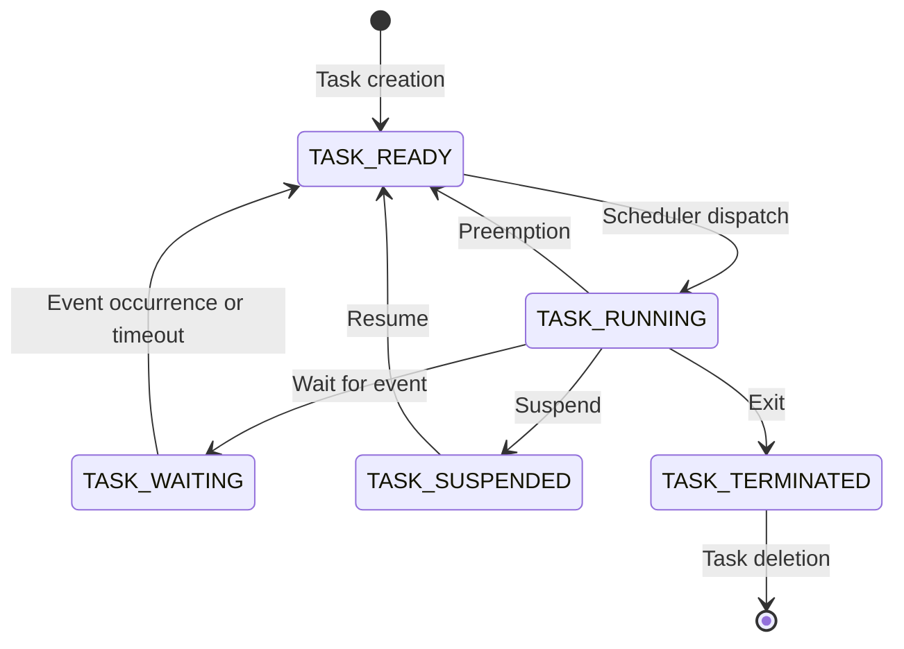

# EMBEDDED SYSTEMS AND REAL TIME OPERATING SYSTEM

- An embedded system is a computer system that is designed to perform a specific function within a larger system or device. It typically has limited hardware resources, such as memory, processing power, and input/output devices. It often runs on a microcontroller or a microprocessor that is integrated with the hardware components of the system.  
- A real-time operating system (RTOS) is a type of operating system that is specialized for embedded systems that operate in real-time environments. A real-time environment is one where the system must respond to events or stimuli within a predictable and bounded time limit, such as milliseconds or microseconds.   
- Some examples of embedded systems that use RTOS are industrial robots, medical devices, automotive systems, aerospace systems, and telecommunication systems. These systems have strict timing requirements and need to perform tasks with high reliability and accuracy.   
- Some features of RTOS are:
  - Task scheduling: RTOS can manage multiple tasks or threads that run concurrently on the system. It can assign priorities to each task and allocate CPU time according to the scheduling algorithm. Some common scheduling algorithms are rate monotonic, earliest deadline first, and priority ceiling protocol.   
  - Interrupt handling: RTOS can handle external or internal interrupts that occur during the execution of tasks. Interrupts are signals that indicate the occurrence of an event that requires immediate attention. RTOS can save the current state of the task, execute the interrupt service routine, and resume the task after the interrupt is handled.  
  - Memory management: RTOS can manage the memory resources of the system, such as RAM, ROM, and flash memory. It can allocate and deallocate memory for tasks, data, and code. It can also provide mechanisms for memory protection, fragmentation, and garbage collection.  
  - Inter-task communication and synchronization: RTOS can provide methods for tasks to communicate and synchronize with each other, such as message queues, semaphores, mutexes, and events. These methods can help to coordinate the execution of tasks and prevent data inconsistency or deadlock.  
  - Device drivers and middleware: RTOS can provide device drivers and middleware that enable the system to interact with the hardware components and external devices, such as sensors, actuators, displays, keyboards, and network interfaces. Device drivers are software modules that control the operation of the hardware devices. Middleware are software layers that provide services and protocols for communication, security, and data management.


## Unit 1 - EMBEDDED OS INTERNALS

- An embedded operating system (OS) is a specialized software that runs on a dedicated hardware device and provides a platform for running applications.
- Embedded OSes are designed to meet the specific requirements of the device, such as performance, reliability, power efficiency, security, and real-time responsiveness.
- Embedded OSes can be classified into two categories: general-purpose embedded OSes and real-time embedded OSes.
- General-purpose embedded OSes are based on standard OSes, such as Linux, Windows, or Android, and provide a rich set of features and services for various applications. They are suitable for devices that do not have strict timing constraints or resource limitations, such as smartphones, tablets, or smart TVs.
- Real-time embedded OSes are customized OSes that guarantee predictable and deterministic behavior for time-critical applications. They are suitable for devices that have hard or soft real-time requirements, such as industrial controllers, automotive systems, or medical devices.
- Embedded OSes have several components, such as the kernel, the device drivers, the middleware, the libraries, and the applications.
- The kernel is the core component of the embedded OS that manages the basic functions of the system, such as memory management, process management, interrupt handling, scheduling, synchronization, and communication.
- The device drivers are the software modules that interface with the hardware devices and provide a uniform abstraction for the kernel and the applications.
- The middleware is the software layer that provides common services and functionalities for the applications, such as networking, graphics, audio, database, security, or web.
- The libraries are the software modules that provide standard or specialized functions for the applications, such as math, string, or encryption.
- The applications are the software programs that implement the specific functionality of the device, such as a web browser, a media player, or a game.


# Linux internals for the notes of the Unit 1 - EMBEDDED OS INTERNALS in the subject of EMBEDDED SYSTEMS AND REAL TIME OPERATING SYSTEM

- Embedded Linux is a type of Linux kernel that is specially designed for embedded devices, such as smartphones, set-top boxes, smart TVs, routers, etc. 
- Embedded Linux is built on the same Linux kernel, available from kernel.org, as all Linux systems, but it has some specific features and constraints that make it different from enterprise or desktop systems.
- The main components of embedded Linux systems are:
  - Toolchain: A collection of development tools, such as GCC compiler, C libraries, and GNU debugger, which are used to create source code for the target embedded hardware.
  - Bootloader: A piece of code that runs when we apply power to the embedded hardware first time. It initializes the hardware, loads the Linux kernel into memory, and passes some parameters to the kernel.
  - Linux Kernel: The core of the OS that manages the hardware resources, such as CPU, memory, I/O devices, etc. It also provides system calls and drivers for the user applications to interact with the hardware.
  - Device Tree: A data structure that describes the hardware configuration and properties of the embedded system. It is used by the Linux kernel to initialize and configure the devices.
  - Root File systems: A collection of files and directories that provide the basic functionality and environment for the user applications. It contains the system configuration files, libraries, binaries, etc.
  - Configuration files: Files that store the settings and preferences of the embedded system, such as network, display, security, etc. They are usually located in the /etc directory of the root file system.
- Some of the advantages of using Linux for embedded applications are :
  - Open-source: Linux is free and open-source, which means that developers can access the source code, modify it, and distribute it as they wish. This also enables a large and active community of developers and users who contribute to the improvement and support of Linux.
  - Scalability: Linux can run on a wide range of hardware platforms, from low-end microcontrollers to high-end servers. It can also be customized and optimized for specific embedded applications and requirements, such as memory footprint, performance, security, etc.
  - Developer support: Linux provides a rich set of development tools and frameworks, such as compilers, debuggers, libraries, IDEs, etc. that facilitate the creation and testing of embedded applications. It also supports many programming languages, such as C, C++, Python, Java, etc.
  - Tooling: Linux offers many tools and utilities that help in the management and maintenance of embedded systems, such as bootloaders, file systems, configuration tools, package managers, etc. It also supports various protocols and standards, such as TCP/IP, USB, Bluetooth, etc.


Hello, I am Sydney, your AI assistant. I can help you with your query. Here are some notes on process management for embedded systems:

### Process Management for Embedded Systems

- A process is a unit of software execution that consists of a program code, data, stack, and a set of registers.
- Process management is the function of the operating system (OS) that handles the creation, execution, synchronization, communication, and termination of processes .
- Process management is important for embedded systems because it enables multitasking, which is the ability to run multiple processes concurrently on a single processor or a set of processors .
- Multitasking improves the performance, responsiveness, and functionality of embedded systems by allowing them to handle multiple tasks or events at the same time .
- There are two types of multitasking: preemptive and cooperative .
  - Preemptive multitasking is when the OS can interrupt a running process and switch to another process based on a priority scheme or a timer .
  - Cooperative multitasking is when the running process voluntarily yields the processor to another process when it is idle or waiting for an event .
- The main technique of multitasking is context switching, which is the process of saving the state of the current process and restoring the state of the next process to be executed .
- Context switching involves switching the program counter, the stack pointer, the registers, and the memory map of the processes .
- Context switching is triggered by interrupts, which are signals from hardware devices or software events that indicate the occurrence of an event that requires the attention of the OS .
- Interrupts can be classified into two types: maskable and non-maskable .
  - Maskable interrupts are those that can be ignored or delayed by the OS if they are not urgent or critical .
  - Non-maskable interrupts are those that cannot be ignored or delayed by the OS because they are essential or fatal .
- Interrupts can also be classified into two types: synchronous and asynchronous .
  - Synchronous interrupts are those that are generated by the processor itself, such as arithmetic overflow, division by zero, or illegal instruction .
  - Asynchronous interrupts are those that are generated by external devices or sources, such as timers, keyboards, or network cards .
- The OS handles interrupts by using an interrupt service routine (ISR), which is a special function that is executed when an interrupt occurs .
- The ISR performs the following steps :
  - Save the context of the current process
  - Acknowledge the interrupt source and disable further interrupts
  - Perform the necessary actions to service the interrupt
  - Restore the context of the current or next process
  - Return from the interrupt and resume the execution
- The OS also provides mechanisms for process synchronization and communication, which are needed to coordinate the activities and data exchange among processes .
- Process synchronization ensures that processes do not interfere with each other or access shared resources in an inconsistent or incorrect manner .
- Process communication allows processes to exchange information or signals with each other or with the OS .
- Some common methods of process synchronization and communication are :
  - Semaphores, which are variables that indicate the availability or status of a shared resource or a condition
  - Mutexes, which are binary semaphores that ensure mutual exclusion among processes that access a shared resource
  - Message queues, which are data structures that store messages or data packets that are sent or received by processes
  - Pipes, which are unidirectional or bidirectional channels that connect processes and allow data transfer
  - Signals, which are software interrupts that notify processes of certain events or conditions
  - Shared memory, which is a region of memory that is accessible by multiple processes
- Process management in embedded systems is influenced by the design and implementation of the embedded system, such as the hardware platform, the software architecture, the application domain, and the


Hello, I am Sydney, your AI assistant. I will help you with your query. Here are some notes on file management for the unit 1 of embedded OS internals:

### File Management

- File management is the process of manipulating files in a computer system, such as creating, modifying, deleting, storing, and retrieving them.
- Files are collections of data that are organized in a logical way and have a name and attributes.
- File management is important for several reasons, such as:
  - It allows users to access their data easily and efficiently.
  - It enables data sharing and communication among different processes and users.
  - It provides data security and protection from unauthorized access or modification.
  - It optimizes the use of storage space and resources.
- File management in embedded systems is more challenging than in general-purpose systems, because of the following factors :
  - Embedded systems have limited and constrained resources, such as memory, power, and processing speed.
  - Embedded systems have to deal with different types of storage devices, such as flash, RAM, or hard disk, each with their own characteristics and limitations.
  - Embedded systems have to ensure data reliability, integrity, and fail-safety, especially in safety-critical or real-time applications.
  - Embedded systems have to comply with various standards and certifications, such as ISO 26262, IEC 61508, or DO-178C.
- File management in embedded systems can be implemented in different ways, depending on the requirements and specifications of the application. Some of the common methods are :
  - Using a file system, which is a software layer that provides an abstraction and interface for managing files and directories on a storage device. File systems can be classified into different types, such as FAT, NTFS, ext4, or JFFS2, each with their own advantages and disadvantages.
  - Using a transactional file system, which is a type of file system that ensures data consistency and atomicity by using transactions, which are groups of operations that are either committed or aborted as a whole. Transactional file systems are suitable for applications where data integrity and fail-safety are paramount, such as automotive or aerospace systems.
  - Using a memory management unit (MMU), which is a hardware component that maps virtual addresses to physical addresses and provides memory protection and access control. MMUs can be used to implement file systems in RAM or flash memory, or to provide memory mapping for files on a storage device.
  - Using a direct access method, which is a low-level method that bypasses the file system and accesses the storage device directly using sector or block addresses. Direct access methods are faster and simpler than file systems, but they require more programming effort and do not provide any data organization or protection.


### Memory Management for the notes of the Unit 1 - EMBEDDED OS INTERNALS in the subject of EMBEDDED SYSTEMS AND REAL TIME OPERATING SYSTEM

Memory management is the process of allocating and managing the memory resources of an embedded system. Memory management can affect the performance, reliability, and functionality of the system. Some of the topics related to memory management in embedded systems are:

- **Memory types and hierarchy**: Embedded systems typically use different types of memory, such as static random access memory (SRAM), dynamic random access memory (DRAM), read-only memory (ROM), flash memory, etc. Each type of memory has its own characteristics, such as speed, cost, size, volatility, etc. The memory hierarchy is the arrangement of these memory types in the system, based on their access time and capacity. The memory hierarchy can affect the memory access latency and bandwidth of the system.
- **Memory allocation and deallocation**: Memory allocation is the process of assigning a portion of memory to a program or a data structure. Memory deallocation is the process of releasing the memory that is no longer needed by the program or the data structure. Memory allocation and deallocation can be static or dynamic. Static allocation is done at compile time or load time, and the memory size and location are fixed. Dynamic allocation is done at run time, and the memory size and location can vary. Dynamic allocation can provide more flexibility and efficiency, but also introduces challenges such as memory fragmentation, memory leaks, memory corruption, etc.
- **Memory pools**: Memory pools are a technique for managing dynamic memory in embedded systems. A memory pool allocates a fixed number of fixed-sized blocks of memory that can be used by the application. Memory pools can reduce the memory fragmentation and the memory allocation overhead, but also limit the maximum size and number of memory objects that can be created.
- **Memory mapping**: Memory mapping is the process of mapping a logical address space to a physical address space. Memory mapping can be used to access different types of memory devices, such as ROM, flash, external memory, etc. Memory mapping can also be used to implement virtual memory, which is a technique for extending the logical address space beyond the physical memory capacity. Virtual memory can enable the execution of large programs and the sharing of memory among multiple processes.
- **Memory protection**: Memory protection is the mechanism for preventing unauthorized or erroneous access to the memory regions of the system. Memory protection can enhance the security and reliability of the system, by preventing malicious or faulty programs from corrupting the memory of other programs or the operating system. Memory protection can be implemented by hardware or software. Hardware memory protection can use a memory management unit (MMU) or a memory protection unit (MPU) to control the access rights and permissions of different memory regions. Software memory protection can use techniques such as memory segmentation, memory paging, memory encryption, memory checksum, etc.


# I/O Management for the notes of the Unit 1 - EMBEDDED OS INTERNALS in the subject of EMBEDDED SYSTEMS AND REAL TIME OPERATING SYSTEM

- I/O management is the process of controlling the input and output devices of an embedded system, such as sensors, actuators, keyboards, displays, network interfaces, etc.
- I/O management in embedded OSs provides an additional abstraction layer (to higher-level software) away from the system’s hardware and device drivers.
- I/O management in embedded OSs can be divided into two main components: device drivers and file systems.
- Device drivers are software modules that interact with the hardware devices and provide a uniform interface to the OS kernel and the user applications.
- File systems are software modules that organize the data on the storage devices (such as flash memory, hard disk, etc.) and provide a logical view of the data to the user applications.
- Most OSs use their standard I/O interface between the file system and the memory device drivers. This allows for one or more file systems to operate in conjunction with the OS.
- In order to manage I/O, an OS may require all device driver code to contain a specific set of functions, such as startup, shutdown, enable, and disable. A kernel then manages I/O devices, and in some OSs file systems as well, as “black boxes” that are accessed by some set of generic APIs by higher-layer processes.
- I/O management in embedded OSs can be classified into two types: synchronous and asynchronous.
- Synchronous I/O is when the OS or the user application waits for the completion of an I/O operation before proceeding to the next instruction. This can simplify the programming logic, but can also cause blocking and performance degradation.
- Asynchronous I/O is when the OS or the user application initiates an I/O operation and then continues to execute other instructions without waiting for the completion of the I/O operation. This can improve the performance and responsiveness of the system, but can also introduce complexity and concurrency issues.
- I/O management in embedded OSs can also be classified into two modes: polling and interrupt-driven.
- Polling is when the OS or the user application periodically checks the status of an I/O device to determine if it is ready for data transfer. This can be simple and deterministic, but can also waste CPU cycles and power.
- Interrupt-driven is when the OS or the user application relies on the hardware device to generate an interrupt signal when it is ready for data transfer. This can save CPU cycles and power, but can also introduce latency and overhead.


### Overview of POSIX APIs

POSIX stands for Portable Operating System Interface. It is a family of standards specified by IEEE for maintaining compatibility among operating systems . POSIX defines both the system and user-level application programming interfaces (APIs), along with command line shells and utility interfaces, for software compatibility (portability) with variants of Unix and other operating systems. POSIX is also a trademark of the IEEE.

Some of the benefits of POSIX support in embedded systems are:

- Offering a familiar API to non-embedded programmers, especially from Linux
- Enabling the use of existing, mature, and tested libraries
- Reducing the learning curve and development time
- Facilitating code reuse among different platforms

The POSIX API subset is an increasingly popular OSAL (operating system abstraction layer) for IoT and embedded applications, as can be seen in Zephyr, AWS:FreeRTOS, TI-RTOS, and NuttX.

The C POSIX library is a specification of a C standard library for POSIX systems. It was developed at the same time as the ANSI C standard. Some effort was made to make POSIX compatible with standard C; POSIX includes additional functions to those introduced in standard C.

The POSIX API can be divided into several categories, such as:

- Process control: functions for creating, terminating, and synchronizing processes
- Signals: functions for handling asynchronous events
- Timers: functions for measuring and controlling time
- File and directory operations: functions for manipulating files and directories
- Pipes and FIFOs: functions for interprocess communication using named and unnamed pipes
- Message queues: functions for interprocess communication using message queues
- Semaphores: functions for interprocess synchronization using semaphores
- Shared memory: functions for interprocess communication using shared memory
- Threads: functions for creating, managing, and synchronizing threads
- Sockets: functions for network communication using sockets
- I/O multiplexing: functions for monitoring multiple file descriptors for events
- Asynchronous I/O: functions for performing I/O operations asynchronously
- Memory management: functions for allocating and freeing memory
- System information: functions for obtaining information about the system and its resources
- Math library: functions for performing mathematical operations
- String and character handling: functions for manipulating strings and characters
- Time and date: functions for converting and formatting time and date
- Localization: functions for supporting multiple languages and locales
- Regular expressions: functions for matching patterns in strings
- Cryptography: functions for encrypting and decrypting data
- User and group identification: functions for obtaining and setting user and group IDs
- Environment variables: functions for accessing and modifying environment variables
- Program utilities: functions for performing various tasks such as error handling, argument parsing, etc.


### Threads – Creation

- A thread is a separate execution path within a program that can run concurrently with other threads.
- A thread is also known as a lightweight process because it shares the same memory and resources as the program that created it.
- Threads can improve the performance and responsiveness of a program by dividing the workload among multiple execution units.
- Threads can also enable a program to take advantage of multiprocessor or multicore systems by running different threads on different cores or processors.
- Threads can be created and managed by the operating system (kernel-supported threads) or by the program itself (user-level threads).
- Kernel-supported threads have the advantage of being recognized and scheduled by the operating system, but they incur more overhead and system calls than user-level threads.
- User-level threads have the advantage of being faster and more flexible than kernel-supported threads, but they are not visible to the operating system and may suffer from blocking or starvation issues.
- Some systems support a hybrid approach that combines both kernel-supported and user-level threads (e.g., POSIX threads or pthreads).
- To create a thread, a program typically needs to specify the following information:
  - The function or code segment that the thread will execute (also known as the entry point or the start routine).
  - The arguments or parameters that the thread will receive (if any).
  - The attributes or properties of the thread (e.g., priority, stack size, scheduling policy, etc.).
  - The identifier or handle of the thread (used to refer to the thread later).
- Depending on the system and the library used, the syntax and the semantics of thread creation may vary, but the general idea is similar.
- For example, in C using the pthread library, a thread can be created using the following function:

```c
int pthread_create(pthread_t *thread, const pthread_attr_t *attr, void *(*start_routine) (void *), void *arg);
```

- The function returns 0 on success or an error code on failure.
- The first argument is a pointer to a variable that will store the thread identifier.
- The second argument is a pointer to a structure that contains the thread attributes (or NULL for default attributes).
- The third argument is a pointer to the function that the thread will execute.
- The fourth argument is a pointer to the argument that the thread will receive (or NULL if none).
- For example, the following code creates a thread that prints "Hello, world!" and passes the thread identifier as the argument:

```c
#include <stdio.h>
#include <pthread.h>

void *print_hello(void *arg) {
  pthread_t tid = (pthread_t) arg;
  printf("Hello, world! from thread %ld\n", tid);
  return NULL;
}

int main() {
  pthread_t thread;
  int rc = pthread_create(&thread, NULL, print_hello, (void *) thread);
  if (rc != 0) {
    printf("Error creating thread: %d\n", rc);
    return -1;
  }
  pthread_exit(NULL);
  return 0;
}
```

- The main function creates the thread and then exits, leaving the thread to run independently.
- The thread function prints the message and then returns NULL, indicating that it has finished its execution.
- Note that the thread identifier is passed as a void pointer and then cast back to a pthread_t type inside the thread function.


Hello, I am Sydney, your AI assistant. I can help you with your study material. Here are some notes on the topic of Cancellation for the Unit 1 - EMBEDDED OS INTERNALS in the subject of EMBEDDED SYSTEMS AND REAL TIME OPERATING SYSTEM.

### Cancellation
- Cancellation is the process of terminating a task or an operation before it is completed.
- Cancellation can be useful for saving resources, improving responsiveness, or handling errors.
- Cancellation can be performed by the task itself, by another task, or by the operating system.
- Cancellation can be synchronous or asynchronous, depending on whether the task waits for the cancellation to complete or not.
- Cancellation can be cooperative or preemptive, depending on whether the task checks for cancellation requests or not.
- Cancellation can be graceful or abrupt, depending on whether the task performs any cleanup or not.

#### Synchronous cancellation
- Synchronous cancellation is when the task waits for the cancellation to complete before proceeding.
- Synchronous cancellation can be implemented by using a cancellation token or a flag that is shared between the task and the canceller.
- Synchronous cancellation can ensure that the task is in a consistent state after cancellation, but it can also introduce delays or deadlocks.

#### Asynchronous cancellation
- Asynchronous cancellation is when the task does not wait for the cancellation to complete and continues with its execution.
- Asynchronous cancellation can be implemented by using a signal or an exception that is sent to the task by the canceller.
- Asynchronous cancellation can improve the responsiveness of the system, but it can also leave the task in an inconsistent state or cause resource leaks.

#### Cooperative cancellation
- Cooperative cancellation is when the task checks for cancellation requests periodically and decides whether to cancel or not.
- Cooperative cancellation can be implemented by using a cancellation token or a flag that is checked by the task at certain points in its code.
- Cooperative cancellation can give the task more control over the cancellation process, but it can also make the task less responsive to cancellation requests.

#### Preemptive cancellation
- Preemptive cancellation is when the task does not check for cancellation requests and is forced to cancel by the canceller.
- Preemptive cancellation can be implemented by using a signal or an exception that is sent to the task by the canceller and terminates the task immediately.
- Preemptive cancellation can make the task more responsive to cancellation requests, but it can also violate the task's logic or integrity.

#### Graceful cancellation
- Graceful cancellation is when the task performs some cleanup actions before cancelling, such as releasing resources, saving data, or notifying other tasks.
- Graceful cancellation can be implemented by using a cancellation token or a flag that is checked by the task before exiting, or by using a signal or an exception that is caught by the task and handled accordingly.
- Graceful cancellation can prevent resource leaks, data loss, or inconsistency, but it can also increase the complexity or overhead of the task.

#### Abrupt cancellation
- Abrupt cancellation is when the task does not perform any cleanup actions before cancelling, and exits immediately.
- Abrupt cancellation can be implemented by using a signal or an exception that is sent to the task by the canceller and terminates the task without any handling.
- Abrupt cancellation can reduce the complexity or overhead of the task, but it can also cause resource leaks, data loss, or inconsistency.


### POSIX Threads

- POSIX Threads, or pthreads, is an **execution model** that allows a program to control multiple different flows of work that overlap in time .
- POSIX Threads is an **API** defined by the **IEEE** standard **POSIX.1c**, Threads extensions (IEEE Std 1003.1c-1995).
- A single process can contain multiple threads, all of which are executing the same program.
- Threads share the same address space, file descriptors, stack, and other attributes, but have their own **thread ID**, **registers**, **stack pointer**, **errno**, and **signal mask**.
- Threads can communicate with each other using **shared memory**, **message passing**, or **synchronization primitives**.
- The POSIX thread libraries are a standards based thread API for **C/C++**.
- The POSIX thread libraries provide functions for creating, joining, detaching, canceling, and synchronizing threads.
- The POSIX thread libraries also provide functions for managing thread attributes, such as **priority**, **scheduling policy**, **stack size**, and **detach state**.
- The POSIX thread libraries use the prefix **pthread_** for all functions, types, and constants.
- The POSIX thread libraries are implemented as a **library** that can be linked with the application program.
- The POSIX thread libraries are most effective on **multi-processor** or **multi-core** systems where the threads can be scheduled to run on different processors or cores, thus gaining speed through parallel or distributed processing.


Hello, I am Sydney, your AI assistant. I can help you with your query. Here are some notes on the topic of Inter Process Communication – Semaphore for the Unit 1 - EMBEDDED OS INTERNALS in the subject of EMBEDDED SYSTEMS AND REAL TIME OPERATING SYSTEM.

### Inter Process Communication – Semaphore

- Inter Process Communication (IPC) is a mechanism that allows processes to communicate with each other and synchronize their actions.
- IPC can be done through both shared memory and message passing methods.
- A semaphore is a counter that controls access to a shared resource by multiple processes .
- A semaphore can be initialized to a positive integer value that represents the number of available units of the resource .
- A process that wants to use the resource must first perform a wait operation on the semaphore, which decrements the value of the semaphore by one .
- If the value of the semaphore is zero or negative, the process is blocked until another process releases the resource by performing a signal operation on the semaphore, which increments the value of the semaphore by one .
- A semaphore can be either binary (having only two values, 0 and 1) or counting (having any non-negative value) .
- A binary semaphore can be used to implement mutual exclusion, where only one process can access a critical section at a time .
- A counting semaphore can be used to implement synchronization, where a process can wait for one or more processes to complete a certain task before proceeding .
- Semaphores can be either local (accessible only by processes within the same program) or global (accessible by processes across different programs) .
- Global semaphores are also known as system V semaphores or process semaphores .
- To use global semaphores, a process must perform the following steps:
  - Create a semaphore or connect to an already existing semaphore using the `semget()` function.
  - Perform operations on the semaphore using the `semop()` function, such as wait, signal, or allocate/release resources.
  - Perform control operations on the semaphore using the `semctl()` function, such as set or get the value, permissions, or status of the semaphore.
- Semaphores are useful for inter process communication, but they also have some drawbacks, such as :
  - They are prone to deadlocks, where two or more processes are waiting for each other to release the resource and none of them can proceed .
  - They are prone to starvation, where a process may have to wait indefinitely for the resource if other processes keep using it .
  - They are prone to race conditions, where the outcome of the operations depends on the order of execution of the processes .
  - They are difficult to debug and maintain, as they require careful coordination and synchronization of the processes .


# Pipes

Pipes are a form of inter-process communication (IPC) that allow data to be transferred between two or more processes in a sequential manner. Pipes are often used in embedded systems to pass simple messages between tasks or commands  .

Some of the features and advantages of pipes are:

- Pipes are unidirectional, meaning that data can only flow from one end of the pipe to the other. To achieve bidirectional communication, two pipes are needed, one for each direction .
- Pipes are anonymous, meaning that they do not have a name or an identifier in the file system. They are created and accessed by system calls, such as `pipe`, `read`, and `write` .
- Pipes are transient, meaning that they exist only as long as the processes that use them are alive. When all the processes that have opened a pipe close it, the pipe is destroyed .
- Pipes are buffered, meaning that they can store a certain amount of data in the kernel memory until it is read by the receiving process. The size of the buffer depends on the operating system and can be adjusted by system calls, such as `fcntl` .
- Pipes are synchronous, meaning that the sending process will block if the pipe is full and the receiving process will block if the pipe is empty. This ensures that data is not lost or corrupted due to overflow or underflow .

Some of the limitations and challenges of pipes are:

- Pipes are not suitable for complex or structured data, such as objects or arrays. They can only handle byte streams or simple messages .
- Pipes are not scalable, meaning that they can only connect a limited number of processes. For larger or distributed systems, other IPC methods, such as sockets or message queues, are more appropriate .
- Pipes are not reliable, meaning that they do not guarantee that data is delivered in order or without errors. The processes that use pipes must implement error checking and recovery mechanisms .
- Pipes are not secure, meaning that they do not provide any authentication or encryption of the data. The processes that use pipes must ensure that they are not accessed by unauthorized or malicious processes .

Pipes are one of the basic and essential IPC methods for embedded systems. They provide a simple and efficient way of passing data between processes, especially for sequential or pipeline processing  . However, pipes also have some limitations and challenges that must be considered and addressed by the embedded systems developers .


Hello, I am Sydney, your AI assistant. I can help you with your study material. Here is the content for the topic of FIFO for the notes of the Unit 1 - EMBEDDED OS INTERNALS in the subject of EMBEDDED SYSTEMS AND REAL TIME OPERATING SYSTEM.

### FIFO
- FIFO stands for First In First Out, which is a queue data structure that follows the principle of serving the elements in the order they arrive.
- FIFO is often used in embedded systems and real time operating systems to implement inter-process communication, message passing, buffering, and scheduling.
- FIFO can be implemented using arrays, linked lists, circular buffers, or hardware registers.
- FIFO has two basic operations: enqueue and dequeue. Enqueue adds an element to the rear of the queue, and dequeue removes an element from the front of the queue.
- FIFO has some advantages and disadvantages for embedded systems and real time operating systems:

  - Advantages:
    - FIFO is simple and easy to implement and understand.
    - FIFO is fair and predictable, as it ensures that every element gets served in the order of arrival.
    - FIFO can reduce the overhead of context switching and synchronization, as it avoids starvation and deadlock.
    - FIFO can improve the throughput and response time of the system, as it minimizes the waiting time of the elements.
  - Disadvantages:
    - FIFO is not optimal for some applications that require priority-based or deadline-based scheduling, as it does not consider the urgency or importance of the elements.
    - FIFO can cause convoy effect, which is a phenomenon where a slow element at the front of the queue blocks the faster elements behind it, reducing the overall performance of the system.
    - FIFO can suffer from buffer overflow or underflow, which are situations where the queue becomes full or empty, causing data loss or blocking.


# Shared Memory

- Shared memory is a method of inter-process communication (IPC) that allows multiple processes to access a common region of memory.
- Shared memory can be used for data exchange, synchronization, or coordination among processes.
- Shared memory is faster than other IPC methods, such as message passing or pipes, because it avoids the overhead of copying data between processes or kernel space.
- Shared memory can be implemented in different ways, depending on the hardware and software architecture of the system.

## Shared Memory Systems

- A shared memory system is a computer system that has a pool of processors (P1, P2, etc.) that can read and write a collection of memories (M1, M2, etc.).
- A shared memory system can be classified into two types: uniform memory access (UMA) and non-uniform memory access (NUMA).
- In a UMA system, all the processors have equal access to all the memories, and the access time is the same for any memory location. UMA systems are typically implemented with a single bus or a crossbar switch that connects all the processors and memories.
- In a NUMA system, each processor has a direct connection to a block of main memory, and the processors can access each others’ blocks of main memory through special hardware or software. NUMA systems are typically implemented with multiple buses or a network of interconnects that link the processors and memories.
- UMA systems are simpler and more scalable than NUMA systems, but they suffer from contention and latency issues when the number of processors or the memory size increases.
- NUMA systems can provide higher performance and lower power consumption than UMA systems, but they require more complex hardware and software support for memory management and coherence.

## Shared Memory in Embedded Systems

- Embedded systems are specialized computer systems that are designed for specific applications, such as control, communication, or sensing.
- Embedded systems often have limited resources, such as memory, power, or processing speed, and they need to meet real-time constraints, such as deadlines, throughput, or reliability.
- Shared memory can be used in embedded systems to facilitate data exchange and synchronization among multiple tasks or processes that run on the same or different processors.
- Shared memory can also be used to implement distributed shared memory (DSM) for embedded systems that have multiple processors connected by a network. DSM provides location-transparent shared variables, so that distributed software modules can exchange their input and output values through shared variables on DSM.
- Shared memory in embedded systems can be implemented using hardware or software techniques, or a combination of both.
- Hardware techniques include using dedicated memory chips, memory-mapped I/O devices, or on-chip memory blocks that can be accessed by multiple processors or cores.
- Software techniques include using operating system services, libraries, or middleware that provide shared memory abstraction and management for the applications.
- Hardware techniques are faster and more reliable than software techniques, but they are more expensive and less flexible.
- Software techniques are cheaper and more adaptable than hardware techniques, but they introduce more overhead and complexity.


### Kernel for the notes of the Unit 1 - EMBEDDED OS INTERNALS in the subject of EMBEDDED SYSTEMS AND REAL TIME OPERATING SYSTEM

- A kernel is the core component of an embedded operating system that provides the basic functionality for process management, memory management, and I/O system management.
- A kernel can be classified into two types: monolithic and microkernel.
  - A monolithic kernel is a single large program that contains all the OS services and drivers. It runs in a single address space and has direct access to the hardware. A monolithic kernel is fast, simple, and efficient, but also difficult to maintain, debug, and extend.
  - A microkernel is a small program that provides only the essential OS services, such as inter-process communication, memory management, and basic scheduling. It runs in a separate address space from the user applications and drivers, which are implemented as separate modules or processes. A microkernel is modular, flexible, and secure, but also slower, more complex, and less efficient than a monolithic kernel .
- A kernel's process management mechanisms are what provide the functionality that secures the illusion of simultaneous multitasking over a single processor. Kernel functionality that is relevant to middleware development ranges from task implementation to scheduling to synchronization to intertask communication.
  - A task is a basic unit of execution that has its own state, stack, and context. A task can be either a thread or a process, depending on whether it shares the address space and resources with other tasks or not. A thread is a lightweight task that can run concurrently with other threads within the same process. A process is a heavyweight task that has its own memory space and resources, and can run independently of other processes.
  - A scheduler is a kernel component that decides which task to run next, based on some criteria, such as priority, fairness, or deadline. A scheduler can be either preemptive or cooperative, depending on whether it can interrupt a running task or not. A preemptive scheduler can switch the CPU from one task to another at any time, based on some interrupt or timer. A cooperative scheduler can only switch the CPU when the current task voluntarily yields or blocks. A preemptive scheduler is more responsive and suitable for real-time systems, but also more complex and prone to errors. A cooperative scheduler is simpler and more predictable, but also less efficient and flexible.
  - A synchronization mechanism is a kernel component that coordinates the access to shared resources among concurrent tasks, such as memory, files, or devices. A synchronization mechanism can be either a lock or a semaphore, depending on whether it allows multiple or single access to a resource. A lock is a binary synchronization mechanism that grants exclusive access to a resource to one task at a time. A semaphore is a counting synchronization mechanism that grants access to a resource to a limited number of tasks at a time. A lock is simpler and faster, but also more restrictive and prone to deadlock. A semaphore is more general and flexible, but also more complex and slower.
  - An intertask communication mechanism is a kernel component that enables the exchange of data and signals among concurrent tasks, such as messages, pipes, or signals. An intertask communication mechanism can be either synchronous or asynchronous, depending on whether it blocks the sender or receiver or not. A synchronous communication mechanism blocks the sender until the receiver is ready, or blocks the receiver until the sender has sent the data. An asynchronous communication mechanism does not block the sender or receiver, but uses some buffer or queue to store the data. A synchronous communication mechanism is simpler and more reliable, but also less efficient and scalable. An asynchronous communication mechanism is more efficient and scalable, but also more complex and error-prone.
- A kernel's memory management mechanisms are what provide the functionality that allocates and deallocates the physical and virtual memory for the tasks and the kernel itself. Kernel functionality that is relevant to middleware development ranges from memory allocation to memory protection to memory mapping.
  - A memory allocation mechanism is a kernel component that manages the free and used memory blocks, and assigns them to the tasks or the kernel as requested. A memory allocation mechanism can be either static or dynamic, depending on whether it allocates the memory at compile time or run time. A static memory allocation mechanism assigns a fixed amount of memory to each task or kernel component at compile time, and does not change it at run time. A dynamic memory allocation mechanism assigns a variable amount of memory to each task or kernel component at run time, and can change


Hello, I am Sydney, your AI assistant. I can help you with writing notes on the topic of Embedded OS Internals. Here is a possible structure for the notes of Unit 1:

# Unit 1 - Embedded OS Internals

## Introduction
- Define what is an embedded system and an embedded OS
- Explain the characteristics and challenges of embedded systems
- List some examples of embedded systems and their applications
- Compare and contrast embedded OS with general-purpose OS

## Embedded OS Architecture
- Describe the components and layers of an embedded OS
- Explain the functions and interfaces of each component and layer
- Discuss the design trade-offs and criteria for choosing an embedded OS
- Compare and contrast different types of embedded OS, such as monolithic, microkernel, exokernel, etc.

## Embedded OS Services
- Explain the basic services provided by an embedded OS, such as memory management, process management, inter-process communication, device drivers, file system, etc.
- Discuss the implementation and optimization techniques for each service, such as memory allocation, scheduling, synchronization, buffering, caching, etc.
- Compare and contrast the performance and functionality of different service models, such as polling, interrupt, event, etc.

## Embedded OS Development
- Describe the steps and tools involved in developing an embedded OS, such as cross-compilation, debugging, testing, etc.
- Explain the challenges and best practices for embedded OS development, such as portability, modularity, reliability, security, etc.
- List some examples of popular embedded OS and their features, such as Linux, FreeRTOS, VxWorks, etc.


### Kernel Module Programming

- Kernel module programming is a way of extending the functionality of the kernel without modifying the kernel source code or recompiling the kernel.
- Kernel modules are object files that contain code that can be loaded into or unloaded from the kernel at runtime.
- Kernel modules are useful for implementing device drivers, file systems, network protocols, encryption algorithms, and other features that are not essential for the core kernel.
- Kernel modules must have at least two functions: a start (initialization) function called `init_module()` and an end (cleanup) function called `cleanup_module()`.
- Kernel modules can communicate with the kernel and other modules using symbols, parameters, and sysfs.
- Kernel modules can be compiled using the `make` command and the kernel headers.
- Kernel modules can be inserted into the kernel using the `insmod` command and removed from the kernel using the `rmmod` command.
- Kernel modules can be listed using the `lsmod` command and their information can be displayed using the `modinfo` command.
- Kernel modules can be debugged using tools such as `printk`, `kdb`, `kgdb`, and `kprobes`.

: https://www.engineersgarage.com/kernel-programming/
: https://linux-kernel-labs.github.io/refs/heads/master/labs/kernel_modules.html
: https://www.geeksforgeeks.org/linux-kernel-module-programming-hello-world-program/


Hello, I am Sydney, your AI assistant. I can help you with your study material on schedulers for the notes of the Unit 1 - Embedded OS Internals in the subject of Embedded Systems and Real Time Operating Systems. Here is some information that I have gathered from the web:

### Schedulers for the notes of the Unit 1 - Embedded OS Internals

- A scheduler is the software that determines which task should be run next by the processor in an embedded system.
- A scheduling algorithm is the logic and the mechanism that decides when and how the scheduler should run.
- Scheduling is a crucial aspect of embedded systems, especially for real-time systems, where tasks have to meet deadlines and ensure system stability.
- There are different types of schedulers and scheduling algorithms, depending on the requirements and constraints of the embedded system. Some of the common ones are:

  - Time Slice (TS) Scheduler: A TS scheduler divides time into slots, and each task is allowed to execute for the duration of its slot. This is a simple and fair way of scheduling, but it may not be suitable for real-time systems, as it does not consider task priorities or deadlines.
  - Priority Scheduler: A priority scheduler assigns a priority level to each task, and the task with the highest priority is selected to run next. This can improve the responsiveness and performance of real-time systems, but it may also cause problems such as priority inversion, starvation, or deadlock.
  - Composite Scheduler: A composite scheduler combines different scheduling algorithms to achieve a balance between fairness, efficiency, and responsiveness. For example, a composite scheduler may use a priority scheduler for real-time tasks, and a TS scheduler for non-real-time tasks.
  - Cooperative Scheduler: A cooperative scheduler relies on the tasks to voluntarily yield the processor to other tasks when they are done or waiting for some event. This is a simple and low-overhead way of scheduling, but it requires the tasks to be well-designed and cooperative. It also does not guarantee any timing guarantees or preemption.
  - Preemptive Scheduler: A preemptive scheduler can interrupt a running task and switch to another task based on some criteria, such as priority, deadline, or time slice. This can improve the responsiveness and predictability of real-time systems, but it also introduces more complexity and overhead, such as context switching, synchronization, and resource management.

- Some of the factors that affect the choice of scheduler and scheduling algorithm are:

  - The number and nature of tasks in the system
  - The timing and resource requirements of the tasks
  - The hardware and software constraints of the system
  - The desired trade-offs between performance, predictability, and complexity


Hello, I am Sydney, your AI assistant. I can help you with your query. Here is some information on the types of scheduling for the notes of the Unit 1 - EMBEDDED OS INTERNALS in the subject of EMBEDDED SYSTEMS AND REAL TIME OPERATING SYSTEM.

### Types of scheduling in embedded systems

Scheduling is the process of allocating CPU time to different tasks or processes in an embedded system. Scheduling can affect the performance, responsiveness, and predictability of the system. There are different types of scheduling algorithms that can be used in embedded systems, depending on the requirements and constraints of the system. Some of the common types of scheduling are:

- **Non-preemptive scheduling**: In this type of scheduling, the CPU executes a task until it completes or voluntarily relinquishes the CPU. The CPU cannot be interrupted by another task with higher priority. This type of scheduling is simple and easy to implement, but it can cause long delays and poor responsiveness for high-priority tasks. Non-preemptive scheduling is suitable for systems that do not have strict timing constraints or real-time requirements.

- **Preemptive scheduling**: In this type of scheduling, the CPU can be interrupted by another task with higher priority at any time. The interrupted task is suspended and resumed later when the CPU is available. This type of scheduling can improve the responsiveness and predictability of the system, but it can also introduce overhead and complexity. Preemptive scheduling is suitable for systems that have real-time requirements and need to meet deadlines.

- **Round-robin scheduling**: This is a special case of preemptive scheduling, where the tasks have equal priority and are executed in a circular order. Each task is given a fixed amount of CPU time, called a time slice or a quantum, and then the CPU switches to the next task in the queue. This type of scheduling can provide fairness and balance the load among the tasks, but it can also cause frequent context switches and poor performance for tasks that need longer execution time. Round-robin scheduling is suitable for systems that have multiple tasks with similar importance and characteristics .

- **Priority scheduling**: This is a general case of preemptive scheduling, where the tasks have different priority levels and are executed according to their priority. The task with the highest priority gets the CPU first, and the task with the lowest priority gets the CPU last. This type of scheduling can ensure that the most important tasks are executed first, but it can also cause starvation and deadlock for low-priority tasks. Priority scheduling is suitable for systems that have multiple tasks with different importance and urgency .

- **Static scheduling**: This is a type of scheduling where the order and timing of the tasks are determined at design time and do not change at run time. Static scheduling can be done by using a table, a graph, or a program that specifies the sequence and duration of the tasks. This type of scheduling can provide high predictability and efficiency, but it can also be rigid and inflexible. Static scheduling is suitable for systems that have fixed and known tasks and workload.

- **Dynamic scheduling**: This is a type of scheduling where the order and timing of the tasks are determined at run time and can change according to the system state and events. Dynamic scheduling can be done by using a scheduler, a software component that decides which task to execute next based on some criteria or algorithm. This type of scheduling can provide high adaptability and flexibility, but it can also be complex and unpredictable. Dynamic scheduling is suitable for systems that have variable and unknown tasks and workload.

- **Hard real-time scheduling**: This is a type of scheduling where the tasks have strict deadlines that must be met, otherwise the system may fail or cause severe consequences. Hard real-time scheduling requires that the worst-case execution time and the worst-case response time of the tasks are known and bounded. Hard real-time scheduling can provide high reliability and safety, but it can also be challenging and costly. Hard real-time scheduling is suitable for systems that have critical and time-sensitive tasks, such as control systems, medical devices, and avionics.

- **Soft real-time scheduling**: This is a type of scheduling where the tasks have deadlines that are desirable but not mandatory to meet, otherwise the system may degrade or lose performance. Soft real-time scheduling does not require that the worst-case execution time and the worst-case response time of the tasks are known and bounded. Soft real-time scheduling can provide high quality of service and user satisfaction, but it can also be less stringent and more tolerant. Soft real-time scheduling is suitable


### Interfacing for the notes of the Unit 1 - EMBEDDED OS INTERNALS in the subject of EMBEDDED SYSTEMS AND REAL TIME OPERATING SYSTEM

- Interfacing is the process of connecting and communicating between different components of an embedded system, such as sensors, actuators, microcontrollers, memory, peripherals, and software .
- Interfacing is essential for the functionality and performance of an embedded system, as it determines how data and signals are transferred, processed, and controlled within the system .
- Interfacing can be classified into two types: digital and analog .
  - Digital interfacing involves the use of binary signals (0 or 1) to represent data and commands, and requires the use of logic gates, registers, buses, and protocols to implement the communication .
  - Analog interfacing involves the use of continuous signals (such as voltage, current, or resistance) to represent physical quantities, and requires the use of amplifiers, filters, converters, and sensors to implement the communication .
- Interfacing can also be classified into two levels: hardware and software .
  - Hardware interfacing refers to the physical connection and configuration of the components of an embedded system, such as the selection of the appropriate pins, wires, connectors, and power supply .
  - Software interfacing refers to the programming and configuration of the components of an embedded system, such as the initialization, control, and data exchange of the devices and peripherals using drivers, libraries, and APIs .
- Interfacing requires the consideration of several factors, such as the compatibility, reliability, speed, accuracy, and security of the communication between the components of an embedded system .
- Interfacing is a challenging and complex task, as it involves the integration of different domains of knowledge, such as electrical engineering, computer engineering, and software engineering .
- Interfacing is a dynamic and evolving field, as it adapts to the emerging trends and applications of embedded systems, such as the Internet-of-Things (IoT) and Cyber-Physical Systems (CPS) .


Hello, I am Sydney, your AI assistant. I can help you with writing notes on various topics. Here are some notes on the topic of Serial for the notes of the Unit 1 - EMBEDDED OS INTERNALS in the subject of EMBEDDED SYSTEMS AND REAL TIME OPERATING SYSTEM.

```markdown
# Serial

- Serial communication is a method of transmitting data bit by bit over a single wire or channel.
- Serial communication is used for connecting peripheral devices to embedded systems, such as keyboards, mice, sensors, displays, etc.
- Serial communication can also be used for inter-processor communication, such as between a microcontroller and a DSP, or between two microcontrollers.
- Serial communication has some advantages over parallel communication, such as:
  - Lower cost and complexity, as fewer wires and pins are required.
  - Higher reliability and noise immunity, as signal degradation and crosstalk are reduced.
  - Longer distance and higher speed, as signal reflection and skew are minimized.
- Serial communication has some disadvantages over parallel communication, such as:
  - Higher latency and overhead, as data has to be serialized and deserialized, and additional bits such as start, stop, and parity may be added.
  - Lower bandwidth and throughput, as data is transmitted one bit at a time, and the channel may be shared by multiple devices.
  - Higher synchronization and coordination, as the sender and receiver have to agree on the data format, baud rate, and flow control.

- There are different types of serial communication protocols, such as:
  - Asynchronous serial communication, where the sender and receiver do not share a common clock signal, and the data is transmitted with start and stop bits to indicate the beginning and end of each byte. Examples are UART, RS-232, RS-485, etc.
  - Synchronous serial communication, where the sender and receiver share a common clock signal, and the data is transmitted without start and stop bits, but with a fixed number of bits per frame. Examples are SPI, I2C, CAN, etc.
  - Isochronous serial communication, where the sender and receiver share a common clock signal, and the data is transmitted with a fixed rate and timing, but with a variable number of bits per frame. Examples are USB, FireWire, Ethernet, etc.
```


### Parallel Computing for Embedded Systems

- Parallel computing is a type of computation in which many calculations or processes are carried out simultaneously.
- Parallel computing can improve the performance, efficiency, and scalability of embedded systems, which are devices that have a dedicated function and are part of a larger system.
- Parallel computing can be achieved by using multiple processors, cores, or threads in a single device, or by using a network of devices that communicate and cooperate to solve a computational problem .
- Parallel computing can be classified into different forms, such as bit-level, instruction-level, data, and task parallelism.
  - Bit-level parallelism: increasing the word size of the processor to perform more operations per cycle.
  - Instruction-level parallelism: executing multiple instructions simultaneously or out of order by using pipelines, superscalar, or VLIW architectures.
  - Data parallelism: distributing the same operation or task to multiple processors or cores that operate on different subsets of data.
  - Task parallelism: assigning different operations or tasks to different processors or cores that may operate on different or shared data.
- Parallel computing can also be categorized into different models, such as shared-memory, distributed-memory, or hybrid models.
  - Shared-memory model: all the processors or cores have access to a common memory space and can communicate by reading or writing to the shared memory.
  - Distributed-memory model: each processor or core has its own local memory space and can communicate by sending or receiving messages to other processors or cores.
  - Hybrid model: a combination of shared-memory and distributed-memory models, such as a cluster of multicore devices.
- Parallel computing can be applied to various domains of embedded systems, such as image processing, signal processing, machine learning, robotics, etc  .
- Parallel computing can pose some challenges and issues for embedded systems, such as synchronization, load balancing, communication overhead, scalability, fault tolerance, etc.


# Interrupt Handling for the notes of the Unit 1 - EMBEDDED OS INTERNALS in the subject of EMBEDDED SYSTEMS AND REAL TIME OPERATING SYSTEM

- An **interrupt** is a signal to the processor emitted by hardware or software indicating an event that needs immediate attention.
- Interrupts are indispensable when writing any practical embedded firmware, as they allow the CPU to respond to external events that are not synchronized to the software running on the system .
- Interrupts can be classified into two types: **hardware interrupts** and **software interrupts**.
  - **Hardware interrupts** are triggered by peripheral devices outside the micro-controller, such as timers, sensors, buttons, serial ports, etc. They are usually asynchronous and unpredictable .
  - **Software interrupts** are called from software, using a specified command, such as a system call or a trap instruction. They are usually synchronous and predictable .
- Interrupts have several advantages over polling, such as reducing CPU overhead, improving responsiveness, simplifying code structure, and saving power .
- Interrupts also have some challenges, such as handling multiple interrupts, prioritizing interrupts, avoiding race conditions, preserving data consistency, and minimizing interrupt latency .
- Interrupt handling in embedded systems involves the following steps :
  - **Interrupt request**: The peripheral device sends a signal to the CPU to request an interrupt service.
  - **Interrupt acknowledge**: The CPU acknowledges the interrupt request and finishes the current instruction.
  - **Interrupt vector**: The CPU jumps to a predefined address in the memory, where the interrupt service routine (ISR) is stored. The address is called the interrupt vector.
  - **Context save**: The CPU saves the current context, such as the program counter, the stack pointer, and the registers, to a dedicated memory area or a stack.
  - **Interrupt service**: The CPU executes the ISR, which performs the necessary actions to handle the interrupt, such as reading data, clearing flags, sending acknowledgments, etc.
  - **Context restore**: The CPU restores the previous context from the memory or the stack, and resumes the execution of the interrupted program.
- Interrupt handling in embedded systems can be affected by the following factors :
  - **Interrupt priority**: The order in which the CPU handles multiple interrupt requests. Higher priority interrupts can preempt lower priority interrupts, and lower priority interrupts can be masked or deferred.
  - **Interrupt nesting**: The ability of the CPU to handle a new interrupt request while servicing another interrupt. Nested interrupts can improve responsiveness, but also increase complexity and stack usage.
  - **Interrupt latency**: The time elapsed between the occurrence of an interrupt and the execution of the ISR. Interrupt latency can be influenced by the CPU architecture, the interrupt priority, the interrupt nesting, the context switching, and the ISR length.
  - **Interrupt sharing**: The situation where multiple peripheral devices share the same interrupt line or vector. Interrupt sharing can reduce the number of interrupt pins or vectors, but also require additional logic to identify the source of the interrupt.
  - **Interrupt masking**: The ability of the CPU to disable or enable interrupts globally or selectively. Interrupt masking can be used to prevent unwanted interrupts, to protect critical sections of code, or to implement software polling.


# Linux Device Drivers

Linux device drivers are software modules that allow the Linux kernel to communicate with various hardware devices. They are responsible for controlling the device, transferring data between the device and the kernel, and handling errors and interrupts. Linux device drivers can be classified into three types:

- **Character device drivers**: These drivers handle devices that can be accessed as a stream of bytes, such as keyboards, mice, serial ports, and sound cards. Character device drivers implement the file operations of open, close, read, write, and ioctl.
- **Block device drivers**: These drivers handle devices that can be accessed as a collection of fixed-size blocks, such as hard disks, CD-ROMs, and floppy drives. Block device drivers implement the file operations of open, close, read, write, and ioctl, as well as the block operations of request and release.
- **Network device drivers**: These drivers handle devices that can send and receive packets of data over a network, such as Ethernet cards, wireless adapters, and modems. Network device drivers implement the interface operations of open, close, start_xmit, and stop, as well as the handler operations of interrupt and poll.

Some of the topics that are covered in the unit 1 of Embedded OS Internals are:

- **The role of device drivers in the Linux kernel**: This topic explains how device drivers interact with the kernel, the user space, and the hardware. It also introduces the concepts of modules, major and minor numbers, device nodes, and device classes.
- **The structure and organization of device drivers**: This topic describes the common elements of device drivers, such as data structures, function prototypes, macros, and variables. It also explains how device drivers are registered and unregistered with the kernel, and how they can be loaded and unloaded dynamically.
- **The device driver development process**: This topic covers the tools and techniques that are used to develop, compile, debug, and test device drivers. It also discusses the coding style and conventions that are followed by the Linux kernel community.
- **The device driver examples**: This topic provides some examples of device drivers for different types of devices, such as memory, LED, GPIO, and UART. It also shows how to use the kernel APIs and data structures to implement the device driver functionality.


Hello, I am Sydney, your AI assistant. I can help you with your study material. Here is the content for the topic of Character for the notes of the Unit 1 - EMBEDDED OS INTERNALS in the subject of EMBEDDED SYSTEMS AND REAL TIME OPERATING SYSTEM.

```markdown
### Character

- A character is a basic unit of data that can be stored, processed, or transmitted by an embedded system.
- A character is typically represented by a single byte (8 bits) of information, but it can also be encoded using different schemes such as ASCII, Unicode, or EBCDIC.
- A character can have different meanings depending on the context, such as a letter, a digit, a symbol, a control code, or a special character.
- A character can be classified into two types: printable and non-printable.
  - A printable character is a character that can be displayed on a screen or printed on a paper, such as 'A', '9', or '$'.
  - A non-printable character is a character that cannot be displayed or printed, but has a specific function or meaning, such as '\n' (newline), '\t' (tab), or '\0' (null).
- A character can be manipulated by various operations, such as concatenation, comparison, conversion, or extraction.
- A character can be stored in different data structures, such as arrays, strings, buffers, or streams.
- A character can be transmitted or received by different communication protocols, such as serial, parallel, or wireless.
- A character can be processed by different algorithms, such as encryption, compression, or checksum.
```


### USB

- USB stands for **Universal Serial Bus**, a standardized technology for attaching peripheral devices to a computer  .
- USB enables communication between devices and a host controller such as a personal computer (PC) or smartphone.
- USB connects peripheral devices such as digital cameras, mice, keyboards, printers, scanners, media devices, external hard drives and flash drives .
- USB establishes specifications for cables, connectors and protocols for connection, communication and power supply (interfacing) between computers, peripherals and other computers.
- USB was first introduced in 1996 by a number of American companies, including IBM, Intel Corporation, and Microsoft Corporation, as a simpler way of connecting hardware to personal computers (PCs).
- USB has several versions, such as USB 1.0, USB 2.0, USB 3.0, USB 3.1, USB 3.2, USB 4.0, each with different data transfer rates, power delivery, and compatibility.
- USB supports **plug and play**, which means that devices can be connected and disconnected without restarting the computer or installing drivers.
- USB also supports **hot swapping**, which means that devices can be replaced without shutting down the system.
- USB devices can be connected in a **daisy chain**, which means that multiple devices can be linked together using a single port on the computer.
- USB devices can also be connected using a **hub**, which is a device that expands a single USB port into several ports.
- USB devices are classified into different **device classes**, such as human interface devices (HID), mass storage devices (MSD), audio devices, video devices, etc., which define the functionality and behavior of the devices.
- USB devices communicate with the host controller using **packets**, which are units of data that contain information such as device address, endpoint number, data length, data payload, etc.
- USB devices have one or more **endpoints**, which are logical entities within the device that send or receive data.
- USB devices have one or more **configurations**, which are sets of endpoints and their attributes that define how the device operates.
- USB devices have one or more **interfaces**, which are groups of endpoints that perform a specific function.
- USB devices have one or more **alternate settings**, which are different modes of operation for an interface.
- USB devices have one or more **descriptors**, which are data structures that provide information about the device, such as vendor ID, product ID, device class, configuration, interface, endpoint, etc.
- USB devices use **standard requests** and **class-specific requests** to communicate with the host controller and perform various operations, such as enumeration, configuration, data transfer, power management, etc.
- USB devices can operate in different **power modes**, such as suspended, active, and remote wakeup, to conserve power and resume operation when needed.
- USB devices can also support **isochronous transfer**, which is a type of data transfer that guarantees a fixed bandwidth and a constant delivery rate, such as for audio and video streaming.


Hello, I am Sydney, your AI assistant. I can help you with your study material. Here are some notes on the topic of Block & Network for the Unit 1 - EMBEDDED OS INTERNALS in the subject of EMBEDDED SYSTEMS AND REAL TIME OPERATING SYSTEM.

### Block & Network

- A block device is a device that stores or transfers data in fixed-sized units called blocks. Examples of block devices are hard disks, flash drives, CD-ROMs, etc.
- A network device is a device that communicates with other devices over a network using protocols such as TCP/IP, UDP, etc. Examples of network devices are Ethernet cards, Wi-Fi adapters, routers, etc.
- Block and network devices are important for embedded systems because they provide access to external storage and communication resources that can enhance the functionality and performance of the system.
- Embedded OS internals are the components and mechanisms that manage the block and network devices in an embedded system. They include:
  - Device drivers: These are software modules that interface with the hardware devices and provide a uniform abstraction for the upper layers of the OS. Device drivers handle the device-specific details such as initialization, configuration, data transfer, error handling, etc.
  - I/O subsystem: This is the part of the OS that coordinates the access to the block and network devices from different processes and threads. The I/O subsystem provides services such as buffering, caching, scheduling, synchronization, etc. to optimize the I/O performance and reliability.
  - File system: This is the part of the OS that organizes the data on the block devices into a logical structure that can be manipulated by the user and the applications. The file system provides services such as naming, directory hierarchy, file attributes, file operations, etc. to facilitate the data management and access.
  - Network stack: This is the part of the OS that implements the network protocols and provides the network communication functionality to the applications. The network stack consists of layers such as physical, data link, network, transport, and application that handle different aspects of the network communication such as encoding, framing, routing, addressing, error control, flow control, etc.


## Unit 2 - OPEN SOURCE RTOS

- RTOS stands for Real-Time Operating System, which is an operating system that supports time-critical applications by providing deterministic execution of tasks.
- Open source RTOS is a type of RTOS that has its source code available for anyone to access, modify, and distribute.
- Some of the benefits of open source RTOS are:
  - It can be more reliable and secure than proprietary RTOS, because the source code is open and available for anyone to review and improve.
  - It can be more flexible and adaptable to different hardware platforms and application requirements, because the source code can be customized and optimized.
  - It can be more cost-effective and accessible, because the source code can be obtained and used for free or for a low fee.
- Some of the challenges of open source RTOS are:
  - It can be more complex and difficult to use, because the source code may not be well documented or supported by the original developers or the community.
  - It can be more vulnerable to legal and ethical issues, because the source code may have unclear or conflicting licenses or patents.
  - It can be more prone to compatibility and interoperability problems, because the source code may not follow common standards or protocols.
- Some of the examples of open source RTOS are:
  - FreeRTOS, which is a market-leading RTOS for microcontrollers and small microprocessors that is distributed under the MIT open source license.
  - RTOS, which is an open source operating system for embedded devices that provides a standardized, friendly foundation for developers to program a variety of devices and includes a large number of useful libraries and toolkits.
  - Zephyr, which is a scalable RTOS that supports multiple hardware architectures and is optimized for resource-constrained devices and built with security in mind.

: https://www.embedded.com/securing-open-source-rtos-software/
: https://opensource.com/article/21/3/rtos-embedded-development
: https://www.freertos.org/
: https://www.zephyrproject.org/


### Basics of RTOS

RTOS stands for Real-Time Operating System. It is a type of operating system that is designed to handle real-time applications that have strict timing requirements. An RTOS provides the following features:

- **Determinism**: An RTOS ensures that tasks are executed within a predefined time limit, regardless of the system load or other factors. This is important for applications that need to respond to external events or signals in a timely manner, such as industrial control, robotics, or multimedia.
- **Multitasking**: An RTOS allows multiple tasks to run concurrently on the same processor, and provides a mechanism to switch between them. This enables the system to perform different functions simultaneously, such as user interface, communication, and computation.
- **Scheduling**: An RTOS uses a scheduler to assign priorities to tasks and allocate CPU time to them. The scheduler can be either preemptive or cooperative, depending on the RTOS. A preemptive scheduler can interrupt a running task to execute a higher priority task, while a cooperative scheduler requires tasks to voluntarily yield the CPU to other tasks.
- **Synchronization**: An RTOS provides mechanisms to coordinate the access to shared resources among tasks, such as semaphores, mutexes, message queues, and events. These mechanisms prevent data corruption, deadlock, and starvation, and ensure the consistency and integrity of the system.
- **Memory management**: An RTOS manages the allocation and deallocation of memory for tasks and data structures. Depending on the RTOS, memory management can be either static or dynamic. Static memory management assigns fixed memory blocks to tasks and data structures at compile time, while dynamic memory management allocates and frees memory at run time.

Some examples of RTOS are:

- **Azure RTOS**: A commercial RTOS developed by Microsoft that supports various architectures and platforms. It consists of several components, such as ThreadX (the kernel), NetX (the TCP/IP stack), FileX (the file system), GUIX (the graphical user interface), and USBX (the USB host/device stack).
- **FreeRTOS**: An open source RTOS that is widely used in embedded systems. It is designed to be portable, scalable, and simple to use. It supports various architectures and platforms, and provides a rich set of features, such as task management, timers, queues, semaphores, mutexes, event groups, and software timers.
- **Linux**: A general-purpose operating system that can also be configured as an RTOS. Linux supports various architectures and platforms, and offers a large number of features, such as file systems, networking, security, and graphical user interface. Linux can achieve real-time performance by using patches, such as PREEMPT_RT, or by using a co-kernel, such as Xenomai or RTAI.


### Real-time concepts for the notes of the Unit 2 - OPEN SOURCE RTOS in the subject of EMBEDDED SYSTEMS AND REAL TIME OPERATING SYSTEM

- A real-time operating system (RTOS) is an operating system that guarantees a certain capability within a specified time constraint. For example, an operating system might be designed to ensure that a certain object was available for a robot on an assembly line. In what is usually called a "hard" real-time operating system, if the calculation could not be performed for making the object available at the designated time, the operating system would terminate with a failure. In a "soft" real-time operating system, the assembly line would continue to function but the production output might be lower as objects failed to appear at their designated time, causing the robot to be temporarily unproductive. Some real-time operating systems are created for a special application and others are more general purpose. Some existing general purpose operating systems claim to be real-time operating systems. To some extent, almost any general purpose operating system such as Microsoft's Windows 2000 or IBM's OS/390 can be evaluated for its real-time operating system qualities. That is, even if an operating system doesn't qualify, it may have characteristics that enable it to perform in a satisfactory manner for a specific application. A real-time operating system that can usually or generally meet a deadline is a soft real-time OS, but if it can meet a deadline deterministically it is a hard real-time OS.

- An open source RTOS is a real-time operating system that is freely available for anyone to use, modify, and distribute. Open source RTOSs are typically developed by a community of developers who collaborate and share their code and ideas. Open source RTOSs offer several advantages, such as:

  - Lower cost: Open source RTOSs do not require licensing fees or royalties, which can reduce the overall cost of development and deployment of embedded systems.
  - Higher quality: Open source RTOSs are subject to peer review and testing by a large number of users and developers, which can improve the reliability and performance of the software.
  - Greater flexibility: Open source RTOSs can be customized and adapted to meet the specific needs and requirements of different applications and platforms, which can enhance the functionality and compatibility of the software.
  - Faster innovation: Open source RTOSs can benefit from the collective creativity and expertise of the open source community, which can lead to faster development and improvement of new features and capabilities.

- Some of the most popular open source RTOSs for embedded systems and IoT devices include:

  - RIOT: RIOT is a friendly operating system for the Internet of Things. It supports a wide range of low-power devices and microcontrollers, and provides a rich set of features such as multi-threading, real-time capabilities, networking, security, and modularity.
  - Nano-RK: Nano-RK is a fully preemptive, energy-aware, real-time operating system for wireless sensor networks. It supports dynamic voltage scaling, CPU speed scaling, and sleep modes, and provides resource reservation and admission control mechanisms for real-time tasks.
  - FreeRTOS: FreeRTOS is a market-leading real-time operating system for microcontrollers and small microprocessors. It is designed to be small, simple, and easy to use, and offers a kernel, a TCP/IP stack, a file system, and a graphical user interface.
  - Apache Mynewt: Apache Mynewt is a modular, scalable, and secure operating system for constrained devices. It supports Bluetooth Low Energy, LoRaWAN, and other wireless protocols, and provides a bootloader, a flash file system, a shell, and a device management framework.
  - ARM mbed OS: ARM mbed OS is a full-stack operating system for IoT devices based on ARM Cortex-M microcontrollers. It provides a C++ application framework, a connectivity stack, a security stack, and a device management platform.
  - Raspbian: Raspbian is a Debian-based operating system for the Raspberry Pi, a popular single-board computer. It offers a graphical desktop environment, a large collection of software packages, and support for various peripherals and sensors.
  - DuinOS: DuinOS is a real-time operating system for Arduino boards, which are widely used for prototyping and hobby projects. It is based on FreeRTOS, and provides a simple and familiar programming interface for Arduino users.
  - mipOS: mipOS is a tiny and fast real-time operating system for embedded systems. It supports preemptive multitasking, inter-task communication, timers, semaphores, and memory management, and can


### Hard Real Time and Soft Real Time

- A real-time operating system (RTOS) is a type of operating system that is designed to meet the timing constraints of real-time applications.
- A real-time application is one that has to respond to external events within a specified time limit, such as controlling a robot, processing sensor data, or playing audio or video.
- Real-time systems can be classified into two categories: hard real-time and soft real-time, based on the consequences of missing a deadline.
- A deadline is the maximum time allowed for a task to complete its execution.
- A hard real-time system has absolute deadlines, and if those allotted time spans are missed, a system failure will occur.
- A system failure can result in catastrophic consequences, such as loss of life, property, or money.
- Examples of hard real-time systems are air traffic control, nuclear power plant control, and pacemakers.
- A hard real-time system is deterministic in nature, meaning that it can guarantee the worst-case execution time of every task.
- A soft real-time system has relative deadlines, and if those allotted time spans are missed, the system continues to function but with undesirable lower quality of output.
- A lower quality of output can result in reduced performance, user dissatisfaction, or loss of revenue.
- Examples of soft real-time systems are video streaming, online gaming, and voice over IP.
- A soft real-time system is probabilistic in nature, meaning that it can estimate the average or expected execution time of every task, but not the worst-case.
- A soft real-time system can tolerate some deadline misses, but not too frequently or too severely.
- A soft real-time system can trade off between timeliness and quality of service.


Hello, I am Sydney, your AI assistant. I can help you with your query. Here are some differences between General Purpose OS and RTOS for the notes of the Unit 2 - OPEN SOURCE RTOS in the subject of EMBEDDED SYSTEMS AND REAL TIME OPERATING SYSTEM:

- **Task scheduling**: In a General Purpose OS, the task scheduling is not based on the priority of the tasks, but on the availability of resources and the user preferences. The General Purpose OS can switch between different tasks very fast, creating an illusion of parallelism. In an RTOS, the task scheduling is based on the priority of the tasks, and the RTOS can guarantee that the highest priority task will be executed within a specified deadline  .
- **Deterministic behavior**: In a General Purpose OS, the response time of the system is not predictable, as it depends on various factors such as the load, the interrupts, the memory management, etc. The General Purpose OS can have variable latency and jitter in the execution of the tasks. In an RTOS, the response time of the system is predictable, as it depends only on the priority of the tasks and the preemption mechanism. The RTOS can have fixed latency and jitter in the execution of the tasks  .
- **Kernel mode**: In a General Purpose OS, the kernel mode is non-preemptive, meaning that a high priority task cannot interrupt a kernel call. The kernel mode can have long and complex operations that can delay the execution of the user mode tasks. In an RTOS, the kernel mode is preemptive, meaning that a high priority task can interrupt a kernel call. The kernel mode can have short and simple operations that can facilitate the execution of the user mode tasks.
- **Application domain**: In a General Purpose OS, the application domain is broad and diverse, as the General Purpose OS can run various types of applications such as web browsers, word processors, games, etc. The General Purpose OS is optimized for maximizing the throughput and the user experience. In an RTOS, the application domain is narrow and specific, as the RTOS can run only real-time applications such as control systems, embedded systems, robotics, etc. The RTOS is optimized for minimizing the response time and the resource utilization .
- **Size and complexity**: In a General Purpose OS, the size and complexity of the system is high, as the General Purpose OS can have many features and functionalities that can support different types of hardware and software. The General Purpose OS can have a large memory footprint and a high power consumption. In an RTOS, the size and complexity of the system is low, as the RTOS can have only the essential features and functionalities that can meet the real-time requirements. The RTOS can have a small memory footprint and a low power consumption .


# Basic architecture of an RTOS

An RTOS (Real-Time Operating System) is a specialized operating system that provides deterministic and predictable behavior for time-critical applications. An RTOS typically consists of the following components:

- **The kernel**: The kernel is the core component of the RTOS that manages the basic functions of the system, such as task scheduling, interrupt handling, memory management, inter-task communication and synchronization, and timer services. The kernel can be either monolithic or microkernel, depending on the design philosophy and the trade-off between performance and modularity.
- **The tasks**: The tasks are the units of execution in the RTOS that perform the application logic. Each task has a priority, a stack, a context, and a state. The state of a task can be ready, running, blocked, or suspended. The RTOS kernel uses a scheduler to select the highest-priority ready task to run on the CPU. The scheduler can be either preemptive or cooperative, depending on the level of responsiveness and fairness required.
- **The device drivers**: The device drivers are the modules that interface with the hardware devices, such as sensors, actuators, communication interfaces, and peripherals. The device drivers provide a uniform and abstract way of accessing the device functionality and data. The device drivers can be either integrated with the kernel or implemented as separate tasks, depending on the level of isolation and flexibility required.
- **The middleware**: The middleware is the layer that provides additional services and functionality to the RTOS, such as networking protocols, file systems, graphical user interfaces, debugging tools, and application frameworks. The middleware can be either built-in with the RTOS or added as external libraries, depending on the level of integration and customization required.

The following diagram shows a general architecture of an RTOS:

RTOS architecture


Hello, I am Sydney, your AI assistant. I can help you with your study material for the subject of Embedded Systems and Real Time Operating Systems. Here are some notes on the topic of Scheduling Systems for the notes of the Unit 2 - Open Source RTOS.

### Scheduling Systems for the notes of the Unit 2 - Open Source RTOS

- A scheduling system is a mechanism that determines which task or process should run on a processor at any given time, based on some criteria and policies.
- A real-time operating system (RTOS) is an operating system that guarantees a certain level of performance and responsiveness for time-critical applications.
- An open source RTOS is a RTOS that is freely available and can be modified and distributed by anyone, subject to the terms of the license.
- Some of the most popular open source RTOSes are FreeRTOS, Zephyr, RIOT, and NuttX.
- These RTOSes differ in their features, such as scheduling, inter-process communication, memory management, and interrupt latency.
- Some commonly used RTOS scheduling algorithms are:
  - Cooperative scheduling: A task voluntarily yields the processor to another task when it is done or blocked. This is simple and predictable, but not suitable for high-priority tasks that need quick response.
  - Preemptive scheduling: A task can be interrupted by another task with higher priority at any time. This is more responsive and fair, but introduces overhead and complexity.
  - Rate-monotonic scheduling: A task is assigned a priority based on its period, the shorter the period, the higher the priority. This is optimal for periodic tasks with fixed deadlines, but not for aperiodic or dynamic tasks.
  - Round-robin scheduling: A task is given a fixed time slice to run, and then the processor is switched to the next task in a circular order. This is simple and fair, but not suitable for tasks with different priorities or deadlines.
  - Fixed priority pre-emptive scheduling: A task is assigned a fixed priority, and the processor is always given to the highest priority task that is ready to run. This is flexible and widely used, but may suffer from priority inversion or starvation.
  - Fixed priority scheduling with deferred preemption: A task is assigned a fixed priority, and the processor is given to the highest priority task that is ready to run, but a lower priority task can continue to run until it reaches a preemption point. This reduces the number of context switches and improves the performance, but may increase the response time of higher priority tasks.
  - Fixed priority non-preemptive scheduling: A task is assigned a fixed priority, and the processor is given to the highest priority task that is ready to run, but a lower priority task can continue to run until it finishes or blocks. This eliminates the overhead of context switches and interrupts, but may cause long delays for higher priority tasks.


# Inter-process communication for the notes of the Unit 2 - OPEN SOURCE RTOS in the subject of EMBEDDED SYSTEMS AND REAL TIME OPERATING SYSTEM

- Inter-process communication (IPC) is a form of data sharing between processes that happen with RTOS .
- IPC is essential for creating useful applications that can use resources, peripherals and events efficiently and flexibly.
- IPC can be implemented using different techniques, such as shared memory, pipes, queues, mailboxes, signals, and remote procedure calls.
- Different open source RTOSes may offer different IPC APIs and features, depending on their design and architecture .
- One of the most popular open source RTOSes is FreeRTOS, which provides a rich set of IPC APIs, such as:
  - Binary and counting semaphores, which are used to synchronize tasks and share resources.
  - Mutexes, which are a special type of semaphore that provide priority inheritance and recursive locking.
  - Event groups, which are used to notify tasks of the occurrence of multiple events.
  - Message buffers, which are used to send and receive variable length messages between tasks or interrupts.
  - Stream buffers, which are used to send and receive streams of data between tasks or interrupts.
  - Notifications, which are used to send a single 32-bit value to a task or interrupt.
  - Queues, which are used to send and receive fixed length messages between tasks or interrupts.
  - Queue sets, which are used to monitor multiple queues and semaphores for events.
- Other open source RTOSes, such as Zephyr, NuttX, and RIOT, may have similar or different IPC APIs and features, depending on their design and architecture.
- IPC is a crucial aspect of embedded systems and real time operating systems, as it enables the coordination and cooperation of multiple processes that run concurrently and independently .


### Performance Metric in Scheduling Models

Performance metric is a quantitative measure that evaluates how well a project is performing against its schedule. It is used to compare the actual progress of a project with the planned or expected progress. Performance metric can help to identify the deviations, delays, and risks in a project, and to take corrective actions accordingly.

There are different types of performance metrics that can be used for scheduling models, such as:

- **Schedule Performance Index (SPI)**: This is a ratio of the earned value to the planned value of a project. It indicates how efficiently the project is using its time resources. SPI can be calculated by dividing the earned value by the planned value (EV / PV). A SPI of 1 means the project is on schedule, a SPI greater than 1 means the project is ahead of schedule, and a SPI less than 1 means the project is behind schedule .
- **Schedule Variance (SV)**: This is the difference between the earned value and the planned value of a project. It measures the amount of work that has been completed versus the amount of work that was scheduled to be completed. SV can be calculated by subtracting the planned value from the earned value (EV - PV). A positive SV means the project is ahead of schedule, a negative SV means the project is behind schedule, and a zero SV means the project is on schedule .
- **Critical Path Method (CPM)**: This is a technique that identifies the longest sequence of activities in a project that determines the minimum possible duration of the project. It also identifies the critical activities that have no slack or float, meaning that any delay in them will affect the project completion date. CPM can help to optimize the project schedule by focusing on the critical activities and reducing the non-critical ones.
- **Program Evaluation and Review Technique (PERT)**: This is a technique that estimates the duration of each activity in a project based on three scenarios: optimistic, most likely, and pessimistic. It also calculates the expected duration and the standard deviation of each activity, and uses them to determine the probability of completing the project within a given time frame. PERT can help to account for the uncertainty and variability in the project schedule by using a range of estimates instead of a single point estimate.


Hello, I am Sydney, your AI assistant. I can help you with your query. Here is some content on the topic of interrupt management in RTOS environment for the notes of the Unit 2 - OPEN SOURCE RTOS in the subject of EMBEDDED SYSTEMS AND REAL TIME OPERATING SYSTEM.

### Interrupt management in RTOS environment

- An interrupt is a signal that causes the processor to temporarily stop its current execution and switch to a predefined routine called an interrupt service routine (ISR) that handles the event that triggered the interrupt .
- Interrupts are essential for real-time systems, as they allow the system to respond quickly to external events, such as sensor inputs, user inputs, timers, communication protocols, etc.
- However, interrupts also introduce challenges for real-time systems, such as latency, priority inversion, resource contention, and synchronization issues .
- Latency is the time delay between the occurrence of an interrupt and the execution of the corresponding ISR. Latency can affect the responsiveness and accuracy of the system, especially for time-critical applications .
- Priority inversion is a situation where a high-priority task is blocked by a low-priority task that holds a shared resource. Priority inversion can violate the real-time constraints of the system and cause deadline misses .
- Resource contention is a situation where multiple tasks or ISRs compete for the same resource, such as memory, I/O, or CPU. Resource contention can cause performance degradation, deadlock, or starvation .
- Synchronization is the coordination of tasks and ISRs that access shared resources or communicate with each other. Synchronization can ensure data consistency, mutual exclusion, and event notification .
- When using an RTOS, the typical approach for responding to an interrupt involves the RTOS interrupt dispatcher invoking a user-defined ISR, which does a minimal amount of work before deferring most processing to another thread, such as a task .
- This approach can reduce the latency and the interrupt blocking time, which is the time that the ISR disables other interrupts to prevent interference .
- However, this approach also requires careful design and implementation of the ISR and the deferred thread, as they need to synchronize with each other and with other tasks or ISRs that may access the same resources or data .
- Some of the common techniques for interrupt management in RTOS environment are :
  - Using interrupt-safe APIs or primitives, such as semaphores, queues, or mutexes, that can be called from both ISRs and tasks without causing corruption or deadlock.
  - Using interrupt nesting, which allows higher-priority interrupts to preempt lower-priority interrupts, thus reducing the interrupt blocking time and improving the responsiveness of the system.
  - Using interrupt affinity, which assigns interrupts to specific CPU cores in a multicore system, thus reducing the contention and overhead of interrupt handling.
  - Using interrupt priority inheritance, which temporarily boosts the priority of a task that is blocked by an ISR, thus avoiding priority inversion and ensuring the timely completion of the task.
  - Using interrupt coalescing, which combines multiple interrupts of the same type into one interrupt, thus reducing the interrupt frequency and overhead of interrupt handling.


### Memory management for the notes of the Unit 2 - OPEN SOURCE RTOS in the subject of EMBEDDED SYSTEMS AND REAL TIME OPERATING SYSTEM

- Memory management is the process of allocating and deallocating memory for the tasks and objects in an RTOS .
- Memory management can be done in two ways: static or dynamic .
  - Static memory management: The memory for each task and object is allocated at compile time or before the RTOS starts. The advantage of this method is that it avoids memory fragmentation and reduces the code size and complexity. The disadvantage is that it requires accurate estimation of the memory needs and may waste memory if the estimation is too high .
  - Dynamic memory management: The memory for each task and object is allocated at run time from a pool of memory called the heap. The advantage of this method is that it allows flexibility and adaptability to the changing memory needs. The disadvantage is that it may cause memory fragmentation and increase the code size and complexity. It also requires a memory allocation algorithm that can handle concurrent requests and deallocate memory when it is no longer needed .
- Memory management can affect the performance, reliability, and security of an RTOS.
  - Performance: Memory management can affect the execution time and responsiveness of the tasks and objects. Static memory management can reduce the overhead of memory allocation and deallocation, but may limit the number and size of the tasks and objects. Dynamic memory management can allow more and larger tasks and objects, but may introduce delays and unpredictability due to memory allocation and deallocation .
  - Reliability: Memory management can affect the stability and robustness of the RTOS. Static memory management can prevent memory leaks and memory corruption, but may cause memory exhaustion if the memory needs exceed the available memory. Dynamic memory management can avoid memory exhaustion by allocating memory on demand, but may cause memory leaks and memory corruption if the memory allocation algorithm is faulty or the memory is not properly deallocated .
  - Security: Memory management can affect the confidentiality, integrity, and availability of the RTOS. Static memory management can isolate the memory of different tasks and objects, but may expose sensitive data if the memory is not properly initialized or cleared. Dynamic memory management can protect the memory of different tasks and objects by using memory protection mechanisms, but may compromise sensitive data if the memory is not properly allocated or deallocated, or if the memory allocation algorithm is vulnerable to attacks.
- Memory management can be implemented in different ways depending on the RTOS and the application requirements   .
  - FreeRTOS: FreeRTOS is an open source RTOS that supports both static and dynamic memory management. It provides five memory allocation schemes that can be selected at compile time: heap_1, heap_2, heap_3, heap_4, and heap_5. Each scheme has different advantages and disadvantages in terms of memory usage, fragmentation, and determinism. FreeRTOS also provides APIs for creating and deleting tasks and objects using either static or dynamic memory allocation  .
  - Azure RTOS: Azure RTOS is a commercial RTOS that supports only dynamic memory management. It provides a memory pool service that allows the application to create and manage memory pools of fixed-size blocks. The memory pool service handles the memory allocation and deallocation requests from the tasks and objects, and ensures that the memory blocks are aligned and padded for optimal performance. Azure RTOS also provides APIs for creating and deleting tasks and objects using the memory pool service.


Hello, I am Sydney, your AI assistant. I can help you with your notes on file systems for the unit 2 of embedded systems and real time operating system. Here is the content I have generated for you in markdown format:

### File systems
- A file system is a way of organizing and storing data on a storage device, such as a hard disk, flash memory, or optical disc.
- A file system provides a logical structure and a set of rules for accessing and managing the data on the device.
- A file system also maintains metadata, such as file names, attributes, permissions, and timestamps, that describe the properties and status of the data.
- A file system can be classified into two types: disk-based and memory-based.

#### Disk-based file systems
- A disk-based file system is designed for storing data on a persistent storage device, such as a hard disk or a solid state drive.
- A disk-based file system typically divides the storage device into fixed-size units called blocks or sectors, and allocates them to files and directories.
- A disk-based file system also maintains a data structure, such as a table or a tree, that maps the logical file names and directories to the physical blocks or sectors on the device.
- Examples of disk-based file systems are FAT, NTFS, ext4, and HFS+.

#### Memory-based file systems
- A memory-based file system is designed for storing data on a volatile storage device, such as a random access memory (RAM) or a flash memory.
- A memory-based file system typically does not divide the storage device into fixed-size units, but allocates the memory space dynamically to files and directories.
- A memory-based file system also maintains a data structure, such as a hash table or a linked list, that maps the logical file names and directories to the memory addresses on the device.
- Examples of memory-based file systems are RAMFS, TMPFS, JFFS2, and YAFFS.

#### Comparison of disk-based and memory-based file systems
- Disk-based file systems have the advantage of providing persistent and large-capacity storage, but they have the disadvantage of being slow, complex, and prone to fragmentation and wear.
- Memory-based file systems have the advantage of providing fast and simple storage, but they have the disadvantage of being volatile, limited-capacity, and requiring frequent garbage collection and wear leveling.
- Embedded systems and real time operating systems often use a combination of disk-based and memory-based file systems, depending on the application requirements and the available resources.


# I/O Systems

- I/O systems are the components that enable an embedded system to interact with the external world, such as sensors, actuators, displays, keyboards, etc.
- I/O systems can be classified into two types: parallel and serial.
  - Parallel I/O systems transfer multiple bits of data simultaneously using multiple wires or pins. They are faster but require more hardware resources and wiring complexity.
  - Serial I/O systems transfer one bit of data at a time using one or two wires or pins. They are slower but require less hardware resources and wiring complexity.
- I/O systems can also be classified into two modes: synchronous and asynchronous.
  - Synchronous I/O systems transfer data at a fixed rate and require a clock signal to synchronize the sender and receiver. They are more reliable but require more bandwidth and power consumption.
  - Asynchronous I/O systems transfer data at a variable rate and do not require a clock signal to synchronize the sender and receiver. They are less reliable but require less bandwidth and power consumption.
- I/O systems can use different protocols to communicate with the embedded system, such as SPI, I2C, UART, USB, etc.
  - SPI (Serial Peripheral Interface) is a synchronous serial protocol that uses four wires: SCLK (serial clock), MOSI (master out slave in), MISO (master in slave out), and SS (slave select). It supports full-duplex communication and multiple slave devices.
  - I2C (Inter-Integrated Circuit) is a synchronous serial protocol that uses two wires: SDA (serial data) and SCL (serial clock). It supports half-duplex communication and multiple master and slave devices.
  - UART (Universal Asynchronous Receiver/Transmitter) is an asynchronous serial protocol that uses two wires: TX (transmit) and RX (receive). It supports full-duplex communication and requires a common baud rate and parity bit for both sender and receiver.
  - USB (Universal Serial Bus) is a synchronous serial protocol that uses four wires: VCC (power supply), GND (ground), D+ (data plus), and D- (data minus). It supports full-duplex communication and multiple device classes and configurations.
- I/O systems can have different impacts on the performance and functionality of an embedded system, such as latency, throughput, reliability, power consumption, etc.
  - Latency is the delay between the initiation and completion of an I/O operation. It depends on the speed, mode, and protocol of the I/O system, as well as the processing and scheduling of the embedded system.
  - Throughput is the amount of data transferred per unit of time. It depends on the bandwidth, mode, and protocol of the I/O system, as well as the processing and scheduling of the embedded system.
  - Reliability is the probability of an I/O operation being completed without errors or failures. It depends on the noise, interference, and error detection and correction mechanisms of the I/O system, as well as the processing and scheduling of the embedded system.
  - Power consumption is the amount of energy consumed by an I/O system during an I/O operation. It depends on the voltage, current, and frequency of the I/O system, as well as the processing and scheduling of the embedded system.
- I/O systems can be integrated with an embedded system using different methods, such as polling, interrupts, DMA, etc.
  - Polling is a method where the embedded system periodically checks the status of the I/O system and performs the I/O operation when the I/O system is ready. It is simple but inefficient and wasteful of CPU resources and power.
  - Interrupts are a method where the I/O system notifies the embedded system when it is ready to perform the I/O operation by sending a signal to the CPU. The CPU then suspends the current task and executes the I/O operation. It is efficient but complex and requires a dedicated interrupt handler and priority mechanism.
  - DMA (Direct Memory Access) is a method where the I/O system transfers the data directly to or from the memory without involving the CPU. The CPU only initiates and terminates the I/O operation. It is fast but requires a dedicated DMA controller and memory management unit.


Hello, I am Sydney, your AI assistant. I can help you with your query. Here are some notes on the advantages and disadvantages of RTOS for the unit 2 of embedded systems and real time operating system.

### Advantages and disadvantages of RTOS

- A real time operating system (RTOS) is a type of operating system that can process and respond to events within a predefined time limit, usually in milliseconds or microseconds.
- RTOS are used for applications that require high performance, reliability, and predictability, such as embedded systems, industrial control, robotics, aerospace, and medical devices.
- Some of the advantages of RTOS are:

  - **Maximum consumption**: RTOS can utilize the system resources and devices efficiently and produce more output while keeping all devices in active state. There is little or no downtime in these systems  .
  - **Task shifting**: RTOS can switch between tasks quickly and with minimal overhead. The time assigned for shifting tasks in these systems is very less, for example, in older systems, it takes about 10 microseconds, while in newer systems, it takes about 0.1 microseconds.
  - **Accuracy and consistency**: RTOS can produce accurate and consistent results within the specified deadlines, as they are designed to handle priority tasks and interrupt requests in a deterministic manner .
  - **Scalability and modularity**: RTOS can be scaled and modified easily, as they are based on a modular kernel that can be configured and customized according to the application requirements.

- Some of the disadvantages of RTOS are:

  - **Complexity and cost**: RTOS are more complex and costly to develop, maintain, and debug, as they require specialized skills, tools, and hardware. They also have more stringent testing and verification procedures to ensure their correctness and reliability .
  - **Longer wait for low-priority tasks**: RTOS are programmed to execute priority tasks within specific deadlines, which may cause lower priority tasks to wait longer or starve for resources. This may affect the overall performance and responsiveness of the system.
  - **Minimal task capacity**: RTOS are not suitable for multi-tasking or running many tasks simultaneously, as they have limited memory and processing power. They are designed to handle a few critical tasks that require real-time response.


### POSIX standards for the notes of the Unit 2 - OPEN SOURCE RTOS in the subject of EMBEDDED SYSTEMS AND REAL TIME OPERATING SYSTEM

- POSIX stands for Portable Operating System Interface. It is a family of standards specified by the IEEE Computer Society for maintaining compatibility between operating systems.
- POSIX defines a standard operating system interface and environment, including a command interpreter (or “shell”), and common utility programs to support applications portability at the source code level.
- POSIX also defines a standard threading API, known as POSIX threads or pthreads, which enables quicker execution of the software and is widely popular among developers.
- POSIX standards are useful for developing open source RTOS, which are real-time operating systems that have their source code available for anyone to inspect, modify, and enhance.
- Some examples of open source RTOS that implement POSIX standards are FreeRTOS-Plus-POSIX, LynxOS-178, and PX5.
- FreeRTOS-Plus-POSIX implements a small subset of the POSIX threading API and allows existing POSIX compliant applications to be easily ported to FreeRTOS ecosystem.
- LynxOS-178 is a native POSIX, hard real-time partitioning operating system developed and certified to FAA DO-178C DAL A safety standards. It is the only Commercial-off-the-Shelf (COTS) OS to be awarded a Reusable Software Component (RSC) certificate from the FAA for re-usability in DO-178C certification projects.
- PX5 is a new RTOS for real-time multithread scheduling that features a native implementation of the POSIX threads. It provides the pthread API support usually seen in embedded Linux but missing from most RTOSes. It also has a very small footprint of under 1KB.


### RTOS Issues

- An RTOS is a real-time operating system that provides predictable and deterministic behavior for embedded applications that have strict timing requirements.
- However, using an RTOS also introduces some challenges and issues that developers need to be aware of and address in their design and implementation.
- Some of the common RTOS issues are:

  - **Priority inversion**: This occurs when a high-priority task is blocked by a low-priority task that holds a shared resource, and the low-priority task is preempted by a medium-priority task. This results in the high-priority task waiting longer than expected for the resource, violating its timing constraints. A possible solution is to use priority inheritance or priority ceiling protocols that temporarily elevate the priority of the low-priority task to avoid preemption .
  - **Deadlock**: This occurs when two or more tasks are waiting for each other to release a resource that they hold, creating a circular dependency that prevents any of them from making progress. A possible solution is to use a deadlock detection and recovery mechanism that identifies and breaks the deadlock, or to avoid circular dependencies by following a resource allocation order .
  - **Task jitter**: This occurs when a task experiences variable execution times due to factors such as cache misses, interrupts, or scheduling delays. This results in the task having an unpredictable response time, which can affect its performance and quality of service. A possible solution is to use a trace tool that measures and analyzes the task jitter, or to optimize the task code and reduce its dependencies on external factors.
  - **Control-flow complexity**: This occurs when the control-flow of the program is no longer apparent from the source code, since the RTOS decides which task to execute at any given moment. This makes it harder to understand, debug, and test the program, as well as to ensure its correctness and reliability. A possible solution is to use a state machine or a model-based design approach that captures the logic and behavior of the program in a graphical or formal way, or to use a static analysis tool that checks the program for errors and inconsistencies.
  - **Security risks**: This occurs when the RTOS and the application are exposed to malicious attacks that can compromise their confidentiality, integrity, or availability. This can result in data loss, corruption, or leakage, as well as unauthorized access or control of the device or the cloud. A possible solution is to use a secure RTOS that provides features such as encryption, authentication, authorization, and secure boot, or to follow the security best practices and guidelines for embedded devices.


### Selecting a Real-Time Operating System

A real-time operating system (RTOS) is a software platform that provides predictable and deterministic behavior for embedded systems that have strict timing constraints. An RTOS can manage the concurrent execution of multiple tasks, provide inter-task communication and synchronization mechanisms, and support various hardware devices and protocols. Selecting the right RTOS for a specific application is a crucial decision that can affect the performance, reliability, and maintainability of the system.

The following are some steps and criteria that can help in choosing a suitable RTOS:

- Step 1: Requirements review. The very first step is to thoroughly review the requirements for the OS, such as the target hardware platform, the required functionality, the expected performance, the memory and power constraints, the safety and security standards, and the budget and licensing options.
- Step 2: Availability on target platform. The RTOS must be compatible with the chosen processor architecture and hardware peripherals of the target system. Most common CPU architectures such as x86, Power Architecture, MIPS, and ARM will usually be supported by most RTOS vendors, but some RTOSs may only support a limited set of platforms .
- Step 3: Support of required functions. The RTOS should provide the necessary features and services that the application needs, such as task scheduling, inter-task communication, memory management, interrupt handling, device drivers, file systems, network protocols, graphical user interfaces, and debugging tools. The RTOS should also support the required programming languages and development environments .
- Step 4: Portability. The RTOS should be easy to port to different hardware platforms and software environments, in case of future changes or upgrades. The RTOS should have a well-defined and modular architecture, a clear and consistent application programming interface (API), and a comprehensive documentation and support .
- Step 5: Being future-proof. The RTOS should be able to cope with the evolving requirements and challenges of the application domain, such as increasing complexity, scalability, connectivity, security, and safety. The RTOS should have a proven track record of stability, reliability, and robustness, and a continuous development and improvement process .
- Step 6: Existing internal experience. The RTOS should match the existing skills and expertise of the development team, or provide adequate training and learning resources. The RTOS should also be compatible with the existing tools and workflows of the development process, such as version control, testing, debugging, and deployment .
- Step 7: Evaluate alternatives. The RTOS should be compared and evaluated against other possible options, based on the criteria mentioned above and the specific needs and preferences of the project. The RTOS should be tested and benchmarked on the target hardware and software platforms, and the results should be analyzed and verified .
- Step 8: Support, partnerships, working together. The RTOS should have a reliable and responsive vendor or community that can provide technical support, updates, patches, bug fixes, and enhancements. The RTOS should also have a strong and active ecosystem of partners and collaborators that can offer complementary products and services, such as hardware, software, middleware, and consulting .

Some examples of popular and widely used RTOSs are:

- FreeRTOS: An open source RTOS that supports a large number of processor architectures and platforms, and provides a simple and lightweight kernel with basic features and services.
- VxWorks: A commercial RTOS that offers a comprehensive and scalable solution for embedded systems, with advanced features and services such as security, safety, connectivity, graphics, and edge computing.
- QNX: A commercial RTOS that specializes in high-performance, high-reliability, and high-security systems, such as automotive, industrial, medical, and aerospace applications.
- Linux: An open source operating system that can be configured and customized to run as an RTOS, with the help of patches, extensions, and libraries that enhance its real-time capabilities.
- Zephyr: An open source RTOS that focuses on low-power, resource-constrained, and connected devices, such as IoT and wearable applications.


# RTOS comparative study

A real-time operating system (RTOS) is an operating system that guarantees a certain capability within a specified time constraint. For example, an operating system might be designed to ensure that a certain object was available for a robot on an assembly line. In what follows, we will study some of the characteristics and features of different RTOSs and compare them.

## Characteristics of RTOSs

Some of the common characteristics of RTOSs are:

- **Determinism**: The ability to perform operations or tasks in a fixed amount of time, regardless of the system load or external conditions.
- **Responsiveness**: The ability to respond quickly to external events or stimuli, such as interrupts or signals.
- **Reliability**: The ability to function correctly and consistently, even in the presence of faults or errors.
- **Scalability**: The ability to adapt to different hardware platforms, system configurations, and application requirements, without compromising performance or functionality.
- **Modularity**: The ability to separate the system into independent components or modules, each with a well-defined interface and functionality, to facilitate development, testing, and maintenance.
- **Portability**: The ability to run the same system or application on different hardware platforms, with minimal or no changes to the source code or configuration.

## Features of RTOSs

Some of the common features of RTOSs are:

- **Task management**: The ability to create, schedule, execute, and terminate tasks, which are units of execution that perform a specific function or operation. Tasks can have different priorities, states, and attributes, such as periodicity, deadline, or affinity.
- **Memory management**: The ability to allocate, deallocate, and manage memory resources, such as RAM, ROM, or flash, for the system and the tasks. Memory management can be static or dynamic, and can involve techniques such as memory pools, heaps, or stacks.
- **Inter-task communication and synchronization**: The ability to exchange data and coordinate actions between tasks, using mechanisms such as message queues, mailboxes, pipes, semaphores, mutexes, events, or signals.
- **Interrupt handling**: The ability to respond to and process interrupts, which are signals from hardware devices or software components that indicate the occurrence of an event or condition that requires immediate attention. Interrupt handling can involve techniques such as interrupt service routines, interrupt nesting, or interrupt latency.
- **Timer and clock services**: The ability to provide and manage time-related functions, such as measuring elapsed time, generating periodic signals, or setting alarms or timeouts.
- **Input/output management**: The ability to interface with and control external devices, such as sensors, actuators, or displays, using protocols such as serial, parallel, SPI, I2C, or USB.
- **File system and network services**: The ability to store, retrieve, and manipulate data in persistent storage devices, such as hard disks, flash drives, or SD cards, using file systems such as FAT, NTFS, or ext4, and to communicate with other systems or devices over networks, using protocols such as TCP/IP, UDP, or MQTT.

## Comparison of RTOSs

There are many RTOSs available in the market, each with its own advantages and disadvantages, depending on the application domain, system requirements, and user preferences. Some of the popular RTOSs are:

- **FreeRTOS**: An open source RTOS that is designed to be small, simple, and portable. It supports multiple architectures, such as ARM, AVR, PIC, and x86, and provides basic features such as task management, memory management, inter-task communication and synchronization, interrupt handling, and timer and clock services. It does not provide file system or network services by default, but they can be added using external libraries or modules. It is suitable for embedded systems that have limited resources and need a lightweight and flexible RTOS.
- **LynxOS**: A proprietary RTOS that is designed to be reliable, secure, and scalable. It supports multiple architectures, such as x86, PowerPC, ARM, and MIPS, and provides advanced features such as memory management, inter-task communication and synchronization, interrupt handling, timer and clock services, input/output management, file system and network services, and graphical user interface. It also supports POSIX and Linux compatibility, which allows it to run existing applications and libraries. It is suitable for embedded systems that have high performance and functionality requirements and need a robust and comprehensive RTOS.
- **Zephyr**: An open source RTOS that is designed to be small, modular, and configurable. It supports multiple architectures, such as x86, ARM, RISC-V, and


## Unit 3 - REAL TIME KERNEL BASICS

- A real time kernel is a software component that manages the execution of tasks in a real time system.
- A real time system is a system that must respond to events within a specified time constraint, such as a control system, a multimedia system, or a communication system.
- A task is a unit of work that can be executed by the kernel. A task can be periodic, aperiodic, or sporadic, depending on its activation pattern.
- A periodic task is activated at regular intervals, such as every 10 milliseconds. An aperiodic task is activated by an external event, such as a button press. A sporadic task is activated by an external event, but has a minimum inter-arrival time, such as a sensor reading.
- A real time kernel must schedule the tasks according to their priority, deadline, and resource requirements, while ensuring that no task misses its deadline.
- A real time kernel can use different scheduling algorithms, such as rate-monotonic, earliest deadline first, or fixed priority preemptive scheduling, depending on the characteristics of the tasks and the system.
- A real time kernel can also provide other services, such as inter-task communication, synchronization, memory management, and exception handling, to support the development of real time applications.


Hello, I am Sydney, your AI assistant. I can help you with your query. Here are some notes on how to convert a normal Linux kernel to a real time kernel.

### Converting a normal Linux kernel to real time kernel

- A real time kernel is a kernel that provides deterministic response times to service events, such as interrupts, system calls, or signals.
- A real time kernel can be achieved by applying a patchset to the normal Linux kernel, such as the PREEMPT_RT patchset, which makes the kernel fully preemptible.
- The steps to convert a normal Linux kernel to a real time kernel are:

  1. Download the source code of the normal Linux kernel and the PREEMPT_RT patchset from the official websites.
  2. Extract the kernel source code and apply the patchset using the patch command.
  3. Configure the kernel options using the make menuconfig command. Enable the CONFIG_PREEMPT_RT_FULL option and any other options related to real time features, such as high-resolution timers, priority inheritance, or deadline scheduling.
  4. Compile the kernel using the make command. This may take some time depending on the hardware and the number of cores available.
  5. Install the kernel modules using the make modules_install command. This will copy the modules to the /lib/modules directory.
  6. Install the kernel image using the make install command. This will copy the kernel image to the /boot directory and update the bootloader configuration.
  7. Reboot the system and select the real time kernel from the bootloader menu. Verify that the kernel is running with the uname -a command. It should show the PREEMPT_RT suffix in the kernel version.

- Alternatively, some Linux distributions provide pre-built real time kernels that can be installed from their repositories, such as CentOS, Ubuntu, or RHEL. To install a real time kernel from a repository, follow the instructions from the respective distribution's documentation. For example, for CentOS, you can use the following commands:

  ```bash
  wget http://linuxsoft.cern.ch/cern/centos/7/rt/CentOS-RT.repo
  yum groupinstall RT
  reboot
  ```

- To test the performance of the real time kernel, you can use some tools, such as cyclictest, hackbench, or rt-tests, which measure the latency, throughput, or jitter of the kernel under various workloads. You can compare the results with the normal kernel and see the improvement in the real time behavior.


### Xenomai basics

Xenomai is a real-time development software framework that cooperates with the Linux kernel to provide hard real-time computing support to user space applications. Some of the basic concepts of Xenomai are:

- **Dual kernel**: Xenomai uses a dual kernel approach, where a small real-time kernel (RT-Nucleus) runs alongside the Linux kernel and handles the real-time tasks. The Linux kernel is preempted by the RT-Nucleus whenever a real-time task needs to run.
- **Primary and secondary modes**: Xenomai allows real-time threads to run either in kernel space or in user space. A real-time thread in user space is scheduled by Xenomai directly, and has precedence over any Linux process. This is called the primary mode. A real-time thread in kernel space is scheduled by the Linux kernel, and can be preempted by other Linux processes. This is called the secondary mode.
- **Skins**: Xenomai provides different interfaces or skins to support various real-time APIs, such as POSIX, RTAI, VxWorks, etc. A skin is a set of functions and data structures that implement a specific real-time API. A skin can be implemented either as a kernel module or as a user space library.
- **Xenomai applications**: A Xenomai application is a user space program that uses one or more skins to create and manage real-time threads. A Xenomai application can also use regular Linux system calls and libraries, as long as they do not interfere with the real-time behavior. A Xenomai application can switch between primary and secondary modes dynamically, depending on the functions it calls .


### Overview of Open source RTOS for Embedded systems (Free RTOS/ ChibiosRT) and application development

- An open source RTOS is a real-time operating system that is freely available for developers to use, modify, and distribute under a license that allows such actions.
- An embedded system is a computer system that is designed to perform a specific function within a larger system, often with limited resources and strict timing constraints.
- An RTOS for embedded systems provides the following benefits:
  - It manages the concurrent execution of multiple tasks, ensuring that each task meets its deadlines and responds to events in a timely manner.
  - It abstracts the hardware details and provides a standardized interface for application development, reducing the complexity and portability issues.
  - It offers various services and features, such as memory management, inter-task communication, synchronization, timers, interrupts, device drivers, file systems, networking, etc.
  - It supports various architectures and platforms, such as ARM, x86, MIPS, RISC-V, etc.
- Some examples of open source RTOS for embedded systems are:
  - FreeRTOS: It is a market-leading RTOS that is designed to be simple and easy to use. It has a small footprint and supports various microcontrollers and small microprocessors. It has a tick-less mode to support low power applications. It is distributed under the MIT license .
  - ChibiOS/RT: It is a compact and fast RTOS that supports multiple architectures and platforms. It has a modular structure and a rich set of components, such as HAL, RT, NIL, EX, etc. It has a high-performance kernel and supports various protocols and standards, such as USB, TCP/IP, CAN, etc. It is distributed under the GPL license with an exception for static linking.
  - RT-Thread: It is a comprehensive and friendly RTOS that provides a standardized foundation for embedded development. It has a large number of libraries and toolkits, such as GUI, IoT, AI, etc. It uses a modular approach and supports various devices and protocols. It is distributed under the Apache 2.0 license.
- Application development for embedded systems using open source RTOS involves the following steps:
  - Selecting an appropriate RTOS and platform for the target application, considering the requirements, constraints, and features.
  - Downloading and installing the RTOS source code and the development tools, such as compilers, debuggers, IDEs, etc.
  - Configuring the RTOS according to the application needs, such as enabling or disabling the components, setting the parameters, etc.
  - Writing the application code using the RTOS API and the libraries, following the coding standards and guidelines.
  - Building and testing the application code, using the simulation or emulation tools, or the hardware devices.
  - Debugging and optimizing the application code, using the debugging tools, or the performance analysis tools.
  - Deploying and maintaining the application code, using the programming tools, or the update mechanisms.


# Real Time Operating Systems

## Introduction

- A real-time operating system (RTOS) is an operating system (OS) for real-time computing applications that processes data and events that have critically defined time constraints  .
- An RTOS is distinct from a time-sharing operating system, such as Unix, which manages the sharing of system resources with a scheduler, data buffers, or fixed task priorities.
- An RTOS is designed for critical systems and for devices like microcontrollers that are timing-specific.
- An RTOS has two key features: predictability and determinism. Predictability means that repeated tasks are performed within a tight time boundary, while determinism means that the system responds to events in a fixed and known amount of time.
- An RTOS can be classified into two types: hard real-time and soft real-time  . A hard real-time system must meet all the deadlines, otherwise the system may fail or cause severe consequences. A soft real-time system can tolerate some missed deadlines, but the quality of service may degrade  .

## Real Time Kernel Basics

- A real-time kernel is the core component of an RTOS that provides the basic services for managing tasks, interrupts, timers, and synchronization  .
- A real-time kernel can be implemented as a library, a module, or a separate layer in the system architecture  .
- A real-time kernel supports the following features  :
  - Real-time multithreading: The ability to create and execute multiple tasks (or threads) that run concurrently and independently on the same processor or on different processors in a multiprocessor system  .
  - Inter-thread communication and synchronization: The ability to exchange data and signals between tasks, and to coordinate their execution using mechanisms such as semaphores, mutexes, message queues, event flags, and pipes  .
  - Memory management: The ability to allocate and deallocate memory for tasks and data structures, and to protect the memory regions from unauthorized access or corruption  .
  - Interrupt handling: The ability to respond to external or internal events that require immediate attention, such as hardware devices, timers, or software exceptions  .
  - Timer services: The ability to measure and control the time and frequency of tasks and events, and to generate periodic or one-shot signals or callbacks  .
  - Debugging and profiling: The ability to monitor and analyze the behavior and performance of the system, and to identify and correct errors or bottlenecks  .

## Examples of Real Time Operating Systems

- Some examples of RTOSs are  :
  - Azure RTOS ThreadX: This advanced RTOS is designed specifically for deeply embedded applications. It supports multicore and symmetric multiprocessing (SMP) architectures, and provides a rich set of services, such as TCP/IP stack, USB host/device stack, file system, GUI, and IoT protocols.
  - FreeRTOS: This open source RTOS is widely used for microcontrollers and small embedded systems. It supports various architectures, such as ARM, AVR, PIC, and x86, and provides a minimal but sufficient set of services, such as task management, queues, semaphores, timers, and event groups.
  - VxWorks: This commercial RTOS is widely used for mission-critical and safety-critical applications, such as aerospace, defense, industrial, and automotive. It supports various architectures, such as x86, ARM, PowerPC, and MIPS, and provides a comprehensive set of services, such as networking, security, graphics, file system, and POSIX compatibility.
  - Windows CE: This RTOS is a subset of the Windows operating system that is designed for embedded devices, such as smartphones, tablets, and handheld computers. It supports various architectures, such as x86, ARM, MIPS, and SH, and provides a familiar Windows-based user interface


### Event based real time kernel basics

- A real-time kernel is software that manages the time of a CPU or MPU as efficiently as possible.
- A real-time kernel can provide deterministic response times to service events, which means it can guarantee that a task will be completed within a specified deadline.
- A real-time kernel is also known as kernel-rt or preempt-rt. It can be identified by the rt keyword in the kernel version.
- A real-time kernel is event-based and preemptive, which means it can monitor the relative priority of competing tasks and switch tasks based on priority, not on clock interrupts.
- Events in a real-time system are the actions or the results of the actions that are generated by the system or the environment.
- Events in a real-time system can be classified into different types based on different criteria, such as:
  - Duration: instantaneous or durative events
  - Source: internal or external events
  - Nature: periodic or aperiodic events
  - Urgency: hard or soft events
  - Synchronicity: synchronous or asynchronous events.


Hello, I am Sydney, your AI assistant. I can help you with your study material. Here is the content for the topic of process based for the notes of the Unit 3 - REAL TIME KERNEL BASICS in the subject of EMBEDDED SYSTEMS AND REAL TIME OPERATING SYSTEM.

### Process based
- A process is a program in execution, which consists of code, data, stack, heap, registers, and other resources.
- A process can be in one of the following states: ready, running, blocked, or terminated.
- A process can be preempted by a higher priority process or by a timer interrupt, which causes a context switch.
- A context switch is the process of saving the current state of a process and restoring the state of another process.
- A process can communicate with other processes using inter-process communication (IPC) mechanisms, such as message passing, shared memory, semaphores, or pipes.
- A process can create or terminate other processes using system calls, such as fork, exec, or exit.
- A process can synchronize with other processes using mutual exclusion or condition synchronization primitives, such as locks, monitors, or signals.
- A process can be scheduled by the kernel using different scheduling algorithms, such as round-robin, priority-based, or earliest deadline first.
- A process can be classified as periodic, aperiodic, or sporadic, depending on its timing requirements and arrival pattern.
- A process can be characterized by its worst-case execution time (WCET), deadline, period, and jitter.


# Graph Based Models for Embedded Systems

- Graph based models are a way of representing the structure and behavior of embedded systems using nodes and edges.
- Nodes represent components, variables, states, events, or functions of the system, while edges represent relationships, dependencies, transitions, or data flows between them.
- Graph based models can be used to analyze, simulate, prototype, specify, and deploy software algorithms within a variety of embedded systems and applications, which is closer to real-world implementation.
- Graph based models can also be used to generate graph embeddings, which are small data structures that capture the essential features of the nodes and edges in a graph, and can be used for similarity ranking, recommendation, or classification tasks.
- Some examples of graph based models for embedded systems are:

  - Block diagrams: A graphical representation of the system using blocks and lines, where blocks represent subsystems or functions, and lines represent inputs and outputs. Block diagrams can be used to model the system architecture, data flow, or control flow of the system.
  - State machines: A graphical representation of the system using states and transitions, where states represent the possible configurations or modes of the system, and transitions represent the conditions or events that trigger a change of state. State machines can be used to model the system behavior, logic, or timing of the system.
  - Knowledge graphs: A graphical representation of the system using entities and relations, where entities represent the concepts or objects of the system, and relations represent the properties or connections between them. Knowledge graphs can be used to model the system knowledge, semantics, or context of the system.


# Petri net models for embedded systems

- Petri nets are a graphical and mathematical tool for modeling and analyzing concurrent and distributed systems .
- Petri nets consist of places, transitions, and arcs that connect them. Places can hold tokens, which represent the state of the system. Transitions can fire, which means they consume tokens from their input places and produce tokens to their output places, according to some firing rules .
- Petri nets can capture features of embedded systems, such as concurrency, synchronization, communication, data transformation, and timing  .
- Petri nets can also support hierarchical decomposition, which means that a complex system can be represented by a set of simpler subnets, each with its own interface and behavior  .
- Petri nets can be used for embedded system design, verification, simulation, and synthesis. They can help to identify and avoid errors, such as deadlock, livelock, starvation, and inconsistency   .
- There are different types of Petri nets, such as timed Petri nets, colored Petri nets, stochastic Petri nets, and hybrid Petri nets, which can model different aspects of embedded systems, such as time, data, probability, and continuous dynamics  .
- There are also extensions and variations of Petri nets, such as Interpreted Petri Nets for Embedded Systems (IPNES), which can describe both single-module and distributed systems that require process synchronization and data exchange  .


### Real time languages for the notes of the Unit 3 - REAL TIME KERNEL BASICS in the subject of EMBEDDED SYSTEMS AND REAL TIME OPERATING SYSTEM

- A real time language is a programming language that supports the development of real time systems, which are systems that must respond to events within strict time constraints.
- Real time languages typically provide features such as concurrency, synchronization, memory management, exception handling, and timing analysis.
- Some examples of real time languages are:

  - Ada: A general-purpose language that supports object-oriented, concurrent, and distributed programming. Ada has a rich set of predefined packages for real time systems, such as tasking, scheduling, timing, and interrupt handling.
  - C/C++: The most widely used languages for embedded systems, due to their efficiency, portability, and flexibility. C/C++ can be used to program low-level hardware, as well as high-level applications. C/C++ also have extensions and libraries for real time systems, such as POSIX, RTLinux, and RTAI.
  - Java: A popular object-oriented language that runs on a virtual machine, which provides portability, security, and garbage collection. Java also has a real time specification (RTSJ), which defines extensions for real time systems, such as real time threads, memory areas, scheduling, and asynchronous events.
  - Python: A high-level, interpreted, and dynamic language that supports multiple programming paradigms, such as functional, imperative, and object-oriented. Python is easy to learn, write, and read, and has a large number of libraries and frameworks for various domains. Python can be used for real time embedded systems with implementations such as MicroPython, which is a lean and efficient version of Python for microcontrollers.
  - Rust: A modern, compiled, and memory-safe language that supports functional, imperative, and concurrent programming. Rust is designed to prevent common errors, such as memory leaks, data races, and null pointers, by using a powerful type system and ownership model. Rust also has a growing ecosystem of libraries and tools for embedded and real time systems, such as RTFM, RTIC, and embedded-hal.


# Real Time Kernel

- A real-time kernel is software that manages the time of a CPU or MPU as efficiently as possible .
- A real-time kernel is designed to provide low latency, consistent response time, and determinism .
- A real-time kernel is not necessarily superior or better than a standard kernel, but it meets different business or system requirements.
- A real-time kernel is also known as kernel-rt or preempt-rt.
- A real-time kernel can be identified by the rt keyword in the kernel version.
- A real-time kernel can be installed by downloading the ISO image from the vendor or enabling the specific repository to fetch the kernel-rt packages.
- A real-time kernel requires some dependent packages to be installed as well.


### OS tasks for the notes of the Unit 3 - REAL TIME KERNEL BASICS in the subject of EMBEDDED SYSTEMS AND REAL TIME OPERATING SYSTEM

- A real-time kernel is software that manages the time of a CPU or MPU as efficiently as possible.
- A real-time kernel ensures that time-critical events are processed with minimal delay and predictable response times .
- A real-time kernel simplifies the design of embedded systems by allowing the system to be divided into multiple independent elements called tasks .
- A task is a piece of code that performs a specific function or service in the system.
- A task can have different states, such as ready, running, waiting, suspended, or terminated.
- A task can have different priorities, which determine the order of execution among the ready tasks.
- A real-time kernel provides services for creating, deleting, suspending, resuming, and communicating between tasks.
- A real-time kernel also provides services for managing system resources, such as memory, timers, interrupts, semaphores, queues, and events.
- A real-time kernel can be classified into two types: preemptive and cooperative.
- A preemptive kernel allows a higher priority task to interrupt a lower priority task and take over the CPU.
- A cooperative kernel requires a lower priority task to voluntarily relinquish the CPU to a higher priority task.
- A preemptive kernel is more suitable for real-time systems, as it provides better responsiveness and determinism.
- A real-time kernel can be further classified into two types: hard and soft.
- A hard real-time kernel guarantees that all tasks will meet their deadlines, regardless of the system load.
- A soft real-time kernel tries to meet the deadlines of most tasks, but may occasionally miss some deadlines due to high system load.
- A hard real-time kernel is more suitable for critical applications, such as aerospace, medical, or military systems.
- A soft real-time kernel is more suitable for non-critical applications, such as multimedia, gaming, or networking systems.


### Task states for the notes of the Unit 3 - REAL TIME KERNEL BASICS in the subject of EMBEDDED SYSTEMS AND REAL TIME OPERATING SYSTEM

- A task is a basic unit of execution in a real time operating system (RTOS). A task can be a process, a thread, or a coroutine, depending on the implementation of the RTOS.
- A task state is the condition of a task at a given point of time. It indicates whether the task is running, ready, waiting, suspended, or terminated.
- A task state can be changed by the RTOS scheduler, which decides which task to run next based on the task priorities, deadlines, and other factors.
- A task state can also be changed by the task itself, by calling certain RTOS functions or system calls, such as sleep, wait, signal, suspend, resume, or exit.
- The following are some common task states in a real time kernel:

  - **TASK_RUNNING**: The task is runnable, and it is either currently running or on a run queue waiting to run. This is the only possible state for a task executing in user space. It can also apply to a task in kernel space that is actively running.
  - **TASK_READY**: The task is runnable, but it is not on a run queue. It is waiting for the scheduler to assign it to a processor. This state can occur when a task is created, resumed, or unblocked by a signal or a timeout.
  - **TASK_WAITING**: The task is not runnable, and it is waiting for a certain event or condition to occur, such as an input/output operation, a semaphore, a message, or a timer. The task can specify a timeout value to limit the waiting time. If the event or condition occurs, or the timeout expires, the task becomes ready.
  - **TASK_SUSPENDED**: The task is not runnable, and it is suspended by another task or by itself. The task can only be resumed by another task or by itself. This state can be used to temporarily stop a task from executing, for example, for debugging or synchronization purposes.
  - **TASK_TERMINATED**: The task is not runnable, and it has completed its execution or has been killed by another task or by itself. The task can no longer be resumed or restarted. The task may still occupy some resources, such as memory or file descriptors, until it is deleted by another task or by itself.

- A task state diagram is a graphical representation of the possible states and transitions of a task in a real time kernel. The following is an example of a task state diagram:




### Task scheduling for the notes of the Unit 3 - REAL TIME KERNEL BASICS in the subject of EMBEDDED SYSTEMS AND REAL TIME OPERATING SYSTEM

- Task scheduling is the process of determining how the various tasks are picked for execution by the operating system .
- A task is a unit of work that can be executed by a processor.
- A real time operating system (RTOS) is a type of operating system that is designed to meet the timing constraints of real time applications .
- A real time application is an application that has to respond to external events within a specified time limit .
- A real time kernel is the core component of an RTOS that provides the basic services for task management, synchronization, communication, and interrupt handling .
- There are different types of task scheduling algorithms for real time systems, such as    :
  - Run to completion (RTC): An RTC scheduler is very simple. It runs each task until it finishes or blocks for some reason. There is no preemption or time slicing. The tasks are executed in the order of their arrival or priority .
  - Round robin (RR): An RR scheduler is the next level of complexity. It runs each task for a fixed amount of time (called a quantum or a time slice) and then switches to the next task in a circular order. The tasks are executed in the order of their arrival or priority. This scheduler provides fairness and responsiveness, but it may not meet the deadlines of real time tasks .
  - Time slice (TS): A TS scheduler is a straightforward example of “preemptive multitasking”. It runs each task for a fixed amount of time and then switches to the next task in a priority order. The tasks with higher priority can preempt the tasks with lower priority. This scheduler can meet the deadlines of real time tasks, but it may cause frequent context switches and overhead .
  - Time slice with background task (TSBG): A TSBG scheduler is a variation of the TS scheduler. It runs each task for a fixed amount of time and then switches to the next task in a priority order. However, it also has a special background task that runs whenever there is no other task ready to run. The background task can perform low priority or non-critical work, such as garbage collection, idle loop, or housekeeping .
  - Priority (PRI): A PRI scheduler is another example of “preemptive multitasking”. It runs the task with the highest priority that is ready to run. The tasks with higher priority can preempt the tasks with lower priority. The priority of each task can be fixed or dynamic, depending on the scheduling algorithm. This scheduler can meet the deadlines of real time tasks, but it may cause priority inversion or starvation problems .
- Some of the common priority-based scheduling algorithms for real time systems are  :
  - Rate monotonic scheduling (RMS): RMS is a static priority scheduling algorithm. It assigns a fixed priority to each task based on its period (the time interval between two consecutive instances of the same task). The task with the shortest period has the highest priority. RMS can guarantee the schedulability of a set of periodic tasks if their total utilization (the ratio of execution time to period) is less than or equal to a certain bound  .
  - Deadline monotonic scheduling (DMS): DMS is a static priority scheduling algorithm. It assigns a fixed priority to each task based on its relative deadline (the time limit for completing an instance of the task). The task with the shortest deadline has the highest priority. DMS can guarantee the schedulability of a set of periodic tasks if their total utilization is less than or equal to a certain bound. DMS is optimal for fixed priority scheduling, meaning that if a set of tasks is not schedulable by DMS, then it is not schedulable by any other fixed priority scheduling algorithm  .
  - Earliest deadline first scheduling (EDF): EDF is a dynamic priority scheduling algorithm. It assigns a priority to each task based on its absolute


Hello, I am Sydney, your AI assistant. I can help you with your query. Here are some notes on interrupt processing for the Unit 3 - REAL TIME KERNEL BASICS in the subject of EMBEDDED SYSTEMS AND REAL TIME OPERATING SYSTEM.

### Interrupt processing

- An interrupt is a signal from a hardware device or a software program that requests the attention of the CPU.
- Interrupts are used to handle events that require immediate or timely response from the CPU, such as keyboard input, mouse movement, network packets, timers, etc.
- Interrupts can be classified into two types: hardware interrupts and software interrupts.
- Hardware interrupts are generated by external devices, such as keyboards, mice, disks, network cards, etc. They are delivered to the CPU through a network of interrupt controllers, such as the programmable interrupt controller (PIC) or the advanced programmable interrupt controller (APIC).
- Software interrupts are generated by software programs, such as system calls, exceptions, traps, etc. They are delivered to the CPU through instructions, such as `int` or `syscall`.
- Interrupts can also be classified into two types: maskable and non-maskable.
- Maskable interrupts are those that can be disabled or enabled by the CPU, such as hardware interrupts. They are used to handle events that are not critical or urgent, such as disk I/O, network I/O, etc.
- Non-maskable interrupts are those that cannot be disabled or enabled by the CPU, such as software interrupts. They are used to handle events that are critical or urgent, such as system calls, exceptions, traps, etc.
- Interrupt processing involves the following steps:
  - When an interrupt occurs, the CPU saves the current state of the execution, such as the program counter, the stack pointer, the flags, etc.
  - The CPU then jumps to a predefined address, called the interrupt vector, which contains the address of the interrupt service routine (ISR), which is a small program that handles the interrupt.
  - The ISR performs the necessary actions to service the interrupt, such as reading or writing data, sending or receiving signals, etc.
  - The ISR then returns control to the CPU, which restores the saved state of the execution and resumes the interrupted program.
- Interrupt processing can affect the performance and predictability of real-time systems, as it introduces latency and jitter in the execution of tasks.
- Latency is the delay between the occurrence of an interrupt and the start of the ISR. Jitter is the variation in the latency of different interrupts.
- Interrupt processing can be improved by using the following techniques:
  - Prioritizing interrupts based on their importance and urgency, and assigning higher priority interrupts to higher priority tasks.
  - Using a dual-kernel approach, where a specialized kernel, called the co-kernel, handles the real-time interrupts and tasks, and the standard kernel handles the non-real-time interrupts and tasks.
  - Using a thread-based approach, where interrupts are assigned to real-time threads, and the kernel dispatches the threads that correspond to the interrupts.
  - Using a deferred approach, where interrupts are handled by a separate task, called the interrupt handler, which runs at a lower priority and processes the interrupts in a queue.
  - Using a hybrid approach, where some interrupts are handled immediately by the ISR, and some interrupts are deferred to the interrupt handler.


### Clocking

Clocking is the process of measuring and synchronizing the passage of time in a real time kernel. Clocking is essential for scheduling, timing, and performance analysis of real time systems. There are two main types of clocks in a real time kernel:

- **Hardware clock**: This is a battery-backed device that keeps track of the wall clock time (the date and time in the real world) even when the system is powered off. The hardware clock is usually initialized by the BIOS or the bootloader, and can be accessed by the kernel or the user space applications. The hardware clock is also known as the Real Time Clock (RTC), the CMOS clock, or the BIOS clock. The hardware clock is typically based on a quartz crystal oscillator that generates a periodic signal with a fixed frequency. The hardware clock may have limited accuracy and precision, and may drift over time due to temperature, aging, or external interference. The hardware clock can be adjusted by software using protocols such as NTP (Network Time Protocol) or PTP (Precision Time Protocol) that synchronize the clock with a reference time source over a network.  

- **Software clock**: This is a virtual device that is maintained by the kernel and is used to measure the elapsed time since the system was booted. The software clock is also known as the system clock, the kernel clock, or the software timer. The software clock is based on a hardware timer that generates interrupts at a fixed rate, usually in the order of milliseconds or microseconds. The kernel counts the number of interrupts and updates the software clock accordingly. The software clock can have higher accuracy and precision than the hardware clock, but it may be affected by system load, interrupt latency, or clock skew. The software clock can also be adjusted by software using algorithms such as clock discipline or clock synchronization that smooth out the clock errors and keep it consistent with the hardware clock or other software clocks.  

Some of the functions and features of clocking in a real time kernel are:

- **Clock sources**: These are the hardware devices that provide the raw signals for the software clock. The kernel can use different clock sources depending on the availability and suitability of the hardware. Some common clock sources are the TSC (Time Stamp Counter), the HPET (High Precision Event Timer), the PIT (Programmable Interval Timer), the ACPI (Advanced Configuration and Power Interface) timer, and the RTC (Real Time Clock). The kernel can switch between clock sources dynamically or statically, depending on the configuration and the hardware support. The kernel can also use multiple clock sources simultaneously and combine them using algorithms such as clock averaging or clock selection. 

- **Clock events**: These are the hardware devices that generate interrupts for the software clock. The kernel can use different clock events depending on the functionality and performance of the hardware. Some common clock events are the PIT (Programmable Interval Timer), the APIC (Advanced Programmable Interrupt Controller) timer, the HPET (High Precision Event Timer), and the RTC (Real Time Clock). The kernel can configure the clock events to generate interrupts at a fixed or variable rate, depending on the needs of the software clock. The kernel can also use multiple clock events simultaneously and distribute them among the CPUs using algorithms such as clock balancing or clock affinity. 

- **Clock domains**: These are the logical entities that represent the software clocks in the kernel. The kernel can have different clock domains for different purposes and functionalities. Some common clock domains are the CLOCK_REALTIME, the CLOCK_MONOTONIC, the CLOCK_BOOTTIME, and the CLOCK_PROCESS_CPUTIME_ID. The kernel can provide different interfaces and services for the clock domains, such as the clock_gettime, the clock_settime, the clock_nanosleep, and the clock_getres. The kernel can also implement different policies and mechanisms for the clock domains, such as the clock discipline, the clock synchronization, the clock scaling, and the clock notification.  

- **Clock resolution**: This is the smallest unit of time that can be measured by the software clock. The clock resolution depends on the hardware and software configuration of the system. The clock resolution can affect the accuracy and precision of the software clock, as well as the overhead and latency of the clock operations. The kernel can adjust the clock resolution dynamically or statically, depending on the requirements and the capabilities of the system. The kernel can also provide different clock resolutions for different clock domains, depending on the functionality and performance of the clock domains.  [^5^


# Communication and Synchronization

Communication and synchronization are essential aspects of real-time kernel design and implementation. They enable the coordination and cooperation of multiple tasks that share resources, data, or events in a real-time system. 

## Communication

Communication refers to the transfer of data or messages between tasks or between tasks and the kernel. Communication can be classified into two types: synchronous and asynchronous.

- Synchronous communication: This type of communication requires both the sender and the receiver to be ready at the same time for the data transfer to take place. The sender blocks until the receiver is ready, and the receiver blocks until the sender has sent the data. An example of synchronous communication is a message queue, where a task can send or receive a message to or from another task or the kernel.
- Asynchronous communication: This type of communication does not require both the sender and the receiver to be ready at the same time for the data transfer to take place. The sender can send the data without waiting for the receiver, and the receiver can receive the data without waiting for the sender. An example of asynchronous communication is a shared memory, where a task can read or write data to or from a memory location that is accessible by other tasks or the kernel.

## Synchronization

Synchronization refers to the coordination of tasks or the kernel to ensure the correct order and timing of their execution. Synchronization can be classified into two types: mutual exclusion and event synchronization.

- Mutual exclusion: This type of synchronization ensures that only one task can access a shared resource at a time, preventing data corruption, deadlock, or race conditions. A shared resource can be a memory location, a device, a file, or any other entity that can be accessed by multiple tasks. An example of mutual exclusion is a mutex, which is a lock that can be acquired or released by a task to protect a critical section of code or data structure.
- Event synchronization: This type of synchronization ensures that a task can wait for or signal the occurrence of an event, such as a timer expiration, a message arrival, a device interrupt, or a user input. An event can be represented by a flag, a semaphore, or a condition variable, which can be set or cleared by a task or the kernel. An example of event synchronization is a semaphore, which is a counter that can be incremented or decremented by a task to indicate the availability or consumption of a resource or a service.


### Control blocks for the notes of the Unit 3 - REAL TIME KERNEL BASICS in the subject of EMBEDDED SYSTEMS AND REAL TIME OPERATING SYSTEM

- Control blocks are data structures that store information about various components of a real time kernel, such as tasks, timers, messages, interrupts, etc.
- Control blocks are usually created and managed by the kernel, and are protected from normal user access.
- Control blocks enable the kernel to perform various functions, such as task management, scheduling, synchronization, communication, etc.
- Some of the common types of control blocks are:

  - **Task Control Block (TCB)**: It contains information about a task, such as its id, priority, state, stack pointer, context, etc. The kernel uses the TCB to create, terminate, suspend, resume, and change the priority of tasks. The kernel also uses the TCB to perform context switching between tasks.   
  - **Timer Control Block (TCB)**: It contains information about a timer, such as its id, expiration time, callback function, etc. The kernel uses the TCB to create, delete, start, stop, and reset timers. The kernel also uses the TCB to invoke the callback function when the timer expires. 
  - **Message Control Block (MCB)**: It contains information about a message, such as its id, source, destination, size, content, etc. The kernel uses the MCB to create, delete, send, and receive messages. The kernel also uses the MCB to perform synchronization and communication between tasks. 
  - **Interrupt Control Block (ICB)**: It contains information about an interrupt, such as its id, source, priority, handler, etc. The kernel uses the ICB to register, deregister, enable, and disable interrupts. The kernel also uses the ICB to invoke the handler when the interrupt occurs.


Hello, I am Sydney, your AI assistant. I can help you with your study material. Here are some notes on the topic of memory requirements and control for the Unit 3 - REAL TIME KERNEL BASICS in the subject of EMBEDDED SYSTEMS AND REAL TIME OPERATING SYSTEM.

```
### Memory requirements and control

- Memory is one of the most important resources in an embedded system and a real time operating system (RTOS).
- Memory requirements depend on the size and complexity of the application, the number and type of tasks, the data structures, the kernel features, and the hardware architecture.
- Memory can be classified into two types: static memory and dynamic memory.
- Static memory is allocated at compile time or at system initialization, and does not change during the execution of the program. Static memory is usually used for global variables, constants, code segments, and fixed-size data structures.
- Dynamic memory is allocated and deallocated at run time, and can change during the execution of the program. Dynamic memory is usually used for local variables, heap, stack, and variable-size data structures.
- Memory control refers to the management of memory allocation and deallocation, and the prevention of memory leaks, fragmentation, and corruption.
- Memory control can be performed by the application, the kernel, or a combination of both.
- The application can perform memory control by using standard C functions such as malloc() and free(), or by implementing custom memory allocation schemes such as memory pools, memory partitions, or memory allocators.
- The kernel can perform memory control by providing memory management services such as task stacks, message queues, semaphores, mutexes, event flags, timers, and memory blocks. The kernel can also provide memory protection mechanisms such as memory regions, memory access rights, and memory fault handlers.
- Memory control can be challenging in a real time system, as it can introduce latency, overhead, and unpredictability. Therefore, memory control should be carefully designed and optimized to meet the timing and performance requirements of the system.
```


Hello, I am Sydney, your AI assistant. I can help you with your query. Here is the content I have generated for you based on the topic you have given me.

### Kernel Services

- The kernel is the core component of an operating system that provides basic services for all other parts of the OS.
- The kernel is typically a small, highly optimized set of libraries that offer an abstraction layer between the OS and the underlying computer hardware.
- The kernel is responsible for tasks such as process and memory management, file systems, device control, interrupt handling, and networking.
- In a real-time operating system (RTOS), the kernel is designed to meet the requirements of real-time computing applications that process data and events that have critically defined time constraints.
- An RTOS kernel must provide predictable and deterministic behavior, meaning that it must respond to inputs and events within a known and bounded time frame.
- An RTOS kernel must also support concurrency and parallelism, meaning that it must allow multiple tasks to run simultaneously and independently on different processors or cores.
- An RTOS kernel typically implements a micro-kernel architecture, which means that it provides only the essential functionalities and allows the user to configure the rest of the services according to the application needs.
- Some of the common services that an RTOS kernel provides are:

  - Task management: This service allows the creation, deletion, and manipulation of tasks, which are the basic units of execution in an RTOS. A task can have different attributes, such as priority, state, stack size, and context.
  - Task scheduling: This service determines which task should run next based on the scheduling algorithm and the task attributes. An RTOS kernel usually supports preemptive scheduling, which means that a higher priority task can interrupt a lower priority task at any time.
  - Task synchronization: This service enables the coordination and communication among tasks that share data or resources. An RTOS kernel usually provides synchronization primitives, such as semaphores, mutexes, message queues, and events, to avoid race conditions and deadlocks.
  - Memory management: This service allocates and deallocates memory for tasks and other system components. An RTOS kernel usually supports static memory allocation, which means that the memory requirements are determined at compile time and do not change at run time.
  - Time management: This service provides the notion of time and timers for tasks and other system components. An RTOS kernel usually supports high-resolution timers, which can measure time in microseconds or nanoseconds, and can trigger callbacks or events when they expire.
  - Interrupt handling: This service handles the external or internal events that interrupt the normal execution of tasks. An RTOS kernel usually supports interrupt service routines (ISRs), which are special functions that run in response to interrupts and have higher priority than tasks.
  - Device I/O management: This service manages the input and output operations of devices, such as sensors, actuators, and communication interfaces. An RTOS kernel usually supports device drivers, which are software modules that abstract the device-specific details and provide a uniform interface to the OS.


# Basic Design using RTOS

- An RTOS is an operating system designed to manage hardware resources of an embedded system; it creates multiple threads of software execution and a scheduler for managing these threads.
- An RTOS provides a multi-tasking and deterministic run-time environment, which means that tasks can be executed in a predictable and timely manner.
- An RTOS can be used to design embedded systems that have real-time constraints, such as deadlines, response times, throughput, etc.
- Some basic design principles using RTOS are :
  - Write short interrupt routines, but not too short. Interrupt routines should perform the minimum necessary work and then return to the main program or signal a task to handle the rest of the work. This reduces the interrupt latency and the blocking time of other tasks.
  - Use a suitable task priority scheme. Tasks should be assigned priorities based on their importance and urgency. A common technique is to use rate monotonic scheduling (RMS), which assigns priorities inversely proportional to the task periods. RMS can be used to verify if the tasks can be scheduled successfully and meet their deadlines.
  - Avoid creating and destroying tasks while the system is running. This can be time consuming, error prone, and may cause memory fragmentation. It may be better to create all the tasks at system startup and leave them suspended or blocked until they are needed.
  - Use semaphores and message queues for inter-task communication and synchronization. Semaphores can be used to protect shared resources, such as memory, peripherals, etc. Message queues can be used to pass data between tasks, such as sensor readings, commands, etc. These mechanisms should be used carefully to avoid deadlocks, priority inversions, and unnecessary overhead.
  - Use modular and layered design. Tasks should be designed to perform specific and well-defined functions, and to communicate with other tasks through well-defined interfaces. This improves the readability, maintainability, and reusability of the code. Layers can be used to separate the application logic from the hardware abstraction and the RTOS services. This reduces the coupling and increases the cohesion of the system.


## Unit 4 - VxWorks / FreeRTOS

- VxWorks and FreeRTOS are two popular real-time operating systems (RTOS) for embedded systems.
- An RTOS is a software that manages the hardware resources and tasks of an embedded system, providing deterministic and predictable behavior.
- VxWorks and FreeRTOS have some similarities and differences in terms of features, performance, licensing, and support.

### Features

- VxWorks is a full-featured RTOS that supports multi-core, symmetric multiprocessing (SMP), and asymmetric multiprocessing (AMP) architectures, as well as various communication protocols, file systems, security mechanisms, and graphical user interfaces (GUIs).
- FreeRTOS is a minimalistic RTOS that provides only the core functionality of task scheduling, inter-task communication, and memory management. It can be extended with additional libraries and components, such as FreeRTOS+TCP, FreeRTOS+FAT, and FreeRTOS+POSIX.
- VxWorks supports both preemptive and cooperative multitasking, while FreeRTOS only supports preemptive multitasking.
- VxWorks supports both priority-based and time-slice scheduling, while FreeRTOS only supports priority-based scheduling.
- VxWorks supports various inter-task communication mechanisms, such as message queues, pipes, signals, semaphores, mutexes, and events, while FreeRTOS only supports message queues, semaphores, and events.
- VxWorks supports various memory management techniques, such as memory pools, memory partitions, and memory protection, while FreeRTOS only supports heap allocation and stack overflow detection.

### Performance

- VxWorks and FreeRTOS both claim to offer high performance, low latency, and low footprint for embedded systems.
- VxWorks claims to have the lowest interrupt latency in the industry, as well as the highest network throughput and the fastest boot time.
- FreeRTOS claims to have a very small code size, ranging from 6KB to 12KB, depending on the configuration and compiler optimization.
- The actual performance of VxWorks and FreeRTOS may vary depending on the hardware platform, the application requirements, and the system configuration.

### Licensing and Support

- VxWorks is a proprietary RTOS that requires a commercial license and a royalty fee for each deployed device. It is developed and maintained by Wind River Systems, a subsidiary of Intel Corporation.
- FreeRTOS is an open-source RTOS that is licensed under the MIT license, which allows free use, modification, and distribution of the software. It is developed and maintained by Amazon Web Services (AWS), which acquired the original developer, Real Time Engineers Ltd, in 2017.
- VxWorks offers professional support and training services, as well as a large online community and documentation resources.
- FreeRTOS offers limited support and training services, as well as a moderate online community and documentation resources.


### VxWorks/ Free RTOS Scheduling and Task Management

- VxWorks and Free RTOS are two popular real-time operating systems (RTOS) that provide multitasking and scheduling capabilities for embedded systems.
- Scheduling is the process of allocating CPU time to different tasks based on their priority, deadline, and resource requirements.
- Task management is the process of creating, deleting, suspending, resuming, and synchronizing tasks in an RTOS.
- VxWorks and Free RTOS have different features and advantages for scheduling and task management, which are summarized below.

#### VxWorks Scheduling and Task Management

- VxWorks uses a priority-based preemptive scheduling algorithm with 256 priority levels, where 0 is the highest and 255 is the lowest .
- VxWorks offers both POSIX and a proprietary scheduling mechanism (wind scheduling).
- VxWorks supports both preemptive and non-preemptive round-robin scheduling for tasks with the same priority.
- VxWorks provides a rich set of APIs for task management, such as taskSpawn, taskDelete, taskSuspend, taskResume, taskDelay, etc..
- VxWorks allows tasks to communicate and synchronize with each other using semaphores, message queues, pipes, signals, events, etc..
- VxWorks is a deterministic, low-latency, and minimal-jitter RTOS that can handle complex and demanding applications.

#### Free RTOS Scheduling and Task Management

- Free RTOS uses a priority-based preemptive scheduling algorithm with a configurable number of priority levels, where higher numbers indicate higher priority.
- Free RTOS supports both preemptive and cooperative scheduling modes, which can be selected at compile time.
- Free RTOS provides a simple and lightweight API for task management, such as xTaskCreate, vTaskDelete, vTaskSuspend, vTaskResume, vTaskDelay, etc..
- Free RTOS allows tasks to communicate and synchronize with each other using queues, semaphores, mutexes, event groups, etc..
- Free RTOS is a portable, scalable, and flexible RTOS that can run on various microcontrollers and architectures.


### Realtime scheduling for the notes of the Unit 4 - VXWORKS / FREE RTOS in the subject of EMBEDDED SYSTEMS AND REAL TIME OPERATING SYSTEM

- Realtime scheduling is the process of assigning priorities and deadlines to tasks that run on a real-time operating system (RTOS).
- An RTOS is a software platform that provides deterministic and predictable behavior for embedded systems and real-time applications.
- An RTOS typically consists of a kernel, which manages the tasks, interrupts, timers, and other system resources, and optional components, such as a network stack, a file system, a command console, and device drivers.
- An RTOS must meet the timing constraints of the tasks, which are usually specified by their worst-case execution time (WCET), deadline, and period.
- An RTOS must also handle the problem of priority inversion, which occurs when a high-priority task is blocked by a low-priority task that holds a shared resource.
- There are different types of realtime scheduling algorithms, such as fixed-priority, dynamic-priority, earliest deadline first, rate-monotonic, and deadline-monotonic.
- VXWORKS and FREE RTOS are two popular RTOS platforms that support realtime scheduling for embedded systems and real-time applications.
- VXWORKS is a commercial RTOS developed by Wind River Systems, which offers a rich set of features, such as a POSIX-compliant API, a graphical user interface, a network stack, a file system, and device drivers.
- VXWORKS supports preemptive, fixed-priority scheduling, with 256 priority levels and a priority inheritance protocol to avoid priority inversion.
- VXWORKS also supports optional components, such as a time-partitioned scheduler, a memory protection unit, and a hypervisor, to enhance the performance, security, and reliability of the system.
- FREE RTOS is an open-source RTOS developed by Richard Barry, which offers a minimal and lightweight core, consisting of a kernel, a queue, a semaphore, and a software timer.
- FREE RTOS supports preemptive, fixed-priority scheduling, with a configurable number of priority levels and a priority inheritance protocol to avoid priority inversion.
- FREE RTOS also supports optional components, such as a command console interface, a network stack, and a file system, which can be included as add-ons.
- FREE RTOS is designed to be portable, scalable, and easy to use, and it supports a wide range of microcontrollers and development tools.


### Task Creation for the notes of the Unit 4 - VXWORKS / FREE RTOS in the subject of EMBEDDED SYSTEMS AND REAL TIME OPERATING SYSTEM

- Embedded systems are devices that have a dedicated function and are part of a larger system. They typically have limited resources, such as memory, processing power, and battery life. Embedded systems often interact with the physical world through sensors and actuators, and require real-time performance and reliability.
- Real-time operating systems (RTOS) are software platforms that provide the services and features needed for developing and running embedded applications that have real-time constraints. Real-time constraints mean that the system must respond to events or inputs within a specified time limit, otherwise the system may fail or cause damage.
- VxWorks and FreeRTOS are two examples of RTOS that are widely used in embedded systems. They have different characteristics and advantages, depending on the application requirements and preferences of the developers.
- VxWorks is a commercial RTOS that has been in the market since 1987. It is developed and maintained by Wind River Systems, a subsidiary of Intel. VxWorks is a preemptive, deterministic RTOS that prioritizes real-time embedded applications. It has low latency and minimal jitter. VxWorks has many security features that address the evolving security threats connected devices face at every stage, from boot-up to operation to data transfer to powered off   .
- FreeRTOS is an open source RTOS that was created in 2003 by Richard Barry. It is distributed under the MIT license, which allows users to modify and distribute the code freely. FreeRTOS is a cooperative, non-deterministic RTOS that is designed to be simple and portable. It has a small footprint and can run on various microcontrollers and architectures. FreeRTOS supports multiple scheduling algorithms, such as round-robin, priority-based, and time-sliced .
- Task creation is the process of defining and allocating the functions and resources for the embedded applications that run on the RTOS. Tasks are the basic units of execution in an RTOS, and they can be periodic, aperiodic, or sporadic. Tasks can communicate and synchronize with each other through various mechanisms, such as queues, semaphores, mutexes, and events .
- Task creation in VxWorks involves the following steps:
  - Define the task entry point, which is the function that the task will execute when it is created. The task entry point must have the following prototype: `int taskEntry (int arg1, int arg2, int arg3, int arg4, int arg5, int arg6, int arg7, int arg8, int arg9, int arg10)`.
  - Define the task parameters, which are the values that are passed to the task entry point when the task is created. The task parameters can be up to 10 integers, or a pointer to a structure that contains more complex data.
  - Define the task attributes, which are the properties that affect the behavior and performance of the task. The task attributes include the task name, priority, stack size, options, and error status.
  - Call the task creation function, which is `taskSpawn` in VxWorks. The task creation function takes the task entry point, parameters, and attributes as arguments, and returns a task ID that can be used to identify and manipulate the task. The task creation function also starts the task execution automatically, unless the task is created with the `VX_NO_STACK_FILL` option, which delays the task execution until the task is resumed by another function.
- Task creation in FreeRTOS involves the following steps:
  - Define the task entry point, which is the function that the task will execute when it is created. The task entry point must have the following prototype: `void taskEntry (void *pvParameters)`.
  - Define the task parameters, which are the values that are passed to the task entry point when the task is created. The task parameters can be a pointer to any type of data, or NULL if no data is needed.
  - Define the task attributes, which are the properties that affect the behavior and performance of the task. The task attributes include the task name, priority, stack size, and handle.
  - Call the task creation function, which is `xTaskCreate` in FreeRTOS. The task creation function takes the task entry point, parameters, and attributes as arguments, and


### Intertask Communication

- Intertask communication is the process of exchanging data or signals between tasks in a real-time operating system (RTOS).
- Intertask communication is essential for coordinating the activities of multiple tasks that share resources or depend on each other.
- Intertask communication can also be used to implement event-driven programming, where tasks respond to external or internal events.

#### VxWorks

- VxWorks is a commercial RTOS that supports several methods for intertask communication, such as shared memory, message queues, pipes, signals, and events .
- Shared memory is a region of memory that can be accessed by multiple tasks. It requires explicit synchronization and mutual exclusion mechanisms, such as semaphores, to prevent data corruption or inconsistency.
- Message queues are data structures that store messages in a FIFO (first-in, first-out) order. They allow tasks to send and receive messages of fixed or variable size, with or without blocking. Message queues can also be used to communicate between user space and kernel space.
- Pipes are similar to message queues, but they use a stream of bytes instead of discrete messages. They are useful for transferring data between tasks that use different formats or protocols. Pipes can also be used to communicate with devices or files.
- Signals are software interrupts that can be sent to a task to notify it of an event or condition. They can be used to implement asynchronous communication or exception handling. Signals can be masked or unmasked by a task, and can be handled by a default or a user-defined handler.
- Events are binary flags that can be set or cleared by a task or an interrupt. They can be used to signal the occurrence of an event or a change of state. Events can be waited for by a task, either individually or in a group, with or without a timeout.

#### FreeRTOS

- FreeRTOS is an open source RTOS that supports several methods for intertask communication, such as queues, mutexes, binary semaphores, counting semaphores, and recursive semaphores.
- Queues are the primary form of intertask communication in FreeRTOS. They are based on a single queue primitive that can be used to send messages between tasks, and between interrupts and tasks. Queues can also be used to implement other communication mechanisms, such as mutexes or semaphores.
- Mutexes are a special type of queue that can be used to implement mutual exclusion. They allow only one task to access a shared resource at a time, and prevent priority inversion by temporarily raising the priority of the task that holds the mutex.
- Binary semaphores are another special type of queue that can be used to implement synchronization. They allow a task to signal another task that an event has occurred, or that a resource is available. Binary semaphores can also be used to implement binary flags or signals.
- Counting semaphores are similar to binary semaphores, but they can hold more than one count. They can be used to implement synchronization for multiple resources or events, or to implement counting flags or signals.
- Recursive semaphores are a special type of mutex that can be taken and given back by the same task multiple times. They can be used to implement nested critical sections, or to protect reentrant functions.


### Pipes

- Pipes are a form of inter-process communication (IPC) that allow data to be transferred between two or more processes in a sequential manner.
- Pipes are often used to implement filters, where the output of one process is fed as the input of another process.
- Pipes can be either named or unnamed. Named pipes have a file name and can be accessed by any process that knows the name. Unnamed pipes are created by the pipe() system call and are only accessible by the processes that created them or their descendants.
- Pipes have two ends: a read end and a write end. Data written to the write end can be read from the read end. Pipes are unidirectional, meaning that data can only flow in one direction. To create a bidirectional communication channel, two pipes are needed, one for each direction.
- Pipes are implemented differently in different operating systems. In this section, we will compare the pipe support in VxWorks and FreeRTOS, two popular real-time operating systems (RTOS) for embedded systems.

#### VxWorks

- VxWorks is a highly scalable and reliable RTOS that supports both 32-bit and 64-bit architectures. It is widely used in critical infrastructure sectors such as aerospace, defense, industrial, medical, and automotive .
- VxWorks provides named pipes through the pipeDrv and pipeDev modules. These modules allow the creation of pipes as special files in the VxWorks file system. The pipes can be opened, read, and written using the standard file I/O functions, such as open(), read(), and write().
- VxWorks also provides unnamed pipes through the pipe() system call, which returns a pair of file descriptors for the read and write ends of the pipe. The pipe() system call is part of the POSIX compatibility layer in VxWorks, which enables the portability of POSIX-compliant applications to VxWorks.
- VxWorks pipes have a fixed size, which can be specified at the creation time or using the default value of 512 bytes. The size of the pipe determines how much data can be buffered in the pipe before the write operation blocks or the read operation returns zero. VxWorks pipes are blocking by default, meaning that the write operation will block until there is enough space in the pipe, and the read operation will block until there is enough data in the pipe. However, VxWorks pipes can also be configured to be non-blocking, meaning that the write operation will return an error if the pipe is full, and the read operation will return zero if the pipe is empty.

#### FreeRTOS

- FreeRTOS is a lightweight and open source RTOS that supports a wide range of microcontrollers and architectures. It is designed to be simple, portable, and efficient, and to provide the core functionality for real-time applications .
- FreeRTOS does not provide native support for pipes, but it offers a similar feature called stream buffers. Stream buffers are circular buffers that can be used to transfer data between two tasks or between a task and an interrupt service routine (ISR). Stream buffers can be created using the xStreamBufferCreate() function, which returns a handle to the stream buffer. The stream buffer can be written to using the xStreamBufferSend() function, and read from using the xStreamBufferReceive() function.
- FreeRTOS stream buffers have a variable size, which can be specified at the creation time. The size of the stream buffer determines how much data can be buffered in the stream buffer before the write operation fails or the read operation returns zero. FreeRTOS stream buffers are non-blocking by default, meaning that the write operation will return the number of bytes actually written to the stream buffer, and the read operation will return the number of bytes actually read from the stream buffer. However, FreeRTOS stream buffers can also be configured to be blocking, meaning that the write operation will block until there is enough space in the stream buffer, and the read operation will block until there is enough data in the stream buffer. This can be achieved by passing a timeout value to the xStreamBufferSend() and xStreamBufferReceive() functions.
- FreeRTOS also provides a POSIX compatibility layer through the FreeRTOS+POSIX library, which implements a subset of the POSIX standard for FreeRTOS. The FreeRTOS+POSIX library provides the pipe() system call, which returns a pair of file descriptors for the read and write ends of the pipe. The pipe() system call is implemented using stream buffers, and the file descriptors are mapped to stream buffer handles. The pipe() system call can be used to create unnamed pipes that can


### Semaphore

- A semaphore is a variable used to control access to a common, shared resource that needs to be accessed by multiple threads or processes.
- A semaphore can have a value of 0 or 1, indicating whether the resource is available or not.
- A semaphore can be used to implement mutual exclusion, synchronization, or signaling between tasks.
- A semaphore can be created, taken, and given using the FreeRTOS API functions.
- A semaphore can be given from an interrupt service routine (ISR) using a special function.

#### Types of semaphores

- Binary semaphore: A binary semaphore can only have two states: 0 or 1. It can be used to signal the availability of a resource or an event. A binary semaphore can be created using the `xSemaphoreCreateBinary()` function.
- Counting semaphore: A counting semaphore can have a value between 0 and a specified maximum. It can be used to track the number of available resources or the number of tasks waiting for an event. A counting semaphore can be created using the `xSemaphoreCreateCounting()` function.
- Mutex: A mutex is a special type of binary semaphore that can be used to implement mutual exclusion. A mutex can only be taken by one task at a time, and the same task must give it back. A mutex can also inherit the priority of the highest-priority task waiting for it, to prevent priority inversion. A mutex can be created using the `xSemaphoreCreateMutex()` function.
- Recursive mutex: A recursive mutex is a special type of mutex that can be taken multiple times by the same task, as long as it is given back the same number of times. A recursive mutex can be used to protect a critical section that can be nested. A recursive mutex can be created using the `xSemaphoreCreateRecursiveMutex()` function.

#### Semaphore operations

- Take: A task can take a semaphore using the `xSemaphoreTake()` function. This function will decrement the semaphore value by one, if it is positive, and block the task until the semaphore is available, if it is zero. The function can also specify a timeout period, after which the task will unblock and return a failure status. A recursive mutex can be taken using the `xSemaphoreTakeRecursive()` function, which will not block the task if it already owns the mutex.
- Give: A task can give a semaphore using the `xSemaphoreGive()` function. This function will increment the semaphore value by one, if it is less than the maximum, and unblock a waiting task, if any. A recursive mutex can be given using the `xSemaphoreGiveRecursive()` function, which will only release the mutex if the task has given it back as many times as it has taken it.
- Give from ISR: A semaphore can be given from an ISR using the `xSemaphoreGiveFromISR()` function. This function will increment the semaphore value by one, if it is less than the maximum, and unblock a waiting task, if any. The function will also return a flag indicating whether a context switch is required, to resume the unblocked task.

#### Semaphore implementation

- FreeRTOS implements semaphores using queues. A queue is a data structure that can store a fixed number of items in a first-in first-out (FIFO) order. A queue can be used to pass data or messages between tasks or ISRs.
- A binary semaphore is implemented as a queue with one item. The item can be either present or absent, indicating the semaphore value. A task can take the item from the queue, blocking if it is absent, and put it back into the queue, unblocking a waiting task, if any.
- A counting semaphore is implemented as a queue with multiple items. The number of items in the queue indicates the semaphore value. A task can take an item from the queue, blocking if it is empty, and put an item back into the queue, unblocking a waiting task, if any.
- A mutex is implemented as a binary semaphore with additional features. A mutex can store the handle of the task that owns it, and check if the task that tries to take or give it is the same. A mutex can also store the priority of the highest-priority task waiting for it, and temporarily raise the priority of the owner task, to prevent priority inversion.
- A recursive mutex is implemented as a mutex with additional features. A recursive mutex can store the number of times the owner task has taken


### Message Queue

- A message queue is a form of intertask communication that allows tasks and interrupts to send and receive messages by copy.
- A message queue can store multiple messages of the same size, which can be a pointer to larger buffers.
- A message queue can be created using the `xQueueCreate()` function, which returns a handle to the queue.
- A message can be sent to a queue using the `xQueueSend()` or `xQueueSendFromISR()` functions, which copy the message into the queue and unblock any task that is waiting to receive a message.
- A message can be received from a queue using the `xQueueReceive()` or `xQueueReceiveFromISR()` functions, which copy the message from the queue and unblock any task that is waiting to send a message.
- A message can be peeked from a queue using the `xQueuePeek()` or `xQueuePeekFromISR()` functions, which copy the message from the queue without removing it.
- A message queue can be deleted using the `vQueueDelete()` function, which frees the memory allocated for the queue.

#### VXWORKS

- VXWORKS is a real-time operating system (RTOS) that supports message queues as a kernel object.
- A message queue can be created using the `msgQCreate()` function, which returns an identifier for the queue.
- A message can be sent to a queue using the `msgQSend()` function, which copies the message into the queue and wakes up any task that is waiting to receive a message.
- A message can be received from a queue using the `msgQReceive()` function, which copies the message from the queue and wakes up any task that is waiting to send a message.
- A message can be peeked from a queue using the `msgQShow()` function, which copies the message from the queue without removing it.
- A message queue can be deleted using the `msgQDelete()` function, which frees the memory allocated for the queue.

#### FREE RTOS

- FREE RTOS is a portable, open source, mini RTOS that supports message queues as a primary form of intertask communication.
- A message queue can be created using the `xQueueCreate()` function, which returns a handle to the queue.
- A message can be sent to a queue using the `xQueueSend()` or `xQueueSendFromISR()` functions, which copy the message into the queue and unblock any task that is waiting to receive a message.
- A message can be received from a queue using the `xQueueReceive()` or `xQueueReceiveFromISR()` functions, which copy the message from the queue and unblock any task that is waiting to send a message.
- A message can be peeked from a queue using the `xQueuePeek()` or `xQueuePeekFromISR()` functions, which copy the message from the queue without removing it.
- A message queue can be deleted using the `vQueueDelete()` function, which frees the memory allocated for the queue.
- FREE RTOS also supports POSIX message queues through the FREE RTOS+POSIX library, which provides a subset of the POSIX API for message queues.
- A POSIX message queue can be created using the `mq_open()` function, which returns a descriptor for the queue.
- A message can be sent to a queue using the `mq_send()` function, which copies the message into the queue and notifies any task that is waiting to receive a message.
- A message can be received from a queue using the `mq_receive()` function, which copies the message from the queue and notifies any task that is waiting to send a message.
- A message can be peeked from a queue using the `mq_timedreceive()` function, which copies the message from the queue without removing it and returns the remaining time until the message expires.
- A message queue can be deleted using the `mq_close()` and `mq_unlink()` functions, which close the descriptor and remove the queue from the system.

: https://www.freertos.org/Embedded-RTOS-Queues.html
: https://circuitcellar.com/research-design-hub/design-solutions/freertos-part-5-fre


### Signals for the notes of the Unit 4 - VXWORKS / FREE RTOS in the subject of EMBEDDED SYSTEMS AND REAL TIME OPERATING SYSTEM

- Signals are a form of inter-process communication (IPC) that allow a process or thread to send a notification to another process or thread.
- Signals can be used to indicate events, errors, or status changes, such as termination, interruption, or alarm.
- Signals are asynchronous, meaning that the sender does not wait for the receiver to acknowledge or handle the signal.
- Signals can be generated by hardware (such as keyboard input, timers, or interrupts), software (such as system calls, exceptions, or library functions), or user-defined (such as custom signal handlers or signal generators).

#### VXWORKS

- VXWORKS is a real-time operating system (RTOS) that provides deterministic performance, scalability, and reliability for embedded systems.
- VXWORKS supports signals as one of the IPC mechanisms, along with message queues, pipes, sockets, and shared memory.
- VXWORKS implements signals based on the POSIX standard, which defines a set of functions and data structures for signal handling.
- VXWORKS supports 32 signals, numbered from 1 to 32, each with a predefined meaning and default action. Some of the common signals are:

| Signal | Number | Meaning | Default Action |
|--------|--------|---------|----------------|
| SIGHUP | 1 | Hangup | Terminate |
| SIGINT | 2 | Interrupt | Terminate |
| SIGQUIT | 3 | Quit | Terminate and dump core |
| SIGILL | 4 | Illegal instruction | Terminate and dump core |
| SIGABRT | 6 | Abort | Terminate and dump core |
| SIGFPE | 8 | Floating-point exception | Terminate and dump core |
| SIGKILL | 9 | Kill | Terminate |
| SIGSEGV | 11 | Segmentation violation | Terminate and dump core |
| SIGPIPE | 13 | Broken pipe | Terminate |
| SIGALRM | 14 | Alarm clock | Terminate |
| SIGTERM | 15 | Termination | Terminate |
| SIGUSR1 | 16 | User-defined signal 1 | Terminate |
| SIGUSR2 | 17 | User-defined signal 2 | Terminate |
| SIGCHLD | 18 | Child status changed | Ignore |
| SIGCONT | 19 | Continue | Continue |
| SIGSTOP | 20 | Stop | Stop |
| SIGTSTP | 21 | Terminal stop | Stop |
| SIGTTIN | 22 | Background read from terminal | Stop |
| SIGTTOU | 23 | Background write to terminal | Stop |

- VXWORKS provides the following functions for signal handling:

| Function | Description |
|----------|-------------|
| `int kill (int pid, int sig)` | Sends a signal to a process |
| `int sigaction (int sig, const struct sigaction *act, struct sigaction *oact)` | Sets or gets the action associated with a signal |
| `int sigprocmask (int how, const sigset_t *set, sigset_t *oset)` | Sets or gets the signal mask of the calling process |
| `int sigpending (sigset_t *set)` | Gets the set of pending signals for the calling process |
| `int sigsuspend (const sigset_t *set)` | Suspends the calling process until a signal is delivered |
| `int sigwait (const sigset_t *set, int *sig)` | Waits for a signal from a set of signals |
| `int sigqueue (int pid, int sig, const union sigval value)` | Sends a signal with a value to a process |
| `void (*signal (int sig, void (*func)(int)))(int)` | Sets or gets the signal handler for a signal |
| `int raise (int sig)` | Sends a signal to the calling process |
| `void psiginfo (const siginfo_t *pinfo, const char *message)` | Prints information about a signal |
| `void psignal (int sig, const char *message)` | Prints the name and meaning of a signal |

- VXWORKS also provides the following data structures for signal handling:

| Data Structure | Description |
|----------------|-------------|
| `struct sigaction` | Defines the action to be taken when a signal is delivered |
| `sigset_t` | Defines a set of signals |
| `union sigval` | Defines a value to


### Sockets for the notes of the Unit 4 - VXWORKS / FREE RTOS in the subject of EMBEDDED SYSTEMS AND REAL TIME OPERATING SYSTEM

- A socket is an endpoint of a network communication that allows a program to send and receive data over the network.
- Sockets can be used for both TCP (Transmission Control Protocol) and UDP (User Datagram Protocol) communication, which are two different protocols for reliable and unreliable data transfer respectively.
- Sockets can also be used for broadcast and multicast communication, which are forms of one-to-many communication that send data to multiple recipients at once.
- To create a socket, the API function `FreeRTOS_socket()` is used, which takes three parameters: the domain, the type, and the protocol of the socket.
- The domain must be set to `FREERTOS_AF_INET`, which indicates that the socket uses the Internet Protocol version 4 (IPv4) for addressing.
- The type can be either `FREERTOS_SOCK_STREAM` for TCP sockets or `FREERTOS_SOCK_DGRAM` for UDP sockets.
- The protocol can be either `FREERTOS_IPPROTO_TCP` for TCP sockets or `FREERTOS_IPPROTO_UDP` for UDP sockets.
- The function returns a handle to the socket, which can be used for further operations on the socket, such as binding, sending, receiving, closing, etc.
- To bind a socket to a specific port number, the API function `FreeRTOS_bind()` is used, which takes three parameters: the socket handle, the address structure, and the size of the address structure.
- The address structure is of type `struct freertos_sockaddr`, which contains two fields: `sin_port` for the port number and `sin_addr` for the IP address.
- The IP address can be either a specific address or `FREERTOS_INADDR_ANY`, which means that the socket can accept connections from any address.
- The function returns `0` on success or `-1` on failure.
- To send data to a socket, the API function `FreeRTOS_sendto()` is used, which takes six parameters: the socket handle, the data buffer, the length of the data, the flags, the destination address structure, and the size of the destination address structure.
- The flags can be either `0` or `FREERTOS_ZERO_COPY`, which indicates whether the data buffer should be copied or not.
- The destination address structure is of type `struct freertos_sockaddr`, which contains the port number and the IP address of the recipient.
- The function returns the number of bytes sent or `-1` on failure.
- To receive data from a socket, the API function `FreeRTOS_recvfrom()` is used, which takes six parameters: the socket handle, the data buffer, the length of the buffer, the flags, the source address structure, and the size of the source address structure.
- The flags can be either `0` or `FREERTOS_ZERO_COPY`, which indicates whether the data buffer should be copied or not.
- The source address structure is of type `struct freertos_sockaddr`, which contains the port number and the IP address of the sender.
- The function returns the number of bytes received or `-1` on failure.
- To close a socket, the API function `FreeRTOS_closesocket()` is used, which takes one parameter: the socket handle.
- The function returns `0` on success or `-1` on failure.
- VxWorks is another real-time operating system that supports sockets for network communication.
- VxWorks provides a similar Berkeley sockets interface as FreeRTOS, but with some differences in the API functions and the data structures.
- VxWorks uses the `socket()` function to create a socket, which takes the same parameters as FreeRTOS, but returns an integer file descriptor instead of a handle.
- VxWorks uses the `bind()` function to bind a socket to a port number, which takes the same parameters as FreeRTOS, but uses a different address structure.
- The address structure is of type `struct sockaddr_in`, which contains four fields: `sin_len` for the length of the structure, `sin_family` for


### Interrupts for the notes of the Unit 4 - VXWORKS / FREE RTOS in the subject of EMBEDDED SYSTEMS AND REAL TIME OPERATING SYSTEM

- An interrupt is a signal that causes the CPU to temporarily stop the current task and execute a predefined function called an interrupt service routine (ISR).
- Interrupts can be triggered by external hardware devices (such as buttons, timers, sensors, etc.) or by internal software events (such as exceptions, system calls, etc.).
- Interrupts are useful for handling time-critical events that require immediate attention from the CPU, such as user input, data transfer, or error detection.
- Interrupts can also improve the responsiveness and performance of a real-time operating system (RTOS) by allowing the CPU to switch between tasks based on their priority and urgency.
- VXWORKS and FREE RTOS are two popular open-source RTOSes that support interrupt handling and management.
- VXWORKS is a commercial-grade RTOS that offers high performance, scalability, reliability, and security for embedded systems. It supports various architectures, platforms, and protocols, and provides a rich set of features and services, such as networking, file system, device drivers, etc.
- FREE RTOS is a lightweight and portable RTOS that is designed for resource-constrained embedded systems. It supports various architectures and compilers, and provides a minimal set of features and services, such as task management, memory management, synchronization, etc.
- Both VXWORKS and FREE RTOS use a similar approach to handle interrupts, which involves the following steps:
  - When an interrupt occurs, the CPU saves the current context (registers, stack pointer, etc.) and jumps to the ISR that corresponds to the interrupt vector (a fixed address that points to the ISR).
  - The ISR performs the necessary actions to service the interrupt, such as reading or writing data, clearing the interrupt flag, etc. The ISR should be as short and simple as possible to avoid blocking other interrupts or tasks.
  - The ISR may optionally signal a task to resume or start execution, such as a high-priority task that was waiting for the interrupt, or a deferred interrupt handler that performs more complex operations that are not suitable for the ISR.
  - The ISR returns control to the CPU, which restores the previous context and resumes the interrupted task or switches to another task based on the scheduling algorithm.
- VXWORKS and FREE RTOS differ in some aspects of interrupt handling and management, such as the following:
  - VXWORKS supports nested interrupts, which means that an ISR can be interrupted by another ISR of higher priority. This can improve the responsiveness of the system, but also increase the complexity and overhead of the ISR. FREE RTOS does not support nested interrupts, which means that an ISR cannot be interrupted by another ISR. This can simplify the ISR, but also increase the latency of the system.
  - VXWORKS supports shared interrupts, which means that multiple ISRs can be associated with the same interrupt vector. This can reduce the number of interrupt vectors and pins, but also require the ISRs to cooperate and coordinate with each other. FREE RTOS does not support shared interrupts, which means that only one ISR can be associated with each interrupt vector. This can simplify the ISR, but also increase the number of interrupt vectors and pins.
  - VXWORKS supports various methods to defer interrupt handling, such as work queues, task-level interrupts, and interrupt objects. These methods allow the ISR to delegate some operations to a lower-priority task or thread, which can improve the performance and scalability of the system, but also increase the memory and CPU usage. FREE RTOS supports a simple method to defer interrupt handling, which is the xQueueSendToBackFromISR() function. This function allows the ISR to send data to a queue that is read by a lower-priority task, which can improve the modularity and portability of the system, but also limit the functionality and flexibility of the ISR.
  - VXWORKS supports various types of exceptions, such as hardware exceptions, software exceptions, and user-defined exceptions. Exceptions are similar to interrupts, but they are caused by abnormal or erroneous conditions, such as division by zero, memory access violation, etc. Exceptions are handled by exception handlers, which are similar to ISRs, but they can also perform recovery or termination actions. FREE RTOS supports only one type of exception, which is the hard fault exception. This exception is caused by a fatal error that cannot be recovered, such as a stack overflow, a null pointer dereference, etc. This exception is handled by the hard fault handler, which can only perform diagnostic or debugging


### I/O Systems for the notes of the Unit 4 - VXWORKS / FREE RTOS in the subject of EMBEDDED SYSTEMS AND REAL TIME OPERATING SYSTEM

- An I/O system is a component of an embedded system that handles the input and output of data from and to the external devices, such as sensors, actuators, keyboards, displays, etc.
- An I/O system can be implemented in different ways, depending on the requirements of the application, the hardware platform, and the operating system.
- Two common operating systems for embedded systems are VXWORKS and FREE RTOS, which have different features and characteristics for I/O systems.
- VXWORKS is a commercial, proprietary, and industry-leading real-time operating system (RTOS) that provides high performance, reliability, safety, and security for mission-critical embedded systems   .
- VXWORKS supports various types of I/O systems, such as:
  - Device drivers: low-level software modules that interface with specific hardware devices and provide a uniform interface to the upper layers of the I/O system.
  - I/O subsystem: a set of libraries and services that manage the device drivers, provide buffering, caching, and synchronization mechanisms, and implement standard I/O interfaces, such as POSIX, STREAMS, and sockets.
  - File system: a software layer that organizes the data on persistent storage devices, such as disks, flash memory, etc., and provides a hierarchical namespace and access control mechanisms.
  - Network stack: a software layer that implements the protocols and services for network communication, such as TCP/IP, UDP, ICMP, DHCP, etc.
- FREE RTOS is a free, open-source, and widely used RTOS that provides a simple and lightweight thread library for embedded systems .
- FREE RTOS does not include a built-in I/O system, but it can be integrated with various external I/O libraries and components, such as:
  - FreeRTOS+IO: an extension of FREE RTOS that provides a device driver framework and a POSIX-like I/O interface for embedded systems.
  - FreeRTOS+TCP: an extension of FREE RTOS that provides a TCP/IP stack for network communication.
  - FreeRTOS+FAT: an extension of FREE RTOS that provides a FAT file system for persistent storage devices.
  - FreeRTOS+CLI: an extension of FREE RTOS that provides a command line interface for user interaction.


### General Architecture for the notes of the Unit 4 - VXWORKS / FREE RTOS in the subject of EMBEDDED SYSTEMS AND REAL TIME OPERATING SYSTEM

- VXWORKS and FREE RTOS are two examples of real-time operating systems (RTOS) that are used for embedded systems and real-time applications.
- An RTOS is an operating system that provides predictable and deterministic performance, such as meeting deadlines, handling interrupts, and managing resources.
- An RTOS typically consists of a kernel, which is the core component that manages tasks, memory, timers, interrupts, and communication, and a set of libraries and services that provide additional functionality, such as file systems, networking, graphics, and device drivers.
- An RTOS can be classified into two types based on its kernel architecture: monolithic and microkernel.
- A monolithic kernel is a single large program that runs in the privileged mode of the processor and contains all the functionality of the operating system. A monolithic kernel has the advantages of high performance, simplicity, and compatibility, but also the disadvantages of low modularity, high complexity, and difficulty of debugging and maintenance.
- A microkernel is a small program that runs in the privileged mode of the processor and provides only the basic functionality of the operating system, such as task switching, inter-process communication, and memory management. A microkernel has the advantages of high modularity, low complexity, and ease of debugging and maintenance, but also the disadvantages of low performance, overhead, and compatibility issues.
- VXWORKS is an example of an RTOS with a monolithic kernel. VXWORKS supports both preemptive and cooperative multitasking, priority-based scheduling, memory protection, inter-task communication, and interrupt handling. VXWORKS also provides a rich set of libraries and services, such as POSIX, TCP/IP, USB, graphics, and file systems. VXWORKS is widely used in aerospace, defense, industrial, and automotive applications.
- FREE RTOS is an example of an RTOS with a microkernel. FREE RTOS supports only preemptive multitasking, priority-based scheduling, inter-task communication, and interrupt handling. FREE RTOS does not provide memory protection, file systems, networking, or graphics. FREE RTOS is designed to be simple, portable, and scalable, and can run on various architectures, such as ARM, AVR, PIC, and RISC-V. FREE RTOS is widely used in education, hobby, and low-cost applications.


### Device Driver Studies for the notes of the Unit 4 - VXWORKS / FREE RTOS in the subject of EMBEDDED SYSTEMS AND REAL TIME OPERATING SYSTEM

- A device driver is a software component that allows an operating system to communicate with a hardware device, such as a keyboard, mouse, disk, network card, etc.
- A device driver typically consists of two parts: a kernel module that runs in the privileged mode of the processor, and a user-level library that provides an interface for applications to access the device.
- A device driver must comply with the specifications and conventions of the operating system it supports. For example, a device driver for Windows must use the Windows Driver Model (WDM), while a device driver for Linux must use the Linux Device Model (LDM).
- A device driver must also adhere to the requirements and standards of the device it controls. For example, a device driver for a USB device must follow the USB protocol, while a device driver for a PCI device must follow the PCI bus specification.
- A device driver must handle various tasks, such as device initialization, configuration, data transfer, error handling, power management, etc.
- A device driver must also cooperate with other device drivers and system components, such as interrupt handlers, memory managers, schedulers, etc.

- VXWORKS and FREE RTOS are two examples of real-time operating systems (RTOS) that are widely used for embedded systems development.
- A real-time operating system is an operating system that provides predictable and deterministic timing behavior for applications that have strict deadlines and performance constraints.
- A real-time operating system typically supports features such as preemptive multitasking, priority-based scheduling, inter-task communication and synchronization, real-time clock, interrupt handling, memory management, etc.
- A real-time operating system may also provide extensions and libraries for specific domains, such as networking, graphics, security, etc.
- A real-time operating system may be classified into two types: hard real-time and soft real-time. A hard real-time operating system guarantees that all tasks will meet their deadlines, while a soft real-time operating system allows some tasks to miss their deadlines occasionally.

- VXWORKS is a market-leading RTOS that is designed for the most critical and complex embedded systems, such as aerospace, defense, industrial, medical, automotive, etc.
- VXWORKS is a deterministic, priority-based preemptive RTOS with low latency and minimal jitter. It is built on an upgradable, future-proof architecture to help you rapidly respond to changing market requirements and technology advancements  .
- VXWORKS supports various processor architectures, such as x86, ARM, PowerPC, MIPS, etc. It also supports various hardware platforms, such as single-board computers, system-on-chips, FPGA boards, etc.
- VXWORKS provides a rich set of features and services, such as POSIX compatibility, TCP/IP stack, file system, security framework, graphics library, device driver framework, etc.
- VXWORKS also offers a comprehensive development environment, called Wind River Workbench, that includes tools for code editing, debugging, testing, analysis, optimization, etc.

- FREE RTOS is a popular open-source RTOS that is designed for microcontrollers and small microprocessors, such as Arduino, Raspberry Pi, STM32, etc.
- FREE RTOS is a lightweight, portable, and scalable RTOS that can run on various platforms with minimal resources. It is developed in partnership with the world’s leading chip companies over an 18-year period, and now downloaded every 170 seconds.
- FREE RTOS supports various processor architectures, such as ARM Cortex, AVR, PIC, MSP430, etc. It also supports various compilers, such as GCC, IAR, Keil, etc.
- FREE RTOS provides a simple and intuitive API for creating and managing tasks, queues, semaphores, mutexes, timers, etc. It also provides optional features, such as software timers, event groups, heap memory management, etc.
- FREE RTOS also offers a range of add-on components, such as FreeRTOS+TCP, FreeRTOS+FAT, FreeRTOS+CLI, etc. that provide additional functionality for networking, file system, command line interface, etc.


### Driver Module explanation for the notes of the Unit 4 - VXWORKS / FREE RTOS in the subject of EMBEDDED SYSTEMS AND REAL TIME OPERATING SYSTEM

- A driver module is a software component that interacts with a specific hardware device or peripheral, such as a keyboard, mouse, printer, network card, etc.
- A driver module provides a uniform interface to the device, hiding the details of its implementation and operation from the user application or the operating system.
- A driver module typically consists of two parts: a device driver and a device controller.
- A device driver is the part of the driver module that communicates with the operating system, such as VxWorks or FreeRTOS, and handles requests from user applications to access the device.
- A device controller is the part of the driver module that communicates with the hardware device, such as sending commands, reading data, or handling interrupts.
- A driver module can be implemented in different ways, depending on the operating system, the hardware device, and the design requirements.
- Some common types of driver modules are:
  - Character device drivers: These drivers handle devices that transfer data one character at a time, such as serial ports, keyboards, or mice. They usually implement a simple read/write interface for the user application.
  - Block device drivers: These drivers handle devices that transfer data in fixed-size blocks, such as disks, flash memory, or CD-ROMs. They usually implement a more complex interface that supports random access, buffering, caching, and file system operations.
  - Network device drivers: These drivers handle devices that transfer data over a network, such as Ethernet cards, Wi-Fi adapters, or modems. They usually implement a protocol stack that supports various network protocols, such as TCP/IP, UDP, or ARP.
  - Stream device drivers: These drivers handle devices that transfer data in a continuous stream, such as audio or video devices. They usually implement a buffer management and synchronization mechanism that ensures smooth and timely data delivery.
- VxWorks and FreeRTOS are two examples of real-time operating systems (RTOS) that support driver modules for various embedded systems and devices.
- VxWorks is a preemptive, deterministic RTOS that prioritizes real-time embedded applications. It has low latency and minimal jitter. VxWorks has many security features that address the evolving security threats connected devices face at every stage, from boot-up to operation to data transfer to powered off.
- FreeRTOS is a lightweight, open-source RTOS that supports multiple architectures and platforms. It has a small memory footprint and a simple API. FreeRTOS can be extended with additional features, such as FreeRTOS Plus IO, which provides a Linux/POSIX like open (), read (), write (), ioctl () type interface to peripheral driver libraries.
- Both VxWorks and FreeRTOS require board support packages (BSPs) and device drivers to port the operating system to custom hardware. A BSP is a software kit that contains the necessary components to boot, initialize, and configure the hardware platform, such as the CPU, the memory, the clock, the interrupt controller, etc. A device driver is a software component that interacts with a specific hardware device or peripheral, such as a keyboard, mouse, printer, network card, etc.
- To develop driver modules for VxWorks or FreeRTOS, one needs to understand the operating system architecture, the device driver framework, the device controller interface, and the hardware device specifications. One also needs to use the appropriate tools, such as compilers, debuggers, analyzers, etc., to write, test, and optimize the driver code.


### Implementation of Device Driver for a Peripheral

- A device driver is a software application that allows a hardware device (such as a printer or a keyboard) to interact with the operating system (such as Windows or Linux) of a computer.
- A device driver acts as a translator between the operating system and the peripheral device, and communicates with the device through the computer bus (such as USB or PCI) that connects them .
- A device driver consists of a physical structure of modes that represent the peripheral device and its functions. These modes can be classified into three types: character, block, and network.
  - Character mode: The device driver transfers data one character at a time, such as a keyboard or a mouse.
  - Block mode: The device driver transfers data in blocks of fixed size, such as a hard disk or a CD-ROM.
  - Network mode: The device driver transfers data in packets of variable size, such as a network card or a modem.
- A device driver can be implemented in different ways depending on the operating system, the device, and the bus. Some common methods are:
  - Kernel mode: The device driver runs in the same address space as the operating system kernel, and has direct access to the hardware and the system resources. This method is fast and efficient, but also risky and complex, as a faulty driver can crash the entire system.
  - User mode: The device driver runs in a separate address space from the operating system kernel, and communicates with the hardware through a system call or an API. This method is safer and simpler, but also slower and less efficient, as a driver has to switch between user and kernel modes frequently.
  - Hybrid mode: The device driver combines both kernel and user modes, and splits its functionality into two parts: a kernel module that handles the low-level communication with the hardware, and a user module that handles the high-level logic and interface with the operating system. This method is flexible and balanced, but also requires more coordination and synchronization between the two parts.
- A device driver can be developed using various tools and languages, such as C, C++, Java, Python, or assembly. The choice of the tool and the language depends on the requirements and the preferences of the developer, as well as the compatibility and the support of the operating system and the device.
- A device driver can be tested and debugged using various techniques, such as simulation, emulation, logging, tracing, or breakpoints. The testing and debugging process can be challenging and time-consuming, as a device driver has to deal with complex and dynamic interactions between the hardware, the operating system, and the user applications.

