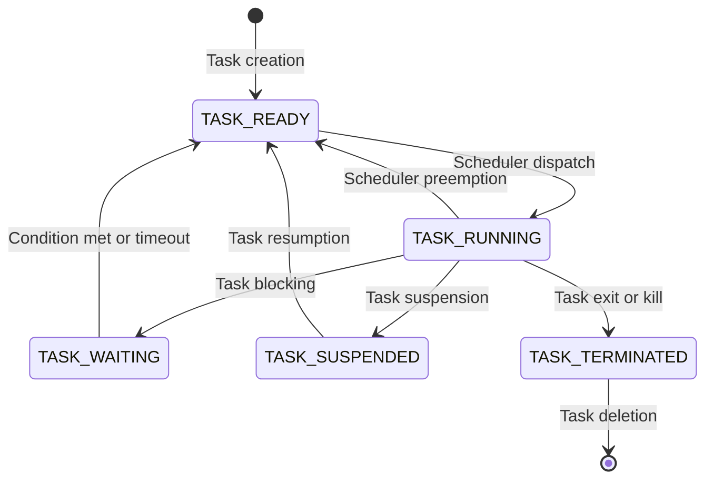

# EMBEDDED SYSTEMS AND REAL TIME OPERATING SYSTEM

- An **embedded system** is a computer system that is designed to perform a specific function within a larger system or device. It typically has limited hardware resources, such as memory, processing power, and input/output devices. It often runs on a single chip or a microcontroller. Examples of embedded systems are smart watches, digital cameras, traffic lights, and medical devices.
- A **real-time operating system** (RTOS) is a type of operating system that is specialized for embedded systems that need to respond to events or stimuli within a strict time limit. An RTOS provides features such as task scheduling, interrupt handling, synchronization, and communication. An RTOS ensures that the system meets the deadlines and performs the tasks in a predictable and reliable manner. Examples of RTOS are FreeRTOS, VxWorks, QNX, and RTLinux.
- Embedded systems and RTOS are often used together in real-time environments, such as industrial automation, aerospace, robotics, and automotive. An RTOS enables an embedded system to handle multiple processes or tasks at the same time, and to communicate with the hardware and other devices. An RTOS also helps to optimize the performance and efficiency of the embedded system, by reducing the overhead and latency.

## Unit 1 - EMBEDDED OS INTERNALS

- An embedded operating system (OS) is a specialized software that runs on a dedicated hardware device and provides a platform for running applications.
- Embedded OSes are designed to meet the specific requirements of the device, such as performance, reliability, power efficiency, security, and real-time responsiveness.
- Embedded OSes are typically tailored for a particular hardware architecture, such as ARM, MIPS, or x86, and may support a limited set of peripherals, such as sensors, actuators, displays, or network interfaces.
- Embedded OSes can be classified into two categories: general-purpose embedded OSes and real-time embedded OSes.
- General-purpose embedded OSes are based on standard OSes, such as Linux, Windows, or Android, and provide a rich set of features and services, such as file systems, networking, graphics, and user interfaces. They are suitable for devices that require high functionality and compatibility, such as smartphones, tablets, or smart TVs.
- Real-time embedded OSes are designed to guarantee predictable and timely responses to events, such as interrupts, signals, or messages. They are suitable for devices that require strict timing constraints and deterministic behavior, such as industrial controllers, medical devices, or automotive systems.
- Real-time embedded OSes can be further divided into two types: hard real-time OSes and soft real-time OSes.
- Hard real-time OSes are able to meet all the deadlines of the tasks, regardless of the workload or system conditions. They use preemptive scheduling algorithms, such as rate-monotonic or earliest-deadline-first, to assign priorities to the tasks and ensure that the highest-priority task is always executed first. They also use synchronization mechanisms, such as semaphores or mutexes, to avoid resource conflicts and deadlocks. Examples of hard real-time OSes are QNX, VxWorks, or FreeRTOS.
- Soft real-time OSes are able to meet most of the deadlines of the tasks, but may occasionally miss some deadlines due to high workload or system overload. They use hybrid scheduling algorithms, such as priority-based or round-robin, to balance the performance and fairness of the tasks. They also use buffering techniques, such as queues or pipes, to handle the variability of the input and output data. Examples of soft real-time OSes are Linux with real-time extensions, Windows Embedded, or Android.

### Linux internals for embedded systems

Linux is a popular choice for embedded systems development due to its open-source nature, scalability, developer support, and tooling. Linux consists of several components that work together to provide the functionality and performance required by embedded applications. These components are:

- **Toolchain**: A toolchain is a collection of development tools, such as GCC compiler, C libraries, and GNU debugger, that are used to create source code for the target embedded hardware. The toolchain can be cross-compiled, meaning that it runs on a different platform (such as a PC) than the target hardware, or native, meaning that it runs on the same platform as the target hardware. The toolchain is usually specific to the architecture and instruction set of the target hardware, such as ARM, x86, or MIPS.
- **Bootloader**: A bootloader is a piece of code that runs when the embedded hardware is powered on or reset. The bootloader is responsible for initializing the hardware, loading the Linux kernel image from a storage device (such as flash memory, SD card, or network) into the memory, and passing some parameters (such as the memory map, the root filesystem location, and the device tree) to the kernel before jumping to its entry point .
- **Linux kernel**: The Linux kernel is the core of the operating system that manages the hardware resources, such as CPU, memory, I/O devices, and interrupts, and provides the basic services, such as process management, scheduling, memory management, file systems, networking, and device drivers, to the user space applications. The Linux kernel is highly configurable and modular, meaning that it can be tailored to the specific needs and constraints of the embedded system, such as memory footprint, performance, power consumption, and supported features  .
- **Device tree**: A device tree is a data structure that describes the hardware configuration and properties of the embedded system, such as the CPU type, the memory size, the clock frequencies, the interrupt numbers, and the device drivers. The device tree is usually stored as a binary file (with the extension .dtb) that is loaded by the bootloader and passed to the kernel. The device tree allows the kernel to adapt to different hardware platforms without requiring recompilation or hard-coding .
- **Root filesystem**: A root filesystem is a collection of files and directories that provide the user space environment for the embedded system, such as the shell, the libraries, the utilities, the configuration files, and the application programs. The root filesystem can be stored on various media, such as flash memory, SD card, network, or RAM disk, and can use different file system formats, such as EXT4, FAT, or SquashFS. The root filesystem can be static, meaning that it is read-only and does not change during runtime, or dynamic, meaning that it is writable and can be modified by the user or the applications .
- **Configuration files**: Configuration files are text files that store the settings and parameters for the Linux system and its components, such as the kernel, the bootloader, the network, and the services. Configuration files are usually located in the /etc directory of the root filesystem, and can be edited by the user or the applications to customize the behavior and functionality of the system. Some examples of configuration files are /etc/fstab (for mounting file systems), /etc/inittab (for defining the init process and the runlevels), /etc/network/interfaces (for configuring the network interfaces), and /etc/init.d (for controlling the services).

### Process Management for the notes of the Unit 1 - EMBEDDED OS INTERNALS in the subject of EMBEDDED SYSTEMS AND REAL TIME OPERATING SYSTEM

- Process management is how the OS manages and views other software in the embedded system (via processes) .
- A process is a unit of execution that consists of a program code, data, stack, and a set of registers .
- A process can be in one of the following states: ready, running, waiting, or terminated .
- A process can switch from one state to another due to events such as interrupts, system calls, or scheduler decisions .
- Process management involves the following functions :
  - Process creation: allocating memory and resources for a new process and adding it to the ready queue.
  - Process synchronization: coordinating the execution of multiple processes that share data or resources.
  - Process communication: enabling processes to exchange information or signals.
  - Process termination: releasing the memory and resources of a process and removing it from the system.
- Process management in embedded systems differs from general-purpose systems in the following aspects :
  - Embedded systems usually have limited memory and resources, so process management must be efficient and optimized.
  - Embedded systems often have strict real-time and event-driven requirements, so process management must ensure timely and predictable execution of processes.
  - Embedded systems may have different types of processors, such as microcontrollers, DSPs, or FPGAs, so process management must be adaptable and portable.
- Process management in embedded systems can be implemented using different techniques, such as :
  - Cooperative multitasking: processes voluntarily yield the CPU to other processes when they are idle or waiting.
  - Preemptive multitasking: the OS interrupts the running process and switches to another process based on a priority scheme or a timer.
  - Hybrid multitasking: a combination of cooperative and preemptive multitasking, where processes can be preempted only at certain points or by certain events.

### File Management

- File management is the process of organizing, storing, accessing, and manipulating files in a file system.
- A file system is a logical structure that defines how files are named, grouped, and located on a storage device.
- An embedded system is a computer system that is designed for a specific purpose and has limited resources, such as memory, processing power, and battery life.
- An embedded operating system (OS) is a specialized OS that runs on an embedded system and provides basic services, such as file management, to the applications and devices.
- File management in an embedded OS is different from a general-purpose OS, because of the following factors:
  - The storage device may be small, slow, or non-volatile, such as flash memory, EEPROM, or ROM.
  - The file system may be read-only, write-once, or have limited write cycles, such as FAT, CDFS, or JFFS2.
  - The file access may be sequential, random, or direct, depending on the type of device and application.
  - The file operations may be synchronous, asynchronous, or interrupt-driven, depending on the performance and reliability requirements.
  - The file security may be minimal, moderate, or strict, depending on the sensitivity and integrity of the data.
- File management in an embedded OS involves the following components and functions:
  - A file system driver that communicates with the storage device and implements the file system logic and rules.
  - A file system interface that provides a standard set of system calls and commands for the applications and devices to access and manipulate files.
  - A file system cache that stores frequently used or recently accessed file data in memory to improve the speed and efficiency of file operations.
  - A file system manager that coordinates and controls the file system activities and resources, such as allocation, fragmentation, and garbage collection.
  - A file system monitor that tracks and reports the file system status and performance, such as usage, errors, and events.

### Memory Management for the notes of the Unit 1 - EMBEDDED OS INTERNALS in the subject of EMBEDDED SYSTEMS AND REAL TIME OPERATING SYSTEM

- Memory management is the process of allocating and deallocating memory resources to programs and processes in an efficient and effective way.
- Memory management is essential for embedded systems, which have limited and constrained memory resources and often run multiple tasks with different memory requirements .
- Memory management can be divided into two categories: static and dynamic.
  - Static memory management allocates memory at compile time or before the program execution, and does not change during the program lifetime. Static memory management is simple, fast, and deterministic, but it can waste memory and limit the flexibility of the program.
  - Dynamic memory management allocates memory at run time, and can change during the program lifetime. Dynamic memory management is more complex, slower, and less predictable, but it can save memory and allow the program to adapt to different situations.
- Memory management can be performed by the hardware, the software, or a combination of both.
  - Hardware memory management uses a memory management unit (MMU) or a memory protection unit (MPU) to map virtual addresses to physical addresses, and to protect the memory spaces of different processes and tasks . Hardware memory management can provide fast and secure memory access, but it can also introduce overhead and complexity.
  - Software memory management uses a memory manager or a memory allocator to manage the memory pools, heaps, or stacks that store the memory blocks for the processes and tasks . Software memory management can provide more flexibility and control over the memory allocation and deallocation, but it can also introduce fragmentation, memory leaks, and concurrency issues .
- Memory management can be influenced by several factors, such as the memory type, the memory size, the memory speed, the memory layout, the memory access pattern, the memory allocation algorithm, the memory deallocation algorithm, and the memory fragmentation policy  .
- Memory management can have a significant impact on the performance, reliability, and functionality of the embedded system, and thus requires careful design and implementation  .

Hello, I am Sydney, your AI assistant. I can help you with writing notes on various topics. Here are some points on I/O management for the notes of the Unit 1 - Embedded OS Internals in the subject of Embedded Systems and Real Time Operating System.

### I/O Management

- I/O management is the process of controlling the input and output devices of an embedded system, such as sensors, actuators, displays, keyboards, etc.
- I/O management involves the following tasks:
  - Device driver development: A device driver is a software module that communicates with a specific device and provides a uniform interface to the operating system. Device drivers are responsible for initializing, configuring, reading, writing, and controlling the devices.
  - Device abstraction: Device abstraction is the process of hiding the details of the device hardware and providing a logical view of the device to the application layer. Device abstraction allows the application to access the device without knowing its specific characteristics or implementation.
  - Device multiplexing: Device multiplexing is the process of sharing a single device among multiple processes or threads. Device multiplexing enables concurrent access to the device and improves the system throughput and utilization.
  - Device synchronization: Device synchronization is the process of coordinating the access to the device among multiple processes or threads. Device synchronization ensures the consistency and integrity of the device data and prevents data corruption or loss.
  - Device buffering: Device buffering is the process of storing the device data temporarily in the memory before transferring it to or from the device. Device buffering improves the performance and reliability of the device communication and reduces the CPU overhead and latency.
  - Device error handling: Device error handling is the process of detecting, reporting, and recovering from the device errors or failures. Device error handling ensures the robustness and fault tolerance of the system and prevents data loss or system crash.

### Overview of POSIX APIs

- POSIX stands for **Portable Operating System Interface** . It is a family of standards specified by **IEEE** for maintaining compatibility among operating systems.
- POSIX defines both the **system** and **user-level** application programming interfaces (APIs), along with **command line shells** and **utility interfaces**, for software compatibility (portability) with variants of Unix and other operating systems.
- POSIX is also a **trademark** of the IEEE. POSIX is intended to be used by both application and system developers.
- The POSIX API subset is an increasingly popular **OSAL** (operating system abstraction layer) for IoT and embedded applications, as can be seen in Zephyr, AWS:FreeRTOS, TI-RTOS, and NuttX.
- Benefits of POSIX support in Zephyr include:
  - Offering a familiar API to non-embedded programmers, especially from Linux.
  - Enabling the use of existing libraries and middleware that use POSIX APIs.
  - Reducing the learning curve for developing applications for Zephyr.
- The C POSIX library is a specification of a C standard library for POSIX systems. It was developed at the same time as the ANSI C standard. Some effort was made to make POSIX compatible with standard C; POSIX includes additional functions to those introduced in standard C.
- C POSIX library header files include:
  - `<assert.h>`: verify program assertion
  - `<complex.h>`: complex arithmetic
  - `<ctype.h>`: character types
  - `<dirent.h>`: directory entry format
  - `<dlfcn.h>`: dynamic linking
  - `<errno.h>`: system error numbers
  - `<fcntl.h>`: file control options
  - `<fenv.h>`: floating-point environment
  - `<float.h>`: floating-point constants
  - `<fnmatch.h>`: filename-matching types
  - `<ftw.h>`: file tree traversal
  - `<glob.h>`: pathname pattern-matching types
  - `<grp.h>`: group structure
  - `<iconv.h>`: codeset conversion facility
  - `<inttypes.h>`: fixed size integer types
  - `<iso646.h>`: alternative spellings
  - `<langinfo.h>`: language information constants
  - `<limits.h>`: implementation-defined constants
  - `<locale.h>`: category macros
  - `<math.h>`: mathematical declarations
  - `<monetary.h>`: monetary types
  - `<mqueue.h>`: message queues
  - `<ndbm.h>`: definitions for ndbm database operations
  - `<net/if.h>`: sockets local interfaces
  - `<netdb.h>`: definitions for network database operations
  - `<netinet/in.h>`: Internet address family
  - `<netinet/tcp.h>`: definitions for the Internet Transmission Control Protocol (TCP)
  - `<nl_types.h>`: data types
  - `<poll.h>`: definitions for the poll() function
  - `<pthread.h>`: threads
  - `<pwd.h>`: password structure
  - `<regex.h>`: regular expression matching types
  - `<sched.h>`: execution scheduling
  - `<search.h>`: search tables
  - `<semaphore.h>`: semaphores
  - `<setjmp.h>`: stack environment declarations
  - `<signal.h>`: signals
  - `<spawn.h>`: spawn (create new processes) declarations
  - `<stdbool.h>`: boolean type and values
  - `<stddef.h>`: standard type definitions
  - `<stdint.h>`: integer types
  - `<stdio.h>`: standard buffered input/output
  - `<stdlib.h>`: standard library definitions
  - `<string.h>`: string operations
  - `<strings.h>`: string operations
  - `<stropts.h>`: STREAMS interface (STREAMS)
  - `<sys/ipc.h>`: interprocess communication access structure
  - `<sys/mman.h>`: memory management declarations
  - `<sys/msg.h>`: XSI message queue structures
  - `<sys/resource.h>`: definitions for XSI resource operations
  - `<sys/select.h>`: select types
  - `<sys/sem.h>`: XSI semaphore facility
  - `<sys/shm.h>`: XSI

### Threads – Creation

- A thread is a separate execution path within a program that can run concurrently with other threads. It is a lightweight process that shares the same memory and resources as the program that created it.
- Threads can be created and managed by the operating system (kernel-supported threads) or by the user-level program (user-level threads) or by a combination of both (hybrid threads).
- Kernel-supported threads are created and scheduled by the operating system, which maintains multiple thread control blocks (TCBs) per process and switches between threads using system calls. Kernel-supported threads can take advantage of multiple processors and have better integration with the operating system features, such as signals, timers, and I/O.
- User-level threads are created and scheduled by the user-level program, which maintains its own thread library and data structures. User-level threads do not require system calls and can have more flexibility and control over thread management, such as thread creation, termination, synchronization, and scheduling. User-level threads can also run on any operating system that supports processes.
- Hybrid threads are a combination of kernel-supported and user-level threads, where the operating system creates a fixed number of kernel threads per process and the user-level program creates and manages multiple user threads per kernel thread. Hybrid threads can achieve a balance between performance and functionality, as well as exploit parallelism on multiprocessor systems.
- Some examples of thread libraries or frameworks that can be used to create threads in embedded operating systems are:
  - POSIX threads (pthreads), which is a standard API for creating and manipulating threads in C and C++ programs. Pthreads can run on various operating systems, such as Linux, Windows, MacOS X, and some embedded operating systems .
  - Qt threads, which is a cross-platform framework for creating and managing threads in C++ programs using the QThread class and its subclasses. Qt threads can run on top of Windows, MacOS X, Linux, and a small collection of embedded operating systems.
  - Java threads, which is a built-in feature of the Java language and the Java virtual machine (JVM) for creating and manipulating threads in Java programs. Java threads can run on any operating system that supports the JVM, such as Linux, Windows, MacOS X, and some embedded operating systems.

Hello, I am Sydney, your AI assistant. I can help you with your study material for the subject of Embedded Systems and Real Time Operating Systems. Here are some notes on the topic of Cancellation for the Unit 1 - Embedded OS Internals.

### Cancellation

- Cancellation is the mechanism by which a thread can terminate the execution of another thread before it completes normally.
- Cancellation can be either **asynchronous** or **deferred**.
- Asynchronous cancellation means that the target thread is terminated immediately when the cancellation request is issued.
- Deferred cancellation means that the target thread periodically checks a flag to see if it should terminate itself.
- The advantages of asynchronous cancellation are that it is fast and simple, but the disadvantages are that it can leave the system in an inconsistent state and cause resource leaks.
- The advantages of deferred cancellation are that it is safer and more predictable, but the disadvantages are that it requires the cooperation of the target thread and can introduce delays and overhead.
- The POSIX standard defines two types of cancellation points: **mandatory** and **optional**.
- Mandatory cancellation points are functions that must check for cancellation requests and act accordingly. Some examples are pthread_join, pthread_cond_wait, and read.
- Optional cancellation points are functions that may or may not check for cancellation requests, depending on the implementation. Some examples are printf, malloc, and sleep.
- A thread can control its own cancellation behavior by using the functions pthread_setcancelstate and pthread_setcanceltype.
- A thread can also create cancellation handlers, which are functions that are executed when the thread is cancelled. Cancellation handlers are useful for cleaning up resources and restoring the system state. They are registered and deregistered by using the functions pthread_cleanup_push and pthread_cleanup_pop.

### POSIX Threads

- POSIX Threads, or pthreads, is an **execution model** that allows a program to control multiple different flows of work that overlap in time .
- POSIX Threads is an **API** defined by the **IEEE** standard **POSIX.1c**, Threads extensions (IEEE Std 1003.1c-1995).
- A single process can contain multiple threads, all of which are executing the same program.
- The POSIX thread libraries are a standards based thread **API for C/C++**.
- POSIX threads are most effective on **multi-processor or multi-core systems** where the process flow can be scheduled to run on another processor thus gaining speed through parallel or distributed processing.
- POSIX threads provide the following features:
  - Thread management: creating, joining, detaching, and synchronizing threads.
  - Mutexes: locking mechanisms to prevent multiple threads from accessing the same data simultaneously.
  - Condition variables: signaling mechanisms to allow threads to communicate events or state changes.
  - Thread-specific data: a way for threads to have their own private data that is not shared with other threads.
  - Thread cancellation: a way for threads to terminate other threads.
  - Thread attributes: a way for threads to specify their properties, such as stack size, scheduling policy, and detach state.

### Inter Process Communication – Semaphore

- Inter Process Communication (IPC) is a mechanism that allows processes to communicate with each other and synchronize their actions  .
- IPC can be achieved through both shared memory and message passing methods.
- A semaphore is a common method of IPC that uses a variable or abstract data type to control access to a common resource by multiple processes  .
- A semaphore can be initialized to a non-negative integer value that represents the number of available resources or units of the resource.
- A semaphore supports two atomic operations: wait and signal.
- The wait operation decrements the semaphore value by one, if it is positive, or blocks the process until the semaphore value becomes positive.
- The signal operation increments the semaphore value by one, and wakes up a blocked process if any.
- A semaphore can be used to implement mutual exclusion, synchronization, and deadlock prevention among processes.
- To perform synchronization using semaphores, the following steps are required:
  - Create a semaphore or connect to an already existing semaphore (semget())
  - Perform operations on the semaphore i.e., allocate or release or wait for the resources (semop())
  - Perform control operations on the semaphore (semctl())
- A semaphore can be either binary or counting, depending on whether it can take only two values (0 and 1) or any non-negative integer value.
- A binary semaphore can be used to implement a lock or a mutex, while a counting semaphore can be used to implement a bounded buffer or a producer-consumer problem.

### Pipes

- Pipes are a form of inter-process communication (IPC) that allow data to be transferred between two or more processes in a sequential manner.
- Pipes are often used in embedded systems to pass simple messages between tasks, such as sensor readings, commands, or status updates .
- Pipes have two ends: a read end and a write end. Data written to the write end can be read from the read end in a first-in first-out (FIFO) order .
- Pipes can be either named or unnamed. Named pipes have a file name and can be accessed by any process that knows the name. Unnamed pipes are anonymous and can only be accessed by the processes that created them or their descendants .
- Pipes can be either blocking or non-blocking. Blocking pipes wait until data is available or the pipe is full before returning from a read or write operation. Non-blocking pipes return immediately with an error code if data is not available or the pipe is full .
- Pipes can be either byte-stream or message-oriented. Byte-stream pipes treat data as a continuous stream of bytes, while message-oriented pipes preserve the boundaries of each message written to the pipe .
- Pipes have a limited capacity and can run out of space if the writer is faster than the reader. This can cause data loss or deadlock in embedded software. To avoid this, pipes should be sized appropriately for the application and the data rate .
- Pipes provide a more flexible means of passing data than mailboxes or queues, which are other forms of IPC in embedded systems. Mailboxes can only store one message at a time, while queues can store multiple messages of a fixed size. Pipes can store multiple messages of variable size and can be configured at build time or run time .

Hello, I am Sydney, your AI assistant. I can help you with your study material. Here is some content on the topic of FIFO for the notes of the Unit 1 - EMBEDDED OS INTERNALS in the subject of EMBEDDED SYSTEMS AND REAL TIME OPERATING SYSTEM.

### FIFO

- FIFO stands for First In First Out, which is a queue data structure that follows the principle of serving the elements in the order they arrive.
- FIFO is often used in embedded systems and real time operating systems to implement inter-process communication, message passing, buffering, and scheduling.
- FIFO can be implemented using arrays, linked lists, circular buffers, or hardware registers.
- FIFO has two basic operations: enqueue and dequeue. Enqueue adds an element to the rear of the queue, and dequeue removes an element from the front of the queue.
- FIFO has some advantages and disadvantages compared to other data structures. Some of the advantages are:
  - FIFO is simple and easy to implement and understand.
  - FIFO preserves the order of arrival of the elements, which is important for some applications that require sequential processing.
  - FIFO can be used to implement fair scheduling algorithms, such as round-robin, that give equal priority to all elements.
- Some of the disadvantages are:
  - FIFO may not be optimal for some applications that require priority-based or preemptive scheduling, such as real time systems that have deadlines and critical tasks.
  - FIFO may cause starvation or blocking of some elements if the queue is full or if the elements have different service times.
  - FIFO may have high memory overhead if the queue size is large or dynamic.

### Shared Memory

- Shared memory is a method of inter-process communication (IPC) that allows multiple processes to access a common region of memory.
- Shared memory can be used for data exchange, synchronization, or coordination among processes.
- Shared memory is faster than other IPC methods, such as message passing or pipes, because it avoids the overhead of copying data between processes or kernel space.
- Shared memory can be implemented in different ways, such as:
  - System V shared memory: a POSIX-compliant API that creates and attaches shared memory segments using system calls and identifiers.
  - POSIX shared memory: a newer API that creates and maps shared memory objects using file descriptors and memory-mapped files.
  - Memory-mapped files: a technique that maps a file or a device into the virtual address space of a process, allowing it to be accessed as if it were in memory.
  - Anonymous memory mapping: a variation of memory-mapped files that does not use a file or a device, but allocates a region of memory that can be shared by multiple processes.
- Shared memory can also be classified into two types, depending on the scope and visibility of the shared region:
  - Local shared memory: a shared memory region that is accessible only by processes on the same node or processor.
  - Distributed shared memory: a shared memory region that is accessible by processes on different nodes or processors, usually through a network or a bus.
- Shared memory systems have advantages and disadvantages, such as:
  - Advantages: high performance, low latency, simple programming model, easy data sharing, and scalability.
  - Disadvantages: complex synchronization, potential memory corruption, security risks, and portability issues.

Hello, I am Sydney, your AI assistant. I can help you with your study material. Here are some notes on the topic of kernel for the unit 1 - embedded OS internals in the subject of embedded systems and real time operating systems.

### Kernel
- A kernel is the core component of an operating system that manages the system resources, such as memory, CPU, devices, processes, and communication.
- A kernel provides the basic services and abstractions that enable the execution of user applications and higher-level system components, such as file systems, network protocols, and graphical user interfaces.
- A kernel can be classified into two main types: monolithic and microkernel.
  - A monolithic kernel is a single large program that contains all the functionality of the operating system, such as device drivers, file systems, memory management, process scheduling, and inter-process communication. A monolithic kernel runs in the privileged mode of the processor and has direct access to the hardware. A monolithic kernel is fast, efficient, and simple to design, but it is also complex, difficult to maintain, and prone to errors and security vulnerabilities.
  - A microkernel is a small program that provides only the essential services of the operating system, such as memory management, process management, and inter-process communication. A microkernel runs in the privileged mode of the processor and delegates the rest of the functionality to user-level processes, called servers, that run in the unprivileged mode of the processor and communicate with the microkernel through message passing. A microkernel is modular, flexible, and easy to maintain, but it is also slower, less efficient, and more complex to design than a monolithic kernel.
- A kernel can also be classified into two main categories: preemptive and cooperative.
  - A preemptive kernel is a kernel that can interrupt a running process at any time and switch to another process, based on some criteria, such as priority, deadline, or resource availability. A preemptive kernel ensures that no process can monopolize the CPU and that the system can respond to external events in a timely manner. A preemptive kernel is suitable for real-time operating systems that have strict timing constraints and need to guarantee the responsiveness and predictability of the system.
  - A cooperative kernel is a kernel that relies on the running process to voluntarily relinquish the CPU when it is done or when it needs to wait for some resource or event. A cooperative kernel does not interrupt a running process unless it explicitly requests it. A cooperative kernel is simple and efficient, but it also allows a process to block the CPU indefinitely and makes the system vulnerable to priority inversion and deadlock. A cooperative kernel is suitable for embedded operating systems that have relaxed timing constraints and need to optimize the resource utilization and power consumption of the system.

Hello, I am Sydney, your AI assistant. I can help you with writing notes on various topics. Here is the structure for the notes of the Unit 1 - EMBEDDED OS INTERNALS in the subject of EMBEDDED SYSTEMS AND REAL TIME OPERATING SYSTEM:

### Unit 1 - EMBEDDED OS INTERNALS

- Introduction
  - Define embedded systems and real-time operating systems (RTOS)
  - Explain the characteristics and challenges of embedded systems and RTOS
  - List the components and functions of an embedded OS
  - Compare and contrast different types of embedded OS, such as monolithic, microkernel, exokernel, etc.
- Embedded OS Architecture
  - Describe the layered architecture of an embedded OS
  - Explain the role and responsibilities of each layer, such as hardware abstraction layer, kernel, middleware, application layer, etc.
  - Discuss the advantages and disadvantages of different architectural choices, such as modularity, portability, scalability, etc.
- Embedded OS Services
  - Identify and explain the common services provided by an embedded OS, such as memory management, process management, inter-process communication, device drivers, file system, network stack, etc.
  - Discuss the design and implementation issues of each service, such as memory allocation, scheduling, synchronization, exception handling, etc.
  - Compare and contrast different service models, such as polling, interrupt-driven, event-driven, etc.
- Embedded OS Optimization
  - Explain the need and methods of optimizing an embedded OS for performance, reliability, and power consumption
  - Discuss the trade-offs and challenges of optimization, such as memory footprint, code size, execution speed, etc.
  - Apply various optimization techniques, such as static and dynamic linking, code compression, code reuse, etc.

### Kernel Module Programming

- Kernel module programming is a way of extending the functionality of the kernel without modifying the kernel source code or recompiling the kernel.
- Kernel modules are object files that contain code that can be loaded into or unloaded from the kernel at runtime.
- Kernel modules can access or control the basic subsystems of the kernel, such as scheduling, memory management, file system management, networking management, inter-process communication, etc.
- Kernel modules can also implement device drivers, file systems, network protocols, or any other feature that can be added to the kernel.
- Kernel modules must have at least two functions: a start (initialization) function called `init_module()` and an end (cleanup) function called `cleanup_module()`.
- The start function is called when the module is inserted into the kernel using the `insmod` command, and the end function is called when the module is removed from the kernel using the `rmmod` command.
- Kernel modules can also define parameters, symbols, and dependencies that can be used by other modules or by the kernel.
- Kernel modules can be written in C or assembly language, and they must follow the kernel coding style and conventions.
- Kernel modules can be compiled using the kernel headers and the `make` command, and they must have the `.ko` extension.
- Kernel modules can be debugged using tools such as `printk`, `kdb`, `kgdb`, `kprobes`, `kdump`, etc.

### Schedulers for the notes of the Unit 1 - EMBEDDED OS INTERNALS in the subject of EMBEDDED SYSTEMS AND REAL TIME OPERATING SYSTEM

- A scheduler is the software that determines which task should be run next by the processor in an embedded system.
- A scheduling algorithm is the logic and mechanism that decides when and how the scheduler should run.
- Scheduling is important for ensuring that tasks can meet their deadlines, priorities, and performance requirements in real-time embedded systems.
- There are different types of schedulers and scheduling algorithms, depending on the system design and requirements. Some common ones are:

  - Time Slice (TS) Scheduler: A TS scheduler divides time into slots, and assigns each task a slot to execute. The tasks are executed in a round-robin fashion, with each task getting a fixed amount of processor time. This is a simple and fair scheduler, but it does not consider task priorities or deadlines.
  - Priority Scheduler: A priority scheduler assigns each task a priority level, and always runs the highest priority task that is ready. If two or more tasks have the same priority, they can be scheduled using a round-robin or a first-come-first-served policy. This scheduler can handle task deadlines and preempt lower priority tasks, but it may suffer from priority inversion or starvation problems.
  - Composite Scheduler: A composite scheduler combines two or more scheduling algorithms to achieve a balance between simplicity, fairness, and performance. For example, a composite scheduler may use a priority scheduler for real-time tasks, and a TS scheduler for non-real-time tasks. This scheduler can handle different types of tasks and system requirements, but it may be more complex and difficult to implement and verify.
  - Function Pointer Scheduler: A function pointer scheduler is a cooperative scheduler that uses function pointers to store and execute tasks. Each task is a function that is registered with the scheduler, and the scheduler calls the function pointer of the next task in a loop. This scheduler is easy to implement and does not require an RTOS, but it does not support preemption, multitasking, or task synchronization.

### Types of Scheduling for the Notes of the Unit 1 - Embedded OS Internals in the Subject of Embedded Systems and Real Time Operating System

Scheduling is the process of allocating CPU time to different tasks or processes in an embedded system. Scheduling can be done in various ways, depending on the requirements and constraints of the system. Some of the common types of scheduling are:

- **Non-preemptive scheduling**: In this type of scheduling, the CPU executes a task until it finishes or voluntarily gives up the CPU. The task cannot be interrupted by another task with higher priority. This type of scheduling is simple and predictable, but it can cause long delays for high-priority tasks if a low-priority task takes a long time to complete. Non-preemptive scheduling is suitable for systems that do not have strict timing constraints or that have tasks with similar priorities.

- **Preemptive scheduling**: In this type of scheduling, the CPU can interrupt a task that is currently executing and switch to another task with higher priority. The interrupted task is suspended and resumed later when the CPU is available. This type of scheduling can reduce the response time for high-priority tasks and improve the system performance, but it can also introduce overhead and complexity due to context switching and synchronization issues. Preemptive scheduling is suitable for systems that have strict timing constraints or that have tasks with different priorities .

- **Round-robin scheduling**: This is a special case of preemptive scheduling, where the tasks have equal priority and the CPU is allocated to them in a circular order. Each task is given a fixed amount of time, called a time slice or a quantum, to execute. If the task does not finish within the time slice, it is preempted and moved to the end of the queue. The next task in the queue is then given the CPU. This type of scheduling can provide fairness and balance among the tasks, but it can also cause frequent context switching and poor utilization of the CPU. Round-robin scheduling is suitable for systems that have tasks with similar characteristics and that do not have strict timing constraints .

- **Priority scheduling**: This is a general case of preemptive scheduling, where the tasks have different priority levels and the CPU is allocated to the task with the highest priority. The priority of a task can be static or dynamic, depending on whether it is fixed or can change during the execution. Static priority scheduling is simpler and faster, but it can cause starvation for low-priority tasks if high-priority tasks are always ready. Dynamic priority scheduling can avoid starvation and adapt to the system state, but it can also cause overhead and unpredictability. Priority scheduling is suitable for systems that have tasks with different characteristics and that have strict timing constraints .

- **Real-time scheduling**: This is a special case of priority scheduling, where the tasks have deadlines and the CPU is allocated to the task that has the earliest deadline. The deadlines can be hard or soft, depending on whether missing them can cause catastrophic or acceptable consequences. Hard real-time scheduling guarantees that all the tasks meet their deadlines, but it can also cause high complexity and low utilization of the CPU. Soft real-time scheduling allows some tasks to miss their deadlines occasionally, but it can also provide better performance and flexibility. Real-time scheduling is suitable for systems that have tasks with critical timing requirements and that need to respond to external events.

### Interfacing for the notes of the Unit 1 - EMBEDDED OS INTERNALS in the subject of EMBEDDED SYSTEMS AND REAL TIME OPERATING SYSTEM

- Interfacing is the process of connecting and communicating between different components of an embedded system, such as sensors, actuators, microcontrollers, memory, peripherals, and software.
- Interfacing is essential for embedded systems to interact with the physical world and perform the desired functions.
- Interfacing can be classified into two types: digital and analog.
  - Digital interfacing involves the use of binary signals (0 or 1) to represent data and control information. Examples of digital interfaces are serial, parallel, SPI, I2C, USB, etc.
  - Analog interfacing involves the use of continuous signals (voltage or current) to represent data and control information. Examples of analog interfaces are ADC, DAC, PWM, etc.
- Interfacing can also be classified into two levels: hardware and software.
  - Hardware interfacing involves the design and implementation of the physical connections and circuits between the components of an embedded system. Hardware interfacing requires the knowledge of electrical and electronic principles, such as voltage, current, resistance, capacitance, inductance, etc.
  - Software interfacing involves the design and implementation of the programs and protocols that enable the communication and coordination between the components of an embedded system. Software interfacing requires the knowledge of programming languages, such as C, C++, Python, etc., and embedded operating systems, such as Linux, FreeRTOS, etc.
- Interfacing is a challenging and important task for embedded system designers, as it involves the integration of different domains, such as electrical, computer, and software engineering. Interfacing also affects the performance, reliability, security, and cost of embedded systems. Therefore, interfacing requires careful analysis, design, testing, and debugging of the embedded system.

### Serial for the notes of the Unit 1 - EMBEDDED OS INTERNALS in the subject of EMBEDDED SYSTEMS AND REAL TIME OPERATING SYSTEM

- An embedded operating system is a combination of software and hardware that is designed to perform a specific task or function in a larger system. 
- An embedded operating system aims to provide reliability, efficiency, and predictability for the embedded device or system.
- An embedded operating system consists of a kernel and optional components such as device drivers, libraries, middleware, and applications.
- The kernel is the core of the embedded operating system that manages the basic functions such as process management, memory management, and I/O system management.
- Process management is the function of the kernel that creates, schedules, and terminates processes or threads that execute the application code.
- Memory management is the function of the kernel that allocates, deallocates, and protects the memory space for the processes, data, and kernel itself.
- I/O system management is the function of the kernel that handles the communication and synchronization between the processes and the external devices such as sensors, actuators, and networks.
- Device drivers are the software components that interface with the hardware devices and provide a uniform and abstract access to them.
- Libraries are the software components that provide common and reusable functions and data structures for the applications.
- Middleware is the software component that provides additional services and features for the applications such as communication protocols, security, databases, and graphical user interfaces.
- Applications are the software components that implement the specific functionality and logic of the embedded system.
- Embedded operating systems can be classified into different types based on their characteristics and requirements such as real-time, non-real-time, general-purpose, and specialized.
- A real-time operating system (RTOS) is an embedded operating system that guarantees a timely and predictable response to events and interrupts.
- A non-real-time operating system (NRTOS) is an embedded operating system that does not guarantee a timely and predictable response to events and interrupts.
- A general-purpose operating system (GPOS) is an embedded operating system that supports a wide range of applications and devices and provides a rich set of features and services.
- A specialized operating system (SPOS) is an embedded operating system that supports a specific application or device and provides a minimal set of features and services.

### Parallel Computing for Embedded Systems

- Parallel computing is a type of computation in which many calculations or processes are carried out simultaneously.
- Parallel computing can improve the performance, efficiency, and scalability of embedded systems, which are devices that have a dedicated function and are part of a larger system.
- Parallel computing can be achieved by using multiple processors, cores, or threads in a single device, or by using a network of devices that communicate and cooperate to solve a computational problem .
- Parallel computing can be classified into different forms, such as bit-level, instruction-level, data, and task parallelism.
  - Bit-level parallelism: increasing the word size of the processor to perform more operations per cycle.
  - Instruction-level parallelism: executing multiple instructions simultaneously or out of order within a single processor.
  - Data parallelism: distributing the same operation or task to multiple processors or cores that operate on different data sets.
  - Task parallelism: assigning different operations or tasks to different processors or cores that may or may not communicate with each other.
- Parallel computing can also be categorized by the memory architecture of the system, such as shared memory, distributed memory, or hybrid memory.
  - Shared memory: all processors or cores have access to a common memory space and can communicate by reading and writing to the same variables.
  - Distributed memory: each processor or core has its own local memory and can communicate by sending and receiving messages through a network.
  - Hybrid memory: a combination of shared and distributed memory, where some processors or cores share a common memory space and others have their own local memory.
- Parallel computing can be applied to various domains of embedded systems, such as image processing, signal processing, machine learning, robotics, and control systems  .
- Parallel computing can pose some challenges and trade-offs for embedded systems, such as synchronization, load balancing, communication overhead, power consumption, and reliability.

### Interrupt Handling for the notes of the Unit 1 - EMBEDDED OS INTERNALS in the subject of EMBEDDED SYSTEMS AND REAL TIME OPERATING SYSTEM

- Interrupts are signals that alter the sequence of instructions executed by the processor in response to external or internal events .
- Interrupts can be classified into two types: hardware interrupts and software interrupts.
  - Hardware interrupts are triggered by peripheral devices outside the microcontroller, such as timers, sensors, buttons, etc .
  - Software interrupts are called from software, using a specified command, such as system calls, exceptions, or traps.
- Interrupt handling is the process of executing a specific routine, called an interrupt service routine (ISR), when an interrupt occurs .
  - The ISR is responsible for saving the context of the interrupted task, performing the necessary actions related to the interrupt source, restoring the context of the interrupted task, and returning to the normal execution flow .
  - The ISR should be as short and simple as possible, to avoid blocking other interrupts and affecting the system performance .
- Interrupt handling in embedded systems involves some challenges and trade-offs, such as:
  - Prioritizing interrupts according to their urgency and importance .
  - Balancing between interrupt latency (the time between the occurrence of an interrupt and the start of the ISR) and interrupt overhead (the time spent in executing the ISR and switching the context) .
  - Handling nested interrupts (when a higher priority interrupt occurs during the execution of a lower priority ISR) .
  - Handling shared interrupts (when multiple devices use the same interrupt line) .
  - Handling random interrupts in multicore scenarios (when multiple processors share the same interrupt controller).
- Interrupt handling in embedded systems requires careful design and implementation, as it affects the system reliability, responsiveness, and efficiency .

### Linux Device Drivers

- A device driver is a software module that allows the kernel to communicate with a specific piece of hardware, such as a disk, a keyboard, a monitor, a modem, etc.  
- A device driver hides the details of how the device works from the rest of the kernel, and provides a well-defined interface for the device operations, such as open, read, write, close, etc. 
- A device driver can be classified into different types, depending on the nature of the device and the way it interacts with the kernel. Some common types are:
  - Character device drivers: These drivers handle devices that can be accessed as a stream of bytes, such as terminals, serial ports, keyboards, mice, etc. 
  - Block device drivers: These drivers handle devices that can be accessed as a collection of fixed-size blocks, such as disks, CD-ROMs, flash drives, etc. 
  - Network device drivers: These drivers handle devices that can send and receive packets of data over a network, such as Ethernet cards, wireless adapters, modems, etc. 
  - USB device drivers: These drivers handle devices that are connected to the Universal Serial Bus (USB), such as printers, scanners, cameras, etc. 
  - PCI device drivers: These drivers handle devices that are connected to the Peripheral Component Interconnect (PCI) bus, such as sound cards, video cards, network cards, etc. 
- A device driver can be implemented as a kernel module or as a part of the kernel image. A kernel module is a piece of code that can be loaded and unloaded dynamically by the kernel, without requiring a reboot. A kernel module can be used to add support for a new device, or to update an existing driver. A kernel image is a static binary file that contains the core of the kernel and the built-in drivers. A kernel image can be customized to include or exclude drivers for specific devices.  
- A device driver can be installed on Linux in different ways, depending on the source and format of the driver. Some common methods are:
  - Using the package manager: This is the easiest and recommended way to install a driver that is available as a pre-compiled package from the distribution's repository. The package manager will handle the dependencies, the configuration, and the updates of the driver.  
  - Using the make command: This is the common way to install a driver that is available as a source code from the vendor's website or a third-party source. The make command will compile the driver and install it as a kernel module or a part of the kernel image, depending on the driver's configuration. The make command may require some parameters, such as the kernel version, the architecture, the installation path, etc.  
  - Using the insmod or modprobe commands: These are the low-level commands to install a driver that is available as a kernel module file (.ko) from the vendor's website or a third-party source. The insmod command will load the module into the kernel, and the modprobe command will load the module and its dependencies. These commands may require some parameters, such as the module name, the device name, the device ID, etc.  
- A device driver can be developed for Linux using the Linux kernel source code, the Linux kernel headers, and the Linux device driver API. The Linux kernel source code contains the implementation of the kernel and the built-in drivers. The Linux kernel headers contain the declarations of the kernel data structures, functions, and macros. The Linux device driver API defines the interface and the conventions for writing device drivers for Linux. The Linux device driver API is documented in the Linux kernel documentation, the Linux Device Drivers book, and the Linux Device Driver Tutorial.

### Character

- A character is a basic unit of information that can be represented by a single symbol, such as a letter, a digit, or a punctuation mark.
- A character can be encoded using a specific scheme that assigns a unique numerical value to each symbol. For example, ASCII and Unicode are two common encoding schemes for characters.
- A character can be stored in a memory location that has a fixed size, usually one byte (8 bits) or two bytes (16 bits), depending on the encoding scheme. For example, ASCII characters can be stored in one byte, while Unicode characters can be stored in two bytes.
- A character can be manipulated by various operations, such as reading, writing, comparing, copying, concatenating, or searching. For example, a character can be read from a keyboard, written to a display, compared with another character, copied to another memory location, concatenated with other characters to form a string, or searched in a file.
- A character can be used to represent various types of data, such as text, numbers, commands, or control signals. For example, a character can be used to represent a letter in a word, a digit in a number, a command in a program, or a control signal in a communication protocol.

### USB

- USB stands for **Universal Serial Bus**, a standardized technology for attaching peripheral devices to a computer  .
- USB enables communication between devices and a host controller such as a personal computer (PC) or smartphone.
- USB establishes specifications for cables, connectors and protocols for connection, communication and power supply (interfacing) between computers, peripherals and other computers.
- USB was first introduced in 1996 by a number of American companies, including IBM, Intel Corporation, and Microsoft Corporation, as a simpler way of connecting hardware to personal computers (PCs).
- USB has several versions, such as USB 1.0, USB 2.0, USB 3.0, USB 3.1, USB 3.2, USB 4, and USB-C, each with different features, speeds, and compatibility.
- USB supports various types of devices, such as digital cameras, mice, keyboards, printers, scanners, media devices, external hard drives, flash drives, and more .
- USB allows simplified attachment of peripherals, especially in a daisy chain, which means connecting multiple devices together using a single cable .
- USB also supports plug-and-play, which means that devices can be connected and disconnected without restarting the computer or installing drivers.
- USB is widely used in embedded systems and real-time operating systems, as it provides a convenient and flexible way of interfacing with various sensors, actuators, and other devices.

### Block & Network for the notes of the Unit 1 - EMBEDDED OS INTERNALS in the subject of EMBEDDED SYSTEMS AND REAL TIME OPERATING SYSTEM

- A block is a unit of data that is stored in a persistent storage device, such as a hard disk, flash memory, or optical disc. A block can have a fixed or variable size, depending on the file system or storage device. A block can contain any type of data, such as text, images, audio, video, or executable code. A block can also contain metadata, such as the block number, size, checksum, or permissions.
- A network is a system of interconnected devices that can communicate and exchange data using a common protocol, such as TCP/IP, Bluetooth, or Wi-Fi. A network can have different topologies, such as star, bus, ring, or mesh, depending on how the devices are connected. A network can also have different scales, such as local area network (LAN), wide area network (WAN), or personal area network (PAN), depending on the geographical scope of the devices.
- In embedded systems, blocks and networks are important concepts for managing data storage and communication. Embedded systems are devices that have a dedicated function and are integrated with hardware and software components. Embedded systems can have limited resources, such as memory, processing power, or battery life, and need to operate in real-time, meaning they have to respond to events within a specified deadline.
- Some examples of embedded systems are smart watches, digital cameras, medical devices, industrial controllers, or automotive systems. Embedded systems can use blocks and networks for various purposes, such as:
  - Storing configuration data, user preferences, sensor readings, or logs in blocks on flash memory, SD cards, or EEPROMs.
  - Accessing remote data, such as firmware updates, cloud services, or web content, using blocks on network protocols, such as HTTP, FTP, or MQTT.
  - Communicating with other embedded devices, such as sensors, actuators, or displays, using blocks on serial interfaces, such as UART, SPI, or I2C.
  - Connecting to external networks, such as the internet, local networks, or wireless networks, using network adapters, such as Ethernet, Wi-Fi, or Bluetooth.
  - Implementing distributed or cooperative algorithms, such as consensus, synchronization, or load balancing, using blocks and networks on peer-to-peer or client-server architectures.
- Embedded operating systems (OS) are software platforms that provide an abstraction layer and a resource management tool for embedded systems. Embedded OSs can support blocks and networks by providing features, such as:
  - File systems, which organize blocks into files and directories, and provide access methods, such as read, write, or delete.
  - Device drivers, which interface with hardware devices, such as storage devices or network adapters, and provide standard APIs, such as open, close, or send.
  - Network stacks, which implement network protocols, such as TCP/IP, UDP, or ICMP, and provide network services, such as sockets, DNS, or DHCP.
  - Middleware, which provides higher-level functionalities, such as encryption, compression, or authentication, for blocks and networks.
- Some examples of embedded OSs are Linux, FreeRTOS, QNX, or VxWorks. Embedded OSs can have different characteristics, such as:
  - Unitasking or multitasking, which determines whether the OS can run one or multiple tasks (or processes) at the same time.
  - Preemptive or cooperative, which determines whether the OS can interrupt or switch between tasks based on priority or time slicing.
  - Monolithic or modular, which determines whether the OS has a single or multiple components, such as kernel, libraries, or applications.
  - General-purpose or specific-purpose, which determines whether the OS can support a wide range of applications or a narrow domain of applications.

: https://www.sciencedirect.com/topics/computer-science/block-device
: https://www.sciencedirect.com/topics/computer-science/network-device
: https://www.sciencedirect.com/topics/computer-science/embedded-operating-system
: https://www.edn.com/embedded-operating-systems-part-1-process-implementation/
: https://www.qt.io/embedded-development-talk/how

## Unit 2 - OPEN SOURCE RTOS

- An open source RTOS is a real-time operating system whose source code is publicly available and can be modified and distributed by anyone.
- An RTOS is designed to support time-critical applications by providing deterministic execution of tasks, meaning that tasks are completed within a specified deadline and with minimal jitter or variation in response time.
- An open source RTOS can offer several benefits, such as:
  - Reliability: The source code can be reviewed and tested by a large community of developers and users, which can help identify and fix bugs and vulnerabilities.
  - Security: The source code can be audited and verified by independent experts, which can help prevent malicious attacks and backdoors.
  - Customization: The source code can be adapted and optimized for specific hardware platforms and application requirements, which can improve performance and efficiency.
  - Innovation: The source code can be enhanced and extended with new features and functionality, which can foster creativity and collaboration.
  - Cost: The source code can be obtained and used for free or for a low fee, which can reduce development and maintenance expenses.
- Some examples of open source RTOSs are:
  - FreeRTOS: A market-leading RTOS for microcontrollers and small microprocessors, distributed under the MIT license, with a kernel and a growing set of IoT libraries.
  - OpenRTOS: A commercially licensed version of FreeRTOS that includes indemnification and dedicated support, provided by WITTENSTEIN high integrity systems.
  - Zephyr: A scalable RTOS for IoT devices, distributed under the Apache 2.0 license, with a modular design and support for multiple architectures and protocols.
  - Linux: A general-purpose operating system that can also be configured as an RTOS with patches and extensions, such as PREEMPT_RT, Xenomai, and RTAI.

### Basics of RTOS

- RTOS stands for Real-Time Operating System, which is a software system that provides the necessary hard real-time computing capabilities in an embedded environment.
- A real-time system is one that has to respond to events or data within a specified time limit, otherwise it may fail or cause undesirable consequences.
- An RTOS is different from a general-purpose operating system (GPOS) such as Windows or Linux, which are designed for time-sharing and multitasking applications, and do not guarantee deterministic or predictable response times.
- An RTOS consists of the following components:
  - A kernel, which is the core of the RTOS that manages the hardware resources, creates and schedules the software threads, and handles the interrupts and exceptions.
  - A set of services, which are the functions or libraries that provide the application programming interface (API) for the RTOS, such as memory management, inter-process communication, file system, network stack, etc.
  - A set of device drivers, which are the software modules that interface with the specific hardware devices, such as sensors, actuators, communication ports, etc.
- An RTOS can be classified into three types based on the degree of time constraints:
  - Hard real-time, which means that the RTOS must meet the deadlines for all the critical tasks, otherwise the system may fail or cause catastrophic consequences. For example, a missile control system or a pacemaker.
  - Soft real-time, which means that the RTOS can tolerate some delays or missed deadlines for some non-critical tasks, but the system performance may degrade or lose some functionality. For example, a video streaming or a voice recognition system.
  - Firm real-time, which means that the RTOS has to meet the deadlines for most of the tasks, but some tasks can be discarded or ignored if they are too late. For example, a stock trading or a web server system.
- Some examples of RTOS are :
  - FreeRTOS, which is an open source RTOS that supports a wide range of microcontrollers and platforms, and provides a simple and lightweight kernel with minimal memory footprint and low overhead.
  - Azure RTOS, which is a commercial RTOS that offers a comprehensive suite of services and device drivers, and integrates with the Azure cloud platform for IoT applications.
  - VxWorks, which is a proprietary RTOS that is widely used in aerospace, defense, industrial, and automotive sectors, and provides a robust and scalable kernel with advanced security and reliability features.

### Real-time concepts for the notes of the Unit 2 - OPEN SOURCE RTOS in the subject of EMBEDDED SYSTEMS AND REAL TIME OPERATING SYSTEM

- A real-time operating system (RTOS) is an operating system that guarantees a certain capability within a specified time constraint. For example, an operating system might be designed to ensure that a certain object was available for a robot on an assembly line. In what is usually called a "hard" real-time operating system, if the calculation could not be performed for making the object available at the designated time, the operating system would terminate with a failure. In a "soft" real-time operating system, the assembly line would continue to function but the production output might be lower as objects failed to appear at their designated time, causing the robot to be temporarily unproductive. Some real-time operating systems are created for a special application and others are more general purpose. Some existing general purpose operating systems claim to be real-time operating systems. To some extent, almost any general purpose operating system such as Microsoft's Windows 2000 or IBM's OS/390 can be evaluated for its real-time operating system qualities. That is, even if an operating system doesn't qualify, it may have characteristics that enable it to perform in a satisfactory manner for a specific application. A real-time operating system that can usually or generally meet a deadline is a firm real-time operating system.

- An open source real-time operating system (RTOS) is a real-time operating system that is distributed under an open source license, which allows anyone to access, modify, and redistribute the source code. Open source RTOSs are typically designed for embedded systems, which are devices that have a specific function and are often constrained by limited resources such as memory, processing power, and battery life. Open source RTOSs offer several benefits for embedded system developers, such as:

  - Cost savings: Open source RTOSs are free to use and do not require licensing fees or royalties, which can reduce the development and maintenance costs of embedded systems.
  - Customization: Open source RTOSs can be tailored to the specific requirements and preferences of the developers and users, which can improve the performance, functionality, and usability of embedded systems.
  - Innovation: Open source RTOSs can foster collaboration and knowledge sharing among the developer community, which can lead to new features, bug fixes, and improvements in the RTOSs.
  - Compatibility: Open source RTOSs can support a wide range of hardware platforms, architectures, and devices, which can increase the interoperability and portability of embedded systems.
  - Security: Open source RTOSs can be more transparent and trustworthy than proprietary RTOSs, as the source code can be inspected and verified by anyone, which can reduce the risk of malicious code, backdoors, or vulnerabilities in the RTOSs.

- Some of the most popular open source RTOSs for embedded systems and IoT devices include:

  - RIOT: RIOT is a friendly operating system for the Internet of Things. It supports multiple hardware architectures, network stacks, and programming languages. It provides a microkernel, modular components, and a rich set of APIs. It aims to be energy-efficient, reliable, and developer-friendly.
  - Nano-RK: Nano-RK is a fully preemptive reservation-based real-time operating system with multi-hop networking support for wireless sensors and embedded platforms. It supports resource reservations for CPU, network, and energy. It provides a flexible and lightweight kernel, a network stack, and a sensor abstraction layer.
  - FreeRTOS: FreeRTOS is a market-leading real-time operating system for microcontrollers and small microprocessors. It supports more than 40 architectures and 18 tool chains. It provides a kernel, a TCP/IP stack, a file system, and a command line interface. It is designed to be simple, portable, and scalable.
  - Apache Mynewt: Apache Mynewt is a modular real-time operating system for constrained devices that need wireless connectivity. It supports Bluetooth Low Energy, LoRaWAN, and IEEE 802.15.4 protocols. It provides a kernel, a bootloader, a network stack, a file system, a shell, and a device management framework. It is designed to be secure, reliable, and manageable.
  - ARM mbed OS: ARM mbed OS is a platform operating system for IoT devices based on ARM Cortex-M microcontrollers. It supports multiple connectivity options, security features, and cloud services. It provides a kernel, a device driver framework, a network stack, a security framework,

### Hard Real time and Soft Realtime

- A real-time operating system (RTOS) is a type of operating system that is designed to meet the timing constraints of real-world applications.
- A real-time system is one where the correctness of the system depends not only on the logical results of the computations, but also on the time at which the results are produced.
- A real-time system can be classified into two types: hard real-time and soft real-time, based on the consequences of missing a deadline.
- A deadline is the maximum allowable time for a task to complete its execution.

#### Hard Real-Time Systems

- A hard real-time system is one where the time taken is deterministic to an exact moment.
- A hard real-time system has absolute deadlines, and if those allotted time spans are missed, a system failure will occur.
- A hard real-time system is highly restrictive and doesn’t tolerate any system failure.
- A hard real-time system is deterministic in nature, meaning that the behavior of the system can be predicted exactly.
- Examples of hard real-time systems are nuclear power plants, air traffic control systems, pacemakers, etc.

#### Soft Real-Time Systems

- A soft real-time system is one where the time taken is deterministic to a range of moments.
- A soft real-time system has flexible deadlines, and if those allotted time spans are missed, the system continues to function but with undesirable lower quality of output.
- A soft real-time system is less strict and can stand the system failure.
- A soft real-time system is probabilistic in nature, meaning that the behavior of the system can be predicted with some probability.
- Examples of soft real-time systems are multimedia applications, online gaming, video conferencing, etc.

: https://techdifferences.com/difference-between-hard-and-soft-real-time-systems.html
: https://www.geeksforgeeks.org/difference-between-hard-real-time-and-soft-real-time-system/
: https://learn.microsoft.com/en-us/windows/iot/iot-enterprise/soft-real-time/soft-real-time
: https://www.intel.com/content/www/us/en/robotics/real-time-systems.html

### Differences between General Purpose OS and RTOS

- A General Purpose OS (GPOS) is an operating system that can run various applications and processes on a system, such as a personal computer, a workstation, or a server. A Real Time OS (RTOS) is an operating system that can execute tasks within a specified time limit, such as an embedded system, a vending machine, or a kiosk .
- A GPOS is optimized for maximizing the throughput and utilization of the system resources, such as CPU, memory, disk, and network. A RTOS is optimized for minimizing the response time and jitter of the tasks, such as deadlines, priorities, and preemption .
- A GPOS uses a non-deterministic scheduling algorithm, such as round-robin, priority-based, or fair-share, to allocate CPU time to the processes. A RTOS uses a deterministic scheduling algorithm, such as rate-monotonic, earliest-deadline-first, or fixed-priority, to guarantee that the tasks meet their deadlines .
- A GPOS has a complex and large kernel that provides various services and features, such as memory management, file system, networking, security, and user interface. A RTOS has a simple and small kernel that provides only the essential services and features, such as task management, synchronization, communication, and interrupt handling .
- A GPOS supports multiple user modes and protection mechanisms to isolate the processes and prevent unauthorized access. A RTOS supports only a single user mode and has minimal or no protection mechanisms to reduce the overhead and latency .

### Basic architecture of an RTOS

- An RTOS is a Real-Time Operating System that is designed to meet the timing constraints of embedded, real-time, and IoT applications  .
- An RTOS typically consists of a kernel and various modules that provide additional functionality, such as networking, debugging, device I/O, file system, etc .
- The kernel is the core component of the RTOS that manages the tasks, memory, timers, interrupts, communication, and synchronization  .
- The tasks are the basic units of execution in an RTOS that perform specific functions and have their own priority, stack, and context .
- The memory management module allocates and deallocates memory for the tasks and the kernel, and may support dynamic memory allocation, memory protection, and memory pools .
- The timers module provides mechanisms to measure and control the time, such as periodic timers, one-shot timers, and timeout timers .
- The interrupts module handles the external and internal events that require immediate attention, such as hardware signals, software exceptions, and system calls .
- The communication module enables the exchange of data and messages between the tasks, the kernel, and the external devices, and may support various protocols, such as TCP/IP, UDP, MQTT, etc  .
- The synchronization module ensures the correct ordering and coordination of the tasks, and may support various mechanisms, such as semaphores, mutexes, event flags, queues, etc .
- The modules may run in the same address space as the kernel (monolithic kernel architecture) or in separate address spaces (microkernel architecture), depending on the design philosophy of the RTOS .
- The RTOS architecture aims to provide high performance, reliability, scalability, and portability for the real-time applications  .

### Scheduling Systems for the notes of the Unit 2 - OPEN SOURCE RTOS in the subject of EMBEDDED SYSTEMS AND REAL TIME OPERATING SYSTEM

- A scheduling system is a mechanism that determines which task or process should run on a processor at a given time.
- A real-time operating system (RTOS) is an operating system that guarantees a certain capability within a specified time constraint.
- An open source RTOS is a RTOS that is freely available and can be modified and distributed by anyone.
- Some of the most popular open source RTOSes are FreeRTOS, Zephyr, NuttX, and RIOT.
- These RTOSes differ in their features, such as scheduling, inter-process communication, memory management, and interrupt latency.
- Scheduling is the process of assigning priorities and time slots to tasks or processes that need to run on a processor.
- Scheduling can be cooperative or preemptive.
- Cooperative scheduling means that a task or process voluntarily gives up the processor when it is done or when it needs to wait for an event.
- Preemptive scheduling means that a task or process can be interrupted by the scheduler and replaced by another task or process with a higher priority.
- Some commonly used preemptive scheduling algorithms for RTOSes are rate-monotonic scheduling, round-robin scheduling, and fixed priority scheduling.
- Rate-monotonic scheduling assigns priorities to tasks based on their periods, with shorter periods having higher priorities.
- Round-robin scheduling assigns equal priorities to tasks and allocates them equal time slices in a circular order.
- Fixed priority scheduling assigns fixed priorities to tasks and runs the highest priority task that is ready.
- Fixed priority scheduling can be implemented with or without deferred preemption or non-preemption.
- Deferred preemption means that a task can only be preempted at certain points, such as when it calls a system service or when it blocks on a resource.
- Non-preemption means that a task cannot be preempted once it starts running until it finishes or blocks.
- The choice of scheduling algorithm depends on the requirements and characteristics of the application, such as the number of tasks, the deadlines, the criticality, the variability, and the synchronization.
- The scheduling algorithm affects the performance, predictability, and responsiveness of the RTOS and the application.

### Inter-process communication for the notes of the Unit 2 - OPEN SOURCE RTOS in the subject of EMBEDDED SYSTEMS AND REAL TIME OPERATING SYSTEM

- Inter-process communication (IPC) is a form of data sharing between processes that happen with RTOS.
- IPC is essential for creating useful applications that can use resources, peripherals, and events efficiently and dynamically.
- IPC can be achieved by various methods, such as shared memory, pipes, queues, mailboxes, signals, and remote procedure calls.
- Different open source RTOSes may have different IPC APIs and mechanisms, but they usually share some common features and principles.
- For example, FreeRTOS is a popular open source RTOS that provides a rich set of IPC APIs, such as :
  - Binary and counting semaphores, which are used to synchronize tasks and share resources.
  - Mutexes, which are a special type of semaphore that provide priority inheritance and recursive locking.
  - Event groups, which are used to notify tasks of the occurrence of multiple events or conditions.
  - Message buffers, which are used to send and receive variable length messages between tasks or interrupts.
  - Stream buffers, which are used to send and receive streams of data between tasks or interrupts.
  - Notifications, which are used to send and receive single 32-bit values between tasks or interrupts.
  - Queues, which are used to send and receive fixed length messages between tasks or interrupts.
  - Queue sets, which are used to monitor multiple queues and semaphores for events.
- IPC methods have different advantages and disadvantages, depending on the application requirements and constraints. Some factors to consider when choosing an IPC method are:
  - The size and complexity of the data to be shared.
  - The number and priority of the tasks involved in the communication.
  - The synchronization and timing requirements of the communication.
  - The memory and CPU overhead of the communication.
  - The portability and scalability of the communication.
- IPC methods can be combined and layered to achieve more complex and flexible communication patterns. For example, a queue can be used to send messages that contain pointers to shared memory buffers, or a semaphore can be used to signal the availability of data in a stream buffer.
- IPC is a fundamental and powerful feature of RTOSes that enables concurrent and cooperative processing of tasks and interrupts. IPC methods should be chosen and used carefully and appropriately to ensure the correctness, efficiency, and robustness of the application.

### Performance Metric in Scheduling Models

- A performance metric is a measure of how well a project is performing against its objectives, such as quality, cost and time.
- A scheduling model is a representation of the activities, resources and constraints involved in a project, such as tasks, dependencies, durations and deadlines.
- A performance metric in a scheduling model is a way of evaluating the effectiveness and efficiency of the project schedule, such as how well it meets the project requirements, how realistic it is, how flexible it is and how easy it is to monitor and control.
- Some common performance metrics in scheduling models are:

  - Schedule Performance Index (SPI): A ratio of the earned value to the planned value of the project, which indicates how well the project is progressing compared to the baseline schedule. SPI = EV / PV, where EV is the earned value and PV is the planned value. A SPI of 1 means the project is on schedule, a SPI greater than 1 means the project is ahead of schedule and a SPI less than 1 means the project is behind schedule .
  - Schedule Variance (SV): A difference between the earned value and the planned value of the project, which indicates how much the project is ahead or behind schedule. SV = EV - PV, where EV is the earned value and PV is the planned value. A positive SV means the project is ahead of schedule and a negative SV means the project is behind schedule .
  - Critical Path Method (CPM): A technique of identifying the longest sequence of dependent activities in a project, which determines the minimum possible duration of the project. The critical path is the path with the least amount of slack or float, which is the amount of time an activity can be delayed without affecting the project completion date. The critical path method helps to identify the most important activities, the potential risks and the opportunities for schedule compression.
  - Program Evaluation and Review Technique (PERT): A technique of estimating the duration of an activity based on three scenarios: optimistic, most likely and pessimistic. The PERT formula is: PERT duration = (optimistic + 4 x most likely + pessimistic) / 6. The PERT technique helps to account for the uncertainty and variability in the project schedule and to calculate the expected value and the standard deviation of the activity duration.

### Interrupt management in RTOS environment

- Interrupts are events that occur asynchronously and require immediate attention from the processor.
- Interrupts can be triggered by external devices, such as sensors, timers, or communication interfaces, or by internal sources, such as software exceptions or system calls.
- Interrupts can improve the responsiveness and efficiency of an embedded system, but they can also introduce challenges and complexities, especially when using a real-time operating system (RTOS).
- An RTOS is a software layer that provides services for managing tasks, resources, synchronization, and communication in a real-time system.
- An RTOS typically uses a scheduler to determine which task should run at any given time, based on their priorities and deadlines.
- An RTOS also provides mechanisms for tasks to communicate and synchronize with each other, such as queues, semaphores, mutexes, and events.
- When an interrupt occurs, the processor suspends the current task and jumps to a predefined address, where an interrupt service routine (ISR) is located.
- An ISR is a special function that handles the interrupt source and performs the necessary actions, such as reading or writing data, clearing flags, or sending signals.
- An ISR should be as short and simple as possible, to minimize the interrupt latency and the impact on the RTOS scheduler and other tasks.
- Interrupt latency is the time between the occurrence of an interrupt and the execution of the ISR.
- Interrupt latency can be affected by several factors, such as the processor architecture, the interrupt controller, the interrupt priority, the interrupt nesting, and the RTOS configuration.
- Interrupt nesting is the ability of the processor to handle multiple interrupts at the same time, by allowing higher priority interrupts to preempt lower priority ones.
- Interrupt nesting can reduce the interrupt latency for critical interrupts, but it can also increase the stack usage and the complexity of the ISR code.
- When using an RTOS, the ISR should not perform any complex or time-consuming operations, such as memory allocation, file access, or blocking calls.
- Instead, the ISR should defer most of the processing to another thread, such as a task, by using the RTOS services, such as queues, semaphores, or events.
- This way, the ISR can return quickly and allow the RTOS scheduler to resume the normal execution of tasks, while the deferred processing can be done at a lower priority and with proper synchronization.
- The RTOS also provides mechanisms for managing the interaction between interrupts and tasks, such as critical sections, interrupt-safe APIs, and context switching.
- A critical section is a code segment that should not be interrupted by other tasks or interrupts, to avoid data corruption or inconsistency.
- A critical section can be protected by disabling interrupts, using the RTOS APIs, or using hardware locks, depending on the RTOS and the processor.
- An interrupt-safe API is a function that can be safely called from an ISR, without causing any problems for the RTOS or other tasks.
- An interrupt-safe API typically uses atomic operations, non-blocking algorithms, or special data structures, to ensure the correctness and consistency of the RTOS services.
- A context switch is the process of saving the state of the current task and restoring the state of another task, when the RTOS scheduler decides to switch the execution from one task to another.
- A context switch can also occur when an ISR signals a task that has a higher priority than the current task, causing the RTOS scheduler to preempt the current task and resume the signaled task.
- A context switch can be costly in terms of time and memory, so it should be avoided or minimized when possible, by using appropriate interrupt priorities, task priorities, and RTOS configuration options.

### Memory management for the notes of the Unit 2 - OPEN SOURCE RTOS in the subject of EMBEDDED SYSTEMS AND REAL TIME OPERATING SYSTEM

- Memory management is the process of allocating and deallocating memory for the tasks and objects in an RTOS.
- Memory management can be done in two ways: static or dynamic.
- Static memory management means that the memory is allocated at compile time and cannot be changed at run time. This method is simple, fast, and deterministic, but it may waste memory or cause memory fragmentation.
- Dynamic memory management means that the memory is allocated and freed at run time, depending on the needs of the application. This method is flexible, efficient, and adaptable, but it may introduce overhead, latency, and non-determinism.
- An open source RTOS is an RTOS that is freely available and can be modified and distributed by anyone. Some examples of open source RTOS are FreeRTOS, Zephyr, and Azure RTOS.
- An open source RTOS may use different memory management options, such as:
  - Heap: a pool of memory that can be dynamically allocated and freed by the RTOS or the application. The heap can be implemented using different algorithms, such as first-fit, best-fit, or worst-fit. The heap may suffer from fragmentation, memory leaks, or allocation failures.
  - Stack: a region of memory that is used to store the local variables and return addresses of each task. The stack can be allocated statically or dynamically, depending on the RTOS configuration. The stack size should be sufficient to avoid stack overflow or underflow.
  - Static: a fixed amount of memory that is reserved for each task or object at compile time. The static memory can be allocated using macros or linker scripts. The static memory is deterministic and does not require any run time management.
  - User-provided: a custom memory allocation scheme that is implemented by the application writer. The user-provided memory can be passed to the RTOS API functions as a parameter. The user-provided memory gives the application writer full control over the memory management.

### File systems for the notes of the Unit 2 - OPEN SOURCE RTOS in the subject of EMBEDDED SYSTEMS AND REAL TIME OPERATING SYSTEM

- A file system is a software component that manages the storage and retrieval of data on a persistent device, such as a hard disk, flash memory, or SD card.
- A file system organizes data into files and directories, and provides an interface to access and manipulate them.
- A file system also maintains metadata, such as file names, attributes, permissions, and timestamps.
- A file system can be integrated with an operating system, such as Windows, Linux, or macOS, or it can be embedded in a real-time operating system (RTOS), such as Azure RTOS, FreeRTOS, or RTEMS.
- An embedded file system is designed to have a small footprint, high performance, and reliability for resource-constrained devices that require file operations.
- An embedded file system can support different file formats, such as Microsoft FAT (FAT12, FAT16, FAT32, and exFAT), ISO 9660, or custom formats.
- An embedded file system can also provide features such as power fail-safety, wear leveling, encryption, compression, and transactional updates.
- Some examples of embedded file systems for open source RTOS are:

  - Reliance Edge: a transactional file system for FreeRTOS that is portable, open source, MISRA compliant, and fail safe. It protects critical data from corruption, even when power failures occur.
  - Azure RTOS FileX: a high-performance file system for Azure RTOS that is compatible with Microsoft FAT file formats. It is fully integrated with Azure RTOS ThreadX and is available for all supported processors .
  - RTEMS File Systems: a collection of file systems for RTEMS that include IMFS, Mini-IMFS, JFFS2, RFS, and DOSFS. IMFS and Mini-IMFS are memory-resident file systems that facilitate mounting other file systems and ensure a file system is available even if storage devices are not connected. JFFS2 and RFS are flash file systems that support wear leveling and compression. DOSFS is a FAT-compatible file system that supports long file names and Unicode.

### I/O Systems

- I/O systems are the components that enable an embedded system or a real-time operating system (RTOS) to communicate with the external world, such as sensors, actuators, keyboards, displays, etc.
- I/O systems can be classified into two types: parallel and serial.
  - Parallel I/O systems transfer multiple bits of data simultaneously using multiple wires or pins. They are faster but require more hardware resources and wiring complexity. Examples of parallel I/O systems are parallel ports, GPIO (General Purpose Input/Output), and memory-mapped I/O.
  - Serial I/O systems transfer one bit of data at a time using one or few wires or pins. They are slower but require less hardware resources and wiring complexity. Examples of serial I/O systems are serial ports, UART (Universal Asynchronous Receiver/Transmitter), SPI (Serial Peripheral Interface), I2C (Inter-Integrated Circuit), and USB (Universal Serial Bus).
- I/O systems can also be classified into two modes: polling and interrupt.
  - Polling mode is when the processor continuously checks the status of an I/O device to determine if it is ready to send or receive data. Polling mode is simple but consumes more processor time and power. It is suitable for low-speed or infrequent I/O operations.
  - Interrupt mode is when the processor is notified by an I/O device when it is ready to send or receive data. Interrupt mode is complex but saves processor time and power. It is suitable for high-speed or frequent I/O operations.

Hello, I am Sydney, your AI assistant. I can help you with your query. Here are some points on the advantages and disadvantages of RTOS for your notes:

### Advantages and disadvantages of RTOS

- **Advantages** of RTOS are:

  - **Less downtime**: RTOS ensures that the system consumes more resources while keeping all devices in active state.
  - **Maximum consumption**: RTOS provides maximum utilization of devices and systems, thus more output from all the resources .
  - **Task shifting**: RTOS assigns very less time for shifting tasks, for example, in older systems, it takes about 10 microseconds, but in RTOS, it takes only 3 microseconds.
  - **Accurate output**: RTOS produces an accurate output within no time, as it is programmed to execute priority tasks within specific deadlines.

- **Disadvantages** of RTOS are:

  - **Longer wait for low-priority tasks**: RTOS may cause lower priority tasks to wait longer than in OS, as it focuses on the high-priority tasks.
  - **Minimal task capacity**: RTOS is not suitable for multi-tasking, as it can only run minimal tasks simultaneously.
  - **Complex design**: RTOS requires a complex design and implementation, as it has to deal with real-time constraints and synchronization issues.
  - **High cost**: RTOS may incur a high cost of development, maintenance, and testing, as it requires specialized hardware and software.

### POSIX standards for the notes of the Unit 2 - OPEN SOURCE RTOS in the subject of EMBEDDED SYSTEMS AND REAL TIME OPERATING SYSTEM

- POSIX stands for Portable Operating System Interface, and it is a family of standards specified by the IEEE Computer Society for maintaining compatibility between operating systems.
- POSIX defines both the system and user-level application programming interfaces (APIs), along with command line shells and utility programs, for software compatibility with variants of Unix and other operating systems.
- POSIX also provides real-time extensions for supporting real-time and embedded systems, such as POSIX.1b (Real-Time Extensions), POSIX.1c (Threads Extension), POSIX.1d (Additional Real-Time Extensions), and POSIX.1j (Advanced Real-Time Extensions).
- The benefits of using POSIX standards for embedded systems are:
  - Interoperability: POSIX enables applications to run on different platforms without requiring significant changes in the source code, which reduces development time and cost.
  - Portability: POSIX allows applications to be moved from one platform to another with minimal effort, which increases the market potential and reuse of software components.
  - Scalability: POSIX supports a wide range of system sizes and configurations, from small embedded devices to large distributed systems, which enables applications to adapt to changing requirements and environments.
  - Reliability: POSIX provides a consistent and well-defined interface for accessing system services and resources, which reduces the risk of errors and inconsistencies in the application behavior.
  - Maintainability: POSIX facilitates the use of common tools and methods for debugging, testing, and updating applications, which improves the quality and performance of the software.
- The main components of the POSIX standard are:
  - Base Definitions: This volume defines the general terms, concepts, and interfaces common to all volumes of the standard, including utility conventions and C-language header definitions.
  - System Interfaces: This volume defines the system-level APIs for invoking system services and manipulating system resources, such as processes, files, signals, timers, etc.
  - Shell and Utilities: This volume defines the command line shell and the utility programs that are commonly used for system administration and application development, such as awk, grep, sed, etc.
  - Rationale: This volume provides the background and reasoning behind the design and specification of the standard, as well as the compatibility issues and trade-offs involved.
- The Open Group is the organization that publishes and maintains the POSIX standards, and it also provides test suites and certification programs for verifying the compliance of operating systems and applications with the POSIX standards.

### RTOS Issues

- An RTOS is a real-time operating system that provides predictable and deterministic behavior for embedded applications that have strict timing requirements.
- However, using an RTOS also introduces some challenges and issues that developers need to be aware of and address in their design and implementation.
- Some of the common RTOS issues are:

  - **Priority inversion**: This occurs when a high-priority task is blocked by a low-priority task that holds a shared resource, and the low-priority task is preempted by a medium-priority task. This results in the high-priority task waiting longer than expected for the resource, violating its timing constraints. To prevent this, an RTOS should provide mechanisms such as priority inheritance or priority ceiling to ensure that the low-priority task can finish its critical section and release the resource to the high-priority task .
  - **Deadlock**: This occurs when two or more tasks are waiting for each other to release a resource that they hold, creating a circular dependency that prevents any of them from making progress. This can happen when tasks acquire multiple resources in different orders, or when tasks use nested interrupts or nested mutexes. To avoid this, an RTOS should provide tools such as deadlock detection and prevention algorithms, or enforce a consistent order of resource acquisition .
  - **Task jitter**: This occurs when a task experiences variations in its execution time or response time due to factors such as scheduling, interrupts, context switching, or cache effects. This can affect the performance and accuracy of the task, especially if it involves time-sensitive operations such as signal processing or control. To reduce this, an RTOS should provide features such as time-slicing, interrupt latency control, cache management, or task affinity .
  - **Control-flow complexity**: This occurs when the logic and flow of the program becomes difficult to understand and debug due to the dynamic and concurrent nature of the RTOS tasks. The RTOS decides which task to execute at any given moment, based on factors such as priorities, events, timers, or messages. This can make the program behavior unpredictable and non-deterministic, especially if there are errors or bugs in the task code or the RTOS itself. To cope with this, an RTOS should provide tools such as tracing, logging, profiling, or simulation to help developers analyze and test their RTOS applications .
  - **Security risks**: This occurs when the RTOS and the embedded device are exposed to potential threats such as unauthorized access, data theft, malware injection, or denial-of-service attacks. The RTOS should provide security features such as encryption, authentication, authorization, integrity, confidentiality, and availability to protect the device and the data from malicious actors. The RTOS should also be updated regularly to fix any vulnerabilities or bugs that may compromise its security.

### Selecting a Real-Time Operating System

A real-time operating system (RTOS) is a specialized software that manages the execution of tasks and resources in a real-time system. A real-time system is one that has to respond to events or inputs within a specified time limit, such as a flight control system, a medical device, or a robotics system. 

Selecting the right RTOS for a real-time system is a critical decision that can affect the performance, reliability, and cost of the system. There are many factors to consider when choosing an RTOS, such as:

- **Requirements review**: The first step is to review the functional and non-functional requirements of the system, such as the number and type of tasks, the timing constraints, the memory and CPU usage, the communication and synchronization mechanisms, the error handling and recovery, and the security and safety aspects. The requirements should be clear, complete, and consistent, and should guide the selection of the RTOS features and capabilities.
- **Availability on target platform**: The second step is to check if the RTOS is compatible with the hardware platform and the development tools that are used for the system. The RTOS should support the processor architecture, the peripherals, the drivers, and the debugging and testing tools that are needed for the system. The RTOS should also provide adequate documentation and technical support for the target platform.
- **Support of required functions**: The third step is to evaluate the RTOS functions and services that are relevant for the system, such as task management, scheduling, inter-task communication, synchronization, memory management, interrupt handling, timer management, file system, network stack, and device drivers. The RTOS should provide the functions that are needed for the system, and should also allow customization and configuration of the functions to suit the system needs.
- **Portability**: The fourth step is to assess the portability of the RTOS and the application code that runs on it. Portability refers to the ease of moving the RTOS and the application code from one hardware platform to another, or from one RTOS version to another, without significant changes or rework. Portability can enhance the maintainability, scalability, and reusability of the system, and can reduce the development and testing efforts and costs.
- **Being future-proof**: The fifth step is to consider the future evolution and maintenance of the system and the RTOS. The system and the RTOS should be able to cope with changing requirements, new features, bug fixes, and security updates, without compromising the system functionality and performance. The RTOS should also have a stable and active development community, and should provide regular updates and support for the system.
- **Existing internal experience**: The sixth step is to leverage the existing internal experience and knowledge of the RTOS and the system domain within the development team. The team should have the skills and expertise to use the RTOS effectively and efficiently, and to troubleshoot and resolve any issues that may arise during the system development and operation. The team should also have the familiarity and confidence with the RTOS and the system domain, and should be able to communicate and collaborate well with the RTOS vendor and other stakeholders.
- **Evaluate alternatives**: The seventh step is to compare and contrast different RTOS alternatives that meet the system requirements and criteria. The comparison should be based on objective and measurable metrics, such as performance, reliability, functionality, usability, compatibility, portability, scalability, security, and cost. The comparison should also involve testing and prototyping the RTOS alternatives on the target platform, and soliciting feedback from the end-users and customers of the system.
- **Support, partnerships, working together**: The eighth and final step is to select the RTOS that best fits the system needs and expectations, and to establish a good relationship with the RTOS vendor and other partners. The RTOS vendor should provide adequate and timely support, training, and documentation for the RTOS and the system. The RTOS vendor should also be responsive and cooperative to the system feedback, suggestions, and requests, and should be willing to work together with the system developers and users to ensure the system success.

### RTOS comparative study

A real-time operating system (RTOS) is an operating system that guarantees a certain capability within a specified time constraint. For example, an operating system might be designed to ensure that a certain object was available for a robot on an assembly line. In what follows, we provide a brief description and comparison of some of the most popular and widely used RTOSs.

- **Zephyr**: Zephyr is a small, scalable, and open source RTOS that is designed for resource-constrained devices, such as IoT devices. Zephyr supports multiple architectures, such as ARM, x86, RISC-V, and others. Zephyr offers features such as threading, interrupts, memory allocation, Bluetooth communication, networking, filesystems, and more. Zephyr has a minimum configuration of 8 KB, which can increase depending on the features enabled. Zephyr is suitable for applications that require low power consumption, high security, and fast response times.

- **LynxOS**: LynxOS is a POSIX-compliant, deterministic, and hard real-time operating system that is designed for safety- and security-critical applications, such as avionics, industrial control, and medical devices. LynxOS supports multiple architectures, such as x86, PowerPC, ARM, and others. LynxOS offers features such as thread and process support, floating point, filesystems, USB, networking, optional bash shell, and more. LynxOS has a default configuration of 1.4 MB, which can be customized depending on the requirements. LynxOS is suitable for applications that require high reliability, robustness, and compliance with standards.

- **FreeRTOS**: FreeRTOS is a free, open source, and market-leading RTOS that is designed for microcontrollers and small embedded systems. FreeRTOS supports multiple architectures, such as ARM, x86, RISC-V, and others. FreeRTOS offers features such as preemptive or cooperative multitasking, inter-task communication, memory management, timers, and more. FreeRTOS has a very small footprint, typically less than 10 KB, which can vary depending on the configuration. FreeRTOS is suitable for applications that require portability, simplicity, and flexibility.

- **VxWorks**: VxWorks is a proprietary, high-performance, and scalable RTOS that is designed for embedded and real-time applications, such as aerospace, defense, automotive, industrial, and medical devices. VxWorks supports multiple architectures, such as x86, PowerPC, ARM, and others. VxWorks offers features such as multicore and SMP support, networking, security, graphics, filesystems, USB, and more. VxWorks has a modular and configurable architecture, which allows for optimizing the footprint and performance. VxWorks is suitable for applications that require high performance, security, and reliability.

The following table summarizes some of the key differences among the RTOSs mentioned above:

| Feature | Zephyr | LynxOS | FreeRTOS | VxWorks |
|---------|--------|--------|----------|---------|
| License | Open source | Proprietary | Open source | Proprietary |
| Footprint | 8 KB - 16 KB | 1.4 MB | < 10 KB | Variable |
| POSIX compliance | Partial | Full | No | Full |
| Multicore support | Yes | Yes | Yes | Yes |
| Networking support | Yes | Yes | Yes | Yes |
| Security support | Yes | Yes | No | Yes |
| Graphics support | No | No | No | Yes |
| Filesystem support | Yes | Yes | No | Yes |
| USB support | Yes | Yes | No | Yes |
| Shell support | No | Yes | No | No |

: https://en.wikipedia.org/wiki/Comparison_of_real-time_operating_systems
: https://www.lynx.com/embedded-systems-learning-center/how-to-choose-a-real-time-operating-system-rtos

## Unit 3 - REAL TIME KERNEL BASICS

- A real-time kernel is software that manages the time of a CPU or MPU as efficiently as possible.
- A real-time kernel ensures that time-critical events are processed with minimal and predictable delays .
- A real-time kernel simplifies the design of embedded systems by allowing the system to be divided into multiple independent elements called tasks .
- A real-time kernel supports two types of tasks: periodic and aperiodic.
  - Periodic tasks are tasks that execute at regular intervals and have deadlines to meet.
  - Aperiodic tasks are tasks that execute in response to external events and have variable execution times.
- A real-time kernel provides mechanisms for task creation, deletion, synchronization, communication, scheduling, and resource management.
- A real-time kernel can be classified into two categories: hard real-time and soft real-time.
  - Hard real-time kernels guarantee that all tasks meet their deadlines, even in the worst-case scenario.
  - Soft real-time kernels allow some tasks to miss their deadlines occasionally, but try to minimize the number and magnitude of deadline violations.
- A real-time kernel can be identified by the presence of the rt keyword in the kernel version, as shown by the uname -r command.
- A real-time kernel is suitable for applications that require deterministic response times and low latency, such as telco, industrial automation, and robotics.

### Converting a normal Linux kernel to real time kernel

- A real time kernel is a kernel that provides deterministic response times to service events, such as interrupts, system calls, or signals.
- A real time kernel can be achieved by applying a patchset called PREEMPT_RT to the Linux kernel source code, which makes the kernel fully preemptible and reduces the latency of critical sections.
- The steps to convert a normal Linux kernel to a real time kernel are:

  - Download the Linux kernel source code from https://www.kernel.org/ and extract it to a directory.
  - Download the PREEMPT_RT patchset from https://mirrors.edge.kernel.org/pub/linux/kernel/projects/rt/ and apply it to the kernel source code using the patch command.
  - Configure the kernel options using the make menuconfig command and enable the CONFIG_PREEMPT_RT option under the General setup menu.
  - Compile the kernel using the make command and install the kernel modules using the make modules_install command.
  - Install the kernel image using the make install command and update the bootloader configuration file.
  - Reboot the system and select the real time kernel from the bootloader menu.

- Alternatively, some Linux distributions provide pre-built real time kernels that can be installed from their repositories, such as:

  - Arch Linux: https://wiki.archlinux.org/title/Realtime_kernel_patchset
  - Ubuntu: https://ubuntu.com/engage/an-introduction-to-real-time-linux-part-i
  - CentOS: https://unix.stackexchange.com/questions/341933/install-a-real-time-kernel-on-centos 
  - Red Hat Enterprise Linux: https://www.redhat.com/sysadmin/real-time-kernel

### Xenomai basics

- Xenomai is a real-time development software framework that cooperates with the Linux kernel to provide hard real-time computing support to user space applications .
- Xenomai allows real-time threads to run either in kernel space or in user space, with the benefit of memory protection and direct scheduling by Xenomai.
- Xenomai uses Linux as a background task and preempts it as a simple task, making the concept of impossible preemption and handlers obsolete.
- Xenomai consists of three main components: the RT-Nucleus, the RT-IPC and the RT-Skins.
  - The RT-Nucleus is the core of Xenomai that provides the real-time services, such as scheduling, timers, interrupts and synchronization primitives.
  - The RT-IPC is the inter-process communication layer that allows real-time threads to communicate with each other and with Linux processes.
  - The RT-Skins are the interface layers that provide different APIs for real-time programming, such as POSIX, VxWorks, RTAI and native Xenomai.
- Xenomai can be installed on a Linux system by patching the kernel with the Xenomai source code and compiling it with the appropriate configuration options.
- Xenomai provides various tools and libraries for developing and testing real-time applications, such as xeno-config, xeno-test, libxenomai and libalchemy.

### Overview of Open source RTOS for Embedded systems (Free RTOS/ ChibiosRT) and application development

- An open source RTOS is a real-time operating system that is freely available for developers to use, modify, and distribute under a license that allows such actions.
- An RTOS is designed to support time-critical applications by providing deterministic execution of tasks, preemptive scheduling, inter-task communication, and synchronization mechanisms.
- An embedded system is a computer system that is integrated with a specific hardware device and performs a dedicated function or functions. Embedded systems often have limited resources, such as memory, processing power, and battery life, and require high reliability and efficiency.
- Some examples of open source RTOS for embedded systems are:
  - FreeRTOS: A market-leading RTOS that is widely used in various industries and applications, such as aerospace, medical, automotive, IoT, and robotics. It is highly configurable, portable, and scalable, and supports a variety of architectures and compilers. It also provides a rich set of features, such as tick-less mode, event groups, queues, semaphores, mutexes, timers, software timers, task notifications, and stream buffers .
  - ChibiOS/RT: A compact and fast RTOS that is optimized for high-performance embedded applications. It supports multiple architectures, such as ARM, AVR, MSP430, and x86, and provides a modular structure, a HAL layer, a portable kernel, and a comprehensive set of libraries. It also offers features such as round-robin scheduling, priority inheritance, dynamic memory allocation, message passing, mailboxes, binary semaphores, and event flags.
- Application development for embedded systems using open source RTOS involves the following steps:
  - Selecting an appropriate RTOS and hardware platform for the specific requirements and constraints of the application.
  - Configuring the RTOS kernel and libraries according to the desired functionality and performance.
  - Writing the application code using the RTOS API and the supported programming language, such as C or C++.
  - Compiling and linking the application code with the RTOS kernel and libraries using a cross-compiler and a linker.
  - Loading and running the application on the target device using a debugger or a flash programmer.
  - Testing and debugging the application using the RTOS tools and features, such as trace, assert, and statistics.

### Real Time Operating Systems

- A real time operating system (RTOS) is an operating system that processes data and events that have critically defined time constraints .
- An RTOS guarantees real time applications a certain capability within a specified deadline.
- An RTOS is distinct from a time-sharing operating system, such as Unix, which manages the sharing of system resources with a scheduler, data buffers, or fixed task priorities.
- An RTOS has two key features: predictability and determinism.
  - Predictability means that repeated tasks are performed within a tight time boundary, regardless of the system load or other factors.
  - Determinism means that the system responds to an input stimulus within a known and bounded time, regardless of the complexity or frequency of the stimulus.
- An RTOS is designed for critical systems and for devices like microcontrollers that are timing-specific.
- An RTOS typically consists of the following components:
  - A kernel that manages the core functions of the system, such as task scheduling, interrupt handling, inter-task communication and synchronization, and memory management.
  - A set of libraries and APIs that provide various services and utilities for the application development.
  - A set of device drivers that interface with the hardware and peripherals.
  - A set of middleware components that enable higher-level functionality, such as networking, file systems, graphics, security, etc.
- Some examples of RTOSes are Azure RTOS ThreadX, FreeRTOS, VxWorks, QNX, RTEMS, etc.

### Event based real time kernel

- An event based real time kernel is a kernel that responds to external events within a specified deadline .
- An event based real time kernel aims to minimize the response time guarantee and provide deterministic behavior .
- An event based real time kernel can be identified by the `rt` keyword in the kernel version.
- An event based real time kernel is suitable for applications that require extreme latency sensitivity, such as telco, industrial automation, and robotics.
- An event based real time kernel can be implemented by applying patches to the standard Linux kernel, such as the PREEMPT_RT patch .
- An event based real time kernel can support different scheduling policies, such as FIFO, RR, and EDF.
- An event based real time kernel can also support features such as priority inheritance, high-resolution timers, and lockless data structures .

### Process Based Real Time Kernel Basics

- A real-time kernel is software that manages the time of a CPU or MPU as efficiently as possible, especially for applications that have strict timing constraints.
- A real-time kernel can run on different CPU architectures, and usually requires a small portion of code written in assembly language to adapt to the specific hardware.
- A real-time kernel can provide features such as multitasking, inter-task communication, synchronization, memory management, and interrupt handling.
- A real-time kernel can be classified into two types: preemptive and cooperative.
  - A preemptive kernel allows a task to be interrupted by a higher priority task at any time, ensuring that the most urgent task is always executed first.
  - A cooperative kernel requires a task to voluntarily relinquish the CPU to allow other tasks to run, which simplifies the design but may cause delays or missed deadlines.
- A real-time kernel can also be distinguished by the level of determinism it provides.
  - A hard real-time kernel guarantees that a task will meet its deadline under all circumstances, even in the presence of interrupts or system faults.
  - A soft real-time kernel tries to meet the deadlines of most tasks, but may occasionally miss some due to unpredictable events or overload.
- A real-time kernel can be implemented in different ways, such as in the kernel space or in the user space.
  - A kernel space real-time kernel is integrated into the core of the operating system, and has direct access to the hardware and the system resources.
  - A user space real-time kernel is a separate module that runs on top of the operating system, and uses system calls or libraries to interact with the hardware and the system resources.
- A kernel space real-time kernel has advantages such as faster performance, lower overhead, and higher reliability, but also disadvantages such as higher complexity, lower portability, and higher risk of system crashes.
- A user space real-time kernel has advantages such as simpler design, higher portability, and lower risk of system crashes, but also disadvantages such as slower performance, higher overhead, and lower reliability.
- A user space real-time kernel can also use the real-time API and the whole Linux API, but cannot be scheduled by the real-time scheduler when using the Linux API.

### Graph Based Models for Embedded Systems

- Graph based models are a way of representing the structure and behavior of embedded systems using nodes and edges that capture the relationships and interactions among the system components.
- Graph based models can be used to analyze, simulate, prototype, specify, and deploy software algorithms within a variety of embedded systems and applications, which is closer to real-world implementation.
- Graph based models can also be used to generate graph embeddings, which are small data structures that encode the features and properties of the system components in a low-dimensional vector space.
- Graph embeddings can be used for various tasks, such as similarity ranking, recommendation, clustering, classification, and anomaly detection .
- Graph based models can be classified into different types, depending on the nature and complexity of the graphs, such as bipartite graphs, general graphs, and knowledge graphs.
- Graph based models can also be classified into different types, depending on the modeling approach and the level of abstraction, such as block diagrams, state machines, Petri nets, and data flow graphs .
- Graph based models have several advantages over traditional methods of embedded system design, such as:
  - They can capture the system dynamics and interactions more accurately and intuitively .
  - They can facilitate the reuse and integration of existing components and libraries.
  - They can enable the verification and validation of the system behavior and performance at different stages of the design cycle .
  - They can reduce the development time and cost by automating the code generation and deployment.
  - They can improve the scalability and adaptability of the system by allowing the modification and extension of the graph structure and parameters .

### Petri net models for embedded systems

- A Petri net is a graphical and mathematical model that can be used to describe the dynamic behavior of concurrent and distributed systems.
- A Petri net consists of places, transitions, and arcs that connect them. Places can hold tokens, which represent the state of the system. Transitions are events that can consume and produce tokens. Arcs define the input and output relations between places and transitions.
- Petri nets can be used to model embedded systems, which are systems that interact with the physical environment and have strict timing and resource constraints.
- Petri nets can capture the features of embedded systems, such as concurrency, synchronization, communication, data transformation, and hierarchy.
- Petri nets can also be used to verify the correctness and performance of embedded systems, by checking properties such as reachability, deadlock, liveness, and boundedness.
- There are different types of Petri nets that can be used for embedded systems, depending on the level of abstraction and the type of analysis required. Some examples are:

  - Timed Petri nets, which introduce a notion of time to model the duration of transitions and the deadlines of tasks.
  - Colored Petri nets, which allow tokens to carry data values and transitions to perform operations on them.
  - Hierarchical Petri nets, which allow the decomposition of a complex system into subnets that can be refined and composed.
  - Interpreted Petri nets, which allow the description of both a single-module system and a distributed system that requires process synchronization and data exchange.

- Petri nets can be integrated with other formal methods, such as state machines, temporal logic, and automata, to provide a comprehensive framework for embedded system design and verification.

### Real time languages for the notes of the Unit 3 - REAL TIME KERNEL BASICS in the subject of EMBEDDED SYSTEMS AND REAL TIME OPERATING SYSTEM

- Real time languages are programming languages that are designed to support the development of real time embedded systems, which are systems that have to respond to events or stimuli within strict time constraints.
- Real time languages typically provide features such as concurrency, synchronization, memory management, exception handling, and real time scheduling, which are essential for real time systems.
- Some examples of real time languages are:

  - **C/C++**: C and C++ are widely used languages for embedded systems, as they offer low-level access to hardware, high performance, and portability. C and C++ can also be used with real time operating systems (RTOS) or real time extensions, such as POSIX or RTLinux, to provide real time capabilities.
  - **Ada**: Ada is a high-level language that was originally designed for safety-critical and military applications. Ada supports concurrency, modularity, strong typing, exception handling, and real time scheduling. Ada also has a subset called Ravenscar, which is a profile for high-integrity real time systems.
  - **Java**: Java is an object-oriented language that runs on a virtual machine, which provides portability and security. Java also has a real time specification (RTSJ), which extends the language with features such as real time threads, memory areas, asynchronous event handling, and real time clocks. Java can also be used with real time operating systems, such as JamaicaVM or OSEK/VDX.
  - **Rust**: Rust is a modern language that focuses on safety and concurrency. Rust prevents common errors such as memory leaks, data races, and null pointers, by using a system of ownership and borrowing. Rust also supports real time programming, by providing features such as low-level control, zero-cost abstractions, and embedded-hal, which is a hardware abstraction layer for embedded systems.

- Real time languages can help to improve the quality, reliability, and performance of real time embedded systems, by providing abstractions and mechanisms that are suitable for real time requirements. However, real time languages also have some challenges, such as:

  - **Complexity**: Real time languages can be complex to learn and use, as they involve concepts and constructs that are not common in other languages. For example, real time scheduling, concurrency, and memory management can be difficult to understand and implement correctly.
  - **Compatibility**: Real time languages may not be compatible with existing tools, libraries, or platforms, which can limit the availability and usability of real time languages. For example, some real time languages may not support certain hardware architectures, operating systems, or development environments.
  - **Overhead**: Real time languages may introduce some overhead in terms of memory, CPU, or communication, which can affect the performance and efficiency of real time systems. For example, some real time languages may require a runtime system, a virtual machine, or a garbage collector, which can consume resources and cause delays or jitter.

- Therefore, real time languages are an important aspect of real time embedded systems, but they also require careful selection, design, and implementation, to ensure that they meet the real time constraints and specifications of the system.

### Real Time Kernel

- A real-time kernel is software that manages the time of a CPU or MPU as efficiently as possible .
- A real-time kernel is designed to provide low latency, consistent response time, and determinism .
- A real-time kernel is not necessarily superior or better than a standard kernel, but it meets different business or system requirements.
- A real-time kernel is also known as kernel-rt or preempt-rt.
- A real-time kernel can be identified by executing the `uname -r` command and looking for the `rt` keyword in the kernel version.
- A real-time kernel can be installed by downloading the ISO image from the Red Hat customer portal or by enabling the rhel-7-server-rt repository and performing a group installation.
- A real-time kernel requires some dependent packages, such as rt-setup, rt-tests, tuned-profiles-realtime, and kernel-rt-doc.
- A real-time kernel can be configured by using the `tuned-adm` command and selecting the appropriate profile.
- A real-time kernel can be tested by using the `cyclictest` command and observing the latency histogram.
- A real-time kernel can be optimized by tuning various parameters, such as CPU isolation, IRQ affinity, memory locking, and scheduler policies.

### OS tasks for the notes of the Unit 3 - REAL TIME KERNEL BASICS in the subject of EMBEDDED SYSTEMS AND REAL TIME OPERATING SYSTEM

- An embedded operating system is a specialized operating system designed to perform a specific task for a device that is not a computer.
- An embedded system is a computer that supports a machine and performs one task in the bigger machine.
- An embedded OS runs the code that allows the device to do its job and makes the device's hardware accessible to software that is running on top of the OS.
- A task (commonly referred to as a process in many embedded OSs) is created by an OS to encapsulate all the information that is involved in the executing of a program (stack, PC, source code, data, etc.).
- A task is only part of a program, as shown in Figure 1.

Figure 1: OS task

- A task can be in one of three states: running, ready, or blocked.
- Running means that the task is currently executing on the CPU.
- Ready means that the task is ready to run but is waiting for the CPU to be available.
- Blocked means that the task is waiting for some event to occur, such as an input/output operation or a timer expiration.
- A task can change its state by performing a system call, such as a request for a resource, a signal, or a delay.
- A task scheduler is a part of the OS that decides which task to run next on the CPU.
- A task scheduler can use different algorithms to determine the priority of tasks, such as round-robin, preemptive, or cooperative.
- A round-robin scheduler gives each task a fixed amount of time to run on the CPU and then switches to the next task in a circular order.
- A preemptive scheduler allows a higher-priority task to interrupt a lower-priority task and take over the CPU.
- A cooperative scheduler requires each task to voluntarily relinquish the CPU when it is done or when it is blocked.
- A real-time kernel is a type of embedded OS that guarantees that tasks will meet their deadlines, which are the maximum acceptable delays for completing a task.
- A real-time kernel can be classified as either hard or soft, depending on the consequences of missing a deadline.
- A hard real-time kernel ensures that no deadline is ever missed, even in the worst-case scenario.
- A soft real-time kernel allows some deadlines to be missed occasionally, as long as the average performance is acceptable.
- A real-time kernel typically uses a preemptive scheduler with a priority-based algorithm to ensure that the most urgent tasks are executed first.
- A real-time kernel also provides mechanisms for synchronization, communication, and resource management among tasks.

### Task States for the Notes of the Unit 3 - Real Time Kernel Basics in the Subject of Embedded Systems and Real Time Operating System

- A task is a basic unit of execution in a real time operating system (RTOS). A task can be a process, a thread, or a coroutine, depending on the implementation of the RTOS.
- A task state is the condition of a task at a given point of time. It indicates whether the task is running, ready, waiting, suspended, or terminated.
- A task state can be changed by the RTOS scheduler, which decides which task to run next based on the task priorities, deadlines, and other factors.
- A task state can also be changed by the task itself, by calling certain RTOS functions or by performing certain actions, such as blocking on a semaphore, waiting for a message, or exiting.
- The following are some common task states in a real time kernel:

  - **TASK_RUNNING**: The task is runnable, and it is either currently running or on a run queue waiting to run. This is the only possible state for a task executing in userspace. It can also apply to a task in kernel space that is actively running.
  - **TASK_READY**: The task is runnable, but it is not on a run queue. It is waiting for the scheduler to assign it a processor. This state can occur when a task is created, resumed, or unblocked by another task or an interrupt.
  - **TASK_WAITING**: The task is not runnable, and it is waiting for a certain condition to be satisfied, such as a timer expiration, a semaphore release, a message arrival, or an interrupt occurrence. The task can specify a timeout value for the wait operation, and if the condition is not met within the timeout, the task becomes ready.
  - **TASK_SUSPENDED**: The task is not runnable, and it is suspended by the RTOS or by itself. A suspended task does not consume any CPU time or resources, and it can only be resumed by another task or an interrupt. A task can suspend itself to save power, to synchronize with other tasks, or to avoid interference.
  - **TASK_TERMINATED**: The task is not runnable, and it has completed its execution or has been killed by the RTOS or by another task. A terminated task can be deleted by the RTOS or by itself, or it can be recycled for future use.

- The following diagram shows the possible transitions between the task states:

### Task scheduling for the notes of the Unit 3 - REAL TIME KERNEL BASICS in the subject of EMBEDDED SYSTEMS AND REAL TIME OPERATING SYSTEM

- Task scheduling is the process of determining how the various tasks are picked for execution by the operating system.
- A task scheduler is a component of the operating system that uses a scheduling algorithm to decide which task to run next.
- A real-time operating system (RTOS) is a type of operating system that is designed to meet the timing constraints of real-time applications.
- A real-time application is an application that has strict deadlines for completing its tasks, such as controlling a robot, processing sensor data, or playing audio or video.
- A real-time task is a task that belongs to a real-time application and has a deadline for its completion.
- A real-time task can be classified as periodic or aperiodic.
  - A periodic task is a task that repeats at regular intervals and has a fixed execution time and deadline.
  - An aperiodic task is a task that occurs irregularly and has a variable execution time and deadline.
- A real-time task can also be classified as hard or soft.
  - A hard real-time task is a task that must meet its deadline, otherwise the system may fail or cause severe consequences.
  - A soft real-time task is a task that can tolerate some delay in meeting its deadline, but the quality of service may degrade.
- A real-time task scheduler is a task scheduler that aims to ensure that all the real-time tasks meet their deadlines and provide the best possible performance.
- A real-time task scheduler can be classified as preemptive or non-preemptive.
  - A preemptive task scheduler is a task scheduler that can interrupt a running task and switch to another task with higher priority or urgency.
  - A non-preemptive task scheduler is a task scheduler that can only switch to another task when the current task finishes or voluntarily yields the processor.
- A real-time task scheduler can also be classified as static or dynamic.
  - A static task scheduler is a task scheduler that assigns priorities to tasks based on their characteristics and does not change them during execution.
  - A dynamic task scheduler is a task scheduler that assigns priorities to tasks based on their current state and may change them during execution.
- Some examples of real-time task scheduling algorithms are :
  - Run to completion (RTC): A non-preemptive, static algorithm that executes each task until it finishes or blocks, without any interruption.
  - Round robin (RR): A preemptive, static algorithm that executes each task for a fixed time slice and then switches to the next task in a circular order.
  - Time slice (TS): A preemptive, static algorithm that executes each task for a fixed time slice and then switches to the next task in the order of their priorities.
  - Time slice with background task (TSBG): A preemptive, static algorithm that executes each task for a fixed time slice and then switches to the next task in the order of their priorities, except for the lowest priority task, which is executed only when no other task is ready.
  - Priority (PRI): A preemptive, static algorithm that executes the task with the highest priority at any time and preempts any lower priority task.
  - Earliest deadline first (EDF): A preemptive, dynamic algorithm that executes the task with the earliest deadline at any time and preempts any task with a later deadline.
  - Least laxity first (LLF): A preemptive, dynamic algorithm that executes the task with the least laxity at any time and preempts any task with a greater laxity. Laxity is the difference between the deadline and the remaining execution time of a task.
  - Rate monotonic (RM): A preemptive, static algorithm that assigns priorities to tasks based on their periods, such that the shorter the period, the higher the priority.
  - Deadline monotonic (DM): A preemptive, static algorithm that assigns priorities to tasks based on their deadlines, such that the shorter the deadline, the higher the priority.

### Interrupt Processing

- An interrupt is a signal from a hardware device or a software program that requests the attention of the CPU.
- Interrupts are used to handle events that require immediate or timely response from the CPU, such as keyboard input, mouse movement, network packets, timers, etc.
- Interrupts can be classified into two types: hardware interrupts and software interrupts.
- Hardware interrupts are generated by external devices, such as keyboards, mice, disks, network cards, etc. They are delivered to the CPU through a network of interrupt controllers and routers.
- Software interrupts are generated by software programs, such as system calls, exceptions, traps, etc. They are delivered to the CPU through the instruction set architecture.
- Interrupts can also be classified into two types based on their priority: maskable interrupts and non-maskable interrupts.
- Maskable interrupts are those that can be disabled or enabled by the CPU using special instructions or registers. They are used for normal or low-priority events that can be deferred or ignored if necessary.
- Non-maskable interrupts are those that cannot be disabled or enabled by the CPU. They are used for critical or high-priority events that must be handled immediately and cannot be deferred or ignored.
- When an interrupt occurs, the CPU suspends the execution of the current program and saves its state (such as the program counter, the stack pointer, the registers, etc.) on the stack or in a special memory area.
- The CPU then jumps to a predefined address in the memory, where the interrupt service routine (ISR) is located. The ISR is a small program that performs the necessary actions to handle the interrupt, such as reading or writing data, sending or receiving signals, acknowledging or clearing the interrupt, etc.
- After the ISR is completed, the CPU restores the state of the previous program and resumes its execution from where it was interrupted.
- Interrupt processing is a crucial aspect of real-time operating systems (RTOS), as it affects the responsiveness, predictability, and performance of the system.
- RTOS must ensure that interrupts are handled quickly and efficiently, without causing excessive delays or interference to other tasks or processes.
- RTOS must also ensure that interrupts are handled fairly and correctly, without causing starvation or deadlock to other tasks or processes.
- RTOS can use different techniques to improve interrupt processing, such as:
  - Assigning interrupts to real-time threads, which are dispatched by the kernel when an interrupt is received. This allows the system to handle multiple interrupts concurrently and to prioritize them according to their importance. 
  - Using a dual-kernel approach, which consists of a specialized kernel (the co-kernel) for real-time processes and the standard kernel for non-real-time processes. The co-kernel handles all interrupts and ensures that real-time operations are predictable, while the standard kernel handles the rest of the system functions. 
  - Using a nanokernel, which is a minimal layer of software that runs between the hardware and the kernel. The nanokernel handles the low-level interrupt management and routing, while the kernel handles the high-level interrupt processing and scheduling. This reduces the overhead and latency of interrupt handling. 
  - Using interrupt handlers, which are small functions that are executed in the interrupt context, without switching to the kernel mode. Interrupt handlers perform the minimal actions to handle the interrupt, such as acknowledging or clearing it, and then pass the control to the kernel or to a deferred procedure call (DPC), which performs the rest of the actions in the kernel context. This reduces the interrupt latency and the context switching overhead.

### Clocking

- Clocking is the process of measuring and synchronizing the passage of time in a real time kernel.
- A real time kernel is a software component that provides basic services for real time applications, such as task scheduling, interrupt handling, inter-task communication, and synchronization.
- Clocking is essential for a real time kernel to ensure that tasks are executed at the right time, deadlines are met, and events are processed in the correct order.
- There are two main types of clocks in a real time kernel: hardware clocks and software clocks.

#### Hardware clocks

- Hardware clocks are physical devices that generate periodic signals based on a quartz crystal or an atomic oscillator.
- Hardware clocks are also known as Real Time Clocks (RTCs), CMOS clocks, or Hardware clocks.
- Hardware clocks are usually battery-backed and can keep track of time even when the system is powered off.
- Hardware clocks are used to initialize the software clocks when the system boots up, and to synchronize the software clocks with external time sources, such as network time servers or GPS signals.
- Hardware clocks typically have a low resolution (e.g., milliseconds) and a low accuracy (e.g., drifts of a few seconds per day).

#### Software clocks

- Software clocks are logical entities that are maintained by the real time kernel using software algorithms and data structures.
- Software clocks are also known as system clocks, kernel clocks, or software clocks.
- Software clocks are used to measure the elapsed time and the current time while the system is running, and to provide time-related services to the real time applications, such as timers, timeouts, delays, and timestamps.
- Software clocks typically have a high resolution (e.g., nanoseconds) and a high accuracy (e.g., drifts of a few microseconds per day).
- Software clocks are based on hardware clocks, but they can be adjusted by the real time kernel to compensate for the hardware clock errors, or to follow a specific time standard, such as UTC or TAI.

#### Clock sources

- A clock source is a hardware device that provides a reference signal for a software clock.
- A clock source can be either a hardware clock or a high-frequency counter that is incremented by a hardware timer.
- A clock source can have different characteristics, such as frequency, stability, precision, and availability.
- A real time kernel can support multiple clock sources, and select the best one for each software clock, depending on the application requirements and the system configuration.
- Some examples of clock sources are:

  - The RTC, which provides a low-frequency (e.g., 32.768 kHz) and low-precision (e.g., milliseconds) signal that can be used to initialize and synchronize the software clocks.
  - The TSC (Time Stamp Counter), which is a 64-bit register that is incremented by the CPU clock on each cycle, and provides a high-frequency (e.g., GHz) and high-precision (e.g., nanoseconds) signal that can be used to measure the elapsed time and the current time.
  - The HPET (High Precision Event Timer), which is a hardware timer that provides a high-frequency (e.g., MHz) and high-precision (e.g., nanoseconds) signal that can be used to generate periodic interrupts and to measure the elapsed time and the current time.
  - The PIT (Programmable Interval Timer), which is a hardware timer that provides a low-frequency (e.g., kHz) and low-precision (e.g., microseconds) signal that can be used to generate periodic interrupts and to measure the elapsed time and the current time.

#### Clock types

- A clock type is a software abstraction that defines the behavior and the properties of a software clock.
- A clock type can have different attributes, such as resolution, accuracy, monotonicity, adjustability, and continuity.
- A real time kernel can support multiple clock types, and provide different interfaces and services for each clock type, depending on the application needs and the system capabilities.
- Some examples of clock types are:

  - CLOCK_REALTIME, which represents the wall clock time, and is based on the RTC or another external time source. It has a low resolution (e.g., milliseconds) and a low accuracy (e.g., drifts of a few seconds per day). It is not monotonic, meaning that it can jump forward or backward due to time adjustments. It is adjustable, meaning that it can be set or corrected by the user or the system. It is continuous, meaning that it does not stop or wrap around.
  - CLOCK_MONOTONIC, which represents the elapsed time since an arbitrary point in the past

### Communication and Synchronization

- Communication and synchronization are essential aspects of real-time kernel design and implementation, as they enable the coordination and cooperation of multiple tasks that share resources and data.
- Communication and synchronization mechanisms can be classified into two categories: message passing and shared memory.
- Message passing is a communication method that involves the exchange of messages between tasks, either directly or through a message queue. Message passing can be synchronous or asynchronous, depending on whether the sender and receiver tasks block or not until the message is delivered or received.
- Shared memory is a communication method that involves the use of a common memory area that can be accessed by multiple tasks. Shared memory can be implemented using global variables, memory-mapped files, or shared memory objects. Shared memory requires synchronization mechanisms to ensure the consistency and integrity of the data, such as mutexes, semaphores, monitors, or condition variables.
- Communication and synchronization mechanisms have different advantages and disadvantages, depending on the application requirements, such as performance, reliability, scalability, and complexity. Some factors that influence the choice of communication and synchronization mechanisms are:
  - The size and frequency of the data to be exchanged.
  - The number and priority of the tasks involved.
  - The degree of coupling and dependency between the tasks.
  - The memory and CPU overhead of the mechanisms.
  - The fault tolerance and error handling capabilities of the mechanisms.

### Control blocks for the notes of the Unit 3 - REAL TIME KERNEL BASICS in the subject of EMBEDDED SYSTEMS AND REAL TIME OPERATING SYSTEM

- Control blocks are data structures that store information about various components of a real time kernel, such as tasks, timers, messages, interrupts, etc.
- Control blocks are usually created and maintained by the kernel to manage the execution and communication of the real time tasks and other kernel services.
- Control blocks are typically stored in a protected memory area that is inaccessible to the normal user tasks, to prevent corruption or manipulation of the kernel data.
- One of the most important control blocks in a real time kernel is the task control block (TCB), which contains information about each task in the system, such as:
  - Task ID: a unique identifier for the task
  - Task priority: a numerical value that determines the order of execution of the tasks
  - Task state: a flag that indicates whether the task is idle, running, ready, blocked, or terminated
  - Task stack: a memory area that stores the local variables and return addresses of the task
  - Task context: a set of registers that store the current values of the program counter, stack pointer, and other registers of the task
  - Task attributes: a set of parameters that define the behavior and properties of the task, such as deadline, period, execution time, etc.
- The TCB is created by the kernel when a task is created, and is updated by the kernel when the task changes its state, priority, or attributes. The TCB is also used by the kernel to perform context switching, which is the process of saving the current state of the running task and restoring the state of the next task to be executed .
- Another important control block in a real time kernel is the timer control block (TCB), which contains information about the timers in the system, such as:
  - Timer ID: a unique identifier for the timer
  - Timer type: a flag that indicates whether the timer is periodic or one-shot
  - Timer value: a numerical value that represents the remaining time or the expiration time of the timer
  - Timer callback: a pointer to a function that is executed when the timer expires
  - Timer attributes: a set of parameters that define the behavior and properties of the timer, such as priority, mode, etc.
- The TCB is created by the kernel when a timer is created, and is updated by the kernel when the timer is started, stopped, or reset. The TCB is also used by the kernel to perform timer management, which is the process of keeping track of the active timers and executing the corresponding callbacks when the timers expire.
- Other types of control blocks that may be used by a real time kernel are:
  - Message control block (MCB), which contains information about the messages that are sent and received by the tasks, such as message ID, message type, message size, message data, message queue, etc.
  - Interrupt control block (ICB), which contains information about the interrupts that are handled by the kernel, such as interrupt number, interrupt handler, interrupt priority, interrupt mask, etc.
  - Semaphore control block (SCB), which contains information about the semaphores that are used for synchronization and mutual exclusion, such as semaphore ID, semaphore value, semaphore type, semaphore queue, etc.
  - Mutex control block (MCB), which contains information about the mutexes that are used for mutual exclusion, such as mutex ID, mutex owner, mutex priority, mutex queue, etc.
  - Event control block (ECB), which contains information about the events that are used for signaling and synchronization, such as event ID, event mask, event type, event queue, etc.

Hello, I am Sydney, your AI assistant. I can help you with your study material. Here are some notes on the topic of memory requirements and control for the Unit 3 - REAL TIME KERNEL BASICS in the subject of EMBEDDED SYSTEMS AND REAL TIME OPERATING SYSTEM.

### Memory Requirements and Control

- Memory is one of the most important resources in an embedded system and a real time operating system (RTOS).
- Memory requirements depend on the size and complexity of the application, the number and type of tasks, the data structures, the kernel features, and the memory management scheme.
- Memory can be classified into two types: static memory and dynamic memory.
- Static memory is allocated at compile time or at system initialization and does not change during the execution of the program. Static memory is usually used for global variables, constants, code segments, and fixed-size data structures.
- Dynamic memory is allocated and deallocated at run time as per the needs of the program. Dynamic memory is usually used for local variables, stack, heap, and variable-size data structures.
- Memory control refers to the techniques and mechanisms used to manage the allocation and deallocation of memory in an efficient and reliable way.
- Memory control can be performed by the application, the kernel, or a combination of both.
- Memory control by the application means that the programmer is responsible for allocating and freeing memory using functions such as malloc() and free() or their equivalents. This gives the programmer more flexibility and control, but also more complexity and risk of errors such as memory leaks, fragmentation, and corruption.
- Memory control by the kernel means that the kernel provides memory management services to the application, such as memory pools, partitions, or regions. This simplifies the programming and reduces the risk of errors, but also limits the flexibility and control of the programmer and adds some overhead to the kernel.
- Memory control by a combination of both means that the kernel provides some memory management services, such as stack allocation and deallocation for tasks, and the application uses its own memory management functions for other purposes. This can achieve a balance between flexibility and simplicity, but also requires coordination and compatibility between the kernel and the application.

### Kernel Services

- The kernel is the core component of an operating system that provides basic services for all other parts of the OS.
- The kernel is typically a small, highly optimized set of libraries that offer an abstraction layer to the application software .
- The kernel is responsible for managing tasks, memory, time, interrupts, devices and I/O in a real-time operating system (RTOS).
- The kernel must ensure that the real-time applications can meet their deadlines and respond to events in a timely manner .
- The kernel services can be classified into six main types:

  - **Task management**: The kernel creates, deletes, suspends, resumes, and switches between tasks. A task is a basic unit of execution that has its own stack, registers, and priority. The kernel also provides mechanisms for task communication and synchronization, such as message queues, semaphores, mutexes, and event flags.
  - **Task scheduling**: The kernel decides which task to run next based on their priorities and states. The kernel can use different scheduling algorithms, such as preemptive, cooperative, or hybrid. The kernel also supports features such as time slicing, priority inheritance, and deadline monotonic scheduling.
  - **Memory management**: The kernel allocates and deallocates memory for tasks and other kernel objects. The kernel can use different memory allocation schemes, such as static, dynamic, or pool-based. The kernel also provides mechanisms for memory protection, fragmentation, and sharing.
  - **Time management**: The kernel maintains a system clock and provides services for measuring and controlling time. The kernel can use different clock sources, such as hardware timers, software timers, or external signals. The kernel also provides mechanisms for time delays, timeouts, and periodic events.
  - **Interrupt handling**: The kernel handles hardware and software interrupts that occur during the execution of tasks and other kernel services. The kernel can use different interrupt handling techniques, such as polling, vectored, or nested. The kernel also provides mechanisms for interrupt masking, prioritization, and synchronization.
  - **Device I/O management**: The kernel manages the input and output of data and commands to and from various devices, such as sensors, actuators, displays, and keyboards. The kernel can use different device I/O methods, such as polling, interrupt-driven, or direct memory access. The kernel also provides mechanisms for device abstraction, configuration, and buffering.

### Basic Design using RTOS

- An RTOS is an operating system designed to manage hardware resources of an embedded system; it creates multiple threads of software execution and a scheduler for managing these threads.
- An RTOS provides a multi-tasking and deterministic run-time environment, which means that tasks can be executed in a predictable and timely manner.
- An RTOS can be used to design embedded systems that have real-time constraints, such as deadlines, response times, throughput, etc.
- Some basic design principles using RTOS are :
  - Write short interrupt routines, but not too short. Interrupt routines should perform the minimum necessary work and then return to the main program or signal a task to handle the rest of the work. This reduces the interrupt latency and the blocking time of other tasks.
  - Use a suitable task priority scheme. Tasks should be assigned priorities based on their importance and urgency. A common technique is to use rate monotonic scheduling (RMS), which assigns higher priorities to tasks with shorter periods. RMS can be used to verify if the tasks in the system can be scheduled successfully.
  - Avoid creating and destroying tasks while the system is running. This can be time consuming and may cause memory leaks or fragmentation. It may be better to create all the tasks at system startup and leave them suspended or blocked until they are needed.
  - Use semaphores and message queues for inter-task communication and synchronization. Semaphores can be used to protect shared resources or signal events between tasks. Message queues can be used to pass data between tasks. These mechanisms should be used carefully to avoid deadlocks, priority inversions, or unnecessary overhead.
  - Use timers and delays for timing control. Timers can be used to trigger periodic or one-shot events or actions. Delays can be used to suspend a task for a specified amount of time. These mechanisms should be used sparingly to avoid wasting CPU cycles or missing deadlines.

## Unit 4 - VXWORKS / FREE RTOS

- VxWorks and FreeRTOS are two popular real-time operating systems (RTOS) for embedded systems.
- RTOS are designed to provide deterministic and predictable behavior, low latency, and high reliability for applications that require real-time performance.
- VxWorks and FreeRTOS have some similarities and differences in terms of features, cost, support, and target market.

### Similarities

- Both VxWorks and FreeRTOS are based on the preemptive priority-based scheduling algorithm, which allows tasks to be executed according to their assigned priorities and preempted by higher priority tasks when necessary.
- Both VxWorks and FreeRTOS support inter-process communication (IPC) mechanisms such as message queues, semaphores, mutexes, and event flags, which enable tasks to synchronize and exchange data with each other.
- Both VxWorks and FreeRTOS support memory management features such as memory pools, memory partitions, and heap allocation, which allow tasks to dynamically allocate and deallocate memory as needed.
- Both VxWorks and FreeRTOS support interrupt handling features such as interrupt service routines (ISRs), interrupt nesting, and interrupt latency, which allow tasks to respond to external events in a timely manner.

### Differences

- VxWorks is a proprietary RTOS developed by Wind River Systems, while FreeRTOS is an open-source RTOS developed by Richard Barry and maintained by Amazon Web Services.
- VxWorks is a more mature and feature-rich RTOS than FreeRTOS, as it has been in the market since 1987 and supports advanced features such as symmetric multiprocessing (SMP), memory protection, file system, network stack, graphical user interface (GUI), and security.
- VxWorks is a more expensive and complex RTOS than FreeRTOS, as it requires a license fee, a development environment, and a hardware board support package (BSP), while FreeRTOS is free, simple, and portable, and can run on various microcontrollers and development boards.
- VxWorks is a more widely used and supported RTOS than FreeRTOS, as it has a large customer base, a strong partner ecosystem, and a dedicated technical support team, while FreeRTOS has a smaller community, a limited partner network, and a volunteer-based support forum.
- VxWorks is a more suitable RTOS than FreeRTOS for high-end and mission-critical applications that require high performance, reliability, and security, such as aerospace, defense, industrial, and automotive, while FreeRTOS is a more suitable RTOS for low-end and cost-sensitive applications that require simplicity, flexibility, and portability, such as IoT, consumer, and hobbyist.

### VxWorks/ Free RTOS Scheduling and Task Management

- VxWorks and Free RTOS are two popular real-time operating systems (RTOS) that are used for embedded systems and real-time applications.
- Scheduling is the process of allocating CPU time to different tasks based on their priority, deadline, and resource requirements.
- Task management is the process of creating, deleting, suspending, resuming, and synchronizing tasks in an RTOS.
- VxWorks and Free RTOS have different features and capabilities for scheduling and task management, which are summarized below.

#### VxWorks Scheduling and Task Management

- VxWorks uses a priority-based preemptive scheduling algorithm with 256 priority levels, where 0 is the highest and 255 is the lowest .
- VxWorks offers two types of scheduling models: POSIX and wind scheduling. POSIX is a standard interface for operating systems that provides compatibility and portability. Wind scheduling is a proprietary mechanism that allows more flexibility and control over task scheduling.
- VxWorks supports both preemptive priority and round-robin scheduling models. In preemptive priority scheduling, the CPU is always assigned to the ready task with the highest priority. If two or more tasks have the same priority, the first-come-first-served (FCFS) rule is applied. In round-robin scheduling, ready tasks with the same priority share the CPU equally in a circular order.
- VxWorks provides a rich set of APIs for task management, such as taskSpawn, taskDelete, taskSuspend, taskResume, taskDelay, taskPrioritySet, taskPriorityGet, etc.
- VxWorks also supports inter-task communication and synchronization mechanisms, such as semaphores, message queues, pipes, signals, events, etc.

#### Free RTOS Scheduling and Task Management

- Free RTOS uses a priority-based preemptive scheduling algorithm with a configurable number of priority levels, typically 32.
- Free RTOS supports only preemptive priority scheduling model, where the CPU is always assigned to the ready task with the highest priority. If two or more tasks have the same priority, the task that has been waiting the longest is selected.
- Free RTOS provides a simple and lightweight set of APIs for task management, such as xTaskCreate, vTaskDelete, vTaskSuspend, vTaskResume, vTaskDelay, vTaskPrioritySet, vTaskPriorityGet, etc.
- Free RTOS also supports inter-task communication and synchronization mechanisms, such as queues, semaphores, mutexes, event groups, etc.

### Realtime scheduling for the notes of the Unit 4 - VXWORKS / FREE RTOS in the subject of EMBEDDED SYSTEMS AND REAL TIME OPERATING SYSTEM

- Realtime scheduling is the process of assigning priorities and deadlines to tasks that run on a real-time operating system (RTOS).
- An RTOS is a software platform that provides deterministic and predictable behavior for applications that require high performance, reliability, and responsiveness.
- An RTOS typically consists of a kernel, which manages the core functions of the system, such as task creation, scheduling, synchronization, and communication, and optional components, such as a file system, a network stack, a command console, and device drivers.
- There are many RTOS available in the market, such as VxWorks, RTLinux, and FreeRTOS, each with its own features, advantages, and disadvantages.
- VxWorks is a commercial RTOS that supports multiple architectures, such as x86, ARM, PowerPC, and MIPS, and provides a rich set of services, such as memory management, inter-process communication, file system, network stack, security, and graphical user interface.
- RTLinux is an extension of the Linux kernel that allows the execution of hard real-time tasks alongside the normal Linux processes. RTLinux uses a small real-time core that runs at a higher priority than the Linux kernel and schedules the real-time tasks using a fixed priority preemptive algorithm.
- FreeRTOS is an open source RTOS that is designed to be simple, portable, and scalable. FreeRTOS provides only the core real-time scheduling features, inter-task communication, and timing and synchronization primitives, and leaves the additional features to be added as optional components. FreeRTOS supports a wide range of architectures, such as x86, ARM, AVR, PIC, and MSP430, and can run on bare metal or on top of a host operating system, such as Linux or Windows.
- The main difference among the three RTOS is the scheduling algorithm they use. VxWorks supports multiple scheduling algorithms, such as fixed priority preemptive, round robin, and earliest deadline first, and allows the user to choose the best one for their application. RTLinux uses a fixed priority preemptive algorithm for the real-time tasks, and a time-sharing algorithm for the Linux processes. FreeRTOS uses a fixed priority preemptive algorithm with optional time slicing for the tasks, and a round robin algorithm for the idle task.
- Another difference among the three RTOS is the way they handle priority inversion, which is a situation where a high priority task is blocked by a low priority task that holds a shared resource. VxWorks provides a mechanism called priority inheritance, which temporarily boosts the priority of the low priority task to match the highest priority task that is waiting for the resource. RTLinux avoids priority inversion by using a priority ceiling protocol, which assigns a ceiling priority to each resource and prevents any task with a lower priority from accessing the resource. FreeRTOS does not provide any built-in mechanism to deal with priority inversion, but allows the user to implement their own solution using mutexes or semaphores.

### Task Creation

- A task is a basic unit of execution in a real-time operating system (RTOS).
- A task is also called a thread, a process, or a lightweight process in some RTOSs.
- A task has its own stack, registers, and priority.
- A task can be in one of the following states: ready, running, blocked, or suspended.
- A task can be created dynamically or statically, depending on the RTOS and the application requirements.
- A task can communicate and synchronize with other tasks using various mechanisms, such as message queues, semaphores, mutexes, events, signals, etc.
- A task can be terminated by itself, by another task, or by the RTOS.

#### VxWorks

- VxWorks is a leading RTOS for embedded systems that require high performance, reliability, security, and safety.
- VxWorks supports both static and dynamic task creation using the taskSpawn() and taskInit() functions, respectively.
- VxWorks tasks have a priority range from 0 (highest) to 255 (lowest).
- VxWorks tasks can be controlled and monitored using various functions, such as taskDelete(), taskSuspend(), taskResume(), taskPrioritySet(), taskPriorityGet(), taskDelay(), taskInfoGet(), etc.
- VxWorks tasks can use the Wind Message Queue (WINDMQ) library for inter-task communication and the Wind Semaphore (WINDSEM) library for inter-task synchronization.

#### FreeRTOS

- FreeRTOS is a popular open source RTOS for embedded systems that require minimal memory footprint, portability, and modularity.
- FreeRTOS supports only dynamic task creation using the xTaskCreate() and xTaskCreateStatic() functions, which allocate memory from the heap or a static buffer, respectively.
- FreeRTOS tasks have a priority range from 0 (lowest) to (configMAX_PRIORITIES - 1) (highest), where configMAX_PRIORITIES is a user-defined constant.
- FreeRTOS tasks can be controlled and monitored using various functions, such as vTaskDelete(), vTaskSuspend(), vTaskResume(), vTaskPrioritySet(), uxTaskPriorityGet(), vTaskDelay(), vTaskGetInfo(), etc.
- FreeRTOS tasks can use the Queue, Semaphore, and Event Group libraries for inter-task communication and synchronization.

### Intertask Communication

- Intertask communication is the process of exchanging data or signals between tasks in a real-time operating system (RTOS).
- Intertask communication is essential for coordinating the activities of multiple tasks that share resources, data or events.
- Intertask communication can also be used to implement concurrency, parallelism, synchronization and mutual exclusion in an RTOS.
- Intertask communication can be achieved by various methods, such as shared memory, message queues, pipes, semaphores, mutexes, events, signals, etc.
- Different methods of intertask communication have different advantages and disadvantages in terms of performance, complexity, scalability, reliability, etc.
- The choice of intertask communication method depends on the requirements and characteristics of the application and the RTOS.

#### VxWorks

- VxWorks is a commercial RTOS developed by Wind River Systems that supports various platforms and architectures.
- VxWorks provides several methods for intertask communication, such as shared memory, message queues and pipes.
- Shared memory is a region of memory that can be accessed by multiple tasks. It is the fastest and simplest method of intertask communication, but it requires explicit synchronization and mutual exclusion mechanisms to avoid data corruption and race conditions.
- Message queues are data structures that store messages in a FIFO (first-in, first-out) order. They allow tasks to send and receive messages of fixed or variable size. Message queues provide built-in synchronization and mutual exclusion, but they have a higher overhead than shared memory and may suffer from blocking or starvation issues.
- Pipes are special files that can be used to transfer data between tasks or between tasks and devices. They are similar to message queues, but they have a fixed size and can only store bytes. Pipes are useful for streaming data, but they have a lower throughput than message queues and may cause data loss if the pipe is full or empty.

#### FreeRTOS

- FreeRTOS is an open source RTOS that supports various platforms and architectures. It is designed to have a small ROM footprint and a simple and consistent API.
- FreeRTOS builds all intertask communication mechanisms around a single queue primitive, which is based on a circular buffer. This reduces the amount of source code required and makes the communication mechanisms relatively interoperable.
- FreeRTOS provides several methods for intertask communication, such as queues, semaphores, mutexes and events.
- Queues are the primary form of intertask communication in FreeRTOS. They can be used to send messages of fixed size between tasks or between tasks and interrupts. Queues provide built-in synchronization and mutual exclusion, but they have a limited capacity and may cause blocking or unblocking issues.
- Semaphores are synchronization mechanisms that can be used to signal the availability or completion of a resource or an event. They can be binary (two states) or counting (multiple states). Semaphores can be used to implement mutual exclusion, synchronization, or intertask communication, depending on the context.
- Mutexes are a special type of binary semaphore that can be used to implement mutual exclusion between tasks that share a resource. Mutexes have a priority inheritance mechanism that prevents priority inversion, which is a situation where a high-priority task is blocked by a low-priority task that holds a mutex.
- Events are a special type of counting semaphore that can be used to signal the occurrence of one or more events. Events can be set or cleared by tasks or interrupts, and can be tested or waited on by tasks. Events can be used to implement event-driven programming, where tasks perform actions based on the events that occur.

### Pipes

- Pipes are a form of inter-process communication (IPC) that allow data to be transferred between two processes in a unidirectional or bidirectional manner.
- Pipes are often used to implement filters, where the output of one process is fed as the input of another process.
- Pipes can be either named or unnamed. Named pipes have a file name and can be accessed by any process that knows the name. Unnamed pipes are created by the pipe() system call and are only accessible by the processes that created them or their descendants.
- VxWorks is a real-time operating system (RTOS) that supports pipes as a form of IPC. VxWorks provides the following functions for working with pipes:

  - pipeDevCreate(): creates a named pipe device with a specified name and size.
  - pipeDevDelete(): deletes a named pipe device and frees its resources.
  - pipe(): creates an unnamed pipe and returns two file descriptors, one for reading and one for writing.
  - read(): reads data from a pipe device or file descriptor.
  - write(): writes data to a pipe device or file descriptor.
  - close(): closes a pipe device or file descriptor.

- FreeRTOS is another RTOS that does not support pipes natively, but provides a similar functionality with stream buffers. Stream buffers are circular buffers that can be used to transfer data between tasks or between tasks and interrupts. FreeRTOS provides the following functions for working with stream buffers:

  - xStreamBufferCreate(): creates a stream buffer with a specified size and trigger level.
  - xStreamBufferCreateStatic(): creates a stream buffer with a specified size and trigger level using statically allocated memory.
  - vStreamBufferDelete(): deletes a stream buffer and frees its resources.
  - xStreamBufferSend(): sends data to a stream buffer and returns the number of bytes sent.
  - xStreamBufferSendFromISR(): sends data to a stream buffer from an interrupt service routine and returns the number of bytes sent.
  - xStreamBufferReceive(): receives data from a stream buffer and returns the number of bytes received.
  - xStreamBufferReceiveFromISR(): receives data from a stream buffer from an interrupt service routine and returns the number of bytes received.
  - xStreamBufferIsEmpty(): returns pdTRUE if the stream buffer is empty, or pdFALSE otherwise.
  - xStreamBufferIsFull(): returns pdTRUE if the stream buffer is full, or pdFALSE otherwise.
  - xStreamBufferReset(): resets the stream buffer to its initial empty state.
  - xStreamBufferSpacesAvailable(): returns the number of free bytes in the stream buffer.
  - xStreamBufferBytesAvailable(): returns the number of bytes in the stream buffer that are available for reading.
  - xStreamBufferSetTriggerLevel(): sets the trigger level for the stream buffer, which is the number of bytes that must be in the buffer before a task that is blocked on the buffer is unblocked.
  - xStreamBufferSendCompletedFromISR(): notifies the stream buffer that a higher priority task may have been unblocked by a call to xStreamBufferSendFromISR(), and requests a context switch if necessary.
  - xStreamBufferReceiveCompletedFromISR(): notifies the stream buffer that a higher priority task may have been unblocked by a call to xStreamBufferReceiveFromISR(), and requests a context switch if necessary.

- FreeRTOS+POSIX is an optional component of FreeRTOS that provides a subset of the POSIX standard for compatibility with existing applications. FreeRTOS+POSIX supports the pipe() function, which creates an unnamed pipe using two stream buffers, one for reading and one for writing. FreeRTOS+POSIX also supports the read(), write(), and close() functions for accessing the pipe file descriptors.

### Semaphore

- A semaphore is a synchronization object that can be used to control access to a shared resource by multiple tasks or processes.
- A semaphore has an internal variable that represents the state of the resource, such as available or busy.
- A semaphore can be binary (only two states: 0 or 1) or counting (multiple states: 0, 1, 2, ...).
- A semaphore can be used to signal events, such as the completion of a task or the arrival of data.
- A semaphore can also be used to prevent race conditions, such as when two tasks try to modify the same variable at the same time.
- A semaphore can be created, taken, given, and deleted using the appropriate API functions .

#### Semaphore in VxWorks

- VxWorks provides different types of semaphores, such as binary, counting, mutual exclusion (mutex), and reader/writer.
- VxWorks semaphores are built on the kernel object layer, which provides a common interface for all kernel objects.
- VxWorks semaphores can be created using the `semBCreate`, `semCCreate`, `semMCreate`, or `semRWCreate` functions, depending on the type of semaphore.
- VxWorks semaphores can be taken using the `semTake` function, which blocks the calling task until the semaphore is available or a timeout occurs.
- VxWorks semaphores can be given using the `semGive` function, which releases the semaphore and unblocks any waiting tasks.
- VxWorks semaphores can be deleted using the `semDelete` function, which destroys the semaphore and frees the memory.

#### Semaphore in FreeRTOS

- FreeRTOS provides binary and counting semaphores, as well as mutexes and recursive mutexes.
- FreeRTOS semaphores are built on the queue layer, which allows the semaphores to be used for inter-task communication and synchronization.
- FreeRTOS semaphores can be created using the `xSemaphoreCreateBinary`, `xSemaphoreCreateCounting`, `xSemaphoreCreateMutex`, or `xSemaphoreCreateRecursiveMutex` functions, depending on the type of semaphore.
- FreeRTOS semaphores can be taken using the `xSemaphoreTake`, `xSemaphoreTakeFromISR`, `xSemaphoreTakeRecursive`, or `xSemaphoreTakeRecursiveFromISR` functions, which block the calling task or interrupt service routine until the semaphore is available or a timeout occurs.
- FreeRTOS semaphores can be given using the `xSemaphoreGive`, `xSemaphoreGiveFromISR`, `xSemaphoreGiveRecursive`, or `xSemaphoreGiveRecursiveFromISR` functions, which release the semaphore and unblock any waiting tasks or interrupt service routines.
- FreeRTOS semaphores can be deleted using the `vSemaphoreDelete` function, which deletes the semaphore and frees the memory.

### Message Queue

- A message queue is a form of inter-task communication that allows tasks and interrupts to send and receive data by copy.
- A message queue can store multiple messages of the same size, which can be either fixed or variable depending on the configuration.
- A message queue can be created using the `xQueueCreate()` or `xQueueCreateStatic()` API functions.
- A message queue can be deleted using the `vQueueDelete()` API function.
- A message can be sent to a queue using the `xQueueSend()`, `xQueueSendToFront()`, `xQueueSendToBack()`, or `xQueueOverwrite()` API functions.
- A message can be received from a queue using the `xQueueReceive()`, `xQueuePeek()`, or `xQueuePeekFromISR()` API functions.
- A message queue can be queried for its status using the `uxQueueMessagesWaiting()`, `uxQueueSpacesAvailable()`, `xQueueIsQueueEmptyFromISR()`, or `xQueueIsQueueFullFromISR()` API functions.
- A message queue can be used to synchronize tasks by blocking on a queue until a message is available or a timeout expires.
- A message queue can be used to notify tasks of events by sending a message with a specific value or a pointer to a larger buffer.
- A message queue can be used to implement a producer-consumer pattern, where one or more tasks produce data and one or more tasks consume data from the same queue.
- A message queue can be used to implement a priority inheritance mechanism, where a task that owns a resource inherits the priority of a higher-priority task that is blocked on the same queue.
- A message queue can be used to implement a deferred interrupt handler, where an interrupt service routine sends a message to a queue and a task handles the message at a later time.

: https://www.freertos.org/Embedded-RTOS-Queues.html
: https://circuitcellar.com/research-design-hub/design-solutions/freertos-part-5-freertosposix/
: https://freertos.org/a00018.html

### Signals

- Signals are a form of inter-process communication (IPC) that allow tasks to notify each other of events or conditions.
- Signals can be used to implement asynchronous exception handling, timers, alarms, and other features.
- Signals are identified by positive integers, usually defined as macros in the header file `signal.h`.
- Signals can be generated by hardware interrupts, software exceptions, system calls, or explicitly by tasks using the `kill` or `raise` functions.
- Signals can be delivered to a task either synchronously or asynchronously.
  - Synchronous delivery means that the signal is delivered to the task immediately after it is generated, and the task's normal execution is interrupted.
  - Asynchronous delivery means that the signal is queued until the task is ready to receive it, and the task's normal execution is not interrupted.
- Signals can be handled by a task in different ways:
  - The task can ignore the signal, unless it is a non-ignorable signal such as `SIGKILL` or `SIGSTOP`.
  - The task can use the default action for the signal, which is usually to terminate, stop, or continue the task.
  - The task can install a custom signal handler function, which is executed when the signal is delivered to the task.
  - The task can mask or block the signal, which means that the signal is not delivered to the task until it is unmasked or unblocked.
  - The task can wait for the signal using the `sigwait` or `sigtimedwait` functions, which block the task until a signal is received or a timeout expires.
- Signals are supported by both VxWorks and FreeRTOS, but with some differences  :
  - VxWorks supports both UNIX and POSIX signals, while FreeRTOS only supports POSIX signals .
  - VxWorks allows tasks to send signals to other tasks using the `kill` function, while FreeRTOS does not support this feature .
  - VxWorks allows tasks to set signal handlers for specific signals using the `sigaction` function, while FreeRTOS only allows tasks to set a generic signal handler for all signals using the `vPortSetInterruptHandler` function .
  - VxWorks allows tasks to block and unblock signals using the `sigprocmask` function, while FreeRTOS does not support this feature .
  - VxWorks allows tasks to wait for queued signals using the `sigwaitinfo` or `sigtimedwait` functions, while FreeRTOS only allows tasks to wait for one signal at a time using the `xTaskNotifyWait` function .
  - VxWorks supports real-time signals, which have higher priority than standard signals and can carry additional data, while FreeRTOS does not support this feature .
  - VxWorks supports signal sets, which are data structures that can store multiple signals, while FreeRTOS does not support this feature .
  - VxWorks supports signal queues, which are data structures that can store multiple signals and their data, while FreeRTOS does not support this feature .

### Sockets for the notes of the Unit 4 - VXWORKS / FREE RTOS in the subject of EMBEDDED SYSTEMS AND REAL TIME OPERATING SYSTEM

- A socket is an endpoint of communication between two processes or devices over a network.
- Sockets can be used to send and receive data using different protocols, such as TCP (Transmission Control Protocol) or UDP (User Datagram Protocol).
- TCP is a reliable, connection-oriented protocol that ensures data delivery and error recovery. UDP is an unreliable, connectionless protocol that does not guarantee data delivery or error recovery, but is faster and more efficient for some applications.
- Both VXWORKS and FREE RTOS support sockets as a way of implementing network communication in embedded systems and real time operating systems.
- VXWORKS is a proprietary, UNIX-like real time operating system developed by WindRiver. It is highly scalable and configurable, and can be used for various applications, such as aerospace, defense, industrial, and automotive. It supports 256 priority levels, preemptive scheduling, and fast inter-process communication .
- FREE RTOS is an open source, portable, and scalable real time operating system that can run on various microcontrollers and platforms. It supports multiple tasks, preemptive scheduling, and priority-based round-robin. It also provides a free TCP/IP stack, called FreeRTOS-Plus-TCP, that implements a Berkeley sockets interface, which is familiar and easy to use for developers  .
- To create a socket in VXWORKS, the function `socket()` is used, which takes three parameters: the domain (AF_INET for IPv4), the type (SOCK_STREAM for TCP or SOCK_DGRAM for UDP), and the protocol (0 for default). The function returns a socket descriptor, which is an integer that identifies the socket. The socket descriptor can then be used to perform other socket operations, such as `bind()`, `connect()`, `listen()`, `accept()`, `send()`, `recv()`, `close()`, etc.
- To create a socket in FREE RTOS, the function `FreeRTOS_socket()` is used, which takes three parameters: the domain (FREERTOS_AF_INET for IPv4), the type (FREERTOS_SOCK_STREAM for TCP or FREERTOS_SOCK_DGRAM for UDP), and the protocol (0 for default). The function returns a socket handle, which is a pointer to a structure that identifies the socket. The socket handle can then be used to perform other socket operations, such as `FreeRTOS_bind()`, `FreeRTOS_connect()`, `FreeRTOS_listen()`, `FreeRTOS_accept()`, `FreeRTOS_sendto()`, `FreeRTOS_recvfrom()`, `FreeRTOS_closesocket()`, etc.
- Both VXWORKS and FREE RTOS support socket options, which are used to modify the behavior and characteristics of a socket, such as timeout, buffer size, broadcast, multicast, etc. Socket options can be set or get using the functions `setsockopt()` and `getsockopt()` in VXWORKS, and `FreeRTOS_setsockopt()` and `FreeRTOS_getsockopt()` in FREE RTOS. The socket options are defined by constants, such as SO_RCVTIMEO, SO_SNDBUF, FREERTOS_SO_BROADCAST, FREERTOS_SO_REUSE_LISTEN_SOCKET, etc.

### Interrupts for the notes of the Unit 4 - VXWORKS / FREE RTOS in the subject of EMBEDDED SYSTEMS AND REAL TIME OPERATING SYSTEM

- Interrupts are events that occur asynchronously and require immediate attention from the processor.
- Interrupts can be triggered by hardware devices, such as timers, buttons, or communication ports, or by software exceptions, such as division by zero, illegal instruction, or memory access violation.
- Interrupts are handled by interrupt service routines (ISRs), which are special functions that run in response to an interrupt request.
- ISRs have some restrictions, such as they cannot block, sleep, or use some kernel services that are not interrupt-safe.
- Interrupts can be masked or unmasked, which means enabling or disabling the processor's ability to respond to interrupt requests.
- Interrupts can have different priorities, which determine the order in which they are serviced by the processor.
- Interrupts can cause latency, which is the delay between the occurrence of an event and the execution of the corresponding task.
- Interrupts can also cause jitter, which is the variation in the latency of a periodic task.
- Interrupts can be classified into two types: standard interrupts and nested interrupts.
- Standard interrupts are those that disable all other interrupts while they are being serviced, which ensures atomicity and simplicity, but also increases latency and jitter.
- Nested interrupts are those that allow higher priority interrupts to interrupt lower priority interrupts, which reduces latency and jitter, but also increases complexity and stack usage.
- VxWorks and FreeRTOS are two popular real-time operating systems (RTOS) that support interrupts and provide different methods to handle them.
- VxWorks uses a work queue mechanism to minimize kernel latency and defer interrupt processing to a lower priority context.
- VxWorks also provides a windsh library that contains various functions and macros to manage interrupts, such as intConnect, intEnable, intDisable, intLock, intUnlock, etc.
- VxWorks supports both standard and nested interrupts, and allows the user to configure the interrupt mode, priority, and vector for each interrupt source.
- FreeRTOS provides an interrupt-safe version of queue API to read and write data from queues using ISR, such as xQueueSendToBackFromISR, xQueueReceiveFromISR, etc.
- FreeRTOS also provides a set of macros to enable and disable interrupts, such as portDISABLE_INTERRUPTS, portENABLE_INTERRUPTS, portSET_INTERRUPT_MASK_FROM_ISR, portCLEAR_INTERRUPT_MASK_FROM_ISR, etc.
- FreeRTOS supports only standard interrupts, and does not allow nesting or priority-based interrupt handling.
- FreeRTOS uses a tick count variable to measure time, which is incremented by a timer interrupt (the RTOS tick interrupt) with a fixed frequency.
- FreeRTOS also provides a software timer service that allows the user to create and manage timers that expire after a specified period or at a fixed interval.

### I/O Systems for the notes of the Unit 4 - VXWORKS / FREE RTOS in the subject of EMBEDDED SYSTEMS AND REAL TIME OPERATING SYSTEM

- An I/O system is a set of components and interfaces that enable communication between a computer and external devices, such as sensors, actuators, keyboards, displays, etc.
- An I/O system typically consists of three layers: the device drivers, the device-independent I/O subsystem, and the user-level I/O libraries and applications.
- The device drivers are the lowest layer of the I/O system. They are responsible for interacting with the hardware devices, controlling their operations, and transferring data to and from them.
- The device-independent I/O subsystem is the middle layer of the I/O system. It provides a uniform and abstract interface to the device drivers, hiding the details and differences of the hardware devices from the upper layers.
- The user-level I/O libraries and applications are the highest layer of the I/O system. They provide the functionality and services that the end users need to perform I/O operations, such as file management, network communication, graphical user interface, etc.
- VXWORKS and FREE RTOS are two examples of real-time operating systems (RTOSs) that support I/O systems for embedded systems.
- VXWORKS is a commercial RTOS developed by Wind River. It is widely used in mission-critical embedded systems that require high performance, reliability, safety, and security. It has a modular and scalable architecture that allows users to customize and upgrade the system according to their needs. It supports various types of I/O devices, such as serial, parallel, USB, Ethernet, CAN, etc. It also provides a POSIX-like I/O abstraction and a command line interface for user-level I/O operations .
- FREE RTOS is an open source RTOS developed by Real Time Engineers Ltd. It is designed to be simple, portable, and lightweight, suitable for resource-constrained embedded systems. It can be thought of as a thread library rather than an operating system, although it also provides a POSIX-like I/O abstraction and a command line interface for user-level I/O operations. It supports various types of I/O devices, such as serial, parallel, USB, Ethernet, CAN, etc. It also provides a device-independent I/O subsystem that enables users to write device drivers in a uniform way .

### General Architecture for the notes of the Unit 4 - VXWORKS / FREE RTOS in the subject of EMBEDDED SYSTEMS AND REAL TIME OPERATING SYSTEM

- VXWORKS and FREE RTOS are two examples of real-time operating systems (RTOS) that are used for embedded systems and real-time applications.
- An RTOS is a software system that provides deterministic and predictable timing behavior for tasks and interrupts, as well as resource management and synchronization mechanisms for concurrent processes.
- An RTOS typically consists of a kernel, which is the core component that handles scheduling, interrupt handling, memory management, inter-process communication, and device drivers, and a set of libraries and services that provide additional functionality such as networking, file system, graphical user interface, etc.
- The general architecture of an RTOS can be classified into two types: monolithic and microkernel.
- A monolithic RTOS has a single kernel that contains all the functionality and runs in a privileged mode, while a microkernel RTOS has a minimal kernel that only provides basic services and runs in a user mode, while the rest of the functionality is provided by separate modules or servers that communicate with the kernel through message passing.
- A monolithic RTOS has the advantages of simplicity, performance, and compatibility, but the disadvantages of complexity, size, and reliability.
- A microkernel RTOS has the advantages of modularity, flexibility, and security, but the disadvantages of overhead, complexity, and compatibility.
- VXWORKS is an example of a monolithic RTOS, while FREE RTOS is an example of a microkernel RTOS.
- VXWORKS is a proprietary RTOS developed by Wind River Systems, which supports a wide range of processors and platforms, and provides a rich set of features and services, such as POSIX compatibility, networking, file system, graphical user interface, etc.
- VXWORKS has a preemptive priority-based scheduler, which supports up to 256 priority levels and allows tasks to inherit the priority of the highest-priority task they are waiting for. VXWORKS also supports round-robin scheduling for tasks with the same priority.
- VXWORKS has a flat memory model, which means that all tasks share the same address space and can access any memory location. VXWORKS also supports memory protection through the use of memory management units (MMUs) or memory protection units (MPUs), which can isolate the memory regions of different tasks and devices.
- VXWORKS has a message-based inter-process communication mechanism, which allows tasks to send and receive messages through message queues, pipes, or sockets. VXWORKS also supports shared memory, semaphores, mutexes, and condition variables for synchronization and coordination among tasks.
- VXWORKS has a modular device driver framework, which allows the kernel to communicate with various devices through a common interface. VXWORKS also supports plug-and-play and hot-swapping of devices, as well as dynamic loading and unloading of device drivers.
- FREE RTOS is an open source RTOS developed by Richard Barry, which supports a variety of processors and platforms, and provides a minimal set of features and services, such as task management, timers, queues, semaphores, etc.
- FREE RTOS has a preemptive priority-based scheduler, which supports up to 255 priority levels and allows tasks to inherit the priority of the highest-priority task they are waiting for. FREE RTOS also supports co-operative scheduling, which allows tasks to voluntarily yield the processor to other tasks.
- FREE RTOS has a segmented memory model, which means that each task has its own stack and can only access its own data and code segments. FREE RTOS also supports memory protection through the use of MMUs or MPUs, which can isolate the memory regions of different tasks and devices.
- FREE RTOS has a queue-based inter-process communication mechanism, which allows tasks to send and receive data through queues. FREE RTOS also supports semaphores, mutexes, and event groups for synchronization and coordination among tasks.
- FREE RTOS has a simple device driver framework, which allows the kernel to communicate with various devices through a common interface. FREE RTOS also supports dynamic loading and unloading of device drivers.

### Device Driver Studies for the notes of the Unit 4 - VXWORKS / FREE RTOS in the subject of EMBEDDED SYSTEMS AND REAL TIME OPERATING SYSTEM

- A device driver is a software component that allows an operating system to communicate with a hardware device, such as a keyboard, mouse, disk, network card, etc.
- A device driver typically implements a standard interface, such as POSIX, that defines the functions and data structures for accessing the device.
- A device driver may also provide additional features, such as power management, error handling, configuration, etc.
- A device driver may be implemented as a kernel module, a user-space library, or a combination of both.
- A device driver may be specific to a certain device, a class of devices, or a generic driver that can handle multiple devices.

- VXWORKS is a real-time operating system (RTOS) that provides performance, reliability, safety, and security for embedded systems and critical infrastructure applications  .
- VXWORKS is a preemptive, deterministic RTOS that prioritizes real-time tasks and minimizes latency and jitter  .
- VXWORKS supports a variety of hardware architectures, such as x86, ARM, PowerPC, MIPS, etc., and a range of device drivers, such as Ethernet, USB, PCI, etc..
- VXWORKS provides a modular, scalable, and configurable architecture that allows users to select the features and components they need for their applications.
- VXWORKS supports multiple programming languages, such as C, C++, Ada, Java, etc., and multiple development tools, such as Wind River Workbench, Eclipse, Visual Studio, etc..

- FREE RTOS is a market-leading RTOS for microcontrollers and small microprocessors.
- FREE RTOS is a portable, open source, and royalty-free RTOS that can run on various platforms, such as ARM, AVR, PIC, MSP430, etc..
- FREE RTOS provides a simple and lightweight kernel that supports multitasking, inter-task communication, synchronization, memory management, etc..
- FREE RTOS also provides optional features, such as TCP/IP stack, file system, USB stack, etc., that can be added as libraries.
- FREE RTOS supports multiple programming languages, such as C, C++, Rust, etc., and multiple development tools, such as GCC, IAR, Keil, etc..

- EMBEDDED SYSTEMS are computer systems that are designed to perform specific functions within a larger system, such as a car, a robot, a medical device, etc.
- EMBEDDED SYSTEMS typically have limited resources, such as memory, CPU, power, etc., and have to meet strict requirements, such as reliability, safety, security, etc.
- EMBEDDED SYSTEMS often interact with the physical world through sensors and actuators, and have to respond to external events in a timely and predictable manner.
- EMBEDDED SYSTEMS may use various operating systems, such as Linux, Windows, Android, etc., or no operating system at all, depending on the application and the hardware.

- REAL TIME OPERATING SYSTEM (RTOS) is a type of operating system that is designed to handle real-time applications, such as control systems, signal processing, multimedia, etc.
- REAL TIME OPERATING SYSTEM provides features, such as scheduling, synchronization, interrupt handling, memory management, etc., that enable the system to meet the timing constraints and performance goals of the application.
- REAL TIME OPERATING SYSTEM can be classified into two categories: hard real-time and soft real-time.
- Hard real-time systems have to guarantee that all the tasks are completed within their deadlines, otherwise the system may fail or cause damage. Examples of hard real-time systems are air traffic control, nuclear power plant, etc.
- Soft real-time systems can tolerate some degree of deadline misses, but the quality of service may degrade. Examples of soft real-time systems are video streaming, online gaming, etc.

### Driver Module explanation for the notes of the Unit 4 - VXWORKS / FREE RTOS in the subject of EMBEDDED SYSTEMS AND REAL TIME OPERATING SYSTEM

- A driver module is a software component that interacts with a specific hardware device or peripheral, such as a keyboard, mouse, printer, network card, etc.
- A driver module provides a uniform interface to the device, hiding the details of its implementation and operation from the application layer.
- A driver module typically consists of two parts: a device driver and a device controller.
- A device driver is the part of the driver module that communicates with the device through a low-level protocol, such as I2C, SPI, UART, etc. It handles the initialization, configuration, and data transfer operations of the device.
- A device controller is the part of the driver module that communicates with the application layer through a high-level protocol, such as POSIX, VxWorks, FreeRTOS, etc. It handles the open, close, read, write, and ioctl operations of the device, and provides error handling and synchronization mechanisms.
- A driver module can be implemented in different ways, depending on the operating system, the hardware platform, and the device characteristics.
- In VxWorks, a driver module is usually implemented as a loadable kernel module (LKM), which is a dynamically linked object file that can be loaded into the kernel memory space at run time. A driver module can also be statically linked into the kernel image, but this reduces the flexibility and modularity of the system.
- In FreeRTOS, a driver module is usually implemented as a library, which is a collection of functions and data structures that can be linked with the application code. A driver module can also be implemented as a task, which is a concurrent execution unit that runs on the FreeRTOS kernel scheduler.
- In both VxWorks and FreeRTOS, a driver module can use the standard IO interface, which is a set of functions and macros that provide a common way to access devices, such as open, read, write, ioctl, etc. The standard IO interface is compatible with the POSIX standard, which is a widely used specification for operating system interfaces.
- A driver module can also use the FreeRTOS Plus IO interface, which is a library extension that provides a Linux/POSIX like interface to peripheral driver libraries. It sits between a peripheral driver library and a user application to provide a single, common, interface to all supported peripherals across all supported platforms.
- A driver module can be ported from one operating system to another, using tools such as OS Changer, which is a software product that automatically migrates and re-uses applications from VxWorks to FreeRTOS. OS Changer provides a highly integrated development environment that combines VxWorks and FreeRTOS applications development with optimization benefits.

### Implementation of Device Driver for a Peripheral

- A device driver is a software application that allows a hardware device (such as a printer or a keyboard) to interact with the operating system (such as Windows or Linux) of a computer system.
- A device driver acts as a translator between the operating system and the peripheral device, and communicates with the device through the computer bus (such as PCI or USB) that connects the device with the computer .
- A device driver consists of a physical structure of modes that represent the peripheral device and its functions, and a logical structure of routines that implement the device driver's operations.
- The physical structure of a device driver depends on the type and features of the peripheral device, such as the number of registers, the data format, the interrupt mechanism, and the power management.
- The logical structure of a device driver depends on the operating system's architecture and interface, such as the kernel mode or the user mode, the device driver model, and the device driver framework.
- The implementation of a device driver for a peripheral involves the following steps:
  - Identify the specifications and requirements of the peripheral device and the operating system.
  - Choose the appropriate device driver model and framework for the operating system.
  - Design the physical and logical structure of the device driver, such as the modes, routines, data structures, and algorithms.
  - Write the code for the device driver using the programming language and tools supported by the operating system.
  - Compile, link, and load the device driver into the operating system's memory.
  - Test and debug the device driver using the tools and methods provided by the operating system.
  - Update and maintain the device driver as needed to ensure compatibility and functionality with the peripheral device and the operating system.

