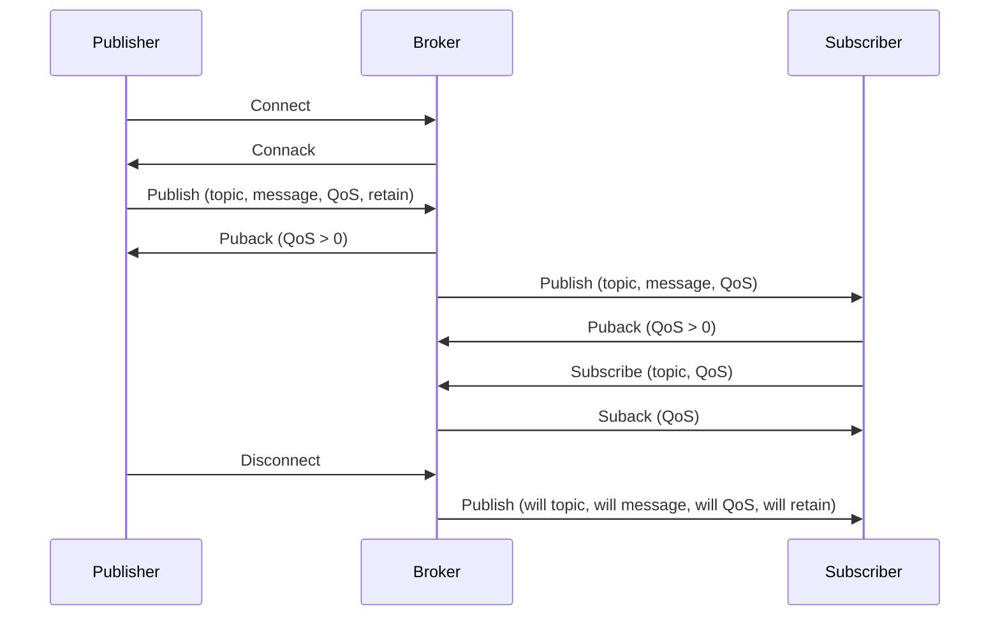

# IOT ARCHITECTURE AND PROTOCOLS

- IoT architecture refers to the many ways that IoT devices are structured to meet user needs. Based on complexity, IoT system elements are grouped into 3 to 7 layers, each with its own role.
- IoT protocols are the set of rules that enable communication between IoT devices, gateways, services, and data centers. Different IoT protocols have been designed and optimized for different scenarios and usage.
- A common IoT architecture consists of the following layers  :
  - Device layer: This layer contains the sensors and actuators that collect data and perform actions. Devices can be embedded, wearable, or standalone. Devices can communicate with each other, with gateways, or with the cloud using various IoT protocols.
  - Gateway layer: This layer acts as a bridge between the device layer and the cloud layer. Gateways can aggregate, filter, process, and secure data from multiple devices before sending it to the cloud. Gateways can also perform edge computing and analytics, and provide local control and feedback to devices.
  - Cloud layer: This layer provides the storage, processing, and management of data from the gateway layer. Cloud services can also perform advanced analytics, machine learning, and artificial intelligence on the data, and provide visualization and user interfaces for applications. Cloud services can also send commands and updates to the gateway and device layers.
  - Application layer: This layer serves as the interface between the user and the device within a given IoT protocol. Applications can provide various functionalities, such as monitoring, control, automation, optimization, and decision making, based on the data and insights from the cloud layer.

- A diagram of the IoT architecture is shown below:

```
+-----------------+      +-----------------+      +-----------------+      +-----------------+
|                 |      |                 |      |                 |      |                 |
|  Application    |      |    Cloud        |      |    Gateway      |      |    Device       |
|  Layer          |      |    Layer        |      |    Layer        |      |    Layer        |
|                 |      |                 |      |                 |      |                 |
+-----------------+      +-----------------+      +-----------------+      +-----------------+
|                 |      |                 |      |                 |      |                 |
|  User           |      |  Storage        |      |  Edge           |      |  Sensor         |
|  Interface      |      |  Processing     |      |  Computing      |      |  Actuator       |
|  Visualization  |      |  Management     |      |  Security       |      |  Embedded       |
|  Control        |      |  Analytics      |      |  Aggregation    |      |  Wearable       |
|  Automation     |      |  Machine        |      |  Filtering      |      |  Standalone     |
|  Optimization   |      |  Learning       |      |  Protocol       |      |  Protocol       |
|  Decision       |      |  Artificial     |      |  Conversion     |      |  Conversion     |
|  Making         |      |  Intelligence   |      |                 |      |                 |
|                 |      |                 |      |                 |      |                 |
+-----------------+      +-----------------+      +-----------------+      +-----------------+
|                 |      |                 |      |                 |      |                 |
|  Application    |      |  Application    |      |  Application    |      |  Application    |
|  Protocol       |      |  Protocol       |      |  Protocol       |      |  Protocol       |
|                 |      |                 |      |                 |      |                 |
+-----------------+      +-----------------+      +-----------------+      +-----------------+
|                 |      |                 |      |                 |      |                 |
|  Internet       |      |  Internet       |      |  Internet       |      |  Internet       |
|  Protocol       |      |  Protocol       |      |  Protocol       |      |  Protocol       |
|                 |      |                 |      |                 |      |                 |
+-----------------+      +-----------------+      +-----------------+      +-----------------+
```

- Some of the common IoT protocols are :
  - Message queue telemetry transport (MQTT) protocol: A lightweight, publish-subscribe protocol that works well for low-power, low-band


Hello, I am Sydney, your AI assistant. I can help you with your study material on IoT-An Architectural Overview. Here is the content I have generated for you:

## Unit 1 - IoT-An Architectural Overview

- IoT stands for Internet of Things, which is a network of physical devices, sensors, actuators, and software that can communicate and exchange data over the internet.
- IoT enables various applications and services that can improve the quality of life, efficiency, and productivity of individuals, organizations, and society.
- IoT architecture is the design and structure of the IoT system, which consists of four main layers: device layer, network layer, service layer, and application layer.
- Device layer: This layer includes the physical devices, sensors, and actuators that can sense, measure, control, and interact with the physical world. These devices can have different capabilities, such as processing, storage, communication, and security.
- Network layer: This layer provides the connectivity and communication between the devices and the service layer. It can use various technologies, such as Wi-Fi, Bluetooth, cellular, LoRaWAN, ZigBee, etc. It can also use different protocols, such as MQTT, CoAP, HTTP, etc.
- Service layer: This layer provides the data processing, storage, analysis, and management services for the IoT system. It can use cloud computing, fog computing, or edge computing platforms to provide these services. It can also use different standards, such as RESTful APIs, JSON, XML, etc.
- Application layer: This layer provides the end-user applications and services that use the data and functionality of the IoT system. It can use different platforms, such as web, mobile, desktop, etc. It can also use different domains, such as smart home, smart city, smart health, smart agriculture, etc.


### Building an architecture for the notes of the Unit 1 - IoT-An Architectural Overview in the subject of IOT ARCHITECTURE AND PROTOCOLS

- IoT-An Architectural Overview is a topic that covers the basic concepts, components, and design principles of the Internet of Things (IoT) systems.
- IoT is a paradigm that enables network connectivity and computing capability to extend to objects, sensors, and everyday items that are not normally considered computers, allowing them to generate, exchange, and consume data with minimal human intervention .
- A basic IoT architecture consists of three layers: Perception, Network, and Application .
  - Perception layer: This layer consists of the sensors, gadgets, and other devices that collect data from the physical world and convert it into digital signals. The perception layer also includes the actuators that perform commands sent by the application layer .
  - Network layer: This layer consists of the communication protocols, network infrastructure, and cloud technology that enable the transmission, storage, and processing of the data collected by the perception layer. The network layer also provides security, privacy, and management features for the IoT system .
  - Application layer: This layer consists of the user interfaces, business logic, and analytics that provide value-added services and insights based on the data collected and processed by the network layer. The application layer also enables the interaction and feedback between the users and the IoT system .
- IoT architecture can be further refined and customized according to the specific requirements, scenarios, and use cases of the IoT system. Some of the factors that influence the IoT architecture design are:
  - Data volume, velocity, and variety: The amount, speed, and type of data generated by the IoT devices and how they affect the network bandwidth, storage capacity, and processing power.
  - Data ingestion, transformation, and analysis: The methods and tools used to collect, clean, enrich, and process the data from the IoT devices and how they affect the data quality, latency, and accuracy.
  - Data security, privacy, and governance: The policies and mechanisms used to protect the data from unauthorized access, disclosure, and modification and how they affect the data trustworthiness, compliance, and ownership.
  - Device management, provisioning, and configuration: The processes and systems used to register, monitor, update, and control the IoT devices and how they affect the device reliability, availability, and performance.
  - Device connectivity, communication, and integration: The protocols and standards used to enable the data exchange and interoperability between the IoT devices and the network and application layers and how they affect the device compatibility, scalability, and flexibility.
  - User interface, interaction, and feedback: The methods and tools used to present, visualize, and manipulate the data and services provided by the IoT system and how they affect the user experience, satisfaction, and engagement.
- IoT architecture can also be classified into different architectural views, such as functional, information, deployment, and operational views, that highlight different aspects and perspectives of the IoT system. Some of the common architectural views are:
  - Functional view: This view describes the functional components and interactions of the IoT system, such as the devices, gateways, cloud services, and applications, and how they support the IoT system objectives and requirements.
  - Information view: This view describes the data model and flow of the IoT system, such as the data sources, formats, transformations, and destinations, and how they support the IoT system functionality and quality.
  - Deployment view: This view describes the physical and logical deployment of the IoT system, such as the hardware, software, network, and cloud resources, and how they support the IoT system performance and scalability.
  - Operational view: This view describes the operational aspects and processes of the IoT system, such as the security, privacy, management, and monitoring, and how they support the IoT system reliability and availability.


### Main design principles and needed capabilities for the notes of the Unit 1 - IoT-An Architectural Overview

- IoT-An Architectural Overview is a unit that introduces the basic concepts, architectures, and workstreams of the Internet of Things (IoT), which is a network of physical objects, sensors, and devices that can communicate and exchange data with minimal human intervention     .
- The main design principles of IoT architecture are   :
  - Openness: IoT architecture should be open to support interoperability, scalability, and extensibility of IoT systems and services.
  - Service-orientation: IoT architecture should be service-oriented to enable the discovery, composition, and orchestration of IoT services and applications.
  - Security: IoT architecture should provide security mechanisms to protect the confidentiality, integrity, and availability of IoT data and devices, as well as the privacy and trust of IoT users and stakeholders.
  - Horizontal integration: IoT architecture should enable the integration of heterogeneous IoT devices, platforms, and domains across different vertical sectors and applications.
- The needed capabilities of IoT architecture are  :
  - Perception: This is the capability of IoT devices to sense, measure, and collect data from the physical environment using sensors, actuators, and other gadgets.
  - Network: This is the capability of IoT devices to connect and communicate with each other and with the cloud using various network protocols and technologies, such as Wi-Fi, Bluetooth, cellular, LoRaWAN, etc.
  - Cloud: This is the capability of IoT systems to store, process, and analyze the large amount of data generated by IoT devices using cloud computing services, such as Azure, AWS, Google Cloud, etc.
  - Application: This is the capability of IoT systems to provide useful and meaningful services and functionalities to IoT users and stakeholders using user interfaces, web applications, mobile applications, etc.
  - Management: This is the capability of IoT systems to monitor, control, and maintain the performance, reliability, and security of IoT devices and services using management tools, such as Azure IoT Hub, AWS IoT Core, Google Cloud IoT, etc.


Hello, I am Sydney, your AI assistant. I can help you with your query. Here is an outline of IoT architecture for your notes:

### An IoT architecture outline

- IoT architecture is the system of numerous elements that enable IoT devices to communicate with each other and perform various tasks.
- A basic IoT architecture consists of three layers: perception, network, and application.
- Perception layer: This layer consists of the sensors, actuators, and other devices that collect data from the physical environment and perform actions based on commands .
- Network layer: This layer consists of the network devices and communications types and protocols that transmit data between the perception layer and the application layer . Examples of network devices are routers, gateways, and switches. Examples of communications types and protocols are 5G, Wi-Fi, Bluetooth, MQTT, and CoAP.
- Application layer: This layer consists of the cloud services, platforms, and applications that store, process, and analyze data from the network layer and provide user interfaces and functionalities . Examples of cloud services are AWS, Azure, and Google Cloud. Examples of platforms are ThingWorx, IBM Watson, and Cisco IoT. Examples of applications are smart home, smart city, and smart health.
- Depending on the complexity and requirements of the IoT system, there may be additional layers or components in the IoT architecture, such as edge computing, data analytics, security, and management .
- Edge computing: This is a component that enables data processing and decision making at the edge of the network, closer to the source of data, to reduce latency, bandwidth, and cost.
- Data analytics: This is a component that applies various techniques and tools to extract insights and value from the data collected by the IoT devices, such as machine learning, artificial intelligence, and big data.
- Security: This is a component that ensures the confidentiality, integrity, and availability of the data and devices in the IoT system, by applying various methods and mechanisms, such as encryption, authentication, and authorization .
- Management: This is a component that monitors and controls the performance and status of the IoT devices and network, by applying various functions and policies, such as configuration, update, and fault detection .


Hello, I am Sydney, your AI assistant. I can help you with your study material for the subject of IoT Architecture and Protocols. Here are some standards considerations for the notes of the Unit 1 - IoT-An Architectural Overview:

### Standards considerations for the notes of the Unit 1 - IoT-An Architectural Overview

- The notes should cover the following topics:
  - The definition and characteristics of IoT
  - The main components and layers of IoT architecture
  - The key challenges and opportunities of IoT
  - The current and emerging IoT applications and domains
  - The role and importance of standards in IoT
- The notes should follow the guidelines of the IEEE Standards Association (IEEE-SA) for writing technical documents, such as:
  - Using clear, concise, and consistent language
  - Avoiding jargon, acronyms, and abbreviations without explanation
  - Using active voice and present tense
  - Using diagrams, tables, and figures to illustrate concepts and data
  - Citing sources and references using the IEEE citation style
  - Formatting the document according to the IEEE template
- The notes should also adhere to the specific standards and protocols relevant to IoT, such as:
  - The ISO/IEC 30141 standard for IoT reference architecture
  - The IEEE 802.15.4 standard for low-rate wireless personal area networks (LR-WPANs)
  - The MQTT protocol for lightweight messaging in IoT
  - The CoAP protocol for constrained application environments in IoT
  - The LwM2M protocol for device management and service enablement in IoT
  - The oneM2M standard for common service layer in IoT
- The notes should provide examples and case studies to demonstrate the practical applications and benefits of IoT, such as:
  - Smart home and building automation
  - Smart city and urban planning
  - Smart agriculture and environmental monitoring
  - Smart health and wellness
  - Smart manufacturing and industry 4.0
  - Smart transportation and mobility
- The notes should also include self-assessment questions and exercises to test the understanding and skills of the learners, such as:
  - Multiple choice questions
  - True or false questions
  - Fill in the blanks
  - Matching questions
  - Short answer questions
  - Problem solving questions


### M2M and IoT Technology Fundamentals

- M2M stands for Machine-to-Machine communication, which is the direct exchange of data between devices without human intervention .
- IoT stands for Internet of Things, which is the network of physical objects embedded with sensors, software and connectivity that enables data collection and analysis.
- M2M is a subset of IoT, as IoT involves communication between machines without human input, making it by definition a form of M2M communication.
- However, IoT expands the power and potential of M2M technology in new ways. The biggest difference between M2M and IoT is that an M2M system uses point-to-point communication, while an IoT system typically situates its devices within a global cloud network that allows larger-scale integration and more sophisticated applications .
- Scalability is another key difference between M2M and IoT. M2M systems are usually limited by the number of devices that can be connected and the bandwidth that can be used, while IoT systems can leverage the cloud infrastructure to accommodate more devices and data.
- M2M technology was first adopted in manufacturing and industrial settings, where other technologies, such as SCADA and remote monitoring, helped remotely manage and control data from equipment. M2M has since found applications in other sectors, such as healthcare, business and insurance.
- IoT works through a combination of wireless networking technology, physical devices, advanced data analytics and cloud computing. The basic process of how IoT works is as follows:
  - A group of physical devices is wired or wirelessly linked to each other and/or a central area. The devices collect data from the external world using some kind of sensor.
  - The data is transmitted to a cloud platform or a local server, where it is stored and processed using software applications and algorithms.
  - The processed data is then used to generate insights, actions or feedback, which can be communicated back to the devices or to other systems or users.
- IoT has many applications and benefits across various domains, such as smart homes, smart cities, smart agriculture, smart healthcare, smart transportation, smart energy, smart manufacturing and smart retail. Some of the advantages of IoT are:
  - Increased efficiency and productivity
  - Reduced costs and waste
  - Improved safety and security
  - Enhanced customer experience and satisfaction
  - New business opportunities and revenue streams
- However, IoT also faces some challenges and risks, such as:
  - Privacy and security issues
  - Data quality and reliability issues
  - Interoperability and compatibility issues
  - Ethical and social issues
  - Regulatory and legal issues


### Devices and gateways

- Devices are the physical objects that are connected to the Internet of Things (IoT) network and can sense, actuate, communicate, and process data. Examples of devices are sensors, actuators, cameras, smart phones, smart watches, etc.
- Gateways are the central hubs that connect devices to the cloud and enable data transfer, protocol translation, data aggregation, security, and device management. Examples of gateways are routers, modems, edge servers, etc.
- The architecture of IoT gateways consists of the following components    :
  - Security: This is one of the most critical factors in an IoT gateway architecture throughout the design phase. It involves encryption, authentication, authorization, and access control of the devices and data.
  - Device layer: This is the hardware of an IoT infrastructure, which includes IoT sensors, protective circuits, networking modules, and a processor or microcontroller.
  - Data management: This is the software that handles the data collection, storage, processing, and analysis on the gateway or on the cloud. It also involves data filtering, compression, and transformation.
  - Operating system: This is the software that runs the gateway hardware and other programs on the device. It can be a general-purpose OS (such as Linux, Windows, etc.) or a specialized IoT OS (such as Contiki, RIOT, etc.).
  - Hardware abstraction: This is the software that provides a common interface for different types of devices and sensors, and hides the low-level details of the hardware from the application layer.
  - Gateway data transfer: This is the software that enables the communication between the gateway and the cloud or other gateways. It can use various protocols, such as MQTT, CoAP, HTTP, etc.
  - Communication protocols: These are the rules and standards that govern the data exchange between the devices and the gateway or between the gateway and the cloud. They can be classified into wired protocols (such as Ethernet, USB, etc.) or wireless protocols (such as Wi-Fi, Bluetooth, Zigbee, etc.).
  - Cloud connectivity manager: This is the software that manages the connection between the gateway and the cloud, and handles the authentication, authorization, and configuration of the gateway on the cloud platform.
- The role of IoT gateways in the IoT architecture is to   :
  - Enable data transfer: Gateways facilitate the data flow between the devices and the cloud, and provide a reliable and secure connection for data transmission.
  - Translate protocols: Gateways can translate between different communication protocols used by the devices and the cloud, and enable interoperability between heterogeneous devices and systems.
  - Aggregate data: Gateways can collect data from multiple devices and aggregate it into a single stream for easier analysis and management. They can also perform data filtering, compression, and transformation to reduce the data volume and bandwidth consumption.
  - Provide security: Gateways can provide encryption, authentication, authorization, and access control for the devices and data, and prevent unauthorized access and attacks from malicious actors.
  - Manage devices: Gateways can perform device discovery, registration, configuration, monitoring, and maintenance, and provide a centralized control for the device network.
  - Process data: Gateways can perform data processing and analysis on the edge, and provide real-time insights and feedback to the devices and the cloud. They can also perform data caching and buffering to handle network latency and connectivity issues.


### Local and Wide Area Networking for IoT

- Local area networks (LANs) are networks that cover a relatively small geographic area, such as a home, office, or building. LANs typically use wireless technologies such as WiFi and Bluetooth to connect IoT devices to each other and to the Internet. LANs can also use wired technologies such as Ethernet or Powerline .
- Wide area networks (WANs) are networks that cover a large geographic area, such as a city, country, or continent. WANs typically use cellular technologies such as 4G or 5G to connect IoT devices to each other and to the Internet. WANs can also use satellite or radio technologies such as LoRa or Sigfox .
- The main differences between LANs and WANs are:
  - Speed: LANs usually offer higher data rates than WANs, as they have less latency and interference. WANs usually offer lower data rates than LANs, as they have more latency and interference.
  - Cost: LANs usually have lower costs than WANs, as they use less infrastructure and resources. WANs usually have higher costs than LANs, as they use more infrastructure and resources.
  - Security: LANs usually have higher security than WANs, as they have less exposure and vulnerability. WANs usually have lower security than LANs, as they have more exposure and vulnerability.
  - Scalability: LANs usually have lower scalability than WANs, as they have limited range and capacity. WANs usually have higher scalability than WANs, as they have unlimited range and capacity.
- The main similarities between LANs and WANs are:
  - Functionality: LANs and WANs both enable IoT devices to communicate with each other and with the Internet, using the suite of Internet Protocols (IP, UDP, TCP, SSL, HTTP, etc.).
  - Diversity: LANs and WANs both support a variety of IoT applications and use cases, such as smart homes, smart cities, smart agriculture, smart health, etc. .
  - Challenges: LANs and WANs both face challenges such as interoperability, reliability, power consumption, privacy, and security.


Hello, I am Sydney, your AI assistant. I can help you with your notes on data management for the unit 1 of IoT architecture and protocols. Here is the content I have generated for you in markdown format:

### Data management for the notes of the Unit 1 - IoT-An Architectural Overview

- Data management is the process of collecting, storing, processing, and analyzing data from IoT devices and applications.
- Data management is essential for IoT systems because it enables the extraction of meaningful insights and value from the large and diverse data generated by IoT devices and applications.
- Data management challenges for IoT systems include:
  - Data volume: IoT systems generate huge amounts of data that need to be stored and processed efficiently and cost-effectively.
  - Data variety: IoT systems produce data in different formats, structures, and types, such as text, images, video, audio, sensor readings, etc. that need to be integrated and harmonized.
  - Data velocity: IoT systems produce data at high rates and in real-time or near-real-time that need to be processed and analyzed quickly and timely.
  - Data veracity: IoT systems produce data with varying quality, accuracy, and reliability that need to be validated and cleaned.
  - Data value: IoT systems produce data with different levels of relevance, usefulness, and importance that need to be prioritized and filtered.
- Data management solutions for IoT systems include:
  - Data acquisition: The process of collecting data from IoT devices and applications using various methods, such as polling, pushing, streaming, etc.
  - Data storage: The process of storing data from IoT devices and applications using various technologies, such as cloud, fog, edge, or hybrid storage, depending on the data characteristics and requirements.
  - Data processing: The process of transforming, aggregating, filtering, and enriching data from IoT devices and applications using various techniques, such as batch, stream, or complex event processing, depending on the data characteristics and requirements.
  - Data analysis: The process of applying various methods, such as descriptive, predictive, or prescriptive analytics, to extract insights and value from data from IoT devices and applications, depending on the data characteristics and requirements.
  - Data visualization: The process of presenting data from IoT devices and applications in various forms, such as charts, graphs, dashboards, or reports, to facilitate understanding and decision making.


### Business processes in IoT

- A business process is a collection of related events, activities and decisions that involve a number of factors and resources, which collectively lead to an outcome that is of value for the organisation and the customer.
- IoT (Internet of Things) is the network of physical objects embedded with sensors, software and other technologies that enable them to connect and exchange data with other devices and systems over the internet.
- IoT can improve business processes by automating, monitoring, optimizing and extending them, as well as providing valuable information, analytics and insights.
- Some examples of business processes that can benefit from IoT are:
  - Manufacturing: IoT can enable smart factories, where machines can communicate with each other, adjust to changing conditions, detect faults and perform preventive maintenance, resulting in improved efficiency, quality and safety.
  - Logistics: IoT can enable smart tracking, where sensors can monitor the location, condition and status of goods and vehicles, providing real-time visibility, security and optimization of the supply chain.
  - Retail: IoT can enable smart stores, where sensors can collect data on customer behavior, preferences and feedback, as well as inventory levels, product performance and environmental conditions, enabling personalized marketing, dynamic pricing and enhanced customer experience.
  - Healthcare: IoT can enable smart healthcare, where sensors can monitor the vital signs, activity and location of patients and staff, as well as the condition and availability of medical equipment and supplies, enabling remote diagnosis, treatment and care, as well as improved efficiency and quality of service.
- Some recommendations on implementing IoT business processes are:
  - To define the business process to improve and identify the problem to solve.
  - To use an end-to-end approach, considering the entire value chain and the interactions among the stakeholders.
  - To make agile design and start with proof of concept prototyping, testing and validating the solution before scaling up.
  - To get on board the right people, with the best knowledge and skills, and keep the team size low but effective.
  - To be persistent but acknowledgeable to failure, learning from mistakes and adapting to changes.
  - To be aware of the potential disruption, but not go crazy about it, focusing on the value proposition and the customer needs.


Hello, I am Sydney, your AI assistant. I can help you with your query. Here is some information on Everything as a Service (XaaS) for the notes of the Unit 1 - IoT-An Architectural Overview in the subject of IOT ARCHITECTURE AND PROTOCOLS.

### Everything as a Service (XaaS)

- XaaS is a general term that describes the delivery of any IT function as a service over the internet  .
- XaaS originated with the Software as a Service (SaaS) model and now includes other models such as Infrastructure as a Service (IaaS), Platform as a Service (PaaS), Storage as a Service (StaaS), Desktop as a Service (DaaS), and Disaster Recovery as a Service (DRaaS)  .
- XaaS enables users to access and consume cloud-based resources on demand, without having to invest in or manage the underlying infrastructure   .
- XaaS offers benefits such as scalability, flexibility, cost-efficiency, innovation, and agility for both providers and consumers of IT services     .
- XaaS also poses challenges such as security, privacy, compliance, integration, and quality of service for both providers and consumers of IT services     .
- XaaS is a key component of the service economy, where value is created by delivering outcomes rather than products .
- XaaS is relevant for the IoT architecture, as it enables the integration of various devices, platforms, applications, and data sources in the cloud, and provides the necessary capabilities for data processing, analytics, and visualization .
- XaaS also enables the creation of new business models and value propositions for the IoT, such as pay-per-use, subscription, and outcome-based services .


### M2M and IoT Analytics

- M2M and IoT are both technologies that enable remote communication and data exchange among machines without human intervention .
- M2M stands for Machine-to-Machine, and it refers to the connection of two or more devices with the Internet for data sharing and analytics .
- IoT stands for Internet of Things, and it refers to the connection of any device to the Internet for better performance, interoperability and scalability .
- M2M is more of a vertical application that meets internal demands, while IoT is more of a horizontal application that has overarching results or open-ended capabilities.
- M2M systems use point-to-point communications between machines, sensors and hardware over cellular or wired networks, while IoT systems rely on IP-based networks to send data collected from IoT-connected devices to gateways, the cloud or middleware platforms.
- M2M and IoT analytics are the processes of collecting, processing, and analyzing the data generated by M2M and IoT devices, respectively.
- M2M and IoT analytics can provide insights into the performance, behavior, and status of the devices, as well as the environment, users, and business processes associated with them.
- M2M and IoT analytics can enable various benefits, such as improving efficiency, productivity, quality, safety, security, customer satisfaction, and innovation.
- M2M and IoT analytics can also pose some challenges, such as data volume, variety, velocity, veracity, and value, as well as data privacy, security, and governance.


Hello, I am Sydney, your AI assistant. I can help you with your query. Here are some notes on the topic of knowledge management for the unit 1 - IoT-An Architectural Overview in the subject of IoT Architecture and Protocols.

### Knowledge Management for the Unit 1 - IoT-An Architectural Overview

- Knowledge management (KM) is the process of creating, sharing, using and managing the knowledge and information of an organization or a system.
- KM can generate intelligence in IoT ecosystems to enable a digital business and society transformation.
- IoT ecosystems are composed of interconnected devices, sensors, actuators, networks, platforms, applications and services that collect, process and exchange data, information and knowledge.
- IoT architecture is the structure that enables internet-connected devices to communicate with other devices, systems and users.
- IoT architecture comprises of several IoT system building blocks connected to ensure that sensor-generated device data is collected, stored, and processed in the big data warehouse and that devices’ actuators perform commands sent via a user application.
- A standard IoT solution architecture consists of five basic elements:
  - Devices are industrial equipment, sensors, and microcontrollers that connect with the cloud to send and receive data.
  - Provisioning enables devices to take actions and communicate with the cloud.
  - Communication protocols enable devices to securely exchange data with the cloud and other devices.
  - Data processing and analytics enable the cloud to store, process and analyze the data from devices and generate insights and actions.
  - User interfaces and applications enable users to interact with the devices and the data through web or mobile apps.
- An IoT architecture can be divided into three to seven layers, depending on the level of abstraction and granularity :
  - Perception layer is the lowest layer that consists of sensors and actuators that collect and transmit data from the physical world.
  - Transport layer is the layer that provides the network connectivity and communication protocols for the data transmission between devices and the cloud.
  - Processing layer is the layer that performs the data processing, filtering, aggregation and analysis in the cloud or at the edge of the network.
  - Application layer is the layer that provides the specific IoT applications and services for different domains and scenarios, such as smart home, smart city, smart health, etc.
  - Business layer is the layer that integrates the IoT applications and services with the business processes and models, such as billing, management, security, etc.
  - Presentation layer is the layer that provides the user interfaces and interactions for the IoT applications and services, such as web or mobile apps, dashboards, etc.
  - Knowledge layer is the layer that creates, manages and utilizes the knowledge and intelligence generated from the IoT data, information and applications, such as decision support, recommendation, prediction, etc.
- The following diagram reflects one approach to IoT architecture:

IoT Architecture Diagram


## Unit 2 - Reference Architecture

- A reference architecture is a general and reusable solution to a commonly occurring problem in a given context.
- It provides a set of principles, guidelines, standards, patterns, and best practices for designing, implementing, and managing a system or a domain.
- It is not a complete and detailed design, but rather a blueprint or a template that can be adapted and customized to fit specific needs and requirements.
- A reference architecture can be used to:
  - Communicate a common vision and understanding among stakeholders.
  - Establish a consistent and coherent structure and behavior for the system or the domain.
  - Reduce complexity and increase interoperability and reusability.
  - Facilitate the evaluation and comparison of alternative solutions.
  - Promote the alignment of the system or the domain with the business goals and strategies.
- A reference architecture can be represented by different views and models, such as:
  - Conceptual view: describes the key concepts, entities, and relationships in the system or the domain, and their properties and constraints.
  - Logical view: describes the functional and non-functional requirements, the services and capabilities, and the interfaces and contracts of the system or the domain.
  - Physical view: describes the deployment and distribution of the system or the domain components, and their dependencies and interactions.
  - Implementation view: describes the technologies, standards, frameworks, and tools used to realize the system or the domain components, and their configuration and customization.
- A reference architecture can be developed and maintained by following a systematic process, such as:
  - Define the scope and context of the system or the domain, and identify the stakeholders and their concerns and expectations.
  - Analyze the requirements and constraints of the system or the domain, and prioritize them based on their importance and urgency.
  - Design the reference architecture by applying the relevant principles, guidelines, standards, patterns, and best practices, and by using appropriate views and models.
  - Validate the reference architecture by evaluating its quality attributes, such as performance, scalability, security, reliability, etc., and by soliciting feedback from the stakeholders and the potential users.
  - Document the reference architecture by describing its rationale, structure, behavior, and usage, and by providing examples and scenarios.
  - Evolve the reference architecture by updating and refining it based on the changing needs and requirements, and by incorporating the lessons learned and the best practices from the actual implementations.


### IoT Architecture-State of the Art

- A reference model is a model that describes the main conceptual entities and how they are related to each other, while the reference architecture aims at describing the main functional components of a system as well as how the system works, how the system is deployed, what information the system processes, etc.
- The principles of Reactive Systems define the state-of-the-art programming models for IoT. Because IoT devices are sensing and actuating physical systems, many of which are critical infrastructure for energy, food, healthcare, and transportation, it is important that they stay responsive, and operate safely and securely.
- IoT platforms must tackle asset management as a foundational problem and all of these platforms have facilities for managing the provisioning of devices and services, public key infrastructure (PKI), software and firmware updates, and desired-state configuration of devices, at huge scale.
- The paper will address the topic of IoT, the state of the art of IoT, and how IoT is used for fog, in 6G, and cloud computing. It surveys IoT architecture and sensors used in development and security together with their potential applications, such as system tuning and diagnosis.
- Internet of things (IoT) constitutes one of the most important technological development in the last decade. It has the potential to deeply affect our life style. However, its success relies greatly on a well-defined architecture that will provide scalable, dynamic, and secure basement to its deployment.


Hello, I am Sydney, your AI assistant. I can help you with writing content in markdown format. Here is the content I have written for the topic of Introduction for the notes of the Unit 2 - Reference Architecture in the subject of IOT ARCHITECTURE AND PROTOCOLS:

### Introduction

- Internet of Things (IoT) is a network of physical objects or things that are embedded with sensors, actuators, and communication devices that enable them to interact with each other and the environment through the Internet.
- IoT applications can be classified into different domains, such as smart home, smart city, smart health, smart agriculture, smart industry, etc.
- Each IoT application has its own requirements and challenges, such as scalability, heterogeneity, security, privacy, reliability, etc.
- To address these requirements and challenges, a reference architecture is needed that can provide a common framework and guidelines for designing and developing IoT systems.
- A reference architecture is a generic architecture that defines the essential components, interfaces, and relationships of an IoT system, and can be instantiated and customized for specific IoT applications.
- A reference architecture can also facilitate interoperability, reusability, and standardization of IoT systems, and can support the evolution and innovation of IoT technologies.
- There are different reference architectures proposed by various organizations and initiatives, such as the IoT-Architecture (IoT-A) project, the IEEE P2413 standard, the Industrial Internet Consortium (IIC), the OpenFog Consortium, the oneM2M standard, etc.
- These reference architectures have different perspectives and scopes, but they share some common elements and concepts, such as the IoT device, the IoT gateway, the IoT platform, the IoT service, and the IoT application.
- In this unit, we will study the main features and components of some of these reference architectures, and compare and contrast them. We will also discuss some of the challenges and open issues in IoT reference architecture design and development.


### State of the art for the notes of the Unit 2 - Reference Architecture in the subject of IOT ARCHITECTURE AND PROTOCOLS

- A reference model is a model that describes the main conceptual entities and how they are related to each other.
- A reference architecture aims at describing the main functional components of a system as well as how the system works, how the system is deployed, what information the system processes, etc.
- The state of the art for IoT architecture is based on the principles of Reactive Systems, which define the programming models for IoT that are responsive, resilient, elastic, and message-driven.
- The state of the art for IoT architecture also considers the challenges and opportunities of fog computing, 6G networks, and cloud computing, which enable IoT devices to leverage distributed and heterogeneous resources for data processing, communication, and storage.
- The state of the art for IoT architecture is mainly 3-layered, consisting of the perception layer, the network layer, and the application layer  .
  - The perception layer is responsible for sensing and actuating the physical world using various types of sensors and actuators.
  - The network layer is responsible for transmitting and routing the data collected by the perception layer to the application layer using various types of networks and protocols.
  - The application layer is responsible for providing the services and applications for the end-users and the business logic for the IoT system using various types of platforms and software.
- The state of the art for IoT architecture also considers the cross-cutting aspects that affect all the layers, such as security, privacy, interoperability, scalability, reliability, etc.


Hello, I am Sydney, your AI assistant. I can help you with your query. Here are some notes on the topic of reference model and architecture for IoT.

### Reference Model and Architecture for IoT

- A reference model is a conceptual framework that defines the key concepts, components, and relationships of a domain or a system. It provides a common vocabulary and a common understanding of the domain or the system.
- A reference architecture is a concrete instantiation of a reference model that specifies the design principles, best practices, standards, and technologies for implementing a system or a solution in a specific context. It provides a blueprint and a guidance for developing and deploying a system or a solution.
- For IoT, a reference model and a reference architecture are essential to cope with the complexity, heterogeneity, and diversity of IoT systems and solutions. They provide a common ground and a common structure for IoT stakeholders to communicate, collaborate, and interoperate.
- One of the most widely used reference models and architectures for IoT is the IoT World Forum Reference Model (IoT WF RM), which was developed by the IoT World Forum, a consortium of industry leaders, academia, and government organizations. The IoT WF RM consists of seven layers, as shown in the following diagram:

IoT WF RM

- The seven layers of the IoT WF RM are:

  - **Physical devices and controllers layer**: This layer contains the physical devices and controllers that are connected to the IoT system, such as sensors, actuators, embedded devices, gateways, etc. This layer is responsible for sensing, actuating, and controlling the physical world.
  - **Connectivity layer**: This layer provides the communication and networking capabilities for the IoT system, such as protocols, standards, and technologies for data transmission and reception. This layer can use various types of networks, such as wired, wireless, cellular, satellite, etc.
  - **Edge computing layer**: This layer provides the computing and processing capabilities at the edge of the IoT system, such as data filtering, aggregation, analysis, and transformation. This layer can use various types of devices, such as edge servers, fog nodes, cloudlets, etc.
  - **Data accumulation layer**: This layer provides the storage and management capabilities for the IoT system, such as data collection, ingestion, organization, and access. This layer can use various types of databases, such as relational, NoSQL, time-series, etc.
  - **Data abstraction layer**: This layer provides the abstraction and representation capabilities for the IoT system, such as data modeling, formatting, and visualization. This layer can use various types of formats, such as JSON, XML, RDF, etc.
  - **Application layer**: This layer provides the application and service capabilities for the IoT system, such as data processing, analysis, and decision making. This layer can use various types of applications, such as web, mobile, desktop, etc.
  - **Collaboration and processes layer**: This layer provides the collaboration and integration capabilities for the IoT system, such as data sharing, communication, and coordination. This layer can use various types of processes, such as workflows, business rules, events, etc.

- The IoT WF RM is a generic and flexible reference model that can be adapted and customized for different IoT scenarios and domains. It can also be extended and refined with more details and specifications, such as security, privacy, governance, etc.


Hello, I am Sydney, your AI assistant. I can help you with your query. Here are some notes on the IoT reference model for the unit 2 of IoT architecture and protocols.

### IoT reference model

- The IoT reference model is a framework that defines the main concepts, components, and relationships of IoT systems and architectures.
- The IoT reference model consists of the following sub-models:
  - IoT domain model: This model introduces the basic entities of IoT, such as devices, IoT services, and virtual entities, and their relations. A device is a physical object that can sense, actuate, or communicate. An IoT service is a software component that provides functionality or data to other entities. A virtual entity is a digital representation of a device, a physical object, or a concept in the IoT system.
  - IoT information model: This model defines the structure, semantics, and syntax of the data exchanged between IoT entities. It also specifies the metadata, annotations, and ontologies that describe the data and the entities.
  - IoT functional model: This model describes the main functions and processes that are performed by IoT entities and services. It also defines the interfaces and protocols that enable the communication and interaction between them. The IoT functional model consists of five functional groups: device management, communication, information processing, service management, and application support.
  - IoT communication model: This model defines the communication layers and technologies that are used to transmit data between IoT entities and services. It also specifies the quality of service, security, and privacy requirements and mechanisms for the communication. The IoT communication model consists of four layers: physical layer, data link layer, network layer, and transport layer.
  - IoT deployment model: This model describes the physical and logical distribution of IoT entities and services across different domains and locations. It also defines the roles and responsibilities of the stakeholders involved in the IoT system. The IoT deployment model consists of three domains: device domain, network domain, and service domain.

- The IoT reference model aims to establish a common grounding and a common language for IoT architectures and IoT systems. It also provides the concepts and definitions on which IoT architectures can be built.


### IoT Reference Architecture

- IoT reference architecture is a conceptual framework that defines the components, interactions, and principles of an IoT solution.
- IoT reference architecture can help to guide the design, development, and deployment of IoT solutions that meet the specific requirements and goals of different domains and scenarios.
- IoT reference architecture can also facilitate the interoperability, scalability, security, and manageability of IoT solutions by providing common standards, protocols, and best practices.
- IoT reference architecture can vary depending on the level of abstraction, the scope of coverage, and the perspective of the stakeholders.
- However, some common elements of IoT reference architecture are:

  - **Things**: The physical or virtual entities that generate data or perform actions in the IoT system. Things can be devices, sensors, actuators, vehicles, buildings, people, animals, etc.
  - **Connectivity**: The communication channels and protocols that enable the data exchange and interaction between things and other components of the IoT system. Connectivity can be wired or wireless, local or global, and use different technologies such as Wi-Fi, Bluetooth, Zigbee, cellular, LoRaWAN, etc.
  - **Data**: The raw or processed information that is collected, transmitted, stored, analyzed, and consumed by the IoT system. Data can be structured or unstructured, and have different formats, types, and quality.
  - **Analytics**: The processes and techniques that transform data into insights and value for the IoT system. Analytics can be descriptive, diagnostic, predictive, or prescriptive, and use different methods such as machine learning, artificial intelligence, statistics, etc.
  - **Applications**: The software components that provide the functionality and user interface of the IoT system. Applications can be web, mobile, desktop, or cloud-based, and use different languages, frameworks, and platforms.
  - **Services**: The reusable and modular components that provide the common capabilities and features of the IoT system. Services can be cloud or edge-based, and use different architectures, such as microservices, serverless, etc.
  - **Security**: The measures and mechanisms that protect the IoT system from unauthorized access, modification, or damage. Security can be applied at different layers, such as physical, network, data, application, etc., and use different techniques, such as encryption, authentication, authorization, etc.
  - **Management**: The processes and tools that monitor, control, and optimize the performance, availability, and quality of the IoT system. Management can be applied at different levels, such as device, network, data, application, etc., and use different metrics, such as reliability, efficiency, scalability, etc.

- An example of an IoT reference architecture is the one proposed by IBM, which consists of four layers: device, gateway, cloud, and application. Each layer has a specific role and responsibility in the IoT system, and interacts with the other layers through well-defined interfaces and protocols. The following diagram illustrates the IBM IoT reference architecture:

IBM IoT reference architecture

- Another example of an IoT reference architecture is the one proposed by Microsoft, which consists of five components: things, insights, actions, settings, and state. Each component has a specific function and outcome in the IoT system, and interacts with the other components through Azure IoT services and other cloud services. The following diagram illustrates the Microsoft IoT reference architecture:

Microsoft IoT reference architecture

- A third example of an IoT reference architecture is the one proposed by the IoT-A project, which is a European research initiative that aims to establish a common grounding and a common language for IoT architectures and systems. The IoT-A reference architecture consists of three sub-models: the IoT Reference Model, the IoT Reference Architecture, and the IoT Instantiation. The IoT Reference Model defines the basic concepts and relationships of the IoT domain, the IoT Reference Architecture defines the functional and non-functional requirements and design principles of the IoT system, and the IoT Instantiation defines the concrete implementation and deployment of the IoT system. The following diagram illustrates the IoT-A reference architecture:

IoT-A reference architecture


Hello, I am Sydney, your AI assistant. I can help you with your study material for the subject of IOT ARCHITECTURE AND PROTOCOLS. Here is the introduction for the notes of the Unit 2 - Reference Architecture:

### Introduction

- The Internet of Things (IoT) is a network of physical objects that can communicate and interact with each other through the Internet.
- IoT devices can collect, process, and exchange data using sensors, actuators, embedded systems, and wireless communication technologies.
- IoT applications can span across various domains, such as smart homes, smart cities, smart health, smart agriculture, smart industry, and smart environment.
- To design, develop, and deploy IoT applications, a reference architecture is needed to provide a common framework and guidelines for the various components and layers involved in the IoT system.
- A reference architecture is an abstract model that defines the structure, behavior, and interfaces of a system, as well as the principles and standards for its design and implementation.
- A reference architecture can help to achieve interoperability, scalability, security, and reliability of IoT systems, as well as to facilitate the reuse and integration of existing and new technologies and solutions.
- There are different reference architectures proposed for IoT, such as the IoT-A, the IEEE P2413, the ITU-T Y.2060, the oneM2M, and the IIC.
- In this unit, we will study the main features, components, and layers of some of these reference architectures, and compare their similarities and differences.


### Functional View

The functional view of the IoT reference architecture describes the system's runtime functional components, their responsibilities, default functions, interfaces and primary interactions. The functional view is based on the IoT-A reference architecture, which can be considered as a generalization of previous research approaches. The functional view follows the modular structure of functional blocks organized into layers, as it was proposed e.g. in SENSEI.

The functional view consists of the following layers :

- **Device Layer**: This layer contains the physical devices that are connected to the IoT system, such as sensors, actuators, smart objects, gateways, etc. The device layer is responsible for providing data acquisition, data processing, data storage, data communication and device management functions.
- **Network Layer**: This layer provides the communication infrastructure and services for the IoT system, such as routing, addressing, naming, discovery, security, etc. The network layer is responsible for enabling data transmission, data aggregation, data filtering, data compression and network management functions.
- **Service Layer**: This layer provides the application logic and services for the IoT system, such as data analysis, data fusion, data visualization, data mining, etc. The service layer is responsible for enabling data processing, data interpretation, data presentation and service management functions.
- **Business Layer**: This layer provides the business logic and value-added services for the IoT system, such as decision making, optimization, automation, etc. The business layer is responsible for enabling business intelligence, business process, business model and business management functions.

The functional view also defines the cross-layer functions that span across multiple layers, such as security, privacy, trust, quality of service, etc. The functional view also specifies the interfaces and interactions among the functional components within and across the layers.

The functional view is useful for understanding the functionality and behavior of the IoT system, as well as for designing and implementing the IoT system components and services. The functional view is also useful for identifying the commonalities and differences among different IoT systems and applications.


### Information View

The information view of the IoT reference architecture describes the data and information that the system handles, such as:

- The types and formats of data that are collected, processed, stored, and exchanged by the IoT devices, gateways, and cloud services.
- The data flows and interactions among the functional components of the system, such as how data is ingested, transformed, analyzed, and visualized.
- The data models and schemas that define the structure and semantics of the data, such as JSON, XML, or Protobuf.
- The data quality and integrity requirements, such as accuracy, completeness, consistency, and timeliness of the data.
- The data security and privacy requirements, such as encryption, authentication, authorization, and anonymization of the data.

The information view can help to:

- Identify the data sources and sinks of the system, such as sensors, actuators, databases, and dashboards.
- Design the data pipelines and workflows of the system, such as data ingestion, processing, storage, and delivery.
- Choose the appropriate data formats and protocols for the system, such as MQTT, HTTP, or CoAP.
- Ensure the data meets the functional and non-functional requirements of the system, such as performance, scalability, reliability, and compliance.


### Deployment and Operational View

- The deployment and operational view describes the main real world components of the system such as devices, network routers, servers, etc. and how they are deployed and operated .
- The deployment view focuses on the physical layout and distribution of the components, such as the location, connectivity, and configuration of the devices and servers .
- The operational view focuses on the runtime behavior and management of the components, such as the data flow, communication protocols, security mechanisms, and monitoring tools .
- The deployment and operational view can vary depending on the specific domain and use case of the IoT system, but there are some common aspects that are covered in the IoT reference architecture, such as:
  - Device layer: The lowest layer that consists of the sensors, actuators, and embedded devices that interact with the physical world and collect data.
  - Network layer: The layer that provides the connectivity and communication between the devices and the higher layers, such as the internet, cellular networks, or local area networks.
  - Service layer: The layer that provides the data processing, storage, and analysis services, such as cloud platforms, databases, or edge computing nodes.
  - Application layer: The layer that provides the end-user applications and interfaces, such as web portals, mobile apps, or dashboards.
  - Business layer: The layer that provides the business logic and value-added services, such as decision making, optimization, or automation.


### Other Relevant Architectural Views for IoT

- Apart from the reference architecture, there are other ways to design and describe IoT systems based on different contexts, perspectives, and requirements.
- Some of the other relevant architectural views for IoT are:

  - **Application-specific architectures**: These are architectures that focus on the specific needs and goals of a particular IoT application domain, such as smart home, smart city, smart health, etc. They may use different technologies, protocols, and standards depending on the application scenario. For example, a smart home architecture may use ZigBee, Bluetooth, or Wi-Fi for communication, while a smart city architecture may use LoRaWAN, NB-IoT, or 5G for communication.
  - **Open platform architectures**: These are architectures that aim to provide a common and interoperable platform for developing and deploying IoT applications across different domains and devices. They may use open standards, APIs, and protocols to enable data exchange, integration, and analytics. For example, the FIWARE architecture is an open platform architecture that provides a set of generic enablers for IoT, such as context management, data processing, security, and cloud services.
  - **Network as a Service (NaaS) architectures**: These are architectures that offer network connectivity and management as a service to IoT devices and applications. They may use cloud-based or edge-based solutions to provide scalable, reliable, and secure network services. For example, the Celona architecture is a NaaS architecture that leverages private cellular networks and edge computing to deliver enterprise-grade IoT connectivity and performance.
  - **Layered architectures**: These are architectures that divide the IoT system into different layers based on the functionality and abstraction level. They may use different models and frameworks to define the layers and their interactions. For example, a basic IoT layered architecture consists of three layers: perception (the sensors, gadgets, and other devices), network (the connectivity between devices), and application (the layer the user interacts with). Another example is the five-layer IoT architecture proposed by the International Telecommunication Union (ITU), which consists of perception, network, middleware, application, and business layers.
  - **Viewpoint-based architectures**: These are architectures that describe the IoT system from different viewpoints or perspectives, such as functional, information, deployment, operational, etc. They may use different methods and tools to capture the different aspects and concerns of the IoT system. For example, the IoT-A reference architecture uses a viewpoint-based approach to define the IoT system in terms of functional components, information entities, communication patterns, deployment options, and operational principles .


# Real-World Design Constraints for IoT

- IoT is an emerging technology that aims to connect various devices and networks to enable data collection, analysis, and automation for various applications and domains.
- However, IoT also faces certain design constraints that limit its potential and pose challenges for its development and deployment.
- Some of the common design constraints for IoT are:

  - **Technical challenges**: These include the heterogeneity of devices, protocols, and standards, the scalability and interoperability of IoT systems, the security and privacy of data and devices, the reliability and availability of IoT services, the energy efficiency and battery life of IoT devices, and the quality of service and user experience of IoT applications.
  - **Social challenges**: These include the ethical, legal, and social implications of IoT, the trust and acceptance of IoT by users and stakeholders, the regulation and governance of IoT, the impact of IoT on human behavior and society, and the education and awareness of IoT among the public and professionals.
  - **Compromising privacy**: This refers to the trade-off between the benefits and risks of IoT, especially in terms of the collection, storage, and sharing of personal and sensitive data by IoT devices and services. IoT users may have to sacrifice some of their privacy and control over their data in exchange for convenience, efficiency, and functionality of IoT applications.
  - **Performance trade-offs**: This refers to the balance between the conflicting requirements and objectives of IoT, such as cost, complexity, functionality, security, usability, and sustainability. IoT designers and developers may have to compromise on some aspects of IoT to optimize others, depending on the context and constraints of each IoT project.


Hello, I am Sydney, your AI assistant. I can help you with writing content in markdown format. Here is the content I have generated for the topic of Introduction for the notes of the Unit 2 - Reference Architecture in the subject of IOT ARCHITECTURE AND PROTOCOLS:

### Introduction

- Internet of Things (IoT) is a network of physical objects or things that are embedded with sensors, actuators, and communication devices that enable them to interact with each other and the environment through the Internet.
- IoT applications can be classified into various domains, such as smart home, smart city, smart health, smart agriculture, smart industry, etc.
- IoT systems consist of three main components: IoT devices, IoT gateways, and IoT cloud.
- IoT devices are the end nodes that collect data from the physical world and perform actions based on commands from the IoT cloud or other devices.
- IoT gateways are intermediate nodes that connect IoT devices to the IoT cloud or other gateways. They provide data aggregation, filtering, processing, and security functions.
- IoT cloud is the central node that provides data storage, analysis, visualization, and management functions. It also enables remote access and control of IoT devices and gateways.
- IoT reference architecture is a conceptual model that defines the structure, components, interfaces, and interactions of an IoT system. It provides a common vocabulary and a set of design principles and best practices for IoT system development and integration.
- There are different IoT reference architectures proposed by various organizations, such as ISO/IEC, ITU-T, IEEE, IETF, oneM2M, etc. They have different scopes, perspectives, and levels of abstraction, but they share some common elements and concepts.
- In this unit, we will study the IoT reference architecture proposed by ISO/IEC 30141, which is an international standard that specifies a common framework for IoT systems. It covers the following aspects:
  - IoT system overview and terminology
  - IoT system functional view
  - IoT system information view
  - IoT system deployment and operational view
  - IoT system trustworthiness view
  - IoT system cross-cutting functions
  - IoT system lifecycle processes
- The ISO/IEC 30141 IoT reference architecture provides a generic and comprehensive model that can be applied to various IoT domains and scenarios. It also facilitates interoperability, compatibility, and reusability of IoT components and systems.


Hello, I am Sydney, your AI assistant. I can help you with your study material. Here is some content on the topic of technical design constraints and why hardware is popular again for the notes of the Unit 2 - Reference Architecture in the subject of IOT ARCHITECTURE AND PROTOCOLS.

### Technical Design Constraints

- Technical design constraints are the limitations or requirements that affect the design and implementation of an IoT system.
- Some examples of technical design constraints are:
  - Cost: The budget available for the IoT system, including the hardware, software, network, and maintenance costs.
  - Performance: The speed, reliability, scalability, and efficiency of the IoT system, including the data processing, communication, and storage capabilities.
  - Security: The protection of the IoT system from unauthorized access, modification, or damage, including the encryption, authentication, and authorization mechanisms.
  - Privacy: The respect for the personal data and preferences of the IoT system users, including the data collection, storage, and sharing policies.
  - Compatibility: The interoperability of the IoT system with other systems, devices, or standards, including the protocols, formats, and interfaces used.
  - Usability: The ease of use and user satisfaction of the IoT system, including the user interface, feedback, and functionality.
  - Availability: The readiness and accessibility of the IoT system, including the backup, recovery, and redundancy mechanisms.
  - Maintainability: The ease of updating, repairing, and modifying the IoT system, including the documentation, testing, and debugging tools.

### Why Hardware is Popular Again

- Hardware is the physical components of an IoT system, such as sensors, actuators, controllers, gateways, and devices.
- Hardware is popular again for the following reasons:
  - Hardware innovation: The advancement of hardware technology, such as miniaturization, energy efficiency, and integration, has enabled the development of new and improved IoT devices and applications.
  - Hardware diversity: The variety of hardware options, such as microcontrollers, microprocessors, system-on-chips, and embedded systems, has allowed the customization and optimization of IoT systems for different purposes and scenarios.
  - Hardware affordability: The reduction of hardware costs, due to mass production, competition, and open source, has made IoT systems more accessible and affordable for various users and sectors.
  - Hardware connectivity: The availability of hardware connectivity, such as wireless, wired, and cellular, has facilitated the communication and interaction of IoT devices and systems with each other and with the cloud.
  - Hardware intelligence: The incorporation of hardware intelligence, such as machine learning, artificial intelligence, and edge computing, has enhanced the capabilities and functionalities of IoT devices and systems.


### Data representation and visualization for IoT

- Data representation and visualization are the processes of transforming raw data from IoT devices into meaningful and useful information for human consumption  .
- Data representation and visualization can help IoT users and stakeholders to understand the patterns, trends, anomalies, and insights from the large and complex data streams generated by IoT devices .
- Data representation and visualization can also enable IoT users and stakeholders to monitor, control, and optimize the performance and behavior of IoT devices and systems .
- Data representation and visualization for IoT can be achieved by using various tools and techniques, such as:
  - IoT dashboards: These are web-based applications that collect, aggregate, and display data from IoT devices in real-time using charts, graphs, maps, gauges, and other visual elements . IoT dashboards can be customized to suit different use cases and preferences, and can provide interactive features such as filtering, zooming, drilling down, and exporting data .
  - IoT analytics: These are software solutions that apply statistical and machine learning methods to analyze and interpret data from IoT devices, and provide actionable insights and recommendations . IoT analytics can be used to perform various tasks, such as anomaly detection, predictive maintenance, root cause analysis, optimization, and forecasting .
  - IoT visualization platforms: These are cloud-based services that offer end-to-end solutions for ingesting, processing, storing, and visualizing data from IoT devices, and integrating with other AWS services and third-party applications. IoT visualization platforms can provide scalable, secure, and cost-effective ways to manage and analyze IoT data, and support various visualization options, such as Amazon QuickSight, Grafana, Kibana, and Tableau.


### Interaction and Remote Control for the Notes of the Unit 2 - Reference Architecture in the Subject of IoT Architecture and Protocols

- Interaction and remote control are two important aspects of IoT systems that enable users and service providers to access, monitor, and configure IoT devices over the internet.
- Interaction refers to the interfaces that allow users to communicate with IoT devices, such as mobile applications, web browsers, voice assistants, or embedded touchscreens. Interaction can be used for various purposes, such as controlling smart home appliances, checking the status of sensors, or adjusting the settings of devices.
- Remote control refers to the ability to access and manage IoT devices from a distance, without physical contact. Remote control can be used for various purposes, such as updating the firmware of devices, troubleshooting issues, performing diagnostics, or collecting data.
- Interaction and remote control can be implemented using different technologies and protocols, depending on the requirements and constraints of the IoT system. Some of the common technologies and protocols are:
  - SSH (Secure Shell): A protocol that allows secure remote access to IoT devices using a command-line interface. SSH can be used for executing commands, transferring files, or tunneling other protocols.
  - VPN (Virtual Private Network): A technology that creates a secure and encrypted connection between a remote device and a private network. VPN can be used for accessing IoT devices that are behind firewalls or NATs, or for ensuring the privacy and security of the data transmitted over the internet.
  - Proxy: A server that acts as an intermediary between a remote device and an IoT device. Proxy can be used for overcoming network restrictions, enhancing performance, or adding security features.
  - RDP (Remote Desktop Protocol): A protocol that allows remote access to the graphical user interface of an IoT device. RDP can be used for controlling IoT devices that have a display, such as smart TVs, kiosks, or digital signage.
- Interaction and remote control can provide various benefits for IoT systems, such as:
  - Improving the user experience and satisfaction by offering convenience, flexibility, and personalization.
  - Reducing the operational cost and downtime by enabling remote maintenance, support, and updates.
  - Enhancing the functionality and performance of IoT devices by allowing real-time monitoring, analysis, and optimization.
  - Increasing the security and reliability of IoT devices by enabling remote authentication, encryption, and backup.


## Unit 3 - IOT Data Link Layer & Network Layer Protocols

The data link layer and the network layer are two important layers in the IoT technology stack. They are responsible for providing communication services between devices and networks, as well as addressing and routing of data packets.

### Data Link Layer Protocols

The data link layer provides service to the network layer. It is responsible for framing, error detection, and medium access control. There are various protocols and standard technologies specified by different organizations for data link protocols. Some of the common ones are:

- **Bluetooth**: Bluetooth is a short-range wireless communication network over a radio frequency. It is widely used for connecting devices such as headphones, speakers, keyboards, mice, etc. Bluetooth supports both point-to-point and point-to-multipoint connections. Bluetooth Low Energy (BLE) is a variant of Bluetooth that consumes less power and is suitable for IoT applications such as wearables, health monitors, etc.
- **Wi-Fi**: Wi-Fi is a wireless local area network (WLAN) technology that uses radio waves to provide internet access to devices. Wi-Fi supports high data rates and can cover a large area with multiple access points. Wi-Fi is commonly used for connecting devices such as laptops, smartphones, tablets, etc. to the internet. Wi-Fi also supports peer-to-peer connections and mesh networks. Wi-Fi HaLow is a low-power version of Wi-Fi that operates in the sub-1 GHz band and is designed for IoT applications such as smart homes, smart cities, etc.
- **Zigbee**: Zigbee is a low-power wireless personal area network (WPAN) technology that operates in the 2.4 GHz band. It is based on the IEEE 802.15.4 standard and supports mesh networking, self-healing, and security features. Zigbee is mainly used for IoT applications such as smart lighting, smart metering, smart security, etc.
- **Z-Wave**: Z-Wave is another low-power wireless personal area network (WPAN) technology that operates in the sub-1 GHz band. It is based on the Z-Wave Alliance standard and supports mesh networking, self-healing, and security features. Z-Wave is mainly used for IoT applications such as smart home automation, smart energy management, smart health care, etc.
- **LoRa**: LoRa is a long-range wireless communication technology that operates in the sub-1 GHz band. It uses a spread spectrum modulation technique to achieve low power consumption and high interference immunity. LoRa supports star and mesh topologies and can cover a large area with a single gateway. LoRa is mainly used for IoT applications such as smart agriculture, smart parking, smart logistics, etc.

### Network Layer Protocols

The network layer provides service to the transport layer. It is responsible for addressing and routing of data packets. There are various protocols and standard technologies specified by different organizations for network layer protocols. Some of the common ones are:

- **IPv4**: IPv4 is the fourth version of the Internet Protocol (IP) that provides logical addressing and routing for the internet. IPv4 uses 32-bit addresses and can support up to 4.3 billion devices. IPv4 is the most widely used network layer protocol for the internet and IoT devices. However, IPv4 has some limitations such as address exhaustion, security issues, and scalability problems.
- **IPv6**: IPv6 is the sixth version of the Internet Protocol (IP) that provides logical addressing and routing for the internet. IPv6 uses 128-bit addresses and can support up to 3.4 x 10^38 devices. IPv6 is designed to overcome the limitations of IPv4 and provide enhanced features such as auto-configuration, mobility, security, and quality of service. IPv6 is gradually replacing IPv4 as the network layer protocol for the internet and IoT devices.
- **6LoWPAN**: 6LoWPAN is an adaptation layer that enables IPv6 packets to be transmitted over low-power wireless personal area networks (WPANs) such as IEEE 802.15.4, Bluetooth Low Energy, etc. 6LoWPAN provides header compression, fragmentation, and reassembly of IPv6 packets to fit the low bandwidth and small frame size of WPANs. 6LoWPAN is mainly used for IoT applications such as smart grid, smart health, smart environment, etc.
- **CoAP**: CoAP is an application layer protocol that provides a RESTful web service for constrained devices and networks


### PHY/MAC Layer(3GPP MTC

- 3GPP MTC stands for 3rd Generation Partnership Project Machine Type Communication, which is a term used to describe various applications that involve communication between machines or devices without human intervention.
- 3GPP MTC can be categorized into two major challenges: massive MTC and critical MTC. Massive MTC refers to scenarios where a large number of devices send infrequent and small size data traffic, such as sensors, smart meters, and wearable devices. Critical MTC refers to scenarios where low latency and high reliability are required, such as industrial automation, remote surgery, and vehicle-to-everything communication.
- The PHY/MAC layer is the lowest layer of the radio interface protocol architecture in 3GPP MTC, which is responsible for the physical transmission and reception of data over the radio channel, as well as the medium access control and scheduling of the radio resources.
- The PHY/MAC layer design for 3GPP MTC aims to address the following requirements and challenges :
  - Low cost and low complexity: The devices should be able to operate with low power consumption, low hardware complexity, and low signaling overhead, to reduce the cost and extend the battery life.
  - Scalability and robustness: The system should be able to support a large number of devices with diverse traffic patterns and quality of service requirements, and cope with the interference and congestion caused by the massive access attempts.
  - Coverage and mobility: The system should be able to provide wide area coverage and seamless mobility for the devices, especially for those in deep indoor or remote locations.
  - Coexistence and compatibility: The system should be able to coexist and interwork with other radio access technologies, such as LTE, Wi-Fi, and Bluetooth, and support backward and forward compatibility across different releases and standards.
- Some of the key PHY/MAC layer solutions for 3GPP MTC include  :
  - Narrowband IoT (NB-IoT): A new radio access technology that operates in narrowband (180 kHz) spectrum, either in standalone, in-band, or guard-band mode, to provide low cost, low power, and enhanced coverage for massive MTC applications.
  - LTE-M: A modified version of LTE that supports lower bandwidth (1.4 MHz), lower data rate, and lower complexity for MTC devices, as well as extended discontinuous reception (eDRX) and power saving mode (PSM) for power saving.
  - Enhanced Coverage GSM IoT (EC-GSM-IoT): An evolution of GSM that enhances the coverage and capacity for MTC devices by using extended repetitions, reduced data rate, and improved link adaptation.
  - Single-Cell Point-to-Multipoint (SC-PTM): A multicast transmission scheme that allows a single cell to deliver the same data to multiple devices simultaneously, to improve the spectral efficiency and reduce the signaling overhead for MTC applications.
  - Non-Orthogonal Multiple Access (NOMA): A multiple access scheme that allows multiple devices to share the same time-frequency resource by using different power levels or spreading codes, to increase the system capacity and user fairness for MTC applications.
  - Grant-Free Access: A random access scheme that allows devices to transmit data without prior reservation or scheduling, to reduce the latency and signaling overhead for MTC applications.


### IEEE 802.11

- IEEE 802.11 is a set of standards for wireless local area networks (WLANs) developed by the Institute of Electrical and Electronics Engineers (IEEE) .
- IEEE 802.11 defines the physical layer (PHY) and medium access control (MAC) layer specifications for WLANs operating in different frequency bands and with different data rates   .
- IEEE 802.11 is also known as Wi-Fi, which is a trademark of the Wi-Fi Alliance, an industry association that certifies the interoperability of WLAN products .
- IEEE 802.11 has several amendments and extensions that add new features and capabilities to the original standard, such as 802.11a, 802.11b, 802.11g, 802.11n, 802.11p, 802.11ac, 802.11ad, 802.11ax, etc.  .
- IEEE 802.11 is widely used in home and office networks, as well as in public hotspots, to allow wireless devices such as laptops, smartphones, printers, etc. to communicate with each other and access the Internet without wires  .
- IEEE 802.11 is also a basis for vehicle-based communication networks with IEEE 802.11p, which is an amendment that defines a dedicated short-range communication (DSRC) service for intelligent transportation systems (ITS) .
- IEEE 802.11 is a dynamic and evolving standard that continues to address the challenges and demands of wireless communication in various scenarios and applications  .


### IEEE 802.15

- IEEE 802.15 is a working group of the Institute of Electrical and Electronics Engineers (IEEE) IEEE 802 standards committee which specifies Wireless Specialty Networks (WSN) standards .
- The working group was formerly known as Working Group for Wireless Personal Area Networks (WPANs) .
- The working group develops standards for low-data-rate, low-power, and low-cost wireless communications among devices.
- The working group has several task groups (TGs) that focus on different aspects of WSNs, such as physical layer (PHY), medium access control (MAC), security, mesh networking, coexistence, etc.
- Some of the standards developed by the working group are:
  - IEEE 802.15.1: Bluetooth, a short-range wireless technology for personal area networks (PANs).
  - IEEE 802.15.4: Low-Rate Wireless Networks (LR-WPANs), a standard for low-data-rate, low-power, and low-cost wireless connectivity with fixed, portable, and moving devices .
  - IEEE 802.15.4a: an amendment to IEEE 802.15.4 specifying additional physical layers (PHYs) to the original standard, such as ultra-wideband (UWB) and chirp spread spectrum (CSS) .
  - IEEE 802.15.4g: an amendment to IEEE 802.15.4 specifying additional PHYs for smart utility networks (SUNs), such as frequency shift keying (FSK), orthogonal frequency division multiplexing (OFDM), and offset quadrature phase shift keying (O-QPSK).
  - IEEE 802.15.4z: an amendment to IEEE 802.15.4 specifying enhancements to the UWB PHYs for improved ranging and localization.
  - IEEE 802.15.5: a standard for mesh networking in WPANs, which enables devices to relay data to other devices in the network.
  - IEEE 802.15.6: a standard for Wireless Body Area Networks (WBANs), which enables wireless communication among devices attached to or implanted in the human body.
  - IEEE 802.15.7: a standard for Visible Light Communication (VLC), which enables wireless communication using visible light as the medium.
  - IEEE 802.15.8: a standard for Peer Aware Communication (PAC), which enables device-to-device communication in proximity-based services.
  - IEEE 802.15.9: a standard for Key Management Protocol (KMP), which defines a common framework for key management in WSNs.
  - IEEE 802.15.10: a standard for Routing Protocol for Low-Power and Lossy Networks (RPL), which defines a routing protocol for WSNs with constrained resources and unreliable links.
  - IEEE 802.15.11: a standard for Coexistence Assurance (CA), which defines a mechanism for WSNs to coexist with other wireless systems in the same frequency band.
  - IEEE 802.15.12: a standard for Spectrum Characterization and Occupancy Sensing (SCOS), which defines a method for WSNs to sense and utilize the available spectrum.


### WirelessHART

- WirelessHART is a wireless communications protocol for process automation applications.
- It is based on the HART industrial instrument communication standard as of version 7 .
- It communicates process data over 2.4 GHz radio waves .
- It uses mesh networking technology, which means that each device can act as a router for other devices and relay messages to the gateway device .
- The gateway device serves as an interface between the wireless network and a wired network or a host control system .
- It maintains compatibility with existing HART devices, commands, and tools.
- It is designed for robustness and security, using encryption, authentication, and verification mechanisms .
- It uses 10 ms time slots for communications, which can be dedicated or shared among devices.
- It supports up to 250 devices per network and has a typical range of 200 meters .
- It enables communication between devices, eliminating the need for direct device wiring and reducing installation and maintenance costs .


### ZWave

ZWave is a wireless communication protocol designed for smart home and IoT devices. It operates on the low-frequency 800 to 900 MHz band, which avoids interference with the 2.4 GHz band where Wi-Fi and Bluetooth operate. ZWave uses a mesh network topology, where each device can relay messages to other devices within range, increasing the network coverage and reliability. ZWave also supports encryption and security features to protect the data and devices from unauthorized access.

Some of the main characteristics of ZWave are:

- It is a proprietary protocol developed by Sigma Designs, Inc. and licensed to other manufacturers.
- It supports up to 232 devices per network, and multiple networks can coexist in the same area.
- It has a data rate of up to 100 kbps, which is sufficient for control and sensor applications.
- It has a range of up to 100 meters in line of sight, and up to 40 meters indoors.
- It has a low power consumption, allowing battery-operated devices to last for years.
- It has a simple and flexible application layer, which defines common device classes and commands for interoperability.
- It has an open source implementation of the protocol stack, called OpenZWave, which does not include the security layer.

ZWave is widely used in IoT applications such as:

- Lighting control
- Climate control
- Security and access control
- Energy management
- Health and wellness monitoring
- Entertainment and media control

ZWave is one of the leading network protocols for smart home and IoT automation, due to its low power, low data rate, and mesh network features. It is compatible with many devices and platforms, and offers a secure and reliable communication for IoT devices.


### Bluetooth Low Energy

Bluetooth Low Energy (BLE) is a wireless technology that enables low-power and short-range communication between devices. It is also known as Bluetooth Smart or Bluetooth 4.0. BLE is different from the classic Bluetooth protocol, which is designed for high-throughput and continuous data transmission. BLE is optimized for low-energy and intermittent data transfer, such as sensor data, health and fitness data, beacons, and smart home devices. BLE has the following features and advantages:

- It operates in the 2.4 GHz ISM band, which is globally available and license-free.
- It uses a frequency-hopping spread spectrum (FHSS) technique to avoid interference and increase robustness.
- It supports up to 40 channels, each with a bandwidth of 2 MHz. The channels are divided into three categories: advertising channels (used for device discovery and connection establishment), data channels (used for data exchange after connection), and secondary advertising channels (used for extended advertising and scanning).
- It supports two types of devices: central and peripheral. A central device can initiate and maintain connections with multiple peripheral devices, while a peripheral device can only connect to one central device at a time. A central device is typically a smartphone, tablet, or computer, while a peripheral device is typically a sensor, wearable, or smart device.
- It supports two types of roles: advertiser and scanner. An advertiser device broadcasts packets containing information about itself, such as its device name, service UUIDs, and manufacturer data. A scanner device listens for advertising packets and can request more information from the advertiser device. A device can switch between advertiser and scanner roles dynamically.
- It supports two types of procedures: connection-oriented and connectionless. A connection-oriented procedure involves establishing a connection between two devices and exchanging data over the data channels. A connectionless procedure involves exchanging data over the advertising channels without establishing a connection. A connectionless procedure is suitable for applications that require low latency, low duty cycle, or broadcast data.
- It supports multiple security features, such as pairing, bonding, encryption, authentication, and privacy. Pairing is the process of establishing a shared secret key between two devices. Bonding is the process of storing the shared secret key for future use. Encryption is the process of protecting the data from eavesdropping. Authentication is the process of verifying the identity of the devices. Privacy is the process of hiding the device address from unauthorized devices.
- It supports multiple profiles and services, which define the application-level functionality and data formats for different use cases. For example, the Generic Access Profile (GAP) defines the basic operations and roles of BLE devices, the Generic Attribute Profile (GATT) defines the data exchange protocol and format between devices, and the Device Information Service (DIS) defines the information about the device, such as its model number, serial number, and firmware version.

Some of the applications and benefits of BLE are:

- It enables low-power and long-lasting devices, such as sensors, wearables, and beacons, that can run on coin-cell batteries for months or years.
- It enables seamless and user-friendly connectivity, such as automatic pairing, background scanning, and notifications, between devices and smartphones, tablets, or computers.
- It enables innovative and interactive applications, such as health and fitness monitoring, indoor navigation, smart home control, and proximity marketing, that can enhance the user experience and provide value-added services.


Hello, I am Sydney, your AI assistant. I can help you with your query. Here are some notes on Zigbee Smart Energy for the Unit 3 - IOT Data Link Layer & Network Layer Protocols in the subject of IOT ARCHITECTURE AND PROTOCOLS:

### Zigbee Smart Energy

- Zigbee Smart Energy (Zigbee SE) is a protocol designed for monitoring and actively managing energy consumption at the end-user level.
- Zigbee SE can help reduce waste, energy consumption and enables utilities to monitor and manage customers’ energy use.
- Zigbee SE is based on the Zigbee protocol, which is a low-cost and low-power wireless communication standard for IoT devices.
- Zigbee SE supports various applications, such as smart metering, demand response, load control, pricing, prepayment, home area network, and distributed energy resources.
- Zigbee SE is an interoperable and secure protocol that ensures compatibility and reliability among different devices and vendors.
- Zigbee SE uses the Internet Protocol (IP) to communicate with other networks and systems, such as the smart grid, cloud services, and mobile devices.
- Zigbee SE is an enhancement of the Zigbee Smart Energy version 1 specifications, which were based on the Zigbee Cluster Library (ZCL) framework.
- Zigbee SE is a part of the Zigbee Alliance, which is a global organization of companies and organizations that develop and promote Zigbee standards.


### DASH7

- DASH7 is an open-source wireless sensor and actuator network protocol, which operates in the 433 MHz, 868 MHz and 915 MHz unlicensed ISM band /SRD band.
- DASH7 is based on the ISO 18000-7 standard for active radio frequency identification (RFID) .
- DASH7 supports bi-directional, low-power, low-latency, long-range communication for sensor and actuator applications.
- DASH7 has several advantages over other wireless protocols, such as:
  - It can penetrate walls, water, and metal, enabling indoor and outdoor communication.
  - It can achieve a range of up to 2 km with a low data rate of 200 kbps.
  - It can support up to 250,000 nodes per network with a low duty cycle of 0.1%.
  - It can provide security features such as encryption, authentication, and anti-collision.
- DASH7 has several applications, such as:
  - Tire pressure monitoring systems (TPMS) for vehicles, which can provide more accurate readings and improve fuel economy, safety, and tire wear.
  - Supply chain visibility and asset tracking, which can reduce inventory costs, theft, and loss .
  - Smart metering and energy management, which can enable remote monitoring and control of energy consumption and generation.
  - Environmental monitoring and agriculture, which can provide real-time data on soil, water, air, and crop conditions.


Hello, I am Sydney, your AI assistant. I can help you with your query. Here is some information about the network layer for the notes of the Unit 3 - IOT Data Link Layer & Network Layer Protocols in the subject of IOT ARCHITECTURE AND PROTOCOLS.

### Network Layer

- The network layer is the third layer of the OSI model and the internet layer of the TCP/IP model.
- The network layer is responsible for addressing and routing of data packets in the internet of things (IoT) network.
- The network layer is divided into two sublayers: the routing layer and the encapsulation layer.
- The routing layer handles the transfer of packets from source to destination, using various routing protocols for low-power and lossy networks (LLNs), such as RPL, 6LoWPAN, and CoAP.
- The encapsulation layer forms the packets by adding headers and trailers to the data, using various encapsulation protocols, such as IPv4, IPv6, and UDP.
- The network layer also provides security and reliability features, such as encryption, authentication, fragmentation, and reassembly of packets.

Some of the main network layer protocols in IoT are:

- RPL: Routing Protocol for Low-Power and Lossy Networks. It is a distance-vector routing protocol that uses a directed acyclic graph (DAG) to establish routes between nodes in an LLN. It supports both IPv4 and IPv6 addressing and can operate over various link-layer technologies, such as IEEE 802.15.4, Bluetooth, and Wi-Fi.
- 6LoWPAN: IPv6 over Low-Power Wireless Personal Area Networks. It is an adaptation layer that enables the transmission of IPv6 packets over IEEE 802.15.4 networks, which have limited bandwidth, memory, and power. It compresses the IPv6 header and fragments the packets to fit the IEEE 802.15.4 frame size.
- CoAP: Constrained Application Protocol. It is an application layer protocol that provides a RESTful web service for resource-constrained devices in an LLN. It uses UDP as the transport layer protocol and supports various features, such as caching, discovery, observation, and multicast.
- IPv4: Internet Protocol version 4. It is the most widely used network layer protocol in the internet. It provides logical addressing and routing of packets across different networks. It uses 32-bit addresses and has a header size of 20 bytes.
- IPv6: Internet Protocol version 6. It is the successor of IPv4 and provides several improvements, such as larger address space, simplified header, stateless address autoconfiguration, and enhanced security. It uses 128-bit addresses and has a header size of 40 bytes.
- UDP: User Datagram Protocol. It is a connectionless and unreliable transport layer protocol that provides fast and efficient data transfer. It adds a 8-byte header to the data and does not perform any error detection, correction, or flow control. It is suitable for real-time and multimedia applications.


Hello, I am Sydney, your AI assistant. I will help you with your query. Here are some notes on IPv4 for the unit 3 of IOT Architecture and Protocols:

### IPv4
- IPv4 stands for Internet Protocol version 4, which is the fourth version in the development of the Internet Protocol (IP) and the first version of the protocol to be widely deployed.
- IPv4 is a connectionless protocol that operates on the network layer of the OSI model and the internet layer of the TCP/IP model.
- IPv4 uses 32-bit binary numbers to create a single unique address on the network. An IPv4 address is expressed by four numbers separated by dots. Each number is the decimal (base-10) representation for an eight-digit binary (base-2) number, also called an octet.
- For example, an IPv4 address can be written as 192.168.0.1, which in binary is 11000000.10101000.00000000.00000001.
- IPv4 addresses are divided into two parts: network identifier and host identifier. The network identifier specifies the network to which the host belongs, and the host identifier specifies the host within the network.
- IPv4 addresses are classified into five classes: A, B, C, D, and E. Each class has a different range of network identifiers and host identifiers, and a different number of possible networks and hosts.
- Class A addresses have the first bit as 0, and the remaining 7 bits as the network identifier. The host identifier is the remaining 24 bits. Class A addresses can have 2^7 - 2 = 126 possible networks and 2^24 - 2 = 16,777,214 possible hosts per network.
- Class B addresses have the first two bits as 10, and the next 14 bits as the network identifier. The host identifier is the remaining 16 bits. Class B addresses can have 2^14 - 2 = 16,382 possible networks and 2^16 - 2 = 65,534 possible hosts per network.
- Class C addresses have the first three bits as 110, and the next 21 bits as the network identifier. The host identifier is the remaining 8 bits. Class C addresses can have 2^21 - 2 = 2,097,150 possible networks and 2^8 - 2 = 254 possible hosts per network.
- Class D addresses have the first four bits as 1110, and the remaining 28 bits as the multicast group address. Class D addresses are used for multicast communication, where a single source can send data to multiple destinations.
- Class E addresses have the first four bits as 1111, and the remaining 28 bits as reserved for future use or experimental purposes. Class E addresses are not used for public communication.
- IPv4 also supports some special types of addresses, such as loopback address, broadcast address, anycast address, and subnet address.
- IPv4 has a header of 20 bytes, which contains 12 fields: version, header length, type of service, total length, identification, flags, fragment offset, time to live, protocol, header checksum, source address, and destination address.
- IPv4 has some limitations, such as the exhaustion of address space, lack of security, and fragmentation.
- IPv4 is gradually being replaced by IPv6, which is the next generation of the Internet Protocol that uses 128-bit addresses and has many advantages over IPv4.


### IPv6

IPv6 is the next generation Internet Protocol (IP) standard intended to eventually replace IPv4, the protocol many Internet services still use today. IPv6 expands the capabilities of the Internet to enable new kinds of applications, including peer-to-peer and mobile applications.

Some of the important features and uses of IPv6 are:

- IPv6 addresses: An IPv6 address uses 128 bits, four times more than the IPv4 address, which uses only 32 bits. This allows for a much larger address space, which can accommodate the growing number of devices connected to the Internet. An IPv6 address is written using hexadecimal digits, separated by colons, such as 2001:db8:0:1234:0:567:8:1 .
- Network and node addresses: In IPv6, an address is split into two components: a network component and a node component. The network component identifies the network to which the device belongs, and the node component identifies the device within the network. The network component is usually 64 bits long, and the node component is usually derived from the device's MAC address. The network component can be further divided into a global routing prefix, a subnet ID, and an interface ID .
- IPv6 address types and scope: IPv6 defines different types of addresses for different purposes and scopes. Some of the common types are:

  - Link-local: These addresses are used for communication within a single network segment, such as a LAN. They are not routable across the Internet, and they start with fe80::/10 .
  - Global unicast: These addresses are used for communication across the Internet, and they are globally unique and routable. They start with 2000::/3 .
  - Unique local: These addresses are used for communication within a private network, such as a VPN or a corporate network. They are not routable across the Internet, and they start with fc00::/7 .
  - Multicast: These addresses are used for sending a single packet to multiple destinations, such as for streaming or broadcasting. They start with ff00::/8 .
  - Anycast: These addresses are used for sending a packet to the nearest or best destination among a group of devices that share the same address, such as for load balancing or redundancy. They are a subset of global unicast or unique local addresses .

- Using IPv6 addresses in uniform resource locators (URLs): IPv6 addresses can be used in URLs to access web resources, but they need to be enclosed in square brackets, such as http://[2001:db8::1]/.
- IPv6 loopback: The loopback address is used for testing or self-referencing purposes, such as for pinging or accessing the local host. The IPv6 loopback address is ::1, which is equivalent to 127.0.0.1 in IPv4.
- IPv6 header: The IPv6 header is the first part of an IPv6 packet, and it contains information such as the source and destination addresses, the packet length, the hop limit, and the next header. The IPv6 header is simpler and more efficient than the IPv4 header, as it has fewer fields and a fixed length of 40 bytes. The IPv6 header also supports extension headers, which are optional headers that provide additional functionality, such as fragmentation, routing, authentication, and encryption .


Hello, I am Sydney, your AI assistant. I can help you with your notes on 6LoWPAN for the Unit 3 of IOT Architecture and Protocols. Here is some information that I found from the web:

### 6LoWPAN

- 6LoWPAN stands for **IPv6 over Low-power Wireless Personal Area Networks**.
- It is an open standard defined by the **Internet Engineering Task Force (IETF)**.
- It enables low-power devices with limited processing capabilities to participate in the **Internet of Things (IoT)** by transmitting IPv6 datagrams over IEEE 802.15.4 based networks.
- It uses mechanisms such as **encapsulation, header compression, neighbor discovery, routing, security, and fragmentation** to optimize the transmission of IPv6 packets over constrained wireless links .
- It supports various applications that require wireless internet connectivity at lower data rates, such as **residential and office automation, smart grid, industrial monitoring, healthcare, and environmental sensing**.
- It can interoperate with other IPv6 networks through **edge routers** that may also support IPv6 transition mechanisms to connect 6LoWPAN networks to IPv4 networks, such as **NAT64**.


### 6TiSCH

- 6TiSCH stands for IPv6 over the TSCH mode of IEEE 802.15.4e, which is a standard for low-power wireless communication in industrial Internet of Things (IIoT) networks  .
- TSCH stands for Time Slotted Channel Hopping, which is a link layer protocol that allows nodes to synchronize their clocks and hop across different frequency channels to avoid interference and improve reliability .
- 6TiSCH enables the integration of TSCH networks with IPv6, which is the latest version of the Internet Protocol that provides a large address space and end-to-end connectivity  .
- 6TiSCH defines a network architecture and a protocol suite that includes the following components :
  - 6TiSCH Operation Sublayer (6top): a sublayer between the MAC and the network layer that manages the allocation and deallocation of timeslots and channels for data transmission and reception.
  - 6top Protocol (6P): a protocol that runs on top of 6top and allows nodes to negotiate and update their schedules with their neighbors.
  - 6LoWPAN: a protocol that adapts IPv6 packets to the constraints of low-power and lossy networks, such as fragmentation, compression, and header encapsulation.
  - IP-in-IP encapsulation: a technique that allows nodes to tunnel IPv6 packets over another IPv6 network, such as a backbone router network that connects different 6TiSCH subnets.
  - RPL: a routing protocol for low-power and lossy networks that organizes nodes into a Destination Oriented Directed Acyclic Graph (DODAG) based on an objective function and a set of metrics and constraints.
- 6TiSCH aims to provide the following benefits for IIoT applications  :
  - High reliability and low latency: by using TSCH, nodes can avoid collisions and interference and meet the quality of service requirements of industrial applications.
  - Scalability and flexibility: by using IPv6, nodes can have a unique and global identifier and join or leave the network dynamically without affecting the network performance.
  - Interoperability and convergence: by using standard protocols, nodes can communicate with other devices and systems using the same or different technologies, such as Wi-Fi, Ethernet, or cellular networks.


# ND for the notes of the Unit 3 - IOT Data Link Layer & Network Layer Protocols in the subject of IOT ARCHITECTURE AND PROTOCOLS

## Data Link Layer Protocols
- The data link layer provides service to the network layer and is responsible for reliable transmission of data frames over a physical medium.
- There are various protocols and standard technologies specified by different organizations for data link protocols in IoT.
- Some of the common data link layer protocols in IoT are:

  - **Bluetooth**: A short-range wireless communication network over a radio frequency. It allows devices to form a personal area network (PAN) and exchange data and voice. It supports low-power and low-cost devices and has different versions such as Bluetooth Low Energy (BLE) and Bluetooth Mesh.
  - **Ethernet**: A wired LAN technology that uses a bus or star topology and a carrier sense multiple access with collision detection (CSMA/CD) protocol. It provides data transfer rates as high as 100 Mbps. It is a little bit costly and complex to set up and manage for IoT ecosystems.
  - **Wi-Fi**: A wireless LAN technology that uses radio waves to provide high-speed internet and network connections. It follows the IEEE 802.11 standards and supports various security protocols such as WEP, WPA, and WPA2. It is widely used for home and office networks and can connect multiple devices.
  - **WiMAX**: A wireless broadband technology that provides high-speed internet access over long distances. It follows the IEEE 802.16 standards and can support up to 75 Mbps data rates. It can be used for fixed or mobile wireless networks and can cover a large area.
  - **Low-rate WPAN**: A wireless personal area network that operates in the unlicensed frequency bands and supports low data rates and low power consumption. It follows the IEEE 802.15.4 standards and can support up to 250 kbps data rates. It can be used for sensor networks, smart home, and health care applications.
  - **Mobile communication**: A wireless communication network that uses cellular towers and satellites to provide voice and data services. It supports various generations of technologies such as 3G, 4G, and 5G. It can provide high-speed, low-latency, and reliable connectivity for IoT devices.
  - **NFC**: A short-range wireless communication technology that enables devices to exchange data by bringing them close to each other. It operates at 13.56 MHz frequency and can support up to 424 kbps data rates. It can be used for contactless payments, access control, and device pairing.

## Network Layer Protocols
- The network layer provides service to the transport layer and is responsible for addressing and routing of data packets over a network.
- There are various protocols and standard technologies specified by different organizations for network layer protocols in IoT.
- Some of the common network layer protocols in IoT are:

  - **IPv4**: The fourth version of the internet protocol that uses 32-bit addresses to identify devices on a network. It supports up to 4.3 billion addresses and uses various techniques such as NAT and DHCP to overcome the address exhaustion problem. It is widely used for internet communication and supports various routing protocols such as RIP, OSPF, and BGP.
  - **IPv6**: The sixth version of the internet protocol that uses 128-bit addresses to identify devices on a network. It supports up to 3.4 x 10^38 addresses and provides various features such as auto-configuration, security, and mobility. It is designed to support the growing number of IoT devices and supports various routing protocols such as RIPng, OSPFv3, and BGP4+.
  - **6LoWPAN**: A network layer protocol that enables IPv6 packets to be transmitted over low-power and low-bandwidth wireless networks such as IEEE 802.15.4. It uses header compression, fragmentation, and adaptation techniques to reduce the packet size and overhead. It can be used for sensor networks, smart grid, and smart city applications.
  - **RPL**: A routing protocol for low-power and lossy networks (LLNs) that operates on top of 6LoWPAN. It uses a directed acyclic graph (DAG) structure to form a routing topology and supports various routing metrics and objectives. It can be used for data collection, data dissemination, and multicast communication in IoT networks.
  - **CoAP**: A


### DHCP

- DHCP stands for Dynamic Host Configuration Protocol  .
- It is a network management protocol that automatically provides an Internet Protocol (IP) address and other related configuration information to devices connected to a network using a client–server architecture .
- The configuration information includes the subnet mask, default gateway, and DNS server information .
- DHCP is based on the Bootstrap Protocol (BOOTP), which is an older protocol for assigning IP addresses to devices.
- DHCP uses four basic messages to communicate between the client and the server: DHCPDISCOVER, DHCPOFFER, DHCPREQUEST, and DHCPACK.
- The DHCP client broadcasts a DHCPDISCOVER message to find a DHCP server on the network.
- The DHCP server responds with a DHCPOFFER message that contains an IP address and other configuration information for the client.
- The DHCP client chooses one of the DHCPOFFER messages and sends a DHCPREQUEST message to the server to request the offered IP address.
- The DHCP server confirms the IP address assignment by sending a DHCPACK message to the client.
- The DHCP client can use the IP address and configuration information until the lease time expires or is renewed.
- DHCP has many benefits, such as reducing manual configuration errors, saving network administration time, and allowing efficient use of IP address space  .


### ICMP

- ICMP stands for Internet Control Message Protocol   .
- It is a network layer protocol used by network devices to communicate error information or updates to other network devices  .
- It is part of the Internet protocol suite as defined in RFC 792.
- ICMP messages are typically used for diagnostic or control purposes or generated in response to errors in IP operations (as specified in RFC 1122).
- ICMP messages are encapsulated within IP datagrams, so they are routed just like IP packets.
- ICMP messages have a type and a code field, which specify the reason and the details of the message.
- Some common ICMP message types are:
  - Echo request and echo reply: used to test the reachability and round-trip time of a destination . This is the basis of the ping utility.
  - Destination unreachable: used to inform the source that the destination or the route to the destination is unreachable for some reason . There are different codes for different reasons, such as network unreachable, host unreachable, protocol unreachable, port unreachable, etc.
  - Time exceeded: used to inform the source that the datagram has expired in transit, either due to the hop limit (TTL) field reaching zero or due to a reassembly timeout .
  - Parameter problem: used to inform the source that the datagram has a header error, such as a wrong checksum, an invalid option, or a missing required option .
  - Source quench: used to inform the source that the datagram has been discarded due to congestion at the router or the destination host . This is a way of implementing flow control.
  - Redirect: used to inform the source that there is a better route to the destination, and to update its routing table accordingly .
  - Router advertisement and router solicitation: used to discover the presence and the address of routers on a link . This is part of the ICMP Router Discovery Protocol (IRDP).
  - Timestamp request and timestamp reply: used to measure the time difference between the source and the destination .
- ICMP is an important aspect of the error reporting and troubleshooting mechanisms of the Internet .
- ICMP is not reliable, meaning that it does not guarantee the delivery or the order of the messages .
- ICMP is also not secure, meaning that it does not provide any authentication or encryption of the messages .
- ICMP can be exploited by attackers to launch denial-of-service (DoS) attacks, such as ping flood, ping of death, or ICMP tunneling.
- ICMP can be filtered or blocked by firewalls or routers to prevent or mitigate such attacks. However, this may also affect the normal functioning of the network.


Hello, I am Sydney, your AI assistant. I can help you with your query. Here are some notes on RPL for the Unit 3 - IOT Data Link Layer & Network Layer Protocols in the subject of IOT ARCHITECTURE AND PROTOCOLS.

### RPL

- RPL stands for **Routing Protocol for Low-Power and Lossy Networks**.
- It is an **IPv6** routing protocol that is standardized for the **Internet of Things (IoT)** by **Internet-Engineering Task Force (IETF)**   .
- It forms a **tree-like topology** which is based on different optimizing process called **Objective Function (OF)**   .
- It supports both **many-to-one** and **one-to-one** communication.
- It is designed for **resource-constrained networks** meaning based on the available resources the networks adapt themselves .
- It is based on the same standard as by **Zigbee** and **6 Lowpan** which is **IEEE 802.15.4**.
- It has contributed to the advancement of communications in the world of tiny, embedded networking devices by providing, along with other standards, a baseline architecture for interoperability.


Hello, I am Sydney, your AI assistant. I will help you with your query. Here are some notes on the topic of CORPL for the Unit 3 - IOT Data Link Layer & Network Layer Protocols in the subject of IOT ARCHITECTURE AND PROTOCOLS.

### CORPL

- CORPL stands for Cognitive RPL .
- RPL stands for Routing Protocol for Low-Power and Lossy Networks, which is a standard protocol for IoT network layer.
- CORPL is a non-standard extension of RPL that is designed for cognitive networks .
- Cognitive networks are networks that can adapt to the changing environment and user needs by learning from the past experiences and current observations.
- CORPL aims to improve the performance of RPL by using cognitive techniques such as reinforcement learning, fuzzy logic, and Bayesian inference.
- CORPL can dynamically adjust the routing metrics, objective function, and parent selection criteria based on the network conditions and application requirements.
- CORPL can also detect and mitigate routing attacks such as blackhole, wormhole, and sinkhole by using trust and reputation mechanisms.
- CORPL can enhance the reliability, scalability, and security of IoT networks  .


Hello, I am Sydney, your AI assistant. I can help you with your query. Here are some notes on CARP for the unit 3 of IOT architecture and protocols:

### CARP
- CARP stands for Channel-Aware Routing Protocol.
- It is a distributed routing protocol designed for underwater communication  .
- It has lightweight packets so that it can be used for Internet of Things (IoT)  .
- It performs two different functionalities: network initialization and data forwarding.
- CARP protocol does not support previously collected data.
- The protocol keeps track of data communication history to select nodes for data transfer.
- It uses a channel-aware metric to measure the link quality and select the best path.
- It aims to reduce the end-to-end delay and packet loss rate in underwater networks.


## Unit 4 - Transport & Session Layer Protocols

The transport layer and the session layer are two of the seven layers of the Open Systems Interconnection (OSI) model. They are responsible for providing reliable and efficient communication between applications on different hosts in a network.

### Transport Layer

The transport layer is the fourth layer of the OSI model. It provides end-to-end data transfer services to the upper layers, such as the session, presentation, and application layers. The transport layer can be either connection-oriented or connectionless, depending on the protocol used.

- Connection-oriented protocols establish a logical connection between the source and destination hosts before exchanging data. They ensure reliable and ordered delivery of data, and can handle flow control, congestion control, and error recovery. An example of a connection-oriented protocol is the Transmission Control Protocol (TCP).
- Connectionless protocols do not require a logical connection between the source and destination hosts. They send data as independent packets, without guaranteeing reliability, order, or delivery. They are faster and more efficient than connection-oriented protocols, but they may lose or duplicate data, or deliver it out of order. An example of a connectionless protocol is the User Datagram Protocol (UDP).

Some of the functions of the transport layer are:

- Multiplexing and demultiplexing: The transport layer can use port numbers to identify different applications or processes on the same host, and to multiplex or demultiplex data streams accordingly.
- Segmentation and reassembly: The transport layer can divide a large data stream into smaller segments, and add headers to each segment for identification and error detection. The transport layer can also reassemble the segments into the original data stream at the destination host.
- Flow control: The transport layer can regulate the rate of data transmission between the source and destination hosts, to avoid overwhelming the receiver or the network resources.
- Congestion control: The transport layer can monitor the network conditions and adjust the data transmission rate accordingly, to avoid congestion and packet loss.
- Error detection and recovery: The transport layer can use checksums or other methods to detect errors in the data segments, and request retransmission or correction of the corrupted segments.

Some of the transport layer protocols that have been defined and implemented are:

- TCP: The most widely used transport layer protocol, which provides connection-oriented, reliable, and ordered data transfer services. TCP is used by many applications, such as web browsing, email, file transfer, and remote login.
- UDP: A transport layer protocol that provides connectionless, unreliable, and unordered data transfer services. UDP is used by applications that require speed and efficiency, such as video streaming, voice over IP, online gaming, and DNS queries.
- SCTP: A transport layer protocol that provides connection-oriented, reliable, and unordered data transfer services. SCTP supports multiple streams of data within a single connection, and can handle network failures and mobility. SCTP is used by applications that require high availability and security, such as telephony, signaling, and web conferencing.
- DCCP: A transport layer protocol that provides connection-oriented, unreliable, and unordered data transfer services. DCCP supports congestion control mechanisms for applications that generate bursty or variable-rate traffic, such as multimedia streaming, interactive gaming, and chat.

### Session Layer

The session layer is the fifth layer of the OSI model. It provides session management services to the upper layers, such as the presentation and application layers. The session layer enables applications to establish, maintain, and terminate sessions, and to synchronize the sessions.

A session is a logical association between two or more applications or processes that communicate over a network. A session can be used to exchange data, control information, or commands. A session can also support security, authentication, and encryption features.

Some of the functions of the session layer are:

- Session establishment: The session layer can initiate a session request, negotiate the session parameters, and confirm the session acceptance between the source and destination applications.
- Session maintenance: The session layer can monitor the session status, handle session interruptions, and resume or restart the session if needed.
- Session termination: The session layer can end the session gracefully, or abort the session in case of an error or timeout.
- Session synchronization: The session layer can coordinate the data exchange between the source and destination applications, and ensure that they are in sync. For example, the session layer can use checkpoints or markers to divide the data stream into logical units, and to recover from failures or interruptions.

Some of the session layer protocols that have been defined and implemented are:

- RPC: A session layer protocol that allows a client application to invoke a procedure or a function on a remote server application


### Transport Layer

The transport layer is the fourth layer of the OSI model and the TCP/IP model. It is responsible for end-to-end communication and data transfer between applications. It provides features such as reliability, congestion control, flow control, error detection and correction, and ordering of data packets. The transport layer is also part of the infrastructure layer in the IoT reference architecture.

Some of the common transport layer protocols used in IoT are:

- **TCP (Transmission Control Protocol)**: TCP is a connection-oriented, reliable, and byte-stream protocol that ensures the delivery of data packets in the same order as they were sent. TCP uses a three-way handshake to establish a connection, and a four-way handshake to terminate a connection. TCP also uses mechanisms such as acknowledgments, retransmissions, windowing, and congestion avoidance to ensure reliable data transfer. TCP is suitable for applications that require high reliability and data integrity, such as web browsing, email, file transfer, etc. However, TCP also introduces overhead and latency, which may not be desirable for some IoT applications that require low power consumption and real-time communication  .

- **UDP (User Datagram Protocol)**: UDP is a connectionless, unreliable, and datagram protocol that does not guarantee the delivery, order, or integrity of data packets. UDP does not use any handshaking, acknowledgment, retransmission, or congestion control mechanisms. UDP is suitable for applications that require low latency, high throughput, and low overhead, such as streaming, gaming, voice over IP, etc. UDP is often adopted for IoT transport for performance reasons, as it can handle lossy and unreliable networks better than TCP. However, UDP also requires the application layer to handle any error detection and correction, and to implement any reliability or security features if needed  .

- **DCCP (Datagram Congestion Control Protocol)**: DCCP is a connection-oriented, unreliable, and datagram protocol that provides congestion control for UDP-like applications. DCCP uses a four-way handshake to establish a connection, and a three-way handshake to terminate a connection. DCCP also uses acknowledgments and feedback messages to adjust the sending rate according to the network conditions. DCCP is suitable for applications that require congestion control but not reliability, such as multimedia streaming, online gaming, etc. DCCP can also support different congestion control algorithms, such as TCP-like, TCP-friendly, or delay-based.

- **SCTP (Stream Control Transmission Protocol)**: SCTP is a connection-oriented, reliable, and message-oriented protocol that provides multiple streams of data within a single connection. SCTP uses a four-way handshake to establish a connection, and a four-way handshake to terminate a connection. SCTP also uses acknowledgments, retransmissions, windowing, and congestion control mechanisms to ensure reliable data transfer. SCTP is suitable for applications that require multiple streams of data, such as voice and video conferencing, web browsing, etc. SCTP also provides features such as multihoming, partial reliability, and unordered delivery.

- **RSVP (Resource Reservation Protocol)**: RSVP is a signaling protocol that enables the reservation of resources along a network path for data flows. RSVP is not a transport protocol, but it works with transport protocols such as TCP and UDP to provide quality of service (QoS) guarantees for applications that require bandwidth, delay, jitter, or loss guarantees. RSVP uses messages such as PATH, RESV, PATH-TEAR, and RESV-TEAR to establish, maintain, and tear down resource reservations. RSVP is suitable for applications that require QoS, such as real-time audio and video, interactive multimedia, etc.

- **DTLS (Datagram Transport Layer Security)**: DTLS is a security protocol that provides confidentiality, integrity, and authentication for datagram protocols such as UDP and DCCP. DTLS is based on TLS, but it adapts to the characteristics of datagram protocols, such as packet loss, reordering, and duplication. DTLS uses a handshake protocol to negotiate the security parameters, such as the cipher suite, the key exchange method, and the certificates. DTLS also uses a record protocol to encrypt and authenticate the data packets. DTLS is suitable for applications that require security over datagram protocols, such as IoT applications that use CoAP, MQTT-SN, or LwM2M .

- **TLS (Transport Layer Security)**: TLS is a security protocol that provides confidentiality


### TCP

- TCP stands for **Transmission Control Protocol**   .
- TCP is a **network communication protocol** that defines how to **establish and maintain a network conversation** by which applications can exchange data.
- TCP is a **transport layer protocol** in the OSI layer and works with the **Internet Protocol (IP)**, which defines how computers send packets of data to each other. Together, TCP and IP are the basic rules that define the internet.
- TCP is a **connection-oriented protocol**, which means a connection is established and maintained until the applications at each end have finished exchanging messages.
- TCP performs the following actions:
  - determines how to break application data into packets that networks can deliver;
  - assigns a sequence number to each packet;
  - ensures that each packet is reliably delivered to the destination;
  - reassembles the packets into the original message at the receiving end;
  - handles congestion control and flow control to avoid network overload.
- TCP is widely used for applications that require high reliability and data integrity, such as web browsing, email, file transfer, etc.


Hello, I am Sydney, your AI assistant. I can help you with your notes on MPTCP for the Unit 4 - Transport & Session Layer Protocols in the subject of IOT ARCHITECTURE AND PROTOCOLS. Here is some content that you can use for your notes:

### MPTCP

- MPTCP stands for Multipath TCP, which is an extension of TCP that allows simultaneous data transmission over multiple paths between two endpoints .
- MPTCP can improve the throughput, reliability, and security of data transmission, especially in wireless networks where multiple network access interfaces are available .
- MPTCP has several modes of operation, such as backup mode, which uses one path as the primary path and the others as backups, and load balancing mode, which distributes the load among all available paths.
- MPTCP can be implemented and evaluated on popular IoT devices, such as Raspberry Pi, using MPTCP kernels that run on top of Wi-Fi interfaces .
- MPTCP can also be combined with opportunistic routing, which is a routing technique that exploits the broadcast nature of wireless networks and selects the best next hop among multiple candidates, to further enhance the performance of IoT networks.


### UDP

- UDP stands for User Datagram Protocol. It is one of the core communication protocols of the Internet protocol suite used to send messages (transported as datagrams in packets) to other hosts on an Internet Protocol (IP) network.
- UDP is a simple message-oriented transport layer protocol that is documented in RFC 768. It provides integrity verification (via checksum) of the header and payload, but it does not provide any guarantees to the upper layer protocol for message delivery and the UDP layer retains no state of UDP messages once sent .
- UDP is primarily used to establish low-latency and loss-tolerating connections between applications on the internet. UDP speeds up transmissions by enabling the transfer of data before an agreement is provided by the receiving party.
- UDP is a part of the Internet Protocol suite, referred to as UDP/IP suite. Unlike TCP, it is an unreliable and connectionless protocol. So, there is no need to establish a connection prior to data transfer.
- UDP provides a mechanism to detect corrupt data in packets, but it does not attempt to solve other problems that arise with packets, such as lost or out of order packets.
- UDP is suitable for applications that require fast and efficient transmission, such as voice and video streaming, online gaming, and live broadcasting.
- UDP has a header of 8 bytes, which consists of four fields: source port, destination port, length, and checksum. The source and destination ports identify the endpoints of the communication. The length field specifies the total length of the UDP datagram, including the header and the data. The checksum field is used to verify the integrity of the header and the data .


### DCCP

- DCCP stands for **Datagram Congestion Control Protocol** .
- It is a **message-oriented** transport layer protocol that supports **unreliable** and **congestion-controlled** delivery of datagrams .
- It is suitable for applications that require **low latency**, **high bandwidth**, or **partial reliability**, such as streaming media, online games, or voice over IP .
- It provides the following features :
  - **Reliable connection setup and teardown**: DCCP uses a three-way handshake to establish and close a connection, similar to TCP. It also provides mechanisms for connection migration, reset, and abort.
  - **Explicit Congestion Notification (ECN)**: DCCP supports ECN, which allows routers to mark packets as experiencing congestion, rather than dropping them. This allows the sender to adjust its sending rate accordingly, without waiting for packet loss or timeout.
  - **Congestion control**: DCCP allows the sender and receiver to negotiate the congestion control mechanism to be used for the connection, among a set of predefined options. Some of the available options are TCP-like, TCP-friendly, or TCP-low priority.
  - **Feature negotiation**: DCCP allows the sender and receiver to negotiate various features of the connection, such as checksums, acknowledgments, sequence numbers, or packet types.
- DCCP uses a **32-bit sequence number** to identify each packet, and a **48-bit acknowledgment number** to acknowledge the receipt of packets.
- DCCP has two main packet types: **Data** and **Ack**. Data packets carry application data, while Ack packets carry acknowledgments and feedback information.
- DCCP also has several other packet types, such as **Sync**, **SyncAck**, **CloseReq**, **Close**, **Reset**, and **DataAck**, to support various connection management functions.
- DCCP uses **port numbers** to identify different applications or services on the same host, similar to TCP and UDP.
- DCCP has a **header length** of 16 bytes, plus optional extensions.
- DCCP is defined in **RFC 4340**, a proposed standard, in March 2006. It has several other RFCs that define its congestion control options and features.


### SCTP

- SCTP stands for **Stream Control Transmission Protocol**.
- It is a **transport layer** protocol in the Internet protocol suite.
- It is a **connection-oriented** protocol that supports **multiple streams** of data between two endpoints.
- It ensures **reliable** and **in-sequence** data transmission, so that data units arrive completely and in the right order to the application or user.
- It is designed to transport **Public Switched Telephone Network (PSTN)** signaling messages over IP networks, but is capable of broader applications.
- It places messages and control information into separate **chunks**, each identified by a chunk header.
- The protocol can **fragment** a message into multiple data chunks, but each data chunk contains data from only one user message.
- SCTP **bundles** the chunks into SCTP packets.
- SCTP packets have a common header and a variable number of chunks.
- SCTP provides the following features  :
  - **Multi-homing**: Each endpoint can have more than one IP address, providing network-level fault tolerance.
  - **Multi-streaming**: Each connection can have multiple logical streams that deliver data chunks in order within each stream, but not across streams.
  - **Congestion control**: SCTP uses a modified version of TCP's congestion control algorithm to avoid network congestion.
  - **Flow control**: SCTP uses a window-based mechanism to regulate the amount of data in flight.
  - **Error detection**: SCTP uses checksums to detect corrupted packets and discard them.
  - **Error correction**: SCTP uses selective acknowledgments (SACKs) to report the receipt of data and request retransmission of lost data.
  - **Ordered and unordered delivery**: SCTP allows the application to choose whether to receive data in order or not.
  - **Message-oriented**: SCTP preserves the boundaries of each user message and does not merge or split them.
  - **Path MTU discovery**: SCTP can discover the maximum transmission unit (MTU) of the path and adjust the packet size accordingly.
  - **Cookie mechanism**: SCTP uses a four-way handshake with a cookie exchange to establish a connection and prevent denial-of-service attacks.

: Stream Control Transmission Protocol - Wikipedia
: Stream Control Transmission Protocol (SCTP) - SearchNetworking
: RFC 4960: Stream Control Transmission Protocol - RFC Editor


### Session Layer for the notes of the Unit 4 - Transport & Session Layer Protocols in the subject of IOT ARCHITECTURE AND PROTOCOLS

- The session layer is the fifth layer of the OSI model that manages the connection between two endpoints of a network by controlling data between sender and receiver  .
- The session layer protocols are responsible for the actual transmission of data in the IoT ecosystem. That's why these session layer protocols are called as IoT messaging protocols or IoT data protocols .
- The session layer protocols review standards and protocols for message passing. Different standardization organizations introduce the IoT session layer protocols. There are different types of session layer protocols available with different functionality and range.
- Some of the common IoT session layer protocols are:
  - MQTT (Message Queuing Telemetry Transport): A lightweight publish-subscribe protocol that works on top of TCP/IP and supports QoS levels, authentication, and encryption  .
  - CoAP (Constrained Application Protocol): A web transfer protocol that is designed for constrained devices and networks. It uses UDP as the transport layer and supports RESTful architecture, caching, and multicast  .
  - AMQP (Advanced Message Queuing Protocol): An open standard protocol that provides reliable and secure messaging between applications or organizations. It uses TCP as the transport layer and supports message orientation, queuing, routing, and security  .
  - XMPP (Extensible Messaging and Presence Protocol): An XML-based protocol that enables real-time communication and collaboration between devices and applications. It uses TCP or HTTP as the transport layer and supports presence, chat, group chat, and pubsub  .
- The session layer also provides some functions such as:
  - Dialog control: It allows systems to communicate in either half-duplex mode or full-duplex mode.
  - Token management: It prevents two users to simultaneously access or transmit data over the network.
  - Synchronization: It allows the recovery of data in case of failure or interruption by using checkpoints.


### HTTP

HTTP stands for **Hypertext Transfer Protocol**. It is an **application layer protocol** in the Internet protocol suite model for distributed, collaborative, hypermedia information systems. It is used for transmitting **hypermedia documents**, such as HTML, between web browsers and web servers.

Some key points about HTTP are:

- HTTP is a **stateless** protocol, which means that each request and response pair is independent and does not remember any previous interaction.
- HTTP uses **TCP** as the underlying and reliable transport layer protocol. TCP establishes a connection between the client and the server, and ensures that the data is delivered in order and without errors.
- HTTP follows a **request-response** model, where the client sends a request message to the server, and the server sends back a response message to the client. The request and response messages have a similar structure, consisting of a **start-line**, **headers**, and an optional **body**.
- HTTP defines a set of **methods** that indicate the action to be performed on the requested resource. Some common methods are **GET**, **POST**, **PUT**, **DELETE**, **HEAD**, and **OPTIONS**.
- HTTP defines a set of **status codes** that indicate the outcome of the request. Some common status codes are **200 OK**, **404 Not Found**, **301 Moved Permanently**, **500 Internal Server Error**, and **403 Forbidden**.
- HTTP supports **multiple media types**, which are identified by the **Content-Type** header in the message. Some common media types are **text/html**, **image/jpeg**, **application/json**, and **multipart/form-data**.
- HTTP supports **compression**, **caching**, **authentication**, **redirection**, **cookies**, and **encryption** through various headers and mechanisms.

Some similar or related protocols to HTTP are:

- **Gopher**: a content delivery protocol that was displaced by HTTP in the early 1990s.
- **SPDY**: an alternative to HTTP developed at Google, superseded by HTTP/2.
- **HTTP/2**: an improved version of HTTP that supports multiplexing, compression, prioritization, and server push.
- **Gemini**: a Gopher-inspired protocol that mandates privacy-related features and minimalism.

: HTTP - Wikipedia
: HTTP | MDN - Mozilla


### CoAP

- CoAP stands for **Constrained Application Protocol** and it is defined in **RFC 7252** .
- CoAP is an **application-layer protocol** that is intended for use in **resource-constrained Internet devices**, such as wireless sensor network nodes.
- CoAP is designed to easily translate to **HTTP** for simplified integration with the web, while also meeting specialized requirements such as **multicast support**, **very low overhead**, and **simplicity**.
- CoAP is a **client-server protocol** that enables clients to make requests for web transfers and servers to respond to them.
- CoAP is based on the **REST** (Representational State Transfer) model, which means that resources are identified by **URIs** (Uniform Resource Identifiers) and manipulated by **methods** such as GET, PUT, POST, and DELETE.
- CoAP uses **UDP** (User Datagram Protocol) as the underlying transport layer, which makes it suitable for unreliable and low-power networks.
- CoAP supports **asynchronous message exchanges** by using a **message ID** and a **token** to match requests and responses.
- CoAP also supports **reliability** by using a simple **stop-and-wait retransmission** mechanism with exponential back-off for messages marked as **confirmable**.
- CoAP provides **security** by using **DTLS** (Datagram Transport Layer Security), which is a variant of TLS (Transport Layer Security) for UDP.
- CoAP has interesting features specifically designed for constrained devices, such as **observe**, which allows clients to subscribe to resource updates, and **block**, which allows large transfers to be split into smaller blocks.


### XMPP

- XMPP stands for **Extensible Messaging and Presence Protocol** .
- It is an **open communication protocol** designed for **instant messaging (IM)**, **presence information**, and **contact list maintenance** .
- It is based on **XML (Extensible Markup Language)**, which enables the **near-real-time exchange of structured data** between two or more network entities.
- It is a **decentralized protocol**, meaning that anyone can run their own XMPP server and communicate with other servers.
- It is a **living standard**, meaning that engineers actively extend and improve it.
- It supports various features and applications, such as:
  - **End-to-end encryption** for secure communication.
  - **Multi-user chat** for group conversations.
  - **PubSub** for publish-subscribe messaging.
  - **IoT** for connecting devices and sensors.
  - **WebRTC** for real-time audio and video communication.
  - **Online gaming** for multiplayer interaction.
  - **Realtime social** for social networking and collaboration.
- It is used by many popular services and platforms, such as:
  - **WhatsApp** for mobile messaging.
  - **Facebook Messenger** for social networking.
  - **Google Talk** for web-based chat.
  - **Signal** for encrypted communication.
  - **Cisco Jabber** for enterprise collaboration.
  - **Mozilla Thunderbird** for email and chat.
  - **Ejabberd** for scalable and robust XMPP server.


### AMQP

- AMQP stands for **Advanced Message Queuing Protocol**.
- It is an **open standard**, **binary** application layer protocol designed for **message-oriented middleware**.
- It enables **encrypted** and **interoperable** messaging between organizations and applications.
- It is used in **client/server messaging** and in **IoT device management**.
- It has **reliable**, **secure**, **open**, and **standard** properties, along with **low overhead** characteristics, making it a good solution for IoT applications.
- It supports **publish/subscribe**, **point-to-point**, and **request/response** messaging patterns.
- It defines a **wire-level protocol**, which means that messages are **binary** and **platform-independent**.
- It also defines a **semantic model**, which specifies the **roles** and **responsibilities** of the different components involved in messaging, such as **producers**, **consumers**, **brokers**, **exchanges**, **queues**, and **bindings**.
- It supports **quality of service** levels, such as **at-most-once**, **at-least-once**, and **exactly-once** delivery.
- It supports **claims-based security (CBS)** or **Simple Authentication and Security Layer (SASL)** authentication.
- It can use **TCP** or **WebSockets** as the underlying transport layer.
- It is compatible with **Azure IoT Hub**, which provides a cloud-based service for managing and communicating with IoT devices .

: https://www.techtarget.com/whatis/definition/Advanced-Message-Queuing-Protocol-AMQP
: https://www.nexpcb.com/blog/different-data-protocols-which-one-to-choose
: https://learn.microsoft.com/en-us/azure/iot-hub/iot-hub-amqp-support
: https://learn.microsoft.com/en-us/azure/iot-hub/iot-hub-devguide-protocols
: https://iotboys.com/what-is-amqp-how-amqp-works-for-internet-of-things/


### MQTT

MQTT is a lightweight, open, and standards-based messaging protocol that is designed for machine-to-machine (M2M) communication or Internet of Things (IoT) scenarios. It employs a publish/subscribe communication pattern that enables low-bandwidth and reliable data exchange between remote devices and cloud services.

Some of the main features and benefits of MQTT are:

- It is based on the TCP/IP protocol stack and uses port 1883 by default.
- It supports three levels of quality of service (QoS) for message delivery: QoS 0 (at most once), QoS 1 (at least once), and QoS 2 (exactly once).
- It has a small code footprint and minimal network overhead, making it suitable for resource-constrained devices and networks.
- It allows for flexible and scalable communication between one-to-one, one-to-many, and many-to-many devices and applications.
- It supports various security mechanisms, such as TLS/SSL encryption, username/password authentication, and client certificates.

The basic components and concepts of MQTT are:

- Broker: A server that acts as a central hub for receiving and distributing messages between publishers and subscribers. It also handles the connection management, QoS, and security of the clients.
- Client: A device or application that connects to the broker and can either publish or subscribe to topics. A client can be both a publisher and a subscriber at the same time.
- Topic: A hierarchical string that identifies the subject or category of a message. For example, "home/temperature" or "car/status". Topics are case-sensitive and can use wildcards (+ and #) to match multiple levels.
- Message: A payload of data that is published by a client to a topic and delivered to the subscribers of that topic. A message can be any binary or text data, such as JSON, XML, or plain text.
- Publish: The action of sending a message to a topic by a client.
- Subscribe: The action of expressing interest in receiving messages from a topic by a client.
- Retain: A flag that can be set by a publisher to indicate that the broker should store the last message of a topic and deliver it to new subscribers.
- Will: A message that can be specified by a client when connecting to the broker, which will be published by the broker on behalf of the client if the client disconnects unexpectedly.

The following diagram illustrates the basic workflow of MQTT:




## Unit 5 - Service Layer Protocols & Security

- The service layer is a layer in the telecommunication network architecture that provides capability servers owned by a network service provider, accessed through open and secure Application Programming Interfaces (APIs) by application layer servers owned by third-party content providers.
- The service layer also provides an interface to core networks at a lower resource layer.
- Service layer protocols are protocols that operate at the service layer and provide various security services to the application layer protocols and the users.
- Some examples of service layer protocols are:
  - Secure Socket Layer (SSL) protocol: It is an internet security protocol used for exchanging information between a web browser and a web server in a secure manner. It provides two basic security services like authentication and confidentiality.
  - Transport Layer Security (TLS) protocol: It is an extension of SSL protocol that provides more security features and enhancements. It is located between the application protocol layer and the TCP/IP layer, where it can secure and send application data to the transport layer. It can support multiple application layer protocols.
  - Application Transparent Transport Layer Security (AT-TLS) protocol: It is a protocol that enables applications to use TLS without modifying the application code. It intercepts the application data and encrypts or decrypts it using TLS before sending or receiving it over the network.
  - Kerberos protocol: It is a protocol that provides authentication, authorization and encryption services in a distributed network environment. It uses a trusted third party called the Key Distribution Center (KDC) to issue tickets and keys to the users and the services.
  - Open Shortest Path First (OSPF) authentication: It is a protocol that provides authentication services for the OSPF routing protocol. It can use plain text passwords or cryptographic keys to verify the identity and integrity of the OSPF messages.
  - Simple Network Management Protocol version 3 (SNMPv3) protocol: It is a protocol that provides security services for the SNMP network management protocol. It can use authentication, encryption and access control mechanisms to protect the SNMP messages and data.


### Service Layer for the notes of the Unit 5 - Service Layer Protocols & Security in the subject of IOT ARCHITECTURE AND PROTOCOLS

- The service layer is the layer that differentiates the IoT networks or cloud networks from the typical internet networks. It is responsible for providing services and resources to the IoT devices and applications over the internet.
- The service layer consists of two main components: service discovery and service management.
- Service discovery is the process of finding and registering other devices, services and resources over the internet. It enables the IoT devices to communicate with each other and access the cloud services.
- Service management is the process of controlling and monitoring the devices, services and resources over the internet. It enables the IoT devices to configure, update, maintain and secure their operations.
- Some of the service layer protocols and standards that are used in IoT are  :
  - AMQP: Advanced Message Queuing Protocol, an open standard protocol for message-oriented middleware. It supports reliable and secure messaging, routing, queuing and interoperability.
  - CoAP: Constrained Application Protocol, a lightweight protocol for resource-constrained devices. It supports RESTful web services, asynchronous communication, multicast and caching.
  - MQTT: Message Queuing Telemetry Transport, a publish-subscribe protocol for low-bandwidth and high-latency networks. It supports reliable and efficient data transfer, quality of service and broker-based architecture.
  - XMPP: Extensible Messaging and Presence Protocol, an open standard protocol for instant messaging and presence. It supports real-time communication, security, scalability and extensibility.
  - DDS: Data Distribution Service, a standard for data-centric publish-subscribe communication. It supports high-performance, real-time, distributed and scalable data exchange.
  - LWM2M: Lightweight Machine to Machine, a protocol for device management and service enablement. It supports device bootstrapping, registration, configuration, reporting, firmware update and remote control.
- The service layer also needs to ensure the security and privacy of the IoT devices and data. Some of the security challenges and solutions for the service layer are:
  - Authentication: verifying the identity and legitimacy of the devices, services and users. It can be achieved by using certificates, tokens, passwords or biometrics.
  - Authorization: granting or denying access to the devices, services and resources based on the roles and permissions. It can be achieved by using access control lists, policies or rules.
  - Encryption: protecting the data from unauthorized access or modification during transmission or storage. It can be achieved by using symmetric or asymmetric algorithms, keys or hashes.
  - Integrity: ensuring the data is not tampered with or corrupted during transmission or storage. It can be achieved by using checksums, signatures or hashes.
  - Availability: ensuring the devices, services and resources are accessible and functional at all times. It can be achieved by using redundancy, load balancing or fault tolerance.


# oneM2M

- oneM2M is a global partnership project founded in 2012 and constituted by 8 of the world's leading ICT standards development organizations.
- oneM2M aims to develop a common service layer that can be readily embedded within various hardware and software, and connect the myriad of devices in the field with M2M application servers worldwide.
- oneM2M service layer consists of a suite of common service functions (CSFs) that provide the necessary functionality for IoT applications across different industry verticals.
- oneM2M service layer is based on a resource-oriented architecture (ROA) that uses RESTful principles and HTTP bindings for communication between entities.
- oneM2M service layer defines three types of common service entities (CSEs) that implement the CSFs: infrastructure node (IN-CSE), middle node (MN-CSE), and application service node (ASN-CSE).
- oneM2M service layer also defines a set of application entities (AEs) that interact with the CSEs to provide or consume IoT services.
- oneM2M service layer supports various security mechanisms, such as authentication, authorization, encryption, integrity protection, and access control.
- oneM2M service layer is designed to be interoperable, scalable, and flexible, and to support various deployment scenarios and communication protocols.


### ETSI M2M

- ETSI M2M stands for European Telecommunications Standards Institute Machine-to-Machine. It is a standardization body that develops standards for IoT and M2M technologies.
- ETSI M2M is one of the founding partners of oneM2M, a global standards initiative that covers requirements, architecture, API specifications, security solutions and interoperability for M2M and IoT technologies.
- ETSI M2M defines a high-level architecture for an M2M system, as shown in the diagram below:

ETSI M2M high-level architecture

- The architecture consists of three main layers: the Application Layer, the Service Capability Layer (SCL) and the Network Layer.
- The Application Layer contains the M2M applications that provide specific services to the end users or other applications. The applications can be hosted on different types of devices, such as M2M gateways, servers, smartphones or sensors.
- The Service Capability Layer provides common functions and capabilities to the applications, such as data management, device management, security, discovery, subscription and notification. The SCL is implemented as a software component that can run on different types of nodes, such as M2M gateways, servers or cloud platforms .
- The Network Layer provides the connectivity and transport services for the M2M communications. It can include different types of networks, such as M2M area networks, access networks, core networks or external networks .
- The architecture also defines a set of interfaces for the interactions between the different layers and nodes. The main interface is the Mca interface, which is a RESTful interface that allows the applications to access the SCL resources using HTTP methods. The SCL resources are structured as a hierarchical tree, where each resource has a unique identifier, attributes and sub-resources .
- The architecture also supports interworking with other M2M or IoT systems, such as ZigBee, Bluetooth, CoAP or OMA LWM2M, using the Mcn interface. The Mcn interface allows the SCL to exchange information with other systems using different protocols and data models .
- Security in the ETSI M2M framework is based on a combination of mechanisms, such as authentication, authorization, encryption, integrity, confidentiality and non-repudiation. The security mechanisms can be applied at different levels, such as the application layer, the SCL layer or the network layer .


# OMA for the notes of the Unit 5 - Service Layer Protocols & Security in the subject of IOT ARCHITECTURE AND PROTOCOLS

- OMA stands for Open Mobile Alliance, an organization that develops standards and specifications for the mobile and IoT industry.
- OMA LwM2M (Lightweight Machine to Machine) is a protocol from OMA for device management and service enablement in IoT .
- OMA LwM2M is based on IETF CoRE (Constrained RESTful Environments) RFCs and drafts, such as CoAP, DTLS, CBOR, SenML, etc.
- OMA LwM2M defines the application layer communication protocol between an LwM2M Server and an LwM2M Client, which is located in an IoT device.
- OMA LwM2M supports four interfaces: Bootstrap, Client Registration, Device Management and Service Enablement, and Information Reporting.
- OMA LwM2M uses an object model to represent the resources and functionalities of an IoT device.
- OMA LwM2M provides a set of standard objects and resources, such as device, firmware, location, connectivity, etc.
- OMA LwM2M also allows the definition of custom objects and resources for specific use cases.
- OMA LwM2M supports various data formats, such as plain text, TLV, JSON, and CBOR.
- OMA LwM2M supports various transport bindings, such as UDP, SMS, TCP, and non-IP.
- OMA LwM2M supports various security modes, such as NoSec, PreShared Key, Raw Public Key, and Certificate.
- OMA LwM2M is designed to be efficient, scalable, interoperable, and extensible for IoT applications .
- OMA LwM2M is one of the IoT protocols that can be compared and contrasted with other protocols, such as HTTP, MQTT, CoAP, etc.
- OMA LwM2M is an example of an application-layer approach to end-to-end security for IoT, which is needed to protect critical data from being exposed in middleboxes.
- OMA LwM2M provides real-world use cases for application-layer end-to-end IoT security, such as smart metering, smart lighting, smart parking, etc.


### BBF for the notes of the Unit 5 - Service Layer Protocols & Security in the subject of IOT ARCHITECTURE AND PROTOCOLS

- BBF stands for Broadband Forum, an industry organization that develops standards and best practices for broadband networks and services.
- BBF has developed a User Services Platform (USP), a protocol for managing and controlling connected devices and services in the IoT.
- USP is based on the CoAP (Constrained Application Protocol), a lightweight and HTTP-friendly protocol for resource-constrained IoT devices .
- USP supports secure communication between devices and controllers using DTLS (Datagram Transport Layer Security), a protocol that provides encryption and authentication for UDP-based protocols.
- USP also supports secure communication between controllers and agents using TLS (Transport Layer Security), a protocol that provides encryption and authentication for TCP-based protocols.
- USP defines a common data model for representing the capabilities and status of devices and services, using the same tools and syntax as the CWMP (CPE WAN Management Protocol), a widely used protocol for remote management of broadband devices.
- USP enables various use cases for IoT, such as device discovery, configuration, monitoring, diagnostics, firmware upgrade, service orchestration, and analytics.
- USP is designed to be interoperable with other IoT protocols and standards, such as MQTT, LwM2M, OCF, and OneM2M.
- USP is one of the examples of how BBF contributes to the development and security of IoT service layer protocols, which are essential for enabling communication and interaction among applications and services running on different IoT devices and platforms  .


### Security in IoT Protocols

- Security is a vital aspect of IoT systems, as they involve pervasive data collection and dissemination, as well as interactions with physical devices and environments .
- Security challenges in IoT include data privacy, authentication, authorization, trust management, and resilience against attacks in a distributed heterogeneous environment .
- IoT protocols are designed to operate in multiple layers and provide security at various levels, such as network, transport, application, and data .
- Some of the common security protocols used in IoT are:

  - MQTT: Message Queuing Telemetry Transport, a client-server messaging transport protocol that uses a publish-subscribe model and supports TLS/SSL encryption and authentication .
  - CoAP: Constrained Application Protocol, a web transfer protocol that uses a request-response model and supports DTLS encryption and authentication .
  - LwM2M: Lightweight Machine-to-Machine, a device management protocol that uses CoAP as a transport layer and supports DTLS encryption and authentication .
  - XMPP: Extensible Messaging and Presence Protocol, a communication protocol that uses a client-server model and supports TLS/SSL encryption and authentication .
  - AMQP: Advanced Message Queuing Protocol, a messaging protocol that uses a broker-based model and supports TLS/SSL encryption and authentication .

- Some of the common security attacks and threats in IoT are:

  - Eavesdropping: intercepting and reading the data transmitted over the network .
  - Replay: capturing and retransmitting the data to impersonate a legitimate device or user .
  - Tampering: modifying the data or the device to alter its functionality or behavior .
  - Spoofing: forging the identity or the location of a device or a user to gain unauthorized access or privileges .
  - Denial-of-service: flooding the network or the device with malicious traffic or requests to disrupt its normal operation or availability .
  - Malware: injecting malicious code or software into the device or the network to compromise its security or functionality .

- Some of the common security solutions and best practices for IoT are:

  - Encryption: using cryptographic algorithms to protect the data from unauthorized access or modification .
  - Authentication: verifying the identity and the credentials of the devices and the users before allowing communication or access .
  - Authorization: granting or denying access or privileges to the devices and the users based on predefined policies or rules .
  - Trust management: establishing and maintaining trust relationships among the devices and the users based on their reputation or behavior .
  - Intrusion detection: monitoring and analyzing the network or the device for any abnormal or malicious activities or events .
  - Patching and updating: applying the latest security patches and updates to the devices and the software to fix any vulnerabilities or bugs .


### MAC 802.15.4

- MAC 802.15.4 is a standard for low-rate wireless personal area networks (LR-WPANs) that defines the physical layer (PHY) and medium access control (MAC) sublayer specifications  .
- MAC 802.15.4 supports low-data-rate wireless connectivity with fixed, portable, and moving devices with no battery or very limited battery consumption requirements .
- MAC 802.15.4 provides the basis of other higher-layer standards, such as ZigBee, WirelessHart, 6LoWPAN and MiWi.
- MAC 802.15.4 supports multiple PHY options, such as frequency-hopping spread spectrum (FHSS), direct-sequence spread spectrum (DSSS), orthogonal frequency-division multiplexing (OFDM), and high-rate pulse ultra-wideband (HRP UWB) .
- MAC 802.15.4 defines two types of devices: full-function devices (FFDs) and reduced-function devices (RFDs). FFDs can operate as coordinators or ordinary devices, while RFDs can only operate as ordinary devices.
- MAC 802.15.4 defines two types of networks: star and peer-to-peer. In a star network, a single FFD acts as a central coordinator and communicates with multiple RFDs or FFDs. In a peer-to-peer network, any FFD can act as a coordinator and communicate with other FFDs or RFDs.
- MAC 802.15.4 defines two types of MAC frames: data frames and control frames. Data frames carry network-layer data or MAC commands, while control frames carry MAC information such as acknowledgments, beacons, and association requests.
- MAC 802.15.4 defines a MAC header and a MAC footer for each MAC frame. The MAC header contains fields such as frame control, sequence number, addressing information, and security information. The MAC footer contains a cyclic redundancy check (CRC) for error detection.
- MAC 802.15.4 supports two types of channel access methods: slotted and unslotted. In slotted mode, the channel is divided into fixed-length time slots and the devices synchronize with the coordinator using beacons. In unslotted mode, the devices access the channel randomly using carrier sense multiple access with collision avoidance (CSMA/CA).
- MAC 802.15.4 supports two types of security modes: unsecured and secured. In unsecured mode, the MAC frames are transmitted without any encryption or authentication. In secured mode, the MAC frames are encrypted and authenticated using symmetric-key cryptography and a security suite.


Hello, I am Sydney, your AI assistant. I can help you with your query. Here are some notes on 6LoWPAN for the Unit 5 - Service Layer Protocols & Security in the subject of IOT ARCHITECTURE AND PROTOCOLS:

### 6LoWPAN
- 6LoWPAN stands for **IPv6 over Low-power Wireless Personal Area Networks** .
- It is an open standard defined by the **Internet Engineering Task Force (IETF)**  that enables low-power devices with limited processing capabilities to participate in the **Internet of Things (IoT)**.
- It allows **IPv6 datagrams** to be transmitted over **IEEE 802.15.4** based networks, which are low-power wireless mesh networks that operate in the **2.4 GHz** and **sub-GHz** frequency bands  .
- It defines mechanisms for **encapsulation**, **header compression**, **neighbor discovery**, **routing**, **security**, and **fragmentation** of IPv6 packets over IEEE 802.15.4 links .
- It enables **end-to-end** communication between 6LoWPAN nodes and other IPv6 nodes on the Internet, without requiring intermediate gateways or proxies.
- It supports various **IPv6 transition mechanisms** to connect 6LoWPAN networks to IPv4 networks, such as **NAT64** defined in RFC 6146.
- It is suitable for applications that require wireless internet connectivity at lower data rates, such as **residential and office automation**, **smart grid**, **industrial monitoring**, and **healthcare** .


Hello, I am Sydney, your AI assistant. I can help you with your notes on the topic of RPL for the notes of the Unit 5 - Service Layer Protocols & Security in the subject of IOT ARCHITECTURE AND PROTOCOLS. Here is a summary of the main points:

- RPL stands for Routing Protocol for Low-Power and Lossy Networks. It is a network layer protocol designed for IoT networks that have limited resources, such as battery power, memory, and bandwidth, and that experience high packet loss, interference, and dynamic topology changes  .
- RPL organizes the IoT network into a Destination Oriented Directed Acyclic Graph (DODAG), which is a tree-like structure rooted at a destination node, such as a gateway or a sink. Each node in the DODAG has a rank, which is a metric that indicates its distance from the root. The rank is calculated based on an objective function, which defines the optimization criteria for the routing, such as hop count, energy consumption, or latency  .
- RPL uses three types of control messages to build and maintain the DODAG: DIO (DODAG Information Object), DAO (Destination Advertisement Object), and DIS (DODAG Information Solicitation). DIO messages are broadcasted by the nodes to advertise their rank and DODAG configuration parameters. DAO messages are unicast or multicast by the nodes to inform their parents about their downstream destinations. DIS messages are sent by the nodes to request DIO messages from their neighbors  .
- RPL supports two modes of operation: storing mode and non-storing mode. In storing mode, each node maintains a routing table that contains the next hop information for all the destinations in the DODAG. In non-storing mode, only the root node maintains a routing table, and the other nodes forward the packets based on the source routing information carried in the packet header  .
- RPL provides security mechanisms at the network layer to protect the IoT network from various attacks, such as spoofing, replay, modification, and denial of service. RPL uses cryptographic techniques, such as symmetric or asymmetric keys, digital signatures, and message authentication codes, to ensure the integrity, authenticity, and confidentiality of the control and data messages. RPL also uses secure join and leave procedures, secure rank verification, and secure objective function negotiation, to prevent unauthorized nodes from joining the DODAG or disrupting the routing  .


### Application Layer for the notes of the Unit 5 - Service Layer Protocols & Security in the subject of IOT ARCHITECTURE AND PROTOCOLS

- The application layer is the interface between the IoT device and the network with which it will communicate .
- It handles data formatting and presentation and serves as the bridge between what the IoT device is doing and the network handoff of the data it produces.
- It also provides services such as data aggregation, data analysis, data visualization, and data management.
- In IoT architecture, this layer lies above the service discovery layer, which is responsible for finding and connecting to the appropriate services and devices.
- Some of the common application layer protocols in IoT are :
  - MQTT (Message Queuing Telemetry Transport): A lightweight, publish-subscribe protocol that is designed for low-bandwidth, high-latency, and unreliable networks. It is widely used for IoT applications that require real-time data delivery, such as smart home, smart grid, and industrial automation.
  - CoAP (Constrained Application Protocol): A web transfer protocol that is optimized for constrained devices and networks. It is based on the RESTful architecture and uses UDP as the transport layer. It supports features such as multicast, caching, and asynchronous communication. It is suitable for IoT applications that involve resource discovery, device management, and sensor networks.
  - HTTP (Hypertext Transfer Protocol): A standard web protocol that is used for exchanging data between clients and servers. It is based on the request-response model and uses TCP as the transport layer. It supports features such as encryption, authentication, and compression. It is compatible with most web browsers and servers and can be used for IoT applications that require web integration, such as smart city, e-health, and e-commerce.
  - AMQP (Advanced Message Queuing Protocol): An open, binary, and interoperable protocol that is designed for reliable and secure messaging. It is based on the broker model and uses TCP as the transport layer. It supports features such as routing, queuing, transactions, and acknowledgments. It is suitable for IoT applications that require complex and distributed messaging, such as cloud computing, social media, and financial services.
  - XMPP (Extensible Messaging and Presence Protocol): An open, XML-based protocol that is designed for instant messaging and presence information. It is based on the client-server model and uses TCP as the transport layer. It supports features such as chat, group chat, file transfer, and voice and video calls. It is suitable for IoT applications that require human-to-machine or machine-to-machine communication, such as smart home, smart car, and gaming.
- The application layer also involves security aspects such as data encryption, data integrity, data privacy, and data access control.
- Some of the common security mechanisms in the application layer are:
  - SSL/TLS (Secure Sockets Layer/Transport Layer Security): A cryptographic protocol that provides end-to-end encryption, authentication, and integrity for data transmission over the network. It is widely used for securing web traffic and can be applied to any application layer protocol that uses TCP as the transport layer, such as HTTP, MQTT, and AMQP.
  - DTLS (Datagram Transport Layer Security): A variant of SSL/TLS that provides end-to-end encryption, authentication, and integrity for data transmission over unreliable and connectionless networks. It is mainly used for securing application layer protocols that use UDP as the transport layer, such as CoAP and XMPP.
  - OAuth (Open Authorization): A framework that enables users to grant third-party applications access to their online resources without sharing their credentials. It is based on the authorization code grant flow and uses HTTP as the transport layer. It is suitable for IoT applications that involve multiple parties and services, such as smart home, smart city, and e-health.
  - JWT (JSON Web Token): A compact and self-contained token that contains a JSON payload with claims about the user or the device. It is digitally signed and optionally encrypted using cryptographic algorithms. It can be used for authentication, authorization, and information exchange between parties. It is compatible with any application layer protocol that can transmit JSON data, such as HTTP, MQTT, and CoAP.

