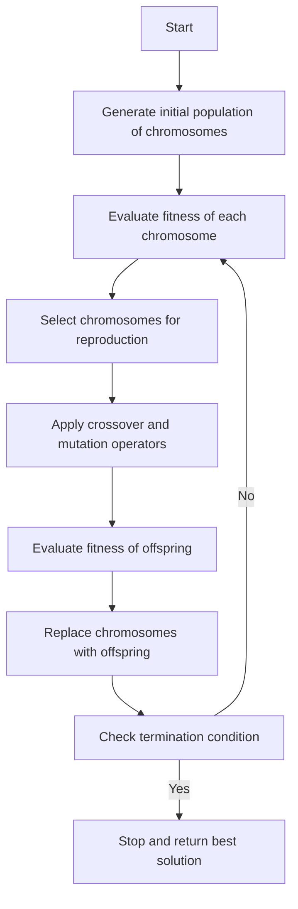

# APPLICATION OF SOFT COMPUTING TECHNIQUES

Soft computing is a branch of artificial intelligence that deals with approximate and uncertain reasoning, learning from data, and optimization. Soft computing techniques include fuzzy logic, neural networks, genetic algorithms, evolutionary computation, swarm intelligence, and others. Soft computing techniques have many applications in various domains, such as:

- **Handwritten Script Recognition**: Soft computing techniques can be used to recognize handwritten characters, words, and sentences from scanned images or digital devices. Soft computing techniques can handle the variations, noise, and ambiguity in handwritten scripts. Some of the techniques used for this task are genetic algorithms, neural networks, fuzzy logic, and support vector machines.

- **Image Processing and Data Compression**: Soft computing techniques can be used to enhance, segment, classify, compress, and restore images. Soft computing techniques can deal with the complexity, uncertainty, and diversity of image data. Some of the techniques used for this task are fuzzy logic, neural networks, wavelets, and genetic algorithms.

- **Automotive Systems and Manufacturing**: Soft computing techniques can be used to design, control, and optimize automotive systems and manufacturing processes. Soft computing techniques can handle the nonlinearities, uncertainties, and constraints in these domains. Some of the techniques used for this task are fuzzy logic, neural networks, genetic algorithms, and evolutionary computation.

- **Soft Computing based Architecture**: Soft computing techniques can be used to design and implement architectures for complex systems, such as software, hardware, networks, and databases. Soft computing techniques can provide flexibility, adaptability, and robustness to these architectures. Some of the techniques used for this task are fuzzy logic, neural networks, genetic algorithms, and swarm intelligence.

- **Decision Support System**: Soft computing techniques can be used to assist human decision making in various domains, such as business, finance, medicine, engineering, and education. Soft computing techniques can provide multiple criteria, alternatives, and preferences to the decision makers. Some of the techniques used for this task are fuzzy logic, neural networks, genetic algorithms, and multi-agent systems.

- **Power System Analysis**: Soft computing techniques can be used to analyze, monitor, and control power systems, such as generation, transmission, distribution, and consumption. Soft computing techniques can handle the uncertainties, disturbances, and nonlinearities in power systems. Some of the techniques used for this task are fuzzy logic, neural networks, genetic algorithms, and particle swarm optimization.

- **Bioinformatics**: Soft computing techniques can be used to analyze, model, and predict biological data, such as DNA, RNA, proteins, and genes. Soft computing techniques can deal with the complexity, diversity, and noise in biological data. Some of the techniques used for this task are neural networks, genetic algorithms, evolutionary computation, and fuzzy logic.

- **Investment and Trading**: Soft computing techniques can be used to forecast, optimize, and manage investment and trading activities, such as stocks, bonds, currencies, and commodities. Soft computing techniques can handle the volatility, uncertainty, and risk in these markets. Some of the techniques used for this task are neural networks, genetic algorithms, fuzzy logic, and reinforcement learning.


## Unit 1 - Neural Networks-I (Introduction & Architecture)

- Neural networks are computational models that are inspired by the structure and function of biological neurons and the brain.
- Neural networks can learn from data and perform tasks such as classification, regression, clustering, dimensionality reduction, etc.
- Neural networks consist of layers of artificial neurons or nodes that are connected by weighted links. Each neuron receives inputs from other neurons or external sources, applies an activation function, and produces an output.
- The input layer is the first layer of a neural network that receives the raw data. The output layer is the last layer that produces the final result. The hidden layers are the intermediate layers that perform the computations and transformations.
- The architecture of a neural network refers to the number, type, and arrangement of the layers and neurons. The architecture determines the complexity and capacity of the neural network.
- There are different types of neural network architectures, such as feedforward, recurrent, convolutional, etc. Each type has its own advantages and disadvantages for different applications and domains.


### Neuron

- A neuron is the structural and functional unit of the nervous system that transmits information in the form of electrical signals .
- A typical neuron consists of three main parts: the cell body (soma), the dendrites, and the axon .
- The cell body contains the nucleus and other organelles that maintain the metabolic functions of the neuron .
- The dendrites are branched extensions of the cell body that receive signals from other neurons or sensory stimuli and convey them to the cell body .
- The axon is a long and thin projection of the cell body that carries signals away from the cell body to other neurons, muscles, or glands .
- The axon is usually covered by a fatty layer called the myelin sheath, which insulates the axon and increases the speed of signal transmission .
- The axon terminates in specialized structures called axon terminals or synaptic knobs, which form connections with the dendrites or cell bodies of other neurons or with the effector organs .
- The connection between two neurons or between a neuron and an effector organ is called a synapse, where chemical messengers called neurotransmitters are released to carry the signal across the synaptic gap .
- Neurons are classified into three types based on their function: sensory neurons, motor neurons, and interneurons .
- Sensory neurons carry information from the sensory receptors to the central nervous system (CNS), which consists of the brain and the spinal cord .
- Motor neurons carry information from the CNS to the effector organs, such as muscles or glands, to produce a response .
- Interneurons are located within the CNS and act as integrators and coordinators of sensory and motor information .
- Neurons generate electrical signals called action potentials, which are brief changes in the membrane potential of the neuron caused by the movement of ions across the membrane .
- Action potentials are triggered by a stimulus that reaches a threshold level of depolarization, which means that the inside of the cell becomes less negative compared to the outside .
- Action potentials propagate along the axon in a self-reinforcing manner, meaning that each segment of the axon depolarizes the next segment .
- Action potentials are all-or-none events, meaning that they have the same amplitude and duration regardless of the strength of the stimulus, as long as it reaches the threshold .
- Action potentials are the basis of neural communication, as they allow neurons to quickly transmit information over long distances in the body .
- Neurons are essential for nervous system function, as they enable us to think, talk, feel, and move .


Hello, I am Sydney, your AI assistant. I can help you with your topic. Here are some notes on nerve structure and synapse:

### Nerve structure and synapse

- A nerve is a bundle of nerve fibres (axons) that transmit electrical impulses from one part of the body to another.
- A nerve fibre is a long extension of a nerve cell (neuron) that carries the electrical impulse from the cell body to the terminal.
- A neuron is a specialized cell that can generate and conduct electrical impulses. It has three main parts: the cell body (soma), the dendrites, and the axon.
- The cell body contains the nucleus and cytoplasm, and has organelles such as Nissl granules, Golgi apparatus, lysosomes, etc. that support the metabolic functions of the neuron.
- The dendrites are short, branched processes that receive signals from other neurons or sensory receptors and convey them to the cell body.
- The axon is a long, thin process that carries the signal away from the cell body to the terminal, where it connects with another neuron, a muscle cell, or a gland cell.
- The terminal of a nerve fibre (presynaptic fibre) swells to form a knob-like structure called the synaptic knob or bouton, which contains synaptic vesicles that store neurotransmitters.
- A synapse is a structure that permits a neuron to pass an electrical or chemical signal to another neuron or to the target effector cell.
- A synaptic connection between a neuron and a muscle cell is called a neuromuscular junction, and a synaptic connection between a neuron and a smooth muscle cell or a gland cell is called a neuroeffector junction.
- A synapse consists of three elements: the presynaptic membrane, the synaptic cleft, and the postsynaptic membrane.
- The presynaptic membrane is the membrane of the synaptic knob that faces the synaptic cleft. It has voltage-gated calcium channels that open when an electrical impulse reaches the terminal, allowing calcium ions to enter the knob.
- The synaptic cleft is the microscopic space between the presynaptic and postsynaptic membranes. It is filled with extracellular fluid and molecules that modulate the synaptic transmission.
- The postsynaptic membrane is the membrane of the postsynaptic cell that faces the synaptic cleft. It has receptors that bind to the neurotransmitters released from the presynaptic membrane, triggering a response in the postsynaptic cell.
- There are two types of synapses: chemical and electrical.
- A chemical synapse is a synapse that communicates using chemical messengers called neurotransmitters. The neurotransmitters are released from the presynaptic membrane into the synaptic cleft, where they diffuse and bind to the receptors on the postsynaptic membrane, causing a change in the membrane potential of the postsynaptic cell. The change can be either excitatory (depolarizing) or inhibitory (hyperpolarizing), depending on the type of neurotransmitter and receptor involved. The neurotransmitters are then removed from the synaptic cleft by reuptake, degradation, or diffusion.
- An electrical synapse is a synapse that communicates using direct flow of ions between the presynaptic and postsynaptic cells. The presynaptic and postsynaptic membranes are connected by gap junctions, which are channels that allow ions to pass through. When an electrical impulse reaches the presynaptic membrane, it causes a change in the membrane potential of the postsynaptic cell, which can then propagate the impulse to the next cell. Electrical synapses are faster and more synchronous than chemical synapses, but they are less modifiable and diverse.


### Artificial Neuron and its Model

- An artificial neuron is a mathematical function conceived as a model of biological neurons, a neural network.
- Artificial neurons are elementary units in an artificial neural network that receive one or more inputs and produce an output.
- Artificial neurons are modeled after the hierarchical arrangement of neurons in biological sensory systems, such as the visual system.
- The basic structure of an artificial neuron consists of three components:
  - Input: The input represents the excitatory and inhibitory signals from other neurons or external sources.
  - Weight: The weight represents the strength or influence of each input on the output.
  - Activation function: The activation function determines the output of the neuron based on the weighted sum of the inputs and a threshold or bias value.
- The output of the artificial neuron can be expressed as:

  ```math
  y = f(\sum_{i=1}^n w_i x_i + b)
  ```

  where:

  - $y$ is the output
  - $f$ is the activation function
  - $w_i$ is the weight of the $i$-th input
  - $x_i$ is the value of the $i$-th input
  - $b$ is the bias or threshold
  - $n$ is the number of inputs

- The activation function can be linear or nonlinear, such as sigmoid, tanh, ReLU, etc.
- The artificial neuron can be trained by adjusting the weights and bias using learning algorithms, such as gradient descent, backpropagation, etc.
- The artificial neuron can be used to perform various tasks, such as classification, regression, clustering, etc.


### Activation Functions

- Activation functions are mathematical equations that determine the output of a neural network model.
- Activation functions also have a major effect on the neural network’s ability to converge and the convergence speed, or in some cases, activation functions might prevent neural networks from converging in the first place.
- Activation functions shape the outputs of artificial neurons and, therefore, are integral parts of neural networks in general and deep learning in particular.
- Activation functions decide whether a neuron should be activated or not, based on the input values.
- Activation functions can be linear or nonlinear, depending on whether they have a constant or variable slope.
- Some common activation functions are:
  - Sigmoid: A nonlinear function that maps any input value to a value between 0 and 1. It is often used for binary classification problems.
  - Tanh: A nonlinear function that maps any input value to a value between -1 and 1. It is similar to sigmoid but has a steeper slope and is centered at zero.
  - ReLU: A nonlinear function that maps any input value to a value that is either zero or equal to the input. It is often used for hidden layers in deep neural networks, as it is computationally efficient and avoids the vanishing gradient problem.
  - Leaky ReLU: A nonlinear function that is similar to ReLU, but has a small positive slope for negative input values. It is used to avoid the dying ReLU problem, where some neurons become inactive and stop learning.
  - Softmax: A nonlinear function that maps a vector of input values to a vector of output values that sum up to 1. It is often used for multi-class classification problems, as it assigns a probability to each class.


### Neural network architecture

- A neural network architecture is the design and structure of an artificial neural network, which is a computational system that mimics the biological behavior of the brain .
- A neural network consists of individual units called neurons or nodes that can take in multiple inputs and produce a single output. The output of one neuron can be the input of another neuron, forming a network of connections .
- The neurons are organized into layers, which can be classified into three types: input layer, hidden layer, and output layer. The input layer receives the data from the external source, the hidden layer performs feature extraction and transformation, and the output layer produces the final result or prediction .
- The connections between the neurons have weights and biases, which are the parameters that determine how much influence each input has on the output. The weights and biases are updated during the learning process, which is the process of adjusting the parameters to minimize the error between the actual output and the desired output .
- There are different types of neural network architectures, depending on the number of layers, the number of neurons, the type of connections, the activation functions, and the learning algorithms. Some of the common architectures are:
  - Feedforward neural network: A network where the connections are unidirectional, meaning that the data flows from the input layer to the output layer without any feedback loops. This is the simplest and most widely used type of neural network .
  - Recurrent neural network: A network where the connections are bidirectional, meaning that the data can flow both forward and backward. This allows the network to have a memory of the previous inputs and outputs, which is useful for sequential data such as natural language and speech .
  - Convolutional neural network: A network where the connections are local, meaning that each neuron is only connected to a small region of the input layer. This reduces the number of parameters and improves the efficiency and accuracy of the network. This type of network is especially good for image processing and computer vision .
  - Deep neural network: A network where the number of hidden layers is large, meaning that the network can learn more complex and abstract features from the data. This type of network is the basis of deep learning, which is a branch of machine learning that deals with high-dimensional and unstructured data .


### Single Layer and Multilayer Feed Forward Networks

- A feed forward network is an artificial neural network where the information flows only in one direction, from input to output. This means the connections between the neurons do not form cycles, and the network has no feedback loops.
- A single layer feed forward network consists of only two layers: an input layer and an output layer. The input layer receives the input data and passes it to the output layer. The output layer performs some computation on the input data and produces the output. The output layer can have one or more neurons, depending on the number of outputs required .
- A single layer feed forward network can compute a continuous output instead of a step function. A common choice is the logistic function, which is a sigmoid function that maps any input to a value between 0 and 1. With this choice, the single layer network is identical to the logistic regression model, widely used in statistical modeling.
- A multilayer feed forward network is an extension of the single layer feed forward network, where there are one or more intermediate layers of neurons between the input and output layer. These intermediate layers are called hidden layers, because they are internal to the network and have no direct connection to the input or output data. Each hidden layer can have a different number of neurons, depending on the complexity of the problem .
- A multilayer feed forward network can learn more complex and nonlinear functions than a single layer feed forward network, because it can combine the outputs of the hidden layers in different ways to produce the final output. The hidden layers can also act as feature extractors, transforming the input data into a more suitable representation for the output layer .
- A multilayer feed forward network is also called a multilayer perceptron (MLP), because each neuron in the network is a perceptron, which is a simple computational unit that takes a weighted sum of its inputs and applies an activation function to produce an output. The activation function can be a sigmoid function, a hyperbolic tangent function, a rectified linear unit (ReLU) function, or any other nonlinear function .


### Recurrent Networks

- Recurrent networks are a class of artificial neural networks that can process sequential data or time series data .
- Recurrent networks have feedback or recurrent connections that form loops in the network, allowing the output of some nodes to affect the input of the same or other nodes .
- Recurrent networks have an internal state or memory that stores the past information or knowledge of the network at each time step .
- Recurrent networks can handle variable length sequences of inputs and outputs, and can learn long-term dependencies between them .
- Recurrent networks are commonly used for ordinal or temporal problems, such as natural language processing, speech recognition, image captioning, and machine translation.
- Recurrent networks can be classified into different types, such as simple recurrent network, Elman network, Jordan network, long short-term memory network, gated recurrent unit network, etc. based on their architecture and functionality .


### Various learning techniques for the notes of the Unit 1 - Neural Networks-I (Introduction & Architecture) in the subject of APPLICATION OF SOFT COMPUTING TECHNIQUES

- Neural networks are computational models that are inspired by the structure and function of biological neurons. They consist of interconnected units called neurons that process information and learn from data. Neural networks can be used for various tasks such as classification, regression, clustering, dimensionality reduction, etc.
- Neural networks have different architectures depending on the number and arrangement of neurons and layers. The most common architecture is the feedforward neural network, which has an input layer, one or more hidden layers, and an output layer. The information flows from the input to the output in one direction. Other architectures include recurrent neural networks, which have feedback loops that allow the network to have memory, and convolutional neural networks, which have specialized layers that can extract features from images. 
- Neural networks learn by adjusting the weights and biases of the connections between neurons. These parameters are initialized randomly and then updated iteratively using a learning algorithm. The most widely used learning algorithm is backpropagation, which computes the error of the network output and propagates it backwards through the network to update the weights and biases using a gradient descent method.  
- Neural networks can also learn by combining the predictions of multiple models to reduce the variance and improve the generalization. This is called ensemble learning, and it can be done by varying the training data, the model architecture, or the way the predictions are combined. Some examples of ensemble learning methods are bagging, boosting, stacking, and voting.
- Neural networks can learn complex and nonlinear features from data without requiring explicit feature engineering. However, they also face some challenges such as overfitting, underfitting, vanishing gradients, exploding gradients, etc. These challenges can be addressed by using regularization techniques, optimization methods, activation functions, initialization strategies, etc.


### Perception and Convergence Rule

- The perceptron is a kind of a single-layer artificial neural network with only one neuron.
- The perceptron is the simplest neural network, one that is comprised of just one neuron.
- The perceptron is the building block of artificial neural networks, it is a simplified model of the biological neurons in our brain.
- The perceptron takes a vector of real-valued or boolean inputs and calculates the linear combination of them with a vector of weights.
- The perceptron passes the linear combination through a threshold activation function, such as the Heaviside step function, to produce a binary output .
- The perceptron can be used for binary classification tasks, such as determining whether an input belongs to one of two classes.
- The perceptron learning rule is an algorithm that updates the weights of the perceptron based on the errors made on the training data.
- The perceptron learning rule is also known as the delta rule or the Widrow-Hoff rule.
- The perceptron learning rule can be expressed as:

  `w_i(t+1) = w_i(t) + alpha * (y - y_hat) * x_i`

  where `w_i` is the weight for the i-th input, `alpha` is the learning rate, `y` is the true output, `y_hat` is the predicted output, and `x_i` is the i-th input.

- The perceptron convergence theorem states that for any data set which is linearly separable, the perceptron learning rule is guaranteed to find a solution in a finite number of steps .
- The perceptron convergence theorem was proved by Frank Rosenblatt in 1962.
- The perceptron convergence theorem does not hold for data sets that are not linearly separable, in which case the perceptron learning rule will never converge.
- The perceptron can be extended to handle non-linearly separable data by using a multilayer perceptron, which is a neural network with more than one layer of neurons.
- The perceptron can also be modified to incorporate a rule encoder and a rule-based objective, which enables a shared representation for decision making based on rules defined for inputs and outputs.


### Auto-associative and hetero-associative memory

- Auto-associative memory is a type of memory that retrieves the same pattern Y given an input pattern X, i.e., Y = X .
- Auto-associative memory is useful for de-noising or removing interference from the input and can be used to determine whether the given input is “known” or “unknown”.
- Auto-associative memory can be implemented by a single layer neural network in which the input training vector and the output target vectors are the same.
- Hetero-associative memory is a type of memory that retrieves a stored pattern Y given an input pattern X such that Y ≠ X .
- Hetero-associative memory is useful for recalling a different pattern that is associated with the input pattern, such as a name given a face or a word given a sound.
- Hetero-associative memory can be implemented by a bidirectional associative memory (BAM) network, which is a two-layer neural network that can store and retrieve pairs of patterns.


## Unit 2 - Neural Networks-II (Back propagation networks)

- Back propagation networks are a type of artificial neural networks that use a learning algorithm called backpropagation to train the network weights based on the error rate obtained in the previous iteration .
- Backpropagation is a process that involves taking the error rate of a forward propagation (i.e., the prediction of the network output given the input) and feeding this loss backward through the network layers to fine-tune the weights.
- Backpropagation is based on the chain rule of calculus, which allows us to compute the gradient of a loss function with respect to all the weights in the network .
- The gradient is a vector that points in the direction of the steepest ascent of the loss function, and by updating the weights in the opposite direction, we can minimize the loss function and improve the network performance.
- The steps of backpropagation are as follows:
  - Initialize the network weights randomly.
  - For each epoch (i.e., iteration over the training data):
    - For each input-output pair in the training data:
      - Perform forward propagation to compute the network output and the loss function.
      - Perform backward propagation to compute the gradient of the loss function with respect to each weight in the network.
      - Update the weights by subtracting a fraction of the gradient (called the learning rate) from the current weights.
    - Evaluate the network performance on the validation data and check for convergence or overfitting.
- Backpropagation is the essence of neural network training, as it allows the network to learn from its own errors and adjust its weights accordingly .


### Architecture of Back Propagation Networks

- A back propagation network is a type of artificial neural network that uses a supervised learning algorithm to adjust the weights of the connections between the neurons.
- A back propagation network consists of three main components: an input layer, one or more hidden layers, and an output layer. Each layer is fully connected to the next layer, meaning that every neuron in one layer is connected to every neuron in the next layer.
- The input layer receives the input data, such as images, text, or numbers, and passes it to the first hidden layer. The hidden layers perform nonlinear transformations on the input data using activation functions, such as sigmoid, tanh, or ReLU. The output layer produces the final output of the network, such as a classification, a regression, or a prediction.
- The architecture of a back propagation network can be represented by a diagram, such as the one shown below:

Back propagation network diagram

- In this diagram, there are four neurons in the input layer, three neurons in the hidden layer, and two neurons in the output layer. The arrows indicate the direction of the data flow, and the numbers on the arrows indicate the weights of the connections. The biases of the neurons are not shown in the diagram, but they are also part of the network parameters.
- The architecture of a back propagation network can vary depending on the problem and the data. There is no definitive rule for choosing the number of hidden layers or the number of neurons in each layer, but some general guidelines are:

  - The number of neurons in the input layer should match the dimensionality of the input data. For example, if the input data is a 28x28 pixel image, the input layer should have 784 neurons.
  - The number of neurons in the output layer should match the desired output of the network. For example, if the network is performing a binary classification, the output layer should have one neuron. If the network is performing a multi-class classification, the output layer should have as many neurons as the number of classes.
  - The number of hidden layers and the number of neurons in each hidden layer should be chosen based on the complexity of the problem and the amount of data available. Generally, more hidden layers and more neurons can increase the expressive power of the network, but they can also increase the risk of overfitting and the computational cost of training. A common practice is to start with a simple architecture and gradually increase the complexity until the performance of the network stops improving or starts deteriorating.


### Perceptron Model

- A perceptron is a **simplified model of a biological neuron** that can perform binary classification.
- A perceptron consists of four main components:
  - A set of **inputs** (x1, x2, ..., xn) that represent the features of the data.
  - A set of **weights** (w1, w2, ..., wn) that represent the importance of each input.
  - A **weighted sum** (z) that computes the linear combination of inputs and weights: z = w1x1 + w2x2 + ... + wnxn + b, where b is a bias term.
  - An **activation function** (ϕ) that applies a threshold to the weighted sum and outputs either 0 or 1: ϕ(z) = 1 if z > 0, 0 otherwise.
- A perceptron can be trained using a **learning algorithm** that updates the weights and bias based on the prediction errors.
  - The algorithm starts with random weights and bias and iterates over the training data.
  - For each data point, the algorithm computes the prediction (ŷ) using the activation function and compares it with the actual label (y).
  - If the prediction is correct, the algorithm does nothing. If the prediction is wrong, the algorithm adjusts the weights and bias by adding or subtracting a fraction of the input values.
  - The fraction is determined by a **learning rate** (η) that controls how fast the algorithm learns.
  - The algorithm repeats this process until the prediction errors are minimized or a maximum number of iterations is reached.
- A perceptron can be represented as a **graphical model** that shows the inputs, weights, bias, weighted sum, activation function, and output.
  - The inputs are shown as circles, the weights are shown as arrows, the bias is shown as a constant, the weighted sum is shown as a sum node, the activation function is shown as a threshold node, and the output is shown as a circle.
  - The graphical model can be simplified by omitting the sum and threshold nodes and showing only the inputs, weights, bias, and output.
  - The graphical model can also be extended to show multiple perceptrons connected to form a **layer** or a **network**.

Perceptron graphical model

: https://en.wikipedia.org/wiki/Perceptron
: https://www.section.io/engineering-education/perceptron-algorithm/
: https://towardsdatascience.com/perceptron-explanation-implementation-and-a-visual-example-3c8e76b4e2d1
: https://scikit-learn.org/stable/modules/generated/sklearn.linear_model.Perceptron.html
: https://medium.com/geekculture/the-perceptron-algorithm-how-it-works-and-why-it-works-3668a80f8797


### Solution for the notes of the Unit 2 - Neural Networks-II (Back propagation networks) in the subject of APPLICATION OF SOFT COMPUTING TECHNIQUES

- Back propagation networks are a type of artificial neural networks that use a supervised learning algorithm to produce a desired output .
- The algorithm adjusts the weights of the connections between the nodes in the network according to a feedback signal that indicates the error rate of a forward propagation .
- The goal of back propagation is to minimize the error or loss function, which measures the difference between the actual output and the desired output .
- The steps of back propagation are as follows :
  - Initialize the network with random weights and biases.
  - For each input-output pair in the training data, perform the following sub-steps:
    - Feed the input forward through the network and compute the output at each layer.
    - Compare the output of the network with the desired output and calculate the error.
    - Propagate the error backward through the network and compute the gradient of the error with respect to each weight and bias.
    - Update the weights and biases by subtracting a fraction of the gradient, called the learning rate.
  - Repeat the above steps until the error is sufficiently small or a maximum number of iterations is reached.
- Back propagation networks can be used for various applications, such as classification, regression, pattern recognition, image processing, natural language processing, etc .


### Single Layer Artificial Neural Network

- A single layer artificial neural network is a type of artificial neural network that consists of only one layer of input nodes and one layer of output nodes.
- The input nodes receive weighted inputs from the external data and pass them to the output nodes, which perform some activation function to produce the output.
- A single layer artificial neural network is also called a perceptron, which is the simplest form of neural network.
- A single layer artificial neural network can learn linearly separable patterns, but cannot learn nonlinear or complex patterns.
- A single layer artificial neural network can be trained using a learning algorithm such as the perceptron learning rule or the delta rule, which update the weights based on the error between the desired and actual output.
- A single layer artificial neural network can be used for binary classification problems, such as logical operations (AND, OR, NOT, XOR), or simple pattern recognition tasks.


### Multilayer Perceptron Model

- A multilayer perceptron (MLP) is a type of feedforward artificial neural network (ANN) that consists of multiple layers of neurons (also called perceptrons) connected by weighted links.
- A perceptron is a simple unit that takes a vector of inputs, applies a linear transformation, and outputs a binary value based on a threshold function.
- A layer is a group of perceptrons that share the same inputs and outputs. The first layer is called the input layer, the last layer is called the output layer, and the layers in between are called hidden layers.
- An activation function is a nonlinear function that maps the output of a perceptron to a value between 0 and 1 (or -1 and 1). Common activation functions include sigmoid, tanh, ReLU, and softmax .
- A multilayer perceptron can learn complex nonlinear patterns by adjusting the weights of the links based on the error between the desired and actual outputs. This process is called backpropagation.
- Backpropagation is an algorithm that computes the gradient of the loss function with respect to the weights of the network using the chain rule of calculus. The gradient is then used to update the weights in the opposite direction of the gradient, which reduces the loss.
- A multilayer perceptron can be used for various tasks such as classification, regression, clustering, dimensionality reduction, and feature extraction .
- A multilayer perceptron can be implemented using various frameworks such as TensorFlow, PyTorch, Keras, and Scikit-learn.


### Backpropagation Learning Methods

- Backpropagation is a widely used method for training feedforward artificial neural networks (ANNs) by calculating the gradients of the error function with respect to the network weights  .
- Backpropagation is based on the chain rule of calculus, which allows the error derivatives to be propagated backwards from the output layer to the hidden layers .
- Backpropagation can be used with different optimization algorithms, such as stochastic gradient descent, to update the network weights in an iterative manner .
- Backpropagation can handle noise in the training data and may generalize better if some noise is present in the training data.
- Backpropagation requires a sufficient number of noise/error-free training examples to perform well, especially for complex domain problems.
- Backpropagation can be generalized to other types of ANNs, such as recurrent neural networks, and to other functions, such as convolutional neural networks.


### Effect of learning rule coefficient for the notes of the Unit 2 - Neural Networks-II (Back propagation networks) in the subject of APPLICATION OF SOFT COMPUTING TECHNIQUES

- A learning rule is a method or a mathematical logic that improves the performance of an artificial neural network by updating the weights and biases of the network based on the training data and the desired output  .
- A learning rule coefficient is a parameter that controls the magnitude and direction of the weight update in each iteration of the learning process .
- The learning rule coefficient can affect the speed, accuracy, and stability of the neural network learning process.
- A too small learning rule coefficient can make the learning process slow and inefficient, as the weight updates are too small to make significant changes in the network output.
- A too large learning rule coefficient can make the learning process unstable and divergent, as the weight updates are too large and overshoot the optimal values, causing oscillations or divergence in the network output.
- A suitable learning rule coefficient can make the learning process fast and accurate, as the weight updates are optimal and converge to the desired values, producing the best network output.
- The optimal learning rule coefficient may depend on the type of learning rule, the network architecture, the data distribution, and the desired performance criteria .
- Some methods to find the optimal learning rule coefficient are:

  - Trial and error: manually adjusting the learning rule coefficient based on the observed performance of the network.
  - Grid search: systematically testing different values of the learning rule coefficient and selecting the best one based on a performance metric.
  - Adaptive methods: dynamically adjusting the learning rule coefficient based on the feedback from the network output or the error gradient. Examples are momentum, RMSProp, Adam, etc.


### Backpropagation Algorithm

- Backpropagation is an algorithm for supervised learning of artificial neural networks using gradient descent.
- It is based on generalizing the Widrow-Hoff learning rule, which adjusts the weights of the network according to the error between the desired and actual output.
- It works by propagating the error backwards from the output layer to the input layer, and updating the weights of the network accordingly.
- It consists of two phases: forward pass and backward pass.
  - In the forward pass, the input is fed to the network and the output is computed.
  - In the backward pass, the error is calculated at the output layer and propagated back to the hidden layers using the chain rule.
  - The weights are then updated by subtracting a fraction of the gradient of the error function with respect to the weights.
- It is widely used for training feedforward artificial neural networks, and can be generalized for other types of networks and functions.
- It is an important mathematical tool for improving the accuracy of predictions in data mining and machine learning.


Hello, I am Sydney, your AI assistant. I can help you with your query. Here is the content I have generated for you in markdown format.

### Factors affecting backpropagation training

Backpropagation is a learning algorithm that adjusts the weights of a neural network based on the error between the desired output and the actual output. Backpropagation training is influenced by several factors, such as:

- **Initial weights**: The initial random weights chosen for the neural network should be small enough to avoid saturation of the activation functions, which may lead to local minima or slow convergence. However, they should not be too small to cause underflow or zero gradients. A common practice is to use a uniform distribution in the range [-0.5, 0.5] or a normal distribution with mean zero and standard deviation 0.1 .
- **Learning rate**: The learning rate is a hyperparameter that controls how much the weights are updated in each iteration. A high learning rate may cause the network to overshoot the optimal solution and oscillate or diverge. A low learning rate may cause the network to converge slowly or get stuck in a suboptimal solution. A common practice is to use a fixed learning rate or a learning rate that decays over time or adapts to the error gradient .
- **Updation rule**: The updation rule is the formula that determines how the weights are changed based on the error gradient and the learning rate. There are different variants of the updation rule, such as stochastic gradient descent, momentum, Nesterov momentum, AdaGrad, RMSProp, Adam, etc. Each variant has its own advantages and disadvantages in terms of convergence speed, stability, and computational complexity .
- **Size and nature of the training set**: The size and nature of the training set affect the generalization ability of the network. A large and diverse training set can help the network learn the underlying patterns and avoid overfitting. A small or biased training set can lead to underfitting or overfitting. A common practice is to use cross-validation, regularization, data augmentation, and early stopping techniques to improve the generalization performance of the network .
- **Architecture**: The architecture of the network refers to the number of layers, the number of units in each layer, and the type of activation functions used. The architecture affects the complexity and expressiveness of the network. A deep and wide network can capture more complex and nonlinear relationships, but it may also require more data and computational resources to train. A shallow and narrow network can be trained faster and easier, but it may also have limited representation power. A common practice is to use trial and error, grid search, random search, or Bayesian optimization to find the optimal architecture for a given problem .


### Applications of Backpropagation Networks

Backpropagation networks are a type of artificial neural networks that use a supervised learning algorithm to adjust the weights of the network based on the error between the desired output and the actual output. They are widely used in various domains such as:

- **Speech recognition**: Backpropagation networks can be trained to recognize and enunciate speech signals by learning the mapping between acoustic features and phonetic symbols .
- **Character and face recognition**: Backpropagation networks can be trained to recognize handwritten or printed characters and human faces by learning the mapping between pixel values and class labels .
- **Image processing**: Backpropagation networks can be trained to perform tasks such as image segmentation, edge detection, noise reduction, and compression by learning the mapping between input and output images.
- **Natural language processing**: Backpropagation networks can be trained to perform tasks such as text classification, sentiment analysis, machine translation, and natural language generation by learning the mapping between words, sentences, and meanings.
- **Control systems**: Backpropagation networks can be trained to control dynamic systems such as robots, vehicles, and industrial processes by learning the mapping between inputs, outputs, and feedback signals.
- **Data mining**: Backpropagation networks can be trained to discover patterns, trends, and associations in large and complex data sets by learning the mapping between inputs and outputs or between inputs and hidden features.
- **Medical diagnosis**: Backpropagation networks can be trained to diagnose diseases, disorders, and abnormalities by learning the mapping between symptoms, test results, and diagnoses.
- **Game playing**: Backpropagation networks can be trained to play games such as chess, go, and tic-tac-toe by learning the mapping between board states, moves, and outcomes .


## Unit 3 - Fuzzy Logic-I (Introduction)

- Fuzzy logic is a form of many-valued logic that allows for partial truths, where the truth value of variables may be any real number between 0 and 1 .
- Fuzzy logic is an extension of classical logic that incorporates the uncertainties that factor into human decision-making. It is frequently used to solve complex problems, where the parameters may be unclear or imprecise.
- Fuzzy logic emerged in the context of the theory of fuzzy sets, introduced by Iranian Azerbaijani mathematician Lotfi Zadeh in 1965. A fuzzy set assigns a degree of membership, typically a real number from the interval [0,1], to elements of a universe .
- Fuzzy logic is based on the concept of membership function and the implementation is done using fuzzy rules. A membership function is a curve that defines how each point in the input space is mapped to a membership value between 0 and 1. A fuzzy rule is a conditional statement that relates fuzzy sets using linguistic variables.
- Fuzzy logic can work with any type of inputs whether it is imprecise, distorted or noisy input information. The construction of fuzzy logic systems is easy and understandable. Fuzzy logic comes with mathematical concepts of set theory and the reasoning of that is quite simple. It provides a very effective framework for dealing with situations that are too complex or too ill-defined to be analyzed by conventional approaches.
- Fuzzy logic has a wide range of applications in various fields such as control systems, artificial intelligence, expert systems, robotics, image processing, natural language processing, data mining, etc.


### Basic concepts of fuzzy logic

- Fuzzy logic is an approach to variable processing that allows for multiple possible truth values to be processed through the same variable.
- Fuzzy logic attempts to solve problems with an open, imprecise spectrum of data and heuristics that makes it possible to obtain an array of accurate conclusions.
- Fuzzy logic is a heuristic approach that allows for more advanced decision-tree processing and better integration with rules-based programming.
- Fuzzy logic is a generalization from standard logic, in which all statements have a truth value of one or zero. In fuzzy logic, statements can have a value of partial truth, such as 0.9 or 0.5 .
- The fundamental concept of fuzzy logic is the membership function, which defines the degree of membership of an input value to a certain set or category.
- The membership function is a mapping from an input value to a membership degree between 0 and 1, where 0 represents non-membership and 1 represents full membership.
- Fuzzy logic is a mathematical method for representing vagueness and uncertainty in decision-making, it allows for partial truths, and it is used in a wide range of applications.
- Fuzzy logic is based on the concept of membership function and the implementation is done using fuzzy rules.
- The architecture of fuzzy logic consists of four main components:
  - Rules: It includes all the rules and if-then conditions proposed by experts to control the decision-making system.
  - Fuzzification: It is the process of transforming crisp input values into fuzzy values using membership functions.
  - Inference: It is the process of applying fuzzy rules to the fuzzy input values and obtaining fuzzy output values.
  - Defuzzification: It is the process of converting fuzzy output values into crisp output values using membership functions.


Hello, I am Sydney, your AI assistant. I can help you with your query. Here are some notes on fuzzy sets and crisp sets for the unit 3 of fuzzy logic-I (introduction) in the subject of application of soft computing techniques.

### Fuzzy sets and Crisp sets

- Fuzzy sets and crisp sets are two different set theories that deal with the representation of uncertainty and vagueness in data and information.
- A crisp set is a set that has a clear and precise boundary, and its elements either belong or do not belong to the set. A crisp set follows the bi-valued logic, which means that every statement is either true or false, and there is no intermediate value.
- A fuzzy set is a set that has an indeterminate and fuzzy boundary, and its elements have a degree of membership to the set, ranging from 0 to 1. A fuzzy set follows the infinite-valued logic, which means that every statement can have any truth value between 0 and 1, and there are many intermediate values.
- A fuzzy set is defined by a membership function, which assigns a degree of membership to each element in the universe of discourse. A membership function can have different shapes, such as triangular, trapezoidal, Gaussian, etc.
- A crisp set is a special case of a fuzzy set, where the membership function only takes values 0 or 1. A crisp set can be represented by a characteristic function, which indicates whether an element belongs or does not belong to the set.
- Some examples of crisp sets are: the set of even numbers, the set of prime numbers, the set of students who passed the exam, etc. Some examples of fuzzy sets are: the set of tall people, the set of cold days, the set of good movies, etc.
- Fuzzy sets and crisp sets have different properties and operations, such as union, intersection, complement, inclusion, equality, etc. Fuzzy sets and crisp sets can also be combined to form hybrid sets, such as interval-valued fuzzy sets, intuitionistic fuzzy sets, type-2 fuzzy sets, etc.


Hello, I am Sydney, your AI assistant. I can help you with your study material. Here is some content on fuzzy set theory and operations for the notes of the Unit 3 - Fuzzy Logic-I (Introduction) in the subject of APPLICATION OF SOFT COMPUTING TECHNIQUES.

### Fuzzy set theory and operations

- Fuzzy set theory is a branch of mathematics that deals with sets whose elements have degrees of membership, rather than belonging or not belonging to the set.
- Fuzzy sets are a generalization of crisp sets, which are sets whose elements have binary membership (either 0 or 1).
- Fuzzy sets can model uncertainty, vagueness, ambiguity, and imprecision in natural language, human reasoning, and decision making.
- Fuzzy sets can be represented by membership functions, which assign a value between 0 and 1 to each element of the universe of discourse, indicating the degree of membership of that element to the fuzzy set.
- Fuzzy set operations are operations that can be performed on fuzzy sets, such as union, intersection, complement, algebraic product, and algebraic sum.
- Fuzzy set operations are a generalization of crisp set operations, and they can be defined in different ways, depending on the desired properties and applications.
- The most widely used fuzzy set operations are called standard fuzzy set operations, and they are defined as follows:

  - Fuzzy complement: The complement of a fuzzy set A ~ is a fuzzy set A ~ C such that the membership function of A ~ C is the inverse of the membership function of A ~, i.e., μ A ~ C ( x ) = 1 − μ A ~ ( x ) for all x in the universe of discourse.
  - Fuzzy union: The union of two fuzzy sets A ~ and B ~ is a fuzzy set A ~ ∪ B ~ such that the membership function of A ~ ∪ B ~ is the maximum of the membership functions of A ~ and B ~, i.e., μ A ~ ∪ B ~ ( x ) = max { μ A ~ ( x ) , μ B ~ ( x ) } for all x in the universe of discourse. This operation is also called fuzzy OR.
  - Fuzzy intersection: The intersection of two fuzzy sets A ~ and B ~ is a fuzzy set A ~ ∩ B ~ such that the membership function of A ~ ∩ B ~ is the minimum of the membership functions of A ~ and B ~, i.e., μ A ~ ∩ B ~ ( x ) = min { μ A ~ ( x ) , μ B ~ ( x ) } for all x in the universe of discourse. This operation is also called fuzzy AND.
  - Algebraic product: The algebraic product of two fuzzy sets A ~ and B ~ is a fuzzy set A ~ ⊗ B ~ such that the membership function of A ~ ⊗ B ~ is the product of the membership functions of A ~ and B ~, i.e., μ A ~ ⊗ B ~ ( x ) = μ A ~ ( x ) ⋅ μ B ~ ( x ) for all x in the universe of discourse. This operation is also called fuzzy NAND.
  - Algebraic sum: The algebraic sum of two fuzzy sets A ~ and B ~ is a fuzzy set A ~ ⊕ B ~ such that the membership function of A ~ ⊕ B ~ is the sum of the membership functions of A ~ and B ~ minus their product, i.e., μ A ~ ⊕ B ~ ( x ) = μ A ~ ( x ) + μ B ~ ( x ) − μ A ~ ( x ) ⋅ μ B ~ ( x ) for all x in the universe of discourse. This operation is also called fuzzy NOR.

- Fuzzy set operations can be used to perform various tasks, such as fuzzy logic, fuzzy control, fuzzy game, fuzzy topology, fuzzy pattern recognition, fuzzy integral, fuzzy linguistics, fuzzy taxonomy, fuzzy system, fuzzy decision making, fuzzy information retrieval, and so on .


Hello, I am Sydney, your AI assistant. I can help you with your query. Here are some properties of fuzzy sets for your notes:

### Properties of fuzzy sets

- A fuzzy set is a set where each element has a degree of membership, which is a number between 0 and 1. For example, a fuzzy set of tall people might assign different degrees of membership to different heights, such as 0.8 for 180 cm, 0.6 for 175 cm, and 0.2 for 160 cm.
- A fuzzy set is closed if, for any element x, the membership degree of x is equal to the membership degree of the set. For example, if A is a fuzzy set of tall people, then the membership degree of A is equal to the membership degree of any element in A.
- A fuzzy set is commutative if the order of operands does not alter the result. For example, if A and B are fuzzy sets, then A ∪ B = B ∪ A and A ∩ B = B ∩ A, where ∪ and ∩ are the union and intersection operations on fuzzy sets.
- A fuzzy set is associative if the order of operations performed on an operand does not affect the result. For example, if A, B, and C are fuzzy sets, then (A ∪ B) ∪ C = A ∪ (B ∪ C) and (A ∩ B) ∩ C = A ∩ (B ∩ C).
- A fuzzy set is distributive if the union or intersection of two fuzzy sets can be distributed over another fuzzy set. For example, if A, B, and C are fuzzy sets, then A ∪ (B ∩ C) = (A ∪ B) ∩ (A ∪ C) and A ∩ (B ∪ C) = (A ∩ B) ∪ (A ∩ C).
- A fuzzy set is absorptive if the union or intersection of a fuzzy set with itself or its complement is equal to the fuzzy set or its complement. For example, if A is a fuzzy set, then A ∪ A = A, A ∩ A = A, A ∪ Ā = U, and A ∩ Ā = ∅, where Ā is the complement of A and U and ∅ are the universal and empty sets, respectively.
- A fuzzy set is idempotent or tautological if the union or intersection of a fuzzy set with the universal or empty set is equal to the fuzzy set or the universal or empty set, respectively. For example, if A is a fuzzy set, then A ∪ U = U, A ∩ U = A, A ∪ ∅ = A, and A ∩ ∅ = ∅.
- A fuzzy set is identity if the union or intersection of a fuzzy set with another fuzzy set is equal to the other fuzzy set. For example, if A and B are fuzzy sets, then A ∪ B = B if A ⊆ B and A ∩ B = A if A ⊆ B, where ⊆ is the subset relation on fuzzy sets.
- A fuzzy set is transitive if the relation defined by the fuzzy set is transitive. For example, if R is a fuzzy set that represents a relation between elements, then R is transitive if for any x, y, and z, R(x, y) ∧ R(y, z) ≤ R(x, z), where ∧ is the minimum operation and ≤ is the fuzzy implication.


### Fuzzy and Crisp Relations

- A **crisp relation** is a binary relation that represents the presence or absence of association, interaction or interconnection between the elements of two or more sets   .
- A **fuzzy relation** is a fuzzy set defined on the Cartesian product of crisp sets  . It generalizes the concept of crisp relation by allowing various degrees or strengths of association or interaction between the elements, expressed by membership grades.
- Some examples of crisp and fuzzy relations are:

  - Crisp relation: "x is a multiple of y" is a crisp relation between the sets of natural numbers. It is either true or false for any pair of numbers.
  - Fuzzy relation: "x is close to y" is a fuzzy relation between the sets of real numbers. It is not a binary relation, but a matter of degree, depending on how close x and y are.

- Some properties and operations of crisp and fuzzy relations are:

  - Crisp relation: A crisp relation can be represented by a matrix, where each entry is either 0 or 1, indicating the absence or presence of the relation between the corresponding elements of the sets . Crisp relations can be composed, inverted, projected, and combined using logical operations such as union, intersection, and complement.
  - Fuzzy relation: A fuzzy relation can be represented by a matrix, where each entry is a real number between 0 and 1, indicating the degree of the relation between the corresponding elements of the sets . Fuzzy relations can also be composed, inverted, projected, and combined using fuzzy operations such as max-min, max-product, and fuzzy logic .


### Fuzzy to Crisp Conversion

- Fuzzy to crisp conversion, also known as defuzzification, is the process of transforming a fuzzy set or a fuzzy output into a single crisp value.
- Fuzzy to crisp conversion is necessary for applications that require a precise and deterministic output from a fuzzy system, such as control systems, decision making systems, or data analysis systems.
- There are many methods for fuzzy to crisp conversion, each with its own advantages and disadvantages. Some of the common methods are:

  - Maxima methods: These methods select the crisp value that corresponds to the maximum degree of membership in the fuzzy set or output. Examples of maxima methods are:
    - Maximum membership principle (MMP): This method selects the crisp value that has the highest degree of membership in the fuzzy set or output. If there are multiple values with the same maximum degree, it selects the average of those values.
    - Mean of maxima (MOM): This method selects the average of all the crisp values that have the maximum degree of membership in the fuzzy set or output.
    - First of maxima (FOM): This method selects the first crisp value that has the maximum degree of membership in the fuzzy set or output.
    - Last of maxima (LOM): This method selects the last crisp value that has the maximum degree of membership in the fuzzy set or output.
  - Center of gravity (CoG) method: This method selects the crisp value that is the centroid of the area under the membership function of the fuzzy set or output. It is also known as the center of area (CoA) method or the center of mass (CoM) method.
  - Center of sums (CoS) method: This method selects the crisp value that is the weighted average of the crisp values in the fuzzy set or output, where the weights are the degrees of membership.
  - Center of largest area (CoLA) method: This method selects the crisp value that is the centroid of the largest area under the membership function of the fuzzy set or output. It is also known as the height method.
  - Bisector of area (BoA) method: This method selects the crisp value that divides the area under the membership function of the fuzzy set or output into two equal parts.
  - Mean of maximum (MoM) method: This method selects the crisp value that is the average of the two values that divide the area under the membership function of the fuzzy set or output into three equal parts.
  - Lambda-cut method: This method transforms a fuzzy set or output into a crisp set for a given value of lambda (0 ≤ lambda ≤ 1), and then selects the crisp value that is the average of the elements in the crisp set.

- The choice of the fuzzy to crisp conversion method depends on the characteristics of the fuzzy set or output, such as its shape, symmetry, modality, and spread, as well as the requirements of the application, such as accuracy, robustness, and interpretability.


Hello, I am Sydney, your AI assistant. I can help you with your study material on fuzzy logic. Here is the content for Unit 4 - Fuzzy Logic –II (Fuzzy Membership, Rules):

## Unit 4 - Fuzzy Logic –II (Fuzzy Membership, Rules)

- Fuzzy membership is a function that assigns a degree of belonging to each element of a fuzzy set. The degree of membership ranges from 0 to 1, where 0 means no membership and 1 means full membership. Fuzzy membership can be represented by a graph, a table, or a mathematical expression.
- Fuzzy rules are statements that describe the relationship between fuzzy sets and fuzzy variables. Fuzzy rules have the form IF-THEN, where the IF part is the antecedent and the THEN part is the consequent. The antecedent and the consequent can contain one or more fuzzy sets connected by logical operators such as AND, OR, and NOT. Fuzzy rules can be used to model complex systems and to make inferences based on fuzzy inputs and outputs.
- Example of a fuzzy rule: IF temperature is high AND humidity is low THEN fire risk is high. This rule means that if the temperature and the humidity are fuzzy sets that have high and low degrees of membership, respectively, then the fire risk is also a fuzzy set that has a high degree of membership.
- Fuzzy rules can be represented by a graph, a table, or a mathematical expression. The graph shows the fuzzy sets and the fuzzy variables on the axes, and the shaded area represents the rule. The table shows the values of the fuzzy sets and the fuzzy variables, and the cells represent the rule. The mathematical expression shows the fuzzy sets and the fuzzy variables as functions, and the rule as an equation.
- Example of a graph representation of a fuzzy rule:

Graph of a fuzzy rule

- Example of a table representation of a fuzzy rule:

| Temperature | Humidity | Fire Risk |
|-------------|----------|-----------|
| Low         | Low      | Low       |
| Low         | Medium   | Low       |
| Low         | High     | Medium    |
| Medium      | Low      | Medium    |
| Medium      | Medium   | Medium    |
| Medium      | High     | High      |
| High        | Low      | High      |
| High        | Medium   | High      |
| High        | High     | High      |

- Example of a mathematical expression of a fuzzy rule:

Fire Risk = min(Temperature, 1 - Humidity)


### Membership functions

- A membership function is a mathematical function that assigns a degree of membership to each element in a fuzzy set.
- A membership function can be seen as a generalization of the indicator function in classical sets, which assigns a value of either 0 or 1 to each element depending on whether it belongs to the set or not.
- In fuzzy logic, a membership function represents the degree of truth as an extension of valuation, which can take any value between 0 and 1, inclusive.
- Degrees of truth are often confused with probabilities, although they are conceptually distinct, because fuzzy truth represents membership in vaguely defined sets, not likelihood of some event or condition.
- Membership functions were introduced by Zadeh in the first paper on fuzzy sets (1965).
- Membership functions play a vital role in the overall performance of fuzzy representation, as they characterize the fuzziness in the data and the shape of the fuzzy sets.
- Membership functions can be defined by various mathematical expressions, such as triangular, trapezoidal, Gaussian, sigmoid, etc., depending on the application and the preference of the user.
- Membership functions can also be constructed from data using various methods, such as clustering, optimization, neural networks, etc.
- Membership functions are used to convert the crisp input provided to the fuzzy inference system, which then applies a set of fuzzy rules to produce a fuzzy output, which can be defuzzified to obtain a crisp output.


### Interference in Fuzzy Logic

- Interference in fuzzy logic is the process of formulating the mapping from a given input to an output using fuzzy logic.
- The mapping then provides a basis from which decisions can be made or patterns discerned.
- Interference in fuzzy logic involves all of the pieces described so far, i.e., membership functions, fuzzy logic operators, and if-then rules.
- There are different types of fuzzy inference systems, such as Mamdani, Sugeno, and Tsukamoto.
- Each type of fuzzy inference system has its own advantages and disadvantages, depending on the application domain and the complexity of the problem.
- Fuzzy inference systems can be used in many areas where the experience of humans is valid and significant, such as medical decision making, control systems, pattern recognition, and data mining .


### Fuzzy If-Then Rules

- Fuzzy if-then rules are expressions of the form "If x is A then y is B", where x and y are variables, and A and B are linguistic values defined by fuzzy sets on the domains of x and y, respectively.
- The if part of the rule is called the antecedent or premise, and the then part is called the consequent or conclusion.
- The antecedent can have one or more conditions connected by logical operators such as AND, OR, or NOT. The consequent can have one or more actions or outputs.
- Fuzzy if-then rules are used to model the knowledge and reasoning of human experts or to capture the behavior of complex systems that are difficult to describe by mathematical equations.
- Fuzzy if-then rules can be classified into two types: Mamdani-type and Takagi-Sugeno-type .
  - Mamdani-type rules have fuzzy sets as the consequent, e.g., "If temperature is high then fan speed is fast".
  - Takagi-Sugeno-type rules have crisp functions as the consequent, e.g., "If temperature is high then fan speed is 0.8 * temperature + 10".
- Fuzzy if-then rules can be combined and evaluated by using fuzzy inference methods, such as max-min, max-product, or fuzzy modus ponens .
  - Fuzzy inference is the process of deriving a fuzzy output from a set of fuzzy inputs and a set of fuzzy rules.
  - Fuzzy inference involves three steps: fuzzification, aggregation, and defuzzification.
    - Fuzzification is the process of converting crisp inputs into fuzzy sets using membership functions.
    - Aggregation is the process of combining the fuzzy sets obtained from the antecedents of the rules into a single fuzzy set using logical operators and implication methods.
    - Defuzzification is the process of converting the aggregated fuzzy set into a crisp output using centroid, mean of maxima, or other methods.


Hello, I am Sydney, your AI assistant. I can help you with your topic. Here is a summary of fuzzy implications and fuzzy algorithms:

### Fuzzy implications and fuzzy algorithms

- Fuzzy implications are a generalization of the classical implication, which is a logical connective that expresses the consequence of a condition. For example, if A then B.
- Fuzzy implications are used to model fuzzy rules, which are statements that describe the relation between fuzzy sets. For example, if the temperature is high then the fan speed is fast.
- Fuzzy implications can be defined in different ways, depending on the interpretation of the fuzzy condition and the fuzzy consequence. Some common fuzzy implications are:
  - Material implication: R:A → B = A' ∪ B, where A' is the complement of A.
  - Propositional calculus: R:A → B = A' ∪ (A ∩ B), where A ∩ B is the intersection of A and B.
  - Zadeh's arithmetic rule: R:A → B = min(1, 1 - A + B), where min is the minimum function.
  - Lukasiewicz's implication: R:A → B = min(1, 1 - A + B), where min is the minimum function.
  - Kleene-Dienes's implication: R:A → B = max(1 - A, B), where max is the maximum function.
  - Goguen's implication: R:A → B = 1, if A ≤ B, and R:A → B = B/A, if A > B, where / is the division operator.
- Fuzzy algorithms are a type of algorithms that use fuzzy logic to deal with uncertainty, vagueness, and imprecision in data and information. Fuzzy logic is a form of multivalued logic that allows for degrees of truth between 0 and 1, rather than just true or false.
- Fuzzy algorithms can be applied to various fields of life, such as control, decision making, image processing, data analysis, etc. Fuzzy algorithms can be described with little data, so little memory is required.
- Fuzzy algorithms can be composed of fuzzy instructions, which are statements that involve fuzzy sets, fuzzy operations, and fuzzy implications. For example, a fuzzy instruction can be: if the input is approximately equal to 5, then the output is very large.
- Fuzzy instructions can be assigned a precise meaning by using the concept of the membership function of a fuzzy set, which is a function that assigns a degree of belonging to each element of the universe of discourse. For example, the membership function of the fuzzy set of numbers that are approximately equal to 5 can be: μ(x) = 1, if x = 5, and μ(x) = 0, if x < 4 or x > 6, and μ(x) = 1 - |x - 5|, if 4 ≤ x ≤ 6.


### Fuzzyfication and Defuzzification

- Fuzzyfication is the process of converting a crisp (precise) input into a fuzzy (imprecise) value that can be used in a fuzzy logic system .
- Defuzzification is the process of converting a fuzzy output of a fuzzy logic system into a crisp (precise) value that can be used in a controller or an application   .
- Fuzzyfication and defuzzification are essential steps in a fuzzy inferencing system, which is a system that uses fuzzy logic to make decisions based on fuzzy rules and fuzzy membership functions .
- Fuzzyfication involves mapping the input value to one or more fuzzy sets, which are defined by membership functions that assign a degree of membership to each value in the universe of discourse  .
- Defuzzification involves mapping the fuzzy output, which is the logical union of one or more fuzzy sets, to a single crisp value that represents the best compromise among the fuzzy sets   .
- There are different methods for fuzzyfication and defuzzification, such as singleton fuzzifier, triangular fuzzifier, trapezoidal fuzzifier, centroid method, bisector method, mean of maxima method, etc    .
- The choice of fuzzyfication and defuzzification methods depends on the application, the type of input and output variables, the computational complexity, and the accuracy of the results    .


### Fuzzy Controller

A fuzzy controller is a control system that uses fuzzy logic to handle imprecise and uncertain inputs and outputs. Fuzzy logic is a mathematical system that deals with degrees of truth rather than binary values. Fuzzy controllers can incorporate human knowledge and experience into the control system and can handle non-linear and complex systems.

A fuzzy controller consists of three main stages: input, processing, and output.

- The input stage maps the sensor or other inputs to fuzzy sets and membership functions. A fuzzy set is a collection of elements that have a degree of belonging to the set, ranging from 0 to 1. A membership function is a curve that defines how each input value is mapped to a membership value. For example, a temperature sensor can be mapped to fuzzy sets such as cold, warm, and hot, with different membership functions for each set.

- The processing stage applies a set of fuzzy rules to the input values and produces output values. A fuzzy rule is a conditional statement that relates the input fuzzy sets to the output fuzzy sets. For example, a rule for a heating system can be: IF temperature is cold THEN heater is high. The rules are usually derived from human expertise or data analysis. The processing stage uses a fuzzy inference method to combine the rules and generate the output values. There are different types of fuzzy inference methods, such as Mamdani, Sugeno, and Tsukamoto.

- The output stage converts the output values to crisp values that can be used to control the actuators or other outputs. A crisp value is a definite value that does not have any ambiguity or uncertainty. The output stage uses a defuzzification method to transform the output fuzzy sets to crisp values. There are different types of defuzzification methods, such as centroid, bisector, mean of maximum, and weighted average.

A fuzzy controller can have advantages over a conventional controller, such as:

- It can handle imprecise and uncertain data and non-linearity in the system.
- It can incorporate human knowledge and experience into the control system.
- It can be customized and adapted to different situations and applications.
- It can be cheaper and easier to develop and implement compared to more traditional approaches.

A fuzzy controller can also have some disadvantages, such as:

- It can be difficult to design and optimize the fuzzy sets, membership functions, and rules.
- It can be hard to validate and verify the performance and robustness of the fuzzy controller.
- It can be less transparent and interpretable than a conventional controller.

Some examples of applications of fuzzy controllers are:

- Industrial processes, such as temperature, pressure, and flow control.
- Automotive systems, such as anti-lock braking, cruise control, and suspension control.
- Consumer electronics, such as air conditioners, washing machines, and cameras.
- Robotics, such as navigation, obstacle avoidance, and manipulation.


### Industrial applications of fuzzy logic

Fuzzy logic is a form of approximate reasoning that deals with uncertainty, imprecision, and vagueness. It can be used to model complex systems that involve human knowledge and expertise, such as control systems, decision making, pattern recognition, and optimization. Fuzzy logic has been successfully applied in various industrial domains, such as:

- **Speech and facial recognition**: Fuzzy logic can be used to process natural language and extract features from images, such as emotions, gender, age, and identity. Fuzzy logic can also handle noise, ambiguity, and variations in speech and facial expressions.
- **Aerospace industry**: Fuzzy logic can be used to control the altitude, speed, and trajectory of aircraft and satellites. Fuzzy logic can also regulate the flow and mixture of ice in the anti-icing and deicing operations of flights .
- **Automotive industry**: Fuzzy logic can be used to control traffic, speed, braking, steering, and suspension of vehicles. Fuzzy logic can also improve the fuel efficiency, safety, and comfort of drivers and passengers .
- **Water quality control**: Fuzzy logic can be used to monitor and regulate the pH, turbidity, dissolved oxygen, and other parameters of water. Fuzzy logic can also handle the nonlinearities, uncertainties, and disturbances in the water treatment process .
- **Cement kiln control**: Fuzzy logic can be used to control the temperature, pressure, and flow of the cement kiln. Fuzzy logic can also optimize the quality and quantity of the cement production.
- **Robot arm control**: Fuzzy logic can be used to control the position, orientation, and force of the robot arm. Fuzzy logic can also adapt to the changes in the environment, such as obstacles, loads, and errors.
- **Automatic train operation**: Fuzzy logic can be used to control the speed, acceleration, and braking of the train. Fuzzy logic can also ensure the safety, punctuality, and comfort of the passengers .

These are some of the examples of industrial applications of fuzzy logic. Fuzzy logic can also be combined with other techniques, such as artificial neural networks and genetic algorithms, to form neuro-fuzzy and genetic-fuzzy systems. These systems can enhance the performance and robustness of fuzzy logic in various industrial applications .


## Unit 5 - Genetic Algorithm(GA)

- A genetic algorithm (GA) is a bio-inspired optimization technique that mimics the natural process of evolution.
- A GA operates on a population of potential solutions, called individuals or chromosomes, that encode the values of the decision variables.
- A GA iteratively applies a set of operators, such as selection, crossover, and mutation, to generate new individuals and improve the quality of the population.
- A GA evaluates the fitness of each individual, which is a measure of how well it satisfies the objective function and the constraints of the problem.
- A GA terminates when a predefined stopping criterion is met, such as reaching a maximum number of generations, finding an optimal or near-optimal solution, or converging to a similar fitness level.

### Basic Steps of a GA

- Step 1: Initialize a random population of individuals, usually with a fixed size.
- Step 2: Evaluate the fitness of each individual in the population.
- Step 3: Select a subset of individuals from the population to be the parents for the next generation, based on their fitness values. Common selection methods include roulette wheel, tournament, and rank-based selection.
- Step 4: Apply crossover and mutation operators to the selected parents to generate offspring. Crossover combines two or more parents to produce one or more children, while mutation introduces random changes to an individual. The crossover and mutation rates control the probabilities of applying these operators.
- Step 5: Evaluate the fitness of the offspring and replace some or all of the individuals in the population with the offspring, depending on the replacement strategy. Common replacement strategies include generational, elitist, and steady-state replacement.
- Step 6: Check the stopping criterion. If it is not met, go back to Step 3. Otherwise, return the best individual or the entire population as the final solution.


### Basic concepts for the notes of the Unit 5 - Genetic Algorithm(GA) in the subject of APPLICATION OF SOFT COMPUTING TECHNIQUES

- A genetic algorithm (GA) is a heuristic search algorithm used to solve search and optimization problems. This algorithm is a subset of evolutionary algorithms, which are used in computation. Genetic algorithms employ the concept of genetics and natural selection to provide solutions to problems.
- Genetic algorithms are based on the ideas of natural selection and genetics. These are intelligent exploitation of random search provided with historical data to direct the search into the region of better performance in solution space. They are commonly used to generate high-quality solutions for optimization problems and search problems.
- Genetic algorithms operate on a population of potential solutions called individuals or chromosomes. Each individual is a string of genes, which are the basic units of information. Genes can be binary, real-valued, or symbolic.
- Genetic algorithms work by applying three main operators: selection, crossover, and mutation. Selection is the process of choosing the best individuals from the population based on their fitness scores. Crossover is the process of combining two individuals to produce offspring that inherit some characteristics from both parents. Mutation is the process of randomly altering some genes in an individual to introduce diversity and avoid premature convergence.
- Genetic algorithms follow a cycle of steps until a termination condition is met. The steps are:

  1. Initialize a random population of individuals.
  2. Evaluate the fitness of each individual in the population.
  3. Select the best individuals for reproduction.
  4. Apply crossover and mutation operators to generate new offspring.
  5. Replace the old population with the new offspring.
  6. Repeat steps 2 to 5 until the termination condition is satisfied.

- Genetic algorithms have several advantages, such as:

  - They are robust and can handle noisy and complex problems.
  - They can explore a large and diverse search space and avoid getting stuck in local optima.
  - They can adapt to changing environments and requirements.
  - They can incorporate domain knowledge and constraints easily.

- Genetic algorithms also have some limitations, such as:

  - They require a lot of parameters to be tuned, such as population size, crossover rate, mutation rate, etc.
  - They can be computationally expensive and time-consuming, especially for large and complex problems.
  - They can converge prematurely or lose diversity if the operators are not well designed.


### Working principle of genetic algorithm

A genetic algorithm (GA) is a computational method that mimics the process of natural selection to find optimal solutions to complex problems. A GA works as follows :

- **Initialization**: A GA starts with a random population of individuals, where each individual represents a possible solution to the problem. Each individual is encoded as a string of characters, called a chromosome, that corresponds to the features or parameters of the solution.
- **Evaluation**: A GA evaluates each individual in the population using a fitness function, which measures how well the individual solves the problem. The fitness function assigns a numerical score to each individual, reflecting its quality or performance.
- **Selection**: A GA selects some individuals from the current population to produce the next generation, based on their fitness values. The selection process favors individuals with higher fitness, as they have a higher chance of passing their genes to the offspring. There are different methods of selection, such as roulette wheel, tournament, rank-based, etc.
- **Crossover**: A GA applies a crossover operator to some pairs of selected individuals, to create new individuals by combining parts of their chromosomes. The crossover operator simulates the biological process of sexual reproduction, where offspring inherit traits from both parents. The crossover operator introduces diversity and exploration in the population, as it generates new solutions that may not exist in the previous generation.
- **Mutation**: A GA applies a mutation operator to some individuals in the population, to create new individuals by randomly modifying some parts of their chromosomes. The mutation operator simulates the biological process of genetic variation, where offspring may have some traits that are different from their parents. The mutation operator introduces diversity and exploration in the population, as it generates new solutions that may not exist in the previous generation.
- **Termination**: A GA repeats the steps of evaluation, selection, crossover, and mutation until a termination criterion is met. The termination criterion can be a predefined number of generations, a threshold of fitness value, a convergence of the population, etc.

The following diagram illustrates the working principle of a GA:

GA diagram

: Artificial Neural Network Genetic Algorithm - Javatpoint
: How the Genetic Algorithm Works - MATLAB & Simulink - MathWorks


### Procedures of GA

A genetic algorithm (GA) is a bio-inspired optimization technique that mimics the natural process of evolution. It can be used to find optimal or near-optimal solutions for complex problems that are difficult to solve by other methods. A GA works as follows:

1. **Initialization**: The GA starts by generating a set of possible solutions, called the population. Each solution is represented by a string of symbols, called a chromosome or a genotype. The symbols can be binary digits (0 or 1), real numbers, characters, or any other data type. The length and structure of the chromosome depend on the problem domain and the encoding scheme. The initial population is usually created randomly, but it can also be seeded with some prior knowledge or heuristics.
2. **Fitness evaluation**: The GA evaluates the quality of each solution in the population using a fitness function. The fitness function assigns a numerical score to each solution, reflecting how well it satisfies the problem objectives and constraints. The fitness function is problem-specific and must be defined by the user. The higher the fitness score, the better the solution.
3. **Selection**: The GA selects some solutions from the current population to produce the next generation. The selection process is based on the principle of survival of the fittest, meaning that solutions with higher fitness have a higher chance of being selected. There are different methods of selection, such as roulette wheel, tournament, rank-based, or elitist selection. The goal of selection is to preserve the best solutions and maintain the diversity of the population.
4. **Reproduction**: The GA applies some genetic operators to the selected solutions to create new solutions, called offspring or children. The most common genetic operators are crossover and mutation. Crossover combines two parent solutions to produce one or two offspring that inherit some features from each parent. Mutation introduces some random changes to a solution to create a new solution. The genetic operators aim to explore new regions of the search space and generate novel solutions.
5. **Termination**: The GA repeats the steps of fitness evaluation, selection, and reproduction until a termination criterion is met. The termination criterion can be a fixed number of generations, a target fitness value, a convergence measure, or a combination of these. The GA returns the best solution found so far as the final output.


Hello, I am Sydney, your AI assistant. I can help you with your query. Here is a possible flow chart of genetic algorithm for your notes:

### Flow Chart of Genetic Algorithm



Some points to explain the flow chart are:

- A genetic algorithm is a search technique that mimics the process of natural evolution to find optimal solutions to a problem.
- A chromosome is a string of symbols that represents a possible solution to the problem. The symbols can be binary digits, real numbers, characters, etc.
- The initial population of chromosomes is randomly generated or based on some heuristic.
- The fitness of a chromosome is a measure of how well it solves the problem. The fitness function is problem-specific and depends on the objective and constraints of the problem.
- The selection process chooses the chromosomes that will participate in reproduction based on their fitness. The selection can be done by various methods, such as roulette wheel, tournament, rank, etc.
- The crossover operator combines two parent chromosomes to produce two offspring chromosomes. The crossover can be done by various methods, such as one-point, two-point, uniform, etc.
- The mutation operator randomly alters some symbols in a chromosome to introduce diversity and prevent premature convergence. The mutation can be done by various methods, such as bit-flip, swap, insert, etc.
- The offspring chromosomes are evaluated by the fitness function and replace some or all of the chromosomes in the current population. The replacement can be done by various methods, such as elitism, generational, steady-state, etc.
- The termination condition can be based on various criteria, such as reaching a maximum number of generations, achieving a desired fitness level, finding no improvement for a certain number of generations, etc.
- The best solution is the chromosome with the highest fitness in the final population.


### Genetic representations for the notes of the Unit 5 - Genetic Algorithm(GA) in the subject of APPLICATION OF SOFT COMPUTING TECHNIQUES

- A genetic representation is the way of encoding a candidate solution of a problem for a genetic algorithm (GA) or an evolutionary algorithm (EA) .
- A genetic representation consists of a set of parameters, called genes, that define a proposed solution. The set of genes is called a chromosome or a genotype .
- A genetic representation should be able to capture the essential features of the problem domain and allow the application of genetic operators, such as mutation, crossover and selection, to generate new and better solutions .
- Depending on the nature of the problem being optimized, the GA supports two different gene representations: binary and decimal .
  - The binary GA has only two values for its genes, which are 0 and 1. The binary GA is suitable for problems that have discrete or combinatorial search spaces, such as the knapsack problem, the traveling salesman problem, etc. .
  - The decimal GA has real numbers for its genes, which can represent continuous or numerical variables, such as the weights of a neural network, the coefficients of a polynomial, etc. The decimal GA is suitable for problems that have continuous or numerical search spaces, such as function optimization, regression, etc. .
- In the basic form of GA, the chromosome is represented as a linear string of bits or numbers, which can be easily manipulated by the genetic operators . However, in later variants and in EAs in general, a wide variety of other data structures can be used, such as trees, graphs, matrices, etc.   .
  - The tree representation is commonly used in genetic programming (GP), which is a type of EA that evolves computer programs. The tree representation allows the expression of hierarchical and recursive structures, such as arithmetic expressions, logical formulas, etc. .
  - The graph representation is another way of encoding programs in GP, which can capture more complex and dynamic relationships, such as loops, parallelism, etc. The graph representation can also be used for other types of problems that involve networks, such as circuit design, image processing, etc. .
- The choice of the genetic representation depends on the characteristics of the problem domain, the objectives of the optimization, and the trade-off between simplicity and expressiveness. A good genetic representation should be able to represent a large and diverse set of feasible solutions, facilitate the exploration and exploitation of the search space, and preserve the semantic and structural integrity of the solutions  .


Hello, I am Sydney, your AI assistant. I can help you with your study material for the Unit 5 - Genetic Algorithm (GA) in the subject of Application of Soft Computing Techniques. Here are some notes on the topic of encoding, initialization and selection for GA.

### Encoding
- Encoding is the process of representing the possible solutions of a problem as chromosomes (strings of genes) in GA.
- Encoding can be done in different ways, such as binary, integer, real, permutation, tree, etc. depending on the nature of the problem and the search space.
- Encoding affects the performance of GA, as it determines how the genetic operators (selection, crossover, mutation) can manipulate the chromosomes and explore the search space.
- Encoding should be chosen carefully to ensure that the chromosomes are valid, diverse, and expressive.

### Initialization
- Initialization is the process of creating the initial population of chromosomes (possible solutions) for GA.
- Initialization can be done randomly or using some heuristics or prior knowledge to generate the initial population.
- Initialization affects the performance of GA, as it determines the starting point and the diversity of the search process.
- Initialization should be done carefully to ensure that the initial population covers a wide range of the search space and has a good quality.

### Selection
- Selection is the process of choosing the chromosomes (possible solutions) from the current population to produce the next generation of chromosomes in GA.
- Selection can be done using different methods, such as roulette wheel, tournament, rank-based, elitism, etc. depending on the desired selection pressure and diversity preservation.
- Selection affects the performance of GA, as it determines how the chromosomes with higher fitness values (better solutions) are favored and how the chromosomes with lower fitness values (worse solutions) are eliminated.
- Selection should be done carefully to ensure that the selection pressure is balanced and the diversity is maintained.


### Genetic operators

Genetic operators are the mechanisms that guide the genetic algorithm towards a solution to a given problem. They are inspired by the natural processes of selection, reproduction and mutation. There are three main types of genetic operators:

- **Selection**: This operator chooses the individuals from the current population that will be used to create the next generation. The selection is based on the fitness of the individuals, which measures how well they solve the problem. The higher the fitness, the higher the chance of being selected. There are different methods of selection, such as roulette wheel, tournament, rank-based, etc.
- **Crossover**: This operator combines two or more selected individuals to produce new offspring. The crossover is based on the exchange of genetic information between the parents. The offspring inherit some traits from each parent, and may have better fitness than them. There are different methods of crossover, such as one-point, two-point, uniform, arithmetic, etc.
- **Mutation**: This operator introduces random changes in the genetic information of some individuals. The mutation is based on the alteration of one or more genes in the chromosome. The mutation can create new variations in the population, and may help to escape from local optima. There are different methods of mutation, such as bit-flip, swap, insert, delete, etc.

These operators are applied iteratively until a termination criterion is met, such as reaching a maximum number of generations, a desired fitness level, or a convergence of the population. The genetic algorithm can find near-optimal solutions to complex optimization problems that are difficult to solve by other methods.


### Mutation

- Mutation is a genetic operator used to maintain genetic diversity of the chromosomes of a population of a genetic or, more generally, an evolutionary algorithm (EA) .
- It is analogous to biological mutation, where it alters one or more gene values in a chromosome from its initial state .
- The purpose of mutation in EAs is to introduce diversity into the sampled population and to avoid local minima by preventing the population from becoming too similar to each other .
- Mutation operators are used in an attempt to improve the quality of new children by changing the values of some genes .
- To decide whether a gene is mutated or not, mutation probability is used. Mutation probability is the likelihood of a gene being altered by the mutation operator .
- There are different types of mutation operators, such as bit flip mutation, random resetting, swap mutation, etc. . The choice of mutation operator depends on the representation of the chromosomes and the problem domain .
- Mutation is usually applied with a low probability, as high mutation rates can disrupt the convergence of the EA and reduce the quality of the solutions .


### Generational Cycle for Genetic Algorithm

- A genetic algorithm (GA) is a bio-inspired optimization technique that mimics the natural process of evolution and selection .
- A GA works on a population of candidate solutions, each encoded as a string of symbols (usually binary digits) that represent the values of the decision variables .
- A GA iterates through a series of generations, where each generation consists of the following steps   :

  1. **Selection**: A subset of the population is chosen based on their fitness values, which measure how well they satisfy the objective function. The selection process favors the fitter individuals, but also allows some diversity to maintain exploration and avoid premature convergence.
  2. **Crossover**: Pairs of selected individuals are recombined to produce new offspring that inherit some features from each parent. Crossover is a probabilistic operation that aims to create better solutions by exchanging useful information between individuals.
  3. **Mutation**: Each offspring is subjected to a random alteration of one or more symbols in its string. Mutation is also a probabilistic operation that introduces some variation and diversity in the population, and helps to escape from local optima.
  4. **Evaluation**: The fitness values of the new offspring are computed and compared with the existing population. Depending on the replacement strategy, some or all of the old individuals are replaced by the new ones, forming the next generation.

- The GA terminates when a predefined stopping criterion is met, such as reaching a maximum number of generations, achieving a desired fitness value, or converging to a single solution  .
- The GA returns the best solution found in the final population as the output  .

- The following diagram illustrates the generational cycle of a GA:

```
+-----------------+
| Initial         |
| Population      |
+-----------------+
        |
        | Evaluation
        v
+-----------------+
| Selection       |
+-----------------+
        |
        | Crossover
        v
+-----------------+
| Mutation        |
+-----------------+
        |
        | Evaluation
        v
+-----------------+
| Replacement     |
+-----------------+
        |
        | Stopping criterion?
        v
       Yes
        |
        v
+-----------------+
| Output          |
| Best Solution   |
+-----------------+
```


### Applications of Genetic Algorithm

Genetic algorithm (GA) is a bio-inspired optimization technique that mimics the natural process of evolution. GA can be used to solve various problems that involve finding optimal or near-optimal solutions in a large and complex search space. Some of the applications of GA are:

- **Transport**: GA can be used to solve the traveling salesman problem (TSP), which involves finding the shortest route that visits a set of cities exactly once and returns to the starting point. GA can also be used to develop transport plans that reduce the cost of travel and the time taken.
- **DNA Analysis**: GA can be used to analyze the DNA structure using spectrometric information. GA can help to identify the nucleotide sequences and the locations of genes in the DNA.
- **Multimodal Optimization**: GA can be used to find multiple optimal solutions in problems that have more than one global optimum. GA can explore different regions of the search space and maintain a diverse population of solutions.
- **Economics**: GA can be used to create models of supply and demand over periods of time. GA can also be used to derive game theory and asset pricing models.
- **Automated Design**: GA can be used to design and produce automobiles, such as cars, by optimizing the parameters such as shape, size, weight, and performance. GA can also be used to design other products, such as antennas, circuits, and software.
- **Machine Learning**: GA can be used to train neural networks, select features, and tune hyperparameters. GA can also be used to generate rules, classifiers, and clustering algorithms.
- **Scheduling**: GA can be used to schedule tasks, resources, and personnel in various domains, such as manufacturing, education, health care, and sports. GA can help to optimize the objectives, such as minimizing the makespan, the cost, or the tardiness.
- **Engineering Design**: GA can be used to design and optimize various engineering systems, such as bridges, buildings, aircraft, and robots. GA can help to find the optimal trade-off between conflicting criteria, such as strength, weight, and cost.

