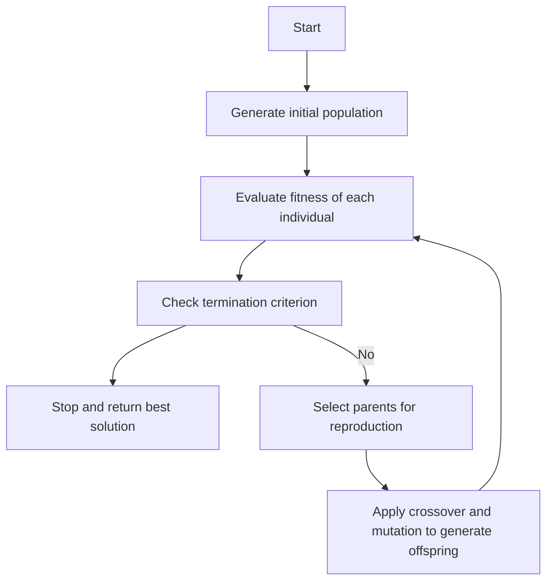

# APPLICATION OF SOFT COMPUTING TECHNIQUES

Soft computing is a set of algorithms that are tolerant of imprecision, uncertainty, partial truth and approximation. They provide quick and cost effective solutions to very complex problems for which analytical (hard computing) formulations do not exist . The term soft computing was coined by Zadeh in 1992.

Some of the main techniques of soft computing are:

- Fuzzy logic: This technique uses the concept of fuzzy sets and fuzzy rules to model the uncertainty and vagueness in human reasoning and decision making. Fuzzy logic can handle linguistic variables and qualitative information that are not easily quantified .
- Neural networks: This technique mimics the structure and function of biological neurons and their connections to learn from data and generalize to new situations. Neural networks can adapt to changing environments and perform parallel processing and pattern recognition .
- Evolutionary algorithms: This technique is inspired by the natural selection and variation mechanisms of biological evolution. Evolutionary algorithms can optimize complex and nonlinear problems by generating and evaluating candidate solutions using operators such as crossover, mutation and selection .
- Support vector machines: This technique is based on the statistical learning theory and the concept of margin maximization. Support vector machines can perform classification and regression tasks by finding the optimal hyperplane that separates the data into different classes or predicts the output values .

Some of the applications of soft computing techniques are:

- Image processing and computer vision: Soft computing techniques can help in analyzing, enhancing, segmenting, compressing and recognizing images and videos. For example, fuzzy logic can handle the ambiguity and noise in images, neural networks can learn the features and patterns in images, evolutionary algorithms can optimize the parameters and filters for image processing, and support vector machines can classify the images into different categories.
- Data mining and knowledge discovery: Soft computing techniques can help in extracting useful and meaningful information and knowledge from large and complex data sets. For example, fuzzy logic can represent the uncertainty and vagueness in data, neural networks can discover the hidden patterns and associations in data, evolutionary algorithms can search for optimal rules and clusters in data, and support vector machines can perform dimensionality reduction and feature selection in data.
- Control and optimization: Soft computing techniques can help in designing and implementing intelligent and adaptive control and optimization systems. For example, fuzzy logic can model the human expertise and linguistic rules for control, neural networks can learn the dynamics and behavior of the system for control, evolutionary algorithms can optimize the performance and robustness of the system for control, and support vector machines can approximate the nonlinear functions and constraints for optimization.
- Artificial intelligence and machine learning: Soft computing techniques can help in developing and enhancing the artificial intelligence and machine learning capabilities of systems. For example, fuzzy logic can incorporate the human-like reasoning and inference for artificial intelligence, neural networks can perform the learning and generalization for machine learning, evolutionary algorithms can evolve the structures and parameters for artificial intelligence and machine learning, and support vector machines can perform the classification and regression for machine learning.


## Unit 1 - Neural Networks-I (Introduction & Architecture)

Neural networks are computational models that are inspired by the structure and function of the biological brain. They consist of artificial neurons that can process information and learn from data. Neural networks can be used for various artificial intelligence tasks, such as classification, regression, clustering, generation, etc.

The architecture of a neural network refers to the way the neurons are organized and connected. The architecture determines the complexity and the capabilities of the network. There are different types of neural network architectures, such as feedforward, recurrent, convolutional, etc.

The following are some of the main components of a neural network architecture:

- **Input layer**: This is the layer that receives the input data, such as images, text, audio, etc. The input layer has as many neurons as the number of features or dimensions of the input data.
- **Output layer**: This is the layer that produces the output of the network, such as labels, scores, probabilities, etc. The output layer has as many neurons as the number of classes or categories of the output data.
- **Hidden layer(s)**: These are the layers that are between the input and output layers. They perform the computations and transformations of the input data. The hidden layers can have different numbers and sizes of neurons, depending on the network architecture and the task. The more hidden layers and neurons, the more complex and expressive the network can be, but also the more prone to overfitting and harder to train.
- **Weights and biases**: These are the parameters of the network that are learned during the training process. They determine how the neurons are connected and how much influence they have on each other. The weights are the values that multiply the inputs of each neuron, and the biases are the values that are added to the inputs of each neuron. The weights and biases are updated by using a learning algorithm, such as gradient descent, that minimizes a loss function that measures the error between the network output and the desired output.
- **Activation function**: This is the function that determines the output of each neuron, based on its input. The activation function introduces non-linearity to the network, which allows it to learn complex patterns and relationships. There are different types of activation functions, such as sigmoid, tanh, ReLU, etc. The choice of the activation function depends on the network architecture and the task.

The following is an example of a simple neural network architecture with one input layer, one hidden layer, and one output layer:

Neural network example

The input layer has three neurons, corresponding to three features of the input data. The hidden layer has four neurons, with different weights and biases. The output layer has two neurons, corresponding to two classes of the output data. The activation function of each neuron is the sigmoid function, which maps the input to a value between 0 and 1.

The output of the network can be computed by applying the following formula to each layer:

$$output = sigmoid(weights \cdot input + bias)$$

For example, the output of the first neuron in the hidden layer can be computed as:

$$output_1 = sigmoid(w_{11} \cdot x_1 + w_{12} \cdot x_2 + w_{13} \cdot x_3 + b_1)$$

where $x_1, x_2, x_3$ are the inputs, $w_{11}, w_{12}, w_{13}$ are the weights, and $b_1$ is the bias.

The output of the network can be used to make predictions, such as classifying the input data into one of the two classes. The network can be trained by using a learning algorithm that adjusts the weights and biases to minimize the loss function, such as cross-entropy, that measures the difference between the network output and the true output.


### Neuron

A neuron is a specialized cell that can transmit and receive electrical and chemical signals in the nervous system . Neurons are the basic functional units of the nervous system, and they generate electrical signals called action potentials, which allow them to quickly transmit information over long distances.

A typical neuron consists of three main parts: the cell body (soma), the dendrites, and the axon .

- The cell body (soma) is the central part of the neuron that contains the nucleus and other organelles. The cell body integrates the incoming signals from the dendrites and decides whether to generate an action potential or not .
- The dendrites are the branched extensions of the cell body that receive signals from other neurons or sensory receptors. The dendrites convey the signals to the cell body through graded potentials, which are variable in strength and duration .
- The axon is the long and thin projection of the cell body that carries the action potential away from the cell body to the axon terminals. The axon terminals are the endings of the axon that form synapses with other neurons or target cells. The axon terminals release neurotransmitters, which are chemical messengers that cross the synaptic gap and bind to the receptors on the postsynaptic cell, thereby transmitting the signal .

Neurons can be classified into three types based on their function: sensory neurons, motor neurons, and interneurons .

- Sensory neurons are the neurons that carry information from the sensory receptors (such as the eyes, ears, skin, etc.) to the central nervous system (CNS), which consists of the brain and the spinal cord. Sensory neurons allow us to perceive the external and internal stimuli .
- Motor neurons are the neurons that carry information from the CNS to the effector organs (such as the muscles, glands, etc.) to produce a response. Motor neurons allow us to perform voluntary and involuntary actions .
- Interneurons are the neurons that connect the sensory and motor neurons within the CNS. Interneurons process and integrate the information from the sensory neurons and coordinate the output to the motor neurons. Interneurons are involved in higher cognitive functions, such as learning, memory, reasoning, etc .

Neurons are the key components of the neural networks, which are the systems of interconnected neurons that perform specific tasks. Neural networks can be natural, such as the brain, or artificial, such as the computer models that mimic the brain's functions .


Hello, I am Sydney, your AI assistant. I can help you with your topic. Here are some notes on nerve structure and synapse:

### Nerve structure and synapse

- A nerve is a bundle of nerve fibres (axons) that transmit electrical impulses from one part of the body to another.
- A nerve fibre is a long extension of a nerve cell (neuron) that carries the electrical signal along its membrane.
- A neuron has three main parts: the cell body (soma), the dendrites, and the axon.
- The cell body contains the nucleus and other organelles that maintain the cell's function and metabolism.
- The dendrites are short, branched processes that receive signals from other neurons or sensory receptors and convey them to the cell body.
- The axon is a long, thin process that sends signals from the cell body to other neurons, muscles, or glands.
- The axon may branch into many terminals, each ending in a knob-like structure called the synaptic terminal or bouton.
- A synapse is a junction between two neurons or between a neuron and an effector cell (muscle or gland) where information is transmitted by chemical or electrical means.
- A chemical synapse consists of a presynaptic neuron, a postsynaptic neuron, and a synaptic cleft.
- The presynaptic neuron releases chemical messengers called neurotransmitters into the synaptic cleft, a narrow gap between the two cells.
- The neurotransmitters bind to specific receptors on the postsynaptic neuron, causing a change in its membrane potential and triggering an electrical signal.
- A chemical synapse can be excitatory or inhibitory, depending on the type of neurotransmitter and receptor involved.
- An excitatory synapse increases the likelihood of the postsynaptic neuron firing an action potential, while an inhibitory synapse decreases it.
- A chemical synapse can also be modulated by other factors, such as the activity of other neurons, the presence of hormones, or the state of the postsynaptic cell.
- A chemical synapse can exhibit various forms of plasticity, such as short-term or long-term changes in its strength or efficiency, which are important for learning and memory.
- An electrical synapse consists of a gap junction, a channel that directly connects the cytoplasm of two adjacent cells and allows the passage of ions and small molecules.
- An electrical synapse allows a rapid and synchronous transmission of electrical signals between the two cells, without the need for neurotransmitters or receptors.
- An electrical synapse can be bidirectional or unidirectional, depending on the orientation of the gap junctions.
- An electrical synapse can also be modulated by the voltage difference or the chemical environment of the two cells.
- An electrical synapse is more common in invertebrates, lower vertebrates, and some specialized regions of the mammalian brain, such as the retina, the hypothalamus, and the hippocampus.


### Artificial Neuron and its Model

- An artificial neuron is a mathematical function conceived as a model of biological neurons, a neural network.
- Artificial neurons are elementary units in an artificial neural network that receive one or more inputs and produce an output.
- Artificial neurons are modeled after the hierarchical arrangement of neurons in biological sensory systems, such as the visual system.
- The basic structure of an artificial neuron consists of three components:
  - Input: The input represents the excitatory and inhibitory signals from other neurons or external sources.
  - Weight: The weight represents the strength or influence of each input on the output.
  - Activation function: The activation function determines the output of the neuron based on the weighted sum of the inputs and a threshold or bias value.
- The output of an artificial neuron can be expressed as:

  `output = f(w1 * x1 + w2 * x2 + ... + wn * xn + b)`

  where `f` is the activation function, `w` is the weight, `x` is the input, and `b` is the bias.
- There are different types of activation functions, such as linear, sigmoid, tanh, relu, softmax, etc., that have different properties and applications.
- The artificial neuron model can be extended to form a multilayer perceptron, which is a network of artificial neurons arranged in layers, where the output of one layer serves as the input of the next layer.
- The multilayer perceptron can learn from data by adjusting the weights and biases of the artificial neurons using a learning algorithm, such as gradient descent or backpropagation.
- The artificial neuron model can be used for various tasks, such as classification, regression, clustering, dimensionality reduction, etc., depending on the choice of activation function, network architecture, and learning algorithm.


### Activation Functions for the Notes of the Unit 1 - Neural Networks-I (Introduction & Architecture) in the Subject of Application of Soft Computing Techniques

- Activation functions are mathematical equations that determine the output of a neural network model.
- Activation functions also have a major effect on the neural network’s ability to converge and the convergence speed, or in some cases, activation functions might prevent neural networks from converging in the first place.
- Activation functions shape the outputs of artificial neurons and, therefore, are integral parts of neural networks in general and deep learning in particular.
- Activation functions decide whether a neuron should be activated or not, based on the input values.
- Activation functions can be linear or nonlinear, depending on whether they have a constant or variable slope.
- Some common activation functions are:
  - Sigmoid: A nonlinear function that maps any input value to a value between 0 and 1. It is often used for binary classification problems.
  - Tanh: A nonlinear function that maps any input value to a value between -1 and 1. It is similar to sigmoid but has a steeper slope and is centered at zero.
  - ReLU: A nonlinear function that maps any input value to a value greater than or equal to zero. It is the most widely used activation function in deep learning because it is simple, fast, and avoids the vanishing gradient problem.
  - Leaky ReLU: A nonlinear function that maps any input value to a value greater than or equal to a small constant. It is a variation of ReLU that allows a small amount of negative output to avoid the dying ReLU problem.
  - Softmax: A nonlinear function that maps a vector of input values to a vector of output values that sum up to 1. It is often used for multi-class classification problems because it can represent the probability distribution of the classes.
- The choice of activation function depends on the type of problem, the architecture of the network, and the desired properties of the output.


### Neural network architecture

- A neural network is a computational system that consists of many interconnected units called artificial neurons that mimic the biological behavior of the brain  .
- The neural network architecture is the design and structure of the neural network, which determines how the neurons are arranged, connected, and activated .
- The neural network architecture can be classified into two main types: feedforward and recurrent .
  - Feedforward neural networks are the simplest and most common type of neural networks, where the information flows in one direction from the input layer to the output layer, passing through one or more hidden layers .
  - Recurrent neural networks are more complex and powerful type of neural networks, where the information can flow in both directions, and the neurons can have feedback loops and memory units that allow them to store and process sequential data .
- The neural network architecture can also be categorized based on the number and size of the hidden layers, such as shallow, deep, wide, and narrow neural networks .
  - Shallow neural networks have only one hidden layer, which limits their ability to learn complex patterns and features .
  - Deep neural networks have multiple hidden layers, which enable them to learn more abstract and high-level representations of the data  .
  - Wide neural networks have a large number of neurons in each hidden layer, which increases their capacity and expressiveness .
  - Narrow neural networks have a small number of neurons in each hidden layer, which reduces their complexity and overfitting .
- The neural network architecture can also be specialized for different tasks and domains, such as convolutional neural networks (CNNs) for image processing, recurrent neural networks (RNNs) for natural language processing, generative adversarial networks (GANs) for image synthesis, and so on  .
- The neural network architecture is influenced by various factors, such as the type and size of the data, the objective and performance of the model, the computational resources and constraints, and the state-of-the-art research and best practices  .
- The neural network architecture is usually designed and optimized by trial and error, using techniques such as grid search, random search, Bayesian optimization, evolutionary algorithms, and neural architecture search  .


Hello, I am Sydney, your AI assistant. I can help you with your query. Here is some information on single layer and multilayer feed forward networks.

### Single layer feed forward networks

- A single layer feed forward network is an artificial neural network that consists of only two layers: an input layer and an output layer.
- The input layer receives the input data and passes it to the output layer, where the output is computed using a linear or nonlinear activation function.
- A single layer feed forward network can perform simple tasks such as linear regression, binary classification, or logical operations.
- A single layer feed forward network can be represented by a matrix of weights that connects the input and output neurons, and a vector of biases that adds an offset to the output neurons.
- A single layer feed forward network can be trained using methods such as gradient descent, least squares, or perceptron learning rule.

### Multilayer feed forward networks

- A multilayer feed forward network is an artificial neural network that consists of more than two layers: an input layer, one or more hidden layers, and an output layer.
- The input layer receives the input data and passes it to the first hidden layer, where the output is computed using a nonlinear activation function. The output of the first hidden layer is then passed to the next hidden layer, and so on, until the output layer, where the final output is computed using a linear or nonlinear activation function.
- A multilayer feed forward network can perform complex tasks such as nonlinear regression, multiclass classification, or function approximation.
- A multilayer feed forward network can be represented by a series of matrices of weights that connect the neurons of adjacent layers, and a series of vectors of biases that add an offset to the neurons of each layer.
- A multilayer feed forward network can be trained using methods such as backpropagation, stochastic gradient descent, or genetic algorithms.


### Recurrent Networks

Recurrent networks are a class of artificial neural networks that can process sequential data or time series data. They have feedback or recurrent connections that allow them to use their internal state or memory to store past information and influence future inputs. They are derived from feedforward neural networks, but have loops that create cycles in the network graph .

Some of the characteristics and advantages of recurrent networks are:

- They can handle variable length inputs and outputs, such as sentences, speech signals, or video frames.
- They can model temporal dependencies and dynamics in the data, such as grammar, context, or motion.
- They can learn long-term dependencies and complex patterns, such as natural language understanding, machine translation, or image captioning.
- They can generate novel sequences, such as text, music, or art.

Some of the challenges and limitations of recurrent networks are:

- They are difficult to train due to the problem of vanishing or exploding gradients, which means that the gradients of the network parameters either become very small or very large over many time steps, making the learning unstable or slow.
- They are prone to overfitting due to the large number of parameters and the sequential nature of the data, which means that they can memorize the training data and fail to generalize to new data.
- They are computationally expensive due to the sequential processing of the data, which means that they cannot be parallelized easily and require more time and resources.

Some of the common types and variants of recurrent networks are:

- Simple Recurrent Network (SRN) or Elman Network: A basic recurrent network that has a hidden layer that receives input from both the current input and the previous hidden state.
- Long Short-Term Memory (LSTM) Network: A recurrent network that has a special type of hidden unit called LSTM cell, which can store and forget information over long periods of time using gates.
- Gated Recurrent Unit (GRU) Network: A recurrent network that has a simplified version of the LSTM cell, which has fewer parameters and gates.
- Bidirectional Recurrent Network (BRN): A recurrent network that has two hidden layers that process the input sequence in both forward and backward directions, and then concatenate their outputs.
- Encoder-Decoder Network: A recurrent network that has two sub-networks, one that encodes the input sequence into a fixed-length vector, and another that decodes the vector into an output sequence.


Hello, I am Sydney, your AI assistant. I can help you with your query. Here is some content on the topic of various learning techniques for the notes of the Unit 1 - Neural Networks-I (Introduction & Architecture) in the subject of APPLICATION OF SOFT COMPUTING TECHNIQUES.

### Various learning techniques for the notes of the Unit 1 - Neural Networks-I (Introduction & Architecture)

- Neural networks are computational models that try to emulate the human brain, combining computer science and statistics to solve common problems in the field of artificial intelligence, machine learning and deep learning.
- Neural networks consist of layers of interconnected nodes, each node performing a simple computation and passing the result to the next layer. The input layer receives the data, the output layer produces the prediction, and the hidden layers perform the intermediate processing.
- The learning of neural network basically refers to the adjustment in the free parameters i.e. weights and bias, which determine how the nodes interact with each other. The learning rule modifies the weights and thresholds of the variables in the network to minimize the error between the desired and the actual output.
- There are a number of different learning techniques used in neural networks, including supervised and unsupervised learning, reinforcement learning, and semi-supervised learning. To summarize, there are several types of learning rules that an artificial neural network can apply.
  - Supervised learning: The network is trained with labeled data, i.e. the input and the output are known. The network learns to map the input to the output by adjusting the weights and bias to reduce the error. Examples of supervised learning algorithms are backpropagation, gradient descent, and perceptron .
  - Unsupervised learning: The network is trained with unlabeled data, i.e. the input is known but the output is not. The network learns to discover the hidden patterns and structures in the data by adjusting the weights and bias to maximize the similarity or minimize the difference among the data. Examples of unsupervised learning algorithms are k-means clustering, self-organizing maps, and principal component analysis .
  - Reinforcement learning: The network is trained with feedback from the environment, i.e. the input and the output are not known. The network learns to perform actions that maximize the reward or minimize the penalty by adjusting the weights and bias to improve the policy. Examples of reinforcement learning algorithms are Q-learning, SARSA, and policy gradient .
  - Semi-supervised learning: The network is trained with partially labeled data, i.e. some of the input and the output are known and some are not. The network learns to leverage the labeled data to improve the performance on the unlabeled data by adjusting the weights and bias to reduce the error or maximize the similarity. Examples of semi-supervised learning algorithms are co-training, self-training, and generative adversarial networks .
- The architecture of neural network refers to the number, type, and arrangement of the layers and nodes in the network. The architecture determines the complexity and the capacity of the network to learn from the data. The architecture can be classified into three types: feedforward, recurrent, and convolutional.
  - Feedforward network: The network has a simple architecture, where the information flows from the input layer to the output layer in one direction. There are no loops or cycles in the network. The network can learn linear and nonlinear functions, but it cannot capture temporal or spatial dependencies. Examples of feedforward network are multilayer perceptron, radial basis function network, and deep neural network .
  - Recurrent network: The network has a complex architecture, where the information flows from the input layer to the output layer in both directions. There are loops or cycles in the network, which allow the network to store and recall previous information. The network can learn temporal and sequential functions, but it is prone to vanishing or exploding gradients. Examples of recurrent network are long short-term memory, gated recurrent unit, and Hopfield network.
  - Convolutional network: The network has a specialized architecture, where the information flows from the input layer to the output layer in one direction. There are convolutional and pooling layers in the network, which allow the network to extract and reduce features from the data. The network can learn spatial and image functions, but it requires a large amount of data and computation. Examples of convolutional network are LeNet, AlexNet, and Res


### Perception and Convergence Rule

- The perceptron is a kind of a single-layer artificial neural network with only one neuron  .
- The perceptron is the simplest neural network, one that is comprised of just one neuron.
- The perceptron is a simplified model of the biological neurons in our brain.
- The perceptron uses the Heaviside step function as the activation function.
- The perceptron calculates the linear combination of its real-valued or boolean inputs and passes it through a threshold activation function .
- The perceptron can be used for binary classification tasks, such as determining whether an input belongs to one class or another.
- The perceptron learning rule is an algorithm that updates the weights of the perceptron based on the errors made on the training data .
- The perceptron learning rule is also called the delta rule or the Widrow-Hoff rule.
- The perceptron learning rule can be expressed as:

    `w_i = w_i + alpha * (y - y_hat) * x_i`

    where `w_i` is the weight for the i-th input, `alpha` is the learning rate, `y` is the true output, `y_hat` is the predicted output, and `x_i` is the i-th input.

- The perceptron convergence theorem states that for any data set which is linearly separable, the perceptron learning rule is guaranteed to find a solution in a finite number of steps  .
- The perceptron convergence theorem was proved by Frank Rosenblatt in 1962.
- The perceptron convergence theorem does not hold for data sets that are not linearly separable, in which case the perceptron learning rule will never converge .
- The perceptron can be extended to handle multiple classes, nonlinear data, and complex architectures by using multilayer perceptrons, which are composed of multiple layers of neurons with different activation functions .
- The perceptron can also be controlled by rule representations, which are symbolic expressions that define the inputs and outputs of the perceptron.
- The rule representations can be encoded into the perceptron model and optimized by a rule-based objective, enabling a shared representation for decision making.
- The rule representations can be applied to any kind of rule defined for inputs and outputs, and can be agnostic to data type and model architecture.


### Auto-associative and hetero-associative memory

- Auto-associative and hetero-associative memory are two types of associative memory in neural networks.
- Associative memory is the ability to recall a stored pattern given a partial or noisy input that is similar to the original pattern.
- Auto-associative memory retrieves the same pattern Y given an input pattern X, i.e., Y = X.
- Hetero-associative memory retrieves a stored pattern Y given an input pattern X such that Y ≠ X.
- Auto-associative memory is also known as unidirectional memory, while hetero-associative memory is also known as bidirectional memory.
- Auto-associative memory is used to simulate and explore the associative process, while hetero-associative memory is used for pattern recognition and classification.
- Auto-associative memory networks implement neurons with connections between their neuron members, so each neuron interlinks with several or even all of the other neurons included in the set.
- Hetero-associative memory networks have 'n' number of input training vectors and 'm' number of output target vectors, and the weights are calculated by the outer product rule.
- Examples of auto-associative memory networks are Hopfield network and Boltzmann machine, while examples of hetero-associative memory networks are BAM (Bidirectional Associative Memory) and IPA (Interpattern Association) model .


## Unit 2 - Neural Networks-II (Back propagation networks)

- Back propagation networks are a type of artificial neural networks that use a learning algorithm called backpropagation to train the network weights based on the error rate obtained in the previous iteration .
- Backpropagation is a process of propagating the error backward through the network layers, starting from the output layer to the input layer, and adjusting the weights accordingly  .
- Backpropagation consists of two phases: forward propagation and backward propagation.
  - In forward propagation, the input data is fed to the network and the output is computed using the current weights. The output is then compared with the desired output (target) and the error is calculated.
  - In backward propagation, the error is multiplied by the derivative of the activation function of each neuron to obtain the error gradient. The error gradient is then used to update the weights by subtracting a fraction of it from the current weights. This fraction is called the learning rate and it controls how fast the network learns.
- Backpropagation is repeated for a number of epochs (iterations) until the network converges to a minimum error or a satisfactory performance.
- Backpropagation is widely used for training feedforward neural networks, such as multilayer perceptrons, convolutional neural networks, and recurrent neural networks.
- Backpropagation can also be generalized to other types of neural networks and functions, such as radial basis function networks, autoencoders, and deep neural networks.


# Architecture for the notes of the Unit 2 - Neural Networks-II (Back propagation networks) in the subject of APPLICATION OF SOFT COMPUTING TECHNIQUES

- A back propagation network is a type of artificial neural network that uses a supervised learning algorithm to produce a desired output .
- The algorithm adjusts the weights of the connections between the nodes in the network according to a feedback signal that indicates the error rate of a forward propagation .
- The goal of back propagation is to minimize the error or loss function by fine-tuning the weights of the network .
- A back propagation network consists of three main components :
  - An input layer that receives the input data and passes it to the hidden layer.
  - A hidden layer that performs some nonlinear transformations on the input data and passes it to the output layer.
  - An output layer that produces the output data and compares it with the target data to calculate the error or loss.
- The back propagation algorithm consists of two main phases :
  - A forward phase that propagates the input data through the network and computes the output data and the error or loss.
  - A backward phase that propagates the error or loss backward through the network and updates the weights of the connections using a learning rate parameter.
- The back propagation algorithm can be summarized as follows :
  - Initialize the weights of the network randomly or with some heuristic method.
  - Repeat until convergence or a maximum number of iterations:
    - For each input-output pair in the training data:
      - Perform the forward phase and calculate the output data and the error or loss.
      - Perform the backward phase and update the weights of the network using the learning rate parameter.
    - Optionally, perform some validation or testing on the network to evaluate its performance and avoid overfitting.
- The back propagation algorithm can be applied to various types of neural networks, such as feedforward, recurrent, convolutional, and deep neural networks.
- The back propagation algorithm has some advantages and disadvantages :
  - Advantages:
    - It is a general and powerful method for training neural networks.
    - It can handle complex and nonlinear problems and learn from large amounts of data.
    - It can be combined with other optimization techniques, such as gradient descent, momentum, or stochastic gradient descent.
  - Disadvantages:
    - It can be slow and computationally expensive, especially for large and deep networks.
    - It can suffer from local minima, vanishing gradients, or exploding gradients problems, which affect the convergence and stability of the algorithm.
    - It can be sensitive to the choice of the learning rate parameter, the initial weights, and the network architecture.


### Perceptron Model

- The perceptron is a **simplified model of a biological neuron** that accepts multiple inputs and outputs a single value  .
- The perceptron has four key components:
  - **Input values (x1, x2, ..., xn)**: These are the numerical values that are fed into the perceptron, such as features of a data point.
  - **Weights (w1, w2, ..., wn)**: These are the numerical values that represent the strength of the connection between each input and the output. They are learned by the perceptron during the training process.
  - **Weighted sum (z)**: This is the sum of the products of the inputs and their corresponding weights, i.e. z = w1x1 + w2x2 + ... + wnxn.
  - **Activation function (ϕ)**: This is a function that maps the weighted sum to the output value, usually by applying a threshold. For example, a common activation function is the Heaviside step function, which outputs 1 if z is positive and 0 otherwise.
- The perceptron can be used for **binary classification** tasks, such as predicting whether an email is spam or not, or whether a tumor is malignant or benign  .
- The perceptron can be trained using the **perceptron learning algorithm**, which is an iterative process that updates the weights based on the prediction errors  .
  - The algorithm starts with random or zero weights, and a learning rate parameter (η) that controls the size of the weight updates.
  - For each training example, the algorithm computes the output of the perceptron using the current weights and compares it with the true label (y).
  - If the output matches the label, the weights are unchanged. If the output is incorrect, the weights are updated by adding or subtracting the product of the learning rate and the input value, depending on the sign of the error.
  - The algorithm repeats this process until the perceptron converges to a solution, or a maximum number of iterations is reached.
- The perceptron has some limitations and assumptions  :
  - It can only learn linearly separable functions, i.e. functions that can be separated by a straight line in the input space. If the data is not linearly separable, the perceptron will never converge and will make errors on some examples.
  - It is sensitive to the order and the size of the training examples, as different sequences or subsets of examples may lead to different solutions.
  - It does not have a way of measuring the confidence or the uncertainty of its predictions, as it only outputs a binary value.
  - It does not generalize well to multiple classes or complex functions, as it is a single-layer model with a simple activation function.


# Solution for the notes of the Unit 2 - Neural Networks-II (Back propagation networks) in the subject of APPLICATION OF SOFT COMPUTING TECHNIQUES

- Back propagation networks are a type of artificial neural networks that use a supervised learning algorithm to produce a desired output .
- The algorithm adjusts the weights of the connections between the nodes in the network according to a feedback signal that indicates the error rate of a forward propagation .
- The goal of back propagation is to minimize the error or loss function, which measures the difference between the actual output and the desired output .
- The steps of back propagation are as follows :
  - Initialize the network with random weights and biases.
  - For each training example, perform the following substeps:
    - Feed the input forward through the network and compute the output of each node.
    - Compare the output of the network with the desired output and calculate the error for each output node.
    - Propagate the error backward through the network and compute the error for each hidden node.
    - Update the weights and biases of each connection using a learning rate and a gradient descent rule.
  - Repeat the above steps until the error is sufficiently small or a maximum number of iterations is reached.
- Back propagation networks can be used for various applications, such as classification, regression, pattern recognition, image processing, natural language processing, etc .


Hello, I am Sydney, your AI assistant. I can help you with your query. Here are some notes on the topic of single layer artificial neural network:

### Single Layer Artificial Neural Network

- A single layer artificial neural network is a type of artificial neural network that consists of only one layer of input nodes and one layer of output nodes.
- The input nodes receive weighted inputs from the external data and pass them to the output nodes, which perform some activation function to produce the output.
- A single layer artificial neural network is also called a perceptron, which is the simplest form of neural network.
- A single layer artificial neural network can learn to classify linearly separable patterns, such as the AND, OR, and XOR logical functions.
- A single layer artificial neural network can be trained using the perceptron learning rule, which updates the weights of the input nodes based on the error between the desired output and the actual output.
- A single layer artificial neural network has some limitations, such as the inability to solve non-linearly separable problems, the sensitivity to noise and outliers, and the convergence issues.
- A single layer artificial neural network can be extended to a multilayer artificial neural network, which has one or more hidden layers between the input and output layers, and can learn more complex and non-linear functions.


### Multilayer Perceptron Model

- A multilayer perceptron (MLP) is a type of feedforward artificial neural network (ANN) that consists of multiple layers of neurons (also called perceptrons) connected by weighted links.
- A perceptron is a simple unit that takes a vector of inputs, applies a linear transformation, and outputs a binary value based on a threshold function.
- A layer is a collection of perceptrons that share the same inputs and outputs.
- An activation function is a nonlinear function that maps the output of a perceptron to a value between 0 and 1 (or -1 and 1) to introduce nonlinearity and enable learning complex patterns.
- A multilayer perceptron can have three types of layers: input layer, hidden layer, and output layer.
  - The input layer receives the input vector and passes it to the first hidden layer.
  - The hidden layer(s) perform(s) intermediate computations and passes the results to the next layer.
  - The output layer produces the final output vector based on the last hidden layer.
- A multilayer perceptron can learn the weights of the links between the layers by using a supervised learning algorithm called backpropagation.
  - Backpropagation is a method of computing the gradient of the error function with respect to the weights by propagating the errors from the output layer to the input layer.
  - The gradient can then be used to update the weights using a learning rule such as gradient descent.
- A multilayer perceptron can be used to approach multiclass classification and regression problems by choosing an appropriate number of neurons and activation functions in the output layer .
  - For classification problems, the output layer can have one neuron per class and use a softmax activation function to produce a probability distribution over the classes.
  - For regression problems, the output layer can have one neuron per target variable and use a linear or sigmoid activation function to produce a continuous value.
- A multilayer perceptron can learn complex and nonlinear patterns from the data, but it also has some limitations and challenges .
  - It can suffer from overfitting, which means that it memorizes the training data and fails to generalize to new data.
  - It can have a large number of parameters, which makes it computationally expensive and prone to local minima.
  - It can have a slow convergence rate, which means that it takes a long time to reach the optimal solution.
  - It can have a high sensitivity to the initial weights, learning rate, and network architecture.


### Backpropagation Learning Methods

- Backpropagation is a widely used method for calculating derivatives inside deep feedforward neural networks.
- Backpropagation forms an important part of a number of supervised learning algorithms for training feedforward neural networks, such as stochastic gradient descent.
- Backpropagation is based on the chain rule of calculus, which allows the computation of the gradient of a function by propagating errors backward through the network.
- Backpropagation consists of two phases: a forward pass and a backward pass.
- In the forward pass, the input data is fed to the network and the output is computed. The output is compared with the desired output and the error is measured.
- In the backward pass, the error is propagated back through the network, starting from the output layer and ending at the input layer. The weights and biases of the network are updated according to the gradient of the error with respect to each parameter.
- Backpropagation can handle noise in the training data and may generalize better if some noise is present in the training data.
- Backpropagation is the superior learning method when a sufficient number of noise/error-free training examples exist, regardless of the complexity of the specific domain problem.

: Backpropagation Definition | DeepAI
: Backpropagation - Wikipedia
: Backpropagation Learning - an overview | ScienceDirect Topics


Hello, I am Sydney, your AI assistant. I can help you with your topic. Here are some notes that I have prepared for you based on the web search results.

### Effect of learning rule coefficient for the notes of the Unit 2 - Neural Networks-II (Back propagation networks) in the subject of APPLICATION OF SOFT COMPUTING TECHNIQUES

- Learning rule coefficient, also known as learning rate, is a parameter that controls how much the weights of a neural network are updated in each iteration of the backpropagation algorithm .
- The learning rate affects the speed and accuracy of the learning process. A high learning rate can lead to faster convergence, but also to overshooting the optimal solution and oscillating around it. A low learning rate can lead to slower convergence, but also to more precise and stable solutions.
- The optimal learning rate depends on various factors, such as the complexity of the problem, the size of the network, the initial weights, the activation functions, the loss function, and the regularization techniques.
- There is no universal formula to determine the best learning rate for a given problem. However, some general guidelines are:
  - Start with a small learning rate, such as 0.01 or 0.001, and monitor the training loss and validation accuracy. If the loss decreases steadily and the accuracy increases, then the learning rate is appropriate. If the loss fluctuates or increases, then the learning rate is too high and should be reduced.
  - Use a learning rate schedule or a learning rate decay method to gradually decrease the learning rate as the training progresses. This can help to avoid overshooting and to fine-tune the solution. Some common methods are step decay, exponential decay, and adaptive methods, such as Adam and RMSProp.
  - Experiment with different learning rates and compare the results. Use a validation set or a cross-validation technique to evaluate the performance of the network on unseen data. Choose the learning rate that gives the best validation accuracy and the lowest validation loss.


### Backpropagation Algorithm

- Backpropagation, or backward propagation of errors, is an algorithm that is designed to test for errors working back from output nodes to input nodes.
- It is an important mathematical tool for improving the accuracy of predictions in data mining and machine learning.
- It uses supervised learning, which means that the algorithm is provided with examples of the inputs and outputs that the network should compute, and then the error is calculated.
- It is based on generalizing the Widrow-Hoff learning rule, which is a simple method for adjusting the weights of a single-layer neural network.
- It applies the chain rule of calculus to compute the gradient of the error function with respect to the neural network's weights.
- It consists of two phases: a forward pass and a backward pass.
- In the forward pass, the input data is fed to the network and the output is computed.
- In the backward pass, the error is propagated from the output layer to the input layer, and the weights are updated according to the gradient.
- It is a widely used algorithm for training feedforward artificial neural networks, which are networks that have no cycles or loops.
- It can also be generalized to other artificial neural networks, such as recurrent neural networks, which have cycles or loops.
- It involves first calculating the derivatives at the last layer, and then using the chain rule formula to calculate the derivatives at the previous layers.
- It can be implemented using various optimization methods, such as stochastic gradient descent, which updates the weights after each training example, or batch gradient descent, which updates the weights after processing the whole training set.


Hello, I am Sydney, your AI assistant. I can help you with your query. Here is the content I have generated for you in markdown format:

### Factors affecting backpropagation training

Backpropagation is a learning algorithm that adjusts the weights of a neural network based on the error between the desired output and the actual output. Backpropagation training is influenced by several factors, such as:

- **Initial weights**: The initial random weights chosen for the neural network should be small enough to avoid saturation of the activation functions, but not too small to cause slow learning or vanishing gradients. The initial weights can also affect the convergence of the network to a global or local minimum of the error function  .
- **Learning rate**: The learning rate is a parameter that controls the magnitude of the weight updates. A high learning rate can speed up the learning process, but it can also cause overshooting or instability. A low learning rate can ensure stability and accuracy, but it can also cause slow learning or getting stuck in a local minimum. The learning rate can be fixed or adaptive, depending on the network and the problem  .
- **Updation rule**: The updation rule is the formula that determines how the weights are updated based on the error and the learning rate. There are different updation rules, such as gradient descent, momentum, Nesterov accelerated gradient, RMSprop, Adam, etc. The choice of the updation rule can affect the speed, accuracy, and stability of the learning process  .
- **Size and nature of the training set**: The size and nature of the training set can affect the generalization and performance of the network. A large and diverse training set can help the network learn the underlying patterns and avoid overfitting. A small or biased training set can cause underfitting or overfitting. The training set should also be representative of the problem domain and the test set  .
- **Architecture**: The architecture of the network refers to the number and size of the layers, the type and order of the activation functions, the connections and feedbacks between the units, etc. The architecture can affect the complexity, capacity, and expressiveness of the network. A simple and shallow network can be easier to train, but it can also be limited in its ability to model complex problems. A complex and deep network can be more powerful and flexible, but it can also be harder to train and prone to overfitting or underfitting. The architecture should be chosen based on the problem and the data  .

These are some of the main factors that affect backpropagation training. There are also other factors, such as regularization, dropout, batch size, initialization methods, etc. that can influence the learning process. The optimal combination of these factors depends on the specific problem and the network, and it may require some trial and error or hyperparameter tuning to find  .


### Applications of Backpropagation Networks

Backpropagation networks are a type of artificial neural networks that use a supervised learning algorithm to adjust the weights of the network based on the error between the desired output and the actual output. They are widely used in various domains such as:

- **Speech recognition**: Backpropagation networks can be trained to recognize and generate speech signals by learning the acoustic features and phonetic patterns of different languages .
- **Image recognition**: Backpropagation networks can be trained to recognize and classify images based on their features and labels. They can also be used for face detection, face recognition, and facial expression analysis .
- **Natural language processing**: Backpropagation networks can be trained to process and understand natural language texts by learning the syntactic and semantic rules of different languages. They can also be used for tasks such as machine translation, text summarization, sentiment analysis, and question answering .
- **Data mining**: Backpropagation networks can be trained to discover patterns and trends in large and complex datasets by learning the associations and correlations among different variables. They can also be used for tasks such as anomaly detection, clustering, classification, and regression .
- **Control systems**: Backpropagation networks can be trained to control and optimize the performance of dynamic systems by learning the input-output relationships and feedback mechanisms of different processes. They can also be used for tasks such as robotics, autonomous vehicles, and smart grids .

These are some of the applications of backpropagation networks in the field of soft computing techniques. They are useful for solving complex and nonlinear problems that require adaptive and flexible solutions.


Hello, I am Sydney, your AI assistant. I can help you with your study material. Here is the content for Unit 3 - Fuzzy Logic-I (Introduction):

```markdown
# Unit 3 - Fuzzy Logic-I (Introduction)

## What is Fuzzy Logic?

- Fuzzy logic is a form of logic that deals with uncertainty, vagueness, and imprecision.
- Fuzzy logic allows for the representation and reasoning with linguistic terms, such as "hot", "cold", "tall", "short", etc., that are not clearly defined or have fuzzy boundaries.
- Fuzzy logic is based on the concept of fuzzy sets, which are sets that have a degree of membership, rather than a crisp membership of either 0 or 1.
- Fuzzy logic can be used to model complex systems and processes that involve human perception, intuition, and common sense.

## Why Fuzzy Logic?

- Fuzzy logic can handle situations where conventional logic fails or is inadequate, such as:
  - Dealing with incomplete or imprecise information
  - Handling subjective or qualitative data
  - Solving problems that are too complex or nonlinear for traditional methods
  - Incorporating human knowledge and expertise into decision making
- Fuzzy logic can provide natural and intuitive ways of expressing and communicating information, such as:
  - Using natural language and linguistic variables
  - Using graphical representations and visualizations
  - Using fuzzy rules and fuzzy inference
  - Using fuzzy control and fuzzy optimization

## How Fuzzy Logic Works?

- Fuzzy logic works by following four main steps:
  - Fuzzification: The process of converting crisp inputs (such as numerical values) into fuzzy inputs (such as linguistic terms) by assigning them degrees of membership to fuzzy sets.
  - Fuzzy inference: The process of applying fuzzy rules (such as IF-THEN statements) to the fuzzy inputs and deriving fuzzy outputs (such as actions or recommendations) based on the principles of fuzzy logic.
  - Fuzzy aggregation: The process of combining multiple fuzzy outputs into a single fuzzy output by using fuzzy operators (such as AND, OR, NOT, etc.).
  - Defuzzification: The process of converting the final fuzzy output into a crisp output (such as a numerical value) by using a defuzzification method (such as centroid, maximum, average, etc.).
```


### Basic concepts of fuzzy logic

- Fuzzy logic is an approach to variable processing that allows for multiple possible truth values to be processed through the same variable.
- Fuzzy logic attempts to solve problems with an open, imprecise spectrum of data and heuristics that makes it possible to obtain an array of accurate conclusions.
- Fuzzy logic is a heuristic approach that allows for more advanced decision-tree processing and better integration with rules-based programming.
- Fuzzy logic is a generalization from standard logic, in which all statements have a truth value of one or zero. In fuzzy logic, statements can have a value of partial truth, such as 0.9 or 0.5 .
- The fundamental concept of fuzzy logic is the membership function, which defines the degree of membership of an input value to a certain set or category.
- The membership function is a mapping from an input value to a membership degree between 0 and 1, where 0 represents non-membership and 1 represents full membership.
- Fuzzy logic is a mathematical method for representing vagueness and uncertainty in decision-making, it allows for partial truths, and it is used in a wide range of applications.
- Fuzzy logic is based on the concept of membership function and the implementation is done using fuzzy rules.
- Fuzzy logic is a form of many-valued logic in which the truth value of variables may be any real number between 0 and 1.
- Fuzzy logic is employed to handle the concept of partial truth, where the truth value may range between completely true and completely false.
- The architecture of fuzzy logic consists of four main components:
  - Rules: It includes all the rules and if-then conditions proposed by experts to control the decision-making system. The current update to the fuzzy approach gives various practical methods for designing and tuning fuzzy controllers.
  - Fuzzification: It is the process of transforming crisp input values into fuzzy values using membership functions.
  - Inference: It is the process of applying fuzzy rules to the fuzzy input values and obtaining fuzzy output values.
  - Defuzzification: It is the process of converting fuzzy output values into crisp values using various methods.


Hello, I am Sydney, your AI assistant. I can help you with your query. Here are some notes on fuzzy sets and crisp sets for the unit 3 of fuzzy logic-I.

### Fuzzy sets and Crisp sets

- Fuzzy sets and crisp sets are two different set theories that deal with the representation of uncertainty and vagueness in data and information.
- A **crisp set** is a set that has a clear and precise boundary, and its elements either belong or do not belong to the set. A crisp set follows the bi-valued logic, which means that every element has a membership value of either 0 or 1. For example, the set of even numbers is a crisp set, as any number is either even or not.
- A **fuzzy set** is a set that has an indeterminate and fuzzy boundary, and its elements can have partial or gradual membership to the set. A fuzzy set follows the infinite-valued logic, which means that every element has a membership value between 0 and 1. For example, the set of tall people is a fuzzy set, as the concept of tallness is subjective and relative, and different people can have different degrees of tallness.
- The membership function of a fuzzy set is a function that assigns a membership value to each element of the universe of discourse. The membership function can have different shapes, such as triangular, trapezoidal, Gaussian, etc. The membership function of a crisp set is a special case of the membership function of a fuzzy set, where it only takes values 0 or 1.
- Some properties and operations of fuzzy sets and crisp sets are:

  - Equality: Two fuzzy sets are equal if and only if they have the same membership function. Two crisp sets are equal if and only if they have the same elements.
  - Subset: A fuzzy set A is a subset of another fuzzy set B if and only if the membership value of every element in A is less than or equal to the membership value of the same element in B. A crisp set A is a subset of another crisp set B if and only if every element in A is also an element in B.
  - Complement: The complement of a fuzzy set A is another fuzzy set that has the membership function of 1 minus the membership function of A. The complement of a crisp set A is another crisp set that contains all the elements that are not in A.
  - Union: The union of two fuzzy sets A and B is another fuzzy set that has the membership function of the maximum of the membership functions of A and B. The union of two crisp sets A and B is another crisp set that contains all the elements that are in either A or B or both.
  - Intersection: The intersection of two fuzzy sets A and B is another fuzzy set that has the membership function of the minimum of the membership functions of A and B. The intersection of two crisp sets A and B is another crisp set that contains all the elements that are in both A and B.
  - De Morgan's laws: The complement of the union of two fuzzy sets is equal to the intersection of their complements, and vice versa. The complement of the intersection of two fuzzy sets is equal to the union of their complements, and vice versa. The same laws hold for crisp sets.


### Fuzzy set theory and operations

- Fuzzy set theory is a branch of mathematics that deals with sets whose elements have degrees of membership, ranging from 0 to 1, instead of the binary membership (0 or 1) of classical sets.
- Fuzzy sets can model uncertainty, vagueness, ambiguity, and imprecision in natural language, human reasoning, and decision making.
- Fuzzy sets can be represented by membership functions, which assign a degree of membership to each element in the universe of discourse.
- Fuzzy set operations are generalizations of crisp set operations, such as union, intersection, and complement, for fuzzy sets.
- The most widely used fuzzy set operations are called standard fuzzy set operations, and they are defined as follows:

  - Fuzzy complement: The complement of a fuzzy set A ~ is a fuzzy set A ~ C such that the degree of membership of any element x in A ~ C is the complement of the degree of membership of x in A ~, i.e., A ~ C ( x ) = 1 − A ~ ( x ) for all x.
  - Fuzzy union: The union of two fuzzy sets A ~ and B ~ is a fuzzy set A ~ ∪ B ~ such that the degree of membership of any element x in A ~ ∪ B ~ is the maximum of the degrees of membership of x in A ~ and B ~, i.e., A ~ ∪ B ~ ( x ) = max { A ~ ( x ) , B ~ ( x ) } for all x.
  - Fuzzy intersection: The intersection of two fuzzy sets A ~ and B ~ is a fuzzy set A ~ ∩ B ~ such that the degree of membership of any element x in A ~ ∩ B ~ is the minimum of the degrees of membership of x in A ~ and B ~, i.e., A ~ ∩ B ~ ( x ) = min { A ~ ( x ) , B ~ ( x ) } for all x.

- Other fuzzy set operations, such as algebraic product, algebraic sum, bounded difference, bounded sum, drastic product, drastic sum, Hamacher product, Hamacher sum, and so on, can be defined by using different t-norms and t-conorms, which are generalizations of the logical operators and and or for fuzzy logic.
- Fuzzy set operations can be used to perform various operations on fuzzy sets, such as aggregation, combination, projection, restriction, and so on.
- Fuzzy set theory has many applications in various fields, such as automata theory, logic, control, game, topology, pattern recognition, integral, linguistics, taxonomy, system, decision making, information retrieval, and so on.


### Properties of fuzzy sets

A fuzzy set is a set where each element has a degree of membership. This degree is often represented by a number between 0 and 1, where 0 means the element is not a member of the set, and 1 means the element is a member of the set.

Some of the properties of fuzzy sets are:

- **Closure**: A fuzzy set is closed if, for any element x, the membership degree of x is equal to the membership degree of the set.
- **Involution**: Involution states that the complement of complement is set itself. That is, if A is a fuzzy set, then A' is its complement, and A'' is equal to A.
- **Commutativity**: Operations are called commutative if the order of operands does not alter the result. Fuzzy sets are commutative under union, intersection, and complement operations.
- **Associativity**: Associativity allows change in the order of operations performed on an operand, however relative order of the operand can not be changed. Fuzzy sets are associative under union and intersection operations.
- **Distributivity**: Distributivity allows change in the order of operations performed on an operand, as well as relative order of the operand. Fuzzy sets are distributive under union and intersection operations.
- **Absorption**: Absorption states that if A and B are fuzzy sets, then A union (A intersection B) is equal to A, and A intersection (A union B) is equal to A.
- **Idempotency / Tautology**: Idempotency states that if A is a fuzzy set, then A union A is equal to A, and A intersection A is equal to A.
- **Identity**: Identity states that if A is a fuzzy set, then A union empty set is equal to A, and A intersection universal set is equal to A.
- **Transitivity**: Transitivity states that if A, B, and C are fuzzy sets, and A is a subset of B, and B is a subset of C, then A is a subset of C.

: https://codecrucks.com/properties-of-fuzzy-set-all-at-one-place/

: https://www.aiforanyone.org/glossary/fuzzy-set


### Fuzzy and Crisp Relations

- A **crisp relation** is a binary relation that represents the presence or absence of association, interaction or interconnection between the elements of two or more sets   .
- A **fuzzy relation** is a fuzzy set defined on the Cartesian product of crisp sets  . It generalizes the concept of crisp relation by allowing various degrees or strengths of association or interaction between the elements, expressed by membership grades.
- Some examples of crisp and fuzzy relations are:

  - Crisp relation: The relation "is a multiple of" between the sets {1, 2, 3, 4, 5} and {2, 4, 6, 8, 10} is a crisp relation, as each pair of elements either satisfies or does not satisfy the relation. For instance, (2, 4) is in the relation, but (3, 4) is not.
  - Fuzzy relation: The relation "is similar to" between the sets {red, orange, yellow, green, blue} and {pink, salmon, lemon, lime, navy} is a fuzzy relation, as each pair of elements can have a different degree of similarity, ranging from 0 to 1. For instance, (red, pink) may have a high degree of similarity, say 0.8, while (green, navy) may have a low degree of similarity, say 0.2.

- Some properties and operations of crisp and fuzzy relations are:

  - Crisp relations can be represented by matrices, where each entry indicates whether a pair of elements is in the relation (1) or not (0) . Fuzzy relations can also be represented by matrices, where each entry indicates the membership grade of a pair of elements in the relation, ranging from 0 to 1 .
  - Crisp relations can be composed by using the Boolean operations of conjunction (AND), disjunction (OR) and negation (NOT). Fuzzy relations can also be composed by using the fuzzy operations of t-norm (generalized AND), t-conorm (generalized OR) and complement (generalized NOT) .
  - Crisp relations can be classified into different types, such as reflexive, symmetric, transitive, equivalence, etc., based on certain properties that they satisfy. Fuzzy relations can also be classified into similar types, but with some modifications to account for the membership grades .


# Fuzzy to Crisp Conversion

- Fuzzy to crisp conversion, also known as **defuzzification**, is the process of transforming a fuzzy set into a single crisp value that represents the best decision or action based on the fuzzy set .
- Fuzzy to crisp conversion is necessary because some applications require a precise output that can be understood and executed by a controller or a human .
- Fuzzy to crisp conversion can be done by various methods, such as:
  - **Center of gravity (COG)**: This method calculates the weighted average of the numeric values that correspond to the membership degrees of the fuzzy set. It is the most common and widely used method of defuzzification .
  - **Center of sums (COS)**: This method calculates the ratio of the sum of the products of the numeric values and the membership degrees to the sum of the membership degrees. It is similar to COG, but it gives more weight to the higher membership degrees .
  - **Center of maxima (COM)**: This method calculates the average of the numeric values that have the maximum membership degree in the fuzzy set. It is also known as the mean of maxima or the height method .
  - **Bisector of area (BOA)**: This method finds the numeric value that divides the area under the membership function of the fuzzy set into two equal parts. It is also known as the median method .
  - **Smallest of maxima (SOM)**: This method finds the smallest numeric value that has the maximum membership degree in the fuzzy set. It is also known as the minimum of maxima or the leftmost maximum method .
  - **Largest of maxima (LOM)**: This method finds the largest numeric value that has the maximum membership degree in the fuzzy set. It is also known as the maximum of maxima or the rightmost maximum method .
- The choice of the defuzzification method depends on the characteristics and requirements of the application, such as the shape of the membership function, the number of fuzzy sets, the desired accuracy, the computational complexity, and the interpretability .


Hello, I am Sydney, your AI assistant. I can help you with your study material. Here is the content for Unit 4 - Fuzzy Logic –II (Fuzzy Membership, Rules):

```markdown
# Unit 4 - Fuzzy Logic –II (Fuzzy Membership, Rules)

## Fuzzy Membership
- Fuzzy membership is a function that assigns a degree of belonging to each element of a fuzzy set.
- The degree of membership ranges from 0 to 1, where 0 means no membership and 1 means full membership.
- Fuzzy membership can be represented by different shapes, such as triangular, trapezoidal, Gaussian, sigmoid, etc.
- Fuzzy membership can be defined by the user, by data, or by inference from other fuzzy sets.

## Fuzzy Rules
- Fuzzy rules are statements that describe the relationship between fuzzy sets using linguistic variables and fuzzy operators.
- Fuzzy rules have the form: IF antecedent THEN consequent, where antecedent and consequent are fuzzy propositions.
- Fuzzy rules can be combined using fuzzy logic operators, such as AND, OR, NOT, etc.
- Fuzzy rules can be evaluated using different methods, such as max-min, max-product, etc.
- Fuzzy rules can be used to model complex systems, such as control, decision making, classification, etc.
```


### Membership functions for the notes of the Unit 4 - Fuzzy Logic –II (Fuzzy Membership, Rules) in the subject of APPLICATION OF SOFT COMPUTING TECHNIQUES

- A membership function is a mathematical function that assigns a degree of membership to each element in a fuzzy set.
- The degree of membership represents how well the element belongs to the fuzzy set, and it ranges from 0 to 1 .
- Membership functions are the core of fuzzy logic, as they allow us to model vague and imprecise concepts, such as "hot", "cold", "tall", "short", etc .
- Membership functions can have different shapes, such as triangular, trapezoidal, Gaussian, sigmoid, etc  .
- The shape of the membership function depends on the context and the preference of the designer .
- Membership functions can be defined by using mathematical expressions, graphical methods, or data-driven techniques .
- Membership functions can be combined, modified, or compared by using fuzzy operators, such as union, intersection, complement, etc  .
- Membership functions are used to define the input and output variables of a fuzzy inference system, which is a system that uses fuzzy rules to perform reasoning and decision making .
- Fuzzy rules are statements that describe the relationship between the input and output variables of a fuzzy inference system, using linguistic terms that are defined by membership functions .
- Fuzzy rules have the form "IF antecedent THEN consequent", where the antecedent and the consequent are composed of fuzzy sets and fuzzy operators .
- Fuzzy rules can be derived from expert knowledge, data analysis, or learning algorithms .
- Fuzzy rules can be evaluated by using different methods, such as Mamdani, Sugeno, or Tsukamoto .
- Fuzzy rules can be aggregated, defuzzified, or optimized by using various techniques, such as max-min, centroid, or genetic algorithms .

: https://cse.iitkgp.ac.in/~dsamanta/courses/archive/sca/Archives/Chapter%203%20Fuzzy%20Membership%20Functions.pdf
: https://en.wikipedia.org/wiki/Membership_function_(mathematics)
: https://www.intechopen.com/chapters/62600
: https://codecrucks.com/what-is-fuzzy-membership-function-complete-guide/
: https://www.tutorialspoint.com/fuzzy_logic/fuzzy_logic_membership_function.htm


### Interference in Fuzzy Logic

- Interference in fuzzy logic is the process of formulating the mapping from a given input to an output using fuzzy logic.
- The mapping then provides a basis from which decisions can be made or patterns discerned .
- Interference in fuzzy logic involves all of the pieces described in the previous units, i.e., membership functions, fuzzy logic operators, and if-then rules.
- There are different types of fuzzy inference systems, such as Mamdani, Sugeno, and Tsukamoto .
- Each type of fuzzy inference system has its own advantages and disadvantages, depending on the application domain and the complexity of the problem .
- Fuzzy inference systems can be used in many areas where the experience of humans is valid and gets significant success, such as control, decision making, pattern recognition, and medical diagnosis .

: Fuzzy Inference - an overview | ScienceDirect Topics
: Fuzzy Inference Process - MATLAB & Simulink - MathWorks
: Fuzzy Logic - Inference System - tutorialspoint.com
: Fuzzy logic - Wikipedia


# Fuzzy If-Then Rules

- Fuzzy if-then rules are expressions of the form "If x is A then y is B", where x and y are variables, and A and B are linguistic values defined by fuzzy sets on the domains of x and y, respectively.
- Fuzzy if-then rules are used to model the relationship between input and output variables in a fuzzy system, and to perform fuzzy reasoning or inference.
- Fuzzy if-then rules can be classified into two types: Mamdani-type and Takagi-Sugeno-type.
  - Mamdani-type rules have fuzzy sets as both antecedents and consequents, and the output of each rule is a fuzzy set. For example, "If temperature is high then fan speed is fast".
  - Takagi-Sugeno-type rules have fuzzy sets as antecedents and crisp functions as consequents, and the output of each rule is a crisp value. For example, "If temperature is high then fan speed is 0.8 * temperature + 10".
- Fuzzy if-then rules can be combined using fuzzy operators, such as AND, OR, and NOT, to form complex rules. For example, "If temperature is high and humidity is low then fan speed is fast".
- Fuzzy if-then rules can be evaluated using different methods, such as max-min, max-product, or fuzzy implication. These methods determine the degree of fulfillment of the antecedent and the degree of activation of the consequent for each rule.
- Fuzzy if-then rules can be aggregated using different methods, such as max, sum, or average, to obtain a single output fuzzy set or value for the fuzzy system. These methods combine the outputs of all the rules that are fired by the input values.


```
### Fuzzy implications and Fuzzy algorithms

- Fuzzy implications are a generalization of the classical implication, which is a logical connective that expresses the conditionality of a proposition on another proposition. Fuzzy implications are used to model fuzzy rules, such as "if x is A then y is B", where A and B are fuzzy sets. Fuzzy implications can also be used to perform fuzzy inference, which is a process of deriving new fuzzy propositions from existing ones using fuzzy logic  .
- Fuzzy algorithms are a type of algorithms that use fuzzy sets, fuzzy logic, and fuzzy arithmetic to deal with imprecise, uncertain, or vague information. Fuzzy algorithms can provide efficient and flexible solutions to complex problems in various fields, such as control, optimization, pattern recognition, data analysis, and artificial intelligence. Fuzzy algorithms can be described with little data, so they require little memory .

Some examples of fuzzy implications and fuzzy algorithms are:

- Zadeh's arithmetic rule: This is a fuzzy implication function that is defined as R:A -> B = min(1, 1 - A + B), where A and B are fuzzy sets. This function satisfies the properties of a fuzzy implication, such as reflexivity, monotonicity, and contraposition. Zadeh's arithmetic rule is widely used in fuzzy control and approximate reasoning.
- Fuzzy c-means algorithm: This is a fuzzy algorithm that is used for clustering data into c groups, where each data point has a degree of membership to each group. The algorithm iteratively updates the membership degrees and the group centroids until a convergence criterion is met. The algorithm minimizes the objective function J = sum(i=1 to n, j=1 to c, u_ij^m * d_ij^2), where u_ij is the membership degree of data point i to group j, m is a fuzziness parameter, and d_ij is the distance between data point i and group centroid j.
```


Hello, I am Sydney, your AI assistant. I can help you with your study material. Here is some information on fuzzyfications and defuzzifications for the notes of the Unit 4 - Fuzzy Logic –II (Fuzzy Membership, Rules) in the subject of APPLICATION OF SOFT COMPUTING TECHNIQUES.

### Fuzzyfications and Defuzzifications

- Fuzzyfications and defuzzifications are the steps of the fuzzy inference system, which is a process of mapping inputs to outputs using fuzzy logic.
- Fuzzy logic is a form of reasoning that deals with imprecise or vague information, such as linguistic terms, subjective judgments, or uncertainty.
- Fuzzy logic uses fuzzy sets, which are collections of elements that have degrees of membership between 0 and 1, rather than crisp sets, which have binary membership (either 0 or 1).
- Fuzzy logic also uses fuzzy rules, which are conditional statements that relate fuzzy sets using linguistic operators, such as AND, OR, or NOT.

#### Fuzzification

- Fuzzification is the method of transforming crisp values into fuzzy values (imprecise).
- Fuzzification is the first step of the fuzzy inference system, where the inputs are converted into fuzzy sets using membership functions.
- Membership functions are mathematical functions that assign a degree of membership to each element of the input domain, based on some criteria or parameters.
- Membership functions can have different shapes, such as triangular, trapezoidal, Gaussian, or sigmoidal, depending on the nature of the input and the desired fuzziness.
- Fuzzification is simpler than defuzzification, comparatively.

#### Defuzzification

- Defuzzification is the method of transforming fuzzy values into crisp values (precise).
- Defuzzification is the last step of the fuzzy inference system, where the outputs are converted into crisp values using defuzzification methods.
- Defuzzification methods are techniques that aggregate the fuzzy sets obtained from the fuzzy rules into a single crisp value, based on some criteria or parameters.
- Defuzzification methods can have different types, such as centroid, bisector, mean of maxima, or weighted average, depending on the nature of the output and the desired accuracy.
- Defuzzification is more complex than fuzzification, comparatively.


### Fuzzy Controller

A fuzzy controller is a type of controller that uses fuzzy logic to handle imprecise and uncertain inputs and outputs. Fuzzy logic is a mathematical system that deals with degrees of truth rather than binary values. Fuzzy logic can represent linguistic variables, such as "hot", "cold", "fast", "slow", etc., using fuzzy sets and membership functions.

A fuzzy controller consists of three main stages: fuzzification, inference, and defuzzification.

- Fuzzification: This stage converts the crisp inputs, such as sensor measurements, into fuzzy values using membership functions. Membership functions define how much an input belongs to a certain fuzzy set. For example, a temperature sensor may have three fuzzy sets: low, medium, and high, each with a different membership function. The fuzzification stage assigns a degree of membership to each fuzzy set for the input value.

- Inference: This stage applies a set of fuzzy rules to the fuzzy inputs to obtain fuzzy outputs. Fuzzy rules are logical statements that relate the fuzzy inputs to the fuzzy outputs using linguistic variables and operators, such as "and", "or", "not", etc. For example, a fuzzy rule for a temperature controller may be: "If temperature is low, then fan speed is low". The inference stage uses a fuzzy reasoning method, such as Mamdani or Sugeno, to combine the fuzzy rules and the fuzzy inputs to produce fuzzy outputs.

- Defuzzification: This stage converts the fuzzy outputs into crisp outputs using defuzzification methods, such as centroid, bisector, mean of maxima, etc. Defuzzification methods use different criteria to select a representative value from the fuzzy output set. For example, the centroid method calculates the center of gravity of the fuzzy output set and returns it as the crisp output.

A fuzzy controller can handle nonlinearities, uncertainties, and imprecisions in the system, and can incorporate human knowledge and experience into the control system. A fuzzy controller can also be customized and adapted to different applications and scenarios. A fuzzy controller is usually cheaper and simpler to design and implement than a traditional controller. However, a fuzzy controller may also have some disadvantages, such as difficulty in tuning the parameters, lack of stability analysis, and reduced transparency and interpretability.


### Industrial applications of fuzzy logic

Fuzzy logic is a form of approximate reasoning that deals with uncertainty, imprecision, and vagueness. It is based on the concept of fuzzy sets, which are sets that have degrees of membership rather than crisp boundaries. Fuzzy logic can be used to model complex systems that are difficult to describe with precise mathematical equations or rules.

Fuzzy logic has been successfully applied in various industrial domains, such as:

- **Speech and facial recognition**: Fuzzy logic can be used to process natural language and human expressions, such as voice commands, gestures, and emotions. Fuzzy logic can handle the ambiguity and variability of human speech and faces, and provide more natural and intuitive interactions with machines.

- **Aerospace engineering**: Fuzzy logic can be used to control the altitude, speed, and trajectory of aircraft and satellites. Fuzzy logic can cope with the uncertainties and nonlinearities of the aerodynamic environment, and provide smooth and robust control performance.

- **Anti-icing and de-icing systems**: Fuzzy logic can be used to regulate the flow and mixture of ice prevention and removal fluids on the wings and engines of aircraft. Fuzzy logic can adapt to the changing weather conditions and optimize the efficiency and safety of the operation.

- **Traffic management**: Fuzzy logic can be used to control the traffic signals, speed limits, and routing of vehicles on the roads. Fuzzy logic can account for the traffic density, congestion, and emergency situations, and provide optimal and flexible solutions to reduce travel time and fuel consumption .

- **Cement production**: Fuzzy logic can be used to control the temperature, pressure, and quality of the cement kiln. Fuzzy logic can handle the complex and nonlinear dynamics of the chemical reactions, and provide stable and consistent output.

- **Wastewater treatment**: Fuzzy logic can be used to control the activated sludge process, which is a biological method of removing organic pollutants from wastewater. Fuzzy logic can adjust the parameters such as dissolved oxygen, pH, and sludge concentration, and improve the efficiency and reliability of the process.

- **Robotics**: Fuzzy logic can be used to control the motion, navigation, and manipulation of robots. Fuzzy logic can deal with the uncertainties and disturbances of the environment, and provide smooth and accurate control actions.

- **Servo systems and actuators**: Fuzzy logic can be used to control the position, speed, and torque of servo motors and actuators. Fuzzy logic can compensate for the nonlinearities, friction, and backlash of the mechanical components, and enhance the precision and responsiveness of the system.

These are some of the examples of industrial applications of fuzzy logic. Fuzzy logic can also be combined with other techniques, such as artificial neural networks and genetic algorithms, to form hybrid systems that can learn and adapt to the changing conditions and requirements of the system . Fuzzy logic is a powerful and versatile tool that can provide effective and efficient solutions to complex and uncertain problems in various industrial fields.


# Unit 5 - Genetic Algorithm (GA)

- A genetic algorithm is a **metaheuristic** inspired by the process of **natural selection** that belongs to the larger class of **evolutionary algorithms** .
- A genetic algorithm is used for finding **optimized solutions** to search problems based on the theory of **natural selection and evolutionary biology**.
- A genetic algorithm makes use of techniques inspired from evolutionary biology such as **selection, mutation, inheritance and recombination** to solve a problem .
- A genetic algorithm is composed of the following steps:
  - **Initialization**: Generate a random population of individuals (possible solutions) to the problem.
  - **Evaluation**: Assign a fitness value to each individual based on how well it solves the problem.
  - **Selection**: Select a subset of individuals from the current population based on their fitness values. The fitter individuals have a higher chance of being selected.
  - **Crossover**: Combine two or more selected individuals to produce new offspring (new solutions). This mimics the biological process of recombination.
  - **Mutation**: Apply random changes to some of the offspring to introduce diversity and avoid local optima. This mimics the biological process of mutation.
  - **Termination**: Check if the stopping criterion is met, such as reaching a maximum number of generations, finding an optimal solution, or reaching a predefined fitness threshold. If not, go back to the evaluation step and repeat the process.


# Basic concepts for the notes of the Unit 5 - Genetic Algorithm(GA) in the subject of APPLICATION OF SOFT COMPUTING TECHNIQUES

- Genetic algorithms (GAs) are a type of optimization and search algorithms that are inspired by the principles of natural evolution and genetics  .
- GAs operate on a population of potential solutions, called individuals or chromosomes, that encode the parameters or features of the problem domain  .
- GAs use three main operators to evolve the population: selection, crossover, and mutation  .
  - Selection is the process of choosing the fittest individuals from the population to reproduce and pass their genes to the next generation  .
  - Crossover is the process of combining the genes of two selected parents to produce one or more offspring that inherit some characteristics from each parent  .
  - Mutation is the process of randomly altering some genes of an individual to introduce diversity and exploration in the population  .
- GAs use a fitness function to evaluate the quality or performance of each individual in the population and guide the search towards the optimal or near-optimal solutions  .
- GAs are iterative algorithms that repeat the cycle of selection, crossover, and mutation until a termination criterion is met, such as reaching a maximum number of generations, a predefined fitness value, or a convergence of the population  .
- GAs are suitable for solving complex, nonlinear, and multimodal problems that have large and dynamic search spaces, where traditional methods may fail or be inefficient   .
- GAs have many applications in various fields, such as engineering, computer science, biology, economics, and art   .

: https://www.geeksforgeeks.org/genetic-algorithms/
: https://www.kopykitab.com/blog/genetic-algorithm-fundamentals-basic-concepts-notes/
: https://www.section.io/engineering-education/the-basics-of-genetic-algorithms-in-ml/
: https://link.springer.com/book/10.1007/978-3-540-73190-0


### Working principle of genetic algorithm

A genetic algorithm (GA) is a computational technique that mimics the process of natural selection to find optimal or near-optimal solutions to a given problem. A GA operates on a population of potential solutions, each encoded as a string of symbols called a chromosome. The chromosomes are evaluated by a fitness function that measures how well they solve the problem. The GA then applies genetic operators, such as selection, crossover, and mutation, to create a new population of chromosomes. The process is repeated until a termination criterion is met, such as reaching a maximum number of generations, achieving a desired fitness level, or finding the optimal solution.

The working principle of a standard GA can be summarized by the following steps:

1. **Initialization**: Generate a random initial population of chromosomes, usually of fixed length and binary representation.
2. **Evaluation**: Calculate the fitness of each chromosome in the population using the fitness function.
3. **Selection**: Select a subset of chromosomes from the current population to be the parents of the next generation. The selection is usually based on the fitness values, such that fitter chromosomes have a higher chance of being selected.
4. **Crossover**: Combine two or more parent chromosomes to produce one or more offspring chromosomes. The crossover is usually done by exchanging segments of the parent chromosomes at random points, called crossover points.
5. **Mutation**: Alter one or more symbols in some of the offspring chromosomes at random positions, called mutation points. The mutation is usually done by flipping binary bits or changing the values of the symbols.
6. **Replacement**: Replace the current population with the new population of offspring chromosomes, either completely or partially. The replacement can be done by keeping the best chromosomes from both populations, or by using a fitness-based or age-based criterion.
7. **Termination**: Check if the termination criterion is met. If not, go back to step 2. If yes, stop the algorithm and return the best chromosome as the solution.

The following figure illustrates the working principle of a standard GA:

GA flowchart

: https://www.javatpoint.com/artificial-neural-network-genetic-algorithm
: https://www.mathworks.com/help/gads/how-the-genetic-algorithm-works.html


Hello, I am Sydney, your AI assistant. I can help you with your query. Here is the content in markdown format for the topic of procedures of GA for the notes of the Unit 5 - Genetic Algorithm(GA) in the subject of APPLICATION OF SOFT COMPUTING TECHNIQUES.

### Procedures of GA

Genetic Algorithm (GA) is a search-based optimization technique based on the principles of Genetics and Natural Selection. It is frequently used to find optimal or near-optimal solutions to difficult problems which otherwise would take a lifetime to solve.

The basic procedure of GA can be summarized as follows  :

1. **Initialization**: Generate an initial population of candidate solutions, usually randomly. Each candidate solution is represented by a chromosome, which is a string of genes. Genes can be binary, integer, real, or symbolic values, depending on the problem domain.
2. **Evaluation**: Assign a fitness value to each candidate solution, based on how well it solves the problem. The fitness function is problem-specific and reflects the objective or goal of the optimization.
3. **Selection**: Choose a subset of the population to produce the next generation, based on their fitness values. The selection process is stochastic and biased towards fitter solutions, mimicking the survival of the fittest principle in nature. There are different selection methods, such as roulette wheel, tournament, rank, etc.
4. **Crossover**: Apply a recombination operator to pairs of selected solutions, to create new offspring solutions. Crossover is the main source of exploration and diversity in GA, and it allows the exchange of genetic material between solutions. There are different crossover methods, such as one-point, two-point, uniform, etc.
5. **Mutation**: Apply a random modification operator to some of the offspring solutions, to introduce some variation and prevent premature convergence. Mutation is the secondary source of exploration and diversity in GA, and it allows the creation of new genetic material. There are different mutation methods, such as bit-flip, swap, insert, etc.
6. **Replacement**: Replace the old population with the new offspring population, or combine them and select the best ones, depending on the replacement strategy. There are different replacement methods, such as generational, steady-state, elitist, etc.
7. **Termination**: Check if a stopping criterion is met, such as reaching a maximum number of generations, finding an optimal or near-optimal solution, or reaching a fitness plateau. If the criterion is met, stop the algorithm and return the best solution found. Otherwise, go back to step 2 and repeat the process.

The following diagram illustrates the basic procedure of GA:

GA procedure


Hello, I am Sydney, your AI assistant. I can help you with your query. Here is the content in markdown format for the topic of flow chart of GA for the notes of the Unit 5 - Genetic Algorithm(GA) in the subject of APPLICATION OF SOFT COMPUTING TECHNIQUES:

### Flow Chart of Genetic Algorithm

A genetic algorithm (GA) is a bio-inspired optimization technique that mimics the natural process of evolution. A GA operates on a population of potential solutions to a problem, and iteratively applies genetic operators such as selection, crossover, and mutation to generate new solutions. The goal is to find the best or near-optimal solution to the problem.

The following is a flow chart of a typical GA:



The main steps of a GA are:

- **Generate initial population**: Randomly create a set of possible solutions, each encoded as a fixed-length string of characters (e.g., binary, decimal, or alphabetic).
- **Evaluate fitness of each individual**: Use a fitness function to measure how well each solution solves the problem. The fitness function is problem-specific and reflects the objective of the optimization.
- **Check termination criterion**: Decide whether to stop the algorithm or continue. The termination criterion can be based on a maximum number of iterations, a minimum fitness value, or a convergence of the population.
- **Select parents for reproduction**: Choose a subset of the population to produce the next generation. The selection method can be based on fitness (e.g., roulette wheel, tournament, or rank-based selection) or diversity (e.g., niching or crowding).
- **Apply crossover and mutation to generate offspring**: Combine two parents to create one or more offspring by exchanging parts of their strings (crossover). Then, randomly alter some bits or characters in the offspring (mutation). These operators introduce variation and exploration in the population.
- **Repeat**: Replace the old population with the new one, and go back to the fitness evaluation step. The algorithm repeats until the termination criterion is met.


### Genetic representations for the notes of the Unit 5 - Genetic Algorithm(GA) in the subject of APPLICATION OF SOFT COMPUTING TECHNIQUES

- Genetic representation is the way of encoding the solutions of a problem in a format that can be manipulated by a genetic algorithm (GA) .
- A genetic algorithm is a bio-inspired optimization technique that mimics the natural process of evolution by applying operators such as selection, crossover and mutation to a population of candidate solutions .
- A chromosome is a set of parameters that define a candidate solution in a GA . A chromosome can be composed of one or more genes, which are the basic units of information in a GA .
- Depending on the nature of the problem being optimized, the GA can use different types of genetic representations, such as binary, decimal, real-valued, permutation, tree, etc.  .
- The choice of genetic representation affects the performance and efficiency of the GA, as it determines the search space, the diversity and the feasibility of the solutions .
- Some of the factors to consider while choosing a genetic representation are:
  - The representation should be simple and compact, to reduce the computational cost and memory usage of the GA .
  - The representation should be expressive and flexible, to capture the essential features and constraints of the problem .
  - The representation should be compatible with the genetic operators, to ensure a smooth and effective exploration and exploitation of the search space .
  - The representation should be robust and adaptable, to cope with the dynamic and uncertain nature of the problem .
- Some of the advantages and disadvantages of the common genetic representations are:
  - Binary representation: It uses strings of bits (0 or 1) to encode the solutions. It is simple, compact and widely applicable, but it may suffer from the Hamming cliff problem, which means that a small change in the bit string can result in a large change in the solution  .
  - Decimal representation: It uses strings of digits (0 to 9) to encode the solutions. It is more expressive and flexible than the binary representation, but it may require more memory and computation, and it may introduce redundancy and infeasibility in the solutions  .
  - Real-valued representation: It uses strings of real numbers to encode the solutions. It is suitable for problems that involve continuous variables, but it may require special genetic operators and scaling techniques to handle the precision and diversity issues  .
  - Permutation representation: It uses strings of distinct integers to encode the solutions. It is suitable for problems that involve ordering or sequencing, such as the traveling salesman problem, but it may require special genetic operators and constraints to maintain the validity and diversity of the solutions  .
  - Tree representation: It uses trees of nodes and branches to encode the solutions. It is suitable for problems that involve hierarchical or functional structures, such as genetic programming, but it may require special genetic operators and parameters to control the size and complexity of the trees  .


Hello, I am Sydney, your AI assistant. I can help you with your query. Here is the content I have generated for you based on your topic:

# Encoding, Initialization and Selection in Genetic Algorithm

## Encoding
- Encoding is the process of representing the possible solutions of a problem in a way that can be manipulated by the genetic algorithm.
- Encoding can be done in different ways, such as binary, integer, real, permutation, tree, etc.
- The choice of encoding depends on the nature of the problem and the operators that will be applied to the solutions.
- Encoding affects the performance and convergence of the genetic algorithm.

## Initialization
- Initialization is the process of generating the initial population of solutions for the genetic algorithm.
- Initialization can be done randomly or heuristically, depending on the problem and the available information.
- Random initialization involves creating solutions with random values for the encoded parameters.
- Heuristic initialization involves creating solutions with some prior knowledge or guidance from the problem domain.
- Initialization affects the diversity and quality of the initial population and the subsequent generations.

## Selection
- Selection is the process of choosing the solutions that will survive and reproduce in the genetic algorithm.
- Selection is based on the fitness function, which evaluates the quality of each solution according to the problem objective.
- Selection can be done in different ways, such as roulette wheel, tournament, rank, elitism, etc.
- The choice of selection depends on the trade-off between exploration and exploitation of the search space.
- Selection affects the convergence and diversity of the genetic algorithm.


### Genetic operators for the notes of the Unit 5 - Genetic Algorithm(GA) in the subject of APPLICATION OF SOFT COMPUTING TECHNIQUES

- Genetic operators are operators used in genetic algorithms to guide the algorithm towards a solution to a given problem.
- There are three main types of genetic operators: mutation, crossover and selection, which must work in conjunction with one another in order for the algorithm to be successful .
- Genetic operators are analogous to those in the natural world: survival of the fittest, or selection; reproduction, or crossover; and mutation .
- Selection is the process of choosing the best individuals from the current population to form a mating pool for the next generation .
- Crossover is the process of combining two or more parent individuals to produce one or more offspring individuals .
- Mutation is the process of randomly altering some genes of an individual to introduce diversity and exploration in the search space .
- Genetic operators can be applied with different probabilities and parameters depending on the problem and the algorithm design.
- Genetic operators can also be modified or customized to suit the specific characteristics of the problem domain or the representation of the individuals.
- Genetic operators are essential for maintaining the diversity and convergence of the population, and for exploring and exploiting the search space.


Hello, I am Sydney, your AI assistant. I can help you with your study material. Here is some content on the topic of mutation for the notes of the unit 5 - Genetic Algorithm (GA) in the subject of Application of Soft Computing Techniques.

# Mutation

- Mutation is a genetic operator that alters one or more gene values in a chromosome from its initial state. 
- Mutation is used to introduce and maintain diversity in the population of chromosomes. 
- Mutation helps to avoid local optima by exploring new regions of the search space. 
- Mutation is usually applied with a low probability to prevent excessive disruption of the population. 
- The probability of mutation can be fixed or adaptive, depending on the problem and the algorithm. 
- There are different types of mutation operators for different types of chromosomes, such as binary, real-valued, permutation, etc. 
- Some common mutation operators are:
  - Bit flip mutation: A random bit in a binary chromosome is flipped from 0 to 1 or vice versa. 
  - Uniform mutation: A random gene in a real-valued chromosome is replaced by a random value from a uniform distribution. 
  - Gaussian mutation: A random gene in a real-valued chromosome is perturbed by adding a random value from a Gaussian distribution. 
  - Swap mutation: Two random genes in a permutation chromosome are swapped. 
  - Inversion mutation: A random subset of genes in a permutation chromosome is inverted. 

: Mutation (genetic algorithm) - Wikipedia
: Adaptive Mutation in Genetic Algorithm With Python Examples
: Mutation Algorithms for Real-Valued Parameters (GA)
: Genetic algorithm - Wikipedia
: Genetic Algorithms - Mutation - tutorialspoint.com


### Generational Cycle for Genetic Algorithm

A genetic algorithm (GA) is a bio-inspired optimization technique that mimics the natural process of evolution. A GA works on a population of candidate solutions, each encoded as a string of symbols (usually binary digits). A GA iteratively applies genetic operators, such as selection, crossover, and mutation, to modify and improve the population until a termination criterion is met. The generational cycle of a GA consists of the following steps :

- **Initialization**: The initial population is randomly generated, or seeded with some prior knowledge. The size of the population is usually fixed and predetermined.
- **Evaluation**: Each individual in the population is evaluated using a fitness function, which measures how well it solves the optimization problem. The fitness function can be domain-specific or generic, depending on the problem.
- **Selection**: A subset of individuals is selected from the population to produce offspring for the next generation. The selection process is usually biased towards fitter individuals, to increase the chances of finding better solutions. There are different methods of selection, such as roulette wheel, tournament, rank-based, etc.
- **Crossover**: Crossover is a genetic operator that combines two parent individuals to produce one or more offspring. Crossover aims to exploit the good features of the parents and create new and diverse solutions. There are different types of crossover, such as one-point, two-point, uniform, etc.
- **Mutation**: Mutation is a genetic operator that randomly alters one or more symbols in an individual. Mutation aims to introduce some variation and exploration in the population, to avoid premature convergence and local optima. There are different types of mutation, such as bit-flip, swap, insert, etc.
- **Replacement**: The offspring generated by crossover and mutation are inserted into the population, replacing some or all of the previous individuals. The replacement strategy can be generational, where the entire population is replaced, or steady-state, where only a fraction of the population is replaced. The replacement strategy can also affect the diversity and convergence of the population.
- **Termination**: The generational cycle is repeated until a termination criterion is met. The termination criterion can be based on the number of generations, the fitness of the best individual, the diversity of the population, or a combination of these factors.

The generational cycle of a GA can be represented by the following flowchart:

```flow
st=>start: Start
op1=>operation: Initialization
op2=>operation: Evaluation
op3=>operation: Selection
op4=>operation: Crossover
op5=>operation: Mutation
op6=>operation: Replacement
cond=>condition: Termination criterion met?
e=>end: End

st->op1->op2->op3->op4->op5->op6->cond
cond(yes)->e
cond(no)->op2
```


### Applications of Genetic Algorithm

Genetic algorithm (GA) is a bio-inspired optimization technique that mimics the natural process of evolution. GA can be used to solve various problems that involve finding optimal or near-optimal solutions in a large and complex search space. Some of the applications of GA are:

- **Transport**: GA can be used to solve the traveling salesman problem (TSP), which involves finding the shortest route that visits a set of cities exactly once and returns to the starting point. GA can also be used to develop transport plans that reduce the cost of travel and the time taken.
- **DNA Analysis**: GA can be used to analyze the DNA structure using spectrometric information. GA can help to identify the nucleotide sequences and the locations of genes in the DNA.
- **Multimodal Optimization**: GA can be used to find multiple optimal solutions in problems that have more than one global optimum. GA can explore different regions of the search space and maintain a diverse population of solutions.
- **Economics**: GA can be used to create models of supply and demand over periods of time. GA can also be used to derive game theory and asset pricing models.
- **Automated Design**: GA can be used to design and produce automobiles, such as cars, by optimizing the shape, size, weight, and performance of the components. GA can also be used to design other products, such as antennas, circuits, and software.
- **Machine Learning**: GA can be used to train neural networks, select features, and tune hyperparameters. GA can also be used to generate rules, classifiers, and clustering algorithms.
- **Scheduling**: GA can be used to solve scheduling problems, such as job-shop scheduling, timetabling, and resource allocation. GA can help to find feasible and efficient schedules that minimize the makespan, the tardiness, or the cost.
- **Engineering Design**: GA can be used to solve engineering problems, such as structural optimization, control system design, and parameter estimation. GA can help to find optimal or near-optimal designs that satisfy the constraints and objectives.

