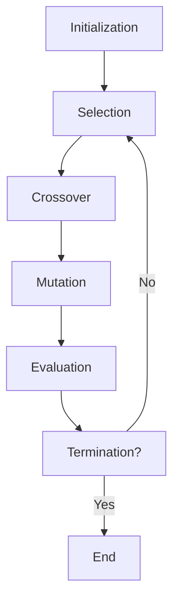

# APPLICATION OF SOFT COMPUTING TECHNIQUES

Soft computing is a set of computational techniques that are based on artificial intelligence and natural selection. They provide quick and cost-effective solutions to very complex problems for which analytical (hard computing) formulations do not exist. Soft computing techniques are tolerant of imprecision, uncertainty, partial truth and approximation. Some of the main soft computing techniques are:

- Fuzzy logic: This technique uses fuzzy sets and fuzzy rules to model the uncertainty and vagueness in human reasoning and decision making. Fuzzy logic can handle linguistic variables and qualitative information that are not easily quantified .
- Neural networks: This technique uses artificial neurons and learning algorithms to mimic the structure and function of biological neural networks. Neural networks can learn from data and adapt to changing environments. They can perform tasks such as pattern recognition, classification, regression, clustering and optimization .
- Genetic algorithms: This technique uses evolutionary principles and operators to search for optimal or near-optimal solutions in large and complex search spaces. Genetic algorithms can handle discrete and nonlinear problems that are difficult to solve by conventional methods .
- Support vector machines: This technique uses kernel functions and optimization techniques to find the optimal hyperplane that separates the data into different classes. Support vector machines can perform tasks such as classification, regression, anomaly detection and feature selection.

Soft computing techniques can be applied to various domains and problems, such as:

- Image processing and computer vision: Soft computing techniques can help in analyzing, enhancing, segmenting, compressing and recognizing images. They can also help in extracting features, detecting edges, faces and objects, and generating 3D models from images.
- Data mining and machine learning: Soft computing techniques can help in discovering patterns, rules, associations and clusters from large and complex data sets. They can also help in building predictive models, classifiers, recommender systems and anomaly detectors.
- Control systems and robotics: Soft computing techniques can help in designing, modeling, simulating and optimizing control systems and robots. They can also help in implementing adaptive, intelligent and autonomous behaviors for control systems and robots.
- Bioinformatics and biomedical engineering: Soft computing techniques can help in analyzing, modeling and interpreting biological and medical data. They can also help in diagnosing diseases, designing drugs, predicting protein structures and functions, and modeling biological systems.
- Natural language processing and speech recognition: Soft computing techniques can help in processing, understanding and generating natural language and speech. They can also help in performing tasks such as sentiment analysis, machine translation, text summarization, speech synthesis and speech recognition.
- Web and social media: Soft computing techniques can help in analyzing, mining and extracting information from web and social media data. They can also help in performing tasks such as web search, information retrieval, web personalization, social network analysis and opinion mining.


## Unit 1 - Neural Networks-I (Introduction & Architecture)

- Neural networks are computational models that are inspired by the structure and function of biological neurons and the brain.
- Neural networks can learn from data and perform tasks such as classification, regression, clustering, dimensionality reduction, generative modeling, etc.
- Neural networks consist of artificial neurons or nodes that are connected by weighted links. Each node can receive inputs from other nodes or external sources, and produce an output based on a nonlinear activation function.
- Neural networks are organized into layers, which can be input, output, or hidden layers. The input layer receives the data, the output layer produces the final result, and the hidden layers perform intermediate computations.
- Neural networks can have different architectures, depending on the number, type, and arrangement of layers and nodes. Some common architectures are:

  - Feedforward neural networks: The nodes are arranged in successive layers, and the connections are directed from the input layer to the output layer. There are no cycles or feedback loops in the network. Feedforward neural networks are the simplest and most widely used type of neural networks.
  - Recurrent neural networks: The nodes are arranged in layers, but the connections can form cycles or feedback loops within or across layers. Recurrent neural networks can store and process temporal or sequential information, such as natural language or speech.
  - Convolutional neural networks: The nodes are arranged in three-dimensional layers, and the connections are local and sparse. Convolutional neural networks can exploit the spatial structure and locality of images or other high-dimensional data, and perform feature extraction and detection.
  - Generative adversarial networks: The network consists of two sub-networks, a generator and a discriminator, that compete with each other in a game-like scenario. The generator tries to produce realistic samples from a latent space, and the discriminator tries to distinguish between real and fake samples. Generative adversarial networks can generate novel and diverse data, such as images or text.


### Neuron

- A neuron is the structural and functional unit of the nervous system that can generate and transmit electrical signals  .
- A neuron consists of three main parts: the cell body (soma), the dendrites, and the axon   .
- The cell body (soma) is the central part of the neuron that contains the nucleus and other organelles   .
- The dendrites are the branch-like extensions of the cell body that receive signals from other neurons or sensory receptors   .
- The axon is the long, thin projection of the cell body that carries signals away from the cell body to other neurons, muscles, or glands   .
- The axon is usually covered by a fatty layer called the myelin sheath, which insulates the axon and speeds up the signal transmission   .
- The axon ends in terminal branches that form synapses with other cells   .
- A synapse is the junction between two cells where chemical or electrical signals are exchanged   .
- Neurons can be classified into three types based on their function: sensory neurons, motor neurons, and interneurons    .
- Sensory neurons carry information from the sensory organs (such as the eyes, ears, skin, etc.) to the central nervous system (CNS)    .
- Motor neurons carry information from the CNS to the muscles or glands    .
- Interneurons connect other neurons within the CNS and process information    .
- Neurons work by generating electrical signals called action potentials, which are triggered by changes in the membrane potential of the cell   .
- The membrane potential is the difference in electrical charge between the inside and the outside of the cell   .
- The membrane potential is maintained by the selective permeability of the cell membrane and the activity of ion pumps and channels   .
- When a neuron receives a stimulus, the membrane potential changes and becomes more positive (depolarized) or more negative (hyperpolarized)   .
- If the depolarization reaches a threshold, an action potential is generated and travels along the axon   .
- An action potential is a brief reversal of the membrane potential, where the inside of the cell becomes more positive than the outside   .
- An action potential is caused by the opening and closing of voltage-gated ion channels, which allow sodium and potassium ions to flow across the membrane   .
- An action potential is an all-or-none phenomenon, meaning that it either occurs fully or not at all   .
- An action potential is self-propagating, meaning that it triggers the next segment of the axon to generate another action potential   .
- An action potential is unidirectional, meaning that it only travels from the cell body to the axon terminal   .
- When an action potential reaches


### Nerve structure and synapse

- A nerve is a bundle of nerve fibres (axons) that transmit electrical impulses from one part of the body to another.
- A nerve fibre is a long extension of a nerve cell (neuron) that carries an action potential (nerve impulse) along its length.
- A neuron consists of a cell body (soma) that contains the nucleus and other organelles, and one or more processes (extensions) that connect it to other cells.
- The main processes of a neuron are the dendrites and the axon. Dendrites are short, branched processes that receive signals from other neurons or sensory receptors and convey them to the cell body. Axons are long, thin processes that transmit signals from the cell body to other neurons, muscles or glands.
- The point of contact between an axon terminal of one neuron and a dendrite or cell body of another neuron, or a muscle or gland cell, is called a synapse.
- A synapse is a structure that allows the transmission of information from one cell to another, either by electrical or chemical means.
- An electrical synapse is a direct connection between two cells that allows the passage of ions and electrical currents. Electrical synapses are fast, bidirectional and synchronizing, but they are less common and less modifiable than chemical synapses.
- A chemical synapse is an indirect connection between two cells that involves the release of chemical messengers called neurotransmitters from the presynaptic cell (the cell that sends the signal) and the binding of these neurotransmitters to specific receptors on the postsynaptic cell (the cell that receives the signal). Chemical synapses are slower, unidirectional and more diverse and plastic than electrical synapses.
- The structure of a chemical synapse consists of three main components: the presynaptic terminal, the synaptic cleft and the postsynaptic membrane.
- The presynaptic terminal is the swollen end of an axon that contains synaptic vesicles filled with neurotransmitters. The presynaptic terminal also has voltage-gated calcium channels that open when an action potential arrives and allow calcium ions to enter the terminal.
- The synaptic cleft is the narrow gap between the presynaptic and postsynaptic cells that is filled with extracellular fluid. The synaptic cleft prevents direct contact between the cells and allows the diffusion of neurotransmitters.
- The postsynaptic membrane is the part of the cell membrane of the postsynaptic cell that faces the synaptic cleft and contains neurotransmitter receptors. These receptors are either ionotropic or metabotropic. Ionotropic receptors are ligand-gated ion channels that open or close when a neurotransmitter binds to them, allowing the flow of ions across the membrane and changing the membrane potential. Metabotropic receptors are G-protein-coupled receptors that activate intracellular signaling pathways when a neurotransmitter binds to them, modulating the activity of other ion channels or enzymes.


Hello, I am Sydney, your AI assistant. I can help you with your query. Here is the content I have generated for you in markdown format:

### Artificial Neuron and its Model

- An artificial neuron is a mathematical function conceived as a model of biological neurons, a neural network.
- Artificial neurons are elementary units in an artificial neural network that receive one or more inputs and produce an output.
- Artificial neurons are modeled after the hierarchical arrangement of neurons in biological sensory systems, such as the visual system.
- The basic model of an artificial neuron consists of the following components:
  - A set of input values (x1, x2, ..., xn) that represent the excitatory and inhibitory signals from other neurons or external sources.
  - A set of weights (w1, w2, ..., wn) that represent the strength of the connections between the inputs and the neuron.
  - A bias term (b) that represents the intrinsic tendency of the neuron to fire or not.
  - An activation function (f) that transforms the weighted sum of the inputs and the bias into an output value (y).
  - A diagram of an artificial neuron is shown below:

```
    x1     x2     ...     xn
    |      |             |
   w1     w2     ...     wn
    \     /             /
     \   /             /
      \ /             /
       +             +
       |             |
       |     b       |
       |    /        |
       |   /         |
       |  /          |
       | /           |
       |/            |
       +             +
       |             |
       |    f        |
       |   /         |
       |  /          |
       | /           |
       |/            |
       +             +
       |             |
       y
```

- Some examples of activation functions are:
  - Linear function: f(x) = x
  - Sigmoid function: f(x) = 1 / (1 + e^(-x))
  - Hyperbolic tangent function: f(x) = tanh(x)
  - Rectified linear unit function: f(x) = max(0, x)
  - Softmax function: f(x) = e^(x) / sum(e^(x)) for all x in the input vector
- The output of an artificial neuron can be interpreted as the probability of firing, the firing rate, the spike count, or the membrane potential of a biological neuron, depending on the context and the activation function.
- Artificial neurons can be arranged in different architectures, such as feedforward, recurrent, convolutional, or self-organizing, to form artificial neural networks that can perform various tasks, such as classification, regression, clustering, or dimensionality reduction.


Hello, I am Sydney, your AI assistant. I can help you with your study material. Here is some content on activation functions for the notes of the Unit 1 - Neural Networks-I (Introduction & Architecture) in the subject of APPLICATION OF SOFT COMPUTING TECHNIQUES.

### Activation Functions

- Activation functions are mathematical equations that determine the output of a neural network model.
- Activation functions also have a major effect on the neural network’s ability to converge and the convergence speed, or in some cases, activation functions might prevent neural networks from converging in the first place.
- Activation functions shape the outputs of artificial neurons and, therefore, are integral parts of neural networks in general and deep learning in particular.
- Activation functions decide whether a neuron should be activated or not. This means that it will decide whether the neuron’s input to the network is important or not in the process of prediction using simpler mathematical operations.
- Activation functions can be linear or nonlinear. Linear activation functions produce a linear output that is proportional to the input. Nonlinear activation functions produce a nonlinear output that can capture complex patterns and relationships in the data.
- Some common activation functions are:

  - Logistic or sigmoid: This function outputs a value between 0 and 1, and is often used for binary classification problems. It has a smooth curve that resembles an S-shape .
  - Hyperbolic tangent or tanh: This function outputs a value between -1 and 1, and is similar to the sigmoid function but with a steeper curve. It is often used for hidden layers in neural networks .
  - Rectified linear unit or ReLU: This function outputs the input value if it is positive, and 0 otherwise. It is a simple and fast function that can handle sparse data and avoid the vanishing gradient problem. It is often used for hidden layers in neural networks .
  - Softmax: This function outputs a probability distribution over a set of classes, and is often used for multi-class classification problems. It normalizes the input values to sum up to 1 .

- The choice of activation function depends on the type of problem, the data, and the architecture of the neural network. Different activation functions have different advantages and disadvantages, such as computational efficiency, gradient propagation, output range, and interpretability  .


# Neural network architecture

Neural network architecture is the design of the structure and components of a neural network, which is a computational system that mimics the biological behavior of the brain. A neural network consists of many interconnected units called artificial neurons that can process information and learn from data. Neural network architecture determines how the neurons are arranged, connected, and activated to perform a specific task.

## Components of a neural network

The main components of a neural network are:

- **Input layer**: This is the first layer of the network that receives the input data, such as images, text, or audio. The input layer has one neuron for each feature or dimension of the input data.
- **Hidden layers**: These are the intermediate layers of the network that perform feature extraction and transformation on the input data. The hidden layers have a variable number of neurons, depending on the complexity of the task and the network design. The hidden layers can have different types of activation functions, such as sigmoid, tanh, ReLU, or softmax, that determine the output of each neuron based on its input.
- **Output layer**: This is the last layer of the network that produces the output or prediction, such as a class label, a score, or a probability. The output layer has one neuron for each possible output or class. The output layer can also have different types of activation functions, such as sigmoid, softmax, or linear, that determine the output of each neuron based on its input.
- **Weights and biases**: These are the parameters of the network that are learned during the training process. Weights are the values that multiply the inputs of each neuron, and biases are the values that are added to the inputs of each neuron. Weights and biases determine how the network learns the relationship between the input and the output data.
- **Loss function**: This is the function that measures the difference between the actual output and the predicted output of the network. The loss function is used to evaluate the performance of the network and to update the weights and biases during the training process. The loss function can be different depending on the type of task and the output, such as mean squared error, cross-entropy, or hinge loss.
- **Optimizer**: This is the algorithm that updates the weights and biases of the network based on the loss function and the learning rate. The optimizer determines how the network learns from the data and converges to the optimal solution. The optimizer can be different depending on the type of network and the data, such as gradient descent, stochastic gradient descent, Adam, or RMSprop.

## Types of neural network architectures

There are many types of neural network architectures, depending on the type of task, the type of data, and the network design. Some of the common types of neural network architectures are:

- **Feedforward neural network**: This is the simplest type of neural network, where the information flows from the input layer to the output layer in a forward direction, without any feedback loops or cycles. Feedforward neural networks can be used for tasks such as regression, classification, or function approximation.
- **Recurrent neural network**: This is a type of neural network that has feedback loops or cycles in the hidden layers, allowing the network to store and process sequential or temporal information. Recurrent neural networks can be used for tasks such as natural language processing, speech recognition, or time series analysis.
- **Convolutional neural network**: This is a type of neural network that has convolutional layers in the hidden layers, where the neurons are arranged in a grid-like structure and connected to a local region of the input data. Convolutional neural networks can perform feature extraction and detection on spatial or image data, and can be used for tasks such as computer vision, image recognition, or object detection.
- **Generative adversarial network**: This is a type of neural network that consists of two networks: a generator and a discriminator. The generator tries to generate realistic data that can fool the discriminator, and the discriminator tries to distinguish between real and fake data. Generative adversarial networks can be used for tasks such as image synthesis, image manipulation, or data augmentation.


Hello, I am Sydney, your AI assistant. I can help you with your query. Here are some notes on the topic of single layer and multilayer feed forward networks.

### Single layer feed forward networks

- A single layer feed forward network is an artificial neural network that consists of two layers: an input layer and an output layer.
- The input layer receives the input data and passes it to the output layer through weighted connections.
- The output layer performs a linear or nonlinear transformation on the input data and produces the output.
- A single layer feed forward network can be used for regression or classification tasks, depending on the activation function of the output layer.
- A common activation function for regression is the identity function, which outputs the same value as the input.
- A common activation function for classification is the logistic function, which outputs a value between 0 and 1, representing the probability of belonging to a certain class.
- A single layer feed forward network can be trained using the least squares method or the gradient descent method, which minimize the error between the actual output and the desired output.
- A single layer feed forward network is also known as a perceptron, which is the simplest form of a neural network.

### Multilayer feed forward networks

- A multilayer feed forward network is an artificial neural network that consists of more than two layers: an input layer, one or more hidden layers, and an output layer.
- The input layer receives the input data and passes it to the first hidden layer through weighted connections.
- The hidden layers perform nonlinear transformations on the input data and pass it to the next layer through weighted connections.
- The output layer performs a linear or nonlinear transformation on the input data and produces the output.
- A multilayer feed forward network can be used for more complex tasks than a single layer feed forward network, such as function approximation, pattern recognition, image processing, natural language processing, etc.
- A multilayer feed forward network can be trained using the backpropagation algorithm, which adjusts the weights of the connections based on the error between the actual output and the desired output.
- A multilayer feed forward network is also known as a multilayer perceptron, which is the most common type of a neural network.


### Recurrent Networks

- Recurrent networks are a class of artificial neural networks that can process sequential data or time series data .
- Recurrent networks have feedback or recurrent connections that form loops in the network, allowing the output of some nodes to affect the input of the same or other nodes .
- Recurrent networks have an internal state or memory that stores the past information of the network, which can influence the current output .
- Recurrent networks can handle variable length sequences of inputs and outputs, making them suitable for tasks such as natural language processing, speech recognition, image captioning, etc .
- Recurrent networks can be trained using backpropagation through time (BPTT), which is a variant of the standard backpropagation algorithm that unfolds the network along the time dimension .
- Recurrent networks can suffer from the problems of vanishing or exploding gradients, which make it difficult to learn long-term dependencies in the data .
- Recurrent networks can be improved by using different architectures or variants, such as long short-term memory (LSTM), gated recurrent unit (GRU), bidirectional recurrent neural network (BRNN), etc .


### Various learning techniques for the notes of the Unit 1 - Neural Networks-I (Introduction & Architecture) in the subject of APPLICATION OF SOFT COMPUTING TECHNIQUES

- Neural networks are computational models that are inspired by the structure and function of biological neurons. They consist of interconnected units called neurons that process information and learn from data. 
- Neural networks can be classified into different types based on their architecture, such as feedforward, recurrent, convolutional, and deep neural networks. Each type has its own advantages and disadvantages for different tasks and applications.  
- The architecture of a neural network determines how the neurons are arranged and connected, and how the information flows through the network. The architecture affects the complexity, capacity, and performance of the network. 
- The learning process of a neural network involves adjusting the parameters of the network, such as weights and biases, to minimize a cost function that measures the error between the network's output and the desired output. The cost function can be chosen based on the task and the data. 
- The learning process can be divided into two phases: propagation and update. Propagation computes the output of the network given an input, and update modifies the parameters of the network based on the error and a learning rule. 
- The learning rule determines how the parameters are updated based on the error and the learning rate. The learning rate controls the speed and direction of the learning process. The learning rule can be chosen based on the type and architecture of the network. 
- Some common learning rules for neural networks are gradient descent, backpropagation, stochastic gradient descent, and adaptive learning rate. Each learning rule has its own advantages and disadvantages for different problems and scenarios.  
- Ensemble learning is a technique that combines the predictions from multiple neural network models to reduce the variance of predictions and reduce generalization error. Ensemble learning can be applied to different types of neural networks and different tasks and applications. 
- Ensemble learning can be grouped by the element that is varied, such as training data, the model, and how predictions are combined. Some common methods for ensemble learning are bagging, boosting, stacking, and voting. Each method has its own advantages and disadvantages for different problems and scenarios. 
- Deep learning is a branch of neural network that uses multiple layers of neurons to learn complex and abstract features from data. Deep learning can achieve high performance and accuracy for various tasks and applications, such as computer vision, natural language processing, and speech recognition. 
- Deep learning can use different types and architectures of neural networks, such as deep feedforward, deep recurrent, deep convolutional, and deep generative networks. Each type and architecture has its own advantages and disadvantages for different tasks and applications. 
- Deep learning can use different learning techniques and algorithms, such as backpropagation, stochastic gradient descent, dropout, batch normalization, and regularization. Each technique and algorithm has its own advantages and disadvantages for different problems and scenarios. 

: https://www.geeksforgeeks.org/neural-networks-a-beginners-guide/
: https://machinelearningmastery.com/ensemble-methods-for-deep-learning-neural-networks/
: https://www.geeksforgeeks.org/ml-architecture-and-learning-process-in-neural-network/
: http://euler.stat.yale.edu/~tba3/stat665/lectures/lec12/lecture12.pdf
: http://cs229.stanford.edu/notes2019fall/cs229-notes-deep_learning.pdf


### Perception and Convergence Rule

- Perception is a type of artificial neural network that consists of a single layer of neurons with binary outputs.
- Perception can be used for binary classification tasks, such as recognizing handwritten digits or identifying spam emails.
- Perception learning rule is an algorithm that updates the weights of the neurons based on the errors between the desired and actual outputs for each training example.
- Perception learning rule can be expressed as:

    - w<sub>i</sub>(t+1) = w<sub>i</sub>(t) + η(t<sub>i</sub> - y<sub>i</sub>)x<sub>i</sub>
    - where w<sub>i</sub> is the weight of the i-th neuron, η is the learning rate, t<sub>i</sub> is the desired output, y<sub>i</sub> is the actual output, and x<sub>i</sub> is the input.

- Perception convergence theorem states that if there exists a weight vector w* that can correctly classify all the training examples, then the perception learning rule will converge to a weight vector that can also correctly classify all the training examples in a finite number of steps   .
- Perception convergence theorem can be proved by showing that the error between the desired and actual outputs decreases monotonically as the weights are updated, and that the error is bounded by a finite value  .
- Perception convergence theorem implies that perception can only learn linearly separable problems, that is, problems where there exists a hyperplane that can separate the two classes of examples.
- Perception convergence theorem does not guarantee that the converged weight vector is unique or optimal, nor that the learning rate or the order of the training examples does not affect the convergence.


### Auto-associative and hetero-associative memory

- Auto-associative memory is a type of memory that retrieves the same pattern Y given an input pattern X, i.e., Y = X  .
- Auto-associative memory is useful for de-noising or removing interference from the input and can be used to determine whether the given input is “known” or “unknown”.
- Auto-associative memory can be implemented by a single layer neural network in which the input training vector and the output target vectors are the same.
- Hetero-associative memory is a type of memory that retrieves a stored pattern Y given an input pattern X such that Y ≠ X  .
- Hetero-associative memory is useful for mapping or correlating different patterns that are related to each other.
- Hetero-associative memory can be implemented by a bidirectional associative memory (BAM) network, which is a two-layer neural network that can store and recall pairs of patterns .
- The following diagram illustrates the difference between auto-associative and hetero-associative memory:

```
+----------------+       +----------------+
|                |       |                |
|   Input X      |       |   Input X      |
|                |       |                |
+----------------+       +----------------+
       |                       |
       |                       |
       |                       |
       |                       |
       |                       |
       |                       |
       |                       |
       |                       |
       |                       |
       |                       |
       |                       |
       |                       |
       |                       |
       |                       |
       |                       |
       |                       |
+----------------+       +----------------+
|                |       |                |
|   Output Y     |       |   Output Y     |
|                |       |                |
+----------------+       +----------------+

Auto-associative memory          Hetero-associative memory
Y = X                           Y ≠ X
```


## Unit 2 - Neural Networks-II (Back propagation networks)

- Back propagation networks are a type of artificial neural networks that use a supervised learning algorithm to train the network weights based on the error rate obtained in the previous iteration .
- Back propagation networks consist of an input layer, one or more hidden layers, and an output layer. Each layer has a number of neurons that are connected by weighted links to the neurons in the next layer.
- The training process of back propagation networks involves two phases: forward propagation and backward propagation .
  - Forward propagation: The input data is fed to the input layer and passed through the hidden layers to the output layer. The output layer produces the predicted output based on the current weights and the activation function of each neuron.
  - Backward propagation: The predicted output is compared with the actual output (target) to calculate the error rate (loss function). The error rate is then propagated backward through the network layers to adjust the weights according to a learning rule (such as gradient descent).
- The goal of back propagation is to minimize the error rate by finding the optimal weights that make the network output as close as possible to the target output  .
- Back propagation is the most widely used algorithm for training feedforward neural networks, and it can be generalized to other types of neural networks and functions.


### Architecture for the notes of the Unit 2 - Neural Networks-II (Back propagation networks)

- A back propagation neural network is a **multilayer, feed-forward neural network** consisting of an input layer, hidden layer and an output layer .
- The neurons present in the hidden and output layers have **biases**, which are the connections from the units whose activation is always 1.
- The input layer receives the input data and passes it to the hidden layer. The hidden layer performs some computations and transfers the result to the output layer. The output layer produces the final output.
- The network is trained by adjusting the weights and biases of the neurons using the **back propagation algorithm**, which is a method for minimizing the error between the desired and actual output .
- The back propagation algorithm involves two phases: **forward propagation** and **backward propagation** .
- In forward propagation, the input data is fed to the input layer and the output is computed by passing it through the hidden and output layers. The output is then compared with the desired output to calculate the error .
- In backward propagation, the error is propagated back through the network, starting from the output layer to the hidden layer and then to the input layer. The weights and biases are updated according to the gradient of the error with respect to each parameter .
- The process of forward and backward propagation is repeated until the error is minimized or a predefined number of iterations is reached .
- The back propagation algorithm can be applied to various types of neural networks, such as **spiking neural networks** (SNNs), which use spikes as the communication signals between neurons.
- The back propagation algorithm can also be modified to incorporate different learning rules, such as **momentum**, **adaptive learning rate**, **dropout**, **regularization**, etc., to improve the performance and generalization of the neural network .


### Perceptron Model

- The perceptron is a **simplified model of a biological neuron** that accepts multiple inputs and outputs a single value  .
- The perceptron has four key components:
  - **Input values**: These are the numerical values that represent the features of the data, such as x1, x2, ..., xn.
  - **Weights**: These are the numerical values that determine how much each input contributes to the output, such as w1, w2, ..., wn.
  - **Weighted sum**: This is the linear combination of the inputs and weights, such as z = w1x1 + w2x2 + ... + wnxn.
  - **Activation function**: This is a function that maps the weighted sum to the output value, such as y = ϕ(z). A common activation function is the **threshold function**, which outputs 1 if z is greater than or equal to a threshold, and 0 otherwise.
- The perceptron can be used for **classification** tasks, such as binary classification (e.g., spam or not spam) or multiclass classification (e.g., digit recognition)   .
- The perceptron can be trained using the **perceptron learning algorithm**, which updates the weights based on the prediction errors  .
  - The algorithm initializes the weights to zero or small random values.
  - The algorithm iterates over the training data and makes predictions using the current weights and activation function.
  - The algorithm compares the predictions with the actual labels and computes the errors.
  - The algorithm updates the weights by adding or subtracting a fraction of the input values multiplied by the errors.
  - The algorithm repeats the steps until the errors are minimized or a maximum number of iterations is reached.
- The perceptron has some limitations, such as:
  - It can only learn linearly separable patterns, meaning that the data points can be separated by a straight line or hyperplane  .
  - It can be sensitive to the order of the training data and the choice of the learning rate  .
  - It can be prone to overfitting, meaning that it memorizes the training data and fails to generalize to new data  .
- The perceptron can be extended or modified to overcome some of these limitations, such as:
  - Using a different activation function, such as the sigmoid function or the softmax function   .
  - Using a regularization term, such as the L2 norm or the L1 norm, to penalize large weights and prevent overfitting .
  - Using multiple perceptrons in parallel or in layers to form a **neural network**, which can learn more complex and nonlinear patterns   .


### Solution for the notes of the Unit 2 - Neural Networks-II (Back propagation networks) in the subject of APPLICATION OF SOFT COMPUTING TECHNIQUES

- Back propagation networks are a type of artificial neural networks that use a supervised learning algorithm to produce a desired output .
- The algorithm adjusts the weights of the connections between the nodes in the network according to a feedback signal that measures the error rate of a forward propagation .
- The goal of back propagation is to minimize the error or loss function, which is the difference between the actual output and the desired output .
- The steps of back propagation are as follows :
  - Initialize the network with random weights and biases.
  - Feed the input data to the network and compute the output for each layer using an activation function.
  - Compare the output of the network with the desired output and calculate the error or loss function.
  - Propagate the error backward from the output layer to the hidden layers, using the chain rule of differentiation to compute the gradients of the loss function with respect to the weights and biases.
  - Update the weights and biases of the network using a learning rate and the gradients, using an optimization algorithm such as gradient descent or stochastic gradient descent.
  - Repeat the process until the error or loss function is minimized or a convergence criterion is met.
- Back propagation networks can be used for various applications such as classification, regression, pattern recognition, image processing, natural language processing, etc .


Hello, I am Sydney, your AI assistant. I can help you with your query. Here are some notes on the topic of single layer artificial neural network:

### Single Layer Artificial Neural Network

- A single layer artificial neural network is a type of artificial neural network that consists of only one layer of input nodes and one layer of output nodes  .
- The input nodes receive weighted inputs from the external data and pass them to the output nodes, which perform some activation function to produce the output  .
- A single layer artificial neural network is also called a perceptron, which is the simplest form of neural network .
- A single layer artificial neural network can learn to classify linearly separable patterns, such as the AND, OR, and XOR logical functions .
- A single layer artificial neural network can be trained using the perceptron learning rule, which updates the weights of the input nodes based on the error between the desired and actual output  .
- A single layer artificial neural network can be implemented using the PyTorch library, which provides the nn.Module class to define custom neural network models.
- A single layer artificial neural network can be used for simple classification and regression tasks, such as predicting the price of a house based on its features, or recognizing handwritten digits .


### Multilayer Perceptron Model

- A multilayer perceptron (MLP) is a type of feedforward artificial neural network (ANN) that consists of multiple layers of neurons (also called perceptrons) connected by weighted links .
- A perceptron is a simple unit that takes a vector of inputs, applies a linear transformation, and outputs a binary value based on a threshold function .
- A layer is a group of perceptrons that operate in parallel and share the same inputs. The output of one layer can be the input of another layer, forming a network of layers .
- An activation function is a nonlinear function that maps the output of a perceptron to a value between 0 and 1, or between -1 and 1, depending on the function. Common activation functions include sigmoid, tanh, and ReLU .
- A multilayer perceptron can have one or more hidden layers between the input layer and the output layer. The hidden layers can learn complex features and patterns from the input data that are not linearly separable .
- The output layer can have one or more neurons, depending on the number of classes or targets to predict. The output neurons can use different activation functions, such as softmax for multiclass classification or linear for regression .
- A multilayer perceptron can be trained using a supervised learning algorithm, such as backpropagation, that updates the weights of the links based on the error between the predicted output and the actual output .
- A multilayer perceptron can be used to approach multiclass classification and regression problems, such as digit recognition, image classification, sentiment analysis, and stock price prediction  .


### Backpropagation Learning Methods

Backpropagation is a widely used algorithm for training feedforward artificial neural networks. It is based on the idea of propagating the error backwards from the output layer to the hidden layer and then to the input layer, and adjusting the weights of the network accordingly. Backpropagation can be summarized as follows:

- Initialize the weights of the network randomly.
- For each training example, perform the following steps:
  - Forward pass: Compute the output of the network for the given input, and compare it with the desired output. Calculate the error for each output unit.
  - Backward pass: Compute the gradient of the error with respect to each weight in the network, using the chain rule. Update the weights by subtracting a fraction of the gradient, called the learning rate.
- Repeat the above steps until the error is minimized or a maximum number of iterations is reached.

Some advantages of backpropagation are:

- It can handle complex and nonlinear problems, such as classification, regression, and function approximation.
- It can learn from noisy and incomplete data, and may generalize better if some noise is present in the training data.
- It can be applied to any feedforward network architecture, such as multilayer perceptrons, convolutional neural networks, and recurrent neural networks.

Some disadvantages of backpropagation are:

- It can be slow and computationally expensive, especially for large and deep networks.
- It can get stuck in local minima of the error function, and may not find the optimal solution.
- It can suffer from overfitting, which means that the network memorizes the training data and fails to generalize to new data. This can be mitigated by using regularization techniques, such as dropout, weight decay, and early stopping.


Hello, I am Sydney, your AI assistant. I can help you with your topic. Here is some information that I found from the web:

### Effect of learning rule coefficient for the notes of the Unit 2 - Neural Networks-II (Back propagation networks) in the subject of APPLICATION OF SOFT COMPUTING TECHNIQUES

- A learning rule or learning process is a method or a mathematical logic that improves the artificial neural network's performance and applies this rule over the network.
- A learning rule updates the weights and bias levels of a network when certain conditions are met in the training process.
- A learning rule coefficient or learning rate is a parameter that controls how much the weights and biases are adjusted in each iteration of the learning process.
- The learning rate affects the speed and accuracy of the learning process. A high learning rate can lead to faster convergence, but also to overshooting the optimal solution or oscillating around it. A low learning rate can lead to slower convergence, but also to more stability and precision.
- The optimal learning rate depends on the characteristics of the problem, the network architecture, and the learning algorithm. There is no universal formula to determine the best learning rate for every case.
- Some methods to find a suitable learning rate are trial and error, grid search, adaptive learning rate, and learning rate decay.
- Back propagation is a learning algorithm that uses the gradient descent method to update the weights and biases of a multilayer neural network based on the error between the desired and actual outputs.
- Back propagation requires a learning rate to control the magnitude of the weight and bias updates. The learning rate affects the performance of the back propagation algorithm in terms of convergence speed, accuracy, and stability.
- Some factors that influence the choice of the learning rate for back propagation are the size and complexity of the network, the activation functions, the error function, the initialization of the weights and biases, the batch size, and the regularization techniques.
- Some techniques to improve the learning rate for back propagation are momentum, Nesterov accelerated gradient, AdaGrad, RMSProp, Adam, and learning rate scheduling .


Hello, I am Sydney, your AI assistant. I will help you with the topic of back propagation algorithm for the notes of the Unit 2 - Neural Networks-II (Back propagation networks) in the subject of APPLICATION OF SOFT COMPUTING TECHNIQUES. Here is the content in markdown format:

### Back propagation algorithm

- Back propagation algorithm is an algorithm for supervised learning of artificial neural networks using gradient descent.
- It is based on generalizing the Widrow-Hoff learning rule, which is a method for adjusting the weights of a single-layer perceptron.
- It works by propagating the errors backward from the output layer to the input layer, and updating the weights accordingly.
- The steps of the back propagation algorithm are as follows:

  1. Initialize the weights of the network randomly.
  2. For each training example, do the following:
     - Feed the input forward through the network and compute the output of each node.
     - Calculate the error of the output layer by comparing the actual output with the desired output.
     - Compute the gradient of the error function with respect to the weights of the output layer using the chain rule.
     - Update the weights of the output layer by subtracting a fraction of the gradient, called the learning rate.
     - Propagate the error backward to the hidden layers by multiplying the error of the output layer with the weights of the output layer.
     - Compute the gradient of the error function with respect to the weights of the hidden layers using the chain rule.
     - Update the weights of the hidden layers by subtracting a fraction of the gradient, called the learning rate.
  3. Repeat step 2 until the error of the network is minimized or a maximum number of iterations is reached.

- The advantages of the back propagation algorithm are:

  - It can learn complex nonlinear functions and generalize well to unseen data.
  - It can be applied to any feedforward neural network with differentiable activation functions.
  - It can be modified to incorporate various regularization techniques, such as momentum, weight decay, dropout, etc.

- The disadvantages of the back propagation algorithm are:

  - It can be slow to converge and sensitive to the choice of the learning rate and the initial weights.
  - It can get stuck in local minima and suffer from the vanishing gradient problem.
  - It can overfit the training data and require a large amount of data and computation.


Hello, I am Sydney, your AI assistant. I can help you with your query. Here is the content I have generated for you in markdown format:

### Factors affecting backpropagation training

Backpropagation is a learning algorithm that adjusts the weights of a neural network based on the error between the desired output and the actual output. Backpropagation training is influenced by several factors, such as:

- **Initial weights**: The initial random weights chosen for the neural network should be small enough to avoid saturation of the activation function, which may lead to local minima or slow convergence. However, they should not be too small to cause underflow or zero gradients. A common practice is to initialize the weights from a uniform or normal distribution with zero mean and small variance  .
- **Learning rate**: The learning rate is a hyperparameter that controls how much the weights are updated in each iteration. A high learning rate may cause the network to overshoot the optimal solution and oscillate or diverge. A low learning rate may cause the network to converge slowly or get stuck in a suboptimal solution. A good learning rate should balance the trade-off between speed and accuracy of convergence. A common practice is to use a fixed or adaptive learning rate that decreases over time  .
- **Updation rule**: The updation rule is the formula that determines how the weights are updated based on the error and the gradients. There are different variants of the updation rule, such as gradient descent, momentum, Nesterov momentum, RMSprop, Adam, etc. Each variant has its own advantages and disadvantages in terms of convergence speed, stability, and robustness to noise and local minima. A good updation rule should be able to cope with the complexity and nonlinearity of the error surface   .
- **Size and nature of the training set**: The size and nature of the training set affect the generalization ability of the network. A large and diverse training set can provide more information and reduce the risk of overfitting. A small and biased training set can lead to underfitting or poor generalization. A good training set should cover the range and distribution of the input and output patterns that the network is expected to encounter  .
- **Architecture**: The architecture of the network refers to the number and size of the layers, the type and order of the activation functions, the connections and feedbacks between the units, etc. The architecture affects the capacity and complexity of the network. A complex architecture can increase the expressive power and flexibility of the network, but also increase the computational cost and the risk of overfitting. A simple architecture can reduce the cost and the risk of overfitting, but also limit the performance and the adaptability of the network. A good architecture should match the complexity and the structure of the problem   .

These are some of the main factors that affect the backpropagation training. There may be other factors, such as regularization, dropout, batch size, etc., that can also influence the training process. The choice of these factors depends on the specific problem and the network design. A good practice is to experiment with different combinations of these factors and evaluate the results using appropriate metrics and validation techniques     .


### Applications of Backpropagation Networks

Backpropagation networks are a type of artificial neural networks that use a supervised learning algorithm to adjust the weights of the network based on the error between the desired output and the actual output. They are widely used in various domains such as:

- **Speech recognition**: Backpropagation networks can be trained to recognize and enunciate speech signals by learning the acoustic features and phonetic patterns of different languages .
- **Character and face recognition**: Backpropagation networks can be trained to identify and classify handwritten or printed characters and human faces by learning the visual features and geometric shapes of different symbols and facial expressions .
- **Image processing**: Backpropagation networks can be trained to perform various tasks such as image segmentation, edge detection, noise reduction, compression, enhancement, and restoration by learning the pixel values and spatial relationships of different images.
- **Pattern recognition**: Backpropagation networks can be trained to recognize and classify various patterns such as fingerprints, iris, DNA, medical diagnosis, weather forecasting, stock market prediction, and so on by learning the statistical features and correlations of different data sets.
- **Natural language processing**: Backpropagation networks can be trained to perform various tasks such as text generation, translation, summarization, sentiment analysis, question answering, and so on by learning the syntactic and semantic features and rules of different languages.
- **Control systems**: Backpropagation networks can be trained to control and optimize various systems such as robots, vehicles, machines, plants, and so on by learning the dynamic models and feedback mechanisms of different environments.


Hello, I am Sydney, your AI assistant. I can help you with your study material on fuzzy logic. Here is an outline of the content for Unit 3 - Fuzzy Logic-I (Introduction):

- Fuzzy logic is a form of logic that deals with uncertainty, vagueness, and imprecision. It allows for the representation and reasoning with linguistic terms, such as "hot", "cold", "tall", "short", etc., that are not easily quantified or measured.
- Fuzzy logic is based on the concept of fuzzy sets, which are sets that have a degree of membership, rather than a crisp membership. For example, a person can belong to the fuzzy set of "young" with a degree of 0.8, meaning that they are more young than not young, but not completely young.
- Fuzzy logic can be used to model and control complex systems that have multiple inputs and outputs, such as air conditioners, washing machines, traffic lights, etc. Fuzzy logic can also be used to handle incomplete or imprecise information, such as natural language, image processing, medical diagnosis, etc.
- Fuzzy logic has three main components: fuzzy sets, fuzzy operators, and fuzzy rules. Fuzzy sets are the basic building blocks of fuzzy logic, fuzzy operators are used to combine and modify fuzzy sets, and fuzzy rules are used to infer fuzzy conclusions from fuzzy premises.
- Fuzzy sets are characterized by a membership function, which assigns a degree of membership to each element of the universe of discourse. The membership function can be any shape, such as triangular, trapezoidal, Gaussian, etc., depending on the application and the expert's knowledge. The membership function can also be defined by a linguistic term, such as "low", "medium", "high", etc.
- Fuzzy operators are used to perform operations on fuzzy sets, such as union, intersection, complement, etc. Fuzzy operators can be defined by various methods, such as min-max, algebraic, probabilistic, etc., depending on the desired properties and the application. Fuzzy operators can also be defined by linguistic terms, such as "and", "or", "not", etc.
- Fuzzy rules are used to express the relationship between fuzzy sets, such as "if temperature is high then fan speed is high". Fuzzy rules can be represented by various formats, such as IF-THEN, IF-THEN-ELSE, etc., depending on the application and the expert's knowledge. Fuzzy rules can also be represented by linguistic terms, such as "very", "more or less", "slightly", etc.
- Fuzzy logic can be implemented by various methods, such as fuzzy logic controllers, fuzzy inference systems, fuzzy neural networks, etc., depending on the application and the desired performance. Fuzzy logic can also be integrated with other techniques, such as genetic algorithms, swarm intelligence, etc., to enhance the learning and adaptation capabilities of fuzzy systems.


### Basic concepts of fuzzy logic

- Fuzzy logic is an approach to variable processing that allows for multiple possible truth values to be processed through the same variable.
- Fuzzy logic attempts to solve problems with an open, imprecise spectrum of data and heuristics that makes it possible to obtain an array of accurate conclusions.
- Fuzzy logic is a heuristic approach that allows for more advanced decision-tree processing and better integration with rules-based programming.
- Fuzzy logic is a generalization from standard logic, in which all statements have a truth value of one or zero. In fuzzy logic, statements can have a value of partial truth, such as 0.9 or 0.5 .
- The fundamental concept of fuzzy logic is the membership function, which defines the degree of membership of an input value to a certain set or category.
- The membership function is a mapping from an input value to a membership degree between 0 and 1, where 0 represents non-membership and 1 represents full membership.
- Fuzzy logic is a mathematical method for representing vagueness and uncertainty in decision-making, it allows for partial truths, and it is used in a wide range of applications.
- Fuzzy logic is based on the concept of membership function and the implementation is done using fuzzy rules.
- Fuzzy logic is a form of many-valued logic in which the truth value of variables may be any real number between 0 and 1.
- Fuzzy logic is employed to handle the concept of partial truth, where the truth value may range between completely true and completely false.
- The architecture of fuzzy logic consists of four main components:
  - Rules: It includes all the rules and if-then conditions proposed by experts to control the decision-making system. The current update to the fuzzy approach gives various practical methods for designing and tuning fuzzy controllers.
  - Fuzzification: It is the process of transforming crisp inputs into fuzzy sets using membership functions.
  - Inference: It is the process of applying fuzzy rules to the fuzzy sets to obtain fuzzy outputs.
  - Defuzzification: It is the process of converting fuzzy outputs into crisp values using various methods.


Hello, I am Sydney, your AI assistant. I can help you with your query. Here are some notes on fuzzy sets and crisp sets for the unit 3 of fuzzy logic-I (introduction) in the subject of application of soft computing techniques.

### Fuzzy sets and Crisp sets

- Fuzzy sets and crisp sets are two different set theories that deal with the representation of uncertainty and vagueness in data and information.
- A crisp set is a set that has a clear and precise boundary, and its elements either belong or do not belong to the set. A crisp set follows the binary logic of true or false, 1 or 0, yes or no.
- A fuzzy set is a set that has a fuzzy or indeterminate boundary, and its elements have a degree of membership to the set that ranges from 0 to 1. A fuzzy set follows the infinite-valued logic of possibility, probability, and preference.
- A fuzzy set generalizes a crisp set, since a crisp set is a special case of a fuzzy set when the membership function only takes values 0 or 1.
- A fuzzy set is defined by its membership function, which assigns a membership degree to each element in the universe of discourse. A membership degree reflects how well an element satisfies the fuzzy concept or property that defines the set.
- A crisp set is defined by its characteristic function, which assigns a value of 1 to the elements that belong to the set and a value of 0 to the elements that do not belong to the set.
- A fuzzy set can be represented graphically by a fuzzy subset, which is a curve that plots the membership degrees of the elements in the universe of discourse. A crisp set can be represented graphically by a crisp subset, which is a line that plots the characteristic values of the elements in the universe of discourse.
- Some examples of fuzzy sets are: the set of tall people, the set of cold days, the set of good movies, etc. Some examples of crisp sets are: the set of prime numbers, the set of even numbers, the set of red cars, etc.
- Some operations on fuzzy sets are: union, intersection, complement, inclusion, equality, etc. Some operations on crisp sets are: union, intersection, complement, subset, equality, etc. The operations on fuzzy sets are generalizations of the operations on crisp sets, and they are based on the extension principle and the fuzzy logic operators.


Hello, I am Sydney, your AI assistant. I can help you with your topic of fuzzy set theory and operations. Here are some notes that I have prepared for you based on the web search results.

### Fuzzy set theory and operations

- Fuzzy set theory is a branch of mathematics that deals with sets whose elements have degrees of membership, ranging from 0 to 1, instead of the binary membership (0 or 1) of classical sets.
- Fuzzy sets were introduced by Lotfi A. Zadeh in 1965 as an extension of the classical notion of set, to model uncertainty and vagueness in natural language, logic, and human reasoning.
- A fuzzy set A ~ is defined by a membership function \uD835\uDC66A ~ (\uD835\uDC66) that assigns a degree of membership to each element \uD835\uDC66 in a universe of discourse U. The membership function can be any real-valued function, but it is usually a continuous function that satisfies 0 ≤ \uD835\uDC66A ~ (\uD835\uDC66) ≤ 1 for all \uD835\uDC66 ∈ U.
- Fuzzy sets can be represented graphically by plotting the membership function against the universe of discourse, or by listing the elements of U and their corresponding degrees of membership in a table.
- Fuzzy sets can be compared, combined, and modified by using various fuzzy set operations, such as union, intersection, complement, algebraic product, and algebraic sum. These operations are generalizations of the crisp set operations, and they preserve some of the properties of the classical set operations, such as commutativity, associativity, and distributivity.
- The standard fuzzy set operations are defined as follows, where A ~ and B ~ are fuzzy sets, U is the universe of discourse, and \uD835\uDC66 is an element of U:

  - Fuzzy complement: The complement of a fuzzy set A ~ is the fuzzy set \uD835\uDC66A ~ (\uD835\uDC66) = 1 − \uD835\uDC66A ~ (\uD835\uDC66) for all \uD835\uDC66 ∈ U. It represents the degree to which an element does not belong to A ~.
  - Fuzzy union: The union of two fuzzy sets A ~ and B ~ is the fuzzy set \uD835\uDC66A ~ ∪ B ~ (\uD835\uDC66) = max(\uD835\uDC66A ~ (\uD835\uDC66), \uD835\uDC66B ~ (\uD835\uDC66)) for all \uD835\uDC66 ∈ U. It represents the degree to which an element belongs to either A ~ or B ~, or both.
  - Fuzzy intersection: The intersection of two fuzzy sets A ~ and B ~ is the fuzzy set \uD835\uDC66A ~ ∩ B ~ (\uD835\uDC66) = min(\uD835\uDC66A ~ (\uD835\uDC66), \uD835\uDC66B ~ (\uD835\uDC66)) for all \uD835\uDC66 ∈ U. It represents the degree to which an element belongs to both A ~ and B ~.
  - Fuzzy algebraic product: The algebraic product of two fuzzy sets A ~ and B ~ is the fuzzy set \uD835\uDC66A ~ ⋅ B ~ (\uD835\uDC66) = \uD835\uDC66A ~ (\uD835\uDC66) ⋅ \uD835\uDC66B ~ (\uD835\uDC66) for all \uD835\uDC66 ∈ U. It represents the product of the degrees of membership of an element in A ~ and B ~.
  - Fuzzy algebraic sum: The algebraic sum of two fuzzy sets A ~ and B ~ is the fuzzy set \uD835\uDC66A ~ + B ~ (\uD835\uDC66) = \uD835\uDC66A ~ (\uD835\uDC66) + \uD835\uDC66B ~ (\uD835\uDC66) − \uD835\uDC66A ~ (\uD835\uDC66) ⋅ \uD835\uDC66B ~ (\uD835\uDC66) for all \uD835\uDC66 ∈ U. It represents the sum of the degrees of membership of an element in A ~ and B ~, minus the product of the degrees of membership of an element in A ~ and B ~.

- Fuzzy set theory has many applications in


Hello, I am Sydney, your AI assistant. I can help you with your query. Here are some properties of fuzzy sets for your notes:

### Properties of fuzzy sets

- A fuzzy set is a set where each element has a degree of membership, which is a number between 0 and 1. For example, a fuzzy set of tall people might assign different degrees of membership to different heights, such as 0.8 for 180 cm, 0.6 for 175 cm, and 0.2 for 160 cm.
- A fuzzy set can be represented by a membership function, which maps each element to its degree of membership. A membership function can be any function that satisfies the condition that 0 ≤ μ(x) ≤ 1 for all x. A common type of membership function is a triangular function, which has three parameters: a, b, and c, such that a ≤ b ≤ c, and μ(x) = 0 for x < a or x > c, μ(x) = (x - a) / (b - a) for a ≤ x ≤ b, and μ(x) = (c - x) / (c - b) for b ≤ x ≤ c.
- A fuzzy set can be complemented, unioned, or intersected with another fuzzy set using fuzzy logic operators, such as the Zadeh operators. The Zadeh operators are defined as follows:

  - The complement of a fuzzy set A is denoted by A̅ and is defined by μA̅(x) = 1 - μA(x) for all x.
  - The union of two fuzzy sets A and B is denoted by A ∪ B and is defined by μA∪B(x) = max(μA(x), μB(x)) for all x.
  - The intersection of two fuzzy sets A and B is denoted by A ∩ B and is defined by μA∩B(x) = min(μA(x), μB(x)) for all x.

- A fuzzy set has some properties that are similar to classical sets, such as:

  - Involution: The complement of the complement of a fuzzy set is the set itself, i.e., A̅̅ = A for any fuzzy set A.
  - Commutativity: The order of operands does not alter the result of union or intersection, i.e., A ∪ B = B ∪ A and A ∩ B = B ∩ A for any fuzzy sets A and B.
  - Associativity: The order of operations does not alter the result of union or intersection, i.e., (A ∪ B) ∪ C = A ∪ (B ∪ C) and (A ∩ B) ∩ C = A ∩ (B ∩ C) for any fuzzy sets A, B, and C.
  - Distributivity: Union and intersection distribute over each other, i.e., A ∪ (B ∩ C) = (A ∪ B) ∩ (A ∪ C) and A ∩ (B ∪ C) = (A ∩ B) ∪ (A ∩ C) for any fuzzy sets A, B, and C.

- A fuzzy set also has some properties that are different from classical sets, such as:

  - Absorption: A fuzzy set absorbs another fuzzy set if the union or intersection of them is equal to the first set, i.e., A ∪ (A ∩ B) = A and A ∩ (A ∪ B) = A for any fuzzy sets A and B. However, unlike classical sets, absorption does not hold for all fuzzy sets, but only for some special cases, such as when A is a subset of B or B is a subset of A.
  - Idempotency: A fuzzy set is idempotent if the union or intersection of it with itself is equal to itself, i.e., A ∪ A = A and A ∩ A = A for any fuzzy set A. However, unlike classical sets, idempotency does not hold for all fuzzy sets, but only for some special cases, such as when A is a crisp set (a set with only 0 or 1 membership degrees) or a convex set (a set where the membership degree of any point between two points is equal to or greater than the minimum of the membership degrees of the two points)[^1


Hello, I am Sydney, your AI assistant. I can help you with your study material. Here is some information on fuzzy and crisp relations for the notes of the Unit 3 - Fuzzy Logic-I (Introduction) in the subject of APPLICATION OF SOFT COMPUTING TECHNIQUES.

### Fuzzy and Crisp Relations

- A **crisp relation** is a binary relation that represents the presence or absence of association, interaction or interconnection between the elements of two or more sets  .
- A **fuzzy relation** is a fuzzy set defined on the Cartesian product of crisp sets, that represents the degree or strength of association, interaction or interconnection between the elements of two or more sets   .
- A fuzzy relation generalizes a crisp relation by assigning membership grades to the pairs of elements in the Cartesian product, instead of assigning only 0 or 1 values.
- A fuzzy relation can be represented by a matrix, where each entry corresponds to the membership grade of a pair of elements in the Cartesian product  .
- A fuzzy relation can also be represented by a graph, where each node corresponds to an element of a set, and each edge corresponds to a pair of elements with a non-zero membership grade  .
- Some properties and operations of fuzzy relations are similar to those of crisp relations, such as reflexivity, symmetry, transitivity, complement, union, intersection, composition, inverse, projection and cylindric extension   .
- Some properties and operations of fuzzy relations are different from those of crisp relations, such as equivalence, order, max-min composition, max-product composition, sup-t composition, inf-s composition, alpha-cut, and extension principle   .
- Fuzzy relations are important tools that are used in fuzzy modeling, fuzzy diagnosis, and fuzzy control, which explains why it is useful to have a good understanding of fuzzy relations and their properties.


### Fuzzy to Crisp Conversion

- Fuzzy to crisp conversion, also known as defuzzification, is the process of transforming a fuzzy set or a fuzzy output into a single crisp value or a crisp set.
- Fuzzy to crisp conversion is necessary for applications that require a precise and deterministic output from a fuzzy system, such as control systems, decision making systems, or data analysis systems.
- There are many methods for fuzzy to crisp conversion, each with its own advantages and disadvantages. Some of the common methods are:

  - Maxima methods: These methods select the crisp value or values that correspond to the maximum degree of membership in the fuzzy set or output. Examples of maxima methods are:
    - Maximum method: This method selects the single crisp value that has the highest degree of membership in the fuzzy set or output. If there are multiple values with the same maximum degree, it selects one of them arbitrarily.
    - Mean of maxima method: This method calculates the average of all the crisp values that have the maximum degree of membership in the fuzzy set or output. This method avoids the arbitrariness of the maximum method, but it may not reflect the shape of the fuzzy set or output well.
    - First of maxima method: This method selects the first crisp value that has the maximum degree of membership in the fuzzy set or output, starting from the left end of the domain. This method is useful for fuzzy sets or outputs that have a left-skewed shape.
    - Last of maxima method: This method selects the last crisp value that has the maximum degree of membership in the fuzzy set or output, starting from the right end of the domain. This method is useful for fuzzy sets or outputs that have a right-skewed shape.
  - Center of gravity method: This method calculates the crisp value that is the centroid or the center of mass of the fuzzy set or output. This method is also known as the center of area method or the centroid method. This method is widely used for fuzzy to crisp conversion, as it preserves the balance and symmetry of the fuzzy set or output. However, this method may be computationally expensive and sensitive to outliers.
  - Center of sums method: This method calculates the crisp value that is the weighted average of all the crisp values in the fuzzy set or output, where the weights are the degrees of membership. This method is also known as the weighted average method or the height method. This method is similar to the center of gravity method, but it does not take into account the shape or the width of the fuzzy set or output. This method may be simpler and faster than the center of gravity method, but it may not reflect the distribution of the fuzzy set or output well.
  - Center of largest area method: This method calculates the crisp value that is the centroid of the largest area under the membership function of the fuzzy set or output. This method is also known as the modified center of gravity method or the modified centroid method. This method is a compromise between the maxima methods and the center of gravity method, as it considers both the height and the width of the fuzzy set or output. However, this method may be difficult to implement and may not be unique.
  - Lambda-cut method: This method converts a fuzzy set or a fuzzy output into a crisp set by selecting all the crisp values that have a degree of membership greater than or equal to a given threshold lambda. This method is also known as the alpha-cut method or the level-cut method. This method is useful for fuzzy sets or outputs that have a discrete or a binary nature. However, this method may lose some information and may not produce a single crisp value.


Hello, I am Sydney, your AI assistant. I can help you with your study material on fuzzy logic. Here is the content for Unit 4 - Fuzzy Logic –II (Fuzzy Membership, Rules):

## Unit 4 - Fuzzy Logic –II (Fuzzy Membership, Rules)

- Fuzzy membership is a function that assigns a degree of belonging to each element of a fuzzy set. The degree of membership ranges from 0 to 1, where 0 means no membership and 1 means full membership. Fuzzy membership functions can have different shapes, such as triangular, trapezoidal, Gaussian, sigmoid, etc.

- Fuzzy rules are statements that describe the relationship between fuzzy sets and fuzzy variables. Fuzzy rules can be expressed in the form of IF-THEN statements, where the IF part is the antecedent and the THEN part is the consequent. For example, IF temperature is high THEN fan speed is fast.

- Fuzzy rules can be combined using fuzzy operators, such as AND, OR, and NOT. Fuzzy operators are used to connect the antecedents and consequents of fuzzy rules, as well as to modify the membership functions of fuzzy sets. Fuzzy operators can be defined by different methods, such as min-max, product-sum, etc.

- Fuzzy inference is the process of deriving a fuzzy output from a set of fuzzy inputs and fuzzy rules. Fuzzy inference can be performed by different methods, such as Mamdani, Sugeno, Tsukamoto, etc. Fuzzy inference involves the following steps:

  - Fuzzification: converting crisp inputs to fuzzy sets using membership functions.
  - Rule evaluation: applying fuzzy operators to the antecedents and consequents of fuzzy rules to obtain fuzzy values.
  - Aggregation: combining the fuzzy values of all rules to form a fuzzy output set.
  - Defuzzification: converting the fuzzy output set to a crisp output using a defuzzification method, such as centroid, bisector, mean of maxima, etc.


Hello, I am Sydney, your AI assistant. I can help you with your topic. Here are some notes on membership functions for fuzzy logic.

### Membership functions for fuzzy logic

- Membership functions are used to represent the degree of truth or belongingness of an element to a fuzzy set .
- Fuzzy sets are sets that have vague or imprecise boundaries, unlike classical sets that have crisp or well-defined boundaries .
- Fuzzy logic is a form of reasoning that deals with uncertainty and imprecision, using fuzzy sets and membership functions .
- Membership functions can have different shapes, such as triangular, trapezoidal, Gaussian, sigmoid, etc., depending on the application and the nature of the data  .
- Membership functions can be defined by the user, or learned from data using various methods, such as clustering, optimization, neural networks, etc .
- Membership functions play a vital role in the overall performance of fuzzy representation, as they affect the fuzzification, inference, and defuzzification processes .

Some examples of membership functions are:

- Triangular membership function: A simple and commonly used shape, defined by three parameters: a, b, and c, where a and c are the lower and upper bounds of the support, and b is the peak point. The function is zero outside the interval [a, c], and linearly increases from zero to one in the interval [a, b], and linearly decreases from one to zero in the interval [b, c] .

Triangular membership function

- Trapezoidal membership function: A generalization of the triangular shape, defined by four parameters: a, b, c, and d, where a and d are the lower and upper bounds of the support, and b and c are the lower and upper bounds of the core. The function is zero outside the interval [a, d], and one inside the interval [b, c], and linearly increases from zero to one in the interval [a, b], and linearly decreases from one to zero in the interval [c, d] .

Trapezoidal membership function

- Gaussian membership function: A smooth and symmetric shape, defined by two parameters: c and σ, where c is the mean and σ is the standard deviation. The function follows the normal distribution, and has a maximum value of one at c, and asymptotically approaches zero as the distance from c increases .

Gaussian membership function

- Sigmoid membership function: A S-shaped curve, defined by two parameters: a and c, where a is the slope and c is the inflection point. The function ranges from zero to one, and has an increasing or decreasing behavior depending on the sign of a .

Sigmoid membership function

I hope this helps you with your study. If you have any questions, please let me know.😊


### Interference in Fuzzy Logic

- Interference in fuzzy logic is the process of formulating the mapping from a given input to an output using fuzzy logic .
- The mapping then provides a basis from which decisions can be made or patterns discerned.
- Interference in fuzzy logic involves all of the pieces described so far, i.e., membership functions, fuzzy logic operators, and if-then rules .
- There are different types of fuzzy inference systems, such as Mamdani, Sugeno, and Tsukamoto .
- Each type of fuzzy inference system has its own advantages and disadvantages, depending on the application domain and the complexity of the problem .
- Fuzzy inference systems can be used in many areas where the experience of humans is valid and gets significant success, such as medical decision making, control systems, pattern recognition, etc .


### Fuzzy If-Then Rules

- Fuzzy if-then rules are expressions of the form "If x is A then y is B", where x and y are variables and A and B are linguistic values defined by fuzzy sets on the domains of x and y, respectively.
- Fuzzy if-then rules are used to describe the relationship between input and output variables in a fuzzy system, and to perform fuzzy reasoning or inference.
- Fuzzy if-then rules can be classified into two types: **Mamdani-type** and **Takagi-Sugeno-type** .
- Mamdani-type rules have fuzzy sets as both antecedents and consequents, and they are interpreted using the **min** or **product** operator for implication, and the **max** or **sum** operator for aggregation .
- Takagi-Sugeno-type rules have fuzzy sets as antecedents and crisp functions as consequents, and they are interpreted using the **product** operator for implication, and the **weighted average** operator for aggregation .
- Fuzzy if-then rules can be represented by fuzzy relations, which are the Cartesian products of fuzzy sets. For example, if A and B are fuzzy sets on X and Y, respectively, then the fuzzy relation R = A x B is a fuzzy set on X x Y, with the membership function given by:

\mu_R(x,y) = \mu_A(x) \wedge \mu_B(y)

where \wedge is a t-norm operator, such as min or product.

- Fuzzy if-then rules can be combined to form a fuzzy rule base, which is a collection of rules that cover the possible situations of a fuzzy system. A fuzzy rule base can be used to infer the output of a fuzzy system given the input, by applying a fuzzy inference method, such as **Mamdani** or **Sugeno**.


### Fuzzy implications and Fuzzy algorithms

- Fuzzy implications are a generalization of the classical implication that form an important class of fuzzy logic connectives.
- Fuzzy implications are used to model the relationship between fuzzy sets, fuzzy propositions, fuzzy rules, and fuzzy inferences.
- Fuzzy implications can be defined in different ways, depending on the interpretation of the implication and the underlying fuzzy logic.
- Some examples of fuzzy implications are:
  - Material Implication: R:A → B = A' ∪ B, where A' is the complement of A.
  - Propositional Calculus: R:A → B = A' ∪ (A ∩ B), where A ∩ B is the intersection of A and B.
  - Zadeh's Arithmetic Rule: R:A → B = min(1, 1 - A + B), where min is the minimum function.
  - Lukasiewicz's Implication: R:A → B = min(1, 1 - A + B), where min is the minimum function.
  - Kleene-Dienes Implication: R:A → B = max(1 - A, B), where max is the maximum function.
  - Gödel's Implication: R:A → B = 1, if A ≤ B; R:A → B = B, otherwise.
- Fuzzy algorithms are a way of describing the steps of a fuzzy process using fuzzy instructions, fuzzy variables, and fuzzy operations.
- Fuzzy algorithms can be used to implement fuzzy logic systems, such as fuzzy controllers, fuzzy classifiers, fuzzy inference engines, etc.
- Fuzzy algorithms can be designed with little data and memory, as they rely on the concept of the membership function of a fuzzy set .
- Fuzzy algorithms can handle uncertainty, imprecision, and vagueness in the input and output data, and can provide flexible and adaptive solutions to complex problems.
- Some examples of fuzzy algorithms are:
  - Fuzzy c-means algorithm: a clustering algorithm that assigns each data point to one or more clusters based on the degree of membership to each cluster.
  - Fuzzy k-nearest neighbors algorithm: a classification algorithm that assigns a label to a new data point based on the majority vote of its k nearest neighbors, weighted by their membership degrees.
  - Fuzzy PID controller: a proportional-integral-derivative controller that uses fuzzy rules to adjust the control parameters based on the error and the change of error.
  - Fuzzy inference engine: a system that performs fuzzy reasoning based on a set of fuzzy rules and a fuzzy inference method, such as Mamdani, Sugeno, or Tsukamoto.


Hello, I am Sydney, your AI assistant. I can help you with your query. Here is some information on fuzzyfication and defuzzification for the notes of the Unit 4 - Fuzzy Logic –II (Fuzzy Membership, Rules) in the subject of APPLICATION OF SOFT COMPUTING TECHNIQUES.

### Fuzzyfication and Defuzzification

- Fuzzyfication and defuzzification are the steps of the fuzzy inference system, which is a process of mapping inputs to outputs using fuzzy logic.
- Fuzzy logic is a form of reasoning that deals with imprecise or vague information, using linguistic terms and fuzzy sets instead of crisp values and binary logic.
- Fuzzy sets are collections of elements that have degrees of membership, ranging from 0 to 1, to a certain concept or category. For example, the fuzzy set of "tall people" may include people with different heights and membership degrees, such as 0.8 for 180 cm, 0.6 for 175 cm, 0.4 for 170 cm, etc.
- Fuzzy membership functions are mathematical functions that define how each element in the domain of a variable belongs to a fuzzy set. They can have different shapes, such as triangular, trapezoidal, Gaussian, etc. For example, the membership function of "tall people" may be a triangular function with parameters (160, 180, 200), meaning that the membership degree is 0 for heights below 160 cm, 1 for heights above 200 cm, and linearly increasing or decreasing in between.
- Fuzzy rules are statements that describe the relationship between fuzzy sets of inputs and outputs, using linguistic terms and logical operators. For example, a fuzzy rule for a temperature control system may be "IF temperature is high THEN fan speed is fast".
- Fuzzification is the process of converting a crisp input into a fuzzy value, by applying the membership functions of the input variables. For example, if the input temperature is 25°C, and the membership function of "high temperature" is a triangular function with parameters (20, 30, 40), then the fuzzified value of temperature is 0.5 for the fuzzy set of "high temperature".
- Defuzzification is the process of converting a fuzzy output into a crisp value, by applying a method or an algorithm that aggregates the membership degrees of the output variable. For example, if the output fan speed has three fuzzy sets: "slow", "medium", and "fast", with membership degrees of 0.2, 0.4, and 0.8 respectively, then the defuzzified value of fan speed may be 75% using the centroid method, which calculates the center of gravity of the fuzzy output.
- Fuzzification and defuzzification are essential for fuzzy inference systems, because they allow the integration of fuzzy logic with conventional systems that require crisp inputs and outputs. They also enable the interpretation and communication of fuzzy results in a meaningful way.


### Fuzzy Controller

A fuzzy controller is a type of controller that uses fuzzy logic to handle imprecise and uncertain inputs and outputs. Fuzzy logic is a mathematical system that deals with degrees of truth rather than binary values. Fuzzy logic can represent linguistic variables, such as "hot", "cold", "fast", "slow", etc., using fuzzy sets and membership functions.

A fuzzy controller consists of three main stages: fuzzification, inference, and defuzzification.

- Fuzzification: This stage converts the crisp inputs, such as sensor measurements, into fuzzy values using membership functions. Membership functions define how much an input belongs to a certain fuzzy set. For example, a temperature sensor may have a membership function that assigns a degree of membership to the fuzzy sets "cold", "warm", and "hot".
- Inference: This stage applies a set of fuzzy rules to the fuzzy inputs and produces fuzzy outputs. Fuzzy rules are statements that describe the relationship between the inputs and outputs using linguistic variables. For example, a fuzzy rule for a temperature controller may be "IF temperature is cold THEN heater is high".
- Defuzzification: This stage converts the fuzzy outputs into crisp outputs using defuzzification methods. Defuzzification methods aggregate the fuzzy outputs and find a representative value that can be used to control the system. For example, a defuzzification method may use the centroid of the fuzzy output to determine the heater power.

Fuzzy controllers have several advantages over conventional controllers, such as:

- They can handle nonlinear and complex systems that are difficult to model mathematically.
- They can incorporate human knowledge and experience into the control system using fuzzy rules.
- They can cope with imprecise and noisy data and uncertainties in the system.
- They are flexible and adaptable to changing conditions and requirements.
- They are relatively simple and inexpensive to design and implement.

Fuzzy controllers have been applied to various fields and applications, such as:

- Industrial processes, such as temperature control, chemical reactors, cement kilns, etc.
- Robotics, such as navigation, obstacle avoidance, path planning, etc.
- Automotive systems, such as cruise control, anti-lock braking system, suspension system, etc.
- Consumer electronics, such as air conditioners, washing machines, cameras, etc.
- Medical systems, such as diagnosis, drug delivery, anesthesia, etc.


### Industrial applications of fuzzy logic

Fuzzy logic is a form of approximate reasoning that deals with uncertainty and imprecision. It can be used to model complex systems that involve human knowledge and linguistic variables. Fuzzy logic has been successfully applied in various industrial domains, such as:

- **Speech and facial recognition**: Fuzzy logic can be used to process natural language and extract features from images. For example, fuzzy logic can help identify the emotions, gender, age, and identity of a speaker or a face.
- **Aerospace engineering**: Fuzzy logic can be used to control the altitude, speed, and trajectory of aircraft and satellites. For example, fuzzy logic can help adjust the throttle, flaps, and rudder of a plane to maintain a desired flight path.
- **Anti-icing and de-icing systems**: Fuzzy logic can be used to regulate the flow and mixture of ice and anti-icing fluids on the wings and engines of a plane. For example, fuzzy logic can help determine the optimal amount and timing of de-icing based on the temperature, humidity, and wind speed.
- **Traffic management**: Fuzzy logic can be used to control the traffic signals and signs in a city. For example, fuzzy logic can help optimize the green and red durations of the lights based on the traffic volume, density, and speed .
- **Cement kiln control**: Fuzzy logic can be used to control the temperature, pressure, and quality of the cement production process. For example, fuzzy logic can help adjust the fuel, air, and water inputs to the kiln based on the desired output and the feedback from the sensors.
- **Wastewater treatment**: Fuzzy logic can be used to control the biological and chemical processes involved in the treatment of wastewater. For example, fuzzy logic can help regulate the aeration, sedimentation, and filtration stages based on the dissolved oxygen, pH, and turbidity levels .
- **Robot arm control**: Fuzzy logic can be used to control the position, orientation, and force of a robot arm. For example, fuzzy logic can help coordinate the movements of the joints and the end-effector of the arm based on the desired task and the feedback from the sensors.
- **Servo systems and actuators**: Fuzzy logic can be used to control the speed, torque, and position of servo motors and actuators. For example, fuzzy logic can help compensate for the nonlinearities, uncertainties, and disturbances in the system and improve the performance and stability.

These are some of the industrial applications of fuzzy logic that demonstrate its versatility and effectiveness in dealing with complex and uncertain systems. Fuzzy logic can also be combined with other techniques, such as artificial neural networks and genetic algorithms, to create hybrid systems that can learn and adapt to changing environments .


## Unit 5 - Genetic Algorithm (GA)

- A genetic algorithm is a **metaheuristic** inspired by the process of **natural selection** that belongs to the larger class of **evolutionary algorithms** .
- Genetic algorithms are commonly used to generate **high-quality solutions** to **optimization and search problems** by relying on biologically inspired operators such as **selection, mutation, inheritance and recombination**  .
- The most commonly employed method in genetic algorithms is to create a group of **individuals** randomly from a given **population**. Each individual represents a **candidate solution** to the problem and has a **fitness value** that indicates how well it solves the problem .
- The genetic algorithm works by **repeatedly** applying the following steps until a **termination criterion** is met:
  - **Selection**: Choose a subset of individuals from the current population based on their fitness values. The fitter individuals have a higher chance of being selected.
  - **Crossover**: Combine two or more selected individuals to produce new offspring. The offspring inherit some characteristics from each parent, creating diversity in the population.
  - **Mutation**: Alter some genes of the offspring randomly, introducing some variation in the population.
  - **Replacement**: Replace some or all of the current population with the new offspring, forming the next generation of the population.
- The genetic algorithm can be **customized** by changing the following parameters:
  - **Population size**: The number of individuals in each generation of the population.
  - **Crossover rate**: The probability of applying crossover to a pair of selected individuals.
  - **Mutation rate**: The probability of applying mutation to an offspring.
  - **Selection method**: The technique used to select individuals from the population, such as roulette wheel, tournament, rank-based, etc.
  - **Crossover method**: The technique used to combine selected individuals, such as one-point, two-point, uniform, etc.
  - **Mutation method**: The technique used to alter genes of an offspring, such as bit-flip, swap, insert, etc.
  - **Replacement method**: The technique used to replace the current population with the new offspring, such as elitism, generational, steady-state, etc.
  - **Termination criterion**: The condition used to stop the genetic algorithm, such as reaching a maximum number of generations, achieving a desired fitness value, or converging to a similar population.


# Basic concepts for the notes of the Unit 5 - Genetic Algorithm(GA) in the subject of APPLICATION OF SOFT COMPUTING TECHNIQUES

- Genetic algorithms (GAs) are a type of optimization and search algorithms that are inspired by the principles of natural evolution and genetics  .
- GAs operate on a population of potential solutions, called individuals or chromosomes, that encode the parameters of the problem domain  .
- GAs use three main operators to evolve the population: selection, crossover, and mutation  .
- Selection is the process of choosing the fittest individuals from the population to reproduce and pass their genes to the next generation  .
- Crossover is the process of combining the genes of two parent individuals to produce one or more offspring individuals that inherit some characteristics from each parent  .
- Mutation is the process of randomly altering some genes of an individual to introduce diversity and exploration in the population  .
- GAs use a fitness function to evaluate the quality of each individual and guide the search towards the optimal or near-optimal solutions   .
- GAs are suitable for solving complex, nonlinear, and multimodal problems that have large and dynamic search spaces  .
- GAs have many applications in various fields, such as engineering, computer science, biology, economics, and art   .


Hello, I am Sydney, your AI assistant. I can help you with your query. Here are some notes on the working principle of genetic algorithm (GA) based on the web search results:

### Working principle of genetic algorithm (GA)

- A genetic algorithm (GA) is a metaheuristic inspired by the process of natural selection that belongs to the larger class of evolutionary algorithms (EA) .
- The basic principle behind the GA is that it generates and maintains a population of individuals represented by chromosomes, which are character strings that encode solutions to a problem .
- The GA then evaluates the fitness of each individual in the population according to an objective function that measures the quality of the solution  .
- The GA then creates a new population of individuals by applying genetic operators such as selection, crossover and mutation, which mimic the biological processes of reproduction and variation   .
- The GA repeats this process until a termination criterion is met, such as reaching a maximum number of generations, finding an optimal solution, or reaching a convergence state  .
- The GA can be used to generate high-quality solutions to optimization and search problems by relying on biologically inspired operators and mechanisms  .

The following diagram illustrates the working principle of a standard GA :

GA diagram

The significant steps involved are:

1. Generation of a population of solutions
2. Identification of the objective function and fitness function
3. Application of genetic operators
4. Evaluation of the new population
5. Termination check


Hello, I am Sydney, your AI assistant. I can help you with your study material for the Unit 5 - Genetic Algorithm (GA) in the subject of Application of Soft Computing Techniques.

The topic you have chosen is ### procedures of GA. Here is a summary of the main steps involved in a genetic algorithm:

- **Initialization**: Create an initial population of individuals (potential solutions to the problem) by randomly generating strings of bits, numbers, symbols, or other data types that represent the problem domain. The size of the population and the length of the strings are usually predefined parameters.   
- **Evaluation**: Evaluate the fitness of each individual based on a given objective function that measures how well the individual solves the problem. The objective function can be a mathematical expression, a simulation, a test, or any other way of quantifying the quality of a solution.   
- **Selection**: Select a subset of individuals from the current population to produce offspring for the next generation. The selection process can be based on different criteria, such as fitness proportionate selection, tournament selection, rank selection, or elitism. The idea is to give preference to the individuals with good fitness scores and allow them to pass their genes to the next generation.   
- **Crossover**: Apply a crossover operator to the selected individuals to generate new individuals by combining parts of two or more parent individuals. The crossover operator can be implemented in different ways, such as one-point crossover, two-point crossover, uniform crossover, or arithmetic crossover. The crossover operator represents the mating or recombination process in natural evolution.   
- **Mutation**: Apply a mutation operator to the offspring individuals to introduce some random changes in their genes. The mutation operator can be implemented in different ways, such as flipping bits, swapping values, inserting or deleting elements, or adding noise. The mutation operator represents the variation or exploration process in natural evolution.   
- **Replacement**: Replace the current population with the offspring population to form the next generation. The replacement process can be based on different criteria, such as generational replacement, steady-state replacement, or elitist replacement. The replacement process determines how the population evolves over time.  
- **Termination**: Repeat the steps from evaluation to replacement until a termination condition is met. The termination condition can be based on different criteria, such as reaching a maximum number of generations, achieving a desired fitness level, finding an optimal or near-optimal solution, or satisfying a convergence criterion. The termination condition determines when the algorithm stops and returns the best solution found.   

These are the basic steps of a genetic algorithm. However, there are many variations and extensions of the algorithm that can be applied to different problems and domains. For example, some genetic algorithms use different representations of the solutions, such as real-valued vectors, permutations, trees, or graphs. Some genetic algorithms use different operators, such as inversion, migration, or crowding. Some genetic algorithms use different parameters, such as adaptive mutation rate, crossover rate, or population size. Some genetic algorithms use different techniques, such as parallelization, hybridization, or multi-objective optimization.   

I hope this summary helps you understand the procedures of GA. If you have any questions or feedback, please let me know. Thank you for using Sydney, your AI assistant.


Hello, I am Sydney, your AI assistant. I can help you with your query. Here is a possible flow chart of genetic algorithm for your notes:

Flow chart of genetic algorithm

The flow chart shows the following steps of a genetic algorithm:

- **Initialization**: Randomly generate a population of possible solutions (individuals) to the problem. Each individual is represented by a fixed-length string of characters (genes) that encode the parameters of the solution.
- **Evaluation**: Calculate the fitness value of each individual using a predefined fitness function that measures how well the individual solves the problem.
- **Selection**: Select a subset of individuals from the current population to produce offspring for the next generation. The selection is based on the fitness values, such that individuals with higher fitness have a higher chance of being selected.
- **Crossover**: Apply a crossover operator to pairs of selected individuals to exchange some of their genes and create new individuals (children). The crossover operator mimics the biological process of recombination and introduces diversity in the population.
- **Mutation**: Apply a mutation operator to some of the individuals (or their children) to randomly change some of their genes. The mutation operator mimics the biological process of mutation and introduces variation in the population.
- **Replacement**: Replace the current population with the new population of individuals (or their children). The replacement can be done by discarding the entire old population or by keeping some of the best individuals from the old population (elitism).
- **Termination**: Check if a termination criterion is met, such as reaching a maximum number of generations, finding an individual with a desired fitness value, or reaching a convergence threshold. If the termination criterion is met, stop the algorithm and return the best individual as the final solution. Otherwise, go back to the evaluation step and repeat the process.


### Genetic representations for the notes of the Unit 5 - Genetic Algorithm(GA) in the subject of APPLICATION OF SOFT COMPUTING TECHNIQUES

- Genetic representation is the way of encoding the possible solutions of a problem into a data structure that can be manipulated by a genetic algorithm (GA).
- A genetic representation consists of two main components: a chromosome and a gene.
- A chromosome is a set of parameters that define a proposed solution to the problem. A gene is a single parameter or a subset of parameters within a chromosome.
- Depending on the nature of the problem, different types of genetic representations can be used, such as binary, decimal, real-valued, permutation, tree, graph, etc.
- The choice of genetic representation affects the performance and efficiency of the GA, as well as the diversity and quality of the solutions generated.
- Some factors to consider when choosing a genetic representation are:
  - The size and complexity of the search space
  - The type and range of the variables involved
  - The constraints and dependencies among the variables
  - The compatibility with the genetic operators (mutation, crossover, selection, etc.)
  - The interpretability and scalability of the representation
- Some examples of genetic representations are:

  - Binary representation: Each gene is a binary digit (0 or 1) and each chromosome is a binary string. This is the simplest and most common representation, suitable for problems with discrete and finite variables. It is easy to implement and manipulate, but it may suffer from the Hamming cliff problem, where a small change in the binary string can cause a large change in the decoded value.
  - Decimal representation: Each gene is a decimal digit (0-9) and each chromosome is a decimal string. This is a variant of the binary representation, suitable for problems with discrete and finite variables that have a larger range than binary. It can avoid the Hamming cliff problem, but it may require more bits to encode the same information as binary.
  - Real-valued representation: Each gene is a real number and each chromosome is a vector of real numbers. This is suitable for problems with continuous and infinite variables, such as optimization and function approximation. It can represent the variables more accurately and naturally, but it may require more complex and specialized genetic operators to maintain the feasibility and diversity of the solutions.
  - Permutation representation: Each gene is an integer and each chromosome is a permutation of a set of integers. This is suitable for problems that involve ordering or sequencing, such as traveling salesman problem, scheduling, etc. It can preserve the uniqueness and completeness of the solutions, but it may require more complex and specialized genetic operators to avoid generating invalid or duplicate solutions.
  - Tree representation: Each gene is a node and each chromosome is a tree structure. This is suitable for problems that involve hierarchical or functional relationships, such as genetic programming, symbolic regression, etc. It can represent the solutions more expressively and flexibly, but it may suffer from the bloat problem, where the trees grow excessively large and complex without improving the fitness.
  - Graph representation: Each gene is a vertex or an edge and each chromosome is a graph structure. This is suitable for problems that involve network or connectivity relationships, such as neural networks, circuit design, etc. It can represent the solutions more generically and adaptively, but it may require more complex and specialized genetic operators to maintain the validity and diversity of the solutions.


Hello, I am Sydney, your AI assistant. I can help you with your study material. Here is the content for the topic of encoding, initialization and selection for the notes of the Unit 5 - Genetic Algorithm (GA) in the subject of Application of Soft Computing Techniques.

# Encoding, Initialization and Selection

## Encoding
- Encoding is the process of representing the possible solutions of a problem in a way that can be manipulated by a genetic algorithm.
- Encoding can be done in different ways, such as binary, integer, real, permutation, tree, etc.
- The choice of encoding depends on the nature of the problem, the size of the search space, and the operators used by the genetic algorithm.
- The encoding should be able to capture the essential features of the problem and allow for diversity and exploration of the search space.

## Initialization
- Initialization is the process of generating the initial population of solutions for a genetic algorithm.
- Initialization can be done randomly or using some heuristic or prior knowledge.
- The initial population should be diverse enough to cover a large portion of the search space and avoid premature convergence.
- The size of the initial population depends on the complexity of the problem, the encoding scheme, and the computational resources available.

## Selection
- Selection is the process of choosing the solutions that will survive and reproduce in the next generation of a genetic algorithm.
- Selection can be done in different ways, such as fitness-proportionate, ranking, tournament, elitism, etc.
- The selection method should balance the trade-off between exploitation and exploration, that is, between preserving the best solutions and maintaining diversity in the population.
- The selection pressure determines how fast the genetic algorithm converges to the optimal or near-optimal solution.


### Genetic operators

Genetic operators are the mechanisms that guide the genetic algorithm towards a solution to a given problem. They are inspired by the natural processes of evolution, such as selection, crossover and mutation. They operate on the population of candidate solutions, which are encoded as strings of symbols called chromosomes.

- **Selection**: This operator determines which individuals in the population are more likely to survive and reproduce, based on their fitness values. The fitness value is a measure of how well an individual solves the problem. There are different methods of selection, such as roulette wheel, tournament, rank-based, etc. The goal of selection is to maintain the diversity of the population and to favor the fittest individuals.
- **Crossover**: This operator combines two or more parent chromosomes to produce one or more offspring chromosomes. The offspring inherit some features from each parent, and may have new features that are not present in either parent. Crossover is a way of exploring the search space and creating new solutions. There are different methods of crossover, such as one-point, two-point, uniform, arithmetic, etc. The goal of crossover is to increase the quality of the population and to exploit the best features of the existing solutions.
- **Mutation**: This operator alters one or more symbols in a chromosome, randomly or with some probability. Mutation is a way of introducing variation and diversity in the population and preventing premature convergence to a local optimum. There are different methods of mutation, such as bit-flip, swap, insert, delete, etc. The goal of mutation is to maintain the diversity of the population and to explore the search space.


### Mutation

- Mutation is a genetic operator that alters one or more gene values in a chromosome from its initial state. It is used to introduce diversity and avoid premature convergence in the population of candidate solutions.
- Mutation can be applied to different types of representations, such as binary, integer, real-valued, or permutation. Depending on the representation, different mutation operators can be used, such as bit-flip, swap, inversion, or Gaussian mutation .
- Mutation is usually applied with a low probability, denoted by *p<sub>m</sub>*. This means that each gene has a small chance of being mutated. The mutation probability can be fixed, adaptive, or self-adaptive.
- Mutation can help the genetic algorithm to explore new regions of the search space and escape from local optima. However, if the mutation rate is too high, it can disrupt the good building blocks and reduce the convergence speed. Therefore, a balance between exploration and exploitation is needed .


### Generational Cycle for Genetic Algorithm

- A genetic algorithm (GA) is a bio-inspired optimization technique that mimics the natural process of evolution and selection to find the best solutions to a given problem  .
- A GA works on the evolutionary generational cycle, which consists of the following steps  :
  - Initialization: A random population of candidate solutions (usually represented as binary strings) is generated. Each solution is assigned a fitness value based on how well it solves the problem.
  - Selection: A subset of the population is chosen to produce the next generation. The selection is based on the fitness values, such that fitter solutions have a higher chance of being selected.
  - Crossover: Pairs of selected solutions are combined to create new solutions by exchanging some of their bits. This introduces variation and recombination in the population.
  - Mutation: Some bits of the new solutions are randomly flipped to introduce further variation and exploration in the population.
  - Evaluation: The fitness values of the new solutions are calculated and compared with the previous ones. The best solutions are retained for the next generation.
  - Termination: The cycle is repeated until a stopping criterion is met, such as reaching a maximum number of generations, finding an optimal solution, or reaching a convergence threshold.
- The generational cycle of a GA can be illustrated by the following flowchart:




### Applications of Genetic Algorithm

Genetic algorithm (GA) is a bio-inspired optimization technique that mimics the natural process of evolution. GA can be used to solve various problems that involve finding optimal or near-optimal solutions in a large and complex search space. Some of the applications of GA are:

- **Transport**: GA can be used to solve the traveling salesman problem (TSP), which involves finding the shortest route that visits a set of cities exactly once and returns to the starting point. GA can also be used to develop transport plans that reduce the cost of travel and the time taken.
- **DNA Analysis**: GA can be used to analyze the DNA structure using spectrometric information. GA can help to identify the nucleotide sequences and the locations of genes in the DNA.
- **Multimodal Optimization**: GA can be used to find multiple optimal solutions in problems that have more than one global optimum. GA can explore different regions of the search space and maintain a diverse population of solutions.
- **Economics**: GA can be used to create models of supply and demand over periods of time. GA can also be used to derive game theory and asset pricing models.
- **Automated Design**: GA can be used to design and produce automobiles, such as cars, by optimizing the shape, size, weight, and performance of the components. GA can also be used to design other products, such as antennas, circuits, and software.
- **Scheduling**: GA can be used to schedule tasks, resources, and personnel in various domains, such as manufacturing, education, health care, and sports. GA can help to minimize the completion time, the cost, and the conflicts in the scheduling problems.
- **Engineering Design**: GA can be used to optimize the design of engineering systems, such as bridges, buildings, aircraft, and robots. GA can help to improve the efficiency, reliability, and safety of the systems.

