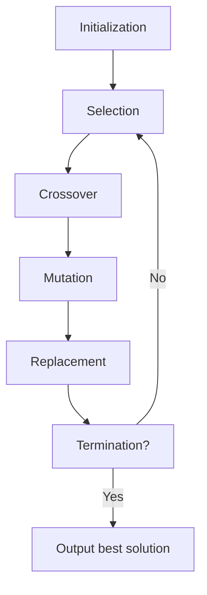

# APPLICATION OF SOFT COMPUTING TECHNIQUES

- Soft computing is a set of computational techniques based on artificial intelligence and natural selection that provides quick and cost effective solution to very complex problems for which analytical (hard computing) formulations do not exist.
- Soft computing techniques are tolerant of imprecision, uncertainty, partial truth and approximation. They are contrasted with hard computing techniques, which find provably correct and optimal solutions to problems.
- Some of the most common soft computing techniques are:
  - Fuzzy logic: This technique uses fuzzy sets and fuzzy rules to model the uncertainty and vagueness in human reasoning and decision making . Fuzzy logic can handle linguistic variables and qualitative information that are not easily quantified.
  - Neural networks: This technique uses interconnected nodes or neurons that mimic the biological neural system to learn from data and perform complex tasks such as pattern recognition, classification, regression, clustering, etc . Neural networks can adapt to changing environments and learn from their own errors.
  - Evolutionary algorithms: This technique uses population-based search methods that emulate the natural evolution process to find optimal or near-optimal solutions to optimization, design, and learning problems . Evolutionary algorithms can explore a large and diverse search space and escape from local optima.
  - Support vector machines: This technique uses a supervised learning method that constructs a hyperplane or a set of hyperplanes that separate the data into different classes with maximum margin. Support vector machines can handle high-dimensional and nonlinear data and avoid overfitting.
- Some of the applications of soft computing techniques are:
  - Image processing and computer vision: Soft computing techniques can be used to enhance, segment, compress, analyze, and recognize images obtained from various sources such as cameras, microscopes, X-rays, etc. They can also be used to perform tasks such as face detection, object recognition, scene understanding, etc.
  - Data mining and knowledge discovery: Soft computing techniques can be used to extract useful and meaningful information from large and complex data sets such as databases, web pages, social media, etc. They can also be used to perform tasks such as classification, clustering, association rule mining, anomaly detection, etc.
  - Control systems and robotics: Soft computing techniques can be used to design and implement intelligent and adaptive control systems and robots that can handle uncertainty, noise, and disturbances in the environment. They can also be used to perform tasks such as path planning, obstacle avoidance, navigation, manipulation, etc.
  - Natural language processing and speech recognition: Soft computing techniques can be used to process and understand natural language and speech signals from human users and generate appropriate responses or actions. They can also be used to perform tasks such as sentiment analysis, machine translation, text summarization, speech synthesis, etc.
  - Bioinformatics and medical diagnosis: Soft computing techniques can be used to analyze and interpret biological and medical data such as DNA sequences, protein structures, gene expression, medical images, etc. They can also be used to perform tasks such as sequence alignment, phylogenetic analysis, protein folding, disease prediction, etc.

## Unit 1 - Neural Networks-I (Introduction & Architecture)

- Neural networks are computational models that are inspired by the biological neurons in the brain. They can learn from data and perform tasks such as classification, regression, clustering, anomaly detection, etc.
- A neural network consists of an input layer, an output layer, and one or more hidden layers in between. Each layer is composed of artificial neurons or nodes that are connected by weighted links. The input layer receives the data, the output layer produces the prediction, and the hidden layers perform intermediate computations.
- Each neuron in a neural network has an activation function that determines its output based on its input. Some common activation functions are sigmoid, tanh, ReLU, softmax, etc. The activation function introduces non-linearity to the network, which enables it to learn complex patterns and relationships.
- A neural network can be trained using a learning algorithm that adjusts the weights and biases of the links based on the error between the network's output and the desired output. The error is measured by a loss function, such as mean squared error, cross-entropy, etc. The learning algorithm can be supervised, unsupervised, or reinforcement learning, depending on the type and availability of the data and the feedback.
- Some popular learning algorithms for neural networks are gradient descent, backpropagation, stochastic gradient descent, Adam, etc. These algorithms use the chain rule of calculus to compute the gradients of the loss function with respect to the weights and biases, and update them in the opposite direction of the gradients to minimize the loss.
- The architecture of a neural network refers to the number, size, and type of the layers and neurons in the network. The architecture determines the capacity and complexity of the network, and affects its performance and generalization. There is no universal rule for choosing the optimal architecture, but some factors to consider are the size and dimensionality of the data, the nature and difficulty of the task, the computational resources and time available, etc.
- Some common types of neural network architectures are feedforward neural networks, recurrent neural networks, convolutional neural networks, autoencoders, generative adversarial networks, etc. Each type has its own advantages and disadvantages, and is suitable for different kinds of problems and domains.

### Neuron

- A neuron is the structural and functional unit of the nervous system   that generates and transmits electrical signals called action potentials.
- A neuron consists of three main parts: the cell body (soma), the dendrites, and the axon   .
- The cell body (soma) is the central part of the neuron that contains the nucleus and other organelles   . It is responsible for the metabolic functions of the neuron   .
- The dendrites are the branched extensions of the cell body that receive signals from other neurons or sensory stimuli   . They convey the signals to the cell body   .
- The axon is the long and thin projection of the cell body that carries signals away from the cell body to other neurons, muscles, or glands   . It is usually covered by a fatty layer called the myelin sheath, which insulates the axon and speeds up the signal transmission   .
- The axon terminates in specialized structures called axon terminals or synaptic knobs, which form connections with other cells called synapses   . At the synapses, the electrical signals are converted into chemical signals called neurotransmitters, which cross the synaptic gap and bind to the receptors on the target cell   .
- There are different types of neurons based on their structure and function    . Some common types are:
  - Sensory neurons: These neurons carry sensory information from the external or internal environment to the central nervous system    . They have one long dendrite and one short axon    .
  - Motor neurons: These neurons carry motor commands from the central nervous system to the muscles or glands    . They have one long axon and many short dendrites    .
  - Interneurons: These neurons connect sensory and motor neurons within the central nervous system    . They have many dendrites and axons of varying lengths    .
- Neurons are essential for the nervous system function, as they allow us to think, talk, feel, and move     . They also play a role in learning, memory, and cognition     .

### Nerve structure and synapse

- A nerve is a bundle of nerve fibres (axons) that transmit electrical impulses between different parts of the body.
- A nerve fibre is a long extension of a nerve cell (neuron) that carries an action potential (nerve impulse) from the cell body to the target cell.
- A neuron is a specialized cell that can generate and conduct electrical signals along its membrane. It consists of three main parts: the cell body (soma), the dendrites, and the axon.
- The cell body contains the nucleus and other organelles that support the metabolic and genetic functions of the neuron.
- The dendrites are short, branched processes that receive signals from other neurons or sensory stimuli and convey them to the cell body.
- The axon is a long, thin process that carries signals away from the cell body to other neurons, muscles, or glands. The axon may be myelinated or unmyelinated, depending on whether it is wrapped by a fatty sheath called myelin that insulates and speeds up the signal transmission.
- The axon terminates in a series of swellings called axon terminals, which are the sites of communication with other cells.
- A synapse is a junction between two cells, usually a neuron and another neuron or an effector cell (muscle or gland). It allows the transmission of information from one cell to another in a specific and regulated manner.
- There are two main types of synapses: chemical and electrical.
- A chemical synapse is a type of synapse where the signal transmission involves the release of chemical messengers called neurotransmitters from the presynaptic cell (the cell that sends the signal) to the postsynaptic cell (the cell that receives the signal).
- The neurotransmitters diffuse across a narrow gap called the synaptic cleft and bind to specific receptors on the postsynaptic membrane, triggering a response in the postsynaptic cell.
- A chemical synapse can be excitatory or inhibitory, depending on whether the neurotransmitter increases or decreases the likelihood of the postsynaptic cell to fire an action potential.
- A chemical synapse can also be modulated by other factors, such as the presence of other neurotransmitters, hormones, drugs, or diseases, that can affect the synthesis, release, uptake, or degradation of the neurotransmitters or the sensitivity of the receptors.
- A chemical synapse can be classified into different types based on the location, structure, and function of the presynaptic and postsynaptic cells. For example, a synapse between a neuron and a skeletal muscle cell is called a neuromuscular junction, and a synapse between a neuron and a smooth muscle cell or a gland is called a neuroeffector junction.
- An electrical synapse is a type of synapse where the signal transmission involves the direct flow of electrical current from the presynaptic cell to the postsynaptic cell through specialized channels called gap junctions that span the membranes of both cells.
- An electrical synapse allows a rapid and synchronous transmission of signals between cells, without the delay or modulation of chemical synapses.
- An electrical synapse can be bidirectional or unidirectional, depending on whether the gap junctions allow the current to flow in both directions or only in one direction.
- An electrical synapse can be found in some types of neurons, such as interneurons, as well as in some non-neuronal cells, such as cardiac muscle cells and glial cells.

### Artificial Neuron and its Model

- An artificial neuron is a mathematical function conceived as a model of biological neurons, a neural network.
- Artificial neurons are elementary units in an artificial neural network that receive one or more inputs and produce an output.
- Artificial neurons are modeled after the hierarchical arrangement of neurons in biological sensory systems, such as the visual system.
- The basic structure of an artificial neuron consists of three components:
  - Input: A set of values representing the excitatory and inhibitory signals from other neurons or external sources.
  - Weights: A set of parameters that determine the strength and direction of the connections between the inputs and the output.
  - Activation function: A mathematical function that transforms the weighted sum of the inputs into the output value, representing the firing rate of the neuron.
- The output of an artificial neuron can be either binary (0 or 1), continuous (a real number), or discrete (a finite set of values).
- The activation function can be linear, nonlinear, or threshold-based, depending on the desired behavior of the neuron.
- Some common activation functions are:
  - Sigmoid: A smooth, nonlinear function that maps any input to a value between 0 and 1, with a steep slope around 0.5.
  - Hyperbolic tangent: A smooth, nonlinear function that maps any input to a value between -1 and 1, with a steep slope around 0.
  - Rectified linear unit (ReLU): A piecewise linear function that maps any positive input to itself and any negative input to 0, with a sharp slope at 0.
  - Step: A threshold-based function that maps any input above a certain value to 1 and any input below or equal to that value to 0, with a discontinuous slope at the threshold.
- The model of an artificial neuron can be represented by a mathematical equation or a graphical diagram, depending on the level of abstraction and detail required.

### Activation Functions

- Activation functions are mathematical equations that determine the output of a neural network model.
- Activation functions also have a major effect on the neural network’s ability to converge and the convergence speed, or in some cases, activation functions might prevent neural networks from converging in the first place.
- Activation functions shape the outputs of artificial neurons and, therefore, are integral parts of neural networks in general and deep learning in particular.
- Activation functions decide whether a neuron should be activated or not, based on the input values.
- Activation functions can be linear or nonlinear, depending on whether they have a constant or variable slope.
- Some common activation functions are:
  - Sigmoid: A nonlinear function that maps any input value to a value between 0 and 1. It is useful for binary classification problems and has a smooth gradient.
  - Tanh: A nonlinear function that maps any input value to a value between -1 and 1. It is similar to sigmoid but has a steeper gradient and is centered at zero.
  - ReLU: A nonlinear function that maps any input value to a value greater than or equal to zero. It is simple and fast to compute and has a sparse output.
  - Leaky ReLU: A nonlinear function that maps any input value to a value greater than or equal to zero, except for negative values which are multiplied by a small constant. It is a variation of ReLU that avoids the problem of dying neurons.
  - Softmax: A nonlinear function that maps any input value to a probability distribution over a set of classes. It is useful for multi-class classification problems and has a smooth gradient.
- Some factors to consider when choosing an activation function are:
  - The type and complexity of the problem.
  - The range and distribution of the input and output values.
  - The computational efficiency and stability of the function.
  - The gradient and its effect on the learning process.

### Neural network architecture

- A neural network is a computational system that consists of many interconnected units called artificial neurons that can process information and learn from data.
- A neural network architecture is the design and structure of a neural network, which specifies the number, type, and arrangement of layers and neurons, as well as the connections and weights between them.
- There are different types of neural network architectures, depending on the task, data, and desired output. Some of the common ones are:
  - Feedforward neural network: A simple and basic architecture where the information flows from the input layer to the output layer without any loops or cycles. The layers between the input and output are called hidden layers. Each neuron in a layer is connected to all the neurons in the next layer. This architecture is suitable for supervised learning tasks such as classification and regression.
  - Recurrent neural network: A complex architecture where the information can flow in both directions, creating loops or cycles. This allows the network to have a memory of previous inputs and outputs, which can be useful for sequential data such as text, speech, and time series. A recurrent neural network can have one or more hidden layers, and each neuron can be connected to itself or other neurons in the same or different layers. This architecture is suitable for natural language processing, speech recognition, and machine translation.
  - Convolutional neural network: A specialized architecture where the information flows from the input layer to the output layer, but with some modifications. The input layer is divided into small regions called receptive fields, which feed into a convolutional layer. The convolutional layer applies a set of filters or kernels to the receptive fields, which extract features from the input image. The convolutional layer is followed by a pooling layer, which reduces the size and complexity of the feature maps. The pooling layer is followed by one or more fully connected layers, which perform the final classification or regression. This architecture is suitable for computer vision, image recognition, and object detection.
  - Deep neural network: A general term for any neural network that has multiple hidden layers, which can increase the complexity and expressiveness of the network. A deep neural network can be any of the above architectures, or a combination of them. A deep neural network can learn more abstract and high-level features from the data, which can improve the performance and accuracy of the network. However, a deep neural network also requires more data, computation, and training time.

### Single Layer and Multilayer Feed Forward Networks

- A feed forward network is an artificial neural network where the information flows only in one direction, from input to output. This means the connections between the neurons do not form cycles, and the network has no feedback loops.
- A single layer feed forward network consists of only two layers: an input layer and an output layer. The input layer receives the input data and passes it to the output layer. The output layer performs some computation on the input data and produces the output. The output layer may have one or more neurons, depending on the task .
- A single layer feed forward network can compute a continuous output instead of a step function. A common choice is the logistic function, which is a sigmoid function that maps any real value to a value between 0 and 1. With this choice, the single layer network is identical to the logistic regression model, widely used in statistical modeling.
- A multilayer feed forward network is an extension of the single layer feed forward network, where there are one or more intermediate layers of neurons between the input and output layer. These intermediate layers are called hidden layers, because they are not directly observable from the input or output. The hidden layers can have different numbers of neurons, and can perform different types of computations  .
- A multilayer feed forward network can learn more complex and nonlinear functions than a single layer feed forward network, because it can combine the outputs of the hidden layers in different ways. The hidden layers can also capture higher-level features or abstractions from the input data, which can improve the performance of the network on various tasks  .

### Recurrent Networks

- Recurrent networks are a class of artificial neural networks that can process sequential data or time series data .
- Recurrent networks have feedback or recurrent connections that form loops in the network, allowing the output of some nodes to affect the input of the same or other nodes .
- Recurrent networks have an internal state or memory that stores the past information of the network, which can influence the current output .
- Recurrent networks can handle variable length sequences of inputs and outputs, making them suitable for tasks such as natural language processing, speech recognition, machine translation, and image captioning .
- Recurrent networks can be trained using backpropagation through time (BPTT), which is a variant of the standard backpropagation algorithm that unrolls the network along the time dimension and computes the gradients for each time step .
- Recurrent networks can suffer from the problems of vanishing or exploding gradients, which means that the gradients can become very small or very large during training, making the learning process unstable or slow .
- Recurrent networks can be improved by using different architectures or variants, such as long short-term memory (LSTM), gated recurrent unit (GRU), bidirectional recurrent neural network (BRNN), and attention mechanism .

### Various learning techniques for the notes of the Unit 1 - Neural Networks-I (Introduction & Architecture) in the subject of APPLICATION OF SOFT COMPUTING TECHNIQUES

- Neural networks are computational models that are inspired by the structure and function of biological neurons. They consist of interconnected units called neurons that process information and learn from data. Neural networks can be used for various tasks such as classification, regression, clustering, dimensionality reduction, etc.
- Neural networks have different architectures depending on the number and arrangement of neurons and layers. The most common architecture is the feedforward neural network, which has an input layer, one or more hidden layers, and an output layer. The neurons in each layer are connected to the neurons in the next layer by weights, which represent the strength of the connections. The neurons also have biases, which are constants that shift the activation function of the neurons. 
- The learning of neural networks refers to the adjustment of the weights and biases of the neurons based on the training data and the desired output. The learning process involves two steps: propagation and update. Propagation computes the output of the network for a given input by applying the activation function of each neuron to the weighted sum of its inputs. Update modifies the weights and biases of the neurons by using a learning rule that minimizes a cost function, which measures the difference between the network output and the target output. 
- There are different learning rules for neural networks, such as gradient descent, stochastic gradient descent, momentum, adaptive learning rate, etc. The most common learning rule is the backpropagation algorithm, which applies the chain rule of calculus to compute the gradient of the cost function with respect to the weights and biases of the network. The gradient is then used to update the weights and biases in the opposite direction of the gradient, with a learning rate that controls the step size. 
- Neural networks can be improved by using different techniques, such as regularization, dropout, batch normalization, initialization, activation functions, etc. These techniques aim to reduce overfitting, improve generalization, speed up convergence, and avoid local minima. Neural networks can also be combined to form ensemble methods, which reduce the variance of predictions and reduce generalization error. Ensemble methods can be grouped by the element that is varied, such as training data, the model, and how predictions are combined.

### Perception and Convergence Rule

- The perceptron is a kind of a single-layer artificial neural network with only one neuron.
- The perceptron is the simplest neural network, one that is comprised of just one neuron.
- The perceptron is the building block of artificial neural networks, it is a simplified model of the biological neurons in our brain.
- A perceptron is an artificial neuron using the Heaviside step function as the activation function.
- The perceptron takes a vector of real-valued or boolean inputs and calculates the linear combination of them, then passes it through a threshold activation function.
- The output of the perceptron is either 0 or 1, depending on whether the input is above or below the threshold.
- The perceptron can be used to perform binary classification tasks, such as linearly separable problems.
- The perceptron learning rule is an algorithm that updates the weights of the perceptron based on the errors between the desired and actual outputs.
- The perceptron learning rule is also called the delta rule or the Widrow-Hoff rule.
- The perceptron learning rule can be expressed as: w_i = w_i + alpha * (d - y) * x_i, where w_i is the weight of the i-th input, alpha is the learning rate, d is the desired output, y is the actual output, and x_i is the i-th input.
- The perceptron convergence theorem states that for any data set which is linearly separable, the perceptron learning rule is guaranteed to find a solution in a finite number of steps .
- The perceptron convergence theorem was proved by Frank Rosenblatt in 1962.
- The perceptron convergence theorem does not hold for non-linearly separable problems, such as the XOR problem.
- The perceptron can be extended to handle non-linearly separable problems by using a multilayer perceptron, which is a neural network with more than one layer of neurons.
- The multilayer perceptron can learn complex non-linear functions by using a differentiable activation function, such as the sigmoid or the tanh function, and applying the backpropagation algorithm to update the weights.
- The multilayer perceptron is also called a feedforward neural network, to distinguish it from a recurrent neural network, which has feedback connections between the neurons.
- The multilayer perceptron can be further improved by using different architectures, such as convolutional neural networks, recurrent neural networks, or deep neural networks.
- The multilayer perceptron can also be controlled by using rule representations, which are symbolic expressions that define the inputs and outputs of the network.
- The rule representations can be encoded into the network by using a rule encoder, which is a module that transforms the rules into a vector representation.
- The rule encoder can be coupled with a rule-based objective, which is a loss function that measures the consistency between the rules and the network outputs.
- The rule-based objective can help the network to learn interpretable and explainable models, as well as to incorporate prior knowledge and constraints into the learning process.
- The rule encoder and the rule-based objective can be applied to any kind of rule defined for any data type and model architecture.

### Auto-associative and hetero-associative memory

- Auto-associative memory is a type of memory that retrieves the same pattern Y given an input pattern X, i.e., Y = X .
- Auto-associative memory is useful for de-noising or removing interference from the input and can be used to determine whether the given input is “known” or “unknown”.
- Auto-associative memory can be implemented by a single layer neural network in which the input training vector and the output target vectors are the same.
- Hetero-associative memory is a type of memory that retrieves a stored pattern Y given an input pattern X such that Y ≠ X .
- Hetero-associative memory is useful for mapping or correlating different patterns that are related to each other.
- Hetero-associative memory can be implemented by a bidirectional associative memory (BAM) network, which is a two-layer neural network that can store and recall pairs of patterns.

## Unit 2 - Neural Networks-II (Back propagation networks)

- Back propagation networks are a type of artificial neural networks that use a learning algorithm called backpropagation to train the network weights based on the error rate obtained in the previous iteration .
- Backpropagation is a process of propagating the error backward through the network layers, starting from the output layer to the input layer, and adjusting the weights accordingly  .
- Backpropagation consists of two phases: forward propagation and backward propagation.
  - In forward propagation, the input data is fed to the network and the output is computed using the current weights. The output is then compared with the desired output (target) and the error is calculated.
  - In backward propagation, the error is multiplied by the derivative of the activation function at each node to obtain the error gradient. The error gradient is then used to update the weights by subtracting a fraction of it from the current weights. This fraction is called the learning rate and it controls how fast the network learns.
- Backpropagation is repeated for a number of epochs (iterations) until the network converges to a minimum error or a satisfactory performance.
- Backpropagation is widely used for training feedforward neural networks, such as multilayer perceptrons, convolutional neural networks, and recurrent neural networks.
- Backpropagation can also be generalized to other types of neural networks and functions, such as radial basis function networks, autoencoders, and deep belief networks.

### Architecture for the notes of the Unit 2 - Neural Networks-II (Back propagation networks) in the subject of APPLICATION OF SOFT COMPUTING TECHNIQUES

- A back propagation network is a type of artificial neural network that uses a supervised learning algorithm to produce a desired output .
- The algorithm adjusts the weights of the connections between the nodes in the network according to a feedback signal that indicates the error between the actual output and the desired output .
- The feedback signal is propagated backward through the network, hence the name back propagation.
- The back propagation network consists of three main components: the input layer, the hidden layer, and the output layer .
- The input layer receives the input data and passes it to the hidden layer, which performs some nonlinear transformations on the data and passes it to the output layer, which produces the output .
- The output layer compares the output with the desired output and calculates the error, which is then sent back to the hidden layer and the input layer to adjust the weights .
- The back propagation network can have multiple hidden layers, depending on the complexity of the problem .
- The back propagation network can learn from examples and generalize to new data, making it suitable for various applications such as classification, regression, pattern recognition, and optimization  .

### Perceptron Model

- The perceptron is a **simplified model of a biological neuron** that accepts multiple inputs and outputs a single value  .
- The perceptron has four key components:
  - **Input values**: These are the numerical values that represent the features of the data, such as x1, x2, ..., xn.
  - **Weights**: These are the numerical values that determine how much each input contributes to the output, such as w1, w2, ..., wn.
  - **Weighted sum**: This is the linear combination of the inputs and weights, such as z = w1x1 + w2x2 + ... + wnxn.
  - **Activation function**: This is a function that maps the weighted sum to the output value, such as y = ϕ(z). A common activation function is the **threshold function**, which outputs 1 if z is greater than or equal to 0, and 0 otherwise.
- The perceptron can be used for **classification** tasks, such as binary classification (e.g., spam or not spam) or multiclass classification (e.g., digit recognition)   .
- The perceptron can learn from the data by **updating the weights** based on the error between the predicted output and the actual output  .
- The perceptron algorithm is as follows  :
  - Initialize the weights to random values.
  - For each training example (x, y):
    - Compute the predicted output y' = ϕ(w1x1 + w2x2 + ... + wnxn).
    - Compute the error e = y - y'.
    - Update the weights by adding the product of the error and the input, multiplied by a learning rate α: wi = wi + αexi for i = 1, 2, ..., n.
  - Repeat the above steps until the error is minimized or a maximum number of iterations is reached.
- The perceptron algorithm can be proven to **converge** to a solution if the data is **linearly separable**, meaning that there exists a hyperplane that can separate the classes .
- The perceptron algorithm has some **limitations**, such as:
  - It cannot handle nonlinearly separable data, such as the XOR problem .
  - It is sensitive to the initial weights and the order of the training examples .
  - It does not have a way to measure the confidence or uncertainty of the predictions .
- The perceptron algorithm can be **extended** or **modified** to overcome some of these limitations, such as:
  - Using a different activation function, such as the sigmoid function or the softmax function  .
  - Using a different error function, such as the hinge loss or the cross-entropy loss  .
  - Using a regularization term to prevent overfitting or underfitting  .
  - Using multiple perceptrons in a **layered** structure to form a **neural network**, which can handle nonlinearly separable data and complex patterns   .

### Solution for the notes of the Unit 2 - Neural Networks-II (Back propagation networks) in the subject of APPLICATION OF SOFT COMPUTING TECHNIQUES

- Back propagation networks are a type of artificial neural networks that use a supervised learning algorithm to produce a desired output .
- The algorithm adjusts the weights of the connections between the nodes in the network according to a feedback signal, which is the difference between the actual output and the desired output .
- The feedback signal is propagated backwards through the network, hence the name back propagation.
- The goal of back propagation is to minimize the error or the loss function of the network .
- The steps of back propagation are as follows:
  - Initialize the network with random weights and biases.
  - Perform a forward pass to compute the output of the network for a given input.
  - Calculate the error or the loss function for the output using a predefined criterion, such as mean squared error or cross entropy.
  - Perform a backward pass to compute the gradients of the error with respect to the weights and biases of the network using the chain rule of differentiation.
  - Update the weights and biases of the network using a learning rate and an optimization technique, such as gradient descent or stochastic gradient descent.
  - Repeat the steps until the error or the loss function reaches a minimum or a predefined threshold.
- Back propagation networks can be used for various applications, such as classification, regression, image recognition, natural language processing, speech recognition, etc  .

### Single Layer Artificial Neural Network

- A single layer artificial neural network is a type of artificial neural network that consists of only one layer of input nodes and one layer of output nodes  .
- The input nodes receive weighted inputs from the external data and pass them to the output nodes, which perform some activation function to produce the output  .
- A single layer artificial neural network is also called a perceptron, which is the simplest form of neural network .
- A single layer artificial neural network can learn linearly separable patterns, but cannot learn nonlinear or complex patterns  .
- A single layer artificial neural network can be trained using various algorithms, such as the perceptron learning rule, the delta rule, or the gradient descent method  .
- A single layer artificial neural network can be used for binary classification, linear regression, or logical operations   .
- A single layer artificial neural network can be implemented using various frameworks, such as PyTorch, TensorFlow, or Keras.

### Multilayer Perceptron Model

- A multilayer perceptron (MLP) is a type of feedforward artificial neural network (ANN) that consists of multiple layers of neurons connected by weighted synapses.
- An MLP can learn nonlinear functions by using one or more hidden layers between the input and output layers.
- An MLP can be trained using the backpropagation algorithm, which is a method of adjusting the weights of the synapses based on the error between the desired and actual output.
- An MLP can be used for various applications, such as classification, regression, pattern recognition, and image processing .
- The basic structure of an MLP is shown below:

MLP structure

- The input layer receives the input data and passes it to the first hidden layer.
- The hidden layers perform nonlinear transformations on the input data and pass it to the next layer.
- The output layer produces the final output of the network.
- Each neuron in the network has an activation function that determines its output based on its input. Common activation functions include sigmoid, tanh, ReLU, and softmax.
- The performance of an MLP depends on various factors, such as the number of layers, the number of neurons per layer, the activation functions, the learning rate, the regularization, and the initialization of the weights.

### Backpropagation Learning Methods

- Backpropagation is a widely used method for training feedforward artificial neural networks (ANNs) by calculating the gradients of the error function with respect to the network weights  .
- Backpropagation is based on the chain rule of calculus, which allows the computation of the gradient of the error function in each layer of the network by propagating the errors backwards from the output layer to the input layer .
- Backpropagation can be used with different optimization algorithms, such as stochastic gradient descent (SGD), to update the network weights in an iterative manner until a desired level of accuracy or convergence is achieved .
- Backpropagation can handle noise in the training data and may generalize better if some noise is present in the training data. However, backpropagation also has some limitations, such as the possibility of getting stuck in local minima, the difficulty of choosing appropriate learning parameters, and the high computational cost for large and complex networks.
- Backpropagation can be applied to various domains and problems, such as solar forecasting, image recognition, natural language processing, and operational planning. Backpropagation is also the basis for many advanced neural network architectures, such as convolutional neural networks (CNNs) and recurrent neural networks (RNNs) .

### Effect of learning rule coefficient for the notes of the Unit 2 - Neural Networks-II (Back propagation networks) in the subject of APPLICATION OF SOFT COMPUTING TECHNIQUES

- Learning rule coefficient, also known as learning rate, is a parameter that controls how much the weights of a neural network are updated in each iteration of the backpropagation algorithm.
- Backpropagation is a method of training a feedforward neural network by calculating the gradient of the loss function with respect to the weights and biases of the network, and adjusting them in the opposite direction of the gradient.
- The learning rule coefficient affects the speed and accuracy of the learning process. A high learning rate can lead to faster convergence, but also to overshooting the optimal values of the weights and oscillating around the minimum of the loss function. A low learning rate can lead to more stable and precise updates, but also to slower convergence and getting stuck in local minima.
- The optimal value of the learning rule coefficient depends on the characteristics of the data, the network architecture, and the loss function. There is no universal formula to determine the best learning rate, but some heuristics and techniques can be used to find a suitable value, such as grid search, learning rate decay, adaptive learning rate methods, etc.
- The generalized delta learning rule is a form of backpropagation that applies to any feedforward neural network with differentiable activation functions. It is derived by applying the chain rule of calculus to the loss function and propagating the errors from the output layer to the input layer.
- The generalized delta learning rule can be expressed as:

$$\Delta w_{ij} = -\eta \frac{\partial E}{\partial w_{ij}} = -\eta \delta_j x_i$$

where $\Delta w_{ij}$ is the change in the weight from unit $i$ to unit $j$, $\eta$ is the learning rule coefficient, $E$ is the loss function, $\delta_j$ is the error term for unit $j$, and $x_i$ is the output of unit $i$.

- The error term $\delta_j$ can be computed recursively as:

$$\delta_j = f'(net_j) \sum_{k} \delta_k w_{jk}$$

where $f'$ is the derivative of the activation function, $net_j$ is the net input to unit $j$, and the summation is over all units $k$ that receive input from unit $j$.

- The learning rule coefficient affects the magnitude of the weight updates and the direction of the gradient descent. A small learning rule coefficient can result in slow and steady learning, while a large learning rule coefficient can result in fast and erratic learning.

### Backpropagation Algorithm

- Backpropagation, or backward propagation of errors, is an algorithm that is designed to test for errors working back from output nodes to input nodes.
- It is an important mathematical tool for improving the accuracy of predictions in data mining and machine learning.
- It uses supervised learning, which means that the algorithm is provided with examples of the inputs and outputs that the network should compute, and then the error is calculated.
- It is based on generalizing the Widrow-Hoff learning rule, which is a simple method for adjusting the weights of a single-layer neural network.
- It applies the chain rule of calculus to compute the gradient of the error function with respect to the neural network's weights.
- It consists of two phases: a forward pass and a backward pass.
- In the forward pass, the input data is fed to the network and the output is computed.
- In the backward pass, the error is propagated from the output layer to the hidden layers, and the weights are updated according to the gradient descent rule.
- It is a widely used algorithm for training feedforward artificial neural networks, which are networks that have no cycles or loops.
- It can also be generalized to other artificial neural networks, such as recurrent neural networks, which have cycles or loops.
- It is an iterative algorithm, which means that it repeats the forward and backward passes until the error is minimized or a stopping criterion is met.
- It is a local optimization algorithm, which means that it may converge to a local minimum rather than a global minimum of the error function.
- It is sensitive to the choice of the learning rate, which is a parameter that controls how much the weights are changed in each iteration.
- It is also sensitive to the choice of the activation function, which is a function that determines the output of a node given its input.
- It can suffer from the problems of overfitting, which is when the network learns the noise or specific details of the training data rather than the general pattern, and vanishing gradient, which is when the gradient becomes very small or zero in the lower layers of the network.

### Factors affecting backpropagation training

Backpropagation is a learning algorithm that adjusts the weights of a neural network based on the error between the desired output and the actual output. Backpropagation training is influenced by several factors, such as:

- **Initial weights**: The initial random weights chosen for the neural network should be small enough to avoid saturation of the activation functions, which may lead to local minima or slow convergence. The initial weights should also be diverse enough to avoid symmetry or redundancy in the network structure  .
- **Learning rate**: The learning rate is a parameter that controls how much the weights are updated in each iteration. A high learning rate may cause the network to overshoot the optimal solution and oscillate around it, while a low learning rate may cause the network to converge too slowly or get stuck in a suboptimal solution. A suitable learning rate should balance the speed and accuracy of the convergence  .
- **Updation rule**: The updation rule is the formula that determines how the weights are changed based on the error and the gradient. There are different updation rules that can be used, such as gradient descent, momentum, adaptive learning rate, etc. The choice of the updation rule may affect the stability, speed and quality of the convergence  .
- **Size and nature of the training set**: The size and nature of the training set refers to the number and characteristics of the input-output pairs that are used to train the network. The training set should be large enough to cover the variability and complexity of the problem domain, but not too large to cause overfitting or computational inefficiency. The training set should also be representative and balanced, meaning that it should reflect the true distribution and proportion of the different classes or categories in the problem domain  .
- **Architecture**: The architecture of the network refers to the number and arrangement of the layers and nodes in the network. The architecture should be suitable for the problem domain, meaning that it should have enough capacity and complexity to capture the underlying patterns and relationships in the data, but not too much to cause overfitting or computational inefficiency. The architecture should also be compatible with the activation functions and the learning algorithm used  .

These factors are interrelated and may affect each other in different ways. Therefore, finding the optimal combination of these factors for a given problem domain may require some trial and error, experimentation and fine-tuning.

### Applications of Backpropagation Networks

Backpropagation networks are a type of artificial neural networks that use a supervised learning algorithm to adjust the weights of the network based on the error between the desired output and the actual output. They are widely used in various domains such as:

- **Speech recognition**: Backpropagation networks can be trained to recognize and enunciate speech signals by learning the acoustic features and phonetic patterns of different languages .
- **Image recognition**: Backpropagation networks can be trained to recognize and classify images by learning the visual features and semantic labels of different objects, faces, scenes, etc .
- **Natural language processing**: Backpropagation networks can be trained to process and generate natural language by learning the syntactic and semantic rules of different languages, such as parsing, translation, summarization, sentiment analysis, etc .
- **Data mining**: Backpropagation networks can be trained to discover patterns and trends in large and complex datasets by learning the statistical and logical relationships among different variables, such as clustering, classification, regression, anomaly detection, etc .
- **Control systems**: Backpropagation networks can be trained to control and optimize the performance of dynamic systems by learning the input-output mapping and feedback mechanisms of different processes, such as robotics, manufacturing, power systems, etc .

These are some of the applications of backpropagation networks in the field of soft computing techniques. They demonstrate the ability of backpropagation networks to learn from data and generalize to new situations. However, they also have some limitations and challenges, such as:

- **Local minima**: Backpropagation networks may get stuck in a local minimum of the error function and fail to reach the global minimum, resulting in suboptimal solutions .
- **Overfitting**: Backpropagation networks may overfit the training data and lose the ability to generalize to new data, resulting in poor performance on unseen data .
- **Vanishing gradient**: Backpropagation networks may suffer from the vanishing gradient problem, where the gradient of the error function becomes very small or zero in the lower layers of the network, resulting in slow or no learning .
- **Complexity**: Backpropagation networks may require a large number of hidden layers and neurons to achieve high accuracy and performance, resulting in high computational cost and memory requirement .

These are some of the challenges and limitations of backpropagation networks that need to be addressed and overcome by using advanced techniques and methods, such as:

- **Optimization algorithms**: Different optimization algorithms can be used to improve the convergence and speed of backpropagation networks, such as gradient descent, stochastic gradient descent, momentum, Adam, etc .
- **Regularization techniques**: Different regularization techniques can be used to prevent overfitting and improve generalization of backpropagation networks, such as dropout, weight decay, early stopping, etc .
- **Activation functions**: Different activation functions can be used to avoid the vanishing gradient problem and improve the learning of backpropagation networks, such as sigmoid, tanh, ReLU, etc .
- **Network architectures**: Different network architectures can be used to reduce the complexity and improve the performance of backpropagation networks, such as convolutional neural networks, recurrent neural networks, etc .

These are some of the techniques and methods that can be used to enhance and improve the backpropagation networks for various applications in the field of soft computing techniques. They show the potential and flexibility of backpropagation networks to adapt and evolve with the changing needs and demands of the real-world problems.

## Unit 3 - Fuzzy Logic-I (Introduction)

- Fuzzy logic is a form of multi-valued logic that deals with reasoning that is approximate rather than fixed and exact.
- Fuzzy logic is based on the concept of fuzzy sets, which are sets that have a degree of membership rather than a crisp membership of either 0 or 1.
- Fuzzy logic can handle uncertainty, vagueness, ambiguity, and imprecision in natural language, human decision making, and complex systems.
- Fuzzy logic can be used for applications such as control systems, expert systems, data analysis, image processing, and artificial intelligence.
- Fuzzy logic has three main components: fuzzy sets, fuzzy operators, and fuzzy rules.
- Fuzzy sets are characterized by a membership function that assigns a degree of membership to each element in the universe of discourse.
- Fuzzy operators are used to perform operations on fuzzy sets, such as union, intersection, complement, and implication.
- Fuzzy rules are conditional statements that express the relationship between fuzzy sets using fuzzy operators. Fuzzy rules can be used to model the knowledge and behavior of a system or a domain expert.
- Fuzzy logic can be implemented using various methods, such as fuzzy logic controllers, fuzzy inference systems, fuzzy neural networks, and genetic fuzzy systems.

### Basic concepts of fuzzy logic

- Fuzzy logic is an approach to variable processing that allows for multiple possible truth values to be processed through the same variable.
- Fuzzy logic attempts to solve problems with an open, imprecise spectrum of data and heuristics that makes it possible to obtain an array of accurate conclusions.
- Fuzzy logic is a heuristic approach that allows for more advanced decision-tree processing and better integration with rules-based programming.
- Fuzzy logic is a generalization from standard logic, in which all statements have a truth value of one or zero. In fuzzy logic, statements can have a value of partial truth, such as 0.9 or 0.5 .
- The fundamental concept of fuzzy logic is the membership function, which defines the degree of membership of an input value to a certain set or category.
- The membership function is a mapping from an input value to a membership degree between 0 and 1, where 0 represents non-membership and 1 represents full membership.
- Fuzzy logic is a mathematical method for representing vagueness and uncertainty in decision-making, it allows for partial truths, and it is used in a wide range of applications.
- Fuzzy logic is based on the concept of membership function and the implementation is done using fuzzy rules.
- Fuzzy logic is a form of many-valued logic in which the truth value of variables may be any real number between 0 and 1.
- Fuzzy logic is employed to handle the concept of partial truth, where the truth value may range between completely true and completely false.
- The architecture of fuzzy logic consists of four main components:
  - Rules: It includes all the rules and if-then conditions proposed by experts to control the decision-making system. The current update to the fuzzy approach gives various practical methods for designing and tuning fuzzy controllers.
  - Fuzzification: It is the process of transforming crisp inputs into fuzzy sets using membership functions.
  - Inference: It is the process of applying fuzzy rules to the fuzzy sets to obtain fuzzy outputs.
  - Defuzzification: It is the process of converting fuzzy outputs into crisp values using various methods.

Hello, I am Sydney, your AI assistant. I can help you with your topic of fuzzy sets and crisp sets. Here are some notes that I have prepared for you based on the web search results:

### Fuzzy sets and Crisp sets

- Fuzzy sets and crisp sets are two different set theories that deal with the representation of uncertainty and vagueness in data and information.
- A crisp set is a set that has clear and precise boundaries, and its elements either belong or do not belong to the set. A crisp set follows the bi-valued logic, which means that every statement is either true or false, and there is no ambiguity or partial truth.
- A fuzzy set is a set that has indeterminate and fuzzy boundaries, and its elements have degrees of membership to the set, ranging from 0 to 1. A fuzzy set follows the infinite-valued logic, which means that every statement can have a truth value between 0 and 1, and there can be uncertainty and gradation of truth.
- For example, consider the set of tall people. In a crisp set, we would have to define a precise height threshold, such as 180 cm, and say that anyone who is taller than that belongs to the set, and anyone who is shorter than that does not belong to the set. This is a binary and rigid classification that does not capture the nuances and variations of human height. In a fuzzy set, we would not have to define a precise height threshold, but rather assign a membership function that assigns a degree of membership to each person based on their height. For example, someone who is 170 cm might have a membership of 0.5, someone who is 190 cm might have a membership of 0.9, and someone who is 160 cm might have a membership of 0.1. This is a flexible and fuzzy classification that captures the diversity and vagueness of human height.
- Fuzzy sets can be represented by membership functions, which are mathematical functions that map each element of the universe of discourse (the set of all possible values) to a membership value between 0 and 1. There are different types of membership functions, such as triangular, trapezoidal, Gaussian, sigmoid, etc., depending on the shape and characteristics of the fuzzy set.
- Fuzzy sets can be operated on by using fuzzy set operations, which are generalizations of the classical set operations, such as union, intersection, complement, etc. Fuzzy set operations can be defined by using different t-norms and t-conorms, which are functions that generalize the concepts of logical and and logical or, respectively. Some common t-norms and t-conorms are min-max, product-sum, Lukasiewicz, etc.
- Fuzzy sets can be used to model and reason about various phenomena that involve uncertainty, vagueness, imprecision, ambiguity, etc., such as natural language, human perception, decision making, control systems, etc. Fuzzy sets are the basis of fuzzy logic, which is a logic system that extends the classical logic by allowing statements to have degrees of truth, rather than being strictly true or false. Fuzzy logic can be used to construct fuzzy rules, which are conditional statements that have fuzzy antecedents and consequents, and can be used to infer fuzzy conclusions from fuzzy facts. Fuzzy logic can also be used to construct fuzzy systems, which are systems that use fuzzy rules and fuzzy inference methods to perform tasks such as classification, prediction, optimization, etc.

### Fuzzy set theory and operations

- Fuzzy set theory is a branch of mathematics that deals with sets whose elements have degrees of membership, rather than belonging or not belonging to the set.
- Fuzzy sets are useful for modeling uncertainty, vagueness, ambiguity, and imprecision in various domains, such as logic, control, decision making, pattern recognition, linguistics, etc .
- Fuzzy sets are defined by a membership function that assigns a value between 0 and 1 to each element of the universe of discourse, indicating the degree of membership of that element to the fuzzy set.
- Fuzzy set operations are generalizations of crisp set operations, such as union, intersection, and complement, that preserve the properties of fuzzy sets.
- The most widely used fuzzy set operations are called standard fuzzy set operations, and they are defined as follows :

  - Fuzzy complement: The complement of a fuzzy set A ~ is a fuzzy set A ~ C such that the membership function of A ~ C is given by μ A ~ C ( x ) = 1 − μ A ~ ( x ) for all x in the universe of discourse.
  - Fuzzy union: The union of two fuzzy sets A ~ and B ~ is a fuzzy set A ~ ∪ B ~ such that the membership function of A ~ ∪ B ~ is given by μ A ~ ∪ B ~ ( x ) = max ⁡ ( μ A ~ ( x ) , μ B ~ ( x ) ) for all x in the universe of discourse.
  - Fuzzy intersection: The intersection of two fuzzy sets A ~ and B ~ is a fuzzy set A ~ ∩ B ~ such that the membership function of A ~ ∩ B ~ is given by μ A ~ ∩ B ~ ( x ) = min ⁡ ( μ A ~ ( x ) , μ B ~ ( x ) ) for all x in the universe of discourse.

- Other types of fuzzy set operations include algebraic product and sum, bounded difference and sum, Hamacher product and sum, etc .
- Fuzzy set operations can be used to perform various operations on fuzzy sets, such as aggregation, combination, implication, negation, etc.
- Fuzzy set operations can also be extended to fuzzy relations, fuzzy numbers, fuzzy logic, and fuzzy systems.

### Properties of fuzzy sets

- A fuzzy set is a set where each element has a degree of membership, which is a number between 0 and 1, where 0 means the element is not a member of the set, and 1 means the element is a member of the set.
- Fuzzy sets can be considered as an extension and gross oversimplification of classical sets, which allow only binary membership (0 or 1) .
- Fuzzy sets have many useful properties, such as  :
  - **Closure**: A fuzzy set is closed if, for any element x, the membership degree of x is equal to the membership degree of the set.
  - **Involution**: Involution states that the complement of complement is set itself. The complement of a fuzzy set A is denoted by A' and is defined as A'(x) = 1 - A(x) for all x.
  - **Commutativity**: Operations are called commutative if the order of operands does not alter the result. Fuzzy sets are commutative under union, intersection, and complement operations.
  - **Associativity**: Associativity allows change in the order of operations performed on an operand, however relative order of the operand can not be changed. Fuzzy sets are associative under union and intersection operations.
  - **Distributivity**: Distributivity allows change in the grouping of operands. Fuzzy sets are distributive under union and intersection operations.
  - **Absorption**: Absorption states that union of a set with intersection of itself and any other set is the set itself. Similarly, intersection of a set with union of itself and any other set is the set itself. Fuzzy sets follow the absorption property.
  - **Idempotency / Tautology**: Idempotency states that union of a set with itself is the set itself. Similarly, intersection of a set with itself is the set itself. Fuzzy sets follow the idempotency property.
  - **Identity**: Identity states that union of a set with an empty set is the set itself. Similarly, intersection of a set with a universal set is the set itself. Fuzzy sets follow the identity property.
  - **Transitivity**: Transitivity states that if a set A is a subset of set B and set B is a subset of set C, then set A is a subset of set C. Fuzzy sets follow the transitivity property. A fuzzy set A is a subset of another fuzzy set B if A(x) <= B(x) for all x.
- A fuzzy variable is a variable that can take fuzzy values, which are fuzzy sets defined on a universe of discourse. A fuzzy variable may have three, five, or seven fuzzy values, such as NB (negative big), ZE (zero), and PB (positive big) .
- A membership function is a function that assigns a degree of membership to each element of a fuzzy set. A membership function can be represented as a graph, a table, or a mathematical expression .

### Fuzzy and Crisp Relations

- A **crisp relation** is a binary relation that represents the presence or absence of association, interaction or interconnection between the elements of two or more sets   .
- A **fuzzy relation** is a fuzzy set defined on the Cartesian product of crisp sets  . It represents the degrees or strengths of association, interaction or interconnection between the elements of two or more sets using membership grades.
- A fuzzy relation can be seen as a generalization of a crisp relation, where the binary values of 0 and 1 are replaced by real values in the interval [0, 1] .
- Some examples of fuzzy relations are:
  - The relation of similarity between two objects, such as colors, shapes, or sounds.
  - The relation of preference between two alternatives, such as movies, foods, or books.
  - The relation of causality between two events, such as smoking and lung cancer, or exercise and health.
- Some properties and operations of fuzzy relations are:
  - The **cardinality** of a fuzzy relation is the sum of the membership grades of all the ordered pairs in the relation.
  - The **complement** of a fuzzy relation is obtained by subtracting the membership grades of the relation from 1.
  - The **union** of two fuzzy relations is obtained by taking the maximum of the membership grades of the corresponding ordered pairs.
  - The **intersection** of two fuzzy relations is obtained by taking the minimum of the membership grades of the corresponding ordered pairs.
  - The **composition** of two fuzzy relations is obtained by applying a t-norm (a generalization of logical and) to the membership grades of the ordered pairs that form a chain .
  - The **inverse** of a fuzzy relation is obtained by swapping the first and second elements of each ordered pair.
  - The **projection** of a fuzzy relation is obtained by applying a t-conorm (a generalization of logical or) to the membership grades of the ordered pairs that share a common element .
  - The **cylindrical extension** of a fuzzy relation is obtained by assigning the same membership grade to the ordered pairs that have the same element in the relation .
  - A fuzzy relation is **reflexive** if the membership grade of each ordered pair with the same element is 1 .
  - A fuzzy relation is **symmetric** if the membership grade of each ordered pair is equal to the membership grade of its inverse .
  - A fuzzy relation is **transitive** if the membership grade of each ordered pair is greater than or equal to the membership grade of its composition with itself .

### Fuzzy to Crisp Conversion

- Fuzzy to crisp conversion, also known as defuzzification, is the process of transforming a fuzzy set or a fuzzy output into a single crisp value or a crisp set.
- Fuzzy to crisp conversion is needed when the output of a fuzzy system has to be interpreted by a human or used by another system that requires a precise value.
- There are many methods of fuzzy to crisp conversion, each with its own advantages and disadvantages. Some of the common methods are:

  - Maxima methods: These methods select the crisp value that corresponds to the maximum degree of membership in the fuzzy set or output. There are three types of maxima methods:

    - Mean of Maxima (MOM): This method calculates the average of all the crisp values that have the maximum degree of membership.
    - First of Maxima (FOM): This method selects the smallest crisp value that has the maximum degree of membership.
    - Last of Maxima (LOM): This method selects the largest crisp value that has the maximum degree of membership.

  - Center of Gravity (CoG) method: This method calculates the crisp value that is the centroid or the balance point of the fuzzy set or output. It is also known as the Center of Area (CoA) method. It is given by the formula:

    - CoG = (sum of (degree of membership * crisp value)) / (sum of degree of membership)

  - Center of Sums (CoS) method: This method calculates the crisp value that is the weighted average of the crisp values in the fuzzy set or output. It is given by the formula:

    - CoS = (sum of crisp value) / (sum of degree of membership)

  - Center of Largest Area (CoLA) method: This method calculates the crisp value that is the centroid of the largest area in the fuzzy set or output. It is also known as the Height method. It is given by the formula:

    - CoLA = (sum of (maximum degree of membership * crisp value)) / (sum of maximum degree of membership)

  - Lambda-cut method: This method converts a fuzzy set or output into a crisp set by selecting the crisp values that have a degree of membership greater than or equal to a given threshold lambda (0 <= lambda <= 1). It is given by the formula:

    - Lambda-cut = {crisp value | degree of membership >= lambda}

- Some other methods of fuzzy to crisp conversion are:

  - Adaptive Integration (AI) method: This method integrates the fuzzy set or output over the range of crisp values and divides it by the range.
  - Basic Defuzzification Distributions (BADD) method: This method assigns a probability distribution to each crisp value based on the degree of membership and selects the crisp value with the highest probability.
  - Bisector of Area (BOA) method: This method selects the crisp value that divides the area of the fuzzy set or output into two equal parts.
  - Constraint Decision Defuzzification (CDD) method: This method selects the crisp value that satisfies a given constraint or criterion.
  - Extended Center of Area (ECOA) method: This method extends the CoA method by considering the shape and the width of the fuzzy set or output.
  - Extended Quality Method (EQM) method: This method selects the crisp value that maximizes a quality function that depends on the degree of membership and the crisp value.
  - Fuzzy Clustering Defuzzification (FCD) method: This method clusters the fuzzy set or output into sub-fuzzy sets and selects the crisp value that is the centroid of the most representative cluster.

## Unit 4 - Fuzzy Logic –II (Fuzzy Membership, Rules)

- Fuzzy logic is a form of multi-valued logic that deals with reasoning that is approximate rather than fixed and exact. It is based on the concept of fuzzy sets, which are sets that have degrees of membership rather than crisp boundaries.
- Fuzzy membership is a function that assigns a degree of belonging to each element of a fuzzy set, ranging from 0 (no membership) to 1 (full membership). Fuzzy membership functions can have various shapes, such as triangular, trapezoidal, Gaussian, sigmoid, etc.
- Fuzzy rules are statements that describe the relationship between fuzzy sets using linguistic variables and connectives. For example, a fuzzy rule for temperature control could be: IF temperature is high THEN fan speed is fast. Fuzzy rules can be represented as IF-THEN statements, implication operators, or fuzzy relations.
- Fuzzy rules can be combined using fuzzy inference methods, such as Mamdani, Sugeno, or Tsukamoto, to produce a fuzzy output. The fuzzy output can then be defuzzified using various techniques, such as centroid, bisector, mean of maxima, etc., to obtain a crisp value.

### Membership functions for the notes of the Unit 4 - Fuzzy Logic –II (Fuzzy Membership, Rules) in the subject of APPLICATION OF SOFT COMPUTING TECHNIQUES

- A membership function is a mathematical function that assigns a degree of membership to each element in a fuzzy set.
- The degree of membership represents how well the element belongs to the fuzzy set, and it ranges from 0 to 1 .
- Membership functions are the core of fuzzy logic, as they allow us to model vague and imprecise concepts, such as "hot", "cold", "young", "old", etc .
- Membership functions can have different shapes, such as triangular, trapezoidal, Gaussian, sigmoid, etc. The shape of the membership function depends on the context and the preference of the designer .
- Membership functions can be defined by using linguistic terms, such as "very low", "low", "medium", "high", "very high", etc. These terms can be translated into numerical values by using fuzzy rules.
- Fuzzy rules are statements that describe the relationship between the input and output variables of a fuzzy system. Fuzzy rules can be expressed in the form of IF-THEN statements, such as "IF temperature is high THEN fan speed is high".
- Fuzzy rules can be combined by using logical operators, such as AND, OR, NOT, etc. The logical operators can be defined by using different methods, such as min-max, product-sum, etc.
- Fuzzy rules can be evaluated by using different methods, such as Mamdani, Sugeno, Tsukamoto, etc. The evaluation methods determine how the output of the fuzzy system is calculated from the input values and the membership functions.

### Interference in Fuzzy Logic

- Interference in fuzzy logic is the process of formulating the mapping from a given input to an output using fuzzy logic .
- The mapping then provides a basis from which decisions can be made or patterns discerned .
- Interference in fuzzy logic involves all of the pieces described so far, i.e., membership functions, fuzzy logic operators, and if-then rules .
- There are different types of fuzzy inference systems, such as Mamdani, Sugeno, and Tsukamoto .
- Each type of fuzzy inference system has its own advantages and disadvantages, depending on the application domain and the complexity of the problem .
- Fuzzy inference systems can be used in many areas where the experience of humans is valid and significant, such as medical decision making, control systems, pattern recognition, and data analysis .
- Fuzzy inference systems can handle uncertainty, imprecision, and vagueness in the input and output data, and can capture the human knowledge and reasoning in a flexible and transparent way .

### Fuzzy If-Then Rules

- Fuzzy if-then rules are expressions of the form "If x is A then y is B", where x and y are input and output variables, and A and B are linguistic values defined by fuzzy sets on the domains of x and y, respectively.
- The if part of the rule is called the antecedent or premise, and the then part of the rule is called the consequent or conclusion.
- The antecedent can have one or more conditions connected by logical operators such as AND, OR, or NOT.
- The consequent can have one or more output variables, each with a fuzzy set assigned to it.
- Fuzzy if-then rules can be used to model the relationship between input and output variables in a fuzzy logic system, which can perform approximate reasoning and inference based on the degree of truth of the rules.
- Fuzzy if-then rules can be derived from expert knowledge, data analysis, or learning algorithms.
- Fuzzy if-then rules can be represented by fuzzy relations, which are the Cartesian product of fuzzy sets.
- Fuzzy if-then rules can be evaluated by different methods of fuzzy implication, such as Mamdani, Larsen, or Sugeno.
- Fuzzy if-then rules can be combined by different methods of fuzzy aggregation, such as max-min, max-product, or sum-product.

### Fuzzy implications and Fuzzy algorithms

- Fuzzy implications are a generalization of the classical implication, which is a logical connective that expresses the conditionality of a proposition on another proposition. Fuzzy implications are used to model fuzzy rules, fuzzy reasoning, and fuzzy control   .
- Fuzzy algorithms are a type of algorithm that can handle imprecise or uncertain data by using fuzzy sets and fuzzy logic. Fuzzy sets are sets that have a degree of membership, which is a function that assigns a value between 0 and 1 to each element of the set, indicating how well it belongs to the set. Fuzzy logic is a form of logic that allows for partial truth values, such as "maybe", "somewhat", or "very". Fuzzy algorithms can provide efficient and flexible solutions to complex problems in various fields of life .
- Some examples of fuzzy implications are:

  - Material implication: R:A → B = A' ∪ B, where A' is the complement of A, and ∪ is the union operator. This implication means that A implies B if either A is false or B is true.
  - Propositional calculus: R:A → B = A' ∪ (A ∩ B), where ∩ is the intersection operator. This implication means that A implies B if either A is false or both A and B are true.
  - Zadeh's arithmetic rule: R:A → B = min(1, 1 - A + B), where min is the minimum function. This implication means that A implies B if either A is small or B is large.
  - Lukasiewicz's implication: R:A → B = min(1, 1 - A + B), where min is the minimum function. This implication is equivalent to Zadeh's arithmetic rule.
  - Kleene-Dienes's implication: R:A → B = max(1 - A, B), where max is the maximum function. This implication means that A implies B if either A is false or B is true.
  - Goguen's implication: R:A → B = 1, if A ≤ B, and R:A → B = B/A, otherwise, where / is the division operator. This implication means that A implies B if either A is smaller than or equal to B, or B is a fraction of A.
  - Gödel's implication: R:A → B = 1, if A ≤ B, and R:A → B = B, otherwise. This implication means that A implies B if either A is smaller than or equal to B, or B is the truth value of the implication.

- Some examples of fuzzy algorithms are:

  - Fuzzy c-means algorithm: This is a clustering algorithm that partitions a set of data points into c fuzzy clusters, where each data point has a degree of membership to each cluster. The algorithm iteratively updates the cluster centers and the membership degrees until a convergence criterion is met.
  - Fuzzy k-nearest neighbors algorithm: This is a classification algorithm that assigns a class label to a new data point based on the k closest data points in the training set, where each data point has a fuzzy weight that reflects its similarity to the new data point. The algorithm computes the fuzzy weighted average of the class labels of the k nearest neighbors and assigns the class label with the highest average to the new data point.
  - Fuzzy logic controller: This is a control system that uses fuzzy rules and fuzzy inference to generate an output based on the input. The algorithm consists of four steps: fuzzification, rule evaluation, aggregation, and defuzzification. Fuzzification converts the crisp input values into fuzzy sets, rule evaluation applies the fuzzy rules to the fuzzy sets and produces fuzzy outputs, aggregation combines the fuzzy outputs into a single fuzzy set, and defuzzification converts the fuzzy set into a crisp output value.

### Fuzzyfication and Defuzzification

- Fuzzyfication is the process of converting a crisp (precise) quantity into a fuzzy (imprecise) quantity by assigning a degree of membership to a fuzzy set .
- Defuzzification is the inverse process of fuzzyfication, where a fuzzy quantity is converted into a crisp quantity by using a mapping function .
- Fuzzyfication and defuzzification are essential steps in a fuzzy inference system, where a crisp input is transformed into a fuzzy output and then into a crisp output .
- Fuzzyfication and defuzzification methods depend on the type and shape of the fuzzy sets and the desired output .
- Some common fuzzyfication methods are singleton, triangular, trapezoidal, Gaussian, and generalized bell-shaped.
- Some common defuzzification methods are centroid, bisector, mean of maxima, smallest of maxima, and largest of maxima  .

### Fuzzy Controller

A fuzzy controller is a type of controller that uses fuzzy logic to handle imprecise and uncertain inputs and outputs. Fuzzy logic is a mathematical system that deals with degrees of truth rather than binary values. Fuzzy logic can represent linguistic variables, such as "hot", "cold", "fast", "slow", etc., using fuzzy sets and membership functions.

A fuzzy controller consists of three main stages: fuzzification, inference, and defuzzification.

- Fuzzification: This stage converts the crisp inputs, such as sensor measurements, into fuzzy values using membership functions. Membership functions define how much an input belongs to a certain fuzzy set, such as "low", "medium", or "high". The output of this stage is a set of fuzzy values for each input variable.

- Inference: This stage applies a set of fuzzy rules to the fuzzy inputs to obtain fuzzy outputs. Fuzzy rules are statements that describe the relationship between the input and output variables using linguistic terms, such as "if temperature is high, then fan speed is high". The output of this stage is a set of fuzzy values for each output variable.

- Defuzzification: This stage converts the fuzzy outputs into crisp values using defuzzification methods, such as the centroid method, the maxima method, or the weighted average method. Defuzzification methods determine the most representative value for each output variable based on the fuzzy values. The output of this stage is a set of crisp values for each output variable.

Fuzzy controllers have several advantages over conventional controllers, such as:

- They can handle nonlinear and complex systems that are difficult to model mathematically.
- They can incorporate human knowledge and experience into the control system using fuzzy rules.
- They can deal with imprecise and noisy data without losing performance.
- They are flexible and adaptable to changing conditions and requirements.
- They are relatively simple and inexpensive to design and implement.

### Industrial applications of fuzzy logic

Fuzzy logic is a form of approximate reasoning that deals with uncertainty, imprecision, and vagueness. It can be used to model complex systems that are difficult to describe with precise mathematical equations or rules. Fuzzy logic has been successfully applied in various industrial domains, such as:

- **Speech and facial recognition**: Fuzzy logic can be used to process natural language and human expressions, by using fuzzy sets and rules to represent linguistic and visual features. For example, fuzzy logic can help identify the emotion, gender, age, and identity of a speaker or a face.
- **Aerospace industry**: Fuzzy logic can be used to control the altitude, speed, and trajectory of aircraft and satellites, by using fuzzy sets and rules to represent the desired and actual states of the system. For example, fuzzy logic can help adjust the throttle, flaps, and rudder of a plane to maintain a smooth flight .
- **Anti-icing and de-icing operations**: Fuzzy logic can be used to regulate the flow and mixture of ice, water, and air in the wings and engines of a plane, by using fuzzy sets and rules to represent the temperature, humidity, and pressure conditions. For example, fuzzy logic can help prevent ice formation and accumulation on the critical parts of a plane.
- **Automotive industry**: Fuzzy logic can be used to control traffic, speed, braking, steering, and transmission of vehicles, by using fuzzy sets and rules to represent the road, traffic, and driver conditions. For example, fuzzy logic can help optimize the fuel efficiency, safety, and comfort of a car .
- **Water quality control**: Fuzzy logic can be used to monitor and adjust the pH, turbidity, dissolved oxygen, and other parameters of water, by using fuzzy sets and rules to represent the water quality standards and the sensor measurements. For example, fuzzy logic can help maintain the optimal water quality for drinking, irrigation, or industrial purposes.
- **Cement kiln control**: Fuzzy logic can be used to control the temperature, pressure, and flow of the cement kiln, by using fuzzy sets and rules to represent the desired and actual states of the kiln. For example, fuzzy logic can help stabilize the kiln operation and improve the cement quality.
- **Wastewater treatment process control**: Fuzzy logic can be used to control the activated sludge process, which involves the biological degradation of organic matter in wastewater, by using fuzzy sets and rules to represent the influent, effluent, and sludge characteristics. For example, fuzzy logic can help optimize the aeration, sedimentation, and recirculation of the wastewater treatment plant.
- **Robot arm control**: Fuzzy logic can be used to control the position, orientation, and force of a robot arm, by using fuzzy sets and rules to represent the desired and actual states of the arm. For example, fuzzy logic can help achieve smooth and accurate movements of the robot arm for various tasks, such as welding, painting, or assembly.
- **Automatic train operation system**: Fuzzy logic can be used to control the speed, braking, and acceleration of a train, by using fuzzy sets and rules to represent the desired and actual states of the train. For example, fuzzy logic can help ensure the safety, punctuality, and comfort of the train passengers.

These are some of the industrial applications of fuzzy logic, but there are many more. Fuzzy logic can be a powerful tool for modeling and controlling complex systems that involve uncertainty, imprecision, and vagueness.

## Unit 5 - Genetic Algorithm (GA)

- A genetic algorithm is a **heuristic search method** used in artificial intelligence and computing.
- It is used for finding **optimized solutions** to search problems based on the theory of **natural selection and evolutionary biology** .
- Genetic algorithms are commonly used to generate **high-quality solutions** to optimization and search problems by relying on **biologically inspired operators** such as selection, mutation, inheritance and recombination.
- A genetic algorithm makes use of techniques inspired from evolutionary biology such as:
  - **Selection**: The process of choosing the best individuals from a population based on their fitness values.
  - **Mutation**: The process of introducing random changes in the genes of an individual to create diversity and explore new solutions.
  - **Inheritance**: The process of passing on the genes of the parents to the offspring.
  - **Recombination**: The process of combining the genes of two or more individuals to create new offspring.
- The most commonly employed method in genetic algorithms is to create a **group of individuals randomly** from a given population.
- Each individual represents a **possible solution** to the problem and has a **chromosome** that encodes its genes.
- The chromosome can be a **binary string**, a **real-valued vector**, a **permutation**, or any other data structure that suits the problem domain.
- The **fitness function** evaluates the quality of each individual and assigns a numerical score to it.
- The genetic algorithm then performs a **series of iterations** called **generations**, in which it applies the evolutionary operators to the population and creates a new population of offspring.
- The algorithm **terminates** when a **stopping criterion** is met, such as reaching a maximum number of generations, finding an optimal solution, or reaching a convergence point.

### Basic concepts for the notes of the Unit 5 - Genetic Algorithm(GA) in the subject of APPLICATION OF SOFT COMPUTING TECHNIQUES

- Genetic algorithms (GAs) are **search algorithms** that are based on concepts of **natural selection** and **natural genetics**  .
- GAs are used to find **true or approximate solutions** to **optimization and search problems** .
- GAs are a type of **evolutionary algorithms** that use techniques inspired by **evolutionary biology** such as **inheritance, mutation, selection, and crossover** .
- GAs operate on a **population** of **individuals**, each representing a **possible solution** to the given problem  .
- Each individual is encoded as a **chromosome**, which is a string of **genes** that can take different **values**  .
- Each individual is assigned a **fitness score** based on how well it solves the problem  .
- GAs use three main **operators** to create new individuals from existing ones  :
  - **Selection**: This operator chooses individuals based on their fitness scores and allows them to pass their genes to the next generation  .
  - **Crossover**: This operator represents mating between individuals. It combines the genes of two parents to produce one or more offspring  .
  - **Mutation**: This operator introduces random changes in the genes of some individuals to maintain diversity and explore new regions in the solution space  .
- GAs repeat these operators until a **termination criterion** is met, such as reaching a maximum number of generations, finding an optimal solution, or reaching a convergence point  .
- GAs have some advantages over other search algorithms, such as :
  - They can handle **nonlinear**, **multimodal**, and **high-dimensional** problems .
  - They can deal with **noisy**, **incomplete**, or **imprecise** data .
  - They can exploit the **parallelism** and **diversity** of the population .
  - They can adapt to **changing environments** and **dynamic problems** .
- GAs also have some limitations and challenges, such as :
  - They require a **proper encoding** of the problem and a **suitable fitness function** .
  - They may suffer from **premature convergence** or **loss of diversity** .
  - They may be **computationally expensive** or **slow** to converge .
  - They may not guarantee to find the **global optimum** or the **best solution** .

: https://www.geeksforgeeks.org/genetic-algorithms/

: https://www.kopykitab.com/blog/genetic-algorithm-fundamentals-basic-concepts-notes/

: https://www.section.io/engineering-education/the-basics-of-genetic-algorithms-in-ml/

: https://link.springer.com/book/10.1007/978-3-540-73190-0

: https://www.cs.cmu.edu/~02317/slides/lec_8.pdf

### Working principle of genetic algorithm

- A genetic algorithm (GA) is a computational method that mimics the process of natural selection to find optimal solutions to complex problems.
- The basic principle behind the GA is that it generates and maintains a population of individuals represented by chromosomes, which are strings of characters that encode possible solutions to the problem.
- The GA evaluates the quality of each individual in the population using a fitness function, which assigns a numerical score to each solution based on how well it meets the objective of the problem .
- The GA then creates a new population of individuals by applying genetic operators, such as selection, crossover, and mutation, to the current population .
  - Selection is the process of choosing the best individuals from the current population to be the parents of the next generation .
  - Crossover is the process of combining two parent chromosomes to produce one or more offspring chromosomes that inherit some characteristics from each parent .
  - Mutation is the process of randomly altering some characters in a chromosome to introduce diversity and exploration in the search space .
- The GA repeats this process of generating and evaluating new populations until a termination criterion is met, such as reaching a maximum number of generations, finding a satisfactory solution, or reaching a convergence point  .
- The GA can be used to solve various types of problems, such as optimization, search, classification, scheduling, and machine learning, by using appropriate encoding schemes, fitness functions, and genetic operators .

### Procedures of Genetic Algorithm

A genetic algorithm (GA) is a bio-inspired optimization technique that mimics the natural process of evolution. It is used to find approximate solutions to complex problems that are difficult to solve by conventional methods. A GA works by maintaining a population of candidate solutions, called individuals, and applying a series of operators to generate new and better solutions. The basic steps of a GA are as follows:

- **Initialization**: The initial population is randomly generated, usually as a set of binary strings or arrays of other types. Each individual represents a possible solution to the problem and has a fitness value that measures its quality or performance. The size of the population and the length of the individuals are determined by the problem domain and the algorithm parameters.
- **Selection**: The selection operator is used to choose a subset of individuals from the current population to produce offspring for the next generation. The selection is usually based on the fitness values, giving higher chances to the fitter individuals. There are different methods of selection, such as roulette wheel, tournament, rank-based, etc.
- **Crossover**: The crossover operator is used to combine two or more individuals to create new offspring. The crossover is usually applied to a pair of individuals, called parents, and involves exchanging some parts of their genetic material, called genes. The result is one or more offspring that inherit some characteristics from both parents. There are different types of crossover, such as one-point, two-point, uniform, etc.
- **Mutation**: The mutation operator is used to introduce some random changes in the individuals to maintain diversity and explore new regions of the search space. The mutation is usually applied to a single individual and involves flipping, swapping, inserting, or deleting some of its genes. The mutation rate is a parameter that controls how often the mutation occurs.
- **Evaluation**: The evaluation operator is used to calculate the fitness values of the new individuals generated by crossover and mutation. The fitness function is a problem-specific measure that evaluates how well an individual solves the problem. The higher the fitness value, the better the solution.
- **Replacement**: The replacement operator is used to update the population with the new individuals. The replacement can be done in different ways, such as replacing the entire population, replacing the worst individuals, or using an elitism strategy that preserves the best individuals.
- **Termination**: The termination operator is used to check if the algorithm has reached a stopping criterion, such as a maximum number of generations, a minimum fitness value, or a convergence condition. If the termination criterion is met, the algorithm stops and returns the best solution found so far. Otherwise, the algorithm repeats the steps from selection to replacement until the termination criterion is met.

### Flow chart of GA

A flow chart is a graphical representation of the steps and operations involved in a process or an algorithm. A flow chart of GA shows how a genetic algorithm (GA) works to find an optimal or near-optimal solution to a given problem. A GA is a search-based optimization technique that is inspired by the principles of natural selection and evolution. A GA consists of the following main steps:

- Initialization: A population of candidate solutions (called chromosomes or individuals) is randomly generated or created using some heuristics. Each chromosome has a fitness value that measures how well it solves the problem.
- Selection: A subset of chromosomes is selected from the current population based on their fitness values. The selection process favors the fitter chromosomes, which have a higher chance of being chosen for the next generation. There are different methods of selection, such as roulette wheel, tournament, rank-based, etc.
- Crossover: Pairs of selected chromosomes are combined to produce new chromosomes (called offspring or children) by exchanging some of their genes. Crossover is a way of introducing diversity and exploration in the population. There are different types of crossover, such as one-point, two-point, uniform, etc.
- Mutation: Some of the genes in the offspring chromosomes are randomly altered to create new variations. Mutation is another way of introducing diversity and exploration in the population. There are different types of mutation, such as bit-flip, swap, insert, etc.
- Replacement: The offspring chromosomes replace some or all of the chromosomes in the current population, depending on the replacement strategy. The replacement process ensures that the population size remains constant and that the best chromosomes are preserved. There are different types of replacement, such as generational, steady-state, elitist, etc.
- Termination: The GA stops when a termination criterion is met, such as reaching a maximum number of generations, finding a satisfactory solution, or reaching a convergence state.

The following diagram shows a general flow chart of GA, adapted from :

### Genetic representations for the notes of the Unit 5 - Genetic Algorithm(GA) in the subject of APPLICATION OF SOFT COMPUTING TECHNIQUES

- Genetic representation is the way of encoding the possible solutions of a problem into a data structure that can be manipulated by a genetic algorithm (GA).
- A genetic algorithm is a bio-inspired optimization technique that mimics the natural process of evolution by applying operators such as selection, crossover and mutation to a population of candidate solutions.
- The data structure that represents a candidate solution is called a chromosome, and each element of the chromosome is called a gene. The value of a gene is called an allele.
- The choice of genetic representation depends on the nature and complexity of the problem domain, and the desired properties of the solution space. Some common genetic representations are:

  - Binary representation: Each gene is a binary digit (0 or 1), and the chromosome is a binary string. This is the simplest and most widely used representation, as it allows easy implementation of crossover and mutation operators. However, it may not be suitable for problems that require high precision or have a non-binary solution space.
  - Integer or real-valued representation: Each gene is an integer or a real number, and the chromosome is an array of numbers. This representation can handle problems that involve numerical optimization, such as function approximation or parameter tuning. However, it may require more complex crossover and mutation operators, and may suffer from scaling or discretization issues.
  - Tree representation: Each gene is a node of a tree, and the chromosome is a tree structure. This representation can handle problems that involve hierarchical or recursive structures, such as symbolic regression or natural language parsing. However, it may require more memory and computation, and may suffer from bloat or overfitting issues.
  - Graph representation: Each gene is a node or an edge of a graph, and the chromosome is a graph structure. This representation can handle problems that involve network or relational structures, such as routing or scheduling. However, it may require more sophisticated crossover and mutation operators, and may suffer from connectivity or feasibility issues.

### Encoding Initialization and Selection

- Encoding is the process of representing the possible solutions of a problem in a way that can be manipulated by a genetic algorithm (GA).
- Initialization is the process of generating an initial population of solutions, usually randomly or heuristically, for a GA to start with.
- Selection is the process of choosing a subset of solutions from the current population, based on their fitness values, to participate in the genetic operators of crossover and mutation.

- There are different types of encoding methods, such as binary, integer, real, permutation, and tree encoding. Each method has its advantages and disadvantages, depending on the problem domain and the GA design.
- There are different types of initialization methods, such as random, biased, or adaptive initialization. Each method has its trade-offs, such as exploration versus exploitation, diversity versus quality, and robustness versus efficiency.
- There are different types of selection methods, such as proportional, ranking, tournament, elitist, and truncation selection. Each method has its implications, such as selection pressure, convergence speed, and genetic diversity.

### Genetic operators for the notes of the Unit 5 - Genetic Algorithm(GA) in the subject of APPLICATION OF SOFT COMPUTING TECHNIQUES

- Genetic operators are the mechanisms that guide the genetic algorithm towards a solution to a given problem.
- There are three main types of genetic operators: mutation, crossover and selection  .
- Mutation is the process of randomly altering one or more genes in a chromosome to introduce diversity and explore new regions of the search space .
- Crossover is the process of combining two parent chromosomes to produce one or more offspring chromosomes that inherit some characteristics from each parent .
- Selection is the process of choosing the best or most fit individuals from a population to survive and reproduce in the next generation .
- Genetic operators must work in conjunction with one another in order for the genetic algorithm to be successful .
- Genetic operators are analogous to those in the natural world: survival of the fittest, or selection; reproduction, or crossover; and mutation.
- Genetic operators can be designed and modified according to the specific problem domain and the desired outcomes.
- Genetic operators are the key components of the genetic algorithm that determine its performance and efficiency.

### Mutation

- Mutation is a genetic operator that alters one or more gene values in a chromosome from its initial state. It is used to introduce diversity and avoid premature convergence in the population of chromosomes .
- Mutation can be applied to different types of chromosomes, such as binary, real-valued, or permutation. Depending on the type, different mutation operators can be used, such as bit-flip, random, swap, or inversion  .
- Mutation is usually applied with a low probability, called the mutation rate, to avoid disrupting the good solutions found by crossover and selection. The mutation rate can be fixed, adaptive, or self-adaptive .
- Mutation is essential for the genetic algorithm to explore the search space and escape from local optima. However, mutation alone is not sufficient to guarantee convergence to the global optimum, and it may also increase the complexity of the search space .

### Generational Cycle for the notes of the Unit 5 - Genetic Algorithm(GA) in the subject of APPLICATION OF SOFT COMPUTING TECHNIQUES

- A generational cycle is a process of creating and updating a population of candidate solutions for an optimization or search problem using genetic and natural selection concepts .
- A generational cycle consists of the following steps  :
  - Initialization: Generate an initial population of random or heuristic solutions, usually represented as binary strings or trees.
  - Evaluation: Calculate the fitness or quality of each solution in the population according to a predefined objective function or criterion.
  - Selection: Choose a subset of solutions from the population based on their fitness values, using methods such as roulette wheel, tournament, rank-based, or elitist selection.
  - Genetic operators: Apply genetic operators such as crossover, mutation, or inversion to the selected solutions to create new or modified solutions, called offspring or children.
  - Replacement: Replace the old population with the new or enhanced population, either completely or partially, using methods such as generational, steady-state, or elitist replacement.
  - Termination: Check if a stopping condition is met, such as reaching a maximum number of generations, finding an optimal or near-optimal solution, or reaching a fitness plateau. If not, repeat the cycle from the evaluation step.
- The generational cycle aims to generate high-quality solutions that are better than the initial population and converge to the global optimum or a satisfactory suboptimum  .

### Applications of Genetic Algorithm

Genetic algorithm (GA) is a bio-inspired optimization technique that mimics the natural process of evolution. GA can be used to solve various problems that involve finding optimal or near-optimal solutions in a large and complex search space. Some of the applications of GA are:

- **Transport**: GA can be used to solve the traveling salesman problem (TSP), which involves finding the shortest route that visits a set of cities exactly once and returns to the starting point. GA can also be used to develop transport plans that reduce the cost of travel and the time taken.
- **DNA Analysis**: GA can be used to analyze the DNA structure using spectrometric information. GA can help to identify the nucleotide sequences and the locations of genes in the DNA.
- **Multimodal Optimization**: GA can be used to find multiple optimal solutions in problems that have more than one global optimum. GA can explore different regions of the search space and maintain a diverse population of solutions.
- **Economics**: GA can be used to create models of supply and demand over periods of time. GA can also be used to derive game theory and asset pricing models.
- **Automated Design**: GA can be used to design and produce automobiles, such as cars, by optimizing the parameters such as shape, size, weight, and performance. GA can also be used to design other products, such as antennas, circuits, and software.
- **Machine Learning**: GA can be used to train neural networks, select features, and tune hyperparameters. GA can also be used to generate rules for classification and regression problems.
- **Scheduling**: GA can be used to schedule tasks, resources, and personnel in various domains, such as manufacturing, education, health care, and sports. GA can help to optimize the objectives, such as minimizing the makespan, the cost, or the tardiness.
- **Engineering Design**: GA can be used to design and optimize various engineering systems, such as bridges, buildings, aircraft, and robots. GA can help to find the optimal trade-off between conflicting criteria, such as strength, weight, cost, and reliability.

