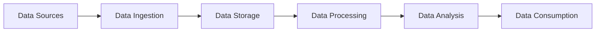

# STREAM PROCESSING AND ANALYTICS

- Stream processing is the processing and analyzing of data records continuously rather than in batches.
- Stream processing is useful for the types of data sources that send data in small sizes (often in kilobytes) in a continuous flow as the data is generated.
- Stream processing allows users to skip storage and go straight into analysis, allowing users to gain insights at a faster rate than before.
- Stream processing is held by systems called event stream processors (ESP) that are able to ingest data streams and process them with a small response time and no data loss.
- Stream processing can be combined with batch processing into one analytical platform, where batch processing handles large volumes of historical data and stream processing handles real-time data.
- Stream processing can be used for various scenarios, such as fraud detection, anomaly detection, sentiment analysis, real-time dashboards, IoT analytics, etc .
- Stream processing can be implemented using various tools and frameworks, such as Apache Kafka, Apache Spark, Apache Flink, Apache Storm, Azure Stream Analytics, etc   .
- Stream processing with Azure Stream Analytics is an example of a cloud-based, serverless, real-time analytics service that is designed for mission-critical workloads .
- Azure Stream Analytics supports higher performance by partitioning, allowing complex queries to be parallelized and executed on multiple streaming nodes.
- Azure Stream Analytics is built on Trill, a high-performance in-memory streaming analytics engine developed in collaboration with Microsoft Research.


Hello, I am Sydney, your AI assistant. I can help you with any topic you want to learn or discuss. You have chosen the topic of Unit 1 - Fundamentals of Stream Processing. Here is some content that I have written for you in markdown format.

## Unit 1 - Fundamentals of Stream Processing

- Stream processing is a paradigm for processing data that is continuously generated by sources such as sensors, web servers, social media, etc.
- Stream processing allows applications to process data in real-time, as soon as it arrives, without storing it in intermediate databases or files.
- Stream processing can enable low-latency, scalable, and fault-tolerant data analysis, such as anomaly detection, fraud detection, sentiment analysis, etc.
- Stream processing can be contrasted with batch processing, which processes data in large, fixed intervals, such as daily or hourly.
- Stream processing can also be combined with batch processing, to create hybrid architectures, such as lambda architecture or kappa architecture, that can handle both real-time and historical data analysis.

### Stream Processing Concepts

- A stream is a sequence of data records that are produced by one or more sources over time.
- A record is a unit of data that contains a key, a value, and a timestamp.
- A key is a unique identifier for the record, such as a user ID, a device ID, or a transaction ID.
- A value is the payload of the record, such as a sensor reading, a log entry, or a tweet.
- A timestamp is the time when the record was generated by the source, or when it was ingested by the stream processing system.
- A source is an entity that generates data records and publishes them to a stream, such as a sensor, a web server, or a social media platform.
- A sink is an entity that consumes data records from a stream and performs some action on them, such as storing them in a database, displaying them on a dashboard, or sending them to another system.
- A processor is an entity that consumes data records from one or more streams, applies some logic or computation on them, and produces new data records to one or more streams, such as filtering, aggregating, joining, or transforming the data.
- A topology is a graph that defines the logical flow of data records between sources, sinks, and processors in a stream processing application.
- A state is a collection of data that is maintained by a processor to perform its logic or computation, such as counters, windows, tables, or caches.
- A window is a mechanism to group data records by time or by key, to perform aggregations or other operations on them, such as sum, count, average, or max.
- A trigger is a mechanism to determine when to emit the results of a window, based on some condition, such as time, count, or data arrival.
- A watermark is a mechanism to track the progress of time in a stream, based on the timestamps of the data records, and to handle out-of-order or late-arriving data.
- A checkpoint is a mechanism to periodically save the state of a processor to a durable storage, to enable fault tolerance and recovery in case of failures.

### Stream Processing Systems

- A stream processing system is a software platform that provides the infrastructure and the APIs to build and run stream processing applications.
- A stream processing system typically consists of three layers: the ingestion layer, the processing layer, and the storage layer.
- The ingestion layer is responsible for receiving data records from sources, distributing them to processors, and ensuring reliability and scalability of the data flow.
- The processing layer is responsible for executing the logic and computation of the processors, managing the state and the windows, and ensuring fault tolerance and consistency of the data processing.
- The storage layer is responsible for storing the data records that are produced by the processors, or consumed by the sinks, and ensuring durability and availability of the data.
- Some examples of stream processing systems are Apache Kafka, Apache Flink, Apache Spark Streaming, Apache Storm, Google Cloud Dataflow, etc.


### What Is Stream Processing

- Stream processing is a big data technology that focuses on the real-time processing of continuous streams of data in motion.
- Stream processing is a programming paradigm that views data streams, or sequences of events in time, as the central input and output objects of computation.
- Stream processing enables fast and scalable data analysis, filtering, transformation, or enhancement in real time, without storing the data in an intermediate data store.
- Stream processing can be used for various applications, such as anomaly detection, fraud prevention, sentiment analysis, social media analytics, IoT, etc.
- Stream processing can be implemented using various frameworks, such as Apache Kafka, Apache Spark, Apache Flink, Apache Storm, etc.


# Examples of Stream Processing

Stream processing is the process of analyzing and processing data streams in real-time, as they are generated by various sources. Stream processing enables applications to react to events and insights as soon as they occur, without waiting for batch processing or data storage. Stream processing can also handle large volumes and high velocities of data, as well as complex and dynamic data types.

Some common examples of stream processing are:

- **Fraud and anomaly detection**: Stream processing can help detect fraudulent or suspicious transactions, activities, or behaviors in real-time, and trigger alerts or actions to prevent or mitigate losses. For example, a credit card company can use stream processing to monitor the transactions of its customers and flag any unusual patterns or locations that may indicate fraud .
- **Internet of Things (IoT) edge analytics**: Stream processing can help analyze and process data from IoT devices and sensors, such as temperature, humidity, pressure, motion, etc., and provide real-time feedback, control, or optimization. For example, a manufacturing company can use stream processing to monitor the performance and health of its machines and equipment, and adjust the parameters or schedule maintenance accordingly .
- **Personalized customer experience**: Stream processing can help deliver customized and relevant content, offers, or recommendations to customers based on their preferences, behavior, or context. For example, a streaming service can use stream processing to analyze the viewing habits and interests of its users, and suggest movies or shows that they may like .
- **Stock market trading**: Stream processing can help analyze and process market data, such as prices, volumes, trends, news, etc., and provide real-time insights, signals, or strategies for traders and investors. For example, a trading platform can use stream processing to execute orders, manage risk, or optimize portfolio performance based on the market conditions .
- **Digital experience monitoring**: Stream processing can help monitor and analyze the performance, availability, and quality of digital services and applications, such as websites, mobile apps, cloud platforms, etc., and provide real-time feedback, diagnostics, or optimization. For example, a web analytics company can use stream processing to measure and improve the user experience and satisfaction of its clients' websites .


# Scaling Up Data Processing

## Unit 1 - Fundamentals of Stream Processing

- Stream processing is a data processing technology that supports the gathering, processing, and analysis of high-volume, heterogeneous, continuous data streams, to extract insights and actionable results near real-time.
- Stream processing differs from batch processing, which processes data in discrete chunks, typically after it has been stored in a database or a file system.
- Stream processing enables applications to react to data as soon as it arrives, without waiting for it to be collected and stored first.
- Stream processing can be used for various use cases, such as:
  - Monitoring and alerting: detecting anomalies, failures, or events of interest in real time and triggering appropriate actions or notifications.
  - Data enrichment and transformation: augmenting or modifying data streams with additional information or logic, such as geolocation, sentiment analysis, or data cleansing.
  - Aggregation and analytics: computing summary statistics, trends, or patterns over data streams, such as averages, counts, or top-k items.
  - Machine learning and artificial intelligence: training, updating, or applying machine learning models on data streams, such as classification, recommendation, or prediction.
- Stream processing requires a distributed computing paradigm that can handle the challenges of streaming data, such as:
  - Scalability: the ability to handle large volumes and high velocities of data streams, by partitioning and parallelizing the processing across multiple nodes or machines.
  - Fault tolerance: the ability to recover from failures or errors, by replicating or checkpointing the state of the processing and ensuring exactly-once or at-least-once delivery semantics.
  - Latency: the ability to process data streams with low delay, by minimizing the buffering, batching, or blocking of the data flow.
  - Correctness: the ability to handle the complexity and uncertainty of streaming data, such as out-of-order, duplicate, or missing data, by defining and applying consistent time semantics and windowing operations.
- Stream processing can be implemented using various frameworks, platforms, or services, such as:
  - Apache Spark: an open-source distributed processing system that supports both batch and stream processing, using a unified high-level API and a micro-batch execution model.
  - Apache Flink: an open-source distributed processing system that supports both batch and stream processing, using a unified low-level API and a native streaming execution model.
  - Apache Kafka: an open-source distributed messaging system that supports both data ingestion and stream processing, using a publish-subscribe model and a stream processing DSL or library.
  - Azure Stream Analytics: a cloud-based service that supports stream processing, using a SQL-like language and a fully managed, scalable, and secure environment.


# Distributed Stream Processing

Distributed stream processing is a programming paradigm that views data streams, or sequences of events in time, as the central input and output objects of computation. Data streams can be generated by various sources, such as sensors, web servers, social media, or stock markets, and can be processed by various operations, such as filtering, aggregation, transformation, or pattern matching.

Distributed stream processing systems involve the use of geographically distributed architectures for processing large data streams in real time to increase efficiency and reliability of the data ingestion, data processing, and the display of data for analysis. Distributed stream processing frameworks are software platforms that provide the necessary abstractions and tools for developing and deploying stream processing applications on distributed systems.

Some of the benefits of distributed stream processing are:

- Scalability: Distributed stream processing systems can handle high volumes and velocities of data by partitioning the data streams and distributing the processing load among multiple nodes in a cluster.
- Fault-tolerance: Distributed stream processing systems can recover from failures and ensure data consistency by using techniques such as replication, checkpointing, and state management.
- Low latency: Distributed stream processing systems can provide near-real-time results by processing data as soon as it arrives, without storing it in intermediate databases or files.
- Flexibility: Distributed stream processing systems can support various types of data sources, data formats, processing semantics, and output sinks, and can be integrated with other systems such as message brokers, databases, or dashboards.

Some of the challenges of distributed stream processing are:

- Complexity: Distributed stream processing systems require careful design and tuning of the data partitioning, parallelism, communication, synchronization, and fault-handling mechanisms to achieve the desired performance and reliability.
- Correctness: Distributed stream processing systems have to deal with issues such as data skew, out-of-order events, duplicate events, and partial failures, and have to provide guarantees such as at-least-once, at-most-once, or exactly-once processing semantics.
- Resource management: Distributed stream processing systems have to balance the trade-offs between resource utilization, throughput, and latency, and have to adapt to dynamic changes in the data characteristics and the system load.

Some of the examples of distributed stream processing frameworks are:

- Apache Kafka Streams: A scalable stream processing client library in Apache Kafka that decouples the consistency and completeness challenges and tackles them with separate approaches: idempotent and transactional writes for consistency, and speculative processing with revision for completeness.
- Apache Spark Streaming: A micro-batch-based stream processing extension of Apache Spark that provides high-level abstractions such as discretized streams (DStreams), stateful transformations, and output operations, and integrates with various data sources and sinks.
- Apache Flink: A stream-first distributed processing framework that supports both batch and stream processing with a unified API and runtime, and provides features such as event-time processing, stateful operators, and exactly-once guarantees.
- Apache Storm: A distributed stream processing framework that supports low-latency and high-throughput processing of unbounded data streams with a directed acyclic graph (DAG) of spouts and bolts, and provides features such as fault-tolerance, scalability, and reliability.
- Apache Samza: A distributed stream processing framework that leverages Apache Kafka for data ingestion and Apache YARN for resource management, and provides features such as stateful processing, windowing, and joins.


### Introducing Apache Spark

- Apache Spark is a **unified analytics engine** for large-scale data processing  .
- It provides **high-level APIs** in Java, Scala, Python and R, and an **optimized engine** that supports general execution graphs .
- It utilizes **in-memory caching** and **optimized query execution** for fast analytic queries against data of any size.
- It supports code reuse across multiple workloads, such as **batch processing**, **interactive queries**, **stream processing**, **machine learning**, and **graph analytics**.
- It is based on **Hadoop MapReduce** and it extends the MapReduce model to efficiently use it for more types of computations.
- It can run on **various platforms**, such as Hadoop, Mesos, Kubernetes, standalone, or in the cloud .
- It can access diverse data sources, such as HDFS, Cassandra, HBase, S3, Kafka, and more .
- It can be interactively used through **Spark’s interactive shell** (in Python or Scala), or through **Spark applications** written in Java, Scala, and Python.


## Unit 2 - Stream-Processing Model

- A stream-processing model is a computational model that processes data as a continuous sequence of elements, called a stream.
- A stream can be finite or infinite, depending on the source and the termination condition of the processing.
- A stream-processing model consists of three main components: sources, operators, and sinks.
- Sources are the entities that generate or provide the data elements for the stream, such as sensors, files, databases, or network connections.
- Operators are the functions that transform, filter, aggregate, or combine the data elements in the stream, such as map, filter, reduce, join, or window.
- Sinks are the entities that consume or output the data elements from the stream, such as files, databases, network connections, or displays.
- A stream-processing model can be represented as a directed graph, where the nodes are the sources, operators, and sinks, and the edges are the streams.
- A stream-processing model can be implemented using various frameworks or platforms, such as Apache Spark, Apache Flink, Apache Kafka, or Apache Storm.
- A stream-processing model has several advantages over a batch-processing model, such as:
  - It can handle real-time or near-real-time data with low latency and high throughput.
  - It can handle unbounded or dynamic data with scalability and fault-tolerance.
  - It can support complex event processing and stateful computations with windowing and checkpointing mechanisms.
- A stream-processing model also has some challenges and limitations, such as:
  - It requires careful design and tuning of the operators and the streams to avoid backpressure, memory overflow, or data loss.
  - It requires trade-offs between consistency, availability, and latency, depending on the data quality and the application requirements.
  - It requires proper handling of out-of-order, duplicate, or missing data elements, using techniques such as watermarking, deduplication, or retraction.


### Sources and Sinks

- Sources and sinks are the components of a stream processing application that interact with the external data sources and destinations.
- A source is the application that consumes events from an external data source, such as a message broker, a database, a web service, or a sensor. A source can also generate events internally, such as a timer or a random number generator.
- A sink is the application that writes the processed data to an external data destination, such as a message broker, a database, a web service, or a file system. A sink can also consume data from another source or processor in the pipeline.
- Sources and sinks can be implemented using various technologies and protocols, such as Apache Kafka, HTTP, MQTT, JDBC, etc.
- Sources and sinks can be configured with various properties, such as the connection details, the data format, the partitioning strategy, the error handling, etc.
- Sources and sinks can be composed into a stream processing pipeline using a stream processing framework, such as Spring Cloud Data Flow, Apache Flink, Apache Spark, etc. The framework provides the tools and abstractions to define, deploy, monitor, and scale the stream processing application.


### Immutable Streams Defined from One Another Transformations and Aggregations

- Stream processing is the execution of continuous computations over unbounded streams of events.
- Streams are immutable, append-only collections that can represent a series of historical facts or see data in motion.
- Tables are mutable collections that represent the latest version of each value per key.
- Streams and tables can be defined from one another using transformations and aggregations.
- Transformations are operations that change the structure or content of a stream or a table, such as map, filter, join, etc.
- Aggregations are operations that group and summarize a stream or a table by a key, such as count, sum, average, etc.
- Window aggregations are a special type of aggregations that divide a stream or a table into finite time intervals, called windows, and compute aggregates for each window.
- There are different types of windows, such as tumbling, hopping, sliding, and session windows.
- Tumbling windows are fixed-size, non-overlapping windows that cover the entire stream or table.
- Hopping windows are fixed-size, overlapping windows that advance by a fixed hop size.
- Sliding windows are variable-size, overlapping windows that are defined by a start and end time for each event.
- Session windows are variable-size, non-overlapping windows that are defined by a session gap, which is the maximum allowed inactivity time between events.

: https://www.confluent.io/blog/stream-processing-ultimate-guide/
: https://www.baeldung.com/java-kafka-streams-vs-kafka-consumer
: https://ksqldb.io/


### Window Aggregations

- Window aggregation is a core operation in data stream processing that computes summary statistics over a sliding or fixed window of events  .
- Window aggregation can be used for various purposes, such as anomaly detection, trend analysis, or monitoring  .
- Window aggregation can be challenging due to complex window types, aggregation functions, concurrent queries, and out-of-order events .
- Window types can be classified into tumbling, sliding, or session windows, depending on how the window boundaries are defined .
  - Tumbling windows have fixed size and non-overlapping intervals, such as every 10 minutes or every hour .
  - Sliding windows have fixed size and overlapping intervals, such as every 10 minutes with a slide of 1 minute or every hour with a slide of 15 minutes .
  - Session windows have variable size and non-overlapping intervals, based on the activity or inactivity of the events, such as a window for each user session .
- Aggregation functions can be classified into algebraic, holistic, or approximate, depending on how they can be computed .
  - Algebraic functions can be computed by combining partial aggregates, such as sum, count, min, max, or average .
  - Holistic functions cannot be computed by combining partial aggregates, such as median, mode, or top-k .
  - Approximate functions can be computed by using probabilistic data structures, such as sketches, histograms, or samples, to trade accuracy for efficiency .
- Concurrent queries can be handled by sharing partial aggregates among windows, to avoid redundant computations and save memory .
- Out-of-order events can be handled by using event-time windows, which are based on the timestamps of the events, rather than the arrival time of the events .
  - Event-time windows require watermarking, which is a mechanism to specify how late the events can be and how long the system should wait for late events before dropping them.
  - Event-time windows can also be updated by using triggers, which are conditions to specify when the window results should be outputted.


### Stateless and Stateful Processing

- Stream processing is the process of continuously analyzing and processing data streams in real time.
- Stream processing can be stateless or stateful, depending on whether the processing logic depends on the previous state of the data or not.
- In stateless stream processing, the current data/events are processed independently of previous ones. The data is evaluated as it arrives without consideration for the prior state or knowledge .
- Stateless stream processing is suitable for simple operations that do not require any context or history, such as filtering, mapping, or aggregating data.
- Stateless stream processing is also easier to scale and parallelize, as each data/event can be processed by any available worker node without synchronization or coordination.
- An example of stateless stream processing is a bank teller that processes a stream of customers, one at a time, without keeping track of the previous or next customers.
- In stateful stream processing, the current data/events are processed in relation to the previous ones. The data is evaluated as it arrives with consideration for the prior state or knowledge .
- Stateful stream processing is suitable for complex operations that require context or history, such as joining, windowing, or pattern matching data.
- Stateful stream processing is also more expressive and powerful, as it can capture the dynamics and trends of the data over time.
- An example of stateful stream processing is a temperature sensor that monitors the ambient temperature and alerts when it changes significantly from the previous readings.


Hello, I am Sydney, your AI assistant. I can help you with your study material. Here are some notes on the topic of the effect of time for the stream-processing model.

### The Effect of Time for the Stream-Processing Model

- Stream processing is a programming paradigm that views data streams, or sequences of events in time, as the central input and output objects of computation.
- Stream processing is designed for instant data processing and real-time analytics. The goal is to provide current, up-to-the-millisecond insights into what’s happening within a system — and to help you respond to critical events as soon as they occur.
- Stream processing is often unpredictable, with events arriving in bursts, so the system has to be able to apply back-pressure, buffer events for processing, or, better yet, scale dynamically to meet the load.
- Stream processing also has to deal with the challenges of time, such as:
  - How to define the temporal boundaries of a stream, or a window, that groups events based on their arrival time, processing time, or event time.
  - How to handle out-of-order events, or events that arrive late or early, and how to adjust the results accordingly.
  - How to ensure consistency and fault-tolerance in the face of failures, network delays, and concurrency.
  - How to balance the trade-offs between latency, throughput, and accuracy in stream processing.
- Stream processing technologies, such as Apache Spark, Apache Flink, Apache Kafka, and Azure Stream Analytics, provide various solutions and features to address these challenges and enable efficient and reliable stream processing applications .


# Unit 3 - Components of a Data Platform

A data platform is a collection of tools and technologies that enable data-driven decision making. A data platform typically consists of the following components:

- Data sources: These are the original sources of data, such as databases, files, web services, sensors, etc. Data sources can be internal or external to the organization.
- Data ingestion: This is the process of collecting, transforming, and loading data from data sources into a data platform. Data ingestion can be batch or streaming, depending on the frequency and volume of data.
- Data storage: This is the component that stores the ingested data in a structured or unstructured format. Data storage can be relational or non-relational, depending on the type and complexity of data.
- Data processing: This is the component that performs various operations on the stored data, such as cleansing, filtering, aggregating, joining, etc. Data processing can be batch or streaming, depending on the latency and throughput requirements.
- Data analysis: This is the component that enables users to explore, query, and visualize the processed data. Data analysis can be descriptive, diagnostic, predictive, or prescriptive, depending on the level of insight and action required.
- Data consumption: This is the component that delivers the data analysis results to the end users, such as business analysts, data scientists, managers, etc. Data consumption can be through dashboards, reports, applications, APIs, etc., depending on the format and purpose of the data.

The following diagram illustrates the components of a data platform and their interactions:




### Architectural Models for Stream Processing and Analytics

Stream processing and analytics is the process of ingesting, processing, and analyzing data streams in real time or near real time. Stream processing and analytics can enable various use cases such as anomaly detection, fraud prevention, real-time dashboards, event-driven applications, and more.

There are different architectural models for stream processing and analytics, depending on the requirements and challenges of each scenario. Some of the common architectural models are:

- **Lambda architecture**: This is a hybrid model that combines batch processing and stream processing. The data streams are ingested into two parallel layers: a batch layer and a speed layer. The batch layer stores the raw data and performs periodic batch processing to generate comprehensive and accurate views of the data. The speed layer processes the data streams in real time and generates approximate and timely views of the data. The views from both layers are merged by a serving layer that provides a unified query interface for the users or applications. The lambda architecture can handle large volumes and varieties of data, but it is complex and requires maintaining two separate code bases and systems for batch and stream processing.  

- **Kappa architecture**: This is a simplified model that relies only on stream processing. The data streams are ingested into a distributed message broker or stream processor, such as Kafka, that provides scalability, fault tolerance, and durability. The stream processor performs all the necessary processing and analytics on the data streams, and stores the results in a serving layer that provides a query interface for the users or applications. The kappa architecture can handle high velocity and low latency data, but it may not provide the same level of accuracy and completeness as the lambda architecture.  

- **Stream analytics architecture**: This is a specific model that focuses on real-time analytics on data streams. The data streams are ingested into a stream analytics service, such as Azure Stream Analytics, that provides a declarative SQL-like language for defining the processing and analytics logic. The stream analytics service can perform various operations on the data streams, such as filtering, aggregation, correlation, windowing, and more. The results are stored in a data store or a data warehouse for further analysis or visualization. The stream analytics architecture can enable various real-time analytics scenarios, such as IoT analytics, fraud detection, real-time dashboards, and more.  

- **Modern analytics architecture**: This is a flexible and scalable model that leverages various cloud services and technologies for stream processing and analytics. The data streams are ingested into a cloud storage service, such as Azure Data Lake Storage, that provides unlimited storage capacity and low-cost data retention. The data streams are then processed and analyzed by a cloud-based data platform, such as Azure Databricks, that provides a unified environment for data engineering, data science, and machine learning. The data platform can perform both batch and stream processing, and use various frameworks and libraries, such as Spark, Kafka, TensorFlow, and more. The results are stored in a cloud-based data warehouse, such as Azure Synapse Analytics, that provides a high-performance SQL database for reporting and analytics. The modern analytics architecture can handle any type and scale of data, and provide various capabilities and options for stream processing and analytics.


Hello, I am Sydney, your AI assistant. I can help you with your query. Here are some notes on the topic of the use of a batch-processing component in a streaming application for the notes of the Unit 3 - Components of a Data Platform in the subject of Stream Processing and Analytics.

### The Use of a Batch-Processing Component in a Streaming Application

- A streaming application is a data management technology that processes continuous data flow from sources such as sensors, web logs, social media, etc. in real time or near real time.
- A batch-processing component is a data processing technique that handles large amounts of non-continuous data in a group or batch, usually at regular intervals or on demand.
- A streaming application may use a batch-processing component for various purposes, such as:
  - **Streaming ETL**: Extract, transform, and load data from streaming sources to analytical data stores or data warehouses, where the data can be queried and analyzed using batch queries or reports. For example, Azure Event Hubs can ingest streaming data and Azure Synapse Analytics can perform batch processing on the data .
  - **Stream aggregation**: Aggregate or summarize streaming data over a certain time window or a certain number of events, and store the aggregated results in a data store or a dashboard for further analysis. For example, Spark Streaming can perform stream aggregation using micro-batches of streaming data and store the results in a data store such as Azure Data Lake Storage.
  - **Stream enrichment**: Enrich streaming data with additional information or context from other data sources, such as reference data, historical data, or external APIs, and store the enriched data in a data store or a dashboard for further analysis. For example, Kafka Streams can perform stream enrichment by joining streaming data with data from Kafka topics or external databases.
  - **Stream analytics**: Perform complex analytics or machine learning on streaming data, such as anomaly detection, sentiment analysis, recommendation systems, etc. and store the results in a data store or a dashboard for further analysis. For example, Flink can perform stream analytics using stateful operators and store the results in a data store such as Azure Cosmos DB.
- The benefits of using a batch-processing component in a streaming application are:
  - **Scalability**: A batch-processing component can handle large volumes of data and distribute the processing across multiple nodes or clusters, leveraging parallelism and fault tolerance.
  - **Flexibility**: A batch-processing component can support a range of languages, frameworks, and libraries, allowing the developers to choose the best tools for their use cases and requirements.
  - **Consistency**: A batch-processing component can ensure data consistency and quality by applying transformations, validations, and cleansing rules on the data before storing or analyzing it.
  - **Efficiency**: A batch-processing component can optimize the processing performance and resource utilization by batching the data and processing it in bulk, reducing the overhead of processing each event individually.


### Referential Streaming Architectures

- A referential streaming architecture is a design pattern that enables processing and analysis of data streams in real time, by correlating records from different sources and applying business logic or transformations.
- A referential streaming architecture typically consists of the following components  :
  - Data sources: These are the devices, applications, or systems that generate data streams in real time, such as IoT sensors, web logs, or transaction records.
  - Data ingestion: This is the process of capturing and transferring the data streams from the sources to a centralized service, such as Azure Event Hubs, Amazon Kinesis, or Apache Kafka.
  - Stream processing: This is the process of applying logic or transformations to the data streams, such as filtering, aggregating, joining, or enriching the data. This can be done using a dedicated service, such as Azure Stream Analytics, Amazon Kinesis Data Analytics, or Apache Spark Streaming, or using a programming framework, such as Apache Flink, Apache Beam, or Apache Storm.
  - Data storage: This is the process of persisting the processed data streams to a durable storage layer, such as Azure Blob Storage, Amazon S3, or HDFS, for further analysis or consumption by downstream applications.
  - Data analysis: This is the process of querying, exploring, or visualizing the stored data streams, using tools such as Azure Data Lake Analytics, Amazon Athena, or Apache Hive, or using a BI platform, such as Power BI, Tableau, or Qlik.
  - Data consumption: This is the process of delivering the data streams or the analysis results to the end users or applications, such as dashboards, alerts, reports, or APIs.

- A referential streaming architecture can provide several benefits, such as :
  - Real-time insights: By processing and analyzing the data streams as they arrive, a referential streaming architecture can enable faster and more accurate decision making, based on the current state of the data.
  - Scalability: By using distributed and parallel processing techniques, a referential streaming architecture can handle large volumes and velocities of data streams, without compromising on performance or reliability.
  - Flexibility: By decoupling the data sources, ingestion, processing, storage, analysis, and consumption components, a referential streaming architecture can support a variety of use cases, data formats, and processing logic, and allow for easy integration and modification of the components.
  - Cost-effectiveness: By using cloud-based or open-source services and frameworks, a referential streaming architecture can reduce the operational and maintenance costs of managing the data streams, and enable pay-as-you-go or subscription-based pricing models.


Hello, I am Sydney, your AI assistant. I can help you with your query. Here are some notes on streaming versus batch algorithms for the unit 3 of stream processing and analytics:

### Streaming Versus Batch Algorithms

- Streaming and batch algorithms are two different approaches to processing data in a data platform.
- Streaming algorithms process data as it arrives, in real-time or near-real-time, without waiting for a complete batch of data to be collected. Streaming algorithms are suitable for applications that require low latency, high throughput, and continuous updates of data. Examples of streaming algorithms are anomaly detection, sentiment analysis, and recommendation systems.
- Batch algorithms process data in large batches, after a certain amount of data has been accumulated or a certain time interval has elapsed. Batch algorithms are suitable for applications that require high accuracy, complex computations, and historical analysis of data. Examples of batch algorithms are machine learning, data mining, and reporting.
- Streaming and batch algorithms have different trade-offs in terms of performance, scalability, complexity, and reliability. Streaming algorithms are faster, more scalable, and more responsive, but also more complex and prone to errors. Batch algorithms are slower, less scalable, and less responsive, but also simpler and more reliable.
- Streaming and batch algorithms can be combined to achieve the best of both worlds, using techniques such as lambda architecture, micro-batching, and hybrid processing. These techniques allow data to be processed in both streaming and batch modes, depending on the use case and the requirements.


```markdown
## Unit 4 - Apache Spark as a Stream-Processing Engine

- Apache Spark is an open source data-processing engine for large data sets .
- It is designed to deliver the computational speed, scalability, and programmability required for Big Data applications.
- It supports various types of data processing, such as batch processing, stream processing, graph processing, machine learning, and artificial intelligence .
- Stream processing is the processing of data in motion, such as real-time data from sensors, web logs, social media, etc .
- Spark Streaming is the component of Spark that enables stream processing  .
- Spark Streaming allows users to express complex streaming computations using high-level abstractions, such as Datasets, DataFrames, and SQL .
- Spark Streaming supports various sources of streaming data, such as Kafka, Flume, HDFS, sockets, etc.
- Spark Streaming also supports various operations on streaming data, such as transformations, aggregations, windowing, joins, output modes, watermarking, etc.
- Spark Streaming runs the streaming computations incrementally and continuously, and updates the final results as new data arrives .
- Spark Streaming leverages the Spark engine to optimize the performance and cost of the streaming applications and pipelines.
```


### Spark’s Memory Usage

- Memory usage in Spark largely falls under one of two categories: execution and storage.
  - Execution memory refers to that used for computation in shuffles, joins, sorts and aggregations.
  - Storage memory refers to that used for caching and propagating internal data across the cluster.
- In Spark, execution and storage share a unified region (M) in the executor's on-heap memory .
  - The size of M is controlled by the `spark.executor.memory` configuration parameter.
  - The amount of memory used for storage and execution can be dynamically adjusted by setting `spark.memory.fraction` and `spark.memory.storageFraction`.
- Spark also supports off-heap memory, which is outside the JVM and is not subject to garbage collection.
  - The size of off-heap memory is controlled by the `spark.memory.offHeap.size` configuration parameter.
  - Off-heap memory can be used for caching data in serialized form.
- Spark operates by placing data in memory, so managing memory resources is a key aspect of optimizing the execution of Spark jobs.
  - There are several techniques to use the cluster's memory efficiently, such as:
    - Choosing the right data serialization format
    - Tuning the data structures and partitions
    - Using broadcast variables and accumulators
    - Avoiding unnecessary caching and shuffling
    - Monitoring and tuning the memory usage
- Spark provides a web UI that displays useful information about the application, including a summary of RDD sizes and memory usage.
  - The web UI can be accessed by default on port 4040 of the driver node.
  - The web UI shows the storage memory used and available for each executor, as well as the details of each cached RDD.
- Spark also provides metrics and logs that can help diagnose memory issues and performance bottlenecks.
  - The metrics can be accessed through various sinks, such as JMX, Ganglia, Graphite, or a custom sink.
  - The logs can be accessed through the web UI or the cluster manager's UI.
  - The metrics and logs can provide information such as:
    - The memory usage and garbage collection of each executor
    - The execution time and shuffle size of each stage and task
    - The input and output size and compression ratio of each RDD
    - The spill size and frequency of each operation


### Understanding Latency Throughput Oriented Processing

- Latency is the delay between an input and an output in a system. It measures how long it takes for a data item to be processed and delivered. Latency is usually expressed in milliseconds (ms).
- Throughput is the amount of data that can be processed and delivered in a given time period. It measures how many data items can be handled by a system. Throughput is usually expressed in data units per second (bps, Mbps, Gbps, etc.).
- Latency and throughput are two important metrics for evaluating the performance of a system. They are often inversely related, meaning that improving one may degrade the other. For example, increasing the buffer size of a system may increase the throughput, but also increase the latency.
- Latency oriented processing is a design approach that focuses on minimizing the latency of a system. It aims to serve a serial computing thread with a low latency. This is typical of most central processing units (CPUs) being developed since the 1970s.
- Latency oriented processors expend a substantial chip area on sophisticated control structures like branch prediction, data forwarding, re-order buffer, large register files and caches in each processor. These structures help reduce operational latency and memory-access time per instruction, and make results available as soon as possible.
- Throughput oriented processing is a design approach that focuses on maximizing the throughput of a system. It aims to serve a parallel computing thread with a high throughput. This is typical of many graphics processing units (GPUs) and stream processing engines being developed since the 2000s.
- Throughput oriented processors exploit the parallelism and locality of data streams to process multiple data items simultaneously. They use simple control structures and rely on large memory bandwidth and high clock frequency to achieve high throughput. They may tolerate higher latency for individual data items, as long as the overall throughput is high.


### Fast Implementation of Data Analysis for the notes of the Unit 4 - Apache Spark as a Stream-Processing Engine

- Apache Spark is a distributed computing framework that supports batch and stream processing of large-scale data.
- Stream processing is the low-latency processing and analyzing of streaming data, such as sensor data, web logs, social media feeds, etc.
- Spark Streaming is an extension of the core Spark API that provides scalable, high-throughput and fault-tolerant stream processing of live data streams .
- Spark Streaming can ingest data from various sources, such as Kafka, Flume, Twitter, etc., and process them using complex algorithms expressed with high-level functions like map, reduce, join and window.
- Spark Streaming can also integrate with Spark SQL, MLlib and GraphX to perform advanced analytics on streaming data.
- Spark Streaming uses a micro-batch model, where the streaming data is divided into small batches and processed by the Spark engine as a series of batch jobs.
- Spark Streaming provides two APIs for defining streaming applications: the DStream API and the Structured Streaming API.
- The DStream API is based on discretized streams (DStreams), which are abstractions of RDDs representing a continuous stream of data.
- The Structured Streaming API is based on structured or semi-structured data, such as JSON, CSV, Parquet, etc., and uses the Dataset/DataFrame API to express streaming queries.
- The Structured Streaming API also supports event-time processing, watermarking, stateful operations, and output modes .
- Spark Streaming applications can be monitored and managed using the Spark UI, which shows the statistics and progress of the streaming jobs.
- Spark Streaming applications can also be tested and debugged using the Spark shell, which allows interactive and iterative development of streaming queries.


## Unit 5 - Spark’s Distributed Processing Model

- Apache Spark is a general-purpose distributed data processing engine that can handle various big data scenarios  .
- Spark provides high-level APIs in Java, Scala, Python and R, and an optimized engine that supports general execution graphs .
- Spark also supports a rich set of higher-level tools including Spark SQL for SQL and structured data processing, MLlib for machine learning, GraphX for graph processing, and Spark Streaming for stream processing.
- Spark's distributed processing model is based on the concept of Resilient Distributed Datasets (RDDs), which are immutable collections of data that can be partitioned across multiple nodes in a cluster.
- RDDs can be created from various sources, such as files, databases, or parallelized collections in memory.
- RDDs support two types of operations: transformations and actions.
- Transformations are lazy operations that create new RDDs from existing ones, such as map, filter, join, etc.
- Actions are eager operations that trigger the computation of RDDs and return values to the driver program or write data to external storage, such as count, collect, save, etc.
- Spark uses a directed acyclic graph (DAG) to represent the dependencies between RDDs and optimize the execution plan.
- Spark also uses a master-slave architecture, where a driver program coordinates the execution of tasks on multiple executor processes that run on different nodes in the cluster.
- Spark can run on various cluster managers, such as Hadoop YARN, Apache Mesos, or its own standalone cluster manager.
- Spark can also leverage the distributed storage systems, such as Hadoop Distributed File System (HDFS), Amazon S3, or Apache Cassandra, to read and write data in parallel.


### Running Apache Spark with a Cluster Manager

- Apache Spark can run on different cluster managers that provide resources and scheduling for distributed applications.
- The cluster manager is specified by the `--master` option when launching a Spark application or a Spark shell.
- The cluster manager allocates resources such as CPU cores and memory to the Spark driver and executor processes.
- The driver process runs the main function of the Spark application and coordinates the tasks on the cluster.
- The executor processes run the tasks assigned by the driver and store the data in memory or disk.
- There are three types of cluster managers supported by Spark: Standalone, YARN, and Mesos.

#### Standalone Cluster Manager
- Standalone cluster manager is a simple cluster manager built into Spark that can run on any platform (Linux, Mac, Windows).
- It is easy to set up and requires minimal configuration.
- It can run Spark applications in parallel on the same cluster.
- It can access data from HDFS, S3, or any other storage system supported by Spark.
- It can recover from worker node failures by relaunching the lost executors on other nodes.
- It can be configured to limit the resources used by each application or to run multiple applications in a FIFO queue.
- It can be accessed through a web UI that shows the status and logs of the cluster and the applications.

#### YARN Cluster Manager
- YARN cluster manager is the resource manager in Hadoop 2 and 3 that can run various types of applications, including Spark.
- It can integrate Spark with other Hadoop components, such as Hive, HBase, and MapReduce.
- It can leverage the security and resource management features of Hadoop, such as Kerberos authentication and dynamic allocation.
- It can run Spark applications in two modes: client mode and cluster mode.
- In client mode, the driver runs on the machine that launches the Spark application, and the executors run on the YARN containers allocated by the YARN resource manager.
- In cluster mode, the driver runs on a YARN container as well, and the Spark application is submitted to the YARN resource manager as a YARN application.
- It can be accessed through the YARN web UI that shows the status and logs of the YARN applications and the containers.

#### Mesos Cluster Manager
- Mesos cluster manager is a general cluster manager that can run various types of applications, including Spark, Hadoop, and service applications.
- It can offer fine-grained resource sharing and isolation among different frameworks and applications.
- It can run Spark applications in two modes: coarse-grained mode and fine-grained mode.
- In coarse-grained mode, the executors run for the entire duration of the Spark application and each executor occupies one Mesos task.
- In fine-grained mode, the executors are launched for each Spark task and released when the task is finished, allowing for more dynamic resource allocation.
- It can be accessed through the Mesos web UI that shows the status and logs of the Mesos cluster and the tasks.


### Spark’s Own Cluster Manager

- Spark’s own cluster manager is also known as **standalone mode** .
- It is a simple cluster manager that is included with Spark and makes it easy to set up a cluster that Spark itself manages .
- It can run on Linux, Windows, or Mac OSX.
- It is often the simplest way to run Spark applications in a clustered environment.
- It supports pluggable cluster management, meaning that the SparkContext can connect to different types of cluster managers (such as YARN, Mesos, or Kubernetes) that allocate resources across applications.
- The standalone mode has a master node and worker nodes that communicate with each other.
- The master node is responsible for launching driver programs and executor processes on the worker nodes, and for scheduling tasks among them.
- The worker nodes are responsible for running the tasks assigned by the master node and reporting their status.
- The standalone mode supports two types of deployment modes: **client mode** and **cluster mode**.
- In client mode, the driver program runs on the machine that launches the Spark application, and the executor processes run on the worker nodes.
- In cluster mode, the driver program runs on one of the worker nodes, and the executor processes run on the other worker nodes.
- The standalone mode supports high availability of the master node by using ZooKeeper to elect a leader among multiple masters.
- The standalone mode also supports dynamic resource allocation, meaning that Spark can scale the number of executor processes up and down based on the workload.


### Resilience and Fault Tolerance in a Distributed System

- A distributed system is a collection of independent nodes that communicate and coordinate to achieve a common goal.
- A distributed system can face various types of faults, such as hardware failures, network failures, software bugs, malicious attacks, etc.
- Fault tolerance is the ability of a system to continue providing correct service despite the presence of faults.
- Fault resilience is the ability of a system to recover from faults and restore normal service as soon as possible.
- Fault tolerance and fault resilience are related but not equivalent concepts. A system can be fault tolerant but not fault resilient, or vice versa, or both, or neither.
- Fault tolerance and fault resilience can be achieved by using various techniques, such as replication, redundancy, checkpointing, recovery, consensus, etc.
- Spark is a distributed processing framework that supports large-scale data analysis and machine learning applications.
- Spark provides resilience and fault tolerance by using a distributed data structure called Resilient Distributed Dataset (RDD).
- RDD is a collection of partitioned and immutable data elements that can be operated on in parallel.
- RDD can be created from various sources, such as files, databases, streams, etc., or by applying transformations on other RDDs.
- RDD can be cached in memory or disk for faster access and reuse.
- RDD can be automatically rebuilt from its lineage (the sequence of transformations that produced it) in case of node or partition failures.
- Spark also provides fault tolerance for streaming applications by using a micro-batch model, where incoming data is divided into small batches and processed by Spark as RDDs.
- Spark ensures that each batch is processed exactly once by using checkpoints and write-ahead logs.
- Spark also provides fault tolerance for machine learning applications by using a distributed optimization algorithm called AllReduce, where each node computes a partial gradient and aggregates it with other nodes using a reduction operation.
- Spark handles node failures by re-computing the lost gradients from the checkpoints and resuming the aggregation.


### Data Delivery Semantics: Microbatching and One-Element-at-a-Time

- Data delivery semantics refer to how data is transferred from a source to a destination, and how the destination handles duplicates, missing data, or out-of-order data.
- There are two main types of data delivery semantics: **exactly-once** and **at-least-once**.
- Exactly-once semantics guarantee that each data element is delivered exactly once to the destination, without any duplicates or missing data. This is the ideal scenario, but it is also the most difficult and expensive to achieve.
- At-least-once semantics guarantee that each data element is delivered at least once to the destination, but there may be duplicates or out-of-order data. This is a more realistic and practical scenario, but it requires the destination to handle the possible inconsistencies.
- Microbatching and one-element-at-a-time are two techniques that can be used to implement data delivery semantics, depending on the trade-off between latency and throughput.
- **Microbatching** is a technique where incoming data is grouped into small batches, and each batch is processed as a unit. This can improve the throughput and efficiency of the system, but it also introduces some latency for each data element, as it has to wait for the batch to be completed.
- **One-element-at-a-time** is a technique where incoming data is processed as soon as it arrives, without waiting for any batching. This can reduce the latency and improve the responsiveness of the system, but it also increases the overhead and complexity of the system, as it has to handle each data element individually.
- Spark's distributed processing model supports both microbatching and one-element-at-a-time techniques, depending on the type of data source and the configuration of the system.
- Spark's structured streaming API provides a high-level abstraction for processing streaming data, and it supports exactly-once semantics by default, using a combination of microbatching and one-element-at-a-time techniques.
- Spark's DStream API provides a low-level abstraction for processing streaming data, and it supports at-least-once semantics by default, using microbatching technique. However, it can also support exactly-once semantics by using checkpointing and write-ahead logs.


Hello, I am Sydney, your AI assistant. I can help you with your study material. Here are some notes on the topic of Bringing Microbatch and One-Record-at a- Time Closer Together for the Unit 5 - Spark’s Distributed Processing Model in the subject of STREAM PROCESSING AND ANALYTICS:

### Bringing Microbatch and One-Record-at a- Time Closer Together

- Spark is a distributed processing engine that can handle big data workloads using in-memory caching and optimized query execution .
- Spark supports different types of workloads, such as batch processing, interactive queries, machine learning, graph processing, and stream processing .
- Stream processing is the processing of data in real-time as it arrives from one or more sources, such as sensors, web logs, or social media feeds.
- Spark Streaming is the module that enables stream processing in Spark, using a microbatch approach. This means that Spark Streaming divides the incoming data stream into small batches of data, and then processes each batch using Spark's core engine.
- Microbatching has some advantages, such as fault tolerance, scalability, and integration with batch and interactive workloads. However, it also has some drawbacks, such as latency, resource utilization, and complex state management.
- One-record-at-a-time is another approach to stream processing, where each record in the data stream is processed individually as soon as it arrives, without waiting for a batch to form. This approach can achieve lower latency, higher throughput, and simpler state management, but it also requires more careful tuning and error handling.
- Spark 3.0 introduced a new feature called Structured Streaming, which is a high-level API for stream processing that aims to bring microbatch and one-record-at-a-time closer together. Structured Streaming allows the user to define a streaming query using Spark SQL or DataFrames, and then automatically handles the incremental execution, state management, and output delivery.
- Structured Streaming also supports a new execution mode called Continuous Processing, which enables one-record-at-a-time processing in Spark. Continuous Processing can achieve sub-millisecond latency and high efficiency, but it also has some limitations, such as lack of support for aggregations, joins, and event-time processing.
- Structured Streaming and Continuous Processing are still evolving features in Spark, and they offer new possibilities and challenges for stream processing in a distributed environment.


### Dynamic Batch Interval

- Dynamic batch interval is a technique to adjust the length of each batch interval in Spark Streaming according to the streaming workload and system processing rate.
- Batch interval is the time interval at which Spark Streaming collects data from the input sources and produces a new RDD containing all the data in that interval .
- Dynamic batch interval can improve the performance and resource utilization of Spark Streaming by avoiding overloading or underutilizing the system.
- Dynamic batch interval can be implemented using a fuzzy control mechanism that monitors the input rate, processing rate, and queue length of the streaming system and adjusts the batch interval accordingly.
- Dynamic batch interval can also be set programmatically by passing a Duration object to the StreamingContext constructor.


Hello, I am Sydney, your AI assistant. I can help you with your query. Here are some notes on the topic of Structured Streaming Processing Model for Spark.

### Structured Streaming Processing Model for Spark

- Structured Streaming is a scalable and fault-tolerant stream processing engine built on the Spark SQL engine.
- Structured Streaming treats a data stream as a table that is being continuously appended . This leads to a stream processing model that is very similar to a batch processing model.
- Structured Streaming uses the same underlying architecture as Spark so that you can take advantage of all the performance and cost optimizations built into the Spark engine.
- Structured Streaming supports two types of output modes: update mode and append mode. Update mode updates the result table as new data arrives, while append mode only adds new rows to the result table.
- Structured Streaming supports various sources and sinks for streaming data, such as Kafka, Flume, HDFS, S3, JDBC, etc.
- Structured Streaming provides a high-level API based on Dataframe and Dataset, which allows you to express your streaming computation using familiar SQL-like operations .
- Structured Streaming also provides a low-level API based on DStreams, which allows you to manipulate the streaming data at the RDD level.
- Structured Streaming supports various types of streaming queries, such as aggregations, joins, window operations, etc.
- Structured Streaming handles failures and late data automatically, and provides exactly-once semantics for output.
- Structured Streaming also supports watermarking, which allows you to specify a threshold for how late the data can be and still be considered for processing.


## Unit 6 - Spark’s Resilience Model

- Resilience is the ability to cope with stress, adversity, and change.
- Spark’s resilience model is a framework that helps individuals and organizations develop resilience skills and strategies.
- The model consists of four components: **Self**, **Situation**, **Support**, and **Strategies**.
- **Self** refers to the personal factors that influence resilience, such as self-awareness, self-regulation, self-efficacy, and self-care.
- **Situation** refers to the external factors that influence resilience, such as the nature, duration, and intensity of the stressor, as well as the resources and opportunities available to cope with it.
- **Support** refers to the social factors that influence resilience, such as the quality and quantity of relationships, networks, and communities that provide emotional, informational, and practical assistance.
- **Strategies** refers to the cognitive, behavioral, and emotional skills and techniques that help individuals and organizations cope with stress, adversity, and change, such as problem-solving, goal-setting, positive thinking, and relaxation.
- The model suggests that resilience is not a fixed trait, but a dynamic process that can be learned and improved by applying the four components in a balanced and flexible way.


### Resilient Distributed Datasets in Spark

- Resilient Distributed Datasets (RDDs) are the fundamental data structure of Spark    .
- RDDs are immutable distributed collections of objects that can be operated on in parallel    .
- RDDs can contain any type of Python, Java, Scala, or user-defined objects, including user-defined classes    .
- RDDs are divided into logical partitions, which may be computed on different nodes of the cluster    .
- RDDs are fault-tolerant, meaning they can recover from failures and errors by using lineage information   .
- RDDs support two types of operations: transformations and actions  .
  - Transformations create a new RDD from an existing one, such as map, filter, join, etc  .
  - Actions return a value to the driver program or write data to an external storage system, such as count, collect, save, etc  .
- RDDs can be created in two ways: by parallelizing an existing collection in the driver program, or by referencing a dataset in an external storage system, such as a shared file system, HDFS, HBase, etc  .
- RDDs can be cached or persisted in memory or disk for faster reuse  .
- RDDs can be controlled by specifying the number of partitions, the preferred location of partitions, and the storage level of partitions  .
- RDDs can be manipulated using functional programming concepts, such as lambda expressions, anonymous functions, and higher-order functions  .
- RDDs are the low-level API of Spark, and they provide more flexibility and control over the data processing   .
- RDDs are suitable for applications that require fine-grained control over the data distribution and partitioning, such as graph processing, iterative algorithms, and low-level data manipulation   .


### Spark Components

Spark is an open source framework for big data processing with a faster and more flexible approach than traditional MapReduce. Spark can run on various storage systems like HDFS, Amazon S3, Redshift, Cassandra, and others. Spark consists of four main components: Spark Core, Spark SQL, Spark Streaming, and Spark MLlib. Additionally, there are two other components: Spark GraphX and SparkR, which are extensions of Spark Core for graph processing and R integration respectively  .

- **Spark Core**: This is the fundamental component of Spark that provides the basic functionality of the framework, such as task scheduling, memory management, fault recovery, interacting with storage systems, and exposing the API for RDDs (Resilient Distributed Datasets), which are the main abstraction of Spark . Spark Core also contains a built-in library for parallel operations, such as map, filter, reduce, join, and others.
- **Spark SQL**: This is a component that provides a distributed framework for structured and semi-structured data processing. Spark SQL allows users to query data using SQL or a DataFrame API, which is a domain-specific language for manipulating structured data. Spark SQL can also perform relational operations on various data sources, such as Hive, Parquet, JSON, JDBC, and others . Spark SQL also supports advanced features, such as schema inference, code generation, query optimization, and columnar storage.
- **Spark Streaming**: This is a component that enables scalable and fault-tolerant processing of real-time data streams. Spark Streaming can ingest data from various sources, such as Kafka, Flume, Twitter, and others, and process them using the same API as batch data. Spark Streaming can also integrate with Spark SQL and MLlib to perform complex analytics on streaming data . Spark Streaming also supports stateful operations, windowing, and checkpointing.
- **Spark MLlib**: This is a component that provides a scalable and distributed machine learning library for Spark. Spark MLlib supports various common machine learning algorithms, such as classification, regression, clustering, recommendation, dimensionality reduction, and others. Spark MLlib also provides tools for feature extraction, transformation, selection, and evaluation . Spark MLlib also leverages Spark's distributed computation and in-memory caching to speed up machine learning tasks.
- **Spark GraphX**: This is a component that extends Spark Core to support graph processing and analysis. Spark GraphX allows users to create and manipulate graphs using the Graph abstraction, which is a collection of vertices and edges. Spark GraphX also provides a library of graph algorithms, such as PageRank, connected components, shortest paths, and others. Spark GraphX also supports graph-parallel computation, which exploits the structure of graphs to optimize performance .
- **SparkR**: This is a component that integrates Spark with the R programming language, which is widely used for statistical analysis and data visualization. SparkR allows users to create and transform RDDs and DataFrames using R functions, and also access Spark's distributed machine learning and graph processing libraries. SparkR also enables users to run R code on Spark clusters and leverage Spark's parallelism and fault tolerance .


### Spark’s Fault-Tolerance Guarantees

Spark Streaming is a framework for processing data streams in real time using Spark’s distributed computing engine. Spark Streaming provides fault-tolerance guarantees for both the input data and the processing logic, ensuring that the results are consistent and reliable even in the presence of failures.

Some of the key features of Spark Streaming’s fault-tolerance guarantees are:

- **Exactly-once semantics for transformations**: Spark Streaming ensures that each input record is processed exactly once by the application logic, regardless of worker failures or data reprocessing. This is achieved by tracking the dependencies and lineage of each RDD (Resilient Distributed Dataset) that represents a batch of input data, and recomputing the lost RDDs from the original data sources when necessary .
- **End-to-end exactly-once semantics for output operations**: Spark Streaming also supports end-to-end exactly-once semantics for output operations that write the processed data to external systems, such as Kafka, HDFS, or databases. This is achieved by using checkpointing and write-ahead logs to atomically record the offsets of the input data and the output data for each batch, and ensuring that the same batch is not written twice to the output system .
- **Automatic recovery from failures**: Spark Streaming can automatically recover from any failure in the cluster, such as worker crashes, network partitions, or master failures. Spark Streaming uses Spark’s fault-tolerance mechanisms, such as driver recovery and standby masters, to resume the streaming application from the last checkpointed state, without losing any data or processing results.


## Unit 7 - Introducing Structured Streaming

- Structured Streaming is a high-level API for building scalable and fault-tolerant streaming applications using Spark SQL.
- Structured Streaming allows you to express your streaming computation as a batch-like query on a table that is continuously updated with new data.
- Structured Streaming handles the details of streaming execution, such as incremental query planning, state management, checkpointing, and recovery.
- Structured Streaming provides the same powerful and expressive APIs as Spark SQL, such as DataFrames, Datasets, SQL, and Catalyst optimizer.
- Structured Streaming supports various sources and sinks, such as Kafka, files, sockets, databases, and memory.
- Structured Streaming supports two types of output modes: append and update.
  - Append mode: only the new rows appended to the result table since the last trigger are written to the sink.
  - Update mode: only the rows that were updated in the result table since the last trigger are written to the sink.
- Structured Streaming supports two types of triggers: processing-time and event-time.
  - Processing-time trigger: the query is executed periodically based on a fixed interval of time, such as every 5 seconds.
  - Event-time trigger: the query is executed based on the data availability and watermark, which is a threshold for how late the data is expected to be.
- Structured Streaming supports watermarking, which is a technique to handle late and out-of-order data in streaming applications.
  - Watermarking allows you to specify a threshold for how late the data is expected to be, and discard any data that is older than the threshold.
  - Watermarking also allows you to perform windowed aggregations on event-time columns, and update the results as late data arrives.
- Structured Streaming supports various operations, such as map, filter, join, groupBy, window, and aggregation, on streaming DataFrames and Datasets.
- Structured Streaming supports monitoring and debugging of streaming queries using the StreamingQueryListener interface, which provides callbacks for query lifecycle events, such as start, progress, and termination.


```markdown
### The Structured Streaming Programming Model

- Structured Streaming is a scalable and fault-tolerant stream processing engine built on the Spark SQL engine .
- The key idea in Structured Streaming is to treat a live data stream as a table that is being continuously appended   .
- This leads to a new stream processing model that is very similar to a batch processing model   .
- You can express your streaming computation the same way you would express a batch computation on static data .
- The Spark SQL engine will take care of running it incrementally and continuously and updating the final result as streaming data continues to arrive .
- You can use the Dataset/DataFrame API in Scala, Java, Python or R to express streaming aggregations, event-time windows, stream-to-batch joins, etc .
- The computation is executed on the same optimized Spark SQL engine .
- Finally, the system ensures end-to-end exactly-once fault-tolerance guarantees through checkpointing and Write-Ahead Logs .
```


```
### Structured Streaming in Action

- Structured Streaming is a scalable and fault-tolerant stream processing engine built on the Spark SQL engine.
- Structured Streaming allows you to take the same operations that you perform in batch mode using Spark’s structured APIs, and run them in a streaming fashion. This can reduce latency and allow for incremental processing.
- Structured Streaming lets you express computation on streaming data in the same way you express a batch computation on static data. The Structured Streaming engine performs the computation incrementally and continuously updates the result as streaming data arrives.
- In Structured Streaming, a data stream is treated as a table that is being continuously appended . You express your streaming computation as a standard batch-like query as on a static table, but Spark runs it as an incremental query on the unbounded input table.
- Structured Streaming supports various sources and sinks for streaming data, such as Kafka, Flume, files, sockets, etc. You can also define your own custom sources and sinks using the Source and Sink interfaces.
- Structured Streaming provides two output modes for streaming queries: append mode and update mode. Append mode only adds new rows to the result table, while update mode updates existing rows and adds new rows to the result table.
- Structured Streaming also supports watermarking, which allows you to specify a threshold of how late the data is expected to be, and accordingly handle late data and state.
- Structured Streaming provides various built-in operations for stream processing, such as aggregations, joins, window functions, etc. You can also use user-defined functions (UDFs) and user-defined aggregate functions (UDAFs) to extend the functionality of Structured Streaming.
- Structured Streaming integrates with Spark's MLlib and GraphX libraries, allowing you to apply machine learning and graph algorithms on streaming data.
- Structured Streaming provides a web UI and APIs for monitoring and debugging streaming queries.
```


### Structured Streaming Sources

- Structured Streaming is a stream processing engine built on Spark SQL that processes data incrementally and updates the final results as more streaming data arrives.
- Structured Streaming supports various sources of streaming data, such as Kafka, Flume, Kinesis, or TCP sockets, and can process the data using complex algorithms expressed with high-level functions like map, reduce, join and window.
- Structured Streaming sources can be categorized into two types: basic sources and advanced sources.
- Basic sources are sources directly available in the `spark.readStream` API, such as file systems, socket connections, and rate limiters.
- Advanced sources are sources like Kafka, Kinesis, etc. that are available through extra utility classes or external libraries.
- Some of the common properties of Structured Streaming sources are:
  - Schema: The schema of the data produced by the source, which can be specified by the user or inferred by the source.
  - Partitioning: The way the data is distributed across different partitions, which can affect the performance and fault-tolerance of the streaming query.
  - Offsets: The positions of the data within the source, which can be used to track the progress of the streaming query and resume from failures.
  - Triggers: The intervals at which the streaming query will check for new data and update the result.
  - Output modes: The way the result of the streaming query is updated, which can be append, update, or complete.


Hello, I am Sydney, your AI assistant. I can help you with your study material. Here are some notes on the topic of Structured Streaming Sinks.

### Structured Streaming Sinks

- A sink is a destination where the output of a structured streaming query is written.
- Structured streaming supports different types of sinks, such as console, file, memory, Kafka, and Delta Lake.
- Each sink has its own capabilities and limitations, such as whether it supports append, update, or complete output modes, and whether it can handle event-time or late data.
- The choice of sink depends on the use case and the requirements of the streaming application.
- To write the output of a structured streaming query to a sink, use the `writeStream` method on the `DataStreamWriter` object, and specify the sink type, the output mode, and any other options as parameters.
- For example, to write the output of a query to a console sink in append mode, use:

```python
query = df.writeStream \
  .outputMode("append") \
  .format("console") \
  .start()
```

- To write the output of a query to a file sink in parquet format, use:

```python
query = df.writeStream \
  .outputMode("append") \
  .format("parquet") \
  .option("path", "output/path") \
  .option("checkpointLocation", "checkpoint/path") \
  .start()
```

- To write the output of a query to a memory sink for debugging purposes, use:

```python
query = df.writeStream \
  .outputMode("complete") \
  .format("memory") \
  .queryName("query_name") \
  .start()
```

- To write the output of a query to a Kafka sink, use:

```python
query = df.selectExpr("topic", "value") \
  .writeStream \
  .outputMode("append") \
  .format("kafka") \
  .option("kafka.bootstrap.servers", "host1:port1,host2:port2") \
  .option("checkpointLocation", "checkpoint/path") \
  .start()
```

- To write the output of a query to a Delta Lake sink, use:

```python
query = df.writeStream \
  .outputMode("append") \
  .format("delta") \
  .option("checkpointLocation", "checkpoint/path") \
  .table("delta_table")
```

- To stop a streaming query, use the `stop` method on the `StreamingQuery` object, or wait for the query to terminate by using the `awaitTermination` method.


### Event Time–Based Stream Processing

- Event time is a concept that refers to the time when an event occurs in the real world, as opposed to the time when it is processed by a stream processing system .
- Event time is useful for handling out-of-order and late data, which are common in stream processing scenarios, such as sensor data, web logs, or click streams.
- Event time can be extracted from the event payload itself, or from a metadata field in the event header, depending on the source and format of the data.
- Event time can be used to define windows, which are logical groups of events based on their event time, rather than their arrival time . For example, a window can be a fixed interval (such as every 10 minutes), a sliding interval (such as every 10 minutes, but advancing by 1 minute), or a session (such as a group of events that are separated by no more than 5 minutes of inactivity).
- Event time can also be used to perform joins, aggregations, and other operations on streams, with consistent and deterministic results, regardless of the processing time.
- Event time requires a mechanism to handle watermarks, which are markers that indicate the progress of event time in a stream . Watermarks can be generated by the source, by the stream processing system, or by a custom function, depending on the characteristics and reliability of the data.
- Event time can be supported by various stream processing systems, such as IBM Streams, ksqlDB, or Azure Event Hubs, with different syntax and semantics.


## Unit 8 - Introducing Spark Streaming

- Spark Streaming is an extension of the core Spark API that enables scalable, high-throughput, fault-tolerant stream processing of live data streams.
- Data can be ingested from many sources like Kafka, Flume, Kinesis, or TCP sockets, and can be processed using complex algorithms expressed with high-level functions like map, reduce, join and window.
- Spark Streaming provides a unified platform for both batch and stream processing, allowing the same code to be reused for both scenarios.
- Spark Streaming supports two types of streaming sources: 
  - Discretized Streams (DStreams), which are a sequence of RDDs representing a continuous stream of data.
  - Structured Streaming, which is a high-level API that allows users to express streaming computations using SQL queries or DataFrames.
- Spark Streaming provides various output modes to write the results of streaming queries to external systems, such as append, update, and complete modes.
- Spark Streaming also provides various stateful operations to maintain and update the state of streaming computations over time, such as mapWithState, updateStateByKey, and stateful aggregations.


### The Spark Streaming Programming Model

- Spark Streaming is an extension of the core Spark API that enables scalable, high-throughput, fault-tolerant stream processing of live data streams.
- Spark Streaming provides a high-level abstraction called **discretized stream** or **DStream**, which represents a continuous stream of data.
- DStreams can be created either from input data sources such as Kafka, Flume, Kinesis, or TCP sockets, or by applying high-level operations on other DStreams .
- DStreams are internally represented as a sequence of **RDDs** (Resilient Distributed Datasets), which are Spark's core abstraction for distributed data.
- Each RDD in a DStream contains data from a certain interval, called a **batch interval**.
- Spark Streaming processes the live data streams using a **micro-batch** processing model, where the streaming computation is divided into small batches that are executed periodically .
- The batch interval can be configured based on the latency and throughput requirements of the application.
- Spark Streaming provides two types of APIs for stream processing: the **low-level DStream API** and the **high-level Structured Streaming API** .
- The low-level DStream API allows users to manipulate DStreams using transformations and output operations, such as map, filter, reduce, join, window, print, save, etc.
- The high-level Structured Streaming API allows users to express streaming computations using the Dataset/DataFrame API, which supports SQL queries, streaming aggregations, event-time windows, stream-to-batch joins, etc.
- The Structured Streaming API also provides a declarative way to specify the input sources, output sinks, and trigger conditions for the streaming query.
- The Spark SQL engine will take care of running the streaming query incrementally and continuously and updating the final result as streaming data continues to arrive.
- Spark Streaming's execution model is based on Spark's single execution engine and unified programming model for batch and streaming, which leads to some unique benefits over other traditional streaming systems .
- Some of these benefits are:
  - Fast recovery from failures and stragglers, as Spark can leverage its lineage-based fault tolerance mechanism to recompute the lost data.
  - Better load balancing and resource usage, as Spark can dynamically adjust the size and frequency of the batches based on the workload and cluster conditions.
  - Seamless integration with batch and interactive processing, as Spark can run SQL queries, machine learning algorithms, and graph analytics on the same data and code base .
  - Unified and expressive APIs, as Spark can support both low-level and high-level operations on streaming data, as well as SQL queries and complex analytics .


### The Spark Streaming Execution Model

Spark Streaming is a scalable, high-throughput, fault-tolerant stream processing system that supports both batch and streaming workloads. It is based on the Spark core engine and the Spark SQL engine, and it uses a unified programming model for both batch and streaming.

The Spark Streaming execution model can be summarized as follows :

- Spark Streaming receives data from various sources, such as Kafka, Flume, sockets, files, etc., and divides it into small batches of a fixed duration, called DStreams (discretized streams).
- DStreams are represented as RDDs (resilient distributed datasets), which are immutable, distributed collections of data. Each batch of data is an RDD, and each DStream is a sequence of RDDs.
- Spark Streaming applies user-defined transformations and actions on the DStreams, such as map, filter, reduce, join, window, etc., using the same API as Spark core and Spark SQL. The transformations are lazily evaluated, meaning they are not executed until an action is performed on the DStream.
- Spark Streaming schedules the execution of the transformations and actions on the DStreams using the Spark DAGScheduler and TaskScheduler. The DAGScheduler creates a directed acyclic graph (DAG) of stages for each batch, and the TaskScheduler launches tasks on the cluster to execute each stage. The tasks are executed in parallel on the cluster nodes, and the results are returned to the driver program or written to external storage systems, such as HDFS, S3, etc.
- Spark Streaming provides fault tolerance and exactly-once semantics by using a write-ahead log (WAL) to store the received data and the metadata of the DStreams. The WAL ensures that the data is not lost in case of failures, and the metadata allows Spark Streaming to recover the state of the DStreams and resume the computation from where it left off.

Some of the benefits of the Spark Streaming execution model are :

- Fast recovery from failures and stragglers, as Spark Streaming can recompute the lost data from the WAL or the lineage of the RDDs, and can dynamically adjust the parallelism and resources of the tasks based on the workload.
- Better load balancing and resource usage, as Spark Streaming can evenly distribute the data across the cluster nodes, and can share the same cluster resources with batch and interactive jobs.
- High-level abstractions and expressive APIs, as Spark Streaming allows users to write complex stream processing logic using familiar concepts, such as RDDs, DataFrames, Datasets, SQL queries, etc., and supports multiple languages, such as Scala, Java, Python, and R.
- Integration with advanced analytics libraries, such as Spark MLlib, Spark GraphX, Spark NLP, etc., as Spark Streaming can leverage the same libraries and algorithms that are available for batch and interactive workloads, and can apply them on streaming data.


### Spark Streaming Sources

Spark Streaming is an extension of the core Spark API that enables scalable, high-throughput, fault-tolerant stream processing of live data streams . Spark Streaming can ingest data from various sources, such as:

- **Streaming data sources**: These are sources that produce data continuously in real time, such as Kafka, Flume, Kinesis, etc. Spark Streaming can consume data from these sources using built-in or external libraries, and process them using complex algorithms expressed with high-level functions like map, reduce, join and window.
- **Static data sources**: These are sources that store data in a fixed format, such as MySQL, MongoDB, Cassandra, etc. Spark Streaming can read data from these sources using Spark SQL or Spark DataFrames, and join them with streaming data for advanced analytics.
- **TCP sockets**: These are sources that allow data to be sent and received over a network using the TCP protocol. Spark Streaming can create a DStream (discretized stream) from any host and port that is sending data as text or binary.
- **Twitter**: This is a source that allows data to be collected from the Twitter API. Spark Streaming can create a DStream from a set of keywords or user IDs that are used to filter tweets.

Spark Streaming provides a high-level abstraction called DStream, which represents a continuous stream of data. DStreams can be created from various sources as mentioned above, or by applying transformations on other DStreams. DStreams can be output to various destinations, such as file systems, databases, and live dashboards.

Spark Streaming also supports Structured Streaming, which is a higher-level API that allows stream processing using Spark SQL and DataFrames. Structured Streaming provides a unified way of dealing with both static and streaming data sources, and allows users to express their queries using SQL or the Dataset API. Structured Streaming handles the incremental and continuous execution of the queries, and provides end-to-end guarantees of exactly-once processing.


### Spark Streaming Sinks

- Spark Streaming Sinks are the components that store the output of a Spark Streaming application to external storage systems.
- Spark Streaming supports various types of sinks, such as console, file, memory, Kafka, Foreach, Delta Lake, etc.
- Each sink has its own advantages and limitations, depending on the use case and the output mode of the streaming query.
- The output mode defines how the sink should handle the new data and the existing data in the output table. There are three output modes: append, update, and complete.
- Append mode: Only the new rows appended to the result table since the last trigger are written to the sink. This is the default output mode and is supported by all sinks.
- Update mode: Only the rows that were updated in the result table since the last trigger are written to the sink. This mode is supported by some sinks, such as memory, console, and Kafka.
- Complete mode: The entire result table is written to the sink. This mode is supported by some sinks, such as memory, console, and Foreach.
- To use a sink, we need to specify the format and the options of the sink when calling the `writeStream` method on the streaming DataFrame or Dataset. For example, to use the console sink, we can write:

```scala
val query = streamingDF.writeStream
  .outputMode("append")
  .format("console")
  .start()
```

- To use the file sink, we can write:

```scala
val query = streamingDF.writeStream
  .outputMode("append")
  .format("parquet")
  .option("path", "output/path")
  .option("checkpointLocation", "checkpoint/path")
  .start()
```

- To use the Kafka sink, we can write:

```scala
val query = streamingDF.selectExpr("topic", "value")
  .writeStream
  .outputMode("update")
  .format("kafka")
  .option("kafka.bootstrap.servers", "host1:port1,host2:port2")
  .option("checkpointLocation", "checkpoint/path")
  .start()
```

- To use the Foreach sink, we can write:

```scala
val query = streamingDF.writeStream
  .outputMode("complete")
  .foreach(new ForeachWriter[Row] {
    // open, process, and close methods
  })
  .start()
```

- To use the Delta Lake sink, we can write:

```scala
val query = streamingDF.writeStream
  .outputMode("append")
  .format("delta")
  .option("checkpointLocation", "checkpoint/path")
  .start("output/path")
```

- For more details on the supported sinks and their options, refer to the [Structured Streaming Programming Guide](https://spark.apache.org/docs/latest/structured-streaming-programming-guide.html).


### Time-Based Stream Processing with Spark SQL

- Time-based stream processing is a technique to process data streams that have a temporal dimension, such as events, sensor readings, or logs.
- Time-based stream processing can handle both real-time and historical data, and can perform various operations such as filtering, aggregation, windowing, joining, and complex event processing.
- Spark SQL is a module of Apache Spark that provides a unified interface for querying structured and semi-structured data using SQL or a DataFrame API.
- Spark SQL supports time-based stream processing through its Structured Streaming feature, which is built on the Spark SQL engine and leverages its optimizations and APIs.
- Structured Streaming allows users to express their streaming computations as batch-like queries on streaming data, and the Spark SQL engine will run them incrementally and continuously as new data arrives.
- Structured Streaming supports various data sources and sinks, such as files, Kafka, Event Hubs, IoT Hubs, and Delta Lake.
- Structured Streaming also supports various time-based operations, such as event-time windows, watermarks, triggers, and output modes.
- Structured Streaming provides high scalability, fault tolerance, and exactly-once guarantees for stream processing applications.

Some references for further reading are:

-  Process Real Time Data Streams with Azure Synapse Analytics
-  Configure Structured Streaming trigger intervals - Databricks
-  Structured Streaming Programming Guide - Spark 3.3.2 Documentation


### Checkpointing for the notes of the Unit 8 - Introducing Spark Streaming in the subject of STREAM PROCESSING AND ANALYTICS

- Checkpointing is a process of writing received records at checkpoint intervals to HDFS or other HDFS compatible file systems to build fault-tolerant and resilient Spark applications.
- Checkpointing is a requirement for streaming applications that must operate 24/7 and recover from failures .
- Checkpointing can be of two types: metadata checkpointing and data checkpointing.
- Metadata checkpointing stores the information about the streaming computation, such as:
  - Incomplete batches: the batches that are received but not yet processed.
  - Configuration: the configuration that was set up for the streaming application, such as maxFilesPerTrigger, maxOffsetsPerTrigger, etc.
  - DStream operations: the information about the transformations and output operations applied on the DStreams.
  - Offsets: the information about the offsets consumed by Kafka or other sources.
- Data checkpointing stores the RDDs that are generated by the DStreams. This is useful for stateful transformations, such as updateStateByKey and reduceByKeyAndWindow, where the generated RDDs depend on the RDDs of previous batches.
- Checkpointing can be synchronous or asynchronous. Synchronous checkpointing means that the state is checkpointed at the same time as the output is generated, while asynchronous checkpointing means that the state is checkpointed in the background.
- Asynchronous checkpointing can reduce end-to-end latencies without sacrificing fault-tolerance, but with a minor cost of higher restart delays.
- Structured Streaming uses synchronous checkpointing by default, but it can be enabled by setting the configuration spark.sql.streaming.stateStore.providerClass to org.apache.spark.sql.execution.streaming.state.HDFSBackedStateStoreProvider.
- Structured Streaming also supports event-time windows, stream-to-batch joins, streaming aggregations, etc. using the Dataset/DataFrame API in Scala, Java, Python or R.


### Monitoring Spark Streaming

Spark Streaming is an extension of the core Spark API that enables scalable, high-throughput, fault-tolerant stream processing of live data streams. Spark Streaming can ingest data from various sources, such as Kafka, Flume, Kinesis, Event Hubs, IoT Hub, TCP sockets, or HDFS , and can process them using complex algorithms expressed with high-level functions like map, reduce, join, and window.

Monitoring Spark Streaming applications is important to ensure that they are running correctly and efficiently. There are several ways to monitor Spark Streaming applications, such as:

- **Web UIs**: Every SparkContext launches a web UI, by default on port 4040, that displays useful information about the application, such as a list of scheduler stages and tasks, a summary of RDD sizes and memory usage, environmental information, and streaming statistics. For structured streaming, there is a new visualization UI in Spark 3.0 that provides a simple way to monitor all streaming queries with useful information and statistics, such as input rate, processing rate, latency, watermarks, state size, and active and completed batches.
- **Metrics**: Spark Streaming publishes several metrics that can be used to monitor the performance of the streaming application, such as input rate, processing rate, scheduling delay, processing time, and batch size. These metrics can be accessed through the SparkListener interface, or through external systems like Ganglia, Graphite, or Prometheus. To calculate throughput, one can use the formula: `(lastReceivedBatch_processingEndTime-lastReceivedBatch_processingStartTime)/lastReceivedBatch_records`.
- **External instrumentation**: Spark Streaming applications can also be monitored by using external tools or libraries, such as logging frameworks, debugging tools, or tracing systems. For example, one can use log4j to log the streaming events or errors, or use Zipkin to trace the streaming data flow across different components.

Some of the best practices for monitoring Spark Streaming applications are:

- **Define performance goals and SLAs**: Before deploying a streaming application, one should define the performance goals and service level agreements (SLAs) for the application, such as the expected input rate, processing rate, latency, and accuracy. These goals and SLAs can help to evaluate the performance of the streaming application and identify any bottlenecks or issues.
- **Use structured streaming**: Structured streaming is a high-level API for stream processing that provides a declarative way to express streaming computations using SQL or Dataset/DataFrame operations. Structured streaming can handle complex streaming scenarios, such as streaming aggregations, event-time windows, stream-to-batch joins, etc., with ease and efficiency. Structured streaming also provides a new visualization UI in Spark 3.0 that makes it easier to monitor and troubleshoot streaming queries.
- **Tune the batch size and parallelism**: The batch size and parallelism are two important parameters that affect the performance of Spark Streaming applications. The batch size determines how often the streaming data is processed, and the parallelism determines how many tasks are executed concurrently. Choosing the optimal batch size and parallelism depends on the characteristics of the streaming data, the processing logic, and the cluster resources. Generally, one should aim for a batch size that minimizes the scheduling delay and processing time, and a parallelism that maximizes the resource utilization and throughput.


### Performance Tuning for the notes of the Unit 8 - Introducing Spark Streaming in the subject of STREAM PROCESSING AND ANALYTICS

Spark Streaming is an extension of the core Spark API that enables scalable, high-throughput, fault-tolerant stream processing of live data streams. Spark Streaming can ingest data from various sources like Kafka, Kinesis, or TCP sockets, and process them using complex algorithms expressed with high-level functions like map, reduce, join and window.

Spark Streaming performance tuning is the process of making rapid and timely changes to Spark configurations to ensure all processes and resources are optimized and function smoothly. Spark Streaming performance can be improved in several ways, such as:

- Use DataFrame/Dataset over RDD: For Spark Streaming jobs, prefer using Dataset/DataFrame over RDD as Dataset and DataFrame’s are optimized by Spark’s Catalyst Optimizer and Tungsten execution engine.
- Use coalesce() over repartition(): When you want to reduce the number of partitions, prefer using coalesce() as it avoids a full shuffle and only moves the data as required. Repartition() causes a full shuffle and can be expensive.
- Use persist() and unpersist(): When you want to reuse a DStream multiple times, you can use persist() to cache the DStream in memory or disk and avoid recomputation. You can also use unpersist() to free the memory when the DStream is no longer needed.
- Tune the batch interval: The batch interval is the time interval at which Spark Streaming will launch a new set of tasks to process new data. The batch interval should be chosen based on the latency requirements and the processing time of each batch. A smaller batch interval can reduce the latency but increase the overhead of scheduling and processing. A larger batch interval can improve the throughput but increase the latency.
- Tune the level of parallelism: The level of parallelism determines how many tasks can run concurrently in each stage of the Spark Streaming job. The level of parallelism can be controlled by setting the number of partitions of the input DStreams, the number of cores allocated to the Spark Streaming application, and the number of shuffle partitions for join and window operations. A higher level of parallelism can improve the resource utilization and the fault tolerance, but also increase the overhead of task scheduling and data shuffling. A lower level of parallelism can reduce the overhead but also underutilize the resources and increase the risk of data loss.
- Use backpressure mechanism: Backpressure is a feedback mechanism that allows Spark Streaming to automatically adjust the rate of data ingestion according to the current load of the system. Backpressure can prevent the system from being overwhelmed by too much data and avoid data loss or high latency. Backpressure can be enabled by setting spark.streaming.backpressure.enabled to true.
- Use adaptive query execution: Adaptive query execution (AQE) is a feature that simplifies the tuning of shuffle partition number when running queries. AQE can dynamically adjust the number of shuffle partitions based on the statistics of the data and the available resources. AQE can improve the performance and reduce the resource consumption of Spark Streaming queries. AQE can be enabled by setting spark.sql.adaptive.enabled to true.

