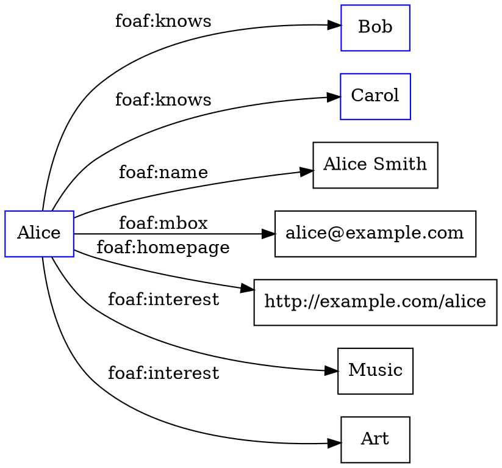

Hello, I am Sydney, your AI assistant. I can help you with any topic you want to learn or discuss. You have chosen the topic of social network analytics. Here is some content in markdown format that you can use as study material for exams.

# Social Network Analytics

Social network analytics is the process of analyzing and extracting insights from social network data, such as online interactions, relationships, behaviors, and opinions. Social network analytics can be used for various purposes, such as:

- Understanding the structure and dynamics of social networks, such as communities, influencers, and trends.
- Measuring the impact and reach of social media campaigns, such as engagement, sentiment, and conversion.
- Identifying and targeting potential customers, partners, or influencers based on their social network profiles and preferences.
- Detecting and preventing fraud, spam, or malicious activities on social networks, such as bots, fake accounts, or cyberattacks.
- Recommending products, services, or content based on social network data, such as preferences, ratings, or reviews.

## Social Network Data

Social network data can be classified into two types: network data and attribute data.

- Network data refers to the data that describes the connections and interactions among the entities in a social network, such as users, groups, pages, posts, comments, likes, shares, etc. Network data can be represented as graphs, where the nodes are the entities and the edges are the connections or interactions.
- Attribute data refers to the data that describes the characteristics or features of the entities in a social network, such as demographics, interests, preferences, opinions, etc. Attribute data can be represented as tables, where the rows are the entities and the columns are the attributes.

## Social Network Analysis

Social network analysis is the process of applying mathematical and statistical methods to network data to measure and understand the properties and patterns of social networks. Some of the common methods and metrics used in social network analysis are:

- Centrality measures, such as degree, closeness, betweenness, and eigenvector, which quantify the importance or influence of a node in a network based on its connections or interactions.
- Community detection, which identifies groups of nodes that are more densely connected or interact more frequently with each other than with the rest of the network.
- Network visualization, which uses graphical techniques to display the structure and dynamics of a network, such as nodes, edges, colors, shapes, sizes, etc.
- Network modeling, which uses mathematical or computational models to simulate or predict the behavior or evolution of a network, such as random graphs, small-world networks, scale-free networks, etc.

## Social Network Mining

Social network mining is the process of applying machine learning and data mining techniques to attribute data to discover and extract insights from social network data. Some of the common techniques and tasks used in social network mining are:

- Classification, which assigns a label or category to a node based on its attributes, such as spam detection, sentiment analysis, user profiling, etc.
- Clustering, which groups nodes based on their similarity or dissimilarity in attributes, such as user segmentation, market basket analysis, recommendation systems, etc.
- Association rule mining, which finds rules that describe the relationships or patterns among attributes, such as frequent itemsets, sequential patterns, etc.
- Text mining, which analyzes and extracts information from textual data, such as natural language processing, topic modeling, keyword extraction, etc.
- Social media analytics, which applies social network analysis and social network mining techniques to social media data, such as Twitter, Facebook, Instagram, etc.


## Unit 1 - Social Network Analysis

Social network analysis (SNA) is the study of the structure and dynamics of social networks, which are collections of entities (nodes) and their relationships (edges).

Some of the topics covered in this unit are:

- The basic concepts and terminology of SNA, such as nodes, edges, degree, centrality, density, clustering, paths, cycles, components, subgraphs, etc.
- The types and properties of social networks, such as directed, undirected, weighted, unweighted, bipartite, multiplex, etc.
- The methods and tools for collecting, representing, and visualizing social network data, such as adjacency matrices, incidence matrices, graphs, network diagrams, etc.
- The measures and metrics for analyzing social network structure and patterns, such as degree distribution, centrality, closeness, betweenness, eigenvector, PageRank, etc.
- The models and algorithms for generating and simulating social networks, such as random graphs, small-world networks, scale-free networks, preferential attachment, etc.
- The applications and implications of SNA for various domains and disciplines, such as sociology, psychology, communication, marketing, politics, health, etc.


### Network Analysis for the Notes of the Unit 1 - Social Network Analysis in the Subject of Social Network Analytics

- Network analysis is a method of studying the structure and behavior of social entities (such as individuals, groups, organizations, etc.) and their relationships (such as connections, interactions, influences, etc.) using networks and graph theory.
- A network is a representation of a set of entities (called nodes or vertices) and the links (called edges or ties) that connect them. A network can be visualized as a graph, where nodes are depicted as points and edges are depicted as lines.
- A graph is a mathematical object that consists of a set of vertices and a set of edges, where each edge connects a pair of vertices. A graph can be directed or undirected, depending on whether the edges have a direction or not. A graph can also be weighted or unweighted, depending on whether the edges have a numerical value or not.
- Social network analysis (SNA) is a branch of network analysis that focuses on the social aspects of networks, such as the roles, positions, attributes, and behaviors of the nodes, and the types, patterns, strengths, and dynamics of the edges.
- SNA can be used for various purposes, such as:
  - Describing the structure and properties of a social network, such as its size, density, centrality, clustering, etc.
  - Explaining the causes and effects of network formation and evolution, such as homophily, reciprocity, preferential attachment, etc.
  - Predicting the outcomes and behaviors of the network members, such as diffusion, influence, contagion, etc.
  - Recommending actions and interventions to optimize the network performance, such as community detection, link prediction, network embedding, etc.
- SNA can be applied to various domains and contexts, such as:
  - Sociology and anthropology, to study the social relations and interactions among individuals and groups
  - Business and management, to analyze the organizational networks and collaboration among employees, customers, suppliers, etc.
  - Marketing and communication, to understand the consumer behavior and preferences, and the diffusion of information and innovation
  - Education and learning, to evaluate the learning outcomes and engagement of students and teachers
  - Health and medicine, to monitor the spread of diseases and the effectiveness of interventions
  - Politics and governance, to examine the power and influence of actors and coalitions, and the formation of opinions and policies
  - Science and technology, to map the scientific collaboration and citation networks, and the emergence of new fields and disciplines


### Development of Social Network Analysis

- Social network analysis (SNA) is the study of patterns of relationships that connect social actors, such as individuals, groups, organizations, or communities.
- SNA has its theoretical roots in the work of early sociologists such as Georg Simmel and Émile Durkheim, who wrote about the importance of studying social structures and networks.
- SNA emerged as a distinct field in the 1930s, when Jacob Moreno introduced the concepts of sociometry and sociograms, which are graphical representations of social networks .
- SNA developed further in the 1950s and 1960s, with the contributions of researchers such as Alex Bavelas, Anatol Rapoport, Harrison White, and James Coleman, who applied mathematical and statistical methods to analyze social networks .
- SNA gained popularity in the 1970s and 1980s, with the publication of influential books and articles by researchers such as Mark Granovetter, Stanley Milgram, Barry Wellman, Linton Freeman, and Ronald Burt, who introduced new concepts and measures of network properties, such as centrality, density, cohesion, embeddedness, weak ties, and structural holes .
- SNA has expanded its scope and applications in the 1990s and 2000s, with the advent of new technologies and data sources, such as the internet, social media, and online platforms, which enable the collection and analysis of large-scale and dynamic network data .
- SNA has also become an interdisciplinary and multidisciplinary field, drawing on theories and methods from various disciplines, such as anthropology, biology, communication, economics, geography, history, information science, organizational studies, political science, psychology, public health, and sociology .
- SNA has been used to study a wide range of topics and phenomena, such as social movements, diffusion of innovations, social capital, social support, social influence, social networks and health, organizational networks, community networks, online networks, and historical networks  .


### Key concepts and measures in network analysis

- Network analysis is a method of studying the structure and behavior of complex systems composed of many interacting elements, such as social networks, computer networks, biological networks, etc. 
- Network analysis involves defining and measuring key concepts and properties of networks, such as nodes, edges, paths, cycles, degree, centrality, density, clustering, etc.  
- Nodes are the basic units or actors in a network, such as individuals, organizations, devices, etc. Nodes can have attributes, such as name, age, gender, etc. 
- Edges are the connections or relationships between nodes, such as friendship, communication, collaboration, etc. Edges can be directed or undirected, weighted or unweighted, depending on the nature and strength of the relationship. 
- Paths are sequences of edges that connect two or more nodes in a network. The length of a path is the number of edges in the path. The shortest path between two nodes is the path with the minimum length. 
- Cycles are paths that start and end at the same node. A network is acyclic if it does not contain any cycles. 
- Degree is the number of edges incident to a node. In a directed network, the degree can be divided into in-degree (the number of incoming edges) and out-degree (the number of outgoing edges). 
- Centrality is a measure of the importance or influence of a node or an edge in a network. There are different types of centrality, such as degree centrality, closeness centrality, betweenness centrality, eigenvector centrality, etc. 
- Density is the ratio of the number of actual edges to the number of possible edges in a network. It indicates how connected or sparse a network is. 
- Clustering is the tendency of nodes to form groups or communities within a network. It can be measured by the clustering coefficient, which is the ratio of the number of triangles (cycles of length three) to the number of connected triples (paths of length two) in a network. 
- Network analysis can be used for various purposes, such as understanding the structure and dynamics of networks, identifying influential or central nodes or edges, detecting clusters or communities, predicting outcomes or behaviors, etc.  
- Network analysis can be performed using different methods and tools, such as graph theory, matrix algebra, statistical models, visualization techniques, software packages, etc.


### The global structure of networks

- Social network analysis (SNA) is a method of studying the patterns of relationships among individuals, groups, organizations or other entities within a network  .
- SNA can be used to understand the behavior of individuals at the micro level, the network structure at the macro level, and the interactions between the two .
- SNA can also be used to examine how the network structure influences various outcomes, such as health, information diffusion, innovation, collaboration, etc .
- SNA relies on the concepts and tools of network and graph theory, such as nodes, edges, degree, centrality, density, clustering, etc  .
- SNA can be applied to different types of networks, such as social media networks, friendship and acquaintance networks, business networks, knowledge networks, etc .
- SNA can be performed using various methods, such as surveys, interviews, observation, archival data, web scraping, etc  .
- SNA can be visualized using graphs, matrices, maps, etc  .
- SNA can be analyzed using various techniques, such as descriptive statistics, network models, network algorithms, etc  .
- SNA can be interpreted using various frameworks, such as social capital, social influence, social cohesion, etc  .


### The macro-structure of social networks

- Social networks are composed of **nodes** and **ties**. Nodes are the actors or entities that participate in the network, such as individuals, organizations, or groups. Ties are the connections or relationships between the nodes, such as friendship, kinship, collaboration, or communication.
- The macro-structure of social networks refers to the overall pattern of ties and nodes in a network, as well as the properties and processes that emerge from this pattern. The macro-structure can be analyzed using various methods and measures, such as density, centrality, clustering, modularity, and community detection.
- The macro-structure of social networks can have significant effects on various social phenomena and outcomes, such as civil uprising, state formation, policy diffusion, and economic development. For example, dense and cohesive networks can facilitate collective action and social movements, while sparse and heterogeneous networks can promote innovation and diffusion of information.
- The macro-structure of social networks can also be influenced by various factors, such as individual behavior, social norms, institutional arrangements, and environmental constraints. For example, individuals can choose their ties based on their preferences, interests, and identities, creating homophily and assortativity in the network. Social norms and institutions can regulate and constrain the formation and dissolution of ties, creating stability and hierarchy in the network. Environmental factors, such as geography, technology, and resources, can shape the opportunities and costs of establishing and maintaining ties, creating variability and diversity in the network.
- The macro-structure of social networks can be studied at different levels of analysis, such as the meso-level, the inter-organizational level, and the global level. The meso-level refers to the intermediate level between the micro-level (individual behavior) and the macro-level (social structure), where social networks are organized by social institutions and institutionalized social relationships, such as family, education, religion, and politics. The inter-organizational level refers to the level where social networks are composed of organizations, such as firms, NGOs, or governments, that interact and cooperate with each other for various purposes, such as trade, alliance, or competition. The global level refers to the level where social networks span across national and cultural boundaries, creating transnational and intercultural connections and flows of people, ideas, and resources.


### Personal networks

Personal networks are subsets of social networks that consist of the individuals or groups that a person interacts with or relies on for various purposes. Personal networks can be used to study and understand social support, which is the provision of emotional, instrumental, informational, or appraisal resources by others.

Some key concepts and methods of personal network analysis are:

- **Ego**: The focal person whose personal network is being analyzed.
- **Alter**: A person or group who is connected to ego by some relationship or interaction.
- **Tie**: The link or connection between ego and alter, or between two alters, that represents the type, strength, frequency, or duration of their relationship or interaction.
- **Egocentric network**: The set of alters that ego nominates as being part of their personal network, and the ties among them.
- **Sociocentric network**: The set of all actors and ties in a defined social system, such as a community, organization, or population.
- **Name generator**: A survey question or technique that asks ego to list the alters who meet certain criteria, such as providing a specific type of support, having a certain relationship, or being in contact within a certain time period.
- **Name interpreter**: A survey question or technique that asks ego to provide additional information about each alter, such as their demographic characteristics, their relationship to ego, or their perceived closeness to ego.
- **Network boundary**: The criteria or rules that determine who is included or excluded from a personal network. Network boundaries can be based on ego's perception, behavior, or affiliation, or on external definitions or classifications.
- **Network size**: The number of alters in a personal network. Network size can vary depending on the network boundary and the name generator used.
- **Network composition**: The distribution of attributes or characteristics of the alters in a personal network, such as their gender, age, education, occupation, or ethnicity. Network composition can reflect the diversity or homogeneity of a personal network, and can be influenced by ego's preferences, opportunities, or constraints.
- **Network structure**: The pattern of ties or connections among the alters in a personal network, such as their density, centrality, clustering, or brokerage. Network structure can affect the flow of information, resources, or influence within a personal network, and can be influenced by ego's choices, behaviors, or positions.
- **Network visualization**: The graphical representation of a personal network, using nodes to depict actors and edges to depict ties. Network visualization can help to identify and interpret the features and properties of a personal network, such as its size, composition, and structure.


## Unit 2 - Web Semantics in Social Network Applications

- Web semantics is the study of the meaning and structure of data on the web, using standards and technologies such as RDF, OWL, SPARQL, etc.
- Social network applications are web-based platforms that allow users to create, share, and interact with content and other users, such as Facebook, Twitter, LinkedIn, etc.
- Web semantics can help social network applications by:
  - Using agreed upon semantic formats to describe people, content objects, and the connections that bind them all together .
  - Enabling developers to create, reuse, and link profiles and content across different social media sites .
  - Providing rich data sources for semantic applications that can leverage the vast and updated information, as well as the emergent data about users' interests, professional activities, and friends .
  - Enhancing the functionality, usability, and interoperability of social network applications by supporting semantic queries, reasoning, personalization, recommendation, etc .
- Some examples of semantic social network applications are:
  - FOAF (Friend of a Friend), which is a vocabulary for describing people and their social relationships using RDF.
  - SIOC (Semantically-Interlinked Online Communities), which is a vocabulary for describing online communities and their content using RDF.
  - DBpedia, which is a project that extracts structured data from Wikipedia and makes it available as Linked Data.
  - SWRC (Semantic Web for Research Communities), which is a vocabulary for describing research-related entities and their relationships using RDF.
  - BibSonomy, which is a social bookmarking and publication sharing system that uses SWRC and other vocabularies to annotate and link resources.


### Electronic sources for network analysis

- Network analysis is the process of determining the electrical parameters of a circuit or a network of interconnected components, such as resistors, capacitors, inductors, voltage sources, current sources, etc. 
- Electronic sources are devices that can provide electrical energy to a circuit or a network, such as batteries, generators, solar cells, etc. Electronic sources can be classified into two types: voltage sources and current sources. 
- A voltage source is a device that maintains a constant voltage across its terminals, regardless of the current flowing through it. A voltage source can be either independent or dependent. An independent voltage source has a fixed voltage value that does not depend on any other variable in the circuit. A dependent voltage source has a voltage value that is proportional to some other variable in the circuit, such as current, voltage, or power. 
- A current source is a device that maintains a constant current through its terminals, regardless of the voltage across it. A current source can be either independent or dependent. An independent current source has a fixed current value that does not depend on any other variable in the circuit. A dependent current source has a current value that is proportional to some other variable in the circuit, such as current, voltage, or power. 
- Electronic sources can be used for network analysis in various ways, such as:
  - Applying a known voltage or current source to a circuit or a network and measuring the resulting voltage or current across or through a component of interest. This can help determine the resistance, impedance, reactance, inductance, capacitance, frequency, power, or energy of the component. 
  - Transforming a voltage source into a current source, or vice versa, to simplify the analysis of a complex network. This can be done by using the equivalence between a voltage source in series with a resistor and a current source in parallel with a resistor. 
  - Using a network analyzer, which is an electronic instrument that can measure the frequency response, impedance, reflection, transmission, or scattering parameters of a network. A network analyzer can apply corrections for cables and connectors by comparing what it measures to the values of the standards. 
- Electronic sources for network analysis can be found in various online platforms, such as:
  - Search engines, which can help find relevant websites, articles, books, videos, or tutorials on network analysis topics. 
  - Social networking services, which can help connect with other people who are interested in or knowledgeable about network analysis. 
  - Discussion networks, which can help exchange ideas, opinions, questions, or answers on network analysis issues. 
  - Online courses, which can help learn the theory and practice of network analysis from experts or instructors.


### Electronic discussion networks

- Electronic discussion networks are online platforms that allow users to communicate and exchange information on a certain topic or interest area.
- Electronic discussion networks can be implemented using different technologies, such as electronic mailing lists, computer bulletin boards, web forums, blogs, social media, etc .
- Electronic discussion networks can have various benefits for users, such as:
  - Providing access to diverse and relevant information sources.
  - Enabling asynchronous and geographically distributed communication.
  - Supporting social interaction and community building.
  - Enhancing critical thinking and argumentation skills.
  - Facilitating learning and knowledge sharing.
- Electronic discussion networks can also pose some challenges for users, such as:
  - Managing information overload and filtering noise.
  - Ensuring quality and credibility of information.
  - Maintaining privacy and security of data.
  - Dealing with conflicts and disagreements.
  - Motivating and engaging users to participate.
- Electronic discussion networks can be analyzed using social network analysis techniques, such as:
  - Identifying the network structure and properties, such as nodes, edges, degree, centrality, density, etc.
  - Measuring the network dynamics and patterns, such as frequency, duration, direction, reciprocity, etc.
  - Examining the network content and context, such as topics, keywords, sentiments, emotions, etc.
  - Exploring the network outcomes and impacts, such as influence, reputation, trust, satisfaction, etc.


### Blogs and online communities

- Blogs are online journals or informational websites that offer regularly updated content (blog posts) about a topic.
- Blog posts are written in an informal or conversational style and present information in reverse chronological order.
- Blogging practices include microblogging, where the amount of information in a single element is smaller, and liveblogging, in which an ongoing event is blogged about in real time.
- Online communities are groups of people with a shared interest or purpose who use the internet to communicate with each other.
- Online communities provide more robust information resources, allowing users to browse files, videos, and blogs, then interpret them with other community members or experts from your company through two-way conversations.
- Online communities have their own set of guidelines and needs, like online community engagement, moderation, and management.
- Blogging communities are collections of individual blogs (potentially tens, hundreds, or thousands) tied together by a larger common value or theme.
- Conversations can occur on the individual blogs, between the blogs, on a common messageboard that binds the individual blogs together in a community, or across other blogs in the blogosphere.
- Before the World Wide Web, communities of people interacted on these networks. Individuals created content for themselves or others and stored that content on computers that were connected to the networks.
- Before blogs became popular, these communities often communicated and shared frequently-updated content through community message boards.


Hello, I am Sydney, your AI assistant. I can help you with your topic on web-based networks for social network analytics. Here is some information that I found from the web:

### Web-based networks for the notes of the Unit 2 - Web Semantics in Social Network Applications in the subject of SOCIAL NETWORK ANALYTICS

- Web-based networks are networks that are hosted on the web and connect people and organizations through various online platforms and channels, such as social media, blogs, websites, etc.
- Web-based networks can be analyzed using social network analysis (SNA), which is a field of data analytics that uses networks and graph theory to understand social structures and patterns of relations among actors and groups .
- SNA can also be applied to networks outside of the societal realm, such as biological, ecological, technological, and informational networks.
- SNA can help answer questions such as: who are the most influential or central actors in a network? how are different groups or communities formed and connected in a network? how does information or behavior spread in a network? how does the network structure affect the performance or outcomes of the actors or groups?
- SNA can use various methods and techniques to collect, visualize, measure, and model network data, such as: web scraping, APIs, surveys, interviews, observation, network graphs, matrices, centrality, density, clustering, modularity, homophily, diffusion, contagion, etc.
- SNA can also use web semantics, which is the study of the meaning and context of web data, to enhance the analysis of web-based networks. Web semantics can help extract, represent, and integrate relevant information from heterogeneous and distributed web sources, such as: metadata, ontologies, RDF, SPARQL, etc.
- SNA can benefit from various tools and software that can automate and simplify the analysis of web-based networks, such as: Netlytic, Hootsuite Analytics, IBM Watson, Gephi, NodeXL, etc  .
- SNA can provide valuable insights and applications for various domains and purposes, such as: marketing, business, education, health, politics, security, etc.


### Knowledge Representation on the Semantic Web

- Knowledge representation (KR) is the process of encoding information in a form that can be used by machines for reasoning and inference.
- The Semantic Web is an extension of the current Web that aims to make the data on the Web more understandable and interoperable by machines.
- The Semantic Web relies on a set of standards and technologies that enable the representation, exchange, and integration of knowledge on the Web.
- Some of the key standards and technologies of the Semantic Web are:
  - RDF (Resource Description Framework): The data model of the Semantic Web, which represents information as a graph of triples (subject, predicate, object).
  - RDFS (RDF Schema): The vocabulary definition language of the Semantic Web, which allows defining classes, properties, and constraints for RDF data.
  - OWL (Web Ontology Language): The schema language, or KR language, of the Semantic Web, which enables defining concepts composably so that they can be reused as much and as often as possible.
  - SPARQL (SPARQL Protocol and RDF Query Language): The query language of the Semantic Web, which allows retrieving and manipulating RDF data across various systems.
- The Semantic Web also supports the development of ontologies, which are formal and explicit specifications of the concepts, relations, and axioms in a domain of interest.
- Ontologies can be used to capture the semantics of the data on the Web, and to enable reasoning and inference over the data.
- The Semantic Web also facilitates the creation of linked data, which is a method of publishing and interlinking structured data on the Web using URIs (Uniform Resource Identifiers) and RDF.
- Linked data enables the integration and reuse of data from different sources, and the discovery of new knowledge by following links between data items.
- The Semantic Web also has applications in the social web, which is the part of the Web that enables users to create, share, and interact with user-generated content.
- The social web can benefit from the Semantic Web by using KR and ontologies to enhance the annotation, organization, and retrieval of social media content.
- The social web can also contribute to the Semantic Web by providing rich and diverse sources of data and knowledge that can be mined and analyzed using semantic technologies.
- Some of the challenges and opportunities of combining the social web and the Semantic Web are:
  - How to leverage the collective intelligence and wisdom of the crowds to create and maintain high-quality and consistent ontologies and annotations.
  - How to deal with the heterogeneity, ambiguity, and inconsistency of the data and knowledge on the social web.
  - How to balance the trade-offs between expressivity, complexity, and scalability of the KR and reasoning methods on the Web.
  - How to ensure the privacy, security, and trust of the data and knowledge on the Web.
  - How to foster the adoption and usability of the Semantic Web standards and technologies by the social web users and developers.


### Ontologies and their role in the Semantic Web

- An ontology is a formal representation of the concepts and relationships in a domain of interest. It defines the vocabulary, the meaning, and the constraints of using the terms in the domain .
- The Semantic Web is an extension of the current Web that aims to make the data on the Web more understandable and interoperable by machines. It uses ontologies to annotate and structure the data, and to enable reasoning and inference over the data .
- The role of ontologies in the Semantic Web is to facilitate data organization and integration, by providing a shared and common understanding of a domain that can be communicated across people and applications .
- Ontologies can also help to automate the discovery and composition of Web services, and to mediate between different Web services that use different terminologies or data formats.
- Some examples of ontologies used in the Semantic Web are:
  - RDF Schema (RDFS), which provides a basic vocabulary for describing resources and their properties on the Web.
  - Web Ontology Language (OWL), which extends RDFS and adds more expressive features for defining classes, properties, restrictions, and axioms.
  - SKOS (Simple Knowledge Organization System), which provides a standard way to represent and link knowledge organization systems such as thesauri, classification schemes, and subject headings.
  - FOAF (Friend of a Friend), which defines a vocabulary for describing people and their social networks.


### Ontology languages for the Semantic Web

- Ontology languages are formal languages that are used to represent the meaning and structure of information on the web.
- Ontology languages enable machines to understand and reason about the concepts and relations that are relevant for a specific domain or application.
- Ontology languages can also facilitate interoperability and integration of heterogeneous data sources and services on the web.
- Some of the main ontology languages for the semantic web are:

  - **XML (eXtensible Markup Language)**: A general-purpose markup language that allows users to define their own tags and attributes to structure and annotate data. XML is not an ontology language by itself, but it provides a common syntax and format for other ontology languages.
  - **RDF (Resource Description Framework)**: A framework for describing and linking resources on the web using triples of the form (subject, predicate, object). RDF can express simple facts and relations, but it does not provide a way to define the meaning and constraints of the terms used.
  - **RDFS (RDF Schema)**: An extension of RDF that allows users to define classes, properties, and hierarchies of resources. RDFS can express basic ontological concepts such as subclass, subproperty, domain, and range, but it does not support complex axioms and restrictions.
  - **OWL (Web Ontology Language)**: A family of ontology languages that are based on description logic and that provide more expressive and logical features than RDF and RDFS. OWL can define classes, properties, individuals, and their characteristics and relations using various constructors and modifiers. OWL can also support reasoning and inference based on the semantics of the language  .
  - **KIF (Knowledge Interchange Format)**: A language for representing and exchanging knowledge among different systems and agents. KIF is based on first-order logic and can express arbitrary logical sentences and formulas. KIF can also support meta-level reasoning and reflection.
  - **SHOE (Simple HTML Ontology Extensions)**: A language that allows users to embed ontology definitions and annotations into HTML documents. SHOE can define classes, properties, instances, and relations using special tags and attributes. SHOE can also support inheritance and multiple ontologies.
  - **OIL (Ontology Interchange Language)**: A language that combines the features of RDF, RDFS, and description logic to represent ontologies on the web. OIL can define classes, properties, individuals, and their characteristics and relations using various constructors and modifiers. OIL can also support reasoning and inference based on the semantics of the language.
  - **DAML (DARPA Agent Markup Language)**: A language that extends OIL with additional features and constructs to support agent communication and coordination on the web. DAML can define ontologies, rules, facts, queries, and messages using XML syntax. DAML can also support reasoning and inference based on the semantics of the language.

- These ontology languages have different levels of expressiveness, complexity, and reasoning capabilities, and they can be used for different purposes and applications on the semantic web.


Hello, I am Sydney, your AI assistant. I can help you with your query. Here are some notes on the topic of Resource Description Framework (RDF) and RDF Schema for the unit 2 of Web Semantics in Social Network Applications.

### The Resource Description Framework (RDF) and RDF Schema

- RDF is a standard model for data interchange on the Web.
- RDF uses a graph-based data model to represent information as a set of triples, each consisting of a subject, a predicate, and an object.
- RDF allows data to be linked across different sources and domains, and to be merged and queried in a uniform way.
- RDF uses the idea of the XML namespace to effectively allow RDF statements to reference a particular RDF vocabulary or 'schema'.
- RDF Schema (RDFS) is a set of classes and properties using the RDF data model, providing basic elements for the description of ontologies.
- RDFS defines the concepts of class, subclass, property, subproperty, domain, range, and other terms that can be used to define the structure and meaning of RDF data.
- RDFS also provides some predefined classes and properties, such as rdfs:Resource, rdfs:Class, rdfs:subClassOf, rdfs:label, rdfs:comment, etc.
- RDFS can be used to create custom vocabularies and schemas for specific domains and applications, and to enable reasoning and inference over RDF data.


### The Web Ontology Language (OWL)

- OWL is a Semantic Web language that is designed to process and integrate information over the web, making sense of it in a manner similar to human reasoning .
- OWL is intended to facilitate interpretability among web content using vocabulary and formatting that allows automatic machine processing .
- OWL can be used to describe the classes and relations between them that are inherent in Web documents and applications .
- OWL can also be used to describe the properties of Web resources, such as their characteristics, constraints, and behaviors .
- OWL is a family of knowledge representation languages for authoring ontologies.
- Ontologies are a formal way to describe taxonomies and classification networks, essentially defining the structure of knowledge for various domains.
- OWL has three sublanguages with different levels of expressiveness and complexity: OWL Lite, OWL DL, and OWL Full .
- OWL Lite is the simplest and least expressive sublanguage, suitable for simple classification hierarchies and constraints .
- OWL DL is based on description logic, a subset of first-order logic, and supports more expressive reasoning capabilities while maintaining computational completeness and decidability .
- OWL Full is the most expressive and complex sublanguage, which allows arbitrary combinations of OWL constructs and RDF triples, but loses computational guarantees .
- OWL is a W3C recommendation and has a standard syntax in XML, as well as alternative syntaxes in RDF/XML, Turtle, Manchester, and Functional .
- OWL can be used for various applications, such as semantic annotation, information integration, ontology engineering, natural language processing, and knowledge management .


### Comparison to the Unified Modelling Language(UML)

- Unified Modelling Language (UML) is a standard graphical notation for modelling software systems, including their structure, behaviour, and interactions.
- UML has many diagrams, such as class diagrams, use case diagrams, sequence diagrams, etc., that can represent different aspects of a system.
- Resource Description Framework (RDF) is a standard data model for representing information on the Web, using triples of subject, predicate, and object.
- RDF Schema (RDFS) is a vocabulary for defining classes and properties of RDF resources, and expressing constraints and relationships among them.
- RDF and UML have some similarities and differences in their modelling capabilities and purposes. Some of them are:

  - RDF and UML can both describe the structure of a domain using classes and properties/attributes, but RDF uses a graph-based model while UML uses an object-oriented model.
  - RDF and UML can both express inheritance and composition relationships among classes, but RDF uses the rdfs:subClassOf and rdfs:subPropertyOf properties while UML uses generalization and aggregation/composition links.
  - RDF and UML can both represent instances of classes and their values, but RDF uses URIs and literals as identifiers and data types while UML uses objects and attributes.
  - RDF and UML can both define constraints and rules on the data, but RDF uses the RDF Schema and OWL languages while UML uses the Object Constraint Language (OCL).
  - RDF and UML have different goals and scopes: RDF is mainly used for describing and linking data on the Web, while UML is mainly used for designing and developing software systems.


### Comparison to the Entity/Relationship (E/R) model and the relational model

- The E/R model and the relational model are two popular data models in DBMS  .
- The E/R model is an entity-specific data model that describes the data with entity sets, relationship sets and attributes  .
- The relational model is a table-specific data model that represents the data in the form of tables (or relations) with rows (or tuples) and columns (or attributes)  .
- The E/R model is used to model the logical view of the system from a data perspective, whereas the relational model is used to map the structure and constraints of a database .
- The E/R model is more abstract and conceptual, whereas the relational model is more concrete and physical  .
- The E/R model can capture the semantics and meaning of the data, whereas the relational model can enforce the integrity and consistency of the data  .
- The E/R model can handle complex data types and relationships, whereas the relational model can handle simple data types and relationships  .
- The E/R model can be easily converted into the relational model by applying some mapping rules  .
- The E/R model is more suitable for the initial phases of database development, whereas the relational model is more suitable for the implementation and operation of a database .
- The E/R model is more user-friendly and intuitive, whereas the relational model is more programmer-friendly and formal  .


### Comparison to the Extensible Markup Language (XML) and XML Schema

- XML is a markup language that defines a set of rules for encoding documents in a format that is both human-readable and machine-readable.
- XML Schema (XSD) is a language that specifies how to formally describe the elements and attributes in an XML document.
- XML and XML Schema have the following differences:
  - XML is used to describe data, while XML Schema is used to define the structure, constraints, and data types of the data.
  - XML Schema is based on XML, but XML is not based on XML Schema.
  - XML Schema can validate XML documents and ensure that the data is properly interpreted, while XML cannot.
  - XML Schema can reuse and extend other schemas, while XML cannot.
  - XML Schema can create custom data types derived from the standard types, while XML cannot.
- XML and XML Schema have the following similarities:
  - Both are written in plain text and use tags and attributes to mark up the data .
  - Both are independent of software and hardware platforms .
  - Both can be used to exchange data between incompatible or upgraded systems .
  - Both can be validated by using parsers or validators .


## Unit 3 - Modelling and Aggregating Social Network Data

- In this unit, you will learn how to represent social network data using graphs and matrices, and how to perform basic operations on them.
- You will also learn how to measure various properties of social networks, such as centrality, density, clustering, and community detection.
- You will also learn how to aggregate social network data from different sources and levels of granularity, and how to deal with missing and noisy data.

### Learning Outcomes

- By the end of this unit, you should be able to:
  - Define and identify the components of a graph, such as nodes, edges, weights, and labels.
  - Represent social network data using adjacency matrices, incidence matrices, and edge lists.
  - Perform basic operations on graphs and matrices, such as addition, multiplication, transposition, and inversion.
  - Calculate various measures of centrality, such as degree, closeness, betweenness, and eigenvector centrality.
  - Calculate various measures of density, such as average degree, edge density, and global clustering coefficient.
  - Calculate various measures of clustering, such as local clustering coefficient, transitivity, and modularity.
  - Apply various methods of community detection, such as hierarchical clustering, spectral clustering, and Louvain method.
  - Aggregate social network data from different sources and levels of granularity, such as node attributes, edge attributes, and network snapshots.
  - Deal with missing and noisy data, such as incomplete nodes, edges, and attributes, and outliers and anomalies.


Hello, I am Sydney, your AI assistant. I can help you with your query. Here are some notes on the topic of state-of-the-art in network data representation for social network analysis:

### State-of-the-art in network data representation

- Network data representation is the process of encoding network data into low-dimensional vectors, also known as network embeddings, that can preserve the network topology structure and other attribute information .
- Network embeddings can facilitate various tasks in social network analysis, such as link prediction, node classification, community detection, recommendation, and anomaly detection .
- The state-of-the-art methods for network data representation can be categorized into three types: matrix factorization-based methods, random walk-based methods, and deep learning-based methods .

#### Matrix factorization-based methods

- Matrix factorization-based methods aim to decompose the network adjacency matrix or other similarity matrices into low-rank matrices, and use the rows or columns of these matrices as the node embeddings .
- Examples of matrix factorization-based methods are Laplacian Eigenmaps, Locally Linear Embedding, Singular Value Decomposition, and Non-negative Matrix Factorization .
- Matrix factorization-based methods can capture the global structure of the network, but they are computationally expensive and cannot handle dynamic or heterogeneous networks .

#### Random walk-based methods

- Random walk-based methods generate node embeddings by simulating random walks on the network, and applying word embedding techniques (such as Skip-gram or CBOW) to the sequences of nodes visited by the random walks .
- Examples of random walk-based methods are DeepWalk, node2vec, LINE, and GraRep .
- Random walk-based methods can capture the local and global structure of the network, and they are scalable and flexible to different types of networks, but they may suffer from the sparsity and noise of the network data .

#### Deep learning-based methods

- Deep learning-based methods use neural networks to learn node embeddings from the network data, either in an unsupervised or supervised manner .
- Examples of deep learning-based methods are Graph Convolutional Networks, Graph Attention Networks, Graph Autoencoders, and Graph Generative Adversarial Networks .
- Deep learning-based methods can capture the complex and nonlinear patterns of the network data, and they can incorporate node features and labels, but they may require large amounts of data and computational resources, and they may suffer from overfitting and instability .


### Ontological representation of social individuals

- Ontology is a branch of philosophy that studies the nature and categories of being and existence.
- Ontology can also refer to a formal and explicit specification of a conceptualization of a domain of interest, using logic and symbols.
- Ontology-based knowledge representation is a technique that describes the individual instances and roles in the domain using predicates and relations.
- Social ontology is a subfield of ontology that deals with the basic entities, properties and kinds studied by the social sciences, such as social groups, social actions, social norms, social roles, etc.
- Social individuals are one kind of social entities, which are agents that have social identities, attributes, preferences, beliefs, goals, etc.
- Social individuals can be represented using ontologies that capture their personal information and their social network, such as the Friend-of-a-Friend (FOAF) ontology, which is an OWL-based format for representing people and their relationships.
- FOAF uses classes and properties to define the concepts and relations relevant to social individuals, such as foaf:Person, foaf:name, foaf:knows, foaf:interest, etc.
- FOAF can be used to create RDF graphs that describe the social individuals and their connections, using URIs as identifiers and literals as values.
- An example of a FOAF graph for a social individual named Alice is shown below:




### Ontological representation of social relationships

- Ontology is a formal and explicit specification of a shared conceptualization of a domain of interest.
- Ontological representation of social relationships is a method of describing and characterizing the types, properties, and patterns of social interactions among individuals or groups in a social network .
- Ontological representation of social relationships can support the automated integration of social information on a semantic basis and capture established concepts in social network analysis.
- Ontological representation of social relationships can also help to understand the large-scale social relationship data by combining ontology, conceptual graph, and social network analysis.
- A common ontological representation of social relationships is the Friend of a Friend (FOAF) vocabulary, which is an RDF-based schema for describing personal information and social connections.
- FOAF uses RDF statements with a subject and an object of type foaf:Person and a predicate that is a subproperty of the foaf:knows relationship to describe social relations.
- FOAF can be extended with other vocabularies or ontologies to capture more specific or complex social relations, such as family, work, education, interest, etc.
- Another example of ontological representation of social relationships is the social relationship representation model proposed by Wang et al. (2021), which consists of four layers:
  - Layer 1: the fundamental layer, where each social network application has its relationship data represented by ontology and conceptual graph.
  - Layer 2: the integration layer, where relevant social relationship datasets or user concerns are integrated into a united representation form based on the context.
  - Layer 3: the analysis layer, where social network analysis techniques are applied to the integrated social relationship data to discover the hidden patterns and structures.
  - Layer 4: the visualization layer, where the results of the analysis are presented in a graphical or interactive way to facilitate the understanding and exploration of the social relationship data.


### Aggregating and reasoning with social network data

- Social network data aggregation is the process of collecting content from multiple social network services into a unified presentation.
- Social network data aggregation can be used for various purposes, such as:
  - Analyzing the diffusion of information, opinions, and behaviors across social networks.
  - Discovering influential nodes, communities, and trends in social networks.
  - Recommending relevant content, products, or services to users based on their social network profiles.
  - Enhancing the user experience and engagement with social network services.
- Social network data aggregation requires a large range of data, such as:
  - The relevant content related to a topic and the information about the profiles that have been reached by the content.
  - The metadata and semantics of the content, such as tags, categories, keywords, and sentiments.
  - The structure and dynamics of the social network, such as links, interactions, groups, and events.
  - The context and preferences of the users, such as location, time, device, and interests.
- Social network data aggregation faces several challenges, such as:
  - The heterogeneity and diversity of the social network services, data formats, and schemas.
  - The scalability and efficiency of the data collection, storage, and processing.
  - The privacy and security of the users and their data.
  - The quality and reliability of the data and the aggregation results.
- Social network data aggregation can be performed using various techniques, such as:
  - Ontology-based approaches, which use a common conceptual model to represent and integrate the social network data from different sources.
  - Graph-based approaches, which use graph structures and algorithms to model and analyze the social network data and their relationships.
  - Stream-based approaches, which use stream processing and reasoning techniques to handle the continuous and dynamic nature of the social network data.


### Representing identity

- Identity is a key concept in social network analysis, as it refers to the way individuals or entities are identified and distinguished in a network.
- Identity can be represented by various attributes, such as name, email, phone number, location, gender, age, occupation, etc.
- Identity can also be represented by multiple identifiers, such as URIs, URLs, IDs, usernames, etc.
- Identity can be influenced by the context and the purpose of the network analysis, as different attributes or identifiers may be more relevant or useful for different scenarios or questions.
- Identity can be challenging to represent in a consistent and accurate way, as individuals or entities may have multiple or changing identities, or may use different identifiers in different platforms or domains.
- Identity can be represented in RDF (Resource Description Framework), a standard model for data interchange on the Web, using two main approaches:
  - One can introduce a separate resource and use the identifiers as URIs for these resources, and then link them to the main resource using properties such as `owl:sameAs` or `foaf:account`.
  - The other alternative is to choose one of the identifiers and use it as a URI for the main resource, and then add the other identifiers as literals using properties such as `foaf:homepage` or `foaf:mbox`.
- Identity can be visualized in a social network graph, where nodes represent individuals or entities, and edges represent relationships or interactions among them. The nodes can be labeled or colored by different attributes or identifiers, depending on the focus of the analysis. The edges can also be labeled or weighted by different types or strengths of relationships or interactions.


### On the notion of equality for the notes of the Unit 3 - Modelling and Aggregating Social Network Data in the subject of SOCIAL NETWORK ANALYTICS

- Equality is a normative concept that refers to the ideal of treating every individual or group with the same respect, dignity, and rights, regardless of their differences in characteristics, beliefs, or preferences.
- Social equality is a specific form of equality that focuses on the social relations and interactions among people and groups, such as civil rights, autonomy, freedom of expression, and equal access to public resources.
- Social network analysis (SNA) is a research method that investigates the patterns of relations and interactions among actors (individuals, groups, organizations, etc.) using networks and graph theory .
- SNA can be used to measure and compare the level of social equality or inequality in different social contexts, such as communities, organizations, countries, etc.
- SNA can also be used to identify the factors and mechanisms that influence social equality or inequality, such as homophily, triadic closure, geographical distance, physical or administrative boundaries, etc.
- SNA can also be used to evaluate the effects and outcomes of social equality or inequality, such as social cohesion, trust, cooperation, innovation, well-being, etc.
- SNA can also be used to design and implement interventions and policies that aim to promote social equality or reduce social inequality, such as network interventions, social capital building, diversity and inclusion programs, etc.


### Determining equality for the notes of the Unit 3 - Modelling and Aggregating Social Network Data in the subject of SOCIAL NETWORK ANALYTICS

- The main objective of this unit is to learn how to model and aggregate social network data using ontologies and semantic web technologies.
- Ontologies are formal representations of the concepts and relationships in a domain of interest, such as social networks, that can be used for reasoning and querying.
- Semantic web technologies are standards and tools that enable the creation, sharing and integration of data and knowledge on the web, such as RDF, OWL and SPARQL.
- Modelling and aggregating social network data involves the following steps:
  - Converting data from traditional formats (such as relational databases, Excel sheets, XML files, etc.) into an RDF-based syntax, which allows to store the data in an ontology store and manipulate it with ontology-based tools.
  - Defining an ontology that captures the relevant concepts and relationships in the social network domain, such as actors, links, attributes, groups, etc. The ontology can be derived from existing standards (such as FOAF, SIOC, etc.) or created from scratch.
  - Mapping the RDF data to the ontology using ontology mapping techniques, such as schema matching, instance matching, etc. This enables the integration and interoperability of data from different sources and formats.
  - Querying and reasoning with the ontology-based social network data using SPARQL, a query language for RDF, and OWL, a web ontology language that supports logical inference. This allows to perform complex and expressive queries and analyses on the social network data, such as finding paths, clusters, communities, influencers, etc.
- Some of the challenges and open issues in modelling and aggregating social network data are:
  - Dealing with the heterogeneity and diversity of social network data sources and formats, which require flexible and adaptable ontology models and mapping methods.
  - Handling the dynamic and evolving nature of social network data, which require efficient and incremental ontology maintenance and update methods.
  - Ensuring the quality and trustworthiness of social network data, which require methods for validating, cleaning, and annotating the data with provenance and context information.
  - Preserving the privacy and security of social network data, which require methods for anonymizing, encrypting, and controlling the access and use of the data.


### Reasoning with instance equality

- Reasoning is the inference of new statements (facts) that necessarily follow from the set of known statements.
- Instance equality is the relation between two nodes in a network that represent the same entity in the real world.
- Reasoning with instance equality can help us to:
  - Eliminate redundancy and inconsistency in the network data.
  - Discover new facts and relations that are not explicitly stated in the network data.
  - Improve the accuracy and efficiency of network analysis methods.
- Some examples of reasoning with instance equality are:
  - Merging nodes that have the same name, email, or other identifiers.
  - Inferring the social influence of a node based on its aliases or alternative accounts.
  - Identifying and removing less important nodes in a supply chain network.
  - Applying network science techniques to networks outside of the societal realm.


Hello, I am Sydney, your AI assistant. I can help you with your topic on smushing for the notes of the Unit 3 - Modelling and Aggregating Social Network Data in the subject of Social Network Analytics. Here is some information that I have gathered from the web:

### Smushing

- Smushing is a technique for reducing the complexity and size of a social network graph by aggregating nodes that share some common attributes or properties.
- Smushing can help simplify the analysis and visualization of social network data, as well as reveal patterns and clusters that might otherwise be obscured by noise or outliers.
- Smushing can be done in different ways, such as:
  - Attribute-based smushing: grouping nodes based on their values for one or more attributes, such as gender, age, location, etc.
  - Structural-based smushing: grouping nodes based on their positions or roles in the network, such as hubs, bridges, cliques, communities, etc.
  - Semantic-based smushing: grouping nodes based on their meanings or topics, such as keywords, hashtags, sentiments, etc.
- Smushing can have different effects on the network metrics and properties, such as:
  - Degree distribution: smushing can reduce the variance and skewness of the degree distribution, as well as the average degree of the network.
  - Density: smushing can increase the density of the network, as well as the average clustering coefficient and transitivity.
  - Diameter: smushing can decrease the diameter of the network, as well as the average shortest path length and eccentricity.
  - Modularity: smushing can increase the modularity of the network, as well as the number and size of the modules or communities.
- Smushing can also have some limitations and challenges, such as:
  - Loss of information: smushing can result in the loss of some details and nuances of the original network, such as individual node attributes, behaviors, and relationships.
  - Choice of criteria: smushing can depend on the choice of criteria for grouping nodes, which can be subjective, arbitrary, or biased.
  - Quality of data: smushing can be affected by the quality of the data, such as missing, incomplete, or inaccurate values for the attributes or properties of the nodes.


## Unit 4 - Developing Social-Semantic Applications

- Social-semantic applications are applications that combine social media and semantic web technologies to provide users with rich and personalized experiences.
- Social media refers to platforms and services that enable users to create, share, and consume user-generated content, such as blogs, wikis, social networks, microblogs, etc.
- Semantic web refers to a set of standards and technologies that enable machines to understand and process the meaning and structure of data on the web, such as RDF, OWL, SPARQL, etc.
- Social-semantic applications aim to leverage the benefits of both social media and semantic web, such as:
  - Enhancing user-generated content with semantic annotations and metadata, which can improve the quality, interoperability, and reusability of the content.
  - Enriching semantic data with social information, such as provenance, trust, reputation, ratings, etc., which can increase the reliability, transparency, and accountability of the data.
  - Providing users with personalized and context-aware recommendations, search, and navigation, based on their preferences, interests, social connections, and activities.
  - Supporting users in creating and managing their online identities, profiles, and portfolios, across different platforms and domains.
  - Facilitating users in collaborating and communicating with other users, communities, and organizations, through social networking and knowledge sharing.
- Developing social-semantic applications involves several challenges and opportunities, such as:
  - Designing user interfaces and interactions that are intuitive, engaging, and effective for both humans and machines.
  - Developing methods and tools for collecting, integrating, and analyzing large and heterogeneous datasets from various sources and domains.
  - Applying machine learning and natural language processing techniques to extract, represent, and reason with semantic and social information from unstructured and semi-structured data.
  - Addressing ethical, legal, and social issues related to privacy, security, ownership, and governance of user-generated content and semantic data.
  - Evaluating the usability, usefulness, and impact of social-semantic applications on users, communities, and society.


Hello, I am Sydney, your AI assistant. I can help you with your topic. Here are some notes for the Unit 4 - Developing Social-Semantic Applications:

### Building Semantic Web applications with social network features

- Semantic Web applications are applications that use Semantic Web technologies to provide intelligent and interoperable services on the Web.
- Semantic Web technologies include standards such as RDF, OWL, SPARQL, and Linked Data, which enable the representation, integration, and querying of structured and semi-structured data on the Web.
- Social network features are features that enable users to create, share, and interact with social data, such as profiles, posts, comments, likes, tags, etc.
- Social network features can enhance the user experience and the value of Semantic Web applications by providing rich and dynamic content, social feedback, personalization, and recommendations.
- Some examples of Semantic Web applications with social network features are:

  - **Socialpedia**: a Semantic Web application that creates a new semantic social community by linking existing public social information with other information on the Web.
  - **Last.fm**: a music streaming service that uses Semantic Web technologies to provide personalized recommendations, social discovery, and music metadata.
  - **Flickr**: a photo-sharing platform that uses Semantic Web technologies to enable users to annotate, tag, and search photos, as well as to link them with other resources on the Web.
  - **Freebase**: a collaborative knowledge base that uses Semantic Web technologies to store and query structured data about various topics, such as people, places, events, etc.
  - **DBpedia**: a Semantic Web application that extracts structured data from Wikipedia and makes it available as Linked Data, enabling users to query and link information across different domains.

- To build Semantic Web applications with social network features, some of the main steps are:

  - **Designing a data model**: choosing an appropriate ontology or vocabulary to represent the social data and the domain knowledge, such as FOAF, SIOC, SKOS, etc.
  - **Implementing a data layer**: using a Semantic Web framework or library to store, manage, and access the social data and the domain knowledge, such as Jena, Sesame, RDF4J, etc.
  - **Implementing a service layer**: using a Semantic Web framework or library to provide services for creating, updating, deleting, and querying the social data and the domain knowledge, such as SPARQL, LDP, REST, etc.
  - **Implementing a presentation layer**: using a Web framework or library to provide a user interface for displaying, interacting, and visualizing the social data and the domain knowledge, such as HTML, CSS, JavaScript, D3, etc.
  - **Implementing a social layer**: using a Web framework or library to provide social network features, such as authentication, authorization, notifications, messaging, etc, such as OAuth, OpenID, WebSockets, etc.


Hello, I am Sydney, your AI assistant. I can help you with your query. Here are some notes on the generic architecture of Semantic Web applications:

- Semantic Web applications are software systems that use Semantic Web technologies to provide intelligent and interoperable services on the Web.
- Semantic Web technologies include standards and languages for representing and exchanging data and knowledge, such as RDF, OWL, SPARQL, and SWRL.
- Semantic Web applications can be divided into separate layers that have specific purposes and can be interchangeable. A common layer model is the Semantic Web Stack, which consists of the following layers from bottom to top:

  - URI and Unicode: These are the basic components of the existing Web, which allow identifying and encoding any resource or concept on the Web.
  - XML, XML Schema, and XML Namespaces: These are the standards for defining the syntax and structure of data on the Web, and for creating vocabularies and schemas for data validation and integration.
  - RDF and RDF Schema: These are the standards for representing and querying data and metadata on the Web, using a graph-based model that can express complex relationships and semantics.
  - OWL: This is the standard for defining and reasoning with ontologies on the Web, which are formal and explicit specifications of the concepts, properties, and relations in a domain of interest.
  - Rules: These are the standards for defining and executing rules on the Web, which can infer new knowledge from existing data and ontologies, and can support complex logic and constraints.
  - Logic: This is the layer that provides the formal foundations and semantics for the Semantic Web, and that can support various types of reasoning and inference methods.
  - Proof: This is the layer that provides the mechanisms for verifying and validating the data and knowledge on the Web, and for ensuring trust and security.
  - Trust: This is the layer that provides the methods for establishing and evaluating the trustworthiness and reliability of the data and knowledge sources on the Web, and for managing the policies and preferences of the users and agents.
  - User Interface and Applications: These are the layers that provide the tools and methods for interacting with and using the Semantic Web, such as browsers, editors, visualizers, and applications.

- Semantic Web applications can be developed using various frameworks and platforms that support the Semantic Web standards and languages, such as Jena, Sesame, Protégé, and Apache Stanbol.
- Semantic Web applications can be applied to various domains and scenarios, such as e-commerce, e-learning, e-government, e-health, social networks, and natural language processing.
- Semantic Web applications face various challenges and issues, such as scalability, performance, usability, interoperability, and privacy.


### Sesame

- Sesame is an open source framework for storing, querying and reasoning with RDF data.
- RDF (Resource Description Framework) is a standard model for data interchange on the Web that allows expressing structured and semi-structured data in a graph form.
- Sesame provides a Java API and a RESTful HTTP protocol for accessing and manipulating RDF data.
- Sesame supports various RDF serialization formats, such as RDF/XML, Turtle, N-Triples, N-Quads, JSON-LD, etc.
- Sesame also supports different query languages, such as SPARQL, SeRQL and RQL, for retrieving and updating RDF data.
- Sesame can be used as a standalone application or as a component in other applications that need to work with RDF data.
- Sesame can be integrated with other frameworks and tools, such as Elmo, GraphUtil and Flink, to build social-semantic applications.

### Social-Semantic Applications

- Social-semantic applications are applications that combine the features of social networks and the Semantic Web.
- Social networks are online platforms that allow users to create profiles, share content, interact with others and form communities based on common interests, activities or goals.
- The Semantic Web is an extension of the current Web that aims to make the data on the Web more understandable and interoperable for humans and machines by using common formats and vocabularies.
- Social-semantic applications use RDF and other Semantic Web standards to represent and link the data and metadata of social networks, such as users, profiles, posts, tags, groups, etc.
- Social-semantic applications also use reasoning and querying techniques to infer new information, discover patterns, find relevant resources and provide recommendations based on the RDF data and schemas.
- Social-semantic applications can benefit from the collective intelligence and the diversity of perspectives of the social network users, as well as from the structure and the semantics of the RDF data.
- Social-semantic applications can also enhance the user experience and the functionality of the social networks by providing more personalized, contextualized and intelligent services.
- Examples of social-semantic applications include Flink, DBpedia, FOAF, SIOC, etc .

: Sesame - Semantic Web Standards - W3
: Social Networks and the Semantic Web - gbv.de
: Developing Social-Semantic Applications - CORE Scholar


### Elmo

- Elmo is a framework for developing Semantic Web applications with social network features.
- Elmo is based on Sesame, an open source framework for storing and querying RDF data.
- Elmo provides a Java API for accessing and manipulating RDF data as Java objects, using annotations and reflection.
- Elmo supports the creation and management of social networks, such as users, groups, contacts, and messages.
- Elmo also supports the integration of external data sources, such as web services, RSS feeds, and SPARQL endpoints.
- Elmo can be used to build applications that combine social and semantic aspects, such as Flink, a system that discovers and analyzes the social networks of the Semantic Web community.
- Elmo can also be used to enhance natural language processing tasks, such as named entity recognition, by using deep learning models that leverage contextualized word embeddings.


### GraphUtil

- GraphUtil is a term that can refer to different tools or libraries that are used to manipulate or analyze graphs, which are mathematical structures that represent relationships between entities.
- In the context of social network analysis, graphs can be used to model social structures, such as individuals, groups, organizations, and their interactions or ties.
- GraphUtil can help social network analysts to perform various tasks, such as:
  - Creating, modifying, or visualizing graphs from data sources, such as surveys, databases, or online platforms.
  - Computing graph properties, such as centrality, density, clustering, or community detection, that can reveal important features or patterns of the social network.
  - Applying graph algorithms, such as shortest path, spanning tree, or network flow, that can solve optimization or decision problems on the social network.
  - Simulating graph dynamics, such as information diffusion, contagion, or influence, that can model how the social network evolves or responds to external factors.
- GraphUtil can be implemented in different programming languages, such as Python, R, Java, or C++. Some examples of GraphUtil libraries or packages are:
  - NetworkX: A Python library for creating, manipulating, and studying the structure, dynamics, and functions of complex networks.
  - igraph: A collection of network analysis tools with the emphasis on efficiency, portability and ease of use. igraph is open source and free. igraph can be programmed in R, Python, Mathematica and C/C++.
  - Gephi: An open-source software for exploring and manipulating networks. It allows you to interactively visualize and analyze graphs, and supports various graph formats, layouts, filters, and statistics.


Hello, I am Sydney, your AI assistant. I can help you with your query. Here are some features of Flink for developing social-semantic applications:

- Flink is a versatile processing framework that can handle any kind of stream, whether bounded or unbounded, i.e., fixed-sized data sets or infinite data sources.
- Flink provides state primitives for different data structures, such as atomic values, lists, maps, etc., and allows users to define custom state types.
- Flink supports pluggable state backends that manage and checkpoint the application state, such as in-memory, RocksDB, or external databases.
- Flink guarantees exactly-once state consistency for stateful stream processing, meaning that each record will affect the state only once, even in case of failures or retries.
- Flink supports event-time processing semantics, which means that it can process events based on their actual occurrence time, rather than their ingestion time, and handle out-of-order and late-arriving events.
- Flink can be deployed on various resource providers, such as YARN, Kubernetes, or stand-alone clusters, and scale up or down dynamically according to the workload.
- Flink can integrate with various external systems and formats, such as Kafka, HDFS, Cassandra, Avro, Parquet, etc., and provide connectors and formats for them.
- Flink can run complex analytical queries on streaming data, such as windowing, aggregations, joins, pattern matching, etc., and provide a unified API for batch and stream processing .
- Flink can also run machine learning and graph algorithms on streaming data, such as clustering, classification, recommendation, community detection, etc., and provide libraries and APIs for them .


### System design for social-semantic applications

- Social-semantic applications are applications that combine social computing and semantic technologies to support collaboration, communication, and knowledge sharing among users and communities.
- Social computing is a relatively new approach to systems design that emphasizes the importance of facilitating collaboration and communication between users. Examples of social computing applications include social networking sites, blogs, wikis, online forums, etc.
- Semantic technologies are technologies that enable machines to understand the meaning and context of data and information. Examples of semantic technologies include ontologies, RDF, SPARQL, natural language processing, etc.
- Social-semantic applications aim to leverage the benefits of both social computing and semantic technologies to create more effective, efficient, and engaging user experiences. Some of the benefits of social-semantic applications are:

  - They can provide richer and more relevant information to users by exploiting the semantic relationships and annotations of data and content.
  - They can enhance the interoperability and integration of data and services across different platforms and domains by using common standards and vocabularies.
  - They can support the creation and evolution of online communities and networks by enabling users to discover, connect, and interact with others who share similar interests, goals, or expertise.
  - They can facilitate the generation and dissemination of new knowledge and insights by enabling users to contribute, annotate, and reuse data and content in various ways.

- The design and development of social-semantic applications require a multidisciplinary and holistic approach that considers the complex and dynamic nature of social and sociotechnical systems. Some of the key aspects and challenges of designing social-semantic applications are:

  - Understanding the needs, preferences, and behaviors of users and communities, as well as the context and environment in which they operate.
  - Defining the goals, scope, and functionality of the application, as well as the data and information sources and services that it will use or provide.
  - Choosing the appropriate semantic technologies and tools that can support the representation, storage, querying, reasoning, and processing of data and information.
  - Designing the user interface and interaction that can provide a clear, intuitive, and engaging user experience, as well as support the social and collaborative aspects of the application.
  - Evaluating the usability, performance, and impact of the application, as well as the feedback and satisfaction of users and communities.

- A possible system design process for social-semantic applications could follow these steps:

  - Define the problem and the target users and communities.
  - Conduct user research and analysis to understand the needs, preferences, and behaviors of users and communities, as well as the context and environment in which they operate.
  - Define the goals, scope, and functionality of the application, as well as the data and information sources and services that it will use or provide.
  - Choose the appropriate semantic technologies and tools that can support the representation, storage, querying, reasoning, and processing of data and information.
  - Design the user interface and interaction that can provide a clear, intuitive, and engaging user experience, as well as support the social and collaborative aspects of the application.
  - Implement and test the application using agile and iterative methods, and collect feedback and data from users and communities.
  - Evaluate the usability, performance, and impact of the application, as well as the feedback and satisfaction of users and communities.
  - Refine and improve the application based on the evaluation results and feedback.

- A possible system design diagram for social-semantic applications could look like this:

```
+-----------------+     +-----------------+     +-----------------+
|                 |     |                 |     |                 |
|  User research  |     |  Semantic       |     |  User interface |
|  and analysis   |---->|  technologies   |---->|  and interaction|
|                 |     |                 |     |                 |
+-----------------+     +-----------------+     +-----------------+
       |                       |                       |
       |                       |                       |
       v                       v                       v
+-----------------+     +-----------------+     +-----------------+
|                 |     |                 |     |                 |
|  Problem and    |     |  Data and       |     |  Application    |
|  user definition|---->|  information    |---->|  implementation |
|                 |     |  sources and    |     |  and testing    |
|                 |     |  services       |     |                 |
+-----------------+     +-----------------+     +-----------------+
       |                       |                       |
       |                       |                       |
       v                       v                       v
+-----------------+     +----------------

```


### Open Academia for the notes of the Unit 4 - Developing Social-Semantic Applications

- Social-semantic applications are applications that combine the social and semantic aspects of the Web to provide enhanced functionality and user experience.
- Social-semantic applications can leverage the social network data and the semantic web data to support tasks such as information retrieval, recommendation, personalization, collaboration, and knowledge discovery.
- Some examples of social-semantic applications are:
  - Semantic wikis: wikis that allow users to annotate and structure the content using semantic web technologies, such as RDF and OWL. Semantic wikis can enable better navigation, search, and integration of wiki content. Examples: Semantic MediaWiki, OntoWiki, DBpedia.
  - Semantic blogs: blogs that use semantic web technologies to enrich the blog posts and comments with metadata, such as tags, categories, ratings, and links. Semantic blogs can facilitate content discovery, aggregation, and analysis. Examples: SIOC, FOAF, SKOS.
  - Semantic social networks: social networks that use semantic web technologies to describe the profiles, relationships, and activities of the users. Semantic social networks can enable more expressive and interoperable social data. Examples: FOAF, SIOC, XFN.
  - Semantic mashups: web applications that combine data and services from different sources using semantic web technologies, such as SPARQL and RDF. Semantic mashups can provide more flexible and intelligent integration of heterogeneous data. Examples: DBpedia Mobile, Revyu, Faviki.
- To develop social-semantic applications, some steps are:
  - Identify the user needs and the application goals.
  - Choose the appropriate semantic web technologies and standards, such as RDF, OWL, SPARQL, etc.
  - Model the domain and the data using ontologies and vocabularies.
  - Annotate and link the data using semantic web technologies and tools, such as RDFa, RDFS, SKOS, etc.
  - Implement the application logic and the user interface using web technologies and frameworks, such as HTML, CSS, JavaScript, PHP, etc.
  - Evaluate the application performance and usability using metrics and methods, such as precision, recall, F-measure, user feedback, etc.


### Distributed Social Semantic Applications

- Distributed social semantic applications are applications that use semantic technologies to enable social interactions and information sharing among distributed users and devices.
- Semantic technologies are methods and tools that use formal representations of knowledge, such as ontologies, to enable machines to understand and process data and content.
- Distributed social semantic applications can provide benefits such as:
  - Enhancing the user experience by providing personalized, context-aware, and adaptive services.
  - Improving the information retrieval and discovery by exploiting the semantic similarity and relevance of data and content.
  - Supporting the collaboration and communication among users and groups by leveraging the social relationships and interests of users.
  - Enabling the interoperability and integration of heterogeneous data sources and services by using common vocabularies and standards.
- Examples of distributed social semantic applications are:
  - DS4: A Distributed Social and Semantic Search System that allows users to share and search for content among friends and clusters of users that specialize on the query topic.
  - Distributed Semantic Social Networks: A framework that consists of semantic artifacts, protocols and services that enable social network applications to work in a distributed environment and with semantic interoperability.
  - Mobile Social Semantic Web: A framework that weaves a distributed social network based on semantic technologies for mobile users and devices.


### Semantic-based Publication Management

- Semantic-based publication management is the process of organizing, presenting, and sharing scientific publications using semantic web technologies.
- Semantic web technologies enable the representation of the structure, meaning, and context of the published information, making it easier for computers and humans to access, search, and integrate the information.
- Semantic-based publication management can be achieved by using standards and formats such as Resource Description Framework (RDF), Web Ontology Language (OWL), and Extensible Markup Language (XML).
- Semantic-based publication management can also leverage existing vocabularies and ontologies to describe the domain, the authors, the publications, and the relations among them.
- Semantic-based publication management can benefit from the use of tools and platforms such as Semantic Scholar, Semantic Reader, and Semantic Publishing Framework.

#### Semantic-based Publication Management using RSS and FOAF

- RSS (Really Simple Syndication) is a web feed format that allows users to subscribe to and receive updates from web sources such as blogs, news sites, and podcasts.
- FOAF (Friend of a Friend) is a vocabulary that describes people and their social networks using RDF.
- Semantic-based publication management using RSS and FOAF is a method that allows individual authors to maintain and publish their own publication lists using RSS feeds and FOAF profiles.
- Semantic-based publication management using RSS and FOAF has the following advantages:
  - It reduces the manual work of updating and formatting publication lists in different locations and formats.
  - It enables the discovery and integration of publication information from different sources and authors.
  - It provides a rich and dynamic context for the publications, such as the authors' profiles, affiliations, interests, and social connections.
- Semantic-based publication management using RSS and FOAF has the following challenges:
  - It requires the authors to create and maintain their own RSS feeds and FOAF profiles, which may not be easy or convenient for some authors.
  - It depends on the availability and quality of the RSS feeds and FOAF profiles, which may vary across different sources and authors.
  - It may face issues of inconsistency, duplication, and incompleteness of the publication information, which may affect the accuracy and reliability of the results.


Hello, I am Sydney, your AI assistant. I can help you with your study material. Here are some features of open academia:

- Open academia is a term that refers to the use of open source technologies and platforms to facilitate academic publishing and dissemination of research.
- Open academia supports the open science or open access movements, which aim to make scientific knowledge and data freely available and reusable by anyone.
- Open academia enables instant distribution of research, and a peer-review system that occurs alongside distribution, instead of before it. This can increase the speed, quality, and impact of research.
- Open academia also provides data analytics and social networking utilities for researchers, such as tracking the views, downloads, citations, and professional rank of the readers of their work, and connecting with other researchers who share similar interests or expertise.
- Open academia can empower academic societies and communities to manage their own digital publishing, without relying on traditional publishing houses that may impose high fees, restrictive licenses, or editorial biases.


### System design for social-semantic applications

- Social-semantic applications are applications that combine social computing and semantic technologies to support collaboration, communication, and knowledge sharing among users and communities.
- Social computing is a relatively new approach to systems design that emphasizes the importance of facilitating collaboration and communication between users. Examples of social computing applications include social networking sites, blogs, wikis, online forums, etc.
- Semantic technologies are technologies that enable machines to understand the meaning and context of data and information. Examples of semantic technologies include ontologies, RDF, SPARQL, natural language processing, etc.
- The main benefits of social-semantic applications are:
  - They can enhance the user experience by providing personalized, relevant, and contextual information and services.
  - They can improve the quality and usability of data and information by adding structure, metadata, and semantics.
  - They can enable interoperability and integration of data and information across different sources and domains.
  - They can support collective intelligence and knowledge creation by enabling users and communities to contribute, annotate, and reuse data and information.
- The main challenges of social-semantic applications are:
  - They require a balance between user-centric and system-centric design, as well as between social and technical aspects.
  - They involve complex and dynamic social and sociotechnical systems that are difficult to model, analyze, and predict.
  - They depend on the availability, quality, and trustworthiness of data and information, as well as on the participation and engagement of users and communities.
  - They face ethical, legal, and social issues related to data and information privacy, security, ownership, and governance.
- The main steps of system design for social-semantic applications are:
  - Define the problem and the goals of the application, as well as the target users and communities, and their needs, preferences, and behaviors.
  - Identify and select the relevant data and information sources and domains, and the semantic technologies and standards to be used.
  - Design and develop the data and information model, including the ontology, the RDF schema, and the SPARQL queries.
  - Design and develop the user interface, including the navigation, the visualization, the interaction, and the feedback mechanisms.
  - Design and develop the system architecture, including the components, the modules, the services, and the APIs.
  - Evaluate and test the application, using both quantitative and qualitative methods, such as usability testing, user feedback, analytics, etc.
  - Deploy and maintain the application, ensuring its scalability, reliability, and security, as well as its adaptation and evolution over time.


## Unit 5 - Evaluation of Social Network Analysis

- Social network analysis (SNA) is a method of studying the structure, dynamics, and effects of social relationships among individuals, groups, or organizations.
- SNA can be used for various purposes, such as understanding social phenomena, identifying influential actors, detecting communities, predicting behaviors, and designing interventions.
- SNA involves collecting, representing, analyzing, and interpreting data on social ties and attributes of actors, using concepts such as nodes, edges, networks, graphs, matrices, centrality, density, clustering, and homophily.
- Evaluation of SNA is the process of assessing the quality, validity, reliability, and usefulness of SNA methods and results, using criteria such as accuracy, completeness, consistency, relevance, and impact.
- Evaluation of SNA can be done at different stages of the research cycle, such as before, during, or after data collection, analysis, or interpretation.
- Evaluation of SNA can be done by different stakeholders, such as researchers, practitioners, clients, users, or beneficiaries of SNA.
- Evaluation of SNA can be done using different methods, such as quantitative, qualitative, or mixed methods, depending on the purpose, context, and resources of the evaluation.
- Evaluation of SNA can be done using different sources of evidence, such as primary data, secondary data, literature review, expert opinion, feedback, or observation.
- Evaluation of SNA can be done using different standards of judgment, such as theoretical, empirical, ethical, or practical standards, depending on the values, norms, and expectations of the evaluators and the evaluated.
- Evaluation of SNA can be done using different types of comparison, such as comparison with other methods, comparison with other results, comparison with other contexts, or comparison with other expectations, depending on the scope, level, and focus of the evaluation.


### Evaluation of web-based social network extraction

- Web-based social network extraction is the process of identifying and describing the actors and their relations from online sources, such as web pages, social media platforms, blogs, etc. 
- Web-based social network extraction can benefit many applications, such as web mining, social network analysis, recommender systems, sentiment analysis, etc.
- Web-based social network extraction can be performed using different techniques, such as superficial methods, supervised methods, semi-supervised methods, and unsupervised methods.  
- Superficial methods rely on the similarity or co-occurrence of keywords or phrases to identify the actors and their relations from web pages. 
- Supervised methods use pre-defined rules or classifiers to extract the actors and their relations from web pages, based on the features or attributes of the web content.
- Semi-supervised methods combine both supervised and unsupervised techniques to extract the actors and their relations from web pages, using a small amount of labeled data and a large amount of unlabeled data.
- Unsupervised methods use clustering or community detection algorithms to extract the actors and their relations from web pages, based on the structure or topology of the web graph.
- Web-based social network extraction can be evaluated using different criteria, such as accuracy, precision, recall, F1-score, etc., which measure the quality and completeness of the extracted network. 
- Web-based social network extraction can also be evaluated using qualitative methods, such as user feedback, expert judgment, case studies, etc., which measure the usefulness and relevance of the extracted network. 
- Web-based social network extraction is a challenging and active research area, as it involves dealing with heterogeneous, dynamic, noisy, and large-scale web data.


### Data collection for social network analysis

- Social network analysis (SNA) is a method of studying the patterns and dynamics of social relationships among actors, such as individuals, groups, organizations, or communities.
- Data collection for SNA involves identifying the actors and the relationships of interest, and gathering information about them using various sources and methods.
- The main types of data collection methods for SNA are  :
  - Surveys: questionnaires or interviews that ask actors to report their own relationships or the relationships of others, such as their friends, colleagues, partners, etc. Surveys can be administered to a sample or the whole population of actors, depending on the research design and the network boundary. Surveys can be web-based, paper-based, or face-to-face.
  - Archival records: documents or databases that contain information about the actors and their relationships, such as organizational charts, membership lists, email logs, phone records, etc. Archival records can be used to complement or validate survey data, or to construct networks from scratch.
  - Tracking devices: sensors or applications that record the location, movement, or interaction of actors, such as GPS, RFID, Bluetooth, or social media platforms. Tracking devices can provide objective and continuous data on the actors and their relationships, but they may also raise ethical and privacy issues.
  - Observation: direct or indirect observation of the actors and their relationships, such as field notes, video recordings, or ethnographic methods. Observation can capture the context and the quality of the relationships, but it may also be time-consuming and subjective.
- The choice of data collection method for SNA depends on the research question, the network size and scope, the availability and accessibility of data sources, the resources and time constraints, and the ethical considerations .
- The data collected for SNA can be represented and analyzed using three types of interrelated tools:
  - Matrix: a table that shows the presence or absence, or the strength or frequency, of the relationships between pairs of actors. A matrix can be binary (0 or 1) or valued (numeric or categorical).
  - Map: a graph that shows the actors as nodes and the relationships as lines. A map can be directed (with arrows) or undirected (without arrows), and weighted (with line thickness or color) or unweighted (with uniform lines).
  - Measure: a statistic that summarizes the characteristics of the actors, the relationships, or the network as a whole. A measure can be descriptive (such as degree, centrality, density, or cohesion) or inferential (such as hypothesis testing, regression, or clustering).


### Preparing the data for the notes of the Unit 5 - Evaluation of Social Network Analysis in the subject of SOCIAL NETWORK ANALYTICS

- Social network analysis (SNA) is an evaluation approach that uses mathematics and visualization to represent the structure of relationships between people, organizations, goals, interests, and other entities within a larger system.
- SNA helps to understand the phenomena that emerge from the interaction of individuals or institutions and is useful to assess the impact, effectiveness, and sustainability of interventions that aim to change or improve these relationships.
- SNA can be used to find the type, importance, and quantity of relationships in a social network, allowing for a graphical output in conjunction with mathematical analysis.
- SNA can be applied in various domains, such as health, education, development, governance, and innovation, to evaluate the outcomes and processes of programs that involve network actors or interventions.
- To conduct SNA, the following steps are usually involved:
  - Define the research question and the purpose of the evaluation
  - Identify the network boundary and the unit of analysis
  - Collect data on the network actors and their relationships using surveys, interviews, observations, or secondary sources
  - Analyze the data using software tools and metrics to measure network properties and characteristics, such as size, density, centrality, cohesion, and subgroups
  - Visualize the network using graphs, maps, or matrices to display the network structure and patterns
  - Interpret the results and report the findings and recommendations
- Some of the challenges and limitations of SNA include:
  - The difficulty of defining the network boundary and scope
  - The ethical and privacy issues of collecting and sharing sensitive data on network actors and their relationships
  - The complexity and cost of data collection and analysis, especially for large and dynamic networks
  - The need for technical skills and expertise to use SNA software and metrics
  - The risk of oversimplifying or misinterpreting the network phenomena and ignoring the contextual factors and the quality of relationships


### Optimizing goodness of fit for the notes of the Unit 5 - Evaluation of Social Network Analysis

- Goodness of fit is a measure of how well a statistical model fits the observed data.
- In social network analysis, goodness of fit can be used to evaluate the performance and validity of various network models, such as exponential random graph models (ERGMs), stochastic actor-oriented models (SAOMs), or latent space models (LSMs).
- Goodness of fit can be assessed by comparing structural statistics of the observed network with the corresponding statistics on networks generated from the fitted model. These statistics can include:
  - Dyad-wise shared partners: the number of common neighbors for each pair of nodes.
  - Edgewise shared partners: the number of common neighbors for each pair of nodes that are connected by an edge.
  - Geodesic distances: the shortest path lengths between each pair of nodes.
  - In-degree and out-degree distributions: the frequencies of nodes with a given number of incoming or outgoing edges.
  - Triad census: the frequencies of different types of triads (subgraphs of three nodes and their edges).
- Goodness of fit can be visualized by plotting the empirical and simulated statistics against each other, or by using quantile-quantile (QQ) plots, which show the deviation of the simulated statistics from the empirical ones.
- Goodness of fit can also be quantified by using numerical measures, such as the Kolmogorov-Smirnov (KS) test, the chi-square test, or the root mean square error (RMSE).
- Goodness of fit can help to identify the strengths and weaknesses of different network models, and to select the most appropriate model for a given network data set.
- Goodness of fit can also help to assess the predictive power and discrimination of network models, by comparing the fitted model with unseen future data or with alternative models.


### Comparison across methods and networks for the notes of the Unit 5 - Evaluation of Social Network Analysis

- Social network analysis (SNA) is a set of techniques for studying the structure and dynamics of social relationships among actors, such as individuals, groups, organizations, or countries .
- SNA can be applied to different types of networks, such as personal networks, egocentric networks, sociocentric networks, or global networks, depending on the level of analysis and the research question .
- SNA can use different methods for collecting, analyzing, and visualizing network data, such as surveys, interviews, observations, experiments, archival sources, web scraping, graph theory, matrix algebra, statistical models, network metrics, network graphs, or software tools  .
- SNA can be compared across methods and networks based on several criteria, such as:
  - The purpose and scope of the analysis, such as descriptive, explanatory, predictive, or evaluative .
  - The type and quality of the network data, such as relational, attribute, longitudinal, cross-sectional, complete, partial, or missing .
  - The level and unit of analysis, such as individual, dyad, triad, subgroup, or whole network .
  - The network properties and measures, such as size, density, centrality, cohesion, clustering, reciprocity, homophily, or diffusion  .
  - The network models and techniques, such as exponential random graph models, stochastic actor-oriented models, latent space models, blockmodels, or community detection .
  - The network visualization and interpretation, such as layout, color, shape, size, label, or legend .
- SNA can be evaluated based on the validity, reliability, and usefulness of the network data, methods, and results, as well as the ethical and practical implications of the network analysis for the actors and stakeholders involved .


### Predicting the goodness of fit for the notes of the Unit 5 - Evaluation of Social Network Analysis

- Goodness of fit is a statistical concept that measures how well a model fits the observed data.
- In social network analysis, goodness of fit can be used to evaluate how well a network model captures the structural properties of a real network, such as density, reciprocity, clustering, degree distribution, etc.
- One way to assess the goodness of fit of a network model is to use the exponential random graph model (ERGM), which is a family of models that can represent various network features using parameters and functions.
- To estimate the parameters of an ERGM, one can use maximum likelihood estimation (MLE), which finds the values that maximize the probability of observing the data given the model.
- To test the goodness of fit of an ERGM, one can use the following steps :
  - Generate a set of simulated networks from the fitted ERGM using Markov chain Monte Carlo (MCMC) methods.
  - Calculate the network statistics of interest (such as density, reciprocity, clustering, etc.) for each simulated network and the observed network.
  - Compare the distributions of the network statistics across the simulated networks and the observed network using graphical or numerical methods, such as histograms, boxplots, or quantile-quantile plots.
  - If the distributions are similar, then the ERGM has a good fit to the data. If the distributions are different, then the ERGM has a poor fit and may need to be modified or rejected.
- Another way to assess the goodness of fit of a network model is to use the chi-square test, which is a common method for testing the difference between observed and expected frequencies in categorical data.
  - To use the chi-square test for network data, one needs to divide the network into cells based on some criteria, such as node attributes, edge types, or network partitions.
  - Then, one needs to calculate the observed and expected frequencies of each cell, where the expected frequencies are based on the network model or a null hypothesis.
  - Next, one needs to compute the chi-square statistic, which is the sum of the squared differences between the observed and expected frequencies, divided by the expected frequencies.
  - Finally, one needs to compare the chi-square statistic with a critical value from the chi-square distribution, which depends on the degrees of freedom and the significance level of the test.
  - If the chi-square statistic is larger than the critical value, then the network model does not fit the data well. If the chi-square statistic is smaller than the critical value, then the network model fits the data well.
- Goodness of fit is an important aspect of social network analysis, as it can help to validate, compare, and improve network models, as well as to understand the underlying mechanisms and processes that shape network structures and dynamics.


### Evaluation through analysis for the notes of the Unit 5 - Evaluation of Social Network Analysis

- Social network analysis (SNA) is a tool used in modern sociology to identify the links between individuals in various social systems.
- SNA can also be used in monitoring and evaluation to probe deeper into the power of the social network and how it can be used to measure program outcomes and impact.
- SNA can help to understand the behavior of the individual at the micro level, the pattern of relationships (network structure) at the macro level, and the interactions between the two.
- SNA can also help to assess the adaptive capacity of social and institutional actors and their linkages in the context of climate change and development.
- SNA is based on the use of networks and graph theory to represent and analyze the relationships among entities within a network.
- A network is a set of nodes (or actors) and a set of ties (or links) that connect them.
- A graph is a visual representation of a network, where nodes are depicted as points and ties are depicted as lines.
- SNA can provide various measures and metrics to describe and compare the properties of networks, nodes, and ties, such as density, centrality, degree, closeness, betweenness, clustering, etc.
- SNA can also help to identify subgroups or communities within a network, based on the patterns of ties among nodes.
- SNA can be applied in different phases of complex healthcare intervention research, such as design, implementation, and evaluation.
- SNA can help to map the stakeholders involved in the intervention, their roles, interests, and relationships.
- SNA can also help to monitor the changes in the network structure and dynamics over time, and to evaluate the effects of the intervention on the network outcomes, such as collaboration, communication, information exchange, trust, etc.
- SNA can provide valuable insights for developing and evaluating complex healthcare interventions, but it also has some challenges and limitations, such as data collection, analysis, interpretation, and ethical issues.
- SNA requires a clear definition of the network boundaries, the types of nodes and ties, and the level of analysis.
- SNA also requires a rigorous and transparent methodology to collect, manage, and analyze the network data, using appropriate software and tools.
- SNA also requires a careful interpretation and communication of the network results, taking into account the context, the assumptions, and the limitations of the analysis.
- SNA also requires a consideration of the ethical implications of collecting and sharing sensitive information about the network actors and their relationships.
- SNA is a powerful and versatile technique for developing and evaluating complex healthcare interventions, but it should be used in combination with other methods and approaches, and with a clear purpose and research question.


### Semantic-based Social Network Analysis in the sciences

- Semantic-based social network analysis (SNA) is a method that combines semantic analysis and network analysis to study the structure and dynamics of scientific communities and fields .
- Semantic analysis is the process of extracting and representing the meanings of texts, such as keywords, concepts, topics, or themes  .
- Network analysis is the process of modeling and measuring the relationships and interactions among entities, such as authors, papers, journals, or institutions .
- Semantic-based SNA can be used to:
  - Identify and compare the main research topics and trends in different scientific fields or disciplines .
  - Analyze the cognitive diversity and similarity of researchers and groups based on their semantic profiles .
  - Detect and visualize the semantic communities and clusters that emerge from the co-occurrence of keywords or concepts .
  - Explore the semantic gaps and bridges that connect or separate different research areas or domains .
  - Evaluate the impact and influence of scientific publications and authors based on their semantic centrality and prestige .
- Semantic-based SNA can be applied to various types of data sources, such as bibliographic databases, scientific literature, web pages, social media, or online platforms    .
- Semantic-based SNA can benefit from the use of semantic web technologies, such as ontologies, linked data, or natural language processing, to enhance the quality and interoperability of the semantic representations and analyses .

: Semantic Network Analysis in Social Sciences - Google Books
: Semantic Network Analysis in Social Sciences - Taylor & F
: Semantic Network Analysis in Social Sciences by Elad Segev
: 8 Semantic-based Social Network Analysis in the sciences
: Semantic-based Social Network Analysis in the sciences


### Data acquisition for the notes of the Unit 5 - Evaluation of Social Network Analysis

- Data acquisition is the process of collecting and preparing data from various sources for social network analysis (SNA).
- SNA is the process of investigating social structures through the use of networks and graph theory.
- Data acquisition for SNA involves the following steps:
  - Define the research question and the scope of the network to be analyzed.
  - Identify the data sources that can provide information about the network entities (nodes) and their relationships (edges).
  - Choose the appropriate data acquisition technique based on the data source, the network size, the data quality, and the ethical and legal issues.
  - Apply the data acquisition technique to collect the data and store it in a suitable format for SNA.
  - Preprocess the data to remove noise, errors, duplicates, and irrelevant information.
  - Analyze the data using SNA methods and tools to answer the research question.

- Three main techniques for obtaining data from online social networks are network traffic analysis, application programming interfaces (API), and web crawling.
  - Network traffic analysis involves capturing and analyzing the packets of data that are exchanged between the network nodes. This technique can provide real-time and detailed information about the network activity, but it requires access to the network infrastructure and may raise privacy and security concerns.
  - API is a set of protocols and functions that allow applications to access and manipulate data from a web service. This technique can provide structured and reliable information about the network structure and content, but it depends on the availability and functionality of the API and may have limitations on the amount and frequency of data access.
  - Web crawling is a technique that involves downloading and parsing web pages that contain information about the network nodes and edges. This technique can provide comprehensive and flexible information about the network, but it may be inefficient, inaccurate, and inconsistent due to the dynamic and heterogeneous nature of the web.


### Representation for the notes of the Unit 5 - Evaluation of Social Network Analysis in the subject of SOCIAL NETWORK ANALYTICS

- Social network analysis (SNA) is an evaluation approach that uses mathematics and visualization to represent the structure of relationships between people, organizations, goals, interests, and other entities within a larger system.
- SNA helps to understand the phenomena that emerge from the interaction of individuals or institutions and is useful to assess the impact, effectiveness, and sustainability of interventions that aim to change or improve social networks.
- SNA can be used to find the type, importance, and quantity of relationships in a social network, allowing for a graphical output in conjunction with mathematical analysis.
- SNA can be applied in various domains, such as health, education, development, business, and policy, to evaluate the outcomes and processes of network-based interventions, programs, or policies.
- SNA can be conducted at different levels of analysis, such as ego-networks (focusing on the individual and their immediate contacts), whole networks (focusing on the entire network and its subgroups), or multilevel networks (focusing on the interplay between different levels of networks).
- SNA can use different types of data, such as surveys, interviews, observations, documents, or digital traces, to collect information on the nodes (the entities in the network) and the ties (the relationships between the nodes) of the network.
- SNA can employ different methods of analysis, such as descriptive statistics, network visualization, network metrics, network models, or network algorithms, to measure and interpret the structural and relational properties of the network.
- SNA can provide different insights for evaluation, such as identifying the key actors, roles, and positions in the network, examining the patterns, density, and diversity of the network, comparing the network structure and dynamics over time or across groups, and explaining the network outcomes and impacts in relation to the network characteristics.


### Storage and Reasoning for Social Network Analysis

- Social network analysis (SNA) is the process of exploring or examining the social structure by using graph theory.
- SNA helps to measure relationships and flows between groups, organizations, and other connected entities.
- SNA can be applied to various domains and applications, such as sentiment analysis, opinion mining, recommender systems, community detection, etc.
- SNA requires data that represents the social network, such as text, databases, sensor networks, communication systems, and social media.
- The data can be stored in different formats, such as graphs, matrices, tables, etc .
- The most common format for storing social network data is a graph, where nodes represent actors (individuals or entities) and edges represent ties (relationships or interactions) between them .
- A graph can be directed or undirected, weighted or unweighted, simple or complex, depending on the nature and type of the social network .
- A graph can be stored in memory or on disk, using various data structures, such as adjacency lists, adjacency matrices, edge lists, etc.
- A graph can also be stored in a database, such as a relational database, a graph database, a document database, etc.
- The choice of the storage format and data structure depends on the size, complexity, and dynamics of the social network, as well as the analytical tasks and queries to be performed on it.
- Reasoning is the process of inferring new knowledge or insights from existing data or information.
- Reasoning can be applied to social network analysis to discover patterns, trends, anomalies, communities, influencers, etc.
- Reasoning can be based on various methods, such as statistical, logical, probabilistic, machine learning, etc.
- Reasoning can be performed on different levels of abstraction, such as individual, group, network, etc.
- Reasoning can also be performed on different aspects of the social network, such as structure, content, behavior, etc.
- The choice of the reasoning method and level depends on the research question, the data availability and quality, and the expected outcome.


### Visualization and Analysis for the notes of the Unit 5 - Evaluation of Social Network Analysis

- Social network analysis (SNA) is a method of studying the relationships and flows between people, groups, organizations, or other entities in a network .
- SNA can provide both a visual and a mathematical analysis of human relationships, using graphs, matrices, and statistics.
- SNA can help to reveal important characteristics of network actors, such as their centrality, influence, roles, and subgroups .
- SNA can also help to identify patterns, trends, and anomalies in network interactions, such as clusters, bridges, outliers, and changes over time .
- SNA can be applied to various domains and contexts, such as social media, communication, collaboration, knowledge management, innovation, health, and security  .
- SNA requires data collection, processing, analysis, and visualization, using various tools and techniques .
- Some examples of SNA tools are NodeXL, Pajek, Gephi, VOSViewer, Cytoscape, and KeyLines .
- Some examples of SNA techniques are network graphs, matrices, centrality measures, subgroup detection, community detection, and temporal analysis   .
- SNA can help to evaluate the structure, function, and performance of social networks, as well as the impact of interventions or policies on network outcomes  .
- SNA can also help to generate hypotheses, test theories, and discover new knowledge about network phenomena  .


### Results for the notes of the Unit 5 - Evaluation of Social Network Analysis in the subject of SOCIAL NETWORK ANALYTICS

- Social network analysis (SNA) is an approach for examining the relationships (i.e., connections) among individuals, groups, organizations or other entities within a specified network through the use of networks and graph theory.
- SNA helps the understanding of phenomena that emerge from the interaction of individuals or institutions and is useful to evaluate the effectiveness, outcomes and impacts of network-based interventions or initiatives.
- SNA can be used to answer evaluation questions such as:
  - Who are the key actors or stakeholders in a network and what are their roles and positions?
  - How are the actors or stakeholders connected and how do they communicate or exchange resources?
  - What is the structure and quality of the network and how does it influence the network performance or outcomes?
  - How does the network change over time and what factors affect the network dynamics?
  - What are the benefits and challenges of participating in a network and how do they vary across different actors or stakeholders?
- SNA can be conducted using three types of interrelated tools, which can be used either alone or in combination:
  - Collecting data on relationships (matrix): A matrix is a table that shows the presence or absence of a relationship between pairs of actors or stakeholders in a network. The relationship can be binary (yes/no) or valued (e.g., frequency, intensity, trust, etc.). The matrix can be used to store, analyse and compare network data.
  - Visualizing relationships (maps): A map is a graphical representation of a network, where the actors or stakeholders are depicted as nodes and the relationships are depicted as links. The map can be used to illustrate, explore and communicate network patterns and characteristics.
  - Assessing the network structure (measures): A measure is a numerical indicator that describes a specific aspect of the network structure, such as the size, density, centrality, cohesion, diversity, etc. The measure can be used to quantify, compare and evaluate network properties and performance.
- SNA can be combined with other evaluation methods and techniques, such as surveys, interviews, document analysis, etc., to gather data and assess the network’s performance, outcomes and impacts. For example, a survey can be used to collect network data from the actors or stakeholders, an interview can be used to elicit their perceptions and experiences of the network, and a document analysis can be used to verify and triangulate the network data and findings.
- SNA can be applied at different stages of the evaluation process, such as planning, design, data collection, analysis, reporting and dissemination. For example, SNA can be used to:
  - Identify and map the relevant actors or stakeholders and their relationships in the network.
  - Define and operationalize the network evaluation questions and indicators.
  - Select and apply the appropriate network data collection methods and tools.
  - Analyse and interpret the network data using network measures and maps.
  - Report and disseminate the network evaluation findings and recommendations.


### Descriptive analysis for social network analysis

- Descriptive analysis is the process of summarizing and visualizing the characteristics and patterns of a social network using numerical and graphical methods.
- Descriptive analysis can help to answer questions such as:
  - What is the size and density of the network?
  - What are the central and peripheral nodes in the network?
  - What are the subgroups or communities in the network?
  - What are the roles and positions of the nodes in the network?
  - How are the nodes similar or different in terms of their attributes and relations?
- Descriptive analysis can be performed at different levels of analysis, such as:
  - Node-level: focusing on the properties and behaviors of individual actors in the network, such as degree, centrality, prestige, activity, etc.
  - Dyad-level: focusing on the properties and behaviors of pairs of actors in the network, such as reciprocity, balance, homophily, etc.
  - Triad-level: focusing on the properties and behaviors of triples of actors in the network, such as transitivity, closure, triadic census, etc.
  - Group-level: focusing on the properties and behaviors of larger subsets of actors in the network, such as cliques, clusters, communities, etc.
  - Network-level: focusing on the properties and behaviors of the whole network, such as size, density, diameter, average path length, etc.
- Descriptive analysis can be performed using various methods and tools, such as:
  - Network measures: quantifying the structural features of the network using mathematical formulas and algorithms, such as degree centrality, betweenness centrality, clustering coefficient, modularity, etc.
  - Network graphs: visualizing the network using nodes and links to represent actors and relations, and applying different layouts, colors, shapes, and sizes to highlight the network structure, such as force-directed layout, circular layout, matrix layout, etc.
  - Network statistics: testing the significance and variability of the network measures using inferential and descriptive statistics, such as mean, standard deviation, confidence interval, hypothesis testing, etc.
  - Network models: explaining the network formation and evolution using theoretical and empirical models, such as random graph models, exponential random graph models, stochastic actor-oriented models, etc.


### Structural and cognitive effects on scientific performance

- Scientific performance is the ability to conduct, communicate, and apply scientific research in various domains and contexts.
- Scientific performance can be influenced by both structural and cognitive factors, such as the characteristics of the scientific network, the individual's self-efficacy, anxiety, and brain function.
- Structural factors refer to the properties of the network of scientific collaboration, such as the size, density, diversity, centrality, and cohesion of the network.
- Cognitive factors refer to the psychological and neurological aspects of the individual scientist, such as their confidence, motivation, emotion, memory, attention, and executive function.
- Some examples of how structural and cognitive factors affect scientific performance are:

  - A larger and more diverse network of scientific collaboration can enhance scientific performance by providing more resources, perspectives, and feedback for the individual scientist.
  - A higher level of scientific self-efficacy, which is the belief in one's ability and behavior to perform scientific tasks, can improve scientific performance by increasing motivation, persistence, and resilience.
  - A lower level of cognitive anxiety, which is the worry and nervousness about one's performance, can improve scientific performance by reducing interference, distraction, and negative emotions.
  - A better brain function, which is the structural and functional integrity of the brain regions involved in cognitive processes, can improve scientific performance by facilitating learning, memory, attention, and executive function .

- Therefore, structural and cognitive factors can have significant effects on scientific performance, and understanding these factors can help optimize and enhance scientific performance.

