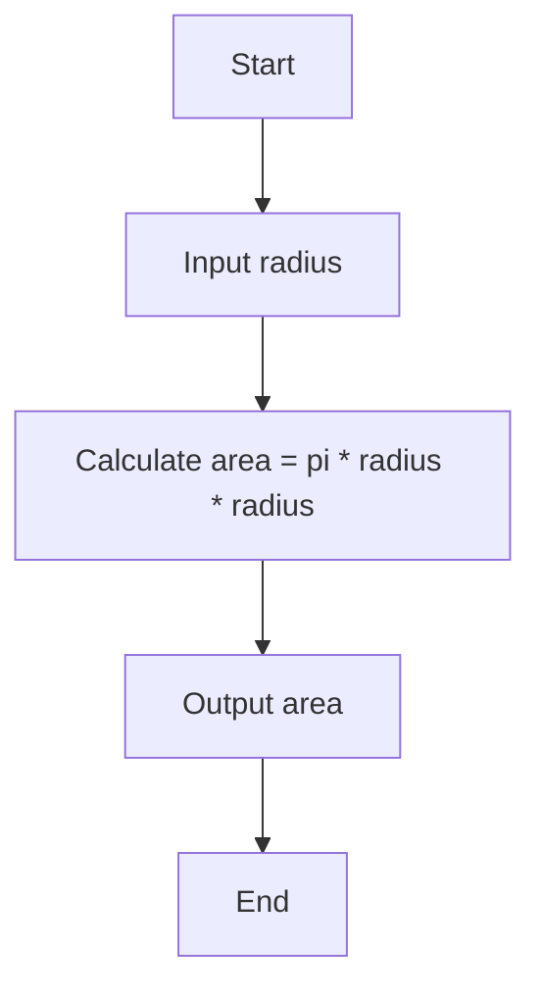

#### Flow Charts in Software Design

A flow chart is a graphical or symbolic representation of a process or an algorithm. It shows the steps, inputs, outputs, and decisions involved in a program or a system. Flow charts are useful for designing, explaining, and documenting software processes or algorithms. They can also help in debugging, testing, and optimizing code.

To create a flow chart, you need to use a set of standard symbols and connectors. The symbols represent different types of actions or data, such as start/end, input/output, processing, decision, etc. The connectors show the direction and sequence of the flow, such as arrows, lines, loops, etc. You can use a flow chart software or a diagramming tool to draw a flow chart, or you can use a text-based syntax to generate one.

Here is an example of a flow chart for a simple program that calculates the area of a circle:

Some benefits of using flow charts in software design are:

- They help you to visualize the logic and structure of a program or a system.
- They help you to communicate and collaborate with others on a project.
- They help you to identify and eliminate errors or inefficiencies in the code.
- They help you to document and maintain the code.