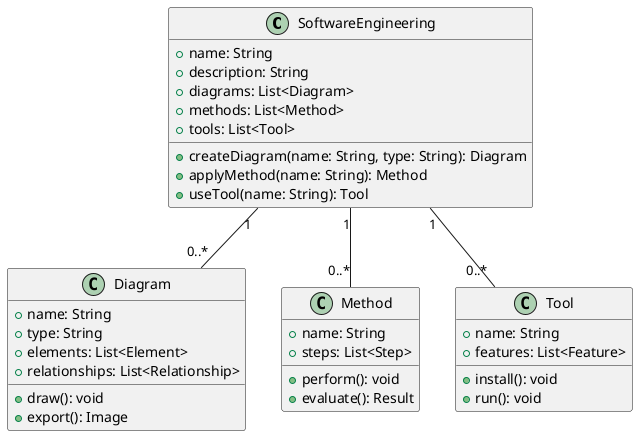

There are many types of diagrams that can be used in software engineering, such as class diagrams, use case diagrams, sequence diagrams, activity diagrams, component diagrams, deployment diagrams, etc. Each diagram has a different purpose and notation. For example, a class diagram shows the classes, attributes, methods, and relationships of a system, while a use case diagram shows the actors, use cases, and interactions of a system.

One possible way to draw a diagram in markdown is to use ASCII art, which uses text characters to create shapes and symbols. However, this method is not very precise, scalable, or standardized, and it may not be compatible with some markdown parsers. A better way to draw a diagram in markdown is to use a tool that can generate an image file from a text-based syntax, such as PlantUML, Mermaid, or Graphviz. These tools allow you to write code that describes the elements and layout of a diagram, and then convert it to an image that can be embedded in markdown using the  syntax.

Here is an example of a class diagram for a software engineering system, drawn using PlantUML:

This code will generate the following image:

![Class diagram for software engineering system](http://www.plantuml.com/plantuml/png/SoWkIImgAStDuKhEIImkLd1EBLBGjLDmpCbCJbMmKiX8pSd9vL0gNafCJYp9vL2gNafCJYp9vL2gNafCJYp9vL2gNafCJYp9vL2gNafCJYp9vL2gNafCJYp9vL2gNafCJYp9vL2gNafCJYp9vL2gNafCJYp9vL2gNafCJYp9vL2gNafCJYp9vL2gNafCJYp9vL2gNafCJYp9vL2gNafCJYp9vL2gNafCJYp9vL2gNafCJYp9vL2gNafCJYp9vL2gNafCJYp9vL2gNafCJYp9vL2gNafCJYp9vL2gNafCJYp9vL2gNafCJYp9vL2gNafCJYp9vL2gNafCJYp9vL2gNafCJYp9vL2gNafCJYp9vL2gNafCJYp9vL2gNafCJYp9vL2gNafCJYp9vL2gNafCJYp9vL2gNafCJYp9vL2gNafCJYp9vL2gNafCJYp9vL2gNafCJYp9vL2gNafCJYp9vL2gNafCJYp9vL2gNafCJYp9vL2gNafCJYp9vL2gN