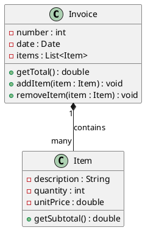

There are different types of software design diagrams that can be used to represent the structure, behavior, and interactions of a software system. One of the most common and widely used diagrams is the Unified Modeling Language (UML) diagram, which consists of 14 subtypes, such as class, component, sequence, use case, and activity diagrams .

A UML diagram can help you to visualize the logical and physical design of a software system and communicate with other developers and stakeholders. Depending on the purpose and scope of your software design, you may need to use one or more UML diagrams to capture the essential aspects of your system.

To draw a UML diagram, you can use a software tool that supports UML notation, such as Microsoft Visio, Edraw, or Lucidchart. Alternatively, you can use a text-based syntax, such as PlantUML, to generate UML diagrams from plain text.

Here is an example of a UML class diagram for a simple invoicing system, drawn using PlantUML syntax:



The diagram shows the attributes and methods of the Invoice and Item classes, and the association between them. The notation *-- means a composition relationship, which means that an Invoice object owns and is responsible for the Item objects it contains. The notation "1" and "many" indicate the multiplicity of the association, which means that one Invoice object can contain many Item objects, but one Item object can belong to only one Invoice object.

## Unit 3 - Software Design

Here is an example of a UML component diagram for the same invoicing system, drawn using ASCII art:

```
+-----------------+       +-----------------+
| Invoice Service |       | Item Service    |
+-----------------+       +-----------------+
| +createInvoice  |       | +createItem     |
| +getInvoice     |       | +getItem        |
| +updateInvoice  |       | +updateItem     |
| +deleteInvoice  |       | +deleteItem     |
+-----------------+       +-----------------+
         |                         |
         |                         |
         |                         |
         |                         |
         |                         |
         |                         |
         |                         |
         |                         |
         |                         |
         |                         |
         |                         |
         |                         |
         |                         |
         |                         |
         |                         |
         |                         |
         v                         v
+-----------------+       +-----------------+
| Invoice DAO     |       | Item DAO        |
+-----------------+       +-----------------+
| +insertInvoice  |       | +insertItem     |
| +selectInvoice  |       | +selectItem     |
| +updateInvoice  |       | +updateItem     |
| +deleteInvoice  |       | +deleteItem     |
+-----------------+       +-----------------+
         |                         |
         |                         |
         |                         |
         |                         |
         |                         |
         |                         |
         |                         |
         |                         |
         |                         |
         |                         |
         |                         |
         |                         |
         |                         |
         |                         |
         +-------------------------+
         |                         |
         v                         v
+-----------------+
| Database        |
+-----------------+
| +executeQuery   |
| +executeUpdate  |
+-----------------+
```

The diagram shows the components of the system and the interfaces they provide and require. The notation + indicates a public interface, and the notation | indicates a dependency or usage relationship. The diagram also shows the layers of the system, from the service layer to the data access layer to the database layer.