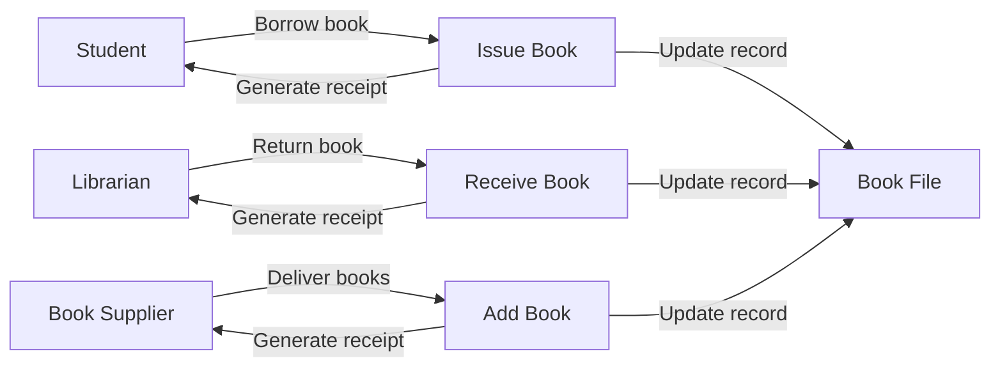

### Data Flow Diagrams in Software Requirement Specification (SRS)

A data flow diagram (DFD) is a graphical representation of the flow of data and information in a system or process. It shows the sources and destinations of data, the processes that transform data, and the data stores that hold data. A DFD can be used to document the functional requirements of a software system, as well as to analyze and design its structure and behavior.

A DFD consists of four basic elements:

- **External entities**: These are the sources or destinations of data that are outside the system boundary. They are represented by rectangles with the entity name inside.
- **Processes**: These are the activities or functions that transform data from one form to another. They are represented by circles or ovals with the process name or number inside.
- **Data flows**: These are the paths or channels that data follow from one entity or process to another. They are represented by arrows with the data name or description above or below.
- **Data stores**: These are the places where data are stored or accessed by the system. They are represented by open-ended rectangles with the data store name inside.

A DFD can be drawn at different levels of abstraction, depending on the purpose and scope of the analysis. A DFD can be decomposed into lower-level DFDs that show more details of the system. A DFD can also be complemented by other diagrams, such as entity-relationship diagrams, state transition diagrams, or use case diagrams, to provide a more comprehensive view of the system.

An example of a DFD for a library management system is shown below:

A DFD is a useful tool for software requirement specification (SRS), as it can help to:

- Identify the main functions and data of the system
- Clarify the system boundary and scope
- Communicate the system requirements to stakeholders
- Verify the completeness and consistency of the requirements
- Facilitate the design and testing of the system

However, a DFD also has some limitations, such as:

- It does not show the sequence or timing of data flows
- It does not show the control or logic of data flows
- It does not show the data structures or formats of data flows
- It does not show the non-functional requirements of the system

Therefore, a DFD should be used in conjunction with other techniques and documents to provide a complete and accurate specification of the software system.