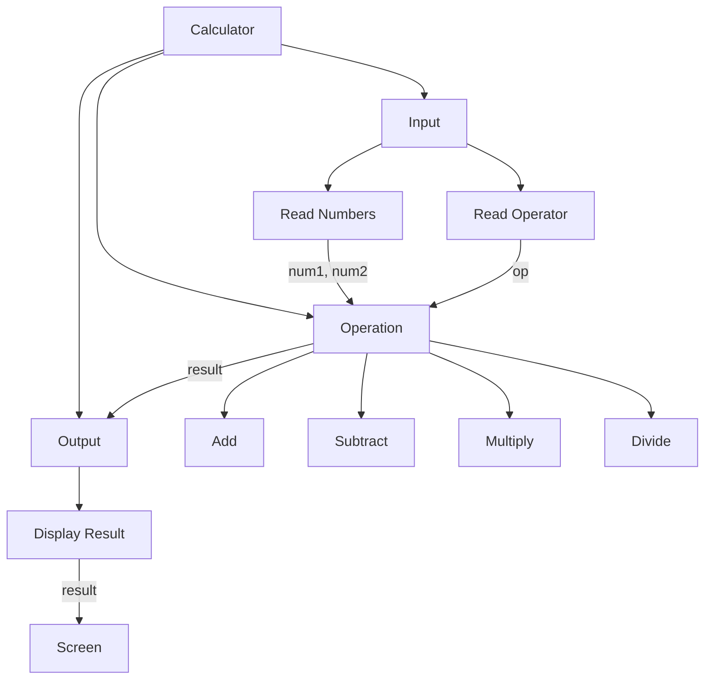

#### Design Structure Charts in Software Design

A design structure chart is a diagram that shows the hierarchical decomposition of a software system into its modules and the data flow between them. It is a useful tool for designing and documenting the structure and functionality of a software system.

A design structure chart consists of the following elements:

- **Modules**: Rectangular boxes that represent the functional units of the software system. Each module has a name and a number that indicates its level in the hierarchy. The top-level module is numbered 0, and the lower-level modules are numbered according to their parent module. For example, module 1.2 is a sub-module of module 1, and module 2.3.1 is a sub-module of module 2.3.
- **Connections**: Lines that connect the modules and show the direction of data flow between them. A connection can be either a control connection or a data connection. A control connection indicates that one module invokes another module, and a data connection indicates that one module passes data to another module. A connection can also have a label that specifies the name or type of the data being transferred.
- **Libraries**: Circles that represent external modules or libraries that are used by the software system. A library can be connected to one or more modules by data connections.
- **Coupling**: The degree of interdependence between modules. A high coupling means that a module depends on many other modules or data, and a low coupling means that a module is relatively independent. A low coupling is desirable for a software system, as it reduces the complexity and increases the maintainability and reusability of the modules.
- **Cohesion**: The degree of relatedness within a module. A high cohesion means that a module performs a single and well-defined function, and a low cohesion means that a module performs multiple and unrelated functions. A high cohesion is desirable for a software system, as it increases the clarity and efficiency of the modules.

An example of a design structure chart for a simple calculator software is shown below:

