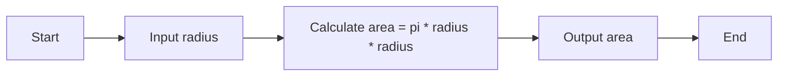

#### Flow Charts in Software Design

A flow chart is a graphical or symbolic representation of a process or algorithm, showing the steps as boxes of various kinds, and their order by connecting them with arrows. Flow charts are useful for designing, explaining, and documenting software programs or algorithms.

A flow chart typically consists of the following elements:

- Start and end symbols, usually represented by circles or ovals, indicating the beginning and end of the process or algorithm.
- Process symbols, usually represented by rectangles, indicating the actions or operations performed by the program or algorithm.
- Decision symbols, usually represented by diamonds, indicating the points where the program or algorithm makes a choice based on a condition or a question.
- Input/output symbols, usually represented by parallelograms, indicating the data or information that the program or algorithm receives or produces.
- Flow lines, usually represented by arrows, indicating the direction and sequence of the steps in the process or algorithm.

Here is an example of a flow chart for a simple program that calculates the area of a circle given its radius:

To write a flow chart for a software program or algorithm, you can follow these steps:

- Identify the main purpose and goal of the program or algorithm.
- Identify the inputs and outputs of the program or algorithm, and how they are obtained or displayed.
- Identify the main steps or tasks that the program or algorithm performs, and the order in which they are executed.
- Identify the decision points or conditions that affect the flow of the program or algorithm, and the possible outcomes or branches.
- Draw the symbols for each element of the program or algorithm, and connect them with flow lines to show the logic and sequence.
- Label the symbols with brief and clear descriptions of the actions or operations, the inputs or outputs, and the conditions or questions.
- Review and test the flow chart to make sure it is accurate, complete, and easy to understand.