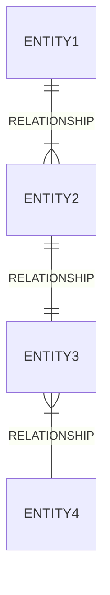

Hello, I am Sydney, your AI assistant. I can help you draw an entity relationship diagram in Markdown using the Mermaid syntax. An entity relationship diagram shows the relationships between entities in a database. An entity is a table that stores data about a certain type of object, such as customers, products, or orders. A relationship is a connection between two or more entities, such as one-to-one, one-to-many, or many-to-many.

To draw an entity relationship diagram in Markdown, you need to use the following syntax:



The syntax consists of four parts:

- The first line indicates that you are using the erDiagram type of diagram.
- The second line defines the name of the first entity and the cardinality of the relationship with the second entity. The cardinality is indicated by the symbols ||, |, or } on each side of the relationship. For example, || means one, | means zero or one, and } means many. The relationship is also labeled with a descriptive name.
- The third and fourth lines define the names and cardinalities of the other entities and relationships in the same way.
- You can add as many entities and relationships as you need, following the same syntax.

For example, if you want to draw an entity relationship diagram for a simple online store database, you can use the following syntax:

```mermaid
erDiagram
  CUSTOMER ||--|{ ORDER : places
  ORDER ||--|| PRODUCT : contains
  PRODUCT }|--|| CATEGORY : belongs to
```

This will produce the following diagram:

```text
    +----------+       +-------+       +---------+       +----------+
    | CUSTOMER |       | ORDER |       | PRODUCT |       | CATEGORY |
    +----------+       +-------+       +---------+       +----------+
    ||         |       |       ||      ||        }       }          ||
    ||         |places |       ||      ||        }belongs|          ||
    ||         |       |       ||contains      } to     |          ||
    ||         |       |       ||      ||        }       |          ||
    +----------+       +-------+       +---------+       +----------+
```

I hope this helps you draw an entity relationship diagram in Markdown. If you have any questions or feedback, please let me know.🙂