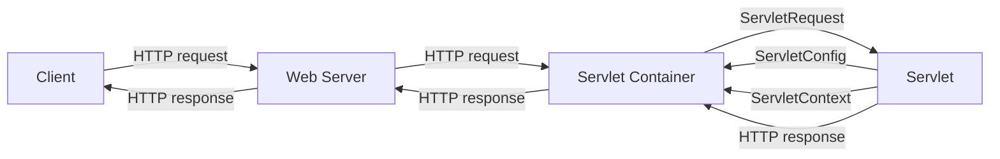

### Servlet Overview and Architecture in Servlets

Servlets are Java programs that run on a web server and handle HTTP requests and responses. They are used to create dynamic web applications that can interact with databases, process forms, generate HTML pages, and perform other server-side tasks. Servlets are part of the Java Enterprise Edition (JEE) framework and implement the Java Servlet and JSP specifications.

Servlets run inside a servlet container, which is a component of a web server that provides the environment and services for servlets to execute. The servlet container is responsible for managing the servlet life cycle, loading and initializing servlets, invoking servlet methods, and handling communication between servlets and clients. Some examples of servlet containers are Tomcat, Jetty, GlassFish, and WebLogic.

The servlet architecture consists of the following components:

- **Servlet interface**: This is the core interface that defines the methods that all servlets must implement. The most important methods are `init()`, `service()`, and `destroy()`, which are invoked by the servlet container at different stages of the servlet life cycle.
- **GenericServlet class**: This is an abstract class that implements the Servlet interface and provides a generic implementation of the `init()` and `destroy()` methods. It also provides a convenience method `getServletConfig()` to access the servlet configuration object. Subclasses of GenericServlet must override the `service()` method to handle requests and responses.
- **HttpServlet class**: This is another abstract class that extends GenericServlet and provides a specialized implementation of the `service()` method for HTTP requests and responses. It also provides several methods to handle different HTTP methods, such as `doGet()`, `doPost()`, `doPut()`, and `doDelete()`. Subclasses of HttpServlet must override one or more of these methods to process HTTP requests and responses.
- **ServletRequest and ServletResponse interfaces**: These are the interfaces that define the objects that represent the HTTP requests and responses. They provide methods to access the request and response headers, parameters, attributes, body, and other information. The servlet container creates these objects and passes them as arguments to the `service()` method of the servlet.
- **HttpServletRequest and HttpServletResponse interfaces**: These are the interfaces that extend ServletRequest and ServletResponse and provide additional methods specific to HTTP requests and responses. For example, HttpServletRequest provides methods to get the HTTP method, URI, query string, cookies, and session information. HttpServletResponse provides methods to set the status code, headers, cookies, and redirect the response to another location.
- **ServletConfig and ServletContext interfaces**: These are the interfaces that define the objects that store the configuration and context information of the servlet and the web application. The ServletConfig object contains the initialization parameters of the servlet, which are specified in the web.xml file or using annotations. The ServletContext object contains the global information of the web application, such as the web root directory, the web server name and port, the application attributes, and the resource paths. The servlet container creates these objects and passes them to the `init()` method of the servlet. The servlet can access them using the `getServletConfig()` and `getServletContext()` methods.

The following diagram illustrates the servlet architecture and the interaction between the components:

