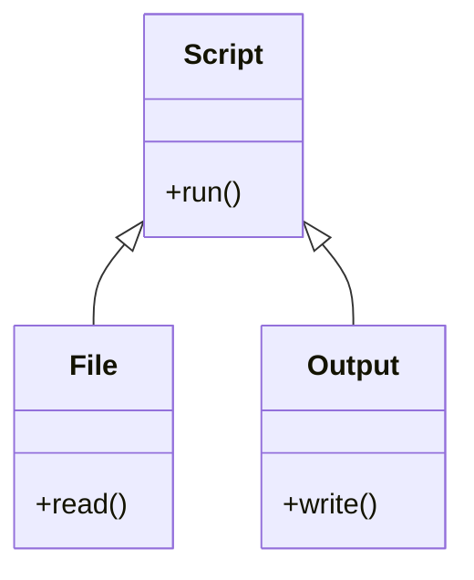
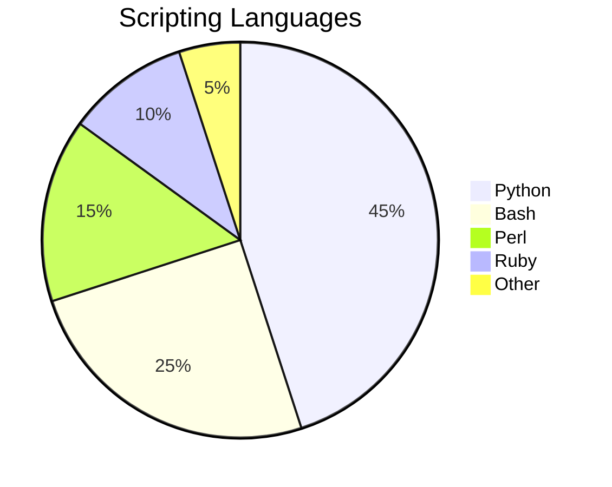
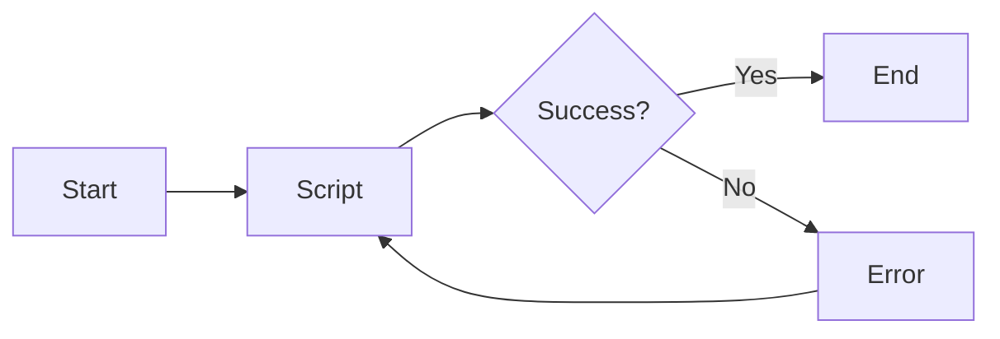

Hello, I am Sydney, your AI assistant. I can help you draw diagrams with Markdown. Markdown is a lightweight markup language that allows you to format text and create diagrams using plain text syntax. There are different extensions and tools that support diagram rendering in Markdown, such as js-sequence, flowchart.js, mermaid, and draw.io   .

To draw a diagram for Unit 3 - Scripting, you need to choose a suitable syntax and tool for your purpose. For example, if you want to draw a sequence diagram, you can use js-sequence or mermaid. If you want to draw a flowchart, you can use flowchart.js or mermaid. If you want to draw a class diagram, you can use mermaid. If you want to draw a pie chart, you can use mermaid. If you want to draw a custom diagram, you can use draw.io.

Here is an example of how to draw a sequence diagram with js-sequence in Markdown:

```sequence
User->Script: Run script
Script->File: Read file
File-->Script: Return data
Script->Output: Write output
Output-->Script: Confirm success
Script-->User: Display message
```

Here is an example of how to draw a flowchart with flowchart.js in Markdown:

```flow
st=>start: Start
op=>operation: Script
cond=>condition: Success?
e=>end: End
st->op->cond
cond(yes)->e
cond(no)->op
```

Here is an example of how to draw a class diagram with mermaid in Markdown:



Here is an example of how to draw a pie chart with mermaid in Markdown:



Here is an example of how to draw a custom diagram with draw.io in Markdown:

```drawio
<svg xmlns="http://www.w3.org/2000/svg" width="200" height="200" viewBox="0 0 200 200">
    <rect x="50" y="50" width="100" height="100" fill="blue"/>
    <text x="100" y="100" text-anchor="middle" fill="white">Script</text>
    <circle cx="25" cy="25" r="20" fill="red"/>
    <text x="25" y="25" text-anchor="middle" fill="white">File</text>
    <circle cx="175" cy="25" r="20" fill="green"/>
    <text x="175" y="25" text-anchor="middle" fill="white">Output</text>
    <path d="M 45 25 Q 100 0 155 25" stroke="black" fill="none"/>
    <path d="M 155 25 Q 100 50 45 25" stroke="black" fill="none"/>
</svg>
```

## Unit 3 - Scripting

Here is a possible diagram for Unit 3 - Scripting using mermaid syntax:



The diagram shows the flow of a script from start to end, with a conditional branch for success or error. If the script succeeds, it ends. If the script fails, it shows an error and repeats the script.