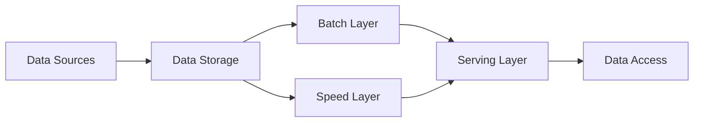
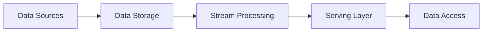

### Big Data Architecture
Big data architecture is the system that supports big data analytics, which is the process of extracting insights from large and complex data sets. Big data architecture consists of several components that work together to ingest, store, process, and analyze data .

A common big data architecture follows the lambda or kappa design pattern, which are based on the concepts of batch and stream processing .

- Batch processing is the method of processing large volumes of data in batches, typically using frameworks such as MapReduce or Spark. Batch processing is suitable for historical analysis, data cleansing, and aggregation .
- Stream processing is the method of processing data in real-time as it arrives, typically using frameworks such as Storm, Flink, or Kafka. Stream processing is suitable for low-latency analysis, anomaly detection, and event processing .

The lambda architecture combines both batch and stream processing in a hybrid approach, where the data is processed by both layers and the results are merged in a serving layer. The lambda architecture can handle both historical and real-time analysis, but it introduces complexity and duplication in the system.

The kappa architecture simplifies the lambda architecture by using only stream processing for all data. The kappa architecture can also handle both historical and real-time analysis, but it requires the stream processing framework to be scalable and fault-tolerant.

The following diagram shows an example of a big data architecture using the lambda design pattern:

The following diagram shows an example of a big data architecture using the kappa design pattern:

Some of the best practices for designing a big data architecture are :

- Define the business goals and requirements clearly and align them with the data sources, storage, processing, and access methods.
- Choose the appropriate data formats, schemas, and compression techniques to optimize the data ingestion, storage, and processing.
- Use a distributed file system such as HDFS or S3 to store large volumes of data in a scalable and fault-tolerant manner.
- Use a data lake or a data warehouse to organize and catalog the data and provide a unified view for analysis.
- Use a data pipeline or a workflow manager such as Airflow or Luigi to orchestrate and automate the data processing tasks and dependencies.
- Use a data quality framework such as Apache Griffin or Deequ to monitor and validate the data quality and integrity.
- Use a data governance framework such as Apache Atlas or Cloudera Navigator to manage the data lifecycle, security, and compliance.
- Use a data visualization tool such as Tableau or Power BI to present and explore the data insights and outcomes.