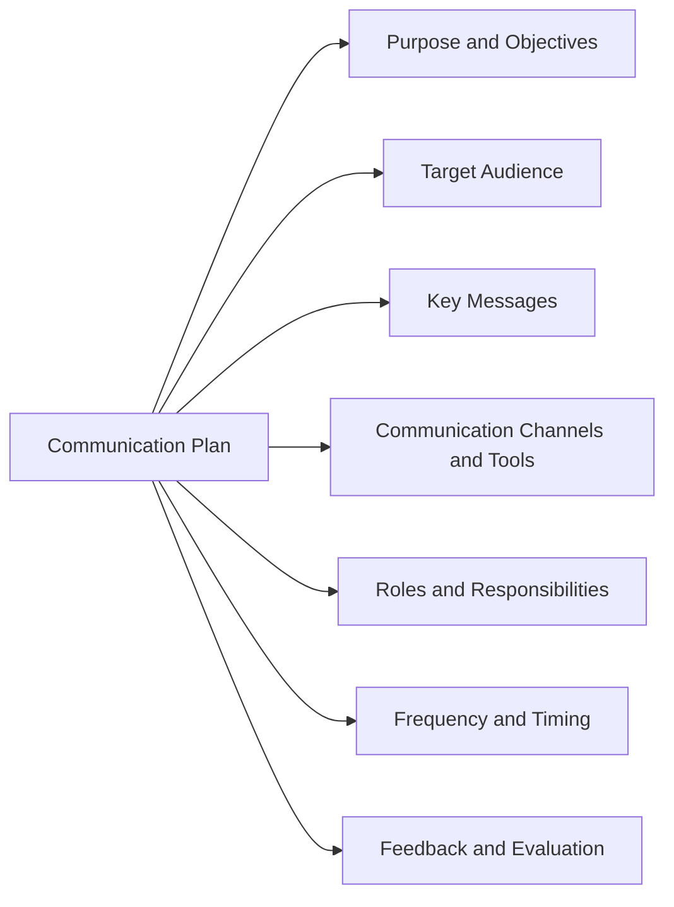

### Communication Plans in SPM

- SPM stands for Strategic Performance Management, which is a process that guides an organization's leadership in designing and revising a system of strategic performance management.
- Communication is a critical component of the SPM process, as it helps to engage and collaborate with external and internal stakeholders, and to communicate the vision, goals, and progress of the organization.
- A communication plan is an outline of how to communicate important, ongoing information to key stakeholders in the SPM process. It helps to ensure that everyone is on the same page, and that the communication is consistent, clear, and timely.
- A communication plan typically includes the following elements:
  - The purpose and objectives of the communication plan
  - The target audience and their communication needs and preferences
  - The key messages and the tone and style of the communication
  - The communication channels and tools to be used
  - The roles and responsibilities of the communication team and stakeholders
  - The frequency and timing of the communication
  - The feedback mechanisms and evaluation methods to measure the effectiveness of the communication
- A communication plan can be presented in a table or a diagram format, depending on the complexity and scope of the SPM process. Here is an example of a communication plan diagram:

