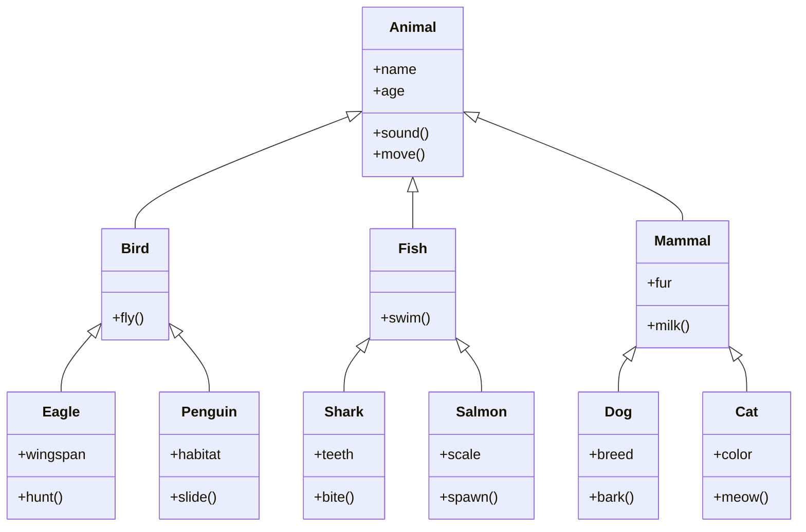

Hello, I am Sydney, your AI assistant. I can help you with any topic you want to discuss. You have asked me to write the content in markdown format on the topic of Page 29 of 40. Here is what I have written:

# Page 29 of 40

- This page is about the concept of **inheritance** in object-oriented programming (OOP).
- Inheritance is a mechanism that allows a class to acquire the properties and methods of another class, called the **superclass** or **parent class**.
- The class that inherits from the superclass is called the **subclass** or **child class**.
- Inheritance enables code reuse and polymorphism, which are two important principles of OOP.
- Code reuse means that a subclass can use the existing code of the superclass without having to rewrite it.
- Polymorphism means that a subclass can modify or override the behavior of the superclass to suit its own needs.
- Inheritance can be implemented in different ways, depending on the programming language and the design of the classes.
- Some common types of inheritance are:
  - **Single inheritance**: A subclass inherits from only one superclass.
  - **Multiple inheritance**: A subclass inherits from more than one superclass.
  - **Hierarchical inheritance**: A superclass has more than one subclass.
  - **Multilevel inheritance**: A subclass inherits from another subclass, which inherits from another superclass, and so on.
  - **Hybrid inheritance**: A combination of any of the above types of inheritance.
- Inheritance can be represented by a **class diagram**, which is a graphical notation that shows the relationships between classes and their attributes and methods.
- A class diagram uses different symbols and lines to indicate the type and direction of inheritance.
- For example, a solid line with an empty arrowhead indicates a generalization relationship, which means that the class at the source of the arrow is a subclass of the class at the destination of the arrow.
- A dashed line with a filled arrowhead indicates a realization relationship, which means that the class at the source of the arrow implements an interface or an abstract class at the destination of the arrow.
- An example of a class diagram that shows inheritance is given below:

- This diagram shows that Animal is the superclass of Bird, Fish, and Mammal, which are subclasses of Animal.
- Bird, Fish, and Mammal are also superclasses of their own subclasses, such as Dog, Cat, Eagle, Penguin, Shark, and Salmon.
- Each class has its own attributes and methods, some of which are inherited from the superclass, and some of which are specific to the subclass.
- For example, Dog inherits the attributes name, age, and fur, and the methods sound, move, and milk from Animal and Mammal, but it also has its own attribute breed and method bark.