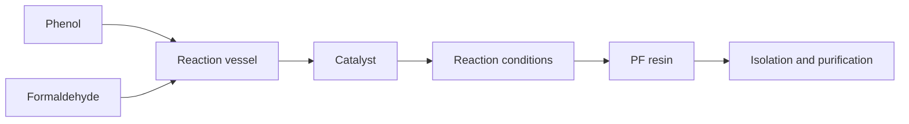

### 11. Preparation of Phenol formaldehyde (PF) resin

Phenol formaldehyde (PF) resin is a type of thermosetting polymer that is obtained by the condensation reaction of phenol and formaldehyde. PF resin has high mechanical strength, chemical resistance, and thermal stability. It is widely used as an adhesive, a coating, a molding material, and a binder for wood products.

The preparation of PF resin involves the following steps:

- Mixing phenol and formaldehyde in a reaction vessel. The molar ratio of formaldehyde to phenol determines the degree of cross-linking and the properties of the final resin. A 1:1 ratio produces linear chains, while a higher ratio produces branched chains.
- Adding a catalyst to initiate the polymerization reaction. The catalyst can be either acid or base, depending on the desired type of resin. Acid catalysts, such as hydrochloric acid or sulfuric acid, produce novolac resins, which are thermoplastic and require a curing agent to cross-link. Base catalysts, such as ammonia or sodium hydroxide, produce resole resins, which are thermosetting and can cross-link by themselves.
- Controlling the temperature, pressure, and time of the reaction. The reaction conditions affect the molecular weight, viscosity, and solubility of the resin. The reaction is usually carried out at temperatures ranging from 60°C to 100°C and pressures ranging from atmospheric to 10 atm. The reaction time can vary from a few minutes to several hours, depending on the desired degree of polymerization.
- Isolating and purifying the resin. The resin can be separated from the reaction mixture by filtration, precipitation, or distillation. The resin can be further purified by washing, drying, and grinding. The resin can be stored as a solid or a liquid, depending on its solubility and stability.

The following diagram illustrates the preparation of PF resin:

