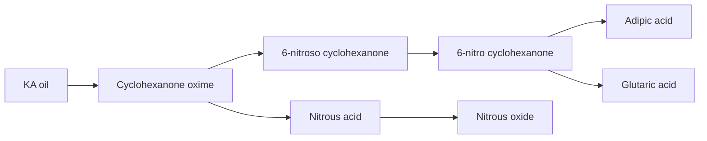

# Synthesis of Adipic Acid

- Adipic acid is a dicarboxylic acid with the formula C6H10O4. It is mainly used for the production of nylon, polyurethanes, and other polymers.
- The conventional method for the synthesis of adipic acid is the oxidation of a mixture of cyclohexanone and cyclohexanol (KA oil) with nitric acid  .
- The oxidation of KA oil involves several steps and intermediate products, such as cyclohexanone oxime, 6-nitroso cyclohexanone, 6-nitro cyclohexanone, and glutaric acid.
- The oxidation of KA oil also generates nitrous oxide (N2O), a greenhouse gas and an ozone-depleting agent, as a by-product .
- The diagram below shows the main steps and products of the oxidation of KA oil with nitric acid:

- Alternative methods for the synthesis of adipic acid from renewable sources, such as glucose and its derivatives, have been proposed and studied.
- These methods involve the use of different catalysts, such as metal oxides, zeolites, and nanoparticles, to convert glucose or its derivatives into adipic acid or its precursors.
- The advantages of these methods are the reduction of greenhouse gas emissions, the utilization of biomass resources, and the potential for lower cost and higher yield.
- The challenges of these methods are the design of efficient and selective catalysts, the optimization of reaction conditions, and the separation and purification of the products.