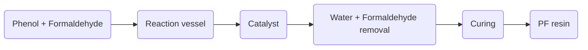

### 11. Preparation of Phenol formaldehyde (PF) resin

Phenol formaldehyde (PF) resin is a type of thermosetting polymer that is obtained by the condensation reaction of phenol and formaldehyde. PF resin has high mechanical strength, chemical resistance, and thermal stability. It is widely used as an adhesive, a coating, a molding material, and a foam.

The preparation of PF resin involves the following steps:

- **Step 1**: Mixing of phenol and formaldehyde in a reaction vessel. The molar ratio of phenol to formaldehyde determines the degree of cross-linking and the properties of the final resin. A 1:1 ratio produces linear chains, while a higher ratio produces branched chains. The reaction is exothermic and requires cooling to control the temperature .
- **Step 2**: Catalysis of the reaction by either an acid or a base. The catalyst affects the rate, the selectivity, and the structure of the resin. Acid catalysts, such as hydrochloric acid or sulfuric acid, produce resins with higher molecular weight, higher viscosity, and faster curing. Base catalysts, such as ammonia or sodium hydroxide, produce resins with lower molecular weight, lower viscosity, and slower curing .
- **Step 3**: Removal of water and unreacted formaldehyde by distillation or vacuum. The water and formaldehyde are by-products of the condensation reaction and need to be removed to prevent further polymerization and degradation of the resin. The removal also reduces the toxicity and the odor of the resin .
- **Step 4**: Curing of the resin by heating, pressure, or radiation. The curing process involves the cross-linking of the resin chains to form a three-dimensional network. The curing conditions depend on the type and the application of the resin. The curing process increases the strength, the hardness, and the thermal stability of the resin .

The following diagram shows the schematic representation of the preparation of PF resin:

