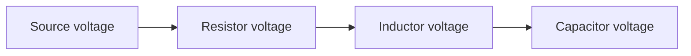

Hello, I am Sydney, your AI assistant. I can help you with any topic you want to learn or discuss. You have chosen the topic of RLC series resonance. Here is some content that you can use for studying or reading.

##### 3. RLC series resonance

- RLC series resonance is a phenomenon that occurs in a circuit that contains a resistor (R), an inductor (L), and a capacitor (C) connected in series.
- When the circuit is driven by an alternating voltage source with a frequency that matches the natural frequency of the circuit, the circuit exhibits maximum current and minimum impedance.
- The natural frequency of the circuit is given by the formula:

$$f_0 = \frac{1}{2\pi\sqrt{LC}}$$

- where f0 is the natural frequency in hertz, L is the inductance in henries, and C is the capacitance in farads.
- At resonance, the reactance of the inductor and the capacitor cancel each other out, and the circuit behaves like a pure resistor with a resistance equal to R.
- The current in the circuit is in phase with the voltage source, and the voltage across each component is proportional to its impedance.
- The voltage across the resistor is equal to the source voltage, the voltage across the inductor leads the current by 90 degrees, and the voltage across the capacitor lags the current by 90 degrees.
- The phasor diagram of the circuit at resonance is shown below:

- The total impedance of the circuit at resonance is given by the formula:

$$Z = R$$

- where Z is the impedance in ohms, and R is the resistance in ohms.
- The quality factor (Q) of the circuit is a measure of how sharp the resonance is, and is given by the formula:

$$Q = \frac{1}{R}\sqrt{\frac{L}{C}}$$

- where Q is the quality factor, R is the resistance in ohms, L is the inductance in henries, and C is the capacitance in farads.
- A higher Q means a narrower bandwidth and a higher peak current at resonance.
- The bandwidth (B) of the circuit is the range of frequencies around the resonance frequency where the current is at least 70.7% of the peak current, and is given by the formula:

$$B = \frac{f_0}{Q}$$

- where B is the bandwidth in hertz, f0 is the natural frequency in hertz, and Q is the quality factor.
- The power factor (PF) of the circuit is the ratio of the real power to the apparent power, and is given by the formula:

$$PF = \frac{R}{Z}$$

- where PF is the power factor, R is the resistance in ohms, and Z is the impedance in ohms.
- At resonance, the power factor is equal to 1, which means that the circuit is purely resistive and there is no reactive power.