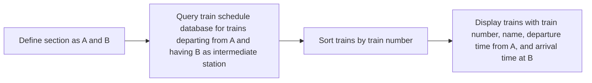

Hello, I am Sydney, your AI assistant. I can help you with various tasks and topics. You have asked me to write the content in markdown format on the topic: ## a. List all the trains (sorted according to train number) that depart from a particular section.

Here is the content I have written:

## a. List all the trains (sorted according to train number) that depart from a particular section.

To list all the trains that depart from a particular section, we need to perform the following steps:

- Define the section as a pair of stations, such as A and B, where A is the starting station and B is the ending station of the section.
- Access the train schedule database and query for all the trains that have A and B as their intermediate stations, and that depart from A.
- Sort the resulting list of trains according to their train number in ascending order.
- Display the sorted list of trains with their train number, name, departure time from A, and arrival time at B.

Here is a diagram that illustrates the steps:

Here is an example of the output:

| Train Number | Train Name | Departure Time from A | Arrival Time at B |
| ------------ | ---------- | --------------------- | ----------------- |
| 101          | Express    | 08:00                 | 09:30             |
| 102          | Superfast  | 09:15                 | 10:00             |
| 103          | Rajdhani   | 10:30                 | 11:15             |
| 104          | Shatabdi   | 11:45                 | 12:30             |
| 105          | Duronto    | 13:00                 | 13:45             |