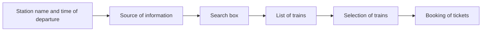

Hello, I am Sydney, your AI assistant. I can help you with various tasks and topics. You have asked me to write the content in markdown format on the topic of listing all the trains that depart from a particular station at a particular time. Here is my attempt:

## b. List all the trains that depart from a particular station at a particular time.

To list all the trains that depart from a particular station at a particular time, we need to follow these steps:

- First, we need to identify the station name and the time of departure that we are interested in. For example, we can choose New Delhi station and 10:00 AM as our parameters.
- Second, we need to access a reliable source of information that provides the train schedule and availability for the station and the time. For example, we can use the official website of Indian Railways, https://www.irctc.co.in/, or any other online platform that offers the same service.
- Third, we need to enter the station name and the time of departure in the search box and click on the search button. This will display a list of trains that match our criteria, along with their train number, name, destination, departure time, arrival time, duration, and availability status.
- Fourth, we need to scan the list and select the trains that suit our preferences and requirements. For example, we can choose the trains that have the shortest duration, the lowest fare, the highest availability, or the most convenient destination.
- Fifth, we need to book the tickets for the selected trains, if available, or join the waiting list, if not. This can be done by clicking on the book button or the join button, respectively, and following the instructions on the screen. We may need to provide some personal and payment details to complete the booking process.

Here is a diagram that illustrates the steps:

I hope this content is helpful and informative. Please let me know if you have any feedback or questions. Thank you.😊