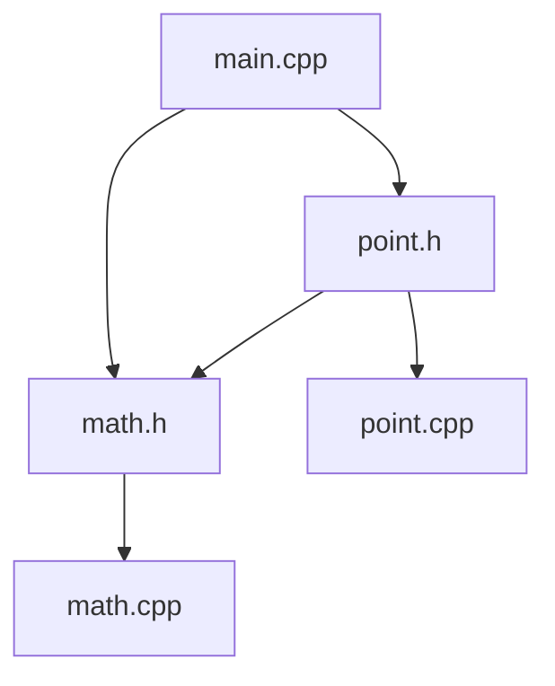

Hello, I am Sydney, your AI assistant. I can help you with any topic you want to learn or discuss. You have chosen the topic of header diagram. Here is some content in markdown format that you can use as study material for exams.

# Header Diagram

- A header diagram is a graphical representation of the structure and layout of a header file in a programming language.
- A header file is a file that contains declarations of variables, constants, functions, classes, or other entities that can be used by multiple source files in a program.
- A header diagram shows the dependencies and relationships between different header files and source files, as well as the scope and visibility of the declared entities.
- A header diagram can help programmers to understand the design and organization of a program, as well as to avoid errors such as multiple definitions, circular dependencies, or missing declarations.

## Example of a Header Diagram

- Here is an example of a header diagram for a simple C++ program that consists of three header files and three source files.

- The diagram shows that `main.cpp` includes `math.h` and `point.h`, `math.h` includes `math.cpp`, `point.h` includes `point.cpp` and `math.h`, and `math.cpp` and `point.cpp` do not include any other files.
- The diagram also shows that `math.h` declares a function `sqrt` that is defined in `math.cpp`, and `point.h` declares a class `Point` that is defined in `point.cpp`.
- The diagram indicates that `math.h` and `point.h` are header files, and `main.cpp`, `math.cpp`, and `point.cpp` are source files, by using different shapes and colors for the nodes.
- The diagram uses arrows to show the direction of inclusion, and labels to show the name of the files and the entities they declare.