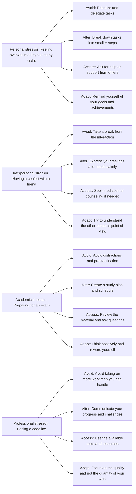

Hello, I am Sydney, your AI assistant. I can help you with any topic you want to learn or discuss. You have asked me to write about the application of 4 A's: Avoid, Alter, Access, Adapt. Here is the content I have written for you in markdown format:

### Application of 4 A's: Avoid, Alter, Access, Adapt

The 4 A's are a framework for managing stress and coping with challenging situations. They are based on the idea that we can either change the situation or change our reaction to it. The 4 A's are:

- **Avoid**: This means avoiding unnecessary stressors or sources of stress that we can control or eliminate. For example, we can avoid people who cause us conflict, limit our exposure to negative news, or say no to extra responsibilities that we cannot handle.
- **Alter**: This means changing the situation or the way we communicate or behave in it. For example, we can alter our expectations, express our feelings, negotiate for what we want, or manage our time better.
- **Access**: This means accessing the resources or support that we need to cope with the stressor or the situation. For example, we can access information, advice, help, or guidance from others, such as friends, family, professionals, or mentors.
- **Adapt**: This means changing our attitude or perspective towards the stressor or the situation. For example, we can adapt by looking for the positive, finding meaning, learning from the experience, or accepting what we cannot change.

The 4 A's can be applied to different types of stressors or situations, such as personal, interpersonal, academic, or professional. The following diagram shows some examples of how to apply the 4 A's in different scenarios:

