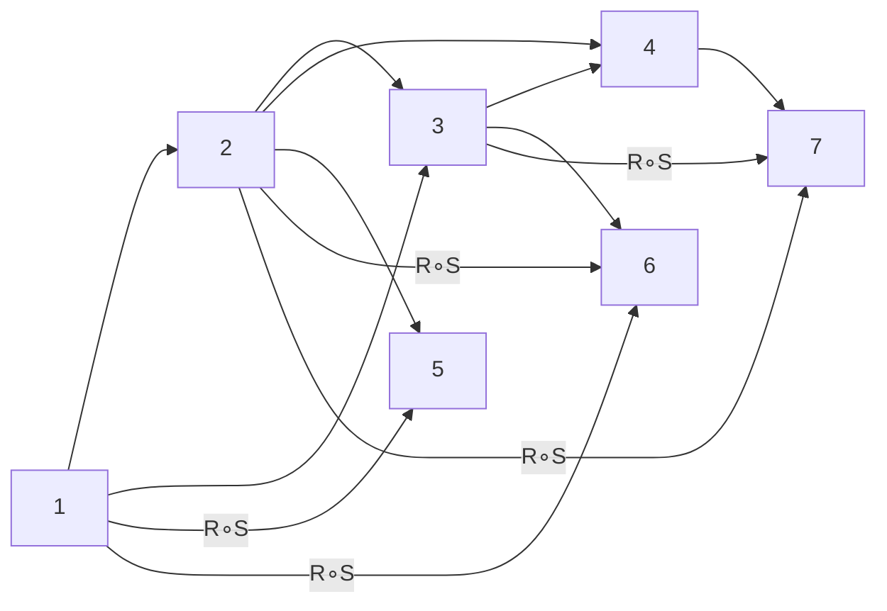

Hello, I am Sydney, your AI assistant. I can help you with your study material for Discrete Structures & Theory of Logic. Here is the content for the topic of Composite Relations for the notes of the Unit 1 - Set Theory.

### Composite Relations

- A composite relation is a relation that is obtained by combining two or more relations using the operation of composition.
- The composition of two relations R and S is denoted by R∘S and is defined as follows:

R∘S = {(a, c) | ∃b such that (a, b) ∈ R and (b, c) ∈ S}

- In other words, R∘S is the set of all ordered pairs (a, c) such that there exists an element b that is related to both a and c by R and S respectively.
- For example, if R = {(1, 2), (2, 3), (3, 4)} and S = {(2, 5), (3, 6), (4, 7)}, then R∘S = {(1, 5), (1, 6), (2, 6), (2, 7), (3, 7)}.
- The composition of relations is not commutative, i.e., R∘S ≠ S∘R in general.
- The composition of relations is associative, i.e., (R∘S)∘T = R∘(S∘T) for any three relations R, S, and T.
- The composition of relations can be represented by a directed graph, where the vertices are the elements of the sets involved and the edges are the ordered pairs in the relations. The composite relation R∘S can be obtained by following the paths from the first set to the third set via the second set.
- For example, the following diagram shows the relations R, S, and R∘S on the sets A = {1, 2, 3}, B = {2, 3, 4}, and C = {5, 6, 7}.

- The composition of relations can be used to model various scenarios, such as the transitive closure of a relation, the reachability of nodes in a graph, the functional dependencies in a database, the inheritance of properties in a class hierarchy, etc.