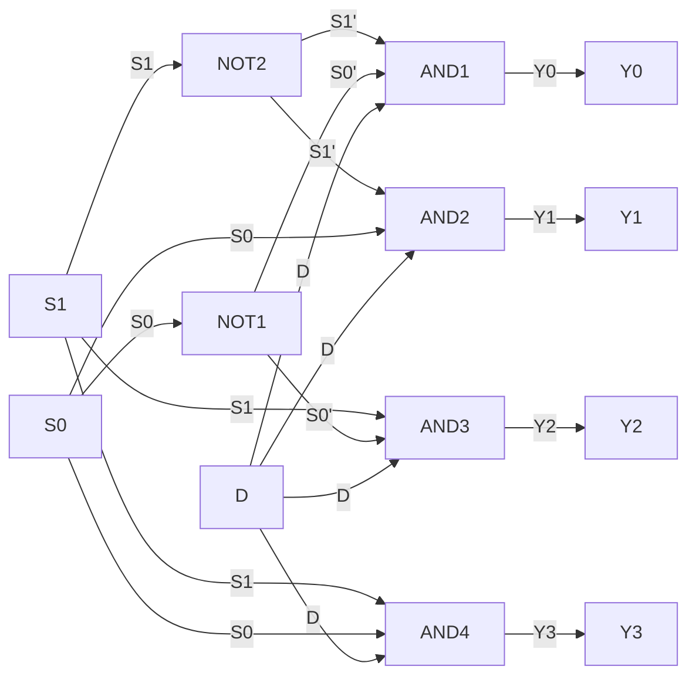

## Implementation of 1:4 demultiplexer using logic gates

- A demultiplexer is a device that takes a single input and distributes it to one of several outputs depending on the values of some control signals.
- A 1:4 demultiplexer has one input, four outputs, and two control signals.
- The input is called D, the outputs are called Y0, Y1, Y2, and Y3, and the control signals are called S0 and S1.
- The truth table for a 1:4 demultiplexer is as follows:

| S1 | S0 | Y0 | Y1 | Y2 | Y3 |
|----|----|----|----|----|----|
| 0  | 0  | D  | 0  | 0  | 0  |
| 0  | 1  | 0  | D  | 0  | 0  |
| 1  | 0  | 0  | 0  | D  | 0  |
| 1  | 1  | 0  | 0  | 0  | D  |

- The output equations for a 1:4 demultiplexer are as follows:

  - Y0 = D * S1' * S0'
  - Y1 = D * S1' * S0
  - Y2 = D * S1 * S0'
  - Y3 = D * S1 * S0

- A 1:4 demultiplexer can be implemented using logic gates as shown in the following diagram:

