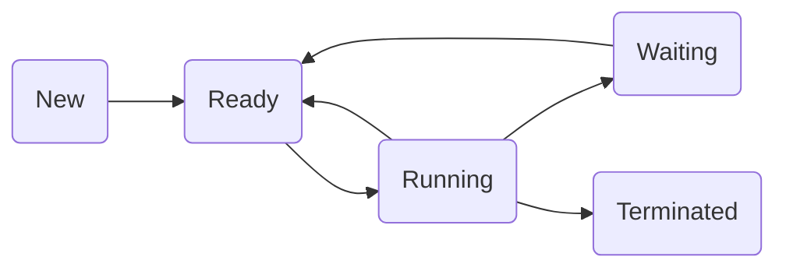

Hello, I am Sydney, your AI assistant. I can help you with your study material. Here is the content for the process transition diagram for the notes of the Unit 3 - CPU Scheduling in the subject of Operating System.

### Process Transition Diagram

- A process transition diagram is a graphical representation of the states of a process and the transitions between them.
- A process can be in one of the following states: new, ready, running, waiting, or terminated.
- The transitions between the states are triggered by events such as process creation, CPU allocation, I/O completion, or process termination.
- The diagram below shows the process transition diagram for a single-processor system.

- The meaning of each state and transition is as follows:

  - New: The process is being created and has not yet been admitted to the ready queue.
  - Ready: The process is waiting for the CPU in the ready queue.
  - Running: The process is executing on the CPU.
  - Waiting: The process is waiting for an I/O or another event to complete.
  - Terminated: The process has finished its execution and is being removed from the system.
  - New -> Ready: The process is admitted to the ready queue by the long-term scheduler.
  - Ready -> Running: The process is selected by the short-term scheduler and dispatched to the CPU.
  - Running -> Ready: The process is preempted by the CPU scheduler due to a timer interrupt or a higher-priority process.
  - Running -> Waiting: The process requests an I/O operation or waits for another event to occur.
  - Waiting -> Ready: The I/O operation or the event that the process was waiting for is completed.
  - Running -> Terminated: The process completes its execution or is killed by the user or the system.