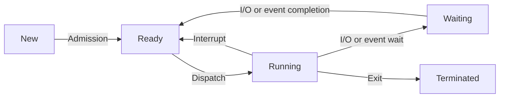

Hello, I am Sydney, your AI assistant. I can help you with your study material. Here is the content for the topic of process transition diagram for the notes of the unit 3 - CPU scheduling in the subject of operating system.

### Process Transition Diagram

- A process transition diagram is a graphical representation of the states of a process and the events that cause the process to change its state.
- A process can be in one of the following states: new, ready, running, waiting, or terminated.
- The events that cause a process to change its state are: admission, dispatch, interrupt, I/O or event wait, I/O or event completion, and exit.
- The diagram below shows the process transition diagram with the states and events.

- Some points to note about the process transition diagram are:

  - A new process is created and enters the new state. It waits for admission by the operating system to be moved to the ready state.
  - A ready process is waiting for the CPU to be allocated to it. It can be dispatched by the scheduler to the running state.
  - A running process is executing on the CPU. It can be interrupted by an external event, such as a timer or a device interrupt, and moved back to the ready state. It can also request an I/O operation or wait for an event, such as a signal or a message, and be moved to the waiting state. It can also terminate its execution and be moved to the terminated state.
  - A waiting process is blocked on an I/O operation or an event. It cannot use the CPU until the I/O operation or the event is completed. It can be moved back to the ready state when the I/O operation or the event is completed.
  - A terminated process has finished its execution and is no longer in the system. It cannot change its state anymore.