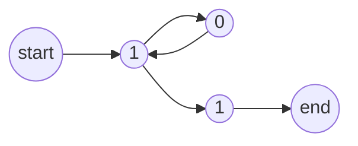

## Unit 1 - Basic Concepts and Automata Theory

- This unit introduces the basic concepts and terminology of formal languages, grammars, and automata theory, which are the foundations of theoretical computer science and natural language processing.
- Formal languages are sets of strings over a finite alphabet, which can be defined by rules or operations. For example, the set of all binary strings that start and end with 1 is a formal language over the alphabet {0, 1}.
- Grammars are systems of rules that generate formal languages. For example, a grammar for the language above can be given by the following rule: S -> 1S1 | 1, where S is a variable and 1 is a terminal symbol.
- Automata are abstract machines that recognize or accept formal languages. For example, a finite automaton for the language above can be given by the following state diagram:

- There are different types of formal languages, grammars, and automata, depending on their expressive power and computational complexity. For example, regular languages are the simplest class of formal languages, which can be defined by regular expressions, regular grammars, or finite automata. Context-free languages are a larger class of formal languages, which can be defined by context-free grammars or pushdown automata.
- The main topics covered in this unit are:

  - The Chomsky hierarchy of formal languages and grammars, which classifies them into four types: regular, context-free, context-sensitive, and recursively enumerable.
  - The equivalence and conversion of regular expressions, regular grammars, and finite automata, and the operations and properties of regular languages.
  - The equivalence and conversion of context-free grammars and pushdown automata, and the operations and properties of context-free languages.
  - The pumping lemmas for regular and context-free languages, which are useful tools for proving that certain languages are not regular or context-free.
  - The decidability and undecidability of various problems related to formal languages, grammars, and automata, such as membership, emptiness, equivalence, and minimization.