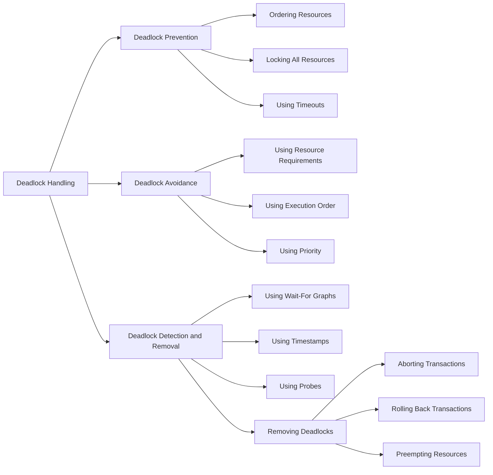

### Deadlock Handling

- A deadlock is an unwanted situation in which two or more transactions are waiting indefinitely for each other to release locks on shared resources   .
- A deadlock can occur in both centralized and distributed database systems, but the latter has some additional challenges such as transaction location and transaction control.
- There are three classical approaches for deadlock handling, namely   :
  - Deadlock prevention: This approach ensures that a deadlock can never occur by imposing some constraints on the transactions, such as ordering the resources, locking all the resources before execution, or using timeouts. However, this approach may reduce concurrency and performance.
  - Deadlock avoidance: This approach allows a deadlock to occur, but avoids it by using some information about the transactions, such as their resource requirements, their execution order, or their priority. This approach may require a lot of overhead and may not be feasible in some situations.
  - Deadlock detection and removal: This approach allows a deadlock to occur, but detects it by using some techniques, such as wait-for graphs, timestamps, or probes. Once a deadlock is detected, it is removed by aborting or rolling back some transactions, or by preempting some resources. This approach may incur a lot of cost and delay in recovery.
- The choice of the deadlock handling approach depends on several factors, such as the frequency of deadlocks, the number of transactions, the number of resources, the degree of distribution, and the performance requirements    .
- A diagram illustrating the deadlock handling approaches is shown below:

