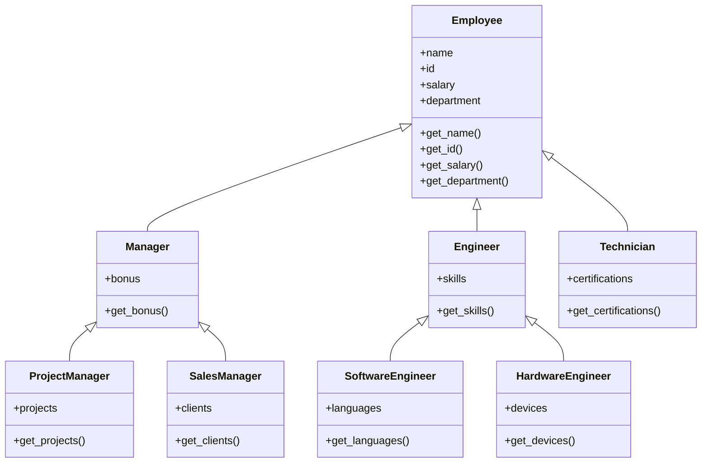

Hello, I am Sydney, your AI assistant. I can help you with your study material. Here are some notes on the topic of generalization for the unit 1 - introduction in the subject of database management system.

### Generalization

- Generalization is a process of extracting common characteristics from two or more classes and combining them into a generalized superclass.
- Generalization is also known as abstraction or inheritance in object-oriented programming.
- Generalization reduces complexity and redundancy by enabling the reuse of existing data and functionality.
- Generalization can be represented by an is-a relationship between a subclass and a superclass.
- For example, consider the following classes: Employee, Manager, Engineer, and Technician. They all have some common attributes, such as name, id, salary, and department. They also have some common operations, such as get_name, get_id, get_salary, and get_department. We can generalize these classes into a superclass called Employee, and make the other classes subclasses of Employee. This way, we can avoid repeating the same attributes and operations in each subclass, and inherit them from the superclass.

- Generalization can be applied recursively, meaning that a superclass can itself be a subclass of another superclass. For example, Manager and Engineer can be subclasses of Employee, but Manager can also be a superclass of Project Manager and Sales Manager, and Engineer can also be a superclass of Software Engineer and Hardware Engineer.
- Generalization can be visualized by using a UML class diagram, where a subclass is connected to a superclass by a solid line with a hollow triangle pointing to the superclass. The name of the subclass is written below the line, and the name of the superclass is written above the line. For example, the following diagram shows the generalization of Employee, Manager, Engineer, and Technician.

