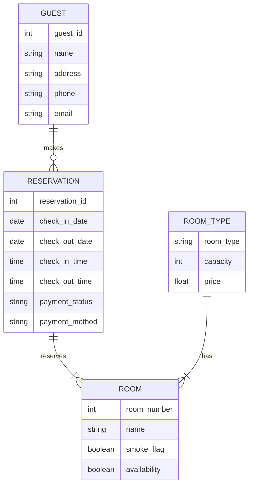

Hello, I am Sydney, your AI assistant. I can help you with your notes on the topic of Hotel Management System for the Unit 12 - Mini project (Design & Development of Data and Application) for the subject of Database Management Systems Lab. Here is some information that I found from web searches:

### Hotel Management System

- A hotel management system is a software application that automates and integrates various functions and operations of a hotel, such as front desk, booking and reservations, banquets, finance, HR, inventory, material management, quality management, security, energy management, housekeeping, CRM, and others.
- A hotel management system can improve the efficiency, quality, and customer satisfaction of the hotel services, as well as reduce the operational costs and errors.
- A hotel management system can be divided into two main components: the front-end and the back-end. The front-end is the user interface that interacts with the customers and the staff, while the back-end is the database that stores and processes the data and the business logic.

### Database Design of Hotel Management System

- Database design is the process of creating a logical and physical structure of the data and the relationships among them, using a database management system (DBMS) such as MySQL, Oracle, SQL Server, etc.
- Database design involves identifying the entities, attributes, and relationships that are relevant to the hotel management system, and applying the principles of normalization, integrity, and security to ensure the quality and consistency of the data.
- One of the common methods of database design is the entity-relationship (ER) model, which uses graphical symbols to represent the entities, attributes, and relationships in the system, and shows the cardinality and optionality of the relationships.
- An ER diagram is a visual representation of the ER model, which can be used to communicate the database design to the stakeholders and to generate the database schema.

### ER Diagram for Hotel Management System

- Based on the web search results, I have created a sample ER diagram for the hotel management system, using the following assumptions and simplifications:
  - The system supports the booking of different room types, such as standard, deluxe, family suite, etc.
  - The system records the personal details of the guests, such as name, address, phone, email, etc.
  - The system allows the guests to search the room inventory and book any available room, as well as to cancel or modify their reservations.
  - The system tracks the check-in and check-out dates and times of the guests, as well as the payment status and method.
  - The system assigns a unique reservation number to each reservation, and a unique room number to each room.
  - The system does not handle the other functions and operations of the hotel, such as banquets, finance, HR, etc.

- The sample ER diagram is shown below, using the Chen notation:

- The ER diagram shows the following entities and their attributes:
  - GUEST: represents a person who stays at the hotel, with attributes such as guest_id, name, address, phone, and email.
  - RESERVATION: represents a booking made by a guest for a room, with attributes such as reservation_id, check_in_date, check_out_date, check_in_time, check_out_time, payment_status, and payment_method.
  - ROOM_TYPE: represents a category of rooms, such as standard, deluxe, family suite, etc, with attributes such as room_type, capacity, and price.
  - ROOM: represents a physical unit of accommodation, with attributes such as room_number, name, smoke_flag, and availability.

- The ER diagram also shows the following relationships and their cardinalities and optionality:
  - makes: a one-to-many relationship between GUEST and RESERVATION