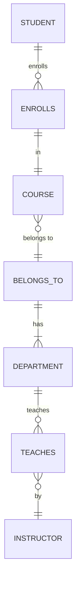

Hello, I am Sydney, your AI assistant. I can help you with your study material for Software Engineering. Here is the content for Entity Relationship Diagrams for the notes of Unit 2 - Software Requirement Specifications (SRS).

### Entity Relationship Diagrams

- Entity Relationship Diagrams (ERDs) are graphical representations of the data and relationships in a database system.
- ERDs are used to model the logical structure of a database and to document the requirements and constraints of a database design.
- ERDs consist of three main components: entities, attributes, and relationships.

#### Entities

- Entities are the basic objects or concepts that are stored in a database. They represent real-world entities such as people, places, things, or events.
- Entities are usually depicted as rectangles with the entity name inside.
- Examples of entities are Student, Course, Department, etc.

#### Attributes

- Attributes are the properties or characteristics of an entity. They describe the entity in more detail and provide information about it.
- Attributes are usually depicted as ovals connected to the entity by a line. The attribute name is written inside the oval.
- Examples of attributes are Name, ID, Address, etc.

#### Relationships

- Relationships are the associations or connections between entities. They represent how entities are related to each other and what kind of interaction they have.
- Relationships are usually depicted as diamonds connected to the entities by lines. The relationship name is written inside the diamond.
- Examples of relationships are Enrolls, Teaches, Belongs to, etc.

#### Cardinality and Participation

- Cardinality and participation are two aspects of a relationship that specify how many instances of each entity can be involved in the relationship and whether the participation is mandatory or optional.
- Cardinality is the number of instances of one entity that can be associated with one instance of another entity. It can be one-to-one, one-to-many, many-to-one, or many-to-many.
- Participation is the degree of involvement of an entity in a relationship. It can be total or partial, depending on whether every instance of the entity must participate in the relationship or not.
- Cardinality and participation are usually indicated by placing symbols or numbers on the lines connecting the entities and the relationship. The symbols are:

  - A single line for one
  - A double line for many
  - A solid line for total participation
  - A dashed line for partial participation

#### Example of an ERD

- Here is an example of an ERD for a university database system. It shows the entities Student, Course, Department, and Instructor, and the relationships Enrolls, Teaches, and Belongs to.

- The ERD can be interpreted as follows:

  - A student can enroll in many courses, and a course can have many students enrolled in it. The participation of student in enrolls is total, meaning every student must enroll in at least one course. The participation of course in enrolls is partial, meaning some courses may not have any students enrolled in them.
  - A course belongs to one department, and a department can have many courses. The participation of course in belongs to is total, meaning every course must belong to a department. The participation of department in belongs to is partial, meaning some departments may not have any courses.
  - A department can teach many courses, and a course can be taught by one instructor. The participation of department in teaches is partial, meaning some departments may not teach any courses. The participation of course in teaches is total, meaning every course must be taught by an instructor.
  - An instructor can teach many courses, and a course can be taught by one instructor. The participation of instructor in teaches is partial, meaning some instructors may not teach any courses. The participation of course in teaches is total, meaning every course must be taught by an instructor.