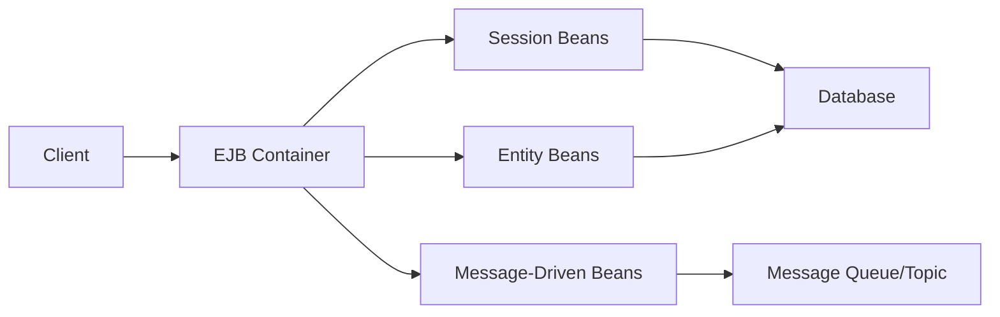

## Unit 4 - Enterprise Java Bean

- Enterprise Java Bean (EJB) is a technology for developing scalable, robust and secure enterprise applications in Java.
- EJB applications run inside an EJB container, which provides middleware services such as security, transaction management, concurrency, dependency injection, etc .
- EJB applications can use three types of beans: session beans, entity beans and message-driven beans.
- Session beans are used to implement business logic and can be stateless, stateful or singleton .
- Entity beans are used to persist data and can be container-managed or bean-managed .
- Message-driven beans are used to process asynchronous messages from a message queue or topic .
- EJB applications can use annotations from the EJB spec to define the bean type, lifecycle callbacks, transaction attributes, etc.
- EJB applications can also use XML deployment descriptors to configure the beans and their properties.
- EJB applications can communicate with other components using local or remote interfaces, or web services.
- EJB applications can access resources such as databases, JMS providers, mail servers, etc using resource injection or JNDI lookup.

The below diagram shows the components of an EJB application and how they interact with each other:

