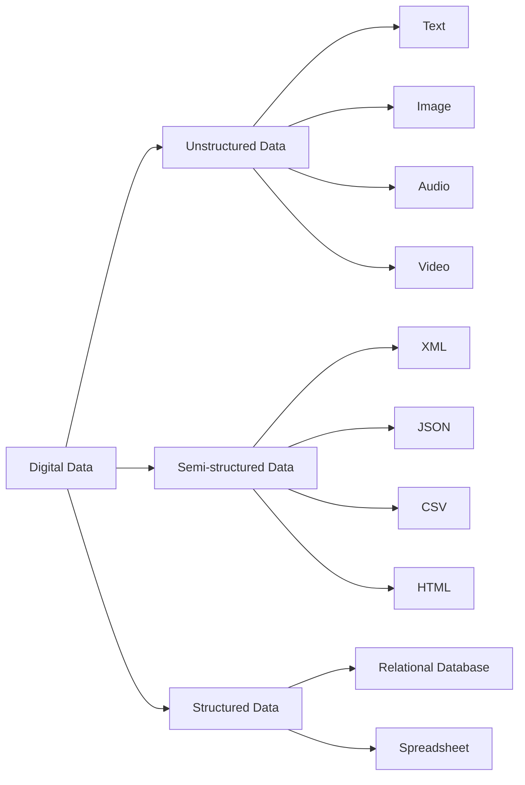

### Types of digital data

Digital data is any information that can be stored, processed, or transmitted in a digital form, such as binary digits (bits) or characters. Digital data can be contrasted with analog data, which is represented by a value from a continuous range of real numbers.

There are three main types of digital data:

- **Unstructured data**: This is data that has no predefined format or structure, and is often in the form of text, images, audio, video, or other media. Unstructured data accounts for the majority of the digital data that makes up big data, and is difficult to analyze and extract information from. Examples of unstructured data include email, text messages, invoices, social media posts, web pages, etc. 
- **Semi-structured data**: This is data that has some level of organization or structure, but not in a fixed or rigid format. Semi-structured data often contains metadata, such as tags, labels, or attributes, that describe the data or its elements. Semi-structured data can be easier to process and query than unstructured data, but still requires some parsing or transformation. Examples of semi-structured data include XML, JSON, CSV, HTML, etc.
- **Structured data**: This is data that has a well-defined format and structure, and is usually stored in a database or a spreadsheet. Structured data can be easily accessed, manipulated, and analyzed using standard tools and methods, such as SQL or Excel. Structured data is often in the form of tables, records, or fields, with each element having a specific data type and value. Examples of structured data include relational databases, spreadsheets, etc.

The following diagram illustrates the different types of digital data and some examples:

