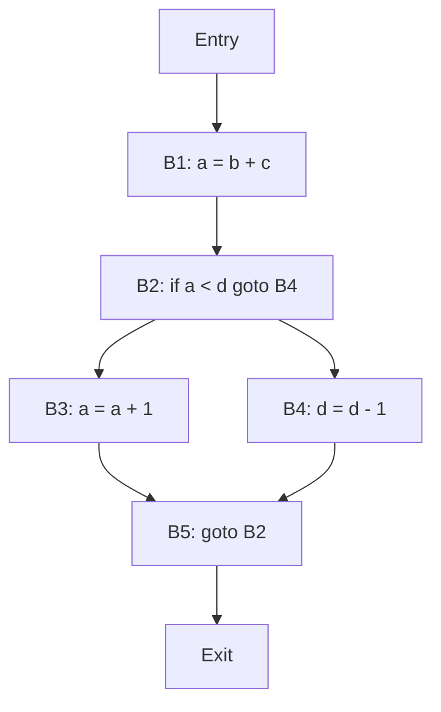

# Basic Blocks and Flow Graphs

- A **basic block** is a set of statements that always executes in a sequence one after the other, without any branches or jumps  .
- A basic block has a single entry point and a single exit point. It means the flow of control enters at the beginning and leaves at the end of the block .
- A basic block can be identified by using the following rules :
  - The first statement of the program is a leader (the beginning of a basic block).
  - Any statement that is the target of a jump (conditional or unconditional) is a leader.
  - Any statement that immediately follows a jump is a leader.
- A **flow graph** is a directed graph that represents the flow of control between basic blocks   .
- A flow graph has the following properties  :
  - Each node in the graph corresponds to a basic block.
  - There is an edge from node X to node Y if the flow of control can pass from the end of block X to the beginning of block Y.
  - The node with no predecessors is the entry node of the graph.
  - The node with no successors is the exit node of the graph.
- A flow graph is useful for code optimization and code generation  .
- An example of a flow graph is shown below :

