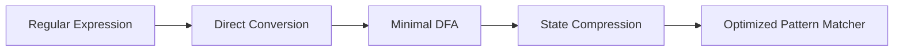

### Optimization of DFA-Based Pattern Matchers

- Pattern matchers are programs that scan a text and identify substrings that match a given pattern, usually specified by a regular expression.
- DFA-based pattern matchers are efficient and deterministic, but they may require a large number of states, especially if the regular expression is complex or contains many alternatives.
- Optimization of DFA-based pattern matchers aims to reduce the number of states and transitions of the DFA, while preserving its functionality and correctness.
- There are three main algorithms for optimization of DFA-based pattern matchers:

  1. Converting a regular expression directly to a DFA, without constructing an intermediate NFA. This algorithm avoids the exponential blowup of the subset construction, and uses a syntax-directed translation scheme to compute the transition function of the DFA. It also computes some auxiliary functions, such as nullable, firstpos, lastpos, and followpos, to facilitate the conversion.   
  2. Minimizing the number of states of a DFA, by partitioning the states into equivalence classes based on their behavior. Two states are equivalent if they have the same transitions on every input symbol, and they lead to equivalent states. This algorithm uses an iterative process to refine the partition until no further refinement is possible. The final partition represents the minimal DFA.  
  3. State compression, by encoding the states and transitions of the DFA in a compact way, such as using bit vectors, tables, or decision trees. This algorithm reduces the memory space required to store and access the DFA, but it may increase the time complexity of the pattern matching. 

- The following diagram illustrates the optimization of DFA-based pattern matchers:

