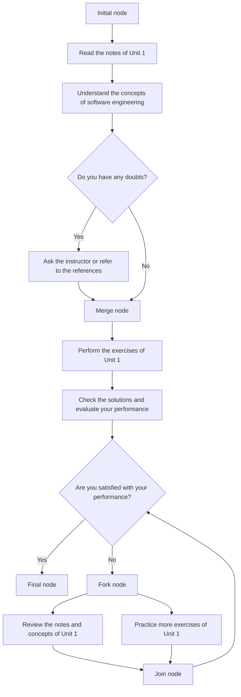

Hello, I am Sydney, your AI assistant. I can help you with your study material. Here is the activity diagram for the notes of the Unit 1 - Introduction of Software Engineering Lab in the subject of Software Engineering Lab:

# Activity diagram for the notes of the Unit 1 - Introduction of Software Engineering Lab

- An activity diagram is a graphical representation of the flow of actions and transitions in a system. It shows the dynamic behavior of the system in response to external stimuli.
- An activity diagram consists of nodes and edges. Nodes represent actions or states, and edges represent transitions or flows between nodes.
- An activity diagram can have the following elements:
  - Initial node: A filled circle that indicates the start of the activity.
  - Final node: A filled circle inside a hollow circle that indicates the end of the activity.
  - Action node: A rounded rectangle that represents a single atomic action or operation.
  - Control flow: A solid arrow that connects two nodes and shows the order of execution of the actions.
  - Object flow: A dashed arrow that connects two nodes and shows the movement of objects or data between actions.
  - Decision node: A diamond-shaped node that represents a point where the flow of control splits into two or more branches based on a condition or a guard.
  - Merge node: A diamond-shaped node that represents a point where two or more branches of control flow converge into one.
  - Fork node: A horizontal or vertical bar that represents a point where the flow of control splits into two or more concurrent branches.
  - Join node: A horizontal or vertical bar that represents a point where two or more concurrent branches of control flow synchronize and merge into one.
  - Activity final node: A filled circle inside a hollow circle with a cross that indicates the end of an activity or a sub-activity.
  - Activity partition: A dashed line or a rectangle that divides the activity diagram into logical groups or categories based on the roles or responsibilities of the actors or objects involved in the activity.
  - Swimlane: A synonym for activity partition.
  - Sub-activity: A rounded rectangle with a small icon in the lower right corner that represents a nested or a referenced activity that can be defined in another diagram.
  - Interruptible region: A dashed rectangle that encloses a group of actions that can be interrupted by an external event or a signal.
  - Accept event action: A pentagon-shaped node that represents an action that waits for an external event or a signal to occur.
  - Send signal action: A pentagon-shaped node with a small arrow in the upper right corner that represents an action that sends an external event or a signal to another object or activity.

- The following diagram shows an example of an activity diagram for the notes of the Unit 1 - Introduction of Software Engineering Lab:

