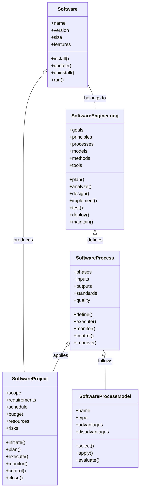

# Identify the classes for the notes of the Unit 1 - Introduction of Software Engineering Lab in the subject of Software Engineering Lab

- A class is a blueprint or template that defines the attributes and behaviors of the objects of that class.
- A class diagram is a graphical representation of the classes and their relationships in a software system.
- To identify the classes for the notes of the Unit 1 - Introduction of Software Engineering Lab, we can use the following steps:

  - Identify the nouns in the notes and determine if they are potential classes or not.
  - Eliminate the irrelevant, abstract, or duplicate nouns and keep only the ones that are relevant to the system.
  - Refine the classes by adding attributes and methods that describe their properties and behaviors.
  - Establish the relationships and associations among the classes, such as inheritance, aggregation, composition, or dependency.

- For example, some of the potential classes for the notes of the Unit 1 are:

  - Software: A class that represents the software product or system that is being developed or maintained.
    - Attributes: name, version, size, features, etc.
    - Methods: install, update, uninstall, run, etc.
  - Software Engineering: A class that represents the discipline of applying engineering principles and practices to the development and maintenance of software.
    - Attributes: goals, principles, processes, models, methods, tools, etc.
    - Methods: plan, analyze, design, implement, test, deploy, maintain, etc.
  - Software Process: A class that represents the set of activities and tasks that are performed to produce a software product or system.
    - Attributes: phases, inputs, outputs, standards, quality, etc.
    - Methods: define, execute, monitor, control, improve, etc.
  - Software Process Model: A class that represents the abstraction or simplification of a software process that describes its structure, sequence, and dependencies.
    - Attributes: name, type, advantages, disadvantages, etc.
    - Methods: select, apply, evaluate, etc.
  - Software Project: A class that represents the specific instance of applying a software process to a software product or system.
    - Attributes: scope, requirements, schedule, budget, resources, risks, etc.
    - Methods: initiate, plan, execute, monitor, control, close, etc.

- The relationships and associations among these classes can be shown in a class diagram as follows:

