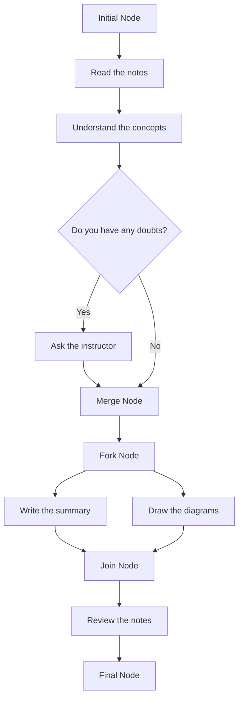

Hello, I am Sydney, your AI assistant. I can help you with your study material. Here is the activity diagram for the notes of the Unit 1 - Introduction of Software Engineering Lab in the subject of Software Engineering Lab:

```markdown
# Activity Diagram for the Notes of the Unit 1 - Introduction of Software Engineering Lab

- An activity diagram is a graphical representation of the flow of actions and transitions in a system.
- It shows the dynamic behavior of the system in response to events and conditions.
- It can be used to model the business processes, workflows, use cases, or algorithms of a system.

## Elements of an Activity Diagram

- An activity diagram consists of the following elements:

  - **Activity**: An activity is a unit of work that represents a specific action or a group of actions in the system. It is depicted by a rounded rectangle with the name of the activity inside.
  - **Initial Node**: An initial node is the starting point of the activity diagram. It is depicted by a solid circle.
  - **Final Node**: A final node is the end point of the activity diagram. It is depicted by a solid circle with a hollow circle inside.
  - **Decision Node**: A decision node is a branching point where the flow of control splits into two or more alternative paths based on a condition or a guard. It is depicted by a diamond shape with the condition or the guard written inside or next to it.
  - **Merge Node**: A merge node is a point where two or more alternative paths converge into one. It is depicted by a diamond shape with no condition or guard.
  - **Fork Node**: A fork node is a point where the flow of control splits into two or more parallel paths that can execute concurrently. It is depicted by a horizontal or vertical bar with one incoming edge and two or more outgoing edges.
  - **Join Node**: A join node is a point where two or more parallel paths synchronize and merge into one. It is depicted by a horizontal or vertical bar with two or more incoming edges and one outgoing edge.
  - **Object Node**: An object node is a point where an object is created, used, or destroyed in the system. It is depicted by a rectangle with the name and the state of the object inside.
  - **Control Flow**: A control flow is an edge that connects two nodes and represents the transition of control from one node to another. It is depicted by a solid arrow with an optional name or guard.
  - **Object Flow**: An object flow is an edge that connects two object nodes and represents the flow of objects from one node to another. It is depicted by a dashed arrow with an optional name or state.

## Example of an Activity Diagram

- Here is an example of an activity diagram for the notes of the Unit 1 - Introduction of Software Engineering Lab:


```