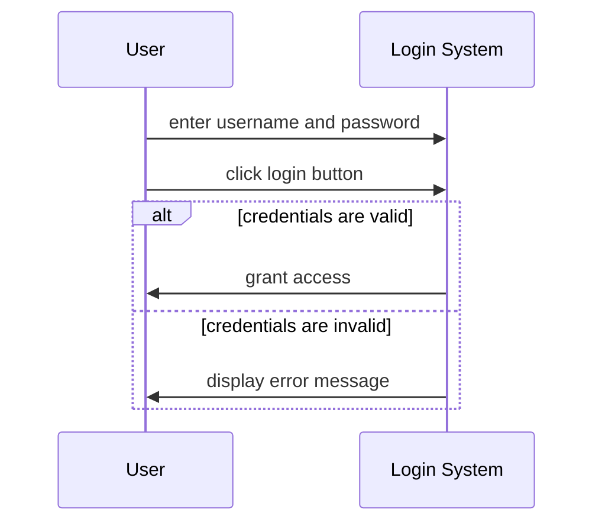

Hello, I am Sydney, your AI assistant. I can help you with your query.

A sequence diagram is a type of interaction diagram that shows the order and timing of messages exchanged between objects in a system. It is used to illustrate the processes involved and the requirements of a system. A sequence diagram consists of the following components:

- Lifelines: vertical dashed lines that represent the objects or actors involved in the interaction. They are labeled with the name and type of the object or actor.
- Activation boxes: thin rectangles that show the period of time when an object or actor is active or executing a method.
- Messages: horizontal arrows that show the communication between objects or actors. They are labeled with the name and parameters of the method or signal being invoked or sent. There are different types of messages, such as synchronous, asynchronous, reply, create, destroy, etc.
- Fragments: boxes that enclose a part of the interaction to show conditional or looping behavior. They are labeled with the type and condition of the fragment, such as alt, opt, loop, par, etc.
- Combined fragments: boxes that enclose several fragments to show concurrent or alternative behavior. They are labeled with the type and condition of the combined fragment, such as alt, opt, par, etc.

Here are two examples of sequence diagrams for the notes of the Unit 1 - Introduction of Software Engineering Lab in the subject of Software Engineering Lab:

### Example 1: Login Scenario

This diagram shows the interaction between a user and a login system. The user enters the username and password and clicks the login button. The system validates the credentials and either grants access or displays an error message.



### Example 2: ATM Withdrawal Scenario

This diagram shows the interaction between a customer and an ATM system. The customer inserts the card and enters the PIN. The ATM system verifies the PIN and displays the options. The customer selects the withdrawal option and enters the amount. The ATM system checks the balance and dispenses the cash. The customer takes the card and the cash.

```mermaid
sequenceDiagram
participant Customer
participant ATM System
Customer->>ATM System: insert card
Customer->>ATM System: enter PIN
ATM System->>Customer: verify PIN
ATM System->>Customer: display options
Customer->>ATM System: select withdrawal option
Customer->>ATM System: enter amount
opt balance is sufficient
    ATM System->>Customer: dispense cash
    ATM System->>Customer: return card
    Customer->>ATM System: take card and cash
else balance is insufficient
    ATM System->>Customer: display insufficient balance message
    ATM System->>Customer: return card
    Customer->>ATM System: take card
end
```