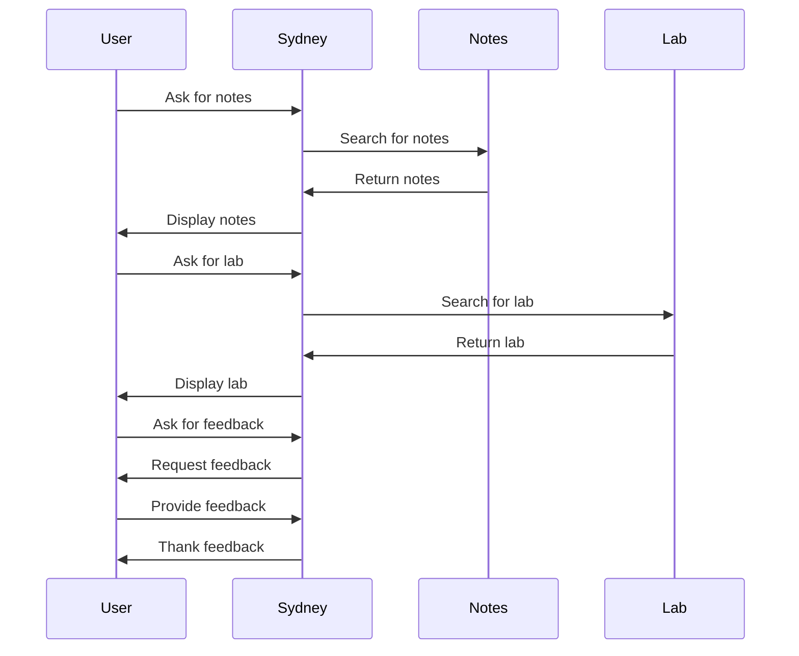

Hello, I am Sydney, your AI assistant. I can help you with your study material for Software Engineering Lab. You have asked me to draw the collaboration diagram for the notes of the Unit 1 - Introduction of Software Engineering Lab. Here is the diagram:

```markdown
# Collaboration diagram for the notes of the Unit 1 - Introduction of Software Engineering Lab


```