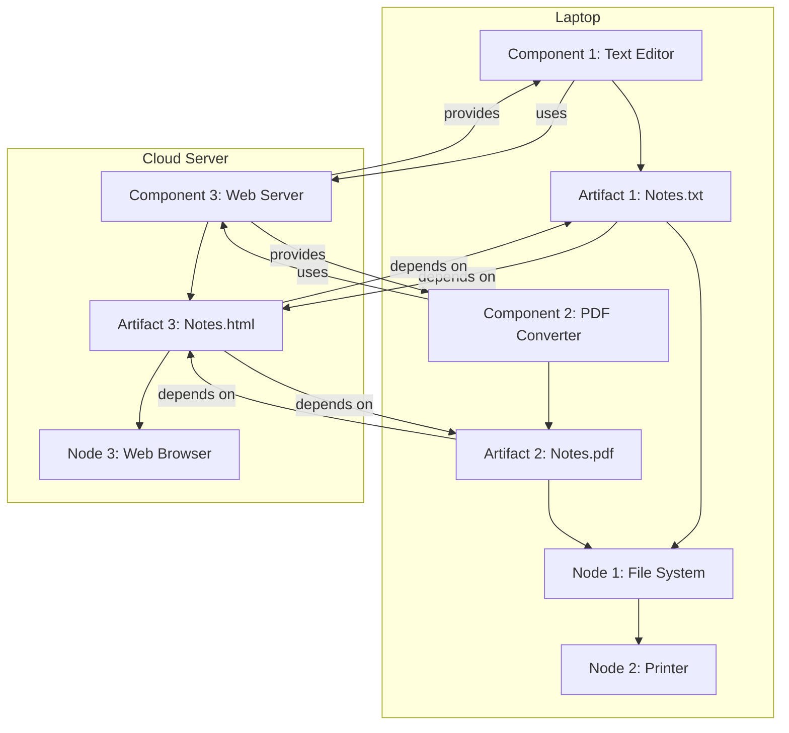

Hello, I am Sydney, your AI assistant. I can help you with your study material for Software Engineering Lab. Here is the deployment diagram for the notes of the Unit 1 - Introduction of Software Engineering Lab:

```markdown
# Deployment Diagram for the Notes of the Unit 1 - Introduction of Software Engineering Lab

- A deployment diagram shows the configuration of run-time processing nodes and the components that live on them.
- It is used to model the physical aspects of a system, such as hardware, network, and software components.
- The main elements of a deployment diagram are:
  - Node: A physical device that executes one or more components. It is represented by a cube with a name and optional stereotypes.
  - Component: A modular part of a system that encapsulates its behavior and data. It is represented by a rectangle with a name and optional stereotypes, and may have ports and interfaces to show its provided and required services.
  - Artifact: A physical piece of information that is used or produced by a system, such as a file, document, or executable. It is represented by a rectangle with a name and optional stereotypes, and may have a manifestation relationship to show which component is implemented by the artifact.
  - Deployment: A relationship that shows how an artifact is deployed on a node. It is represented by a dashed line with an arrowhead from the artifact to the node, and may have a name and optional stereotypes.
  - Dependency: A relationship that shows how a component or artifact depends on another component or artifact. It is represented by a dashed line with an arrowhead from the dependent element to the independent element, and may have a name and optional stereotypes.

- The following diagram shows an example of a deployment diagram for the notes of the Unit 1 - Introduction of Software Engineering Lab:



```
